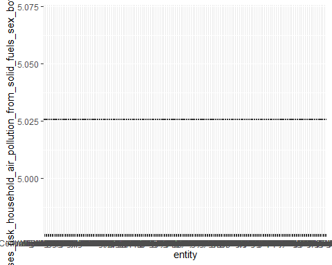

# Analysis of Indoor Air Quality


::: {.cell}

```{.r .cell-code}
library(tidyverse)
```

::: {.cell-output .cell-output-stderr}
```
── Attaching packages ─────────────────────────────────────── tidyverse 1.3.2 ──
✔ ggplot2 3.4.0     ✔ purrr   1.0.1
✔ tibble  3.1.8     ✔ dplyr   1.1.0
✔ tidyr   1.3.0     ✔ stringr 1.5.0
✔ readr   2.1.3     ✔ forcats 1.0.0
── Conflicts ────────────────────────────────────────── tidyverse_conflicts() ──
✖ dplyr::filter() masks stats::filter()
✖ dplyr::lag()    masks stats::lag()
```
:::

```{.r .cell-code}
library(kableExtra)
```

::: {.cell-output .cell-output-stderr}
```

Attaching package: 'kableExtra'

The following object is masked from 'package:dplyr':

    group_rows
```
:::

```{.r .cell-code}
library(ggplot2)
library(tidymodels)
```

::: {.cell-output .cell-output-stderr}
```
── Attaching packages ────────────────────────────────────── tidymodels 1.0.0 ──
✔ broom        1.0.3     ✔ rsample      1.1.1
✔ dials        1.1.0     ✔ tune         1.0.1
✔ infer        1.0.4     ✔ workflows    1.1.2
✔ modeldata    1.1.0     ✔ workflowsets 1.0.0
✔ parsnip      1.0.3     ✔ yardstick    1.1.0
✔ recipes      1.0.4     
── Conflicts ───────────────────────────────────────── tidymodels_conflicts() ──
✖ scales::discard()        masks purrr::discard()
✖ dplyr::filter()          masks stats::filter()
✖ recipes::fixed()         masks stringr::fixed()
✖ kableExtra::group_rows() masks dplyr::group_rows()
✖ dplyr::lag()             masks stats::lag()
✖ yardstick::spec()        masks readr::spec()
✖ recipes::step()          masks stats::step()
• Use tidymodels_prefer() to resolve common conflicts.
```
:::

```{.r .cell-code}
library(janitor)
```

::: {.cell-output .cell-output-stderr}
```

Attaching package: 'janitor'

The following objects are masked from 'package:stats':

    chisq.test, fisher.test
```
:::

```{.r .cell-code}
library(magrittr)
```

::: {.cell-output .cell-output-stderr}
```

Attaching package: 'magrittr'

The following object is masked from 'package:purrr':

    set_names

The following object is masked from 'package:tidyr':

    extract
```
:::

```{.r .cell-code}
 library(dplyr)

indoor_pollution <- readr::read_csv('https://raw.githubusercontent.com/rfordatascience/tidytuesday/master/data/2022/2022-04-12/indoor_pollution.csv') %>%

clean_names()
```

::: {.cell-output .cell-output-stderr}
```
Rows: 8010 Columns: 4
── Column specification ────────────────────────────────────────────────────────
Delimiter: ","
chr (2): Entity, Code
dbl (2): Year, Deaths - Cause: All causes - Risk: Household air pollution fr...

ℹ Use `spec()` to retrieve the full column specification for this data.
ℹ Specify the column types or set `show_col_types = FALSE` to quiet this message.
```
:::
:::

::: {.cell}

```{.r .cell-code}
 iap_splits <- initial_split(indoor_pollution, prop = 0.15,
                                   pool = 1) 

exploratory_data <- training(iap_splits)
test_data <- testing(iap_splits)

head(exploratory_data) %>%
  
  rename(percent_deaths_by_household_pollution = deaths_cause_all_causes_risk_household_air_pollution_from_solid_fuels_sex_both_age_age_standardized_percent) %>% #shorten the long name 
  
kable() %>%
    kable_styling(bootstrap_options = c("hover", "striped"))
```

::: {.cell-output-display}

`````{=html}
<table class="table table-hover table-striped" style="margin-left: auto; margin-right: auto;">
 <thead>
  <tr>
   <th style="text-align:left;"> entity </th>
   <th style="text-align:left;"> code </th>
   <th style="text-align:right;"> year </th>
   <th style="text-align:right;"> percent_deaths_by_household_pollution </th>
  </tr>
 </thead>
<tbody>
  <tr>
   <td style="text-align:left;"> Estonia </td>
   <td style="text-align:left;"> EST </td>
   <td style="text-align:right;"> 1995 </td>
   <td style="text-align:right;"> 1.5332729 </td>
  </tr>
  <tr>
   <td style="text-align:left;"> Brazil </td>
   <td style="text-align:left;"> BRA </td>
   <td style="text-align:right;"> 2019 </td>
   <td style="text-align:right;"> 0.9950679 </td>
  </tr>
  <tr>
   <td style="text-align:left;"> Finland </td>
   <td style="text-align:left;"> FIN </td>
   <td style="text-align:right;"> 1994 </td>
   <td style="text-align:right;"> 0.0343007 </td>
  </tr>
  <tr>
   <td style="text-align:left;"> Slovakia </td>
   <td style="text-align:left;"> SVK </td>
   <td style="text-align:right;"> 1997 </td>
   <td style="text-align:right;"> 0.2120123 </td>
  </tr>
  <tr>
   <td style="text-align:left;"> Nauru </td>
   <td style="text-align:left;"> NRU </td>
   <td style="text-align:right;"> 2015 </td>
   <td style="text-align:right;"> 0.8636590 </td>
  </tr>
  <tr>
   <td style="text-align:left;"> Equatorial Guinea </td>
   <td style="text-align:left;"> GNQ </td>
   <td style="text-align:right;"> 2018 </td>
   <td style="text-align:right;"> 1.6571320 </td>
  </tr>
</tbody>
</table>

`````

:::
:::


::: callout-note
**Observation:**

This data set contains variables gathered across multiple years, listing the percent of deaths caused by indoor air pollutants created from indoor combustion. Given the amount of data present in this dataset, several potential hypotheses could likely be considered.

The data, listed by country and region, are mixed in the dataset and will likely require some cleaning to separate. categorical data and contains variables that were collected over many years.

-   Depending on the scope of research, it may be more useful to focus on the dataset containing regional data rather than country-specific to highlight what role climate plays in the effect of indoor air pollution.

    -   In temperate climates, it is more likely to use biofuels for heating as well as cooking. Alongside the availability of insulation material for homes that reduced the ability for indoor and outdoor atmosphere gas exchange, this may be an essential factor that could be compared with this data.

    -   Using the temporal variable that is available in this data, some conclusions could be made about the

-   focusing on the countries rather than regions in this data could be used to show how countries that have invested in new technologies or better homes could correlate with either improved or worsened indoor air quality. Suppose homes are made more insulated but old gas stoves and wood fires are built into them. In that case, it is possible that the data could show up to a point a worsened impact on indoor air quality is associated with a country's growth in economic opportunity.
:::


::: {.cell}

```{.r .cell-code}
exploratory_data %>%
  
  rename(percent_deaths_by_household_pollution = deaths_cause_all_causes_risk_household_air_pollution_from_solid_fuels_sex_both_age_age_standardized_percent) %>% #shorten the long name 
  
  kable() %>%
    kable_styling(bootstrap_options = c("hover", "striped"))
```

::: {.cell-output-display}

`````{=html}
<table class="table table-hover table-striped" style="margin-left: auto; margin-right: auto;">
 <thead>
  <tr>
   <th style="text-align:left;"> entity </th>
   <th style="text-align:left;"> code </th>
   <th style="text-align:right;"> year </th>
   <th style="text-align:right;"> percent_deaths_by_household_pollution </th>
  </tr>
 </thead>
<tbody>
  <tr>
   <td style="text-align:left;"> Estonia </td>
   <td style="text-align:left;"> EST </td>
   <td style="text-align:right;"> 1995 </td>
   <td style="text-align:right;"> 1.5332729 </td>
  </tr>
  <tr>
   <td style="text-align:left;"> Brazil </td>
   <td style="text-align:left;"> BRA </td>
   <td style="text-align:right;"> 2019 </td>
   <td style="text-align:right;"> 0.9950679 </td>
  </tr>
  <tr>
   <td style="text-align:left;"> Finland </td>
   <td style="text-align:left;"> FIN </td>
   <td style="text-align:right;"> 1994 </td>
   <td style="text-align:right;"> 0.0343007 </td>
  </tr>
  <tr>
   <td style="text-align:left;"> Slovakia </td>
   <td style="text-align:left;"> SVK </td>
   <td style="text-align:right;"> 1997 </td>
   <td style="text-align:right;"> 0.2120123 </td>
  </tr>
  <tr>
   <td style="text-align:left;"> Nauru </td>
   <td style="text-align:left;"> NRU </td>
   <td style="text-align:right;"> 2015 </td>
   <td style="text-align:right;"> 0.8636590 </td>
  </tr>
  <tr>
   <td style="text-align:left;"> Equatorial Guinea </td>
   <td style="text-align:left;"> GNQ </td>
   <td style="text-align:right;"> 2018 </td>
   <td style="text-align:right;"> 1.6571320 </td>
  </tr>
  <tr>
   <td style="text-align:left;"> Albania </td>
   <td style="text-align:left;"> ALB </td>
   <td style="text-align:right;"> 2018 </td>
   <td style="text-align:right;"> 3.1699159 </td>
  </tr>
  <tr>
   <td style="text-align:left;"> New Zealand </td>
   <td style="text-align:left;"> NZL </td>
   <td style="text-align:right;"> 1998 </td>
   <td style="text-align:right;"> 0.0324117 </td>
  </tr>
  <tr>
   <td style="text-align:left;"> Jamaica </td>
   <td style="text-align:left;"> JAM </td>
   <td style="text-align:right;"> 2004 </td>
   <td style="text-align:right;"> 1.8212869 </td>
  </tr>
  <tr>
   <td style="text-align:left;"> North Africa and Middle East </td>
   <td style="text-align:left;"> NA </td>
   <td style="text-align:right;"> 1998 </td>
   <td style="text-align:right;"> 4.3593177 </td>
  </tr>
  <tr>
   <td style="text-align:left;"> Serbia </td>
   <td style="text-align:left;"> SRB </td>
   <td style="text-align:right;"> 2015 </td>
   <td style="text-align:right;"> 1.8118834 </td>
  </tr>
  <tr>
   <td style="text-align:left;"> Armenia </td>
   <td style="text-align:left;"> ARM </td>
   <td style="text-align:right;"> 2015 </td>
   <td style="text-align:right;"> 0.3634129 </td>
  </tr>
  <tr>
   <td style="text-align:left;"> World Bank Upper Middle Income </td>
   <td style="text-align:left;"> NA </td>
   <td style="text-align:right;"> 1994 </td>
   <td style="text-align:right;"> 9.2359180 </td>
  </tr>
  <tr>
   <td style="text-align:left;"> Qatar </td>
   <td style="text-align:left;"> QAT </td>
   <td style="text-align:right;"> 2015 </td>
   <td style="text-align:right;"> 0.0014198 </td>
  </tr>
  <tr>
   <td style="text-align:left;"> Fiji </td>
   <td style="text-align:left;"> FJI </td>
   <td style="text-align:right;"> 2000 </td>
   <td style="text-align:right;"> 7.9195138 </td>
  </tr>
  <tr>
   <td style="text-align:left;"> Qatar </td>
   <td style="text-align:left;"> QAT </td>
   <td style="text-align:right;"> 1995 </td>
   <td style="text-align:right;"> 0.0259629 </td>
  </tr>
  <tr>
   <td style="text-align:left;"> Nordic Region </td>
   <td style="text-align:left;"> NA </td>
   <td style="text-align:right;"> 2007 </td>
   <td style="text-align:right;"> 0.0083629 </td>
  </tr>
  <tr>
   <td style="text-align:left;"> Palau </td>
   <td style="text-align:left;"> PLW </td>
   <td style="text-align:right;"> 1998 </td>
   <td style="text-align:right;"> 0.0078553 </td>
  </tr>
  <tr>
   <td style="text-align:left;"> Qatar </td>
   <td style="text-align:left;"> QAT </td>
   <td style="text-align:right;"> 2007 </td>
   <td style="text-align:right;"> 0.0043172 </td>
  </tr>
  <tr>
   <td style="text-align:left;"> Croatia </td>
   <td style="text-align:left;"> HRV </td>
   <td style="text-align:right;"> 1993 </td>
   <td style="text-align:right;"> 1.4588077 </td>
  </tr>
  <tr>
   <td style="text-align:left;"> Ghana </td>
   <td style="text-align:left;"> GHA </td>
   <td style="text-align:right;"> 2019 </td>
   <td style="text-align:right;"> 6.1180871 </td>
  </tr>
  <tr>
   <td style="text-align:left;"> Denmark </td>
   <td style="text-align:left;"> DNK </td>
   <td style="text-align:right;"> 1991 </td>
   <td style="text-align:right;"> 0.0213333 </td>
  </tr>
  <tr>
   <td style="text-align:left;"> Romania </td>
   <td style="text-align:left;"> ROU </td>
   <td style="text-align:right;"> 2018 </td>
   <td style="text-align:right;"> 0.9399307 </td>
  </tr>
  <tr>
   <td style="text-align:left;"> Barbados </td>
   <td style="text-align:left;"> BRB </td>
   <td style="text-align:right;"> 2019 </td>
   <td style="text-align:right;"> 0.0064758 </td>
  </tr>
  <tr>
   <td style="text-align:left;"> Egypt </td>
   <td style="text-align:left;"> EGY </td>
   <td style="text-align:right;"> 1997 </td>
   <td style="text-align:right;"> 0.6752659 </td>
  </tr>
  <tr>
   <td style="text-align:left;"> Switzerland </td>
   <td style="text-align:left;"> CHE </td>
   <td style="text-align:right;"> 2000 </td>
   <td style="text-align:right;"> 0.0057632 </td>
  </tr>
  <tr>
   <td style="text-align:left;"> Kuwait </td>
   <td style="text-align:left;"> KWT </td>
   <td style="text-align:right;"> 2018 </td>
   <td style="text-align:right;"> 0.0061398 </td>
  </tr>
  <tr>
   <td style="text-align:left;"> High-income Asia Pacific </td>
   <td style="text-align:left;"> NA </td>
   <td style="text-align:right;"> 2002 </td>
   <td style="text-align:right;"> 0.0215558 </td>
  </tr>
  <tr>
   <td style="text-align:left;"> Argentina </td>
   <td style="text-align:left;"> ARG </td>
   <td style="text-align:right;"> 1998 </td>
   <td style="text-align:right;"> 0.8604697 </td>
  </tr>
  <tr>
   <td style="text-align:left;"> Armenia </td>
   <td style="text-align:left;"> ARM </td>
   <td style="text-align:right;"> 1991 </td>
   <td style="text-align:right;"> 4.0882094 </td>
  </tr>
  <tr>
   <td style="text-align:left;"> Georgia </td>
   <td style="text-align:left;"> GEO </td>
   <td style="text-align:right;"> 2016 </td>
   <td style="text-align:right;"> 3.5799469 </td>
  </tr>
  <tr>
   <td style="text-align:left;"> Suriname </td>
   <td style="text-align:left;"> SUR </td>
   <td style="text-align:right;"> 2018 </td>
   <td style="text-align:right;"> 1.1171319 </td>
  </tr>
  <tr>
   <td style="text-align:left;"> American Samoa </td>
   <td style="text-align:left;"> ASM </td>
   <td style="text-align:right;"> 2016 </td>
   <td style="text-align:right;"> 1.7100601 </td>
  </tr>
  <tr>
   <td style="text-align:left;"> East Asia </td>
   <td style="text-align:left;"> NA </td>
   <td style="text-align:right;"> 2012 </td>
   <td style="text-align:right;"> 5.5455219 </td>
  </tr>
  <tr>
   <td style="text-align:left;"> Philippines </td>
   <td style="text-align:left;"> PHL </td>
   <td style="text-align:right;"> 2004 </td>
   <td style="text-align:right;"> 9.3589924 </td>
  </tr>
  <tr>
   <td style="text-align:left;"> Madagascar </td>
   <td style="text-align:left;"> MDG </td>
   <td style="text-align:right;"> 1991 </td>
   <td style="text-align:right;"> 15.5508136 </td>
  </tr>
  <tr>
   <td style="text-align:left;"> Guyana </td>
   <td style="text-align:left;"> GUY </td>
   <td style="text-align:right;"> 2002 </td>
   <td style="text-align:right;"> 2.8384684 </td>
  </tr>
  <tr>
   <td style="text-align:left;"> Sub-Saharan Africa - World Bank region </td>
   <td style="text-align:left;"> NA </td>
   <td style="text-align:right;"> 2017 </td>
   <td style="text-align:right;"> 9.5344644 </td>
  </tr>
  <tr>
   <td style="text-align:left;"> Ecuador </td>
   <td style="text-align:left;"> ECU </td>
   <td style="text-align:right;"> 2012 </td>
   <td style="text-align:right;"> 0.8580190 </td>
  </tr>
  <tr>
   <td style="text-align:left;"> Malawi </td>
   <td style="text-align:left;"> MWI </td>
   <td style="text-align:right;"> 2015 </td>
   <td style="text-align:right;"> 11.4689883 </td>
  </tr>
  <tr>
   <td style="text-align:left;"> Lesotho </td>
   <td style="text-align:left;"> LSO </td>
   <td style="text-align:right;"> 2014 </td>
   <td style="text-align:right;"> 6.2920446 </td>
  </tr>
  <tr>
   <td style="text-align:left;"> Middle East &amp; North Africa </td>
   <td style="text-align:left;"> NA </td>
   <td style="text-align:right;"> 2005 </td>
   <td style="text-align:right;"> 1.2389699 </td>
  </tr>
  <tr>
   <td style="text-align:left;"> Wales </td>
   <td style="text-align:left;"> NA </td>
   <td style="text-align:right;"> 2004 </td>
   <td style="text-align:right;"> 0.0068516 </td>
  </tr>
  <tr>
   <td style="text-align:left;"> North Korea </td>
   <td style="text-align:left;"> PRK </td>
   <td style="text-align:right;"> 2004 </td>
   <td style="text-align:right;"> 18.2266858 </td>
  </tr>
  <tr>
   <td style="text-align:left;"> North America </td>
   <td style="text-align:left;"> NA </td>
   <td style="text-align:right;"> 1992 </td>
   <td style="text-align:right;"> 0.0182887 </td>
  </tr>
  <tr>
   <td style="text-align:left;"> Kenya </td>
   <td style="text-align:left;"> KEN </td>
   <td style="text-align:right;"> 2007 </td>
   <td style="text-align:right;"> 8.7403164 </td>
  </tr>
  <tr>
   <td style="text-align:left;"> Madagascar </td>
   <td style="text-align:left;"> MDG </td>
   <td style="text-align:right;"> 2002 </td>
   <td style="text-align:right;"> 16.2399285 </td>
  </tr>
  <tr>
   <td style="text-align:left;"> Namibia </td>
   <td style="text-align:left;"> NAM </td>
   <td style="text-align:right;"> 2016 </td>
   <td style="text-align:right;"> 5.0355685 </td>
  </tr>
  <tr>
   <td style="text-align:left;"> Vanuatu </td>
   <td style="text-align:left;"> VUT </td>
   <td style="text-align:right;"> 1993 </td>
   <td style="text-align:right;"> 18.3542931 </td>
  </tr>
  <tr>
   <td style="text-align:left;"> Sao Tome and Principe </td>
   <td style="text-align:left;"> STP </td>
   <td style="text-align:right;"> 2016 </td>
   <td style="text-align:right;"> 10.4904230 </td>
  </tr>
  <tr>
   <td style="text-align:left;"> Peru </td>
   <td style="text-align:left;"> PER </td>
   <td style="text-align:right;"> 2002 </td>
   <td style="text-align:right;"> 4.4476277 </td>
  </tr>
  <tr>
   <td style="text-align:left;"> Bolivia </td>
   <td style="text-align:left;"> BOL </td>
   <td style="text-align:right;"> 2018 </td>
   <td style="text-align:right;"> 3.2521099 </td>
  </tr>
  <tr>
   <td style="text-align:left;"> Greenland </td>
   <td style="text-align:left;"> GRL </td>
   <td style="text-align:right;"> 2002 </td>
   <td style="text-align:right;"> 0.3110055 </td>
  </tr>
  <tr>
   <td style="text-align:left;"> Caribbean </td>
   <td style="text-align:left;"> NA </td>
   <td style="text-align:right;"> 2003 </td>
   <td style="text-align:right;"> 4.6699643 </td>
  </tr>
  <tr>
   <td style="text-align:left;"> North America </td>
   <td style="text-align:left;"> NA </td>
   <td style="text-align:right;"> 2019 </td>
   <td style="text-align:right;"> 0.0048903 </td>
  </tr>
  <tr>
   <td style="text-align:left;"> Central Latin America </td>
   <td style="text-align:left;"> NA </td>
   <td style="text-align:right;"> 1991 </td>
   <td style="text-align:right;"> 4.9610560 </td>
  </tr>
  <tr>
   <td style="text-align:left;"> Tonga </td>
   <td style="text-align:left;"> TON </td>
   <td style="text-align:right;"> 2019 </td>
   <td style="text-align:right;"> 4.7387509 </td>
  </tr>
  <tr>
   <td style="text-align:left;"> Western Europe </td>
   <td style="text-align:left;"> NA </td>
   <td style="text-align:right;"> 2009 </td>
   <td style="text-align:right;"> 0.0211374 </td>
  </tr>
  <tr>
   <td style="text-align:left;"> Dominican Republic </td>
   <td style="text-align:left;"> DOM </td>
   <td style="text-align:right;"> 2012 </td>
   <td style="text-align:right;"> 2.0390434 </td>
  </tr>
  <tr>
   <td style="text-align:left;"> Armenia </td>
   <td style="text-align:left;"> ARM </td>
   <td style="text-align:right;"> 2000 </td>
   <td style="text-align:right;"> 3.5532260 </td>
  </tr>
  <tr>
   <td style="text-align:left;"> Saint Kitts and Nevis </td>
   <td style="text-align:left;"> KNA </td>
   <td style="text-align:right;"> 1998 </td>
   <td style="text-align:right;"> 1.0150655 </td>
  </tr>
  <tr>
   <td style="text-align:left;"> El Salvador </td>
   <td style="text-align:left;"> SLV </td>
   <td style="text-align:right;"> 2004 </td>
   <td style="text-align:right;"> 5.0665782 </td>
  </tr>
  <tr>
   <td style="text-align:left;"> Bolivia </td>
   <td style="text-align:left;"> BOL </td>
   <td style="text-align:right;"> 2010 </td>
   <td style="text-align:right;"> 4.5945211 </td>
  </tr>
  <tr>
   <td style="text-align:left;"> Belarus </td>
   <td style="text-align:left;"> BLR </td>
   <td style="text-align:right;"> 1996 </td>
   <td style="text-align:right;"> 0.5738814 </td>
  </tr>
  <tr>
   <td style="text-align:left;"> Germany </td>
   <td style="text-align:left;"> DEU </td>
   <td style="text-align:right;"> 1991 </td>
   <td style="text-align:right;"> 0.0126224 </td>
  </tr>
  <tr>
   <td style="text-align:left;"> Saudi Arabia </td>
   <td style="text-align:left;"> SAU </td>
   <td style="text-align:right;"> 1994 </td>
   <td style="text-align:right;"> 3.6085930 </td>
  </tr>
  <tr>
   <td style="text-align:left;"> England </td>
   <td style="text-align:left;"> NA </td>
   <td style="text-align:right;"> 2011 </td>
   <td style="text-align:right;"> 0.0027964 </td>
  </tr>
  <tr>
   <td style="text-align:left;"> South Africa </td>
   <td style="text-align:left;"> ZAF </td>
   <td style="text-align:right;"> 2005 </td>
   <td style="text-align:right;"> 2.3600294 </td>
  </tr>
  <tr>
   <td style="text-align:left;"> Russia </td>
   <td style="text-align:left;"> RUS </td>
   <td style="text-align:right;"> 2019 </td>
   <td style="text-align:right;"> 0.1296415 </td>
  </tr>
  <tr>
   <td style="text-align:left;"> Kenya </td>
   <td style="text-align:left;"> KEN </td>
   <td style="text-align:right;"> 2006 </td>
   <td style="text-align:right;"> 8.5625091 </td>
  </tr>
  <tr>
   <td style="text-align:left;"> High-income Asia Pacific </td>
   <td style="text-align:left;"> NA </td>
   <td style="text-align:right;"> 2011 </td>
   <td style="text-align:right;"> 0.0090163 </td>
  </tr>
  <tr>
   <td style="text-align:left;"> Central African Republic </td>
   <td style="text-align:left;"> CAF </td>
   <td style="text-align:right;"> 2013 </td>
   <td style="text-align:right;"> 11.1805850 </td>
  </tr>
  <tr>
   <td style="text-align:left;"> Greece </td>
   <td style="text-align:left;"> GRC </td>
   <td style="text-align:right;"> 1994 </td>
   <td style="text-align:right;"> 0.2119029 </td>
  </tr>
  <tr>
   <td style="text-align:left;"> Mauritania </td>
   <td style="text-align:left;"> MRT </td>
   <td style="text-align:right;"> 2000 </td>
   <td style="text-align:right;"> 9.7728002 </td>
  </tr>
  <tr>
   <td style="text-align:left;"> United Arab Emirates </td>
   <td style="text-align:left;"> ARE </td>
   <td style="text-align:right;"> 1992 </td>
   <td style="text-align:right;"> 0.0537671 </td>
  </tr>
  <tr>
   <td style="text-align:left;"> Cuba </td>
   <td style="text-align:left;"> CUB </td>
   <td style="text-align:right;"> 1991 </td>
   <td style="text-align:right;"> 0.9949827 </td>
  </tr>
  <tr>
   <td style="text-align:left;"> Oman </td>
   <td style="text-align:left;"> OMN </td>
   <td style="text-align:right;"> 2004 </td>
   <td style="text-align:right;"> 0.5596392 </td>
  </tr>
  <tr>
   <td style="text-align:left;"> South-East Asia Region </td>
   <td style="text-align:left;"> NA </td>
   <td style="text-align:right;"> 1999 </td>
   <td style="text-align:right;"> 12.1530070 </td>
  </tr>
  <tr>
   <td style="text-align:left;"> Commonwealth Low Income </td>
   <td style="text-align:left;"> NA </td>
   <td style="text-align:right;"> 2014 </td>
   <td style="text-align:right;"> 11.7699174 </td>
  </tr>
  <tr>
   <td style="text-align:left;"> Norway </td>
   <td style="text-align:left;"> NOR </td>
   <td style="text-align:right;"> 1992 </td>
   <td style="text-align:right;"> 0.0198610 </td>
  </tr>
  <tr>
   <td style="text-align:left;"> Bhutan </td>
   <td style="text-align:left;"> BTN </td>
   <td style="text-align:right;"> 1996 </td>
   <td style="text-align:right;"> 16.8582869 </td>
  </tr>
  <tr>
   <td style="text-align:left;"> South-East Asia Region </td>
   <td style="text-align:left;"> NA </td>
   <td style="text-align:right;"> 2011 </td>
   <td style="text-align:right;"> 9.4372820 </td>
  </tr>
  <tr>
   <td style="text-align:left;"> Guam </td>
   <td style="text-align:left;"> GUM </td>
   <td style="text-align:right;"> 2001 </td>
   <td style="text-align:right;"> 0.4362919 </td>
  </tr>
  <tr>
   <td style="text-align:left;"> New Zealand </td>
   <td style="text-align:left;"> NZL </td>
   <td style="text-align:right;"> 2014 </td>
   <td style="text-align:right;"> 0.0095605 </td>
  </tr>
  <tr>
   <td style="text-align:left;"> High-income </td>
   <td style="text-align:left;"> NA </td>
   <td style="text-align:right;"> 1996 </td>
   <td style="text-align:right;"> 0.0959688 </td>
  </tr>
  <tr>
   <td style="text-align:left;"> Palau </td>
   <td style="text-align:left;"> PLW </td>
   <td style="text-align:right;"> 2007 </td>
   <td style="text-align:right;"> 0.0072145 </td>
  </tr>
  <tr>
   <td style="text-align:left;"> OECD Countries </td>
   <td style="text-align:left;"> NA </td>
   <td style="text-align:right;"> 2019 </td>
   <td style="text-align:right;"> 0.1494862 </td>
  </tr>
  <tr>
   <td style="text-align:left;"> Gabon </td>
   <td style="text-align:left;"> GAB </td>
   <td style="text-align:right;"> 2005 </td>
   <td style="text-align:right;"> 3.0366961 </td>
  </tr>
  <tr>
   <td style="text-align:left;"> Georgia </td>
   <td style="text-align:left;"> GEO </td>
   <td style="text-align:right;"> 2007 </td>
   <td style="text-align:right;"> 6.3452612 </td>
  </tr>
  <tr>
   <td style="text-align:left;"> Mauritania </td>
   <td style="text-align:left;"> MRT </td>
   <td style="text-align:right;"> 2010 </td>
   <td style="text-align:right;"> 8.6557928 </td>
  </tr>
  <tr>
   <td style="text-align:left;"> Marshall Islands </td>
   <td style="text-align:left;"> MHL </td>
   <td style="text-align:right;"> 1992 </td>
   <td style="text-align:right;"> 10.3359536 </td>
  </tr>
  <tr>
   <td style="text-align:left;"> Haiti </td>
   <td style="text-align:left;"> HTI </td>
   <td style="text-align:right;"> 2005 </td>
   <td style="text-align:right;"> 14.0740695 </td>
  </tr>
  <tr>
   <td style="text-align:left;"> Lesotho </td>
   <td style="text-align:left;"> LSO </td>
   <td style="text-align:right;"> 1992 </td>
   <td style="text-align:right;"> 11.7222435 </td>
  </tr>
  <tr>
   <td style="text-align:left;"> Western sub-Saharan Africa </td>
   <td style="text-align:left;"> NA </td>
   <td style="text-align:right;"> 1991 </td>
   <td style="text-align:right;"> 12.6549882 </td>
  </tr>
  <tr>
   <td style="text-align:left;"> Montenegro </td>
   <td style="text-align:left;"> MNE </td>
   <td style="text-align:right;"> 2014 </td>
   <td style="text-align:right;"> 2.7279958 </td>
  </tr>
  <tr>
   <td style="text-align:left;"> Commonwealth Middle Income </td>
   <td style="text-align:left;"> NA </td>
   <td style="text-align:right;"> 2016 </td>
   <td style="text-align:right;"> 7.3819891 </td>
  </tr>
  <tr>
   <td style="text-align:left;"> Southeast Asia </td>
   <td style="text-align:left;"> NA </td>
   <td style="text-align:right;"> 1996 </td>
   <td style="text-align:right;"> 10.4173542 </td>
  </tr>
  <tr>
   <td style="text-align:left;"> Europe &amp; Central Asia - World Bank region </td>
   <td style="text-align:left;"> NA </td>
   <td style="text-align:right;"> 1993 </td>
   <td style="text-align:right;"> 1.3408763 </td>
  </tr>
  <tr>
   <td style="text-align:left;"> Oman </td>
   <td style="text-align:left;"> OMN </td>
   <td style="text-align:right;"> 2006 </td>
   <td style="text-align:right;"> 0.3952848 </td>
  </tr>
  <tr>
   <td style="text-align:left;"> Afghanistan </td>
   <td style="text-align:left;"> AFG </td>
   <td style="text-align:right;"> 2014 </td>
   <td style="text-align:right;"> 15.0777695 </td>
  </tr>
  <tr>
   <td style="text-align:left;"> Antigua and Barbuda </td>
   <td style="text-align:left;"> ATG </td>
   <td style="text-align:right;"> 2001 </td>
   <td style="text-align:right;"> 0.2640807 </td>
  </tr>
  <tr>
   <td style="text-align:left;"> Southern sub-Saharan Africa </td>
   <td style="text-align:left;"> NA </td>
   <td style="text-align:right;"> 1996 </td>
   <td style="text-align:right;"> 4.8597922 </td>
  </tr>
  <tr>
   <td style="text-align:left;"> Andorra </td>
   <td style="text-align:left;"> AND </td>
   <td style="text-align:right;"> 2003 </td>
   <td style="text-align:right;"> 0.0084011 </td>
  </tr>
  <tr>
   <td style="text-align:left;"> Philippines </td>
   <td style="text-align:left;"> PHL </td>
   <td style="text-align:right;"> 2005 </td>
   <td style="text-align:right;"> 9.5584503 </td>
  </tr>
  <tr>
   <td style="text-align:left;"> Bulgaria </td>
   <td style="text-align:left;"> BGR </td>
   <td style="text-align:right;"> 2010 </td>
   <td style="text-align:right;"> 1.8176558 </td>
  </tr>
  <tr>
   <td style="text-align:left;"> Saudi Arabia </td>
   <td style="text-align:left;"> SAU </td>
   <td style="text-align:right;"> 2005 </td>
   <td style="text-align:right;"> 0.3837821 </td>
  </tr>
  <tr>
   <td style="text-align:left;"> Namibia </td>
   <td style="text-align:left;"> NAM </td>
   <td style="text-align:right;"> 2019 </td>
   <td style="text-align:right;"> 4.5924310 </td>
  </tr>
  <tr>
   <td style="text-align:left;"> Guatemala </td>
   <td style="text-align:left;"> GTM </td>
   <td style="text-align:right;"> 2006 </td>
   <td style="text-align:right;"> 9.3331039 </td>
  </tr>
  <tr>
   <td style="text-align:left;"> North Africa and Middle East </td>
   <td style="text-align:left;"> NA </td>
   <td style="text-align:right;"> 2005 </td>
   <td style="text-align:right;"> 3.2681504 </td>
  </tr>
  <tr>
   <td style="text-align:left;"> Australia </td>
   <td style="text-align:left;"> AUS </td>
   <td style="text-align:right;"> 2019 </td>
   <td style="text-align:right;"> 0.0078252 </td>
  </tr>
  <tr>
   <td style="text-align:left;"> Djibouti </td>
   <td style="text-align:left;"> DJI </td>
   <td style="text-align:right;"> 2012 </td>
   <td style="text-align:right;"> 3.7141825 </td>
  </tr>
  <tr>
   <td style="text-align:left;"> North Macedonia </td>
   <td style="text-align:left;"> MKD </td>
   <td style="text-align:right;"> 2008 </td>
   <td style="text-align:right;"> 3.2646179 </td>
  </tr>
  <tr>
   <td style="text-align:left;"> Jordan </td>
   <td style="text-align:left;"> JOR </td>
   <td style="text-align:right;"> 2009 </td>
   <td style="text-align:right;"> 0.0138428 </td>
  </tr>
  <tr>
   <td style="text-align:left;"> South-East Asia Region </td>
   <td style="text-align:left;"> NA </td>
   <td style="text-align:right;"> 1995 </td>
   <td style="text-align:right;"> 12.8485279 </td>
  </tr>
  <tr>
   <td style="text-align:left;"> Palestine </td>
   <td style="text-align:left;"> PSE </td>
   <td style="text-align:right;"> 2016 </td>
   <td style="text-align:right;"> 0.2569663 </td>
  </tr>
  <tr>
   <td style="text-align:left;"> Serbia </td>
   <td style="text-align:left;"> SRB </td>
   <td style="text-align:right;"> 2012 </td>
   <td style="text-align:right;"> 2.1789931 </td>
  </tr>
  <tr>
   <td style="text-align:left;"> Iran </td>
   <td style="text-align:left;"> IRN </td>
   <td style="text-align:right;"> 2010 </td>
   <td style="text-align:right;"> 0.0850665 </td>
  </tr>
  <tr>
   <td style="text-align:left;"> OECD Countries </td>
   <td style="text-align:left;"> NA </td>
   <td style="text-align:right;"> 1995 </td>
   <td style="text-align:right;"> 0.4466980 </td>
  </tr>
  <tr>
   <td style="text-align:left;"> Africa </td>
   <td style="text-align:left;"> NA </td>
   <td style="text-align:right;"> 2015 </td>
   <td style="text-align:right;"> 8.0373784 </td>
  </tr>
  <tr>
   <td style="text-align:left;"> Gabon </td>
   <td style="text-align:left;"> GAB </td>
   <td style="text-align:right;"> 2010 </td>
   <td style="text-align:right;"> 1.9761133 </td>
  </tr>
  <tr>
   <td style="text-align:left;"> East Asia &amp; Pacific - World Bank region </td>
   <td style="text-align:left;"> NA </td>
   <td style="text-align:right;"> 1992 </td>
   <td style="text-align:right;"> 13.1005312 </td>
  </tr>
  <tr>
   <td style="text-align:left;"> Fiji </td>
   <td style="text-align:left;"> FJI </td>
   <td style="text-align:right;"> 1994 </td>
   <td style="text-align:right;"> 9.6773613 </td>
  </tr>
  <tr>
   <td style="text-align:left;"> Peru </td>
   <td style="text-align:left;"> PER </td>
   <td style="text-align:right;"> 2001 </td>
   <td style="text-align:right;"> 4.4957574 </td>
  </tr>
  <tr>
   <td style="text-align:left;"> Cuba </td>
   <td style="text-align:left;"> CUB </td>
   <td style="text-align:right;"> 2003 </td>
   <td style="text-align:right;"> 0.5503800 </td>
  </tr>
  <tr>
   <td style="text-align:left;"> Central African Republic </td>
   <td style="text-align:left;"> CAF </td>
   <td style="text-align:right;"> 2005 </td>
   <td style="text-align:right;"> 11.0838476 </td>
  </tr>
  <tr>
   <td style="text-align:left;"> Bosnia and Herzegovina </td>
   <td style="text-align:left;"> BIH </td>
   <td style="text-align:right;"> 2016 </td>
   <td style="text-align:right;"> 3.2519569 </td>
  </tr>
  <tr>
   <td style="text-align:left;"> Spain </td>
   <td style="text-align:left;"> ESP </td>
   <td style="text-align:right;"> 1997 </td>
   <td style="text-align:right;"> 0.2222884 </td>
  </tr>
  <tr>
   <td style="text-align:left;"> Antigua and Barbuda </td>
   <td style="text-align:left;"> ATG </td>
   <td style="text-align:right;"> 2012 </td>
   <td style="text-align:right;"> 0.1374306 </td>
  </tr>
  <tr>
   <td style="text-align:left;"> United Kingdom </td>
   <td style="text-align:left;"> GBR </td>
   <td style="text-align:right;"> 2019 </td>
   <td style="text-align:right;"> 0.0018839 </td>
  </tr>
  <tr>
   <td style="text-align:left;"> Palau </td>
   <td style="text-align:left;"> PLW </td>
   <td style="text-align:right;"> 2009 </td>
   <td style="text-align:right;"> 0.0062046 </td>
  </tr>
  <tr>
   <td style="text-align:left;"> G20 </td>
   <td style="text-align:left;"> NA </td>
   <td style="text-align:right;"> 1994 </td>
   <td style="text-align:right;"> 7.6917018 </td>
  </tr>
  <tr>
   <td style="text-align:left;"> Burkina Faso </td>
   <td style="text-align:left;"> BFA </td>
   <td style="text-align:right;"> 1992 </td>
   <td style="text-align:right;"> 12.1597053 </td>
  </tr>
  <tr>
   <td style="text-align:left;"> Tropical Latin America </td>
   <td style="text-align:left;"> NA </td>
   <td style="text-align:right;"> 2005 </td>
   <td style="text-align:right;"> 2.6357889 </td>
  </tr>
  <tr>
   <td style="text-align:left;"> Northern Mariana Islands </td>
   <td style="text-align:left;"> MNP </td>
   <td style="text-align:right;"> 2016 </td>
   <td style="text-align:right;"> 1.6275371 </td>
  </tr>
  <tr>
   <td style="text-align:left;"> Saint Lucia </td>
   <td style="text-align:left;"> LCA </td>
   <td style="text-align:right;"> 2004 </td>
   <td style="text-align:right;"> 1.3861959 </td>
  </tr>
  <tr>
   <td style="text-align:left;"> Latvia </td>
   <td style="text-align:left;"> LVA </td>
   <td style="text-align:right;"> 2008 </td>
   <td style="text-align:right;"> 0.5962997 </td>
  </tr>
  <tr>
   <td style="text-align:left;"> Iceland </td>
   <td style="text-align:left;"> ISL </td>
   <td style="text-align:right;"> 2017 </td>
   <td style="text-align:right;"> 0.0037281 </td>
  </tr>
  <tr>
   <td style="text-align:left;"> Eswatini </td>
   <td style="text-align:left;"> SWZ </td>
   <td style="text-align:right;"> 1990 </td>
   <td style="text-align:right;"> 12.5965593 </td>
  </tr>
  <tr>
   <td style="text-align:left;"> Cuba </td>
   <td style="text-align:left;"> CUB </td>
   <td style="text-align:right;"> 2004 </td>
   <td style="text-align:right;"> 0.5163711 </td>
  </tr>
  <tr>
   <td style="text-align:left;"> Kazakhstan </td>
   <td style="text-align:left;"> KAZ </td>
   <td style="text-align:right;"> 1994 </td>
   <td style="text-align:right;"> 5.0699747 </td>
  </tr>
  <tr>
   <td style="text-align:left;"> North America </td>
   <td style="text-align:left;"> NA </td>
   <td style="text-align:right;"> 1999 </td>
   <td style="text-align:right;"> 0.0153078 </td>
  </tr>
  <tr>
   <td style="text-align:left;"> Uruguay </td>
   <td style="text-align:left;"> URY </td>
   <td style="text-align:right;"> 1997 </td>
   <td style="text-align:right;"> 0.6683699 </td>
  </tr>
  <tr>
   <td style="text-align:left;"> Laos </td>
   <td style="text-align:left;"> LAO </td>
   <td style="text-align:right;"> 2015 </td>
   <td style="text-align:right;"> 15.7598271 </td>
  </tr>
  <tr>
   <td style="text-align:left;"> Slovenia </td>
   <td style="text-align:left;"> SVN </td>
   <td style="text-align:right;"> 2007 </td>
   <td style="text-align:right;"> 0.4956056 </td>
  </tr>
  <tr>
   <td style="text-align:left;"> Paraguay </td>
   <td style="text-align:left;"> PRY </td>
   <td style="text-align:right;"> 1994 </td>
   <td style="text-align:right;"> 10.4460577 </td>
  </tr>
  <tr>
   <td style="text-align:left;"> Eritrea </td>
   <td style="text-align:left;"> ERI </td>
   <td style="text-align:right;"> 1990 </td>
   <td style="text-align:right;"> 10.1709253 </td>
  </tr>
  <tr>
   <td style="text-align:left;"> Africa </td>
   <td style="text-align:left;"> NA </td>
   <td style="text-align:right;"> 2003 </td>
   <td style="text-align:right;"> 8.8461581 </td>
  </tr>
  <tr>
   <td style="text-align:left;"> Jamaica </td>
   <td style="text-align:left;"> JAM </td>
   <td style="text-align:right;"> 1990 </td>
   <td style="text-align:right;"> 8.0193904 </td>
  </tr>
  <tr>
   <td style="text-align:left;"> Southeast Asia </td>
   <td style="text-align:left;"> NA </td>
   <td style="text-align:right;"> 2014 </td>
   <td style="text-align:right;"> 6.8172388 </td>
  </tr>
  <tr>
   <td style="text-align:left;"> African Union </td>
   <td style="text-align:left;"> NA </td>
   <td style="text-align:right;"> 1998 </td>
   <td style="text-align:right;"> 9.5383726 </td>
  </tr>
  <tr>
   <td style="text-align:left;"> Bahrain </td>
   <td style="text-align:left;"> BHR </td>
   <td style="text-align:right;"> 1999 </td>
   <td style="text-align:right;"> 0.4844744 </td>
  </tr>
  <tr>
   <td style="text-align:left;"> OECD Countries </td>
   <td style="text-align:left;"> NA </td>
   <td style="text-align:right;"> 1999 </td>
   <td style="text-align:right;"> 0.3305005 </td>
  </tr>
  <tr>
   <td style="text-align:left;"> Papua New Guinea </td>
   <td style="text-align:left;"> PNG </td>
   <td style="text-align:right;"> 1999 </td>
   <td style="text-align:right;"> 20.2700849 </td>
  </tr>
  <tr>
   <td style="text-align:left;"> India </td>
   <td style="text-align:left;"> IND </td>
   <td style="text-align:right;"> 2004 </td>
   <td style="text-align:right;"> 11.4046877 </td>
  </tr>
  <tr>
   <td style="text-align:left;"> Philippines </td>
   <td style="text-align:left;"> PHL </td>
   <td style="text-align:right;"> 2007 </td>
   <td style="text-align:right;"> 9.8717787 </td>
  </tr>
  <tr>
   <td style="text-align:left;"> South Asia - World Bank region </td>
   <td style="text-align:left;"> NA </td>
   <td style="text-align:right;"> 2011 </td>
   <td style="text-align:right;"> 10.1122848 </td>
  </tr>
  <tr>
   <td style="text-align:left;"> Tropical Latin America </td>
   <td style="text-align:left;"> NA </td>
   <td style="text-align:right;"> 2000 </td>
   <td style="text-align:right;"> 3.3783700 </td>
  </tr>
  <tr>
   <td style="text-align:left;"> Sierra Leone </td>
   <td style="text-align:left;"> SLE </td>
   <td style="text-align:right;"> 2002 </td>
   <td style="text-align:right;"> 13.4907070 </td>
  </tr>
  <tr>
   <td style="text-align:left;"> American Samoa </td>
   <td style="text-align:left;"> ASM </td>
   <td style="text-align:right;"> 1999 </td>
   <td style="text-align:right;"> 3.0234405 </td>
  </tr>
  <tr>
   <td style="text-align:left;"> Central sub-Saharan Africa </td>
   <td style="text-align:left;"> NA </td>
   <td style="text-align:right;"> 2005 </td>
   <td style="text-align:right;"> 12.6384396 </td>
  </tr>
  <tr>
   <td style="text-align:left;"> Malaysia </td>
   <td style="text-align:left;"> MYS </td>
   <td style="text-align:right;"> 1994 </td>
   <td style="text-align:right;"> 0.6707309 </td>
  </tr>
  <tr>
   <td style="text-align:left;"> Eritrea </td>
   <td style="text-align:left;"> ERI </td>
   <td style="text-align:right;"> 2015 </td>
   <td style="text-align:right;"> 10.9686155 </td>
  </tr>
  <tr>
   <td style="text-align:left;"> Tanzania </td>
   <td style="text-align:left;"> TZA </td>
   <td style="text-align:right;"> 2010 </td>
   <td style="text-align:right;"> 11.0006779 </td>
  </tr>
  <tr>
   <td style="text-align:left;"> United States Virgin Islands </td>
   <td style="text-align:left;"> VIR </td>
   <td style="text-align:right;"> 2015 </td>
   <td style="text-align:right;"> 0.0683821 </td>
  </tr>
  <tr>
   <td style="text-align:left;"> Australasia </td>
   <td style="text-align:left;"> NA </td>
   <td style="text-align:right;"> 2010 </td>
   <td style="text-align:right;"> 0.0137151 </td>
  </tr>
  <tr>
   <td style="text-align:left;"> Madagascar </td>
   <td style="text-align:left;"> MDG </td>
   <td style="text-align:right;"> 1996 </td>
   <td style="text-align:right;"> 16.5189092 </td>
  </tr>
  <tr>
   <td style="text-align:left;"> Costa Rica </td>
   <td style="text-align:left;"> CRI </td>
   <td style="text-align:right;"> 2008 </td>
   <td style="text-align:right;"> 0.8145899 </td>
  </tr>
  <tr>
   <td style="text-align:left;"> Germany </td>
   <td style="text-align:left;"> DEU </td>
   <td style="text-align:right;"> 2016 </td>
   <td style="text-align:right;"> 0.0034828 </td>
  </tr>
  <tr>
   <td style="text-align:left;"> Somalia </td>
   <td style="text-align:left;"> SOM </td>
   <td style="text-align:right;"> 2000 </td>
   <td style="text-align:right;"> 14.7660940 </td>
  </tr>
  <tr>
   <td style="text-align:left;"> Australia </td>
   <td style="text-align:left;"> AUS </td>
   <td style="text-align:right;"> 2005 </td>
   <td style="text-align:right;"> 0.0229579 </td>
  </tr>
  <tr>
   <td style="text-align:left;"> Cape Verde </td>
   <td style="text-align:left;"> CPV </td>
   <td style="text-align:right;"> 2011 </td>
   <td style="text-align:right;"> 5.2084591 </td>
  </tr>
  <tr>
   <td style="text-align:left;"> Wales </td>
   <td style="text-align:left;"> NA </td>
   <td style="text-align:right;"> 2016 </td>
   <td style="text-align:right;"> 0.0029297 </td>
  </tr>
  <tr>
   <td style="text-align:left;"> Andean Latin America </td>
   <td style="text-align:left;"> NA </td>
   <td style="text-align:right;"> 2010 </td>
   <td style="text-align:right;"> 3.0254308 </td>
  </tr>
  <tr>
   <td style="text-align:left;"> Eswatini </td>
   <td style="text-align:left;"> SWZ </td>
   <td style="text-align:right;"> 2009 </td>
   <td style="text-align:right;"> 5.4634166 </td>
  </tr>
  <tr>
   <td style="text-align:left;"> Argentina </td>
   <td style="text-align:left;"> ARG </td>
   <td style="text-align:right;"> 2013 </td>
   <td style="text-align:right;"> 0.2891292 </td>
  </tr>
  <tr>
   <td style="text-align:left;"> Oman </td>
   <td style="text-align:left;"> OMN </td>
   <td style="text-align:right;"> 2010 </td>
   <td style="text-align:right;"> 0.2010436 </td>
  </tr>
  <tr>
   <td style="text-align:left;"> United States </td>
   <td style="text-align:left;"> USA </td>
   <td style="text-align:right;"> 1998 </td>
   <td style="text-align:right;"> 0.0136096 </td>
  </tr>
  <tr>
   <td style="text-align:left;"> European Region </td>
   <td style="text-align:left;"> NA </td>
   <td style="text-align:right;"> 1992 </td>
   <td style="text-align:right;"> 1.4100667 </td>
  </tr>
  <tr>
   <td style="text-align:left;"> Central African Republic </td>
   <td style="text-align:left;"> CAF </td>
   <td style="text-align:right;"> 1997 </td>
   <td style="text-align:right;"> 11.2138393 </td>
  </tr>
  <tr>
   <td style="text-align:left;"> Saint Lucia </td>
   <td style="text-align:left;"> LCA </td>
   <td style="text-align:right;"> 2015 </td>
   <td style="text-align:right;"> 0.3954843 </td>
  </tr>
  <tr>
   <td style="text-align:left;"> Zambia </td>
   <td style="text-align:left;"> ZMB </td>
   <td style="text-align:right;"> 2004 </td>
   <td style="text-align:right;"> 7.9461389 </td>
  </tr>
  <tr>
   <td style="text-align:left;"> Eastern Europe </td>
   <td style="text-align:left;"> NA </td>
   <td style="text-align:right;"> 1993 </td>
   <td style="text-align:right;"> 0.9124884 </td>
  </tr>
  <tr>
   <td style="text-align:left;"> Benin </td>
   <td style="text-align:left;"> BEN </td>
   <td style="text-align:right;"> 1990 </td>
   <td style="text-align:right;"> 15.3552420 </td>
  </tr>
  <tr>
   <td style="text-align:left;"> Turkey </td>
   <td style="text-align:left;"> TUR </td>
   <td style="text-align:right;"> 1991 </td>
   <td style="text-align:right;"> 2.2829699 </td>
  </tr>
  <tr>
   <td style="text-align:left;"> Europe &amp; Central Asia - World Bank region </td>
   <td style="text-align:left;"> NA </td>
   <td style="text-align:right;"> 2017 </td>
   <td style="text-align:right;"> 0.3739230 </td>
  </tr>
  <tr>
   <td style="text-align:left;"> Wales </td>
   <td style="text-align:left;"> NA </td>
   <td style="text-align:right;"> 1995 </td>
   <td style="text-align:right;"> 0.0136426 </td>
  </tr>
  <tr>
   <td style="text-align:left;"> Iran </td>
   <td style="text-align:left;"> IRN </td>
   <td style="text-align:right;"> 1997 </td>
   <td style="text-align:right;"> 0.9028869 </td>
  </tr>
  <tr>
   <td style="text-align:left;"> Nigeria </td>
   <td style="text-align:left;"> NGA </td>
   <td style="text-align:right;"> 2019 </td>
   <td style="text-align:right;"> 7.2842154 </td>
  </tr>
  <tr>
   <td style="text-align:left;"> Albania </td>
   <td style="text-align:left;"> ALB </td>
   <td style="text-align:right;"> 1994 </td>
   <td style="text-align:right;"> 11.3131865 </td>
  </tr>
  <tr>
   <td style="text-align:left;"> Belgium </td>
   <td style="text-align:left;"> BEL </td>
   <td style="text-align:right;"> 2014 </td>
   <td style="text-align:right;"> 0.0064835 </td>
  </tr>
  <tr>
   <td style="text-align:left;"> Middle East &amp; North Africa </td>
   <td style="text-align:left;"> NA </td>
   <td style="text-align:right;"> 2003 </td>
   <td style="text-align:right;"> 1.4207044 </td>
  </tr>
  <tr>
   <td style="text-align:left;"> Europe &amp; Central Asia - World Bank region </td>
   <td style="text-align:left;"> NA </td>
   <td style="text-align:right;"> 1995 </td>
   <td style="text-align:right;"> 1.2603778 </td>
  </tr>
  <tr>
   <td style="text-align:left;"> Eastern sub-Saharan Africa </td>
   <td style="text-align:left;"> NA </td>
   <td style="text-align:right;"> 2015 </td>
   <td style="text-align:right;"> 12.0217879 </td>
  </tr>
  <tr>
   <td style="text-align:left;"> Rwanda </td>
   <td style="text-align:left;"> RWA </td>
   <td style="text-align:right;"> 1998 </td>
   <td style="text-align:right;"> 11.4825911 </td>
  </tr>
  <tr>
   <td style="text-align:left;"> Bangladesh </td>
   <td style="text-align:left;"> BGD </td>
   <td style="text-align:right;"> 2017 </td>
   <td style="text-align:right;"> 12.0989572 </td>
  </tr>
  <tr>
   <td style="text-align:left;"> Taiwan </td>
   <td style="text-align:left;"> TWN </td>
   <td style="text-align:right;"> 1990 </td>
   <td style="text-align:right;"> 3.3300838 </td>
  </tr>
  <tr>
   <td style="text-align:left;"> Madagascar </td>
   <td style="text-align:left;"> MDG </td>
   <td style="text-align:right;"> 2014 </td>
   <td style="text-align:right;"> 15.4199146 </td>
  </tr>
  <tr>
   <td style="text-align:left;"> Ukraine </td>
   <td style="text-align:left;"> UKR </td>
   <td style="text-align:right;"> 2005 </td>
   <td style="text-align:right;"> 0.7969390 </td>
  </tr>
  <tr>
   <td style="text-align:left;"> Palestine </td>
   <td style="text-align:left;"> PSE </td>
   <td style="text-align:right;"> 1991 </td>
   <td style="text-align:right;"> 6.1056602 </td>
  </tr>
  <tr>
   <td style="text-align:left;"> Botswana </td>
   <td style="text-align:left;"> BWA </td>
   <td style="text-align:right;"> 2003 </td>
   <td style="text-align:right;"> 4.4691688 </td>
  </tr>
  <tr>
   <td style="text-align:left;"> Mexico </td>
   <td style="text-align:left;"> MEX </td>
   <td style="text-align:right;"> 1992 </td>
   <td style="text-align:right;"> 3.7274224 </td>
  </tr>
  <tr>
   <td style="text-align:left;"> Mozambique </td>
   <td style="text-align:left;"> MOZ </td>
   <td style="text-align:right;"> 2019 </td>
   <td style="text-align:right;"> 11.6596677 </td>
  </tr>
  <tr>
   <td style="text-align:left;"> Central African Republic </td>
   <td style="text-align:left;"> CAF </td>
   <td style="text-align:right;"> 1993 </td>
   <td style="text-align:right;"> 12.4595630 </td>
  </tr>
  <tr>
   <td style="text-align:left;"> Grenada </td>
   <td style="text-align:left;"> GRD </td>
   <td style="text-align:right;"> 2004 </td>
   <td style="text-align:right;"> 0.7649663 </td>
  </tr>
  <tr>
   <td style="text-align:left;"> Sudan </td>
   <td style="text-align:left;"> SDN </td>
   <td style="text-align:right;"> 1990 </td>
   <td style="text-align:right;"> 17.3383988 </td>
  </tr>
  <tr>
   <td style="text-align:left;"> Bahamas </td>
   <td style="text-align:left;"> BHS </td>
   <td style="text-align:right;"> 2007 </td>
   <td style="text-align:right;"> 0.1603666 </td>
  </tr>
  <tr>
   <td style="text-align:left;"> Fiji </td>
   <td style="text-align:left;"> FJI </td>
   <td style="text-align:right;"> 1990 </td>
   <td style="text-align:right;"> 10.9546380 </td>
  </tr>
  <tr>
   <td style="text-align:left;"> Portugal </td>
   <td style="text-align:left;"> PRT </td>
   <td style="text-align:right;"> 1998 </td>
   <td style="text-align:right;"> 0.2585420 </td>
  </tr>
  <tr>
   <td style="text-align:left;"> Southern sub-Saharan Africa </td>
   <td style="text-align:left;"> NA </td>
   <td style="text-align:right;"> 1990 </td>
   <td style="text-align:right;"> 6.5181897 </td>
  </tr>
  <tr>
   <td style="text-align:left;"> Cook Islands </td>
   <td style="text-align:left;"> COK </td>
   <td style="text-align:right;"> 2007 </td>
   <td style="text-align:right;"> 0.5908856 </td>
  </tr>
  <tr>
   <td style="text-align:left;"> Peru </td>
   <td style="text-align:left;"> PER </td>
   <td style="text-align:right;"> 2018 </td>
   <td style="text-align:right;"> 1.7546741 </td>
  </tr>
  <tr>
   <td style="text-align:left;"> United States </td>
   <td style="text-align:left;"> USA </td>
   <td style="text-align:right;"> 2004 </td>
   <td style="text-align:right;"> 0.0110521 </td>
  </tr>
  <tr>
   <td style="text-align:left;"> Low-middle SDI </td>
   <td style="text-align:left;"> NA </td>
   <td style="text-align:right;"> 1991 </td>
   <td style="text-align:right;"> 14.8714651 </td>
  </tr>
  <tr>
   <td style="text-align:left;"> Guinea </td>
   <td style="text-align:left;"> GIN </td>
   <td style="text-align:right;"> 2017 </td>
   <td style="text-align:right;"> 13.6333052 </td>
  </tr>
  <tr>
   <td style="text-align:left;"> Dominican Republic </td>
   <td style="text-align:left;"> DOM </td>
   <td style="text-align:right;"> 2003 </td>
   <td style="text-align:right;"> 3.6443430 </td>
  </tr>
  <tr>
   <td style="text-align:left;"> Turkmenistan </td>
   <td style="text-align:left;"> TKM </td>
   <td style="text-align:right;"> 1992 </td>
   <td style="text-align:right;"> 0.1917983 </td>
  </tr>
  <tr>
   <td style="text-align:left;"> Ukraine </td>
   <td style="text-align:left;"> UKR </td>
   <td style="text-align:right;"> 2000 </td>
   <td style="text-align:right;"> 0.9798158 </td>
  </tr>
  <tr>
   <td style="text-align:left;"> Saint Lucia </td>
   <td style="text-align:left;"> LCA </td>
   <td style="text-align:right;"> 2001 </td>
   <td style="text-align:right;"> 1.8253406 </td>
  </tr>
  <tr>
   <td style="text-align:left;"> Denmark </td>
   <td style="text-align:left;"> DNK </td>
   <td style="text-align:right;"> 2009 </td>
   <td style="text-align:right;"> 0.0062327 </td>
  </tr>
  <tr>
   <td style="text-align:left;"> Guyana </td>
   <td style="text-align:left;"> GUY </td>
   <td style="text-align:right;"> 1992 </td>
   <td style="text-align:right;"> 4.3300854 </td>
  </tr>
  <tr>
   <td style="text-align:left;"> Northern Ireland </td>
   <td style="text-align:left;"> NA </td>
   <td style="text-align:right;"> 2016 </td>
   <td style="text-align:right;"> 0.0033103 </td>
  </tr>
  <tr>
   <td style="text-align:left;"> G20 </td>
   <td style="text-align:left;"> NA </td>
   <td style="text-align:right;"> 1999 </td>
   <td style="text-align:right;"> 6.7242919 </td>
  </tr>
  <tr>
   <td style="text-align:left;"> Palestine </td>
   <td style="text-align:left;"> PSE </td>
   <td style="text-align:right;"> 1990 </td>
   <td style="text-align:right;"> 6.7359912 </td>
  </tr>
  <tr>
   <td style="text-align:left;"> Bahamas </td>
   <td style="text-align:left;"> BHS </td>
   <td style="text-align:right;"> 2003 </td>
   <td style="text-align:right;"> 0.2140138 </td>
  </tr>
  <tr>
   <td style="text-align:left;"> Europe </td>
   <td style="text-align:left;"> NA </td>
   <td style="text-align:right;"> 2018 </td>
   <td style="text-align:right;"> 0.2569753 </td>
  </tr>
  <tr>
   <td style="text-align:left;"> Nauru </td>
   <td style="text-align:left;"> NRU </td>
   <td style="text-align:right;"> 2007 </td>
   <td style="text-align:right;"> 1.8127641 </td>
  </tr>
  <tr>
   <td style="text-align:left;"> Switzerland </td>
   <td style="text-align:left;"> CHE </td>
   <td style="text-align:right;"> 2008 </td>
   <td style="text-align:right;"> 0.0035367 </td>
  </tr>
  <tr>
   <td style="text-align:left;"> Wales </td>
   <td style="text-align:left;"> NA </td>
   <td style="text-align:right;"> 2015 </td>
   <td style="text-align:right;"> 0.0031516 </td>
  </tr>
  <tr>
   <td style="text-align:left;"> African Union </td>
   <td style="text-align:left;"> NA </td>
   <td style="text-align:right;"> 2012 </td>
   <td style="text-align:right;"> 8.4279202 </td>
  </tr>
  <tr>
   <td style="text-align:left;"> Marshall Islands </td>
   <td style="text-align:left;"> MHL </td>
   <td style="text-align:right;"> 2011 </td>
   <td style="text-align:right;"> 7.2826866 </td>
  </tr>
  <tr>
   <td style="text-align:left;"> Italy </td>
   <td style="text-align:left;"> ITA </td>
   <td style="text-align:right;"> 2005 </td>
   <td style="text-align:right;"> 0.0431888 </td>
  </tr>
  <tr>
   <td style="text-align:left;"> East Asia </td>
   <td style="text-align:left;"> NA </td>
   <td style="text-align:right;"> 1992 </td>
   <td style="text-align:right;"> 16.3433837 </td>
  </tr>
  <tr>
   <td style="text-align:left;"> Marshall Islands </td>
   <td style="text-align:left;"> MHL </td>
   <td style="text-align:right;"> 1995 </td>
   <td style="text-align:right;"> 9.2398082 </td>
  </tr>
  <tr>
   <td style="text-align:left;"> Iran </td>
   <td style="text-align:left;"> IRN </td>
   <td style="text-align:right;"> 2002 </td>
   <td style="text-align:right;"> 0.3815088 </td>
  </tr>
  <tr>
   <td style="text-align:left;"> Suriname </td>
   <td style="text-align:left;"> SUR </td>
   <td style="text-align:right;"> 1997 </td>
   <td style="text-align:right;"> 4.0394393 </td>
  </tr>
  <tr>
   <td style="text-align:left;"> Eastern sub-Saharan Africa </td>
   <td style="text-align:left;"> NA </td>
   <td style="text-align:right;"> 2012 </td>
   <td style="text-align:right;"> 12.0344647 </td>
  </tr>
  <tr>
   <td style="text-align:left;"> South Africa </td>
   <td style="text-align:left;"> ZAF </td>
   <td style="text-align:right;"> 2013 </td>
   <td style="text-align:right;"> 1.5466907 </td>
  </tr>
  <tr>
   <td style="text-align:left;"> Democratic Republic of Congo </td>
   <td style="text-align:left;"> COD </td>
   <td style="text-align:right;"> 1999 </td>
   <td style="text-align:right;"> 13.0685444 </td>
  </tr>
  <tr>
   <td style="text-align:left;"> Latin America &amp; Caribbean - World Bank region </td>
   <td style="text-align:left;"> NA </td>
   <td style="text-align:right;"> 1997 </td>
   <td style="text-align:right;"> 3.7208356 </td>
  </tr>
  <tr>
   <td style="text-align:left;"> Honduras </td>
   <td style="text-align:left;"> HND </td>
   <td style="text-align:right;"> 2010 </td>
   <td style="text-align:right;"> 9.0201324 </td>
  </tr>
  <tr>
   <td style="text-align:left;"> Vanuatu </td>
   <td style="text-align:left;"> VUT </td>
   <td style="text-align:right;"> 2005 </td>
   <td style="text-align:right;"> 16.4150521 </td>
  </tr>
  <tr>
   <td style="text-align:left;"> Slovenia </td>
   <td style="text-align:left;"> SVN </td>
   <td style="text-align:right;"> 2008 </td>
   <td style="text-align:right;"> 0.4726912 </td>
  </tr>
  <tr>
   <td style="text-align:left;"> Solomon Islands </td>
   <td style="text-align:left;"> SLB </td>
   <td style="text-align:right;"> 2012 </td>
   <td style="text-align:right;"> 21.3712180 </td>
  </tr>
  <tr>
   <td style="text-align:left;"> Commonwealth </td>
   <td style="text-align:left;"> NA </td>
   <td style="text-align:right;"> 2003 </td>
   <td style="text-align:right;"> 9.8599566 </td>
  </tr>
  <tr>
   <td style="text-align:left;"> World </td>
   <td style="text-align:left;"> OWID_WRL </td>
   <td style="text-align:right;"> 2018 </td>
   <td style="text-align:right;"> 4.3120033 </td>
  </tr>
  <tr>
   <td style="text-align:left;"> Tropical Latin America </td>
   <td style="text-align:left;"> NA </td>
   <td style="text-align:right;"> 2002 </td>
   <td style="text-align:right;"> 3.0691646 </td>
  </tr>
  <tr>
   <td style="text-align:left;"> Sao Tome and Principe </td>
   <td style="text-align:left;"> STP </td>
   <td style="text-align:right;"> 2001 </td>
   <td style="text-align:right;"> 15.0085475 </td>
  </tr>
  <tr>
   <td style="text-align:left;"> Cambodia </td>
   <td style="text-align:left;"> KHM </td>
   <td style="text-align:right;"> 1994 </td>
   <td style="text-align:right;"> 17.6327191 </td>
  </tr>
  <tr>
   <td style="text-align:left;"> Belgium </td>
   <td style="text-align:left;"> BEL </td>
   <td style="text-align:right;"> 1991 </td>
   <td style="text-align:right;"> 0.0382713 </td>
  </tr>
  <tr>
   <td style="text-align:left;"> Central Europe </td>
   <td style="text-align:left;"> NA </td>
   <td style="text-align:right;"> 2016 </td>
   <td style="text-align:right;"> 1.0627007 </td>
  </tr>
  <tr>
   <td style="text-align:left;"> Switzerland </td>
   <td style="text-align:left;"> CHE </td>
   <td style="text-align:right;"> 1992 </td>
   <td style="text-align:right;"> 0.0082737 </td>
  </tr>
  <tr>
   <td style="text-align:left;"> Romania </td>
   <td style="text-align:left;"> ROU </td>
   <td style="text-align:right;"> 2013 </td>
   <td style="text-align:right;"> 1.2031370 </td>
  </tr>
  <tr>
   <td style="text-align:left;"> Lesotho </td>
   <td style="text-align:left;"> LSO </td>
   <td style="text-align:right;"> 2002 </td>
   <td style="text-align:right;"> 6.6381476 </td>
  </tr>
  <tr>
   <td style="text-align:left;"> Pakistan </td>
   <td style="text-align:left;"> PAK </td>
   <td style="text-align:right;"> 2013 </td>
   <td style="text-align:right;"> 10.0094442 </td>
  </tr>
  <tr>
   <td style="text-align:left;"> Central sub-Saharan Africa </td>
   <td style="text-align:left;"> NA </td>
   <td style="text-align:right;"> 2012 </td>
   <td style="text-align:right;"> 12.2193871 </td>
  </tr>
  <tr>
   <td style="text-align:left;"> American Samoa </td>
   <td style="text-align:left;"> ASM </td>
   <td style="text-align:right;"> 2008 </td>
   <td style="text-align:right;"> 2.2973700 </td>
  </tr>
  <tr>
   <td style="text-align:left;"> Low SDI </td>
   <td style="text-align:left;"> NA </td>
   <td style="text-align:right;"> 2000 </td>
   <td style="text-align:right;"> 13.2746114 </td>
  </tr>
  <tr>
   <td style="text-align:left;"> Honduras </td>
   <td style="text-align:left;"> HND </td>
   <td style="text-align:right;"> 2003 </td>
   <td style="text-align:right;"> 9.8284761 </td>
  </tr>
  <tr>
   <td style="text-align:left;"> Greenland </td>
   <td style="text-align:left;"> GRL </td>
   <td style="text-align:right;"> 1995 </td>
   <td style="text-align:right;"> 0.5235664 </td>
  </tr>
  <tr>
   <td style="text-align:left;"> Dominica </td>
   <td style="text-align:left;"> DMA </td>
   <td style="text-align:right;"> 2002 </td>
   <td style="text-align:right;"> 1.5574578 </td>
  </tr>
  <tr>
   <td style="text-align:left;"> Pakistan </td>
   <td style="text-align:left;"> PAK </td>
   <td style="text-align:right;"> 1994 </td>
   <td style="text-align:right;"> 14.7978744 </td>
  </tr>
  <tr>
   <td style="text-align:left;"> Burkina Faso </td>
   <td style="text-align:left;"> BFA </td>
   <td style="text-align:right;"> 1996 </td>
   <td style="text-align:right;"> 11.4969711 </td>
  </tr>
  <tr>
   <td style="text-align:left;"> World </td>
   <td style="text-align:left;"> OWID_WRL </td>
   <td style="text-align:right;"> 2002 </td>
   <td style="text-align:right;"> 7.0124896 </td>
  </tr>
  <tr>
   <td style="text-align:left;"> Peru </td>
   <td style="text-align:left;"> PER </td>
   <td style="text-align:right;"> 1998 </td>
   <td style="text-align:right;"> 4.9441675 </td>
  </tr>
  <tr>
   <td style="text-align:left;"> Equatorial Guinea </td>
   <td style="text-align:left;"> GNQ </td>
   <td style="text-align:right;"> 2001 </td>
   <td style="text-align:right;"> 9.7996837 </td>
  </tr>
  <tr>
   <td style="text-align:left;"> Sri Lanka </td>
   <td style="text-align:left;"> LKA </td>
   <td style="text-align:right;"> 1999 </td>
   <td style="text-align:right;"> 8.1907315 </td>
  </tr>
  <tr>
   <td style="text-align:left;"> Slovenia </td>
   <td style="text-align:left;"> SVN </td>
   <td style="text-align:right;"> 2019 </td>
   <td style="text-align:right;"> 0.2896207 </td>
  </tr>
  <tr>
   <td style="text-align:left;"> Dominica </td>
   <td style="text-align:left;"> DMA </td>
   <td style="text-align:right;"> 2014 </td>
   <td style="text-align:right;"> 0.6961462 </td>
  </tr>
  <tr>
   <td style="text-align:left;"> Venezuela </td>
   <td style="text-align:left;"> VEN </td>
   <td style="text-align:right;"> 2015 </td>
   <td style="text-align:right;"> 0.0582781 </td>
  </tr>
  <tr>
   <td style="text-align:left;"> Peru </td>
   <td style="text-align:left;"> PER </td>
   <td style="text-align:right;"> 1995 </td>
   <td style="text-align:right;"> 5.6786745 </td>
  </tr>
  <tr>
   <td style="text-align:left;"> Guam </td>
   <td style="text-align:left;"> GUM </td>
   <td style="text-align:right;"> 2017 </td>
   <td style="text-align:right;"> 0.4194018 </td>
  </tr>
  <tr>
   <td style="text-align:left;"> World Bank High Income </td>
   <td style="text-align:left;"> NA </td>
   <td style="text-align:right;"> 2002 </td>
   <td style="text-align:right;"> 0.1571260 </td>
  </tr>
  <tr>
   <td style="text-align:left;"> South Asia - World Bank region </td>
   <td style="text-align:left;"> NA </td>
   <td style="text-align:right;"> 1991 </td>
   <td style="text-align:right;"> 13.9012622 </td>
  </tr>
  <tr>
   <td style="text-align:left;"> Slovenia </td>
   <td style="text-align:left;"> SVN </td>
   <td style="text-align:right;"> 1996 </td>
   <td style="text-align:right;"> 1.0268288 </td>
  </tr>
  <tr>
   <td style="text-align:left;"> Malawi </td>
   <td style="text-align:left;"> MWI </td>
   <td style="text-align:right;"> 1992 </td>
   <td style="text-align:right;"> 11.1352863 </td>
  </tr>
  <tr>
   <td style="text-align:left;"> OECD Countries </td>
   <td style="text-align:left;"> NA </td>
   <td style="text-align:right;"> 2007 </td>
   <td style="text-align:right;"> 0.2339601 </td>
  </tr>
  <tr>
   <td style="text-align:left;"> America </td>
   <td style="text-align:left;"> NA </td>
   <td style="text-align:right;"> 2006 </td>
   <td style="text-align:right;"> 1.4595069 </td>
  </tr>
  <tr>
   <td style="text-align:left;"> Bahrain </td>
   <td style="text-align:left;"> BHR </td>
   <td style="text-align:right;"> 1994 </td>
   <td style="text-align:right;"> 0.9182108 </td>
  </tr>
  <tr>
   <td style="text-align:left;"> Guinea </td>
   <td style="text-align:left;"> GIN </td>
   <td style="text-align:right;"> 2006 </td>
   <td style="text-align:right;"> 13.8596335 </td>
  </tr>
  <tr>
   <td style="text-align:left;"> Caribbean </td>
   <td style="text-align:left;"> NA </td>
   <td style="text-align:right;"> 2000 </td>
   <td style="text-align:right;"> 4.8345738 </td>
  </tr>
  <tr>
   <td style="text-align:left;"> Burkina Faso </td>
   <td style="text-align:left;"> BFA </td>
   <td style="text-align:right;"> 2007 </td>
   <td style="text-align:right;"> 12.4072369 </td>
  </tr>
  <tr>
   <td style="text-align:left;"> Serbia </td>
   <td style="text-align:left;"> SRB </td>
   <td style="text-align:right;"> 2005 </td>
   <td style="text-align:right;"> 3.4641725 </td>
  </tr>
  <tr>
   <td style="text-align:left;"> Lebanon </td>
   <td style="text-align:left;"> LBN </td>
   <td style="text-align:right;"> 2017 </td>
   <td style="text-align:right;"> 0.0356969 </td>
  </tr>
  <tr>
   <td style="text-align:left;"> Comoros </td>
   <td style="text-align:left;"> COM </td>
   <td style="text-align:right;"> 1999 </td>
   <td style="text-align:right;"> 13.6044225 </td>
  </tr>
  <tr>
   <td style="text-align:left;"> Mexico </td>
   <td style="text-align:left;"> MEX </td>
   <td style="text-align:right;"> 2013 </td>
   <td style="text-align:right;"> 1.8827323 </td>
  </tr>
  <tr>
   <td style="text-align:left;"> Nepal </td>
   <td style="text-align:left;"> NPL </td>
   <td style="text-align:right;"> 2017 </td>
   <td style="text-align:right;"> 12.7481826 </td>
  </tr>
  <tr>
   <td style="text-align:left;"> American Samoa </td>
   <td style="text-align:left;"> ASM </td>
   <td style="text-align:right;"> 2011 </td>
   <td style="text-align:right;"> 2.2570529 </td>
  </tr>
  <tr>
   <td style="text-align:left;"> Dominican Republic </td>
   <td style="text-align:left;"> DOM </td>
   <td style="text-align:right;"> 2000 </td>
   <td style="text-align:right;"> 4.5384980 </td>
  </tr>
  <tr>
   <td style="text-align:left;"> Cuba </td>
   <td style="text-align:left;"> CUB </td>
   <td style="text-align:right;"> 1996 </td>
   <td style="text-align:right;"> 0.7815995 </td>
  </tr>
  <tr>
   <td style="text-align:left;"> Myanmar </td>
   <td style="text-align:left;"> MMR </td>
   <td style="text-align:right;"> 2003 </td>
   <td style="text-align:right;"> 16.4295721 </td>
  </tr>
  <tr>
   <td style="text-align:left;"> Nicaragua </td>
   <td style="text-align:left;"> NIC </td>
   <td style="text-align:right;"> 2013 </td>
   <td style="text-align:right;"> 7.6086633 </td>
  </tr>
  <tr>
   <td style="text-align:left;"> Mauritius </td>
   <td style="text-align:left;"> MUS </td>
   <td style="text-align:right;"> 2014 </td>
   <td style="text-align:right;"> 0.2091136 </td>
  </tr>
  <tr>
   <td style="text-align:left;"> Morocco </td>
   <td style="text-align:left;"> MAR </td>
   <td style="text-align:right;"> 1995 </td>
   <td style="text-align:right;"> 5.8927615 </td>
  </tr>
  <tr>
   <td style="text-align:left;"> Paraguay </td>
   <td style="text-align:left;"> PRY </td>
   <td style="text-align:right;"> 2012 </td>
   <td style="text-align:right;"> 5.5314072 </td>
  </tr>
  <tr>
   <td style="text-align:left;"> Libya </td>
   <td style="text-align:left;"> LBY </td>
   <td style="text-align:right;"> 2007 </td>
   <td style="text-align:right;"> 0.1098036 </td>
  </tr>
  <tr>
   <td style="text-align:left;"> India </td>
   <td style="text-align:left;"> IND </td>
   <td style="text-align:right;"> 2010 </td>
   <td style="text-align:right;"> 9.8106761 </td>
  </tr>
  <tr>
   <td style="text-align:left;"> Italy </td>
   <td style="text-align:left;"> ITA </td>
   <td style="text-align:right;"> 2017 </td>
   <td style="text-align:right;"> 0.0206421 </td>
  </tr>
  <tr>
   <td style="text-align:left;"> New Zealand </td>
   <td style="text-align:left;"> NZL </td>
   <td style="text-align:right;"> 2009 </td>
   <td style="text-align:right;"> 0.0131330 </td>
  </tr>
  <tr>
   <td style="text-align:left;"> Chad </td>
   <td style="text-align:left;"> TCD </td>
   <td style="text-align:right;"> 1992 </td>
   <td style="text-align:right;"> 14.9047169 </td>
  </tr>
  <tr>
   <td style="text-align:left;"> Tanzania </td>
   <td style="text-align:left;"> TZA </td>
   <td style="text-align:right;"> 1994 </td>
   <td style="text-align:right;"> 11.2666464 </td>
  </tr>
  <tr>
   <td style="text-align:left;"> Uganda </td>
   <td style="text-align:left;"> UGA </td>
   <td style="text-align:right;"> 2007 </td>
   <td style="text-align:right;"> 10.4723075 </td>
  </tr>
  <tr>
   <td style="text-align:left;"> Sub-Saharan Africa - World Bank region </td>
   <td style="text-align:left;"> NA </td>
   <td style="text-align:right;"> 2013 </td>
   <td style="text-align:right;"> 9.9115932 </td>
  </tr>
  <tr>
   <td style="text-align:left;"> Gambia </td>
   <td style="text-align:left;"> GMB </td>
   <td style="text-align:right;"> 2012 </td>
   <td style="text-align:right;"> 12.0493126 </td>
  </tr>
  <tr>
   <td style="text-align:left;"> Papua New Guinea </td>
   <td style="text-align:left;"> PNG </td>
   <td style="text-align:right;"> 2017 </td>
   <td style="text-align:right;"> 18.3131697 </td>
  </tr>
  <tr>
   <td style="text-align:left;"> Grenada </td>
   <td style="text-align:left;"> GRD </td>
   <td style="text-align:right;"> 2018 </td>
   <td style="text-align:right;"> 0.3135422 </td>
  </tr>
  <tr>
   <td style="text-align:left;"> Belgium </td>
   <td style="text-align:left;"> BEL </td>
   <td style="text-align:right;"> 2004 </td>
   <td style="text-align:right;"> 0.0143192 </td>
  </tr>
  <tr>
   <td style="text-align:left;"> Seychelles </td>
   <td style="text-align:left;"> SYC </td>
   <td style="text-align:right;"> 1999 </td>
   <td style="text-align:right;"> 0.2922330 </td>
  </tr>
  <tr>
   <td style="text-align:left;"> Angola </td>
   <td style="text-align:left;"> AGO </td>
   <td style="text-align:right;"> 2008 </td>
   <td style="text-align:right;"> 10.1372923 </td>
  </tr>
  <tr>
   <td style="text-align:left;"> Canada </td>
   <td style="text-align:left;"> CAN </td>
   <td style="text-align:right;"> 2002 </td>
   <td style="text-align:right;"> 0.0245068 </td>
  </tr>
  <tr>
   <td style="text-align:left;"> Cyprus </td>
   <td style="text-align:left;"> CYP </td>
   <td style="text-align:right;"> 1992 </td>
   <td style="text-align:right;"> 0.1224732 </td>
  </tr>
  <tr>
   <td style="text-align:left;"> United Arab Emirates </td>
   <td style="text-align:left;"> ARE </td>
   <td style="text-align:right;"> 2003 </td>
   <td style="text-align:right;"> 0.0046385 </td>
  </tr>
  <tr>
   <td style="text-align:left;"> Mozambique </td>
   <td style="text-align:left;"> MOZ </td>
   <td style="text-align:right;"> 1997 </td>
   <td style="text-align:right;"> 12.4566492 </td>
  </tr>
  <tr>
   <td style="text-align:left;"> Southern sub-Saharan Africa </td>
   <td style="text-align:left;"> NA </td>
   <td style="text-align:right;"> 2005 </td>
   <td style="text-align:right;"> 3.2625961 </td>
  </tr>
  <tr>
   <td style="text-align:left;"> World Bank High Income </td>
   <td style="text-align:left;"> NA </td>
   <td style="text-align:right;"> 2005 </td>
   <td style="text-align:right;"> 0.1319863 </td>
  </tr>
  <tr>
   <td style="text-align:left;"> Estonia </td>
   <td style="text-align:left;"> EST </td>
   <td style="text-align:right;"> 2014 </td>
   <td style="text-align:right;"> 0.3265481 </td>
  </tr>
  <tr>
   <td style="text-align:left;"> Eritrea </td>
   <td style="text-align:left;"> ERI </td>
   <td style="text-align:right;"> 1996 </td>
   <td style="text-align:right;"> 11.4518445 </td>
  </tr>
  <tr>
   <td style="text-align:left;"> Taiwan </td>
   <td style="text-align:left;"> TWN </td>
   <td style="text-align:right;"> 2003 </td>
   <td style="text-align:right;"> 0.7963076 </td>
  </tr>
  <tr>
   <td style="text-align:left;"> Latin America &amp; Caribbean - World Bank region </td>
   <td style="text-align:left;"> NA </td>
   <td style="text-align:right;"> 2009 </td>
   <td style="text-align:right;"> 2.3541069 </td>
  </tr>
  <tr>
   <td style="text-align:left;"> Syria </td>
   <td style="text-align:left;"> SYR </td>
   <td style="text-align:right;"> 2019 </td>
   <td style="text-align:right;"> 0.0191769 </td>
  </tr>
  <tr>
   <td style="text-align:left;"> Philippines </td>
   <td style="text-align:left;"> PHL </td>
   <td style="text-align:right;"> 1990 </td>
   <td style="text-align:right;"> 9.5413690 </td>
  </tr>
  <tr>
   <td style="text-align:left;"> Thailand </td>
   <td style="text-align:left;"> THA </td>
   <td style="text-align:right;"> 2012 </td>
   <td style="text-align:right;"> 2.3068558 </td>
  </tr>
  <tr>
   <td style="text-align:left;"> Pakistan </td>
   <td style="text-align:left;"> PAK </td>
   <td style="text-align:right;"> 2017 </td>
   <td style="text-align:right;"> 8.8160133 </td>
  </tr>
  <tr>
   <td style="text-align:left;"> Comoros </td>
   <td style="text-align:left;"> COM </td>
   <td style="text-align:right;"> 1996 </td>
   <td style="text-align:right;"> 13.8885141 </td>
  </tr>
  <tr>
   <td style="text-align:left;"> Somalia </td>
   <td style="text-align:left;"> SOM </td>
   <td style="text-align:right;"> 1996 </td>
   <td style="text-align:right;"> 14.9430262 </td>
  </tr>
  <tr>
   <td style="text-align:left;"> Luxembourg </td>
   <td style="text-align:left;"> LUX </td>
   <td style="text-align:right;"> 2018 </td>
   <td style="text-align:right;"> 0.0050964 </td>
  </tr>
  <tr>
   <td style="text-align:left;"> Barbados </td>
   <td style="text-align:left;"> BRB </td>
   <td style="text-align:right;"> 1991 </td>
   <td style="text-align:right;"> 0.0344544 </td>
  </tr>
  <tr>
   <td style="text-align:left;"> Sao Tome and Principe </td>
   <td style="text-align:left;"> STP </td>
   <td style="text-align:right;"> 1997 </td>
   <td style="text-align:right;"> 15.8131194 </td>
  </tr>
  <tr>
   <td style="text-align:left;"> Asia </td>
   <td style="text-align:left;"> NA </td>
   <td style="text-align:right;"> 2009 </td>
   <td style="text-align:right;"> 7.7809526 </td>
  </tr>
  <tr>
   <td style="text-align:left;"> Mozambique </td>
   <td style="text-align:left;"> MOZ </td>
   <td style="text-align:right;"> 2002 </td>
   <td style="text-align:right;"> 11.3068093 </td>
  </tr>
  <tr>
   <td style="text-align:left;"> Tuvalu </td>
   <td style="text-align:left;"> TUV </td>
   <td style="text-align:right;"> 1996 </td>
   <td style="text-align:right;"> 8.1332313 </td>
  </tr>
  <tr>
   <td style="text-align:left;"> Oceania </td>
   <td style="text-align:left;"> NA </td>
   <td style="text-align:right;"> 1999 </td>
   <td style="text-align:right;"> 17.4062660 </td>
  </tr>
  <tr>
   <td style="text-align:left;"> England </td>
   <td style="text-align:left;"> NA </td>
   <td style="text-align:right;"> 2004 </td>
   <td style="text-align:right;"> 0.0042511 </td>
  </tr>
  <tr>
   <td style="text-align:left;"> Commonwealth Middle Income </td>
   <td style="text-align:left;"> NA </td>
   <td style="text-align:right;"> 2007 </td>
   <td style="text-align:right;"> 10.1184492 </td>
  </tr>
  <tr>
   <td style="text-align:left;"> Brazil </td>
   <td style="text-align:left;"> BRA </td>
   <td style="text-align:right;"> 2002 </td>
   <td style="text-align:right;"> 2.9700565 </td>
  </tr>
  <tr>
   <td style="text-align:left;"> Algeria </td>
   <td style="text-align:left;"> DZA </td>
   <td style="text-align:right;"> 2017 </td>
   <td style="text-align:right;"> 0.0430576 </td>
  </tr>
  <tr>
   <td style="text-align:left;"> Israel </td>
   <td style="text-align:left;"> ISR </td>
   <td style="text-align:right;"> 2014 </td>
   <td style="text-align:right;"> 0.0091873 </td>
  </tr>
  <tr>
   <td style="text-align:left;"> Palau </td>
   <td style="text-align:left;"> PLW </td>
   <td style="text-align:right;"> 2019 </td>
   <td style="text-align:right;"> 0.0052300 </td>
  </tr>
  <tr>
   <td style="text-align:left;"> Wales </td>
   <td style="text-align:left;"> NA </td>
   <td style="text-align:right;"> 2000 </td>
   <td style="text-align:right;"> 0.0092206 </td>
  </tr>
  <tr>
   <td style="text-align:left;"> Laos </td>
   <td style="text-align:left;"> LAO </td>
   <td style="text-align:right;"> 2011 </td>
   <td style="text-align:right;"> 16.2729534 </td>
  </tr>
  <tr>
   <td style="text-align:left;"> Nigeria </td>
   <td style="text-align:left;"> NGA </td>
   <td style="text-align:right;"> 2012 </td>
   <td style="text-align:right;"> 8.7608187 </td>
  </tr>
  <tr>
   <td style="text-align:left;"> Eswatini </td>
   <td style="text-align:left;"> SWZ </td>
   <td style="text-align:right;"> 2003 </td>
   <td style="text-align:right;"> 5.7469180 </td>
  </tr>
  <tr>
   <td style="text-align:left;"> Chile </td>
   <td style="text-align:left;"> CHL </td>
   <td style="text-align:right;"> 2010 </td>
   <td style="text-align:right;"> 0.5572202 </td>
  </tr>
  <tr>
   <td style="text-align:left;"> Democratic Republic of Congo </td>
   <td style="text-align:left;"> COD </td>
   <td style="text-align:right;"> 2018 </td>
   <td style="text-align:right;"> 13.1200952 </td>
  </tr>
  <tr>
   <td style="text-align:left;"> France </td>
   <td style="text-align:left;"> FRA </td>
   <td style="text-align:right;"> 1993 </td>
   <td style="text-align:right;"> 0.0316789 </td>
  </tr>
  <tr>
   <td style="text-align:left;"> Suriname </td>
   <td style="text-align:left;"> SUR </td>
   <td style="text-align:right;"> 2017 </td>
   <td style="text-align:right;"> 1.1786208 </td>
  </tr>
  <tr>
   <td style="text-align:left;"> India </td>
   <td style="text-align:left;"> IND </td>
   <td style="text-align:right;"> 2011 </td>
   <td style="text-align:right;"> 9.3898966 </td>
  </tr>
  <tr>
   <td style="text-align:left;"> Montenegro </td>
   <td style="text-align:left;"> MNE </td>
   <td style="text-align:right;"> 1990 </td>
   <td style="text-align:right;"> 4.5063073 </td>
  </tr>
  <tr>
   <td style="text-align:left;"> Solomon Islands </td>
   <td style="text-align:left;"> SLB </td>
   <td style="text-align:right;"> 1995 </td>
   <td style="text-align:right;"> 23.0412128 </td>
  </tr>
  <tr>
   <td style="text-align:left;"> Burundi </td>
   <td style="text-align:left;"> BDI </td>
   <td style="text-align:right;"> 2000 </td>
   <td style="text-align:right;"> 10.5143818 </td>
  </tr>
  <tr>
   <td style="text-align:left;"> Portugal </td>
   <td style="text-align:left;"> PRT </td>
   <td style="text-align:right;"> 2015 </td>
   <td style="text-align:right;"> 0.0404909 </td>
  </tr>
  <tr>
   <td style="text-align:left;"> Myanmar </td>
   <td style="text-align:left;"> MMR </td>
   <td style="text-align:right;"> 1990 </td>
   <td style="text-align:right;"> 18.3248036 </td>
  </tr>
  <tr>
   <td style="text-align:left;"> Sweden </td>
   <td style="text-align:left;"> SWE </td>
   <td style="text-align:right;"> 1994 </td>
   <td style="text-align:right;"> 0.0213512 </td>
  </tr>
  <tr>
   <td style="text-align:left;"> North Korea </td>
   <td style="text-align:left;"> PRK </td>
   <td style="text-align:right;"> 2003 </td>
   <td style="text-align:right;"> 18.5341660 </td>
  </tr>
  <tr>
   <td style="text-align:left;"> Serbia </td>
   <td style="text-align:left;"> SRB </td>
   <td style="text-align:right;"> 2019 </td>
   <td style="text-align:right;"> 1.5765989 </td>
  </tr>
  <tr>
   <td style="text-align:left;"> Tropical Latin America </td>
   <td style="text-align:left;"> NA </td>
   <td style="text-align:right;"> 2015 </td>
   <td style="text-align:right;"> 1.3654118 </td>
  </tr>
  <tr>
   <td style="text-align:left;"> Romania </td>
   <td style="text-align:left;"> ROU </td>
   <td style="text-align:right;"> 1995 </td>
   <td style="text-align:right;"> 4.1621970 </td>
  </tr>
  <tr>
   <td style="text-align:left;"> Trinidad and Tobago </td>
   <td style="text-align:left;"> TTO </td>
   <td style="text-align:right;"> 1999 </td>
   <td style="text-align:right;"> 0.0703601 </td>
  </tr>
  <tr>
   <td style="text-align:left;"> Cote d'Ivoire </td>
   <td style="text-align:left;"> CIV </td>
   <td style="text-align:right;"> 2005 </td>
   <td style="text-align:right;"> 9.9177577 </td>
  </tr>
  <tr>
   <td style="text-align:left;"> Nicaragua </td>
   <td style="text-align:left;"> NIC </td>
   <td style="text-align:right;"> 2017 </td>
   <td style="text-align:right;"> 6.7068221 </td>
  </tr>
  <tr>
   <td style="text-align:left;"> United States </td>
   <td style="text-align:left;"> USA </td>
   <td style="text-align:right;"> 1995 </td>
   <td style="text-align:right;"> 0.0141419 </td>
  </tr>
  <tr>
   <td style="text-align:left;"> Sweden </td>
   <td style="text-align:left;"> SWE </td>
   <td style="text-align:right;"> 1998 </td>
   <td style="text-align:right;"> 0.0158787 </td>
  </tr>
  <tr>
   <td style="text-align:left;"> Palau </td>
   <td style="text-align:left;"> PLW </td>
   <td style="text-align:right;"> 2006 </td>
   <td style="text-align:right;"> 0.0076664 </td>
  </tr>
  <tr>
   <td style="text-align:left;"> Cyprus </td>
   <td style="text-align:left;"> CYP </td>
   <td style="text-align:right;"> 2006 </td>
   <td style="text-align:right;"> 0.0230648 </td>
  </tr>
  <tr>
   <td style="text-align:left;"> Seychelles </td>
   <td style="text-align:left;"> SYC </td>
   <td style="text-align:right;"> 2017 </td>
   <td style="text-align:right;"> 0.0556333 </td>
  </tr>
  <tr>
   <td style="text-align:left;"> Sierra Leone </td>
   <td style="text-align:left;"> SLE </td>
   <td style="text-align:right;"> 2009 </td>
   <td style="text-align:right;"> 13.3844332 </td>
  </tr>
  <tr>
   <td style="text-align:left;"> American Samoa </td>
   <td style="text-align:left;"> ASM </td>
   <td style="text-align:right;"> 1991 </td>
   <td style="text-align:right;"> 4.6052226 </td>
  </tr>
  <tr>
   <td style="text-align:left;"> United States Virgin Islands </td>
   <td style="text-align:left;"> VIR </td>
   <td style="text-align:right;"> 1991 </td>
   <td style="text-align:right;"> 0.3919795 </td>
  </tr>
  <tr>
   <td style="text-align:left;"> China </td>
   <td style="text-align:left;"> CHN </td>
   <td style="text-align:right;"> 1994 </td>
   <td style="text-align:right;"> 15.4395940 </td>
  </tr>
  <tr>
   <td style="text-align:left;"> East Asia &amp; Pacific - World Bank region </td>
   <td style="text-align:left;"> NA </td>
   <td style="text-align:right;"> 2006 </td>
   <td style="text-align:right;"> 7.5435541 </td>
  </tr>
  <tr>
   <td style="text-align:left;"> America </td>
   <td style="text-align:left;"> NA </td>
   <td style="text-align:right;"> 2019 </td>
   <td style="text-align:right;"> 0.8567641 </td>
  </tr>
  <tr>
   <td style="text-align:left;"> Eastern sub-Saharan Africa </td>
   <td style="text-align:left;"> NA </td>
   <td style="text-align:right;"> 1996 </td>
   <td style="text-align:right;"> 11.7895820 </td>
  </tr>
  <tr>
   <td style="text-align:left;"> Botswana </td>
   <td style="text-align:left;"> BWA </td>
   <td style="text-align:right;"> 2017 </td>
   <td style="text-align:right;"> 3.8874752 </td>
  </tr>
  <tr>
   <td style="text-align:left;"> Eastern Mediterranean Region </td>
   <td style="text-align:left;"> NA </td>
   <td style="text-align:right;"> 2015 </td>
   <td style="text-align:right;"> 4.9015451 </td>
  </tr>
  <tr>
   <td style="text-align:left;"> Serbia </td>
   <td style="text-align:left;"> SRB </td>
   <td style="text-align:right;"> 2001 </td>
   <td style="text-align:right;"> 4.5010029 </td>
  </tr>
  <tr>
   <td style="text-align:left;"> Liberia </td>
   <td style="text-align:left;"> LBR </td>
   <td style="text-align:right;"> 2019 </td>
   <td style="text-align:right;"> 10.8782800 </td>
  </tr>
  <tr>
   <td style="text-align:left;"> Hungary </td>
   <td style="text-align:left;"> HUN </td>
   <td style="text-align:right;"> 2019 </td>
   <td style="text-align:right;"> 1.0186766 </td>
  </tr>
  <tr>
   <td style="text-align:left;"> Central sub-Saharan Africa </td>
   <td style="text-align:left;"> NA </td>
   <td style="text-align:right;"> 2001 </td>
   <td style="text-align:right;"> 12.3247202 </td>
  </tr>
  <tr>
   <td style="text-align:left;"> Turkey </td>
   <td style="text-align:left;"> TUR </td>
   <td style="text-align:right;"> 2018 </td>
   <td style="text-align:right;"> 0.0586798 </td>
  </tr>
  <tr>
   <td style="text-align:left;"> Rwanda </td>
   <td style="text-align:left;"> RWA </td>
   <td style="text-align:right;"> 2003 </td>
   <td style="text-align:right;"> 11.6201334 </td>
  </tr>
  <tr>
   <td style="text-align:left;"> Australasia </td>
   <td style="text-align:left;"> NA </td>
   <td style="text-align:right;"> 2005 </td>
   <td style="text-align:right;"> 0.0219743 </td>
  </tr>
  <tr>
   <td style="text-align:left;"> Poland </td>
   <td style="text-align:left;"> POL </td>
   <td style="text-align:right;"> 2011 </td>
   <td style="text-align:right;"> 1.0207915 </td>
  </tr>
  <tr>
   <td style="text-align:left;"> Bahamas </td>
   <td style="text-align:left;"> BHS </td>
   <td style="text-align:right;"> 2018 </td>
   <td style="text-align:right;"> 0.0836090 </td>
  </tr>
  <tr>
   <td style="text-align:left;"> China </td>
   <td style="text-align:left;"> CHN </td>
   <td style="text-align:right;"> 1990 </td>
   <td style="text-align:right;"> 17.3420034 </td>
  </tr>
  <tr>
   <td style="text-align:left;"> East Asia </td>
   <td style="text-align:left;"> NA </td>
   <td style="text-align:right;"> 2014 </td>
   <td style="text-align:right;"> 4.8506201 </td>
  </tr>
  <tr>
   <td style="text-align:left;"> Western Europe </td>
   <td style="text-align:left;"> NA </td>
   <td style="text-align:right;"> 2014 </td>
   <td style="text-align:right;"> 0.0150585 </td>
  </tr>
  <tr>
   <td style="text-align:left;"> Eritrea </td>
   <td style="text-align:left;"> ERI </td>
   <td style="text-align:right;"> 2012 </td>
   <td style="text-align:right;"> 11.1859152 </td>
  </tr>
  <tr>
   <td style="text-align:left;"> Bosnia and Herzegovina </td>
   <td style="text-align:left;"> BIH </td>
   <td style="text-align:right;"> 1996 </td>
   <td style="text-align:right;"> 10.4245680 </td>
  </tr>
  <tr>
   <td style="text-align:left;"> Slovakia </td>
   <td style="text-align:left;"> SVK </td>
   <td style="text-align:right;"> 2019 </td>
   <td style="text-align:right;"> 0.0606278 </td>
  </tr>
  <tr>
   <td style="text-align:left;"> South Sudan </td>
   <td style="text-align:left;"> SSD </td>
   <td style="text-align:right;"> 2007 </td>
   <td style="text-align:right;"> 11.7118121 </td>
  </tr>
  <tr>
   <td style="text-align:left;"> Latin America &amp; Caribbean - World Bank region </td>
   <td style="text-align:left;"> NA </td>
   <td style="text-align:right;"> 2018 </td>
   <td style="text-align:right;"> 1.5536347 </td>
  </tr>
  <tr>
   <td style="text-align:left;"> Japan </td>
   <td style="text-align:left;"> JPN </td>
   <td style="text-align:right;"> 1994 </td>
   <td style="text-align:right;"> 0.0434370 </td>
  </tr>
  <tr>
   <td style="text-align:left;"> Russia </td>
   <td style="text-align:left;"> RUS </td>
   <td style="text-align:right;"> 1995 </td>
   <td style="text-align:right;"> 0.6131732 </td>
  </tr>
  <tr>
   <td style="text-align:left;"> Mali </td>
   <td style="text-align:left;"> MLI </td>
   <td style="text-align:right;"> 2007 </td>
   <td style="text-align:right;"> 12.2309241 </td>
  </tr>
  <tr>
   <td style="text-align:left;"> High-income North America </td>
   <td style="text-align:left;"> NA </td>
   <td style="text-align:right;"> 2002 </td>
   <td style="text-align:right;"> 0.0131884 </td>
  </tr>
  <tr>
   <td style="text-align:left;"> Gambia </td>
   <td style="text-align:left;"> GMB </td>
   <td style="text-align:right;"> 2001 </td>
   <td style="text-align:right;"> 12.8027438 </td>
  </tr>
  <tr>
   <td style="text-align:left;"> Afghanistan </td>
   <td style="text-align:left;"> AFG </td>
   <td style="text-align:right;"> 2013 </td>
   <td style="text-align:right;"> 15.8105333 </td>
  </tr>
  <tr>
   <td style="text-align:left;"> Rwanda </td>
   <td style="text-align:left;"> RWA </td>
   <td style="text-align:right;"> 2012 </td>
   <td style="text-align:right;"> 12.5676761 </td>
  </tr>
  <tr>
   <td style="text-align:left;"> Togo </td>
   <td style="text-align:left;"> TGO </td>
   <td style="text-align:right;"> 2019 </td>
   <td style="text-align:right;"> 11.0940383 </td>
  </tr>
  <tr>
   <td style="text-align:left;"> Czechia </td>
   <td style="text-align:left;"> CZE </td>
   <td style="text-align:right;"> 2006 </td>
   <td style="text-align:right;"> 0.1169392 </td>
  </tr>
  <tr>
   <td style="text-align:left;"> Central African Republic </td>
   <td style="text-align:left;"> CAF </td>
   <td style="text-align:right;"> 2008 </td>
   <td style="text-align:right;"> 11.4891589 </td>
  </tr>
  <tr>
   <td style="text-align:left;"> Eastern Mediterranean Region </td>
   <td style="text-align:left;"> NA </td>
   <td style="text-align:right;"> 1994 </td>
   <td style="text-align:right;"> 9.6453177 </td>
  </tr>
  <tr>
   <td style="text-align:left;"> Philippines </td>
   <td style="text-align:left;"> PHL </td>
   <td style="text-align:right;"> 1993 </td>
   <td style="text-align:right;"> 8.7930198 </td>
  </tr>
  <tr>
   <td style="text-align:left;"> Bosnia and Herzegovina </td>
   <td style="text-align:left;"> BIH </td>
   <td style="text-align:right;"> 2001 </td>
   <td style="text-align:right;"> 6.8825575 </td>
  </tr>
  <tr>
   <td style="text-align:left;"> Kiribati </td>
   <td style="text-align:left;"> KIR </td>
   <td style="text-align:right;"> 1990 </td>
   <td style="text-align:right;"> 13.9719748 </td>
  </tr>
  <tr>
   <td style="text-align:left;"> Mali </td>
   <td style="text-align:left;"> MLI </td>
   <td style="text-align:right;"> 2004 </td>
   <td style="text-align:right;"> 12.1428574 </td>
  </tr>
  <tr>
   <td style="text-align:left;"> Cyprus </td>
   <td style="text-align:left;"> CYP </td>
   <td style="text-align:right;"> 1993 </td>
   <td style="text-align:right;"> 0.1074566 </td>
  </tr>
  <tr>
   <td style="text-align:left;"> Italy </td>
   <td style="text-align:left;"> ITA </td>
   <td style="text-align:right;"> 2001 </td>
   <td style="text-align:right;"> 0.0588638 </td>
  </tr>
  <tr>
   <td style="text-align:left;"> Western sub-Saharan Africa </td>
   <td style="text-align:left;"> NA </td>
   <td style="text-align:right;"> 2018 </td>
   <td style="text-align:right;"> 9.4268273 </td>
  </tr>
  <tr>
   <td style="text-align:left;"> Australia </td>
   <td style="text-align:left;"> AUS </td>
   <td style="text-align:right;"> 2016 </td>
   <td style="text-align:right;"> 0.0091758 </td>
  </tr>
  <tr>
   <td style="text-align:left;"> Montenegro </td>
   <td style="text-align:left;"> MNE </td>
   <td style="text-align:right;"> 2008 </td>
   <td style="text-align:right;"> 3.0032142 </td>
  </tr>
  <tr>
   <td style="text-align:left;"> Greece </td>
   <td style="text-align:left;"> GRC </td>
   <td style="text-align:right;"> 2003 </td>
   <td style="text-align:right;"> 0.0907921 </td>
  </tr>
  <tr>
   <td style="text-align:left;"> Caribbean </td>
   <td style="text-align:left;"> NA </td>
   <td style="text-align:right;"> 1991 </td>
   <td style="text-align:right;"> 6.1119564 </td>
  </tr>
  <tr>
   <td style="text-align:left;"> Chile </td>
   <td style="text-align:left;"> CHL </td>
   <td style="text-align:right;"> 2004 </td>
   <td style="text-align:right;"> 0.8515754 </td>
  </tr>
  <tr>
   <td style="text-align:left;"> Bosnia and Herzegovina </td>
   <td style="text-align:left;"> BIH </td>
   <td style="text-align:right;"> 2003 </td>
   <td style="text-align:right;"> 6.0389087 </td>
  </tr>
  <tr>
   <td style="text-align:left;"> Paraguay </td>
   <td style="text-align:left;"> PRY </td>
   <td style="text-align:right;"> 1990 </td>
   <td style="text-align:right;"> 11.1607777 </td>
  </tr>
  <tr>
   <td style="text-align:left;"> Namibia </td>
   <td style="text-align:left;"> NAM </td>
   <td style="text-align:right;"> 2012 </td>
   <td style="text-align:right;"> 5.9346397 </td>
  </tr>
  <tr>
   <td style="text-align:left;"> Liberia </td>
   <td style="text-align:left;"> LBR </td>
   <td style="text-align:right;"> 1999 </td>
   <td style="text-align:right;"> 12.0916274 </td>
  </tr>
  <tr>
   <td style="text-align:left;"> Finland </td>
   <td style="text-align:left;"> FIN </td>
   <td style="text-align:right;"> 2017 </td>
   <td style="text-align:right;"> 0.0039138 </td>
  </tr>
  <tr>
   <td style="text-align:left;"> Lebanon </td>
   <td style="text-align:left;"> LBN </td>
   <td style="text-align:right;"> 1990 </td>
   <td style="text-align:right;"> 1.9093006 </td>
  </tr>
  <tr>
   <td style="text-align:left;"> Mongolia </td>
   <td style="text-align:left;"> MNG </td>
   <td style="text-align:right;"> 2004 </td>
   <td style="text-align:right;"> 9.9330261 </td>
  </tr>
  <tr>
   <td style="text-align:left;"> Vietnam </td>
   <td style="text-align:left;"> VNM </td>
   <td style="text-align:right;"> 1993 </td>
   <td style="text-align:right;"> 14.5479548 </td>
  </tr>
  <tr>
   <td style="text-align:left;"> Ireland </td>
   <td style="text-align:left;"> IRL </td>
   <td style="text-align:right;"> 1992 </td>
   <td style="text-align:right;"> 0.0652015 </td>
  </tr>
  <tr>
   <td style="text-align:left;"> Commonwealth High Income </td>
   <td style="text-align:left;"> NA </td>
   <td style="text-align:right;"> 2013 </td>
   <td style="text-align:right;"> 0.0054139 </td>
  </tr>
  <tr>
   <td style="text-align:left;"> Thailand </td>
   <td style="text-align:left;"> THA </td>
   <td style="text-align:right;"> 2015 </td>
   <td style="text-align:right;"> 1.9160959 </td>
  </tr>
  <tr>
   <td style="text-align:left;"> Sub-Saharan Africa - World Bank region </td>
   <td style="text-align:left;"> NA </td>
   <td style="text-align:right;"> 1993 </td>
   <td style="text-align:right;"> 11.9133785 </td>
  </tr>
  <tr>
   <td style="text-align:left;"> Wales </td>
   <td style="text-align:left;"> NA </td>
   <td style="text-align:right;"> 2017 </td>
   <td style="text-align:right;"> 0.0027587 </td>
  </tr>
  <tr>
   <td style="text-align:left;"> Norway </td>
   <td style="text-align:left;"> NOR </td>
   <td style="text-align:right;"> 2009 </td>
   <td style="text-align:right;"> 0.0051441 </td>
  </tr>
  <tr>
   <td style="text-align:left;"> Norway </td>
   <td style="text-align:left;"> NOR </td>
   <td style="text-align:right;"> 2006 </td>
   <td style="text-align:right;"> 0.0061874 </td>
  </tr>
  <tr>
   <td style="text-align:left;"> Fiji </td>
   <td style="text-align:left;"> FJI </td>
   <td style="text-align:right;"> 2016 </td>
   <td style="text-align:right;"> 4.6242784 </td>
  </tr>
  <tr>
   <td style="text-align:left;"> Maldives </td>
   <td style="text-align:left;"> MDV </td>
   <td style="text-align:right;"> 1990 </td>
   <td style="text-align:right;"> 13.6378416 </td>
  </tr>
  <tr>
   <td style="text-align:left;"> Niger </td>
   <td style="text-align:left;"> NER </td>
   <td style="text-align:right;"> 1999 </td>
   <td style="text-align:right;"> 14.9653865 </td>
  </tr>
  <tr>
   <td style="text-align:left;"> Central Asia </td>
   <td style="text-align:left;"> NA </td>
   <td style="text-align:right;"> 2019 </td>
   <td style="text-align:right;"> 1.8983019 </td>
  </tr>
  <tr>
   <td style="text-align:left;"> Northern Ireland </td>
   <td style="text-align:left;"> NA </td>
   <td style="text-align:right;"> 2006 </td>
   <td style="text-align:right;"> 0.0071623 </td>
  </tr>
  <tr>
   <td style="text-align:left;"> Hungary </td>
   <td style="text-align:left;"> HUN </td>
   <td style="text-align:right;"> 2014 </td>
   <td style="text-align:right;"> 1.2605525 </td>
  </tr>
  <tr>
   <td style="text-align:left;"> High-income North America </td>
   <td style="text-align:left;"> NA </td>
   <td style="text-align:right;"> 1994 </td>
   <td style="text-align:right;"> 0.0171498 </td>
  </tr>
  <tr>
   <td style="text-align:left;"> Eswatini </td>
   <td style="text-align:left;"> SWZ </td>
   <td style="text-align:right;"> 1991 </td>
   <td style="text-align:right;"> 12.2826307 </td>
  </tr>
  <tr>
   <td style="text-align:left;"> World Bank Upper Middle Income </td>
   <td style="text-align:left;"> NA </td>
   <td style="text-align:right;"> 2006 </td>
   <td style="text-align:right;"> 5.1830480 </td>
  </tr>
  <tr>
   <td style="text-align:left;"> Burkina Faso </td>
   <td style="text-align:left;"> BFA </td>
   <td style="text-align:right;"> 2017 </td>
   <td style="text-align:right;"> 13.3026791 </td>
  </tr>
  <tr>
   <td style="text-align:left;"> Saint Lucia </td>
   <td style="text-align:left;"> LCA </td>
   <td style="text-align:right;"> 2011 </td>
   <td style="text-align:right;"> 0.5739066 </td>
  </tr>
  <tr>
   <td style="text-align:left;"> Costa Rica </td>
   <td style="text-align:left;"> CRI </td>
   <td style="text-align:right;"> 2002 </td>
   <td style="text-align:right;"> 1.3371983 </td>
  </tr>
  <tr>
   <td style="text-align:left;"> Europe &amp; Central Asia - World Bank region </td>
   <td style="text-align:left;"> NA </td>
   <td style="text-align:right;"> 1991 </td>
   <td style="text-align:right;"> 1.4617087 </td>
  </tr>
  <tr>
   <td style="text-align:left;"> Lithuania </td>
   <td style="text-align:left;"> LTU </td>
   <td style="text-align:right;"> 2003 </td>
   <td style="text-align:right;"> 0.4827397 </td>
  </tr>
  <tr>
   <td style="text-align:left;"> Luxembourg </td>
   <td style="text-align:left;"> LUX </td>
   <td style="text-align:right;"> 2008 </td>
   <td style="text-align:right;"> 0.0104318 </td>
  </tr>
  <tr>
   <td style="text-align:left;"> Uruguay </td>
   <td style="text-align:left;"> URY </td>
   <td style="text-align:right;"> 2014 </td>
   <td style="text-align:right;"> 0.2171181 </td>
  </tr>
  <tr>
   <td style="text-align:left;"> Andorra </td>
   <td style="text-align:left;"> AND </td>
   <td style="text-align:right;"> 2000 </td>
   <td style="text-align:right;"> 0.0106414 </td>
  </tr>
  <tr>
   <td style="text-align:left;"> Liberia </td>
   <td style="text-align:left;"> LBR </td>
   <td style="text-align:right;"> 2000 </td>
   <td style="text-align:right;"> 12.1455030 </td>
  </tr>
  <tr>
   <td style="text-align:left;"> Benin </td>
   <td style="text-align:left;"> BEN </td>
   <td style="text-align:right;"> 2005 </td>
   <td style="text-align:right;"> 13.1772335 </td>
  </tr>
  <tr>
   <td style="text-align:left;"> America </td>
   <td style="text-align:left;"> NA </td>
   <td style="text-align:right;"> 1995 </td>
   <td style="text-align:right;"> 2.1358313 </td>
  </tr>
  <tr>
   <td style="text-align:left;"> Kyrgyzstan </td>
   <td style="text-align:left;"> KGZ </td>
   <td style="text-align:right;"> 2011 </td>
   <td style="text-align:right;"> 6.6598488 </td>
  </tr>
  <tr>
   <td style="text-align:left;"> France </td>
   <td style="text-align:left;"> FRA </td>
   <td style="text-align:right;"> 1998 </td>
   <td style="text-align:right;"> 0.0231619 </td>
  </tr>
  <tr>
   <td style="text-align:left;"> Angola </td>
   <td style="text-align:left;"> AGO </td>
   <td style="text-align:right;"> 2005 </td>
   <td style="text-align:right;"> 10.7048161 </td>
  </tr>
  <tr>
   <td style="text-align:left;"> Czechia </td>
   <td style="text-align:left;"> CZE </td>
   <td style="text-align:right;"> 2019 </td>
   <td style="text-align:right;"> 0.0682705 </td>
  </tr>
  <tr>
   <td style="text-align:left;"> Zambia </td>
   <td style="text-align:left;"> ZMB </td>
   <td style="text-align:right;"> 1990 </td>
   <td style="text-align:right;"> 10.8846051 </td>
  </tr>
  <tr>
   <td style="text-align:left;"> Northern Mariana Islands </td>
   <td style="text-align:left;"> MNP </td>
   <td style="text-align:right;"> 2013 </td>
   <td style="text-align:right;"> 1.6049043 </td>
  </tr>
  <tr>
   <td style="text-align:left;"> Ukraine </td>
   <td style="text-align:left;"> UKR </td>
   <td style="text-align:right;"> 2015 </td>
   <td style="text-align:right;"> 0.4266817 </td>
  </tr>
  <tr>
   <td style="text-align:left;"> Venezuela </td>
   <td style="text-align:left;"> VEN </td>
   <td style="text-align:right;"> 2003 </td>
   <td style="text-align:right;"> 0.1959267 </td>
  </tr>
  <tr>
   <td style="text-align:left;"> Western Europe </td>
   <td style="text-align:left;"> NA </td>
   <td style="text-align:right;"> 1990 </td>
   <td style="text-align:right;"> 0.1027249 </td>
  </tr>
  <tr>
   <td style="text-align:left;"> Caribbean </td>
   <td style="text-align:left;"> NA </td>
   <td style="text-align:right;"> 2019 </td>
   <td style="text-align:right;"> 3.8393876 </td>
  </tr>
  <tr>
   <td style="text-align:left;"> Western Pacific Region </td>
   <td style="text-align:left;"> NA </td>
   <td style="text-align:right;"> 1992 </td>
   <td style="text-align:right;"> 13.3864862 </td>
  </tr>
  <tr>
   <td style="text-align:left;"> North Africa and Middle East </td>
   <td style="text-align:left;"> NA </td>
   <td style="text-align:right;"> 1996 </td>
   <td style="text-align:right;"> 4.7394374 </td>
  </tr>
  <tr>
   <td style="text-align:left;"> Nauru </td>
   <td style="text-align:left;"> NRU </td>
   <td style="text-align:right;"> 2011 </td>
   <td style="text-align:right;"> 1.3236094 </td>
  </tr>
  <tr>
   <td style="text-align:left;"> Uzbekistan </td>
   <td style="text-align:left;"> UZB </td>
   <td style="text-align:right;"> 2007 </td>
   <td style="text-align:right;"> 3.7657327 </td>
  </tr>
  <tr>
   <td style="text-align:left;"> United Arab Emirates </td>
   <td style="text-align:left;"> ARE </td>
   <td style="text-align:right;"> 1999 </td>
   <td style="text-align:right;"> 0.0108052 </td>
  </tr>
  <tr>
   <td style="text-align:left;"> Jamaica </td>
   <td style="text-align:left;"> JAM </td>
   <td style="text-align:right;"> 1991 </td>
   <td style="text-align:right;"> 7.2885524 </td>
  </tr>
  <tr>
   <td style="text-align:left;"> Afghanistan </td>
   <td style="text-align:left;"> AFG </td>
   <td style="text-align:right;"> 1998 </td>
   <td style="text-align:right;"> 19.0267890 </td>
  </tr>
  <tr>
   <td style="text-align:left;"> Nigeria </td>
   <td style="text-align:left;"> NGA </td>
   <td style="text-align:right;"> 2015 </td>
   <td style="text-align:right;"> 8.0967574 </td>
  </tr>
  <tr>
   <td style="text-align:left;"> East Asia </td>
   <td style="text-align:left;"> NA </td>
   <td style="text-align:right;"> 2008 </td>
   <td style="text-align:right;"> 7.3376383 </td>
  </tr>
  <tr>
   <td style="text-align:left;"> Albania </td>
   <td style="text-align:left;"> ALB </td>
   <td style="text-align:right;"> 2017 </td>
   <td style="text-align:right;"> 3.2955449 </td>
  </tr>
  <tr>
   <td style="text-align:left;"> Pakistan </td>
   <td style="text-align:left;"> PAK </td>
   <td style="text-align:right;"> 2015 </td>
   <td style="text-align:right;"> 9.3109374 </td>
  </tr>
  <tr>
   <td style="text-align:left;"> Saint Lucia </td>
   <td style="text-align:left;"> LCA </td>
   <td style="text-align:right;"> 2003 </td>
   <td style="text-align:right;"> 1.5223194 </td>
  </tr>
  <tr>
   <td style="text-align:left;"> Tanzania </td>
   <td style="text-align:left;"> TZA </td>
   <td style="text-align:right;"> 2000 </td>
   <td style="text-align:right;"> 10.0495791 </td>
  </tr>
  <tr>
   <td style="text-align:left;"> Jordan </td>
   <td style="text-align:left;"> JOR </td>
   <td style="text-align:right;"> 2001 </td>
   <td style="text-align:right;"> 0.0488915 </td>
  </tr>
  <tr>
   <td style="text-align:left;"> Slovenia </td>
   <td style="text-align:left;"> SVN </td>
   <td style="text-align:right;"> 1997 </td>
   <td style="text-align:right;"> 0.9563382 </td>
  </tr>
  <tr>
   <td style="text-align:left;"> Lithuania </td>
   <td style="text-align:left;"> LTU </td>
   <td style="text-align:right;"> 2012 </td>
   <td style="text-align:right;"> 0.2359895 </td>
  </tr>
  <tr>
   <td style="text-align:left;"> Latvia </td>
   <td style="text-align:left;"> LVA </td>
   <td style="text-align:right;"> 2005 </td>
   <td style="text-align:right;"> 0.7451950 </td>
  </tr>
  <tr>
   <td style="text-align:left;"> Sri Lanka </td>
   <td style="text-align:left;"> LKA </td>
   <td style="text-align:right;"> 1991 </td>
   <td style="text-align:right;"> 9.9094298 </td>
  </tr>
  <tr>
   <td style="text-align:left;"> Puerto Rico </td>
   <td style="text-align:left;"> PRI </td>
   <td style="text-align:right;"> 2015 </td>
   <td style="text-align:right;"> 0.0024537 </td>
  </tr>
  <tr>
   <td style="text-align:left;"> World Bank Low Income </td>
   <td style="text-align:left;"> NA </td>
   <td style="text-align:right;"> 2002 </td>
   <td style="text-align:right;"> 12.7027147 </td>
  </tr>
  <tr>
   <td style="text-align:left;"> Slovakia </td>
   <td style="text-align:left;"> SVK </td>
   <td style="text-align:right;"> 1994 </td>
   <td style="text-align:right;"> 0.2636055 </td>
  </tr>
  <tr>
   <td style="text-align:left;"> Italy </td>
   <td style="text-align:left;"> ITA </td>
   <td style="text-align:right;"> 1996 </td>
   <td style="text-align:right;"> 0.0851093 </td>
  </tr>
  <tr>
   <td style="text-align:left;"> Japan </td>
   <td style="text-align:left;"> JPN </td>
   <td style="text-align:right;"> 2017 </td>
   <td style="text-align:right;"> 0.0073845 </td>
  </tr>
  <tr>
   <td style="text-align:left;"> Kyrgyzstan </td>
   <td style="text-align:left;"> KGZ </td>
   <td style="text-align:right;"> 2016 </td>
   <td style="text-align:right;"> 5.0326843 </td>
  </tr>
  <tr>
   <td style="text-align:left;"> Sierra Leone </td>
   <td style="text-align:left;"> SLE </td>
   <td style="text-align:right;"> 2001 </td>
   <td style="text-align:right;"> 13.4842975 </td>
  </tr>
  <tr>
   <td style="text-align:left;"> United States </td>
   <td style="text-align:left;"> USA </td>
   <td style="text-align:right;"> 2003 </td>
   <td style="text-align:right;"> 0.0116100 </td>
  </tr>
  <tr>
   <td style="text-align:left;"> Moldova </td>
   <td style="text-align:left;"> MDA </td>
   <td style="text-align:right;"> 1997 </td>
   <td style="text-align:right;"> 7.0256481 </td>
  </tr>
  <tr>
   <td style="text-align:left;"> Cote d'Ivoire </td>
   <td style="text-align:left;"> CIV </td>
   <td style="text-align:right;"> 1994 </td>
   <td style="text-align:right;"> 11.5817910 </td>
  </tr>
  <tr>
   <td style="text-align:left;"> Commonwealth </td>
   <td style="text-align:left;"> NA </td>
   <td style="text-align:right;"> 1996 </td>
   <td style="text-align:right;"> 10.9156240 </td>
  </tr>
  <tr>
   <td style="text-align:left;"> Southern sub-Saharan Africa </td>
   <td style="text-align:left;"> NA </td>
   <td style="text-align:right;"> 2013 </td>
   <td style="text-align:right;"> 3.0878660 </td>
  </tr>
  <tr>
   <td style="text-align:left;"> Laos </td>
   <td style="text-align:left;"> LAO </td>
   <td style="text-align:right;"> 2019 </td>
   <td style="text-align:right;"> 14.9863711 </td>
  </tr>
  <tr>
   <td style="text-align:left;"> Estonia </td>
   <td style="text-align:left;"> EST </td>
   <td style="text-align:right;"> 2012 </td>
   <td style="text-align:right;"> 0.4070006 </td>
  </tr>
  <tr>
   <td style="text-align:left;"> Bolivia </td>
   <td style="text-align:left;"> BOL </td>
   <td style="text-align:right;"> 2013 </td>
   <td style="text-align:right;"> 4.3367145 </td>
  </tr>
  <tr>
   <td style="text-align:left;"> North Africa and Middle East </td>
   <td style="text-align:left;"> NA </td>
   <td style="text-align:right;"> 2009 </td>
   <td style="text-align:right;"> 2.5778759 </td>
  </tr>
  <tr>
   <td style="text-align:left;"> OECD Countries </td>
   <td style="text-align:left;"> NA </td>
   <td style="text-align:right;"> 2001 </td>
   <td style="text-align:right;"> 0.2898721 </td>
  </tr>
  <tr>
   <td style="text-align:left;"> Indonesia </td>
   <td style="text-align:left;"> IDN </td>
   <td style="text-align:right;"> 2008 </td>
   <td style="text-align:right;"> 7.0407006 </td>
  </tr>
  <tr>
   <td style="text-align:left;"> Oman </td>
   <td style="text-align:left;"> OMN </td>
   <td style="text-align:right;"> 2017 </td>
   <td style="text-align:right;"> 0.0733006 </td>
  </tr>
  <tr>
   <td style="text-align:left;"> Estonia </td>
   <td style="text-align:left;"> EST </td>
   <td style="text-align:right;"> 1993 </td>
   <td style="text-align:right;"> 1.7863087 </td>
  </tr>
  <tr>
   <td style="text-align:left;"> Moldova </td>
   <td style="text-align:left;"> MDA </td>
   <td style="text-align:right;"> 2011 </td>
   <td style="text-align:right;"> 1.2163504 </td>
  </tr>
  <tr>
   <td style="text-align:left;"> Tanzania </td>
   <td style="text-align:left;"> TZA </td>
   <td style="text-align:right;"> 2001 </td>
   <td style="text-align:right;"> 9.9381207 </td>
  </tr>
  <tr>
   <td style="text-align:left;"> Singapore </td>
   <td style="text-align:left;"> SGP </td>
   <td style="text-align:right;"> 1993 </td>
   <td style="text-align:right;"> 0.3094763 </td>
  </tr>
  <tr>
   <td style="text-align:left;"> Jordan </td>
   <td style="text-align:left;"> JOR </td>
   <td style="text-align:right;"> 2003 </td>
   <td style="text-align:right;"> 0.0361624 </td>
  </tr>
  <tr>
   <td style="text-align:left;"> Tonga </td>
   <td style="text-align:left;"> TON </td>
   <td style="text-align:right;"> 2011 </td>
   <td style="text-align:right;"> 6.6687915 </td>
  </tr>
  <tr>
   <td style="text-align:left;"> Kuwait </td>
   <td style="text-align:left;"> KWT </td>
   <td style="text-align:right;"> 1994 </td>
   <td style="text-align:right;"> 0.1698439 </td>
  </tr>
  <tr>
   <td style="text-align:left;"> Guatemala </td>
   <td style="text-align:left;"> GTM </td>
   <td style="text-align:right;"> 1999 </td>
   <td style="text-align:right;"> 11.5501477 </td>
  </tr>
  <tr>
   <td style="text-align:left;"> Belgium </td>
   <td style="text-align:left;"> BEL </td>
   <td style="text-align:right;"> 1993 </td>
   <td style="text-align:right;"> 0.0321984 </td>
  </tr>
  <tr>
   <td style="text-align:left;"> England </td>
   <td style="text-align:left;"> NA </td>
   <td style="text-align:right;"> 2013 </td>
   <td style="text-align:right;"> 0.0023874 </td>
  </tr>
  <tr>
   <td style="text-align:left;"> Costa Rica </td>
   <td style="text-align:left;"> CRI </td>
   <td style="text-align:right;"> 2006 </td>
   <td style="text-align:right;"> 0.9505567 </td>
  </tr>
  <tr>
   <td style="text-align:left;"> South-East Asia Region </td>
   <td style="text-align:left;"> NA </td>
   <td style="text-align:right;"> 2001 </td>
   <td style="text-align:right;"> 11.8514148 </td>
  </tr>
  <tr>
   <td style="text-align:left;"> Iraq </td>
   <td style="text-align:left;"> IRQ </td>
   <td style="text-align:right;"> 1993 </td>
   <td style="text-align:right;"> 3.9039287 </td>
  </tr>
  <tr>
   <td style="text-align:left;"> Guatemala </td>
   <td style="text-align:left;"> GTM </td>
   <td style="text-align:right;"> 2001 </td>
   <td style="text-align:right;"> 10.8159063 </td>
  </tr>
  <tr>
   <td style="text-align:left;"> San Marino </td>
   <td style="text-align:left;"> SMR </td>
   <td style="text-align:right;"> 1996 </td>
   <td style="text-align:right;"> 0.0190154 </td>
  </tr>
  <tr>
   <td style="text-align:left;"> Mauritius </td>
   <td style="text-align:left;"> MUS </td>
   <td style="text-align:right;"> 2005 </td>
   <td style="text-align:right;"> 0.5101378 </td>
  </tr>
  <tr>
   <td style="text-align:left;"> Europe </td>
   <td style="text-align:left;"> NA </td>
   <td style="text-align:right;"> 2001 </td>
   <td style="text-align:right;"> 0.7380011 </td>
  </tr>
  <tr>
   <td style="text-align:left;"> Romania </td>
   <td style="text-align:left;"> ROU </td>
   <td style="text-align:right;"> 1997 </td>
   <td style="text-align:right;"> 3.8267840 </td>
  </tr>
  <tr>
   <td style="text-align:left;"> Cook Islands </td>
   <td style="text-align:left;"> COK </td>
   <td style="text-align:right;"> 2009 </td>
   <td style="text-align:right;"> 0.5530641 </td>
  </tr>
  <tr>
   <td style="text-align:left;"> Azerbaijan </td>
   <td style="text-align:left;"> AZE </td>
   <td style="text-align:right;"> 2009 </td>
   <td style="text-align:right;"> 1.8634954 </td>
  </tr>
  <tr>
   <td style="text-align:left;"> Norway </td>
   <td style="text-align:left;"> NOR </td>
   <td style="text-align:right;"> 1993 </td>
   <td style="text-align:right;"> 0.0182335 </td>
  </tr>
  <tr>
   <td style="text-align:left;"> Marshall Islands </td>
   <td style="text-align:left;"> MHL </td>
   <td style="text-align:right;"> 1993 </td>
   <td style="text-align:right;"> 9.9426165 </td>
  </tr>
  <tr>
   <td style="text-align:left;"> Lithuania </td>
   <td style="text-align:left;"> LTU </td>
   <td style="text-align:right;"> 1990 </td>
   <td style="text-align:right;"> 1.1830919 </td>
  </tr>
  <tr>
   <td style="text-align:left;"> Rwanda </td>
   <td style="text-align:left;"> RWA </td>
   <td style="text-align:right;"> 2007 </td>
   <td style="text-align:right;"> 12.7372793 </td>
  </tr>
  <tr>
   <td style="text-align:left;"> Kazakhstan </td>
   <td style="text-align:left;"> KAZ </td>
   <td style="text-align:right;"> 1990 </td>
   <td style="text-align:right;"> 5.6882706 </td>
  </tr>
  <tr>
   <td style="text-align:left;"> Brunei </td>
   <td style="text-align:left;"> BRN </td>
   <td style="text-align:right;"> 2016 </td>
   <td style="text-align:right;"> 0.0473346 </td>
  </tr>
  <tr>
   <td style="text-align:left;"> Malawi </td>
   <td style="text-align:left;"> MWI </td>
   <td style="text-align:right;"> 2019 </td>
   <td style="text-align:right;"> 11.7883479 </td>
  </tr>
  <tr>
   <td style="text-align:left;"> Andean Latin America </td>
   <td style="text-align:left;"> NA </td>
   <td style="text-align:right;"> 1999 </td>
   <td style="text-align:right;"> 4.4227579 </td>
  </tr>
  <tr>
   <td style="text-align:left;"> Slovakia </td>
   <td style="text-align:left;"> SVK </td>
   <td style="text-align:right;"> 1993 </td>
   <td style="text-align:right;"> 0.2863217 </td>
  </tr>
  <tr>
   <td style="text-align:left;"> Sub-Saharan Africa - World Bank region </td>
   <td style="text-align:left;"> NA </td>
   <td style="text-align:right;"> 2018 </td>
   <td style="text-align:right;"> 9.4959287 </td>
  </tr>
  <tr>
   <td style="text-align:left;"> Central sub-Saharan Africa </td>
   <td style="text-align:left;"> NA </td>
   <td style="text-align:right;"> 2002 </td>
   <td style="text-align:right;"> 12.3093438 </td>
  </tr>
  <tr>
   <td style="text-align:left;"> Eswatini </td>
   <td style="text-align:left;"> SWZ </td>
   <td style="text-align:right;"> 2004 </td>
   <td style="text-align:right;"> 5.5394612 </td>
  </tr>
  <tr>
   <td style="text-align:left;"> Chad </td>
   <td style="text-align:left;"> TCD </td>
   <td style="text-align:right;"> 2014 </td>
   <td style="text-align:right;"> 14.1679253 </td>
  </tr>
  <tr>
   <td style="text-align:left;"> Somalia </td>
   <td style="text-align:left;"> SOM </td>
   <td style="text-align:right;"> 2014 </td>
   <td style="text-align:right;"> 16.4871409 </td>
  </tr>
  <tr>
   <td style="text-align:left;"> African Union </td>
   <td style="text-align:left;"> NA </td>
   <td style="text-align:right;"> 2009 </td>
   <td style="text-align:right;"> 8.6266529 </td>
  </tr>
  <tr>
   <td style="text-align:left;"> South-East Asia Region </td>
   <td style="text-align:left;"> NA </td>
   <td style="text-align:right;"> 2004 </td>
   <td style="text-align:right;"> 11.1551777 </td>
  </tr>
  <tr>
   <td style="text-align:left;"> Monaco </td>
   <td style="text-align:left;"> MCO </td>
   <td style="text-align:right;"> 2009 </td>
   <td style="text-align:right;"> 0.0040454 </td>
  </tr>
  <tr>
   <td style="text-align:left;"> Cameroon </td>
   <td style="text-align:left;"> CMR </td>
   <td style="text-align:right;"> 1998 </td>
   <td style="text-align:right;"> 9.1594476 </td>
  </tr>
  <tr>
   <td style="text-align:left;"> Oman </td>
   <td style="text-align:left;"> OMN </td>
   <td style="text-align:right;"> 1992 </td>
   <td style="text-align:right;"> 6.2205440 </td>
  </tr>
  <tr>
   <td style="text-align:left;"> Samoa </td>
   <td style="text-align:left;"> WSM </td>
   <td style="text-align:right;"> 2001 </td>
   <td style="text-align:right;"> 12.7592066 </td>
  </tr>
  <tr>
   <td style="text-align:left;"> Greece </td>
   <td style="text-align:left;"> GRC </td>
   <td style="text-align:right;"> 2010 </td>
   <td style="text-align:right;"> 0.0513926 </td>
  </tr>
  <tr>
   <td style="text-align:left;"> Slovenia </td>
   <td style="text-align:left;"> SVN </td>
   <td style="text-align:right;"> 2009 </td>
   <td style="text-align:right;"> 0.4538219 </td>
  </tr>
  <tr>
   <td style="text-align:left;"> Mali </td>
   <td style="text-align:left;"> MLI </td>
   <td style="text-align:right;"> 2001 </td>
   <td style="text-align:right;"> 11.9292149 </td>
  </tr>
  <tr>
   <td style="text-align:left;"> Bermuda </td>
   <td style="text-align:left;"> BMU </td>
   <td style="text-align:right;"> 2003 </td>
   <td style="text-align:right;"> 0.4314696 </td>
  </tr>
  <tr>
   <td style="text-align:left;"> Equatorial Guinea </td>
   <td style="text-align:left;"> GNQ </td>
   <td style="text-align:right;"> 2013 </td>
   <td style="text-align:right;"> 2.9368687 </td>
  </tr>
  <tr>
   <td style="text-align:left;"> Antigua and Barbuda </td>
   <td style="text-align:left;"> ATG </td>
   <td style="text-align:right;"> 2004 </td>
   <td style="text-align:right;"> 0.2243155 </td>
  </tr>
  <tr>
   <td style="text-align:left;"> Madagascar </td>
   <td style="text-align:left;"> MDG </td>
   <td style="text-align:right;"> 2004 </td>
   <td style="text-align:right;"> 15.9669389 </td>
  </tr>
  <tr>
   <td style="text-align:left;"> Botswana </td>
   <td style="text-align:left;"> BWA </td>
   <td style="text-align:right;"> 2014 </td>
   <td style="text-align:right;"> 4.1535428 </td>
  </tr>
  <tr>
   <td style="text-align:left;"> Europe </td>
   <td style="text-align:left;"> NA </td>
   <td style="text-align:right;"> 2015 </td>
   <td style="text-align:right;"> 0.2945155 </td>
  </tr>
  <tr>
   <td style="text-align:left;"> Middle SDI </td>
   <td style="text-align:left;"> NA </td>
   <td style="text-align:right;"> 2019 </td>
   <td style="text-align:right;"> 2.8303125 </td>
  </tr>
  <tr>
   <td style="text-align:left;"> Tokelau </td>
   <td style="text-align:left;"> TKL </td>
   <td style="text-align:right;"> 2000 </td>
   <td style="text-align:right;"> 0.0289647 </td>
  </tr>
  <tr>
   <td style="text-align:left;"> Guyana </td>
   <td style="text-align:left;"> GUY </td>
   <td style="text-align:right;"> 2014 </td>
   <td style="text-align:right;"> 1.2588603 </td>
  </tr>
  <tr>
   <td style="text-align:left;"> Armenia </td>
   <td style="text-align:left;"> ARM </td>
   <td style="text-align:right;"> 2006 </td>
   <td style="text-align:right;"> 1.6005792 </td>
  </tr>
  <tr>
   <td style="text-align:left;"> Tajikistan </td>
   <td style="text-align:left;"> TJK </td>
   <td style="text-align:right;"> 1991 </td>
   <td style="text-align:right;"> 14.1109973 </td>
  </tr>
  <tr>
   <td style="text-align:left;"> High-middle SDI </td>
   <td style="text-align:left;"> NA </td>
   <td style="text-align:right;"> 2005 </td>
   <td style="text-align:right;"> 2.4273266 </td>
  </tr>
  <tr>
   <td style="text-align:left;"> Comoros </td>
   <td style="text-align:left;"> COM </td>
   <td style="text-align:right;"> 2008 </td>
   <td style="text-align:right;"> 12.6603605 </td>
  </tr>
  <tr>
   <td style="text-align:left;"> Guyana </td>
   <td style="text-align:left;"> GUY </td>
   <td style="text-align:right;"> 2017 </td>
   <td style="text-align:right;"> 0.9686861 </td>
  </tr>
  <tr>
   <td style="text-align:left;"> Tropical Latin America </td>
   <td style="text-align:left;"> NA </td>
   <td style="text-align:right;"> 2008 </td>
   <td style="text-align:right;"> 2.2028862 </td>
  </tr>
  <tr>
   <td style="text-align:left;"> South Korea </td>
   <td style="text-align:left;"> KOR </td>
   <td style="text-align:right;"> 2019 </td>
   <td style="text-align:right;"> 0.0046286 </td>
  </tr>
  <tr>
   <td style="text-align:left;"> Jamaica </td>
   <td style="text-align:left;"> JAM </td>
   <td style="text-align:right;"> 2007 </td>
   <td style="text-align:right;"> 1.6932012 </td>
  </tr>
  <tr>
   <td style="text-align:left;"> Angola </td>
   <td style="text-align:left;"> AGO </td>
   <td style="text-align:right;"> 2018 </td>
   <td style="text-align:right;"> 6.0186394 </td>
  </tr>
  <tr>
   <td style="text-align:left;"> Lebanon </td>
   <td style="text-align:left;"> LBN </td>
   <td style="text-align:right;"> 2013 </td>
   <td style="text-align:right;"> 0.0643805 </td>
  </tr>
  <tr>
   <td style="text-align:left;"> Cook Islands </td>
   <td style="text-align:left;"> COK </td>
   <td style="text-align:right;"> 1995 </td>
   <td style="text-align:right;"> 1.3896208 </td>
  </tr>
  <tr>
   <td style="text-align:left;"> Venezuela </td>
   <td style="text-align:left;"> VEN </td>
   <td style="text-align:right;"> 2006 </td>
   <td style="text-align:right;"> 0.1596374 </td>
  </tr>
  <tr>
   <td style="text-align:left;"> Eastern sub-Saharan Africa </td>
   <td style="text-align:left;"> NA </td>
   <td style="text-align:right;"> 2004 </td>
   <td style="text-align:right;"> 11.2360892 </td>
  </tr>
  <tr>
   <td style="text-align:left;"> Tokelau </td>
   <td style="text-align:left;"> TKL </td>
   <td style="text-align:right;"> 2015 </td>
   <td style="text-align:right;"> 0.0077971 </td>
  </tr>
  <tr>
   <td style="text-align:left;"> Sub-Saharan Africa - World Bank region </td>
   <td style="text-align:left;"> NA </td>
   <td style="text-align:right;"> 2011 </td>
   <td style="text-align:right;"> 10.0560847 </td>
  </tr>
  <tr>
   <td style="text-align:left;"> Ecuador </td>
   <td style="text-align:left;"> ECU </td>
   <td style="text-align:right;"> 2011 </td>
   <td style="text-align:right;"> 0.9088314 </td>
  </tr>
  <tr>
   <td style="text-align:left;"> Djibouti </td>
   <td style="text-align:left;"> DJI </td>
   <td style="text-align:right;"> 2001 </td>
   <td style="text-align:right;"> 6.2929158 </td>
  </tr>
  <tr>
   <td style="text-align:left;"> South Korea </td>
   <td style="text-align:left;"> KOR </td>
   <td style="text-align:right;"> 1990 </td>
   <td style="text-align:right;"> 0.2447635 </td>
  </tr>
  <tr>
   <td style="text-align:left;"> Monaco </td>
   <td style="text-align:left;"> MCO </td>
   <td style="text-align:right;"> 1999 </td>
   <td style="text-align:right;"> 0.0072246 </td>
  </tr>
  <tr>
   <td style="text-align:left;"> Malawi </td>
   <td style="text-align:left;"> MWI </td>
   <td style="text-align:right;"> 1994 </td>
   <td style="text-align:right;"> 10.3682611 </td>
  </tr>
  <tr>
   <td style="text-align:left;"> Belize </td>
   <td style="text-align:left;"> BLZ </td>
   <td style="text-align:right;"> 2016 </td>
   <td style="text-align:right;"> 1.8878915 </td>
  </tr>
  <tr>
   <td style="text-align:left;"> Guyana </td>
   <td style="text-align:left;"> GUY </td>
   <td style="text-align:right;"> 1990 </td>
   <td style="text-align:right;"> 4.6329525 </td>
  </tr>
  <tr>
   <td style="text-align:left;"> Egypt </td>
   <td style="text-align:left;"> EGY </td>
   <td style="text-align:right;"> 2000 </td>
   <td style="text-align:right;"> 0.3916921 </td>
  </tr>
  <tr>
   <td style="text-align:left;"> Portugal </td>
   <td style="text-align:left;"> PRT </td>
   <td style="text-align:right;"> 2002 </td>
   <td style="text-align:right;"> 0.1733543 </td>
  </tr>
  <tr>
   <td style="text-align:left;"> Israel </td>
   <td style="text-align:left;"> ISR </td>
   <td style="text-align:right;"> 1993 </td>
   <td style="text-align:right;"> 0.0407056 </td>
  </tr>
  <tr>
   <td style="text-align:left;"> Singapore </td>
   <td style="text-align:left;"> SGP </td>
   <td style="text-align:right;"> 2011 </td>
   <td style="text-align:right;"> 0.0173961 </td>
  </tr>
  <tr>
   <td style="text-align:left;"> Monaco </td>
   <td style="text-align:left;"> MCO </td>
   <td style="text-align:right;"> 1992 </td>
   <td style="text-align:right;"> 0.0094757 </td>
  </tr>
  <tr>
   <td style="text-align:left;"> Grenada </td>
   <td style="text-align:left;"> GRD </td>
   <td style="text-align:right;"> 2005 </td>
   <td style="text-align:right;"> 0.7072411 </td>
  </tr>
  <tr>
   <td style="text-align:left;"> Somalia </td>
   <td style="text-align:left;"> SOM </td>
   <td style="text-align:right;"> 2011 </td>
   <td style="text-align:right;"> 15.6215759 </td>
  </tr>
  <tr>
   <td style="text-align:left;"> Nicaragua </td>
   <td style="text-align:left;"> NIC </td>
   <td style="text-align:right;"> 2015 </td>
   <td style="text-align:right;"> 7.1273793 </td>
  </tr>
  <tr>
   <td style="text-align:left;"> Western Europe </td>
   <td style="text-align:left;"> NA </td>
   <td style="text-align:right;"> 1993 </td>
   <td style="text-align:right;"> 0.0763555 </td>
  </tr>
  <tr>
   <td style="text-align:left;"> Vanuatu </td>
   <td style="text-align:left;"> VUT </td>
   <td style="text-align:right;"> 2003 </td>
   <td style="text-align:right;"> 16.2397471 </td>
  </tr>
  <tr>
   <td style="text-align:left;"> Ireland </td>
   <td style="text-align:left;"> IRL </td>
   <td style="text-align:right;"> 2015 </td>
   <td style="text-align:right;"> 0.0079483 </td>
  </tr>
  <tr>
   <td style="text-align:left;"> Iceland </td>
   <td style="text-align:left;"> ISL </td>
   <td style="text-align:right;"> 2004 </td>
   <td style="text-align:right;"> 0.0106592 </td>
  </tr>
  <tr>
   <td style="text-align:left;"> Estonia </td>
   <td style="text-align:left;"> EST </td>
   <td style="text-align:right;"> 1990 </td>
   <td style="text-align:right;"> 2.2824203 </td>
  </tr>
  <tr>
   <td style="text-align:left;"> Yemen </td>
   <td style="text-align:left;"> YEM </td>
   <td style="text-align:right;"> 2011 </td>
   <td style="text-align:right;"> 9.0670241 </td>
  </tr>
  <tr>
   <td style="text-align:left;"> Israel </td>
   <td style="text-align:left;"> ISR </td>
   <td style="text-align:right;"> 1990 </td>
   <td style="text-align:right;"> 0.0505105 </td>
  </tr>
  <tr>
   <td style="text-align:left;"> South Korea </td>
   <td style="text-align:left;"> KOR </td>
   <td style="text-align:right;"> 2016 </td>
   <td style="text-align:right;"> 0.0057228 </td>
  </tr>
  <tr>
   <td style="text-align:left;"> Middle East &amp; North Africa </td>
   <td style="text-align:left;"> NA </td>
   <td style="text-align:right;"> 1994 </td>
   <td style="text-align:right;"> 2.9178428 </td>
  </tr>
  <tr>
   <td style="text-align:left;"> Luxembourg </td>
   <td style="text-align:left;"> LUX </td>
   <td style="text-align:right;"> 2014 </td>
   <td style="text-align:right;"> 0.0066089 </td>
  </tr>
  <tr>
   <td style="text-align:left;"> Cuba </td>
   <td style="text-align:left;"> CUB </td>
   <td style="text-align:right;"> 2005 </td>
   <td style="text-align:right;"> 0.4880097 </td>
  </tr>
  <tr>
   <td style="text-align:left;"> Cape Verde </td>
   <td style="text-align:left;"> CPV </td>
   <td style="text-align:right;"> 1998 </td>
   <td style="text-align:right;"> 9.8333258 </td>
  </tr>
  <tr>
   <td style="text-align:left;"> Philippines </td>
   <td style="text-align:left;"> PHL </td>
   <td style="text-align:right;"> 1995 </td>
   <td style="text-align:right;"> 8.5092836 </td>
  </tr>
  <tr>
   <td style="text-align:left;"> Nicaragua </td>
   <td style="text-align:left;"> NIC </td>
   <td style="text-align:right;"> 2003 </td>
   <td style="text-align:right;"> 10.2916910 </td>
  </tr>
  <tr>
   <td style="text-align:left;"> Slovenia </td>
   <td style="text-align:left;"> SVN </td>
   <td style="text-align:right;"> 2012 </td>
   <td style="text-align:right;"> 0.4018370 </td>
  </tr>
  <tr>
   <td style="text-align:left;"> Tropical Latin America </td>
   <td style="text-align:left;"> NA </td>
   <td style="text-align:right;"> 2001 </td>
   <td style="text-align:right;"> 3.2232012 </td>
  </tr>
  <tr>
   <td style="text-align:left;"> South Asia - World Bank region </td>
   <td style="text-align:left;"> NA </td>
   <td style="text-align:right;"> 2005 </td>
   <td style="text-align:right;"> 11.9314648 </td>
  </tr>
  <tr>
   <td style="text-align:left;"> Congo </td>
   <td style="text-align:left;"> COG </td>
   <td style="text-align:right;"> 2005 </td>
   <td style="text-align:right;"> 8.3980132 </td>
  </tr>
  <tr>
   <td style="text-align:left;"> Micronesia (country) </td>
   <td style="text-align:left;"> FSM </td>
   <td style="text-align:right;"> 1991 </td>
   <td style="text-align:right;"> 13.1109820 </td>
  </tr>
  <tr>
   <td style="text-align:left;"> African Union </td>
   <td style="text-align:left;"> NA </td>
   <td style="text-align:right;"> 2013 </td>
   <td style="text-align:right;"> 8.3020943 </td>
  </tr>
  <tr>
   <td style="text-align:left;"> Australia </td>
   <td style="text-align:left;"> AUS </td>
   <td style="text-align:right;"> 2009 </td>
   <td style="text-align:right;"> 0.0152345 </td>
  </tr>
  <tr>
   <td style="text-align:left;"> Western sub-Saharan Africa </td>
   <td style="text-align:left;"> NA </td>
   <td style="text-align:right;"> 2019 </td>
   <td style="text-align:right;"> 9.2141432 </td>
  </tr>
  <tr>
   <td style="text-align:left;"> Antigua and Barbuda </td>
   <td style="text-align:left;"> ATG </td>
   <td style="text-align:right;"> 2018 </td>
   <td style="text-align:right;"> 0.0876611 </td>
  </tr>
  <tr>
   <td style="text-align:left;"> High SDI </td>
   <td style="text-align:left;"> NA </td>
   <td style="text-align:right;"> 2004 </td>
   <td style="text-align:right;"> 0.0695242 </td>
  </tr>
  <tr>
   <td style="text-align:left;"> Belarus </td>
   <td style="text-align:left;"> BLR </td>
   <td style="text-align:right;"> 2006 </td>
   <td style="text-align:right;"> 0.2923012 </td>
  </tr>
  <tr>
   <td style="text-align:left;"> Afghanistan </td>
   <td style="text-align:left;"> AFG </td>
   <td style="text-align:right;"> 1995 </td>
   <td style="text-align:right;"> 19.6025357 </td>
  </tr>
  <tr>
   <td style="text-align:left;"> Kuwait </td>
   <td style="text-align:left;"> KWT </td>
   <td style="text-align:right;"> 2009 </td>
   <td style="text-align:right;"> 0.0165411 </td>
  </tr>
  <tr>
   <td style="text-align:left;"> Comoros </td>
   <td style="text-align:left;"> COM </td>
   <td style="text-align:right;"> 1998 </td>
   <td style="text-align:right;"> 13.5707682 </td>
  </tr>
  <tr>
   <td style="text-align:left;"> El Salvador </td>
   <td style="text-align:left;"> SLV </td>
   <td style="text-align:right;"> 1999 </td>
   <td style="text-align:right;"> 6.6873699 </td>
  </tr>
  <tr>
   <td style="text-align:left;"> Andorra </td>
   <td style="text-align:left;"> AND </td>
   <td style="text-align:right;"> 2009 </td>
   <td style="text-align:right;"> 0.0056606 </td>
  </tr>
  <tr>
   <td style="text-align:left;"> Palau </td>
   <td style="text-align:left;"> PLW </td>
   <td style="text-align:right;"> 2013 </td>
   <td style="text-align:right;"> 0.0076840 </td>
  </tr>
  <tr>
   <td style="text-align:left;"> Southern Latin America </td>
   <td style="text-align:left;"> NA </td>
   <td style="text-align:right;"> 2010 </td>
   <td style="text-align:right;"> 0.3903155 </td>
  </tr>
  <tr>
   <td style="text-align:left;"> Nauru </td>
   <td style="text-align:left;"> NRU </td>
   <td style="text-align:right;"> 1999 </td>
   <td style="text-align:right;"> 2.7033449 </td>
  </tr>
  <tr>
   <td style="text-align:left;"> Angola </td>
   <td style="text-align:left;"> AGO </td>
   <td style="text-align:right;"> 2012 </td>
   <td style="text-align:right;"> 8.7988307 </td>
  </tr>
  <tr>
   <td style="text-align:left;"> World </td>
   <td style="text-align:left;"> OWID_WRL </td>
   <td style="text-align:right;"> 2014 </td>
   <td style="text-align:right;"> 4.8962470 </td>
  </tr>
  <tr>
   <td style="text-align:left;"> East Asia &amp; Pacific - World Bank region </td>
   <td style="text-align:left;"> NA </td>
   <td style="text-align:right;"> 2000 </td>
   <td style="text-align:right;"> 9.6260138 </td>
  </tr>
  <tr>
   <td style="text-align:left;"> Guam </td>
   <td style="text-align:left;"> GUM </td>
   <td style="text-align:right;"> 2013 </td>
   <td style="text-align:right;"> 0.4795508 </td>
  </tr>
  <tr>
   <td style="text-align:left;"> Vanuatu </td>
   <td style="text-align:left;"> VUT </td>
   <td style="text-align:right;"> 2018 </td>
   <td style="text-align:right;"> 16.5007641 </td>
  </tr>
  <tr>
   <td style="text-align:left;"> Saint Lucia </td>
   <td style="text-align:left;"> LCA </td>
   <td style="text-align:right;"> 2014 </td>
   <td style="text-align:right;"> 0.4247979 </td>
  </tr>
  <tr>
   <td style="text-align:left;"> Iraq </td>
   <td style="text-align:left;"> IRQ </td>
   <td style="text-align:right;"> 2013 </td>
   <td style="text-align:right;"> 0.1367010 </td>
  </tr>
  <tr>
   <td style="text-align:left;"> Nigeria </td>
   <td style="text-align:left;"> NGA </td>
   <td style="text-align:right;"> 2005 </td>
   <td style="text-align:right;"> 9.9740614 </td>
  </tr>
  <tr>
   <td style="text-align:left;"> Moldova </td>
   <td style="text-align:left;"> MDA </td>
   <td style="text-align:right;"> 1990 </td>
   <td style="text-align:right;"> 7.6360040 </td>
  </tr>
  <tr>
   <td style="text-align:left;"> Canada </td>
   <td style="text-align:left;"> CAN </td>
   <td style="text-align:right;"> 2008 </td>
   <td style="text-align:right;"> 0.0072974 </td>
  </tr>
  <tr>
   <td style="text-align:left;"> Belgium </td>
   <td style="text-align:left;"> BEL </td>
   <td style="text-align:right;"> 2013 </td>
   <td style="text-align:right;"> 0.0069354 </td>
  </tr>
  <tr>
   <td style="text-align:left;"> Belarus </td>
   <td style="text-align:left;"> BLR </td>
   <td style="text-align:right;"> 2007 </td>
   <td style="text-align:right;"> 0.2548650 </td>
  </tr>
  <tr>
   <td style="text-align:left;"> Albania </td>
   <td style="text-align:left;"> ALB </td>
   <td style="text-align:right;"> 1993 </td>
   <td style="text-align:right;"> 11.4847651 </td>
  </tr>
  <tr>
   <td style="text-align:left;"> Central Asia </td>
   <td style="text-align:left;"> NA </td>
   <td style="text-align:right;"> 2011 </td>
   <td style="text-align:right;"> 3.1346525 </td>
  </tr>
  <tr>
   <td style="text-align:left;"> Monaco </td>
   <td style="text-align:left;"> MCO </td>
   <td style="text-align:right;"> 2003 </td>
   <td style="text-align:right;"> 0.0059487 </td>
  </tr>
  <tr>
   <td style="text-align:left;"> Mauritania </td>
   <td style="text-align:left;"> MRT </td>
   <td style="text-align:right;"> 2009 </td>
   <td style="text-align:right;"> 8.9591434 </td>
  </tr>
  <tr>
   <td style="text-align:left;"> Zimbabwe </td>
   <td style="text-align:left;"> ZWE </td>
   <td style="text-align:right;"> 1991 </td>
   <td style="text-align:right;"> 9.9128028 </td>
  </tr>
  <tr>
   <td style="text-align:left;"> Ethiopia </td>
   <td style="text-align:left;"> ETH </td>
   <td style="text-align:right;"> 2019 </td>
   <td style="text-align:right;"> 13.0824327 </td>
  </tr>
  <tr>
   <td style="text-align:left;"> Greenland </td>
   <td style="text-align:left;"> GRL </td>
   <td style="text-align:right;"> 2011 </td>
   <td style="text-align:right;"> 0.1003583 </td>
  </tr>
  <tr>
   <td style="text-align:left;"> Middle East &amp; North Africa </td>
   <td style="text-align:left;"> NA </td>
   <td style="text-align:right;"> 2008 </td>
   <td style="text-align:right;"> 1.0154166 </td>
  </tr>
  <tr>
   <td style="text-align:left;"> Malawi </td>
   <td style="text-align:left;"> MWI </td>
   <td style="text-align:right;"> 2012 </td>
   <td style="text-align:right;"> 11.2229099 </td>
  </tr>
  <tr>
   <td style="text-align:left;"> Samoa </td>
   <td style="text-align:left;"> WSM </td>
   <td style="text-align:right;"> 2016 </td>
   <td style="text-align:right;"> 11.6459726 </td>
  </tr>
  <tr>
   <td style="text-align:left;"> High-income Asia Pacific </td>
   <td style="text-align:left;"> NA </td>
   <td style="text-align:right;"> 2018 </td>
   <td style="text-align:right;"> 0.0066428 </td>
  </tr>
  <tr>
   <td style="text-align:left;"> Bangladesh </td>
   <td style="text-align:left;"> BGD </td>
   <td style="text-align:right;"> 2009 </td>
   <td style="text-align:right;"> 16.1256930 </td>
  </tr>
  <tr>
   <td style="text-align:left;"> Africa </td>
   <td style="text-align:left;"> NA </td>
   <td style="text-align:right;"> 2012 </td>
   <td style="text-align:right;"> 8.4279202 </td>
  </tr>
  <tr>
   <td style="text-align:left;"> El Salvador </td>
   <td style="text-align:left;"> SLV </td>
   <td style="text-align:right;"> 2010 </td>
   <td style="text-align:right;"> 4.0312574 </td>
  </tr>
  <tr>
   <td style="text-align:left;"> Taiwan </td>
   <td style="text-align:left;"> TWN </td>
   <td style="text-align:right;"> 2002 </td>
   <td style="text-align:right;"> 0.8899141 </td>
  </tr>
  <tr>
   <td style="text-align:left;"> Afghanistan </td>
   <td style="text-align:left;"> AFG </td>
   <td style="text-align:right;"> 2003 </td>
   <td style="text-align:right;"> 19.9211892 </td>
  </tr>
  <tr>
   <td style="text-align:left;"> Ecuador </td>
   <td style="text-align:left;"> ECU </td>
   <td style="text-align:right;"> 2010 </td>
   <td style="text-align:right;"> 0.9765775 </td>
  </tr>
  <tr>
   <td style="text-align:left;"> Lithuania </td>
   <td style="text-align:left;"> LTU </td>
   <td style="text-align:right;"> 2017 </td>
   <td style="text-align:right;"> 0.1648127 </td>
  </tr>
  <tr>
   <td style="text-align:left;"> Madagascar </td>
   <td style="text-align:left;"> MDG </td>
   <td style="text-align:right;"> 2013 </td>
   <td style="text-align:right;"> 15.6028482 </td>
  </tr>
  <tr>
   <td style="text-align:left;"> Bhutan </td>
   <td style="text-align:left;"> BTN </td>
   <td style="text-align:right;"> 2000 </td>
   <td style="text-align:right;"> 16.0166185 </td>
  </tr>
  <tr>
   <td style="text-align:left;"> Gambia </td>
   <td style="text-align:left;"> GMB </td>
   <td style="text-align:right;"> 1991 </td>
   <td style="text-align:right;"> 14.8819820 </td>
  </tr>
  <tr>
   <td style="text-align:left;"> Nicaragua </td>
   <td style="text-align:left;"> NIC </td>
   <td style="text-align:right;"> 2009 </td>
   <td style="text-align:right;"> 8.8739632 </td>
  </tr>
  <tr>
   <td style="text-align:left;"> Indonesia </td>
   <td style="text-align:left;"> IDN </td>
   <td style="text-align:right;"> 1996 </td>
   <td style="text-align:right;"> 8.7302517 </td>
  </tr>
  <tr>
   <td style="text-align:left;"> Guam </td>
   <td style="text-align:left;"> GUM </td>
   <td style="text-align:right;"> 2011 </td>
   <td style="text-align:right;"> 0.4431576 </td>
  </tr>
  <tr>
   <td style="text-align:left;"> Syria </td>
   <td style="text-align:left;"> SYR </td>
   <td style="text-align:right;"> 2018 </td>
   <td style="text-align:right;"> 0.0213544 </td>
  </tr>
  <tr>
   <td style="text-align:left;"> United Kingdom </td>
   <td style="text-align:left;"> GBR </td>
   <td style="text-align:right;"> 2004 </td>
   <td style="text-align:right;"> 0.0045996 </td>
  </tr>
  <tr>
   <td style="text-align:left;"> Turkmenistan </td>
   <td style="text-align:left;"> TKM </td>
   <td style="text-align:right;"> 1994 </td>
   <td style="text-align:right;"> 0.1778442 </td>
  </tr>
  <tr>
   <td style="text-align:left;"> Croatia </td>
   <td style="text-align:left;"> HRV </td>
   <td style="text-align:right;"> 1990 </td>
   <td style="text-align:right;"> 1.7001570 </td>
  </tr>
  <tr>
   <td style="text-align:left;"> Norway </td>
   <td style="text-align:left;"> NOR </td>
   <td style="text-align:right;"> 2011 </td>
   <td style="text-align:right;"> 0.0044716 </td>
  </tr>
  <tr>
   <td style="text-align:left;"> Afghanistan </td>
   <td style="text-align:left;"> AFG </td>
   <td style="text-align:right;"> 1999 </td>
   <td style="text-align:right;"> 19.8720013 </td>
  </tr>
  <tr>
   <td style="text-align:left;"> Burkina Faso </td>
   <td style="text-align:left;"> BFA </td>
   <td style="text-align:right;"> 2015 </td>
   <td style="text-align:right;"> 12.8842204 </td>
  </tr>
  <tr>
   <td style="text-align:left;"> Angola </td>
   <td style="text-align:left;"> AGO </td>
   <td style="text-align:right;"> 2017 </td>
   <td style="text-align:right;"> 6.3938366 </td>
  </tr>
  <tr>
   <td style="text-align:left;"> Pakistan </td>
   <td style="text-align:left;"> PAK </td>
   <td style="text-align:right;"> 2003 </td>
   <td style="text-align:right;"> 13.0038967 </td>
  </tr>
  <tr>
   <td style="text-align:left;"> Mozambique </td>
   <td style="text-align:left;"> MOZ </td>
   <td style="text-align:right;"> 1994 </td>
   <td style="text-align:right;"> 13.0921902 </td>
  </tr>
  <tr>
   <td style="text-align:left;"> High-income </td>
   <td style="text-align:left;"> NA </td>
   <td style="text-align:right;"> 2005 </td>
   <td style="text-align:right;"> 0.0482931 </td>
  </tr>
  <tr>
   <td style="text-align:left;"> Sudan </td>
   <td style="text-align:left;"> SDN </td>
   <td style="text-align:right;"> 2012 </td>
   <td style="text-align:right;"> 10.2208492 </td>
  </tr>
  <tr>
   <td style="text-align:left;"> Barbados </td>
   <td style="text-align:left;"> BRB </td>
   <td style="text-align:right;"> 1996 </td>
   <td style="text-align:right;"> 0.0240997 </td>
  </tr>
  <tr>
   <td style="text-align:left;"> Bahamas </td>
   <td style="text-align:left;"> BHS </td>
   <td style="text-align:right;"> 2005 </td>
   <td style="text-align:right;"> 0.1907230 </td>
  </tr>
  <tr>
   <td style="text-align:left;"> Greece </td>
   <td style="text-align:left;"> GRC </td>
   <td style="text-align:right;"> 2011 </td>
   <td style="text-align:right;"> 0.0485020 </td>
  </tr>
  <tr>
   <td style="text-align:left;"> Netherlands </td>
   <td style="text-align:left;"> NLD </td>
   <td style="text-align:right;"> 2014 </td>
   <td style="text-align:right;"> 0.0045415 </td>
  </tr>
  <tr>
   <td style="text-align:left;"> American Samoa </td>
   <td style="text-align:left;"> ASM </td>
   <td style="text-align:right;"> 2001 </td>
   <td style="text-align:right;"> 2.7770143 </td>
  </tr>
  <tr>
   <td style="text-align:left;"> Iraq </td>
   <td style="text-align:left;"> IRQ </td>
   <td style="text-align:right;"> 1990 </td>
   <td style="text-align:right;"> 4.5903430 </td>
  </tr>
  <tr>
   <td style="text-align:left;"> Peru </td>
   <td style="text-align:left;"> PER </td>
   <td style="text-align:right;"> 2005 </td>
   <td style="text-align:right;"> 4.2740728 </td>
  </tr>
  <tr>
   <td style="text-align:left;"> Italy </td>
   <td style="text-align:left;"> ITA </td>
   <td style="text-align:right;"> 2000 </td>
   <td style="text-align:right;"> 0.0639238 </td>
  </tr>
  <tr>
   <td style="text-align:left;"> High SDI </td>
   <td style="text-align:left;"> NA </td>
   <td style="text-align:right;"> 1991 </td>
   <td style="text-align:right;"> 0.2499771 </td>
  </tr>
  <tr>
   <td style="text-align:left;"> Djibouti </td>
   <td style="text-align:left;"> DJI </td>
   <td style="text-align:right;"> 1995 </td>
   <td style="text-align:right;"> 9.0144822 </td>
  </tr>
  <tr>
   <td style="text-align:left;"> Chad </td>
   <td style="text-align:left;"> TCD </td>
   <td style="text-align:right;"> 2008 </td>
   <td style="text-align:right;"> 14.4128892 </td>
  </tr>
  <tr>
   <td style="text-align:left;"> Mexico </td>
   <td style="text-align:left;"> MEX </td>
   <td style="text-align:right;"> 2001 </td>
   <td style="text-align:right;"> 2.5069589 </td>
  </tr>
  <tr>
   <td style="text-align:left;"> Equatorial Guinea </td>
   <td style="text-align:left;"> GNQ </td>
   <td style="text-align:right;"> 1993 </td>
   <td style="text-align:right;"> 13.1103741 </td>
  </tr>
  <tr>
   <td style="text-align:left;"> Sao Tome and Principe </td>
   <td style="text-align:left;"> STP </td>
   <td style="text-align:right;"> 2015 </td>
   <td style="text-align:right;"> 10.8134081 </td>
  </tr>
  <tr>
   <td style="text-align:left;"> Japan </td>
   <td style="text-align:left;"> JPN </td>
   <td style="text-align:right;"> 2012 </td>
   <td style="text-align:right;"> 0.0089109 </td>
  </tr>
  <tr>
   <td style="text-align:left;"> New Zealand </td>
   <td style="text-align:left;"> NZL </td>
   <td style="text-align:right;"> 2007 </td>
   <td style="text-align:right;"> 0.0149759 </td>
  </tr>
  <tr>
   <td style="text-align:left;"> World Bank High Income </td>
   <td style="text-align:left;"> NA </td>
   <td style="text-align:right;"> 1992 </td>
   <td style="text-align:right;"> 0.3767586 </td>
  </tr>
  <tr>
   <td style="text-align:left;"> Eastern Europe </td>
   <td style="text-align:left;"> NA </td>
   <td style="text-align:right;"> 2007 </td>
   <td style="text-align:right;"> 0.4267014 </td>
  </tr>
  <tr>
   <td style="text-align:left;"> New Zealand </td>
   <td style="text-align:left;"> NZL </td>
   <td style="text-align:right;"> 2010 </td>
   <td style="text-align:right;"> 0.0123680 </td>
  </tr>
  <tr>
   <td style="text-align:left;"> Liberia </td>
   <td style="text-align:left;"> LBR </td>
   <td style="text-align:right;"> 2001 </td>
   <td style="text-align:right;"> 11.8781061 </td>
  </tr>
  <tr>
   <td style="text-align:left;"> Marshall Islands </td>
   <td style="text-align:left;"> MHL </td>
   <td style="text-align:right;"> 2010 </td>
   <td style="text-align:right;"> 7.3257216 </td>
  </tr>
  <tr>
   <td style="text-align:left;"> Middle East &amp; North Africa </td>
   <td style="text-align:left;"> NA </td>
   <td style="text-align:right;"> 2017 </td>
   <td style="text-align:right;"> 0.5493148 </td>
  </tr>
  <tr>
   <td style="text-align:left;"> Armenia </td>
   <td style="text-align:left;"> ARM </td>
   <td style="text-align:right;"> 2011 </td>
   <td style="text-align:right;"> 0.5956701 </td>
  </tr>
  <tr>
   <td style="text-align:left;"> United Kingdom </td>
   <td style="text-align:left;"> GBR </td>
   <td style="text-align:right;"> 1995 </td>
   <td style="text-align:right;"> 0.0084516 </td>
  </tr>
  <tr>
   <td style="text-align:left;"> Greece </td>
   <td style="text-align:left;"> GRC </td>
   <td style="text-align:right;"> 1997 </td>
   <td style="text-align:right;"> 0.1577310 </td>
  </tr>
  <tr>
   <td style="text-align:left;"> Taiwan </td>
   <td style="text-align:left;"> TWN </td>
   <td style="text-align:right;"> 2019 </td>
   <td style="text-align:right;"> 0.2584735 </td>
  </tr>
  <tr>
   <td style="text-align:left;"> Western Pacific Region </td>
   <td style="text-align:left;"> NA </td>
   <td style="text-align:right;"> 2014 </td>
   <td style="text-align:right;"> 4.3842848 </td>
  </tr>
  <tr>
   <td style="text-align:left;"> Saint Lucia </td>
   <td style="text-align:left;"> LCA </td>
   <td style="text-align:right;"> 2017 </td>
   <td style="text-align:right;"> 0.3573336 </td>
  </tr>
  <tr>
   <td style="text-align:left;"> World Bank Lower Middle Income </td>
   <td style="text-align:left;"> NA </td>
   <td style="text-align:right;"> 2014 </td>
   <td style="text-align:right;"> 7.5440436 </td>
  </tr>
  <tr>
   <td style="text-align:left;"> Central Latin America </td>
   <td style="text-align:left;"> NA </td>
   <td style="text-align:right;"> 1996 </td>
   <td style="text-align:right;"> 4.2729467 </td>
  </tr>
  <tr>
   <td style="text-align:left;"> Madagascar </td>
   <td style="text-align:left;"> MDG </td>
   <td style="text-align:right;"> 2003 </td>
   <td style="text-align:right;"> 16.1196000 </td>
  </tr>
  <tr>
   <td style="text-align:left;"> Malaysia </td>
   <td style="text-align:left;"> MYS </td>
   <td style="text-align:right;"> 2006 </td>
   <td style="text-align:right;"> 0.1680916 </td>
  </tr>
  <tr>
   <td style="text-align:left;"> Hungary </td>
   <td style="text-align:left;"> HUN </td>
   <td style="text-align:right;"> 2004 </td>
   <td style="text-align:right;"> 1.6122627 </td>
  </tr>
  <tr>
   <td style="text-align:left;"> Eastern sub-Saharan Africa </td>
   <td style="text-align:left;"> NA </td>
   <td style="text-align:right;"> 2001 </td>
   <td style="text-align:right;"> 11.1466403 </td>
  </tr>
  <tr>
   <td style="text-align:left;"> Mali </td>
   <td style="text-align:left;"> MLI </td>
   <td style="text-align:right;"> 2011 </td>
   <td style="text-align:right;"> 12.3275190 </td>
  </tr>
  <tr>
   <td style="text-align:left;"> Kiribati </td>
   <td style="text-align:left;"> KIR </td>
   <td style="text-align:right;"> 2006 </td>
   <td style="text-align:right;"> 13.1316427 </td>
  </tr>
  <tr>
   <td style="text-align:left;"> Iraq </td>
   <td style="text-align:left;"> IRQ </td>
   <td style="text-align:right;"> 2012 </td>
   <td style="text-align:right;"> 0.1888655 </td>
  </tr>
  <tr>
   <td style="text-align:left;"> Saint Kitts and Nevis </td>
   <td style="text-align:left;"> KNA </td>
   <td style="text-align:right;"> 2006 </td>
   <td style="text-align:right;"> 0.4878139 </td>
  </tr>
  <tr>
   <td style="text-align:left;"> Kazakhstan </td>
   <td style="text-align:left;"> KAZ </td>
   <td style="text-align:right;"> 2012 </td>
   <td style="text-align:right;"> 1.5862417 </td>
  </tr>
  <tr>
   <td style="text-align:left;"> G20 </td>
   <td style="text-align:left;"> NA </td>
   <td style="text-align:right;"> 2018 </td>
   <td style="text-align:right;"> 3.1264056 </td>
  </tr>
  <tr>
   <td style="text-align:left;"> Kuwait </td>
   <td style="text-align:left;"> KWT </td>
   <td style="text-align:right;"> 1993 </td>
   <td style="text-align:right;"> 0.1843833 </td>
  </tr>
  <tr>
   <td style="text-align:left;"> Palestine </td>
   <td style="text-align:left;"> PSE </td>
   <td style="text-align:right;"> 2019 </td>
   <td style="text-align:right;"> 0.1792879 </td>
  </tr>
  <tr>
   <td style="text-align:left;"> Lebanon </td>
   <td style="text-align:left;"> LBN </td>
   <td style="text-align:right;"> 2004 </td>
   <td style="text-align:right;"> 0.3010813 </td>
  </tr>
  <tr>
   <td style="text-align:left;"> South Sudan </td>
   <td style="text-align:left;"> SSD </td>
   <td style="text-align:right;"> 2008 </td>
   <td style="text-align:right;"> 11.7375758 </td>
  </tr>
  <tr>
   <td style="text-align:left;"> Benin </td>
   <td style="text-align:left;"> BEN </td>
   <td style="text-align:right;"> 2018 </td>
   <td style="text-align:right;"> 12.3010879 </td>
  </tr>
  <tr>
   <td style="text-align:left;"> Bermuda </td>
   <td style="text-align:left;"> BMU </td>
   <td style="text-align:right;"> 2014 </td>
   <td style="text-align:right;"> 0.1626103 </td>
  </tr>
  <tr>
   <td style="text-align:left;"> France </td>
   <td style="text-align:left;"> FRA </td>
   <td style="text-align:right;"> 2016 </td>
   <td style="text-align:right;"> 0.0071179 </td>
  </tr>
  <tr>
   <td style="text-align:left;"> Venezuela </td>
   <td style="text-align:left;"> VEN </td>
   <td style="text-align:right;"> 1990 </td>
   <td style="text-align:right;"> 0.4733514 </td>
  </tr>
  <tr>
   <td style="text-align:left;"> Niue </td>
   <td style="text-align:left;"> NIU </td>
   <td style="text-align:right;"> 2003 </td>
   <td style="text-align:right;"> 1.9524032 </td>
  </tr>
  <tr>
   <td style="text-align:left;"> Yemen </td>
   <td style="text-align:left;"> YEM </td>
   <td style="text-align:right;"> 2009 </td>
   <td style="text-align:right;"> 9.8119761 </td>
  </tr>
  <tr>
   <td style="text-align:left;"> Uzbekistan </td>
   <td style="text-align:left;"> UZB </td>
   <td style="text-align:right;"> 2018 </td>
   <td style="text-align:right;"> 1.6667311 </td>
  </tr>
  <tr>
   <td style="text-align:left;"> Saint Kitts and Nevis </td>
   <td style="text-align:left;"> KNA </td>
   <td style="text-align:right;"> 2013 </td>
   <td style="text-align:right;"> 0.2631894 </td>
  </tr>
  <tr>
   <td style="text-align:left;"> Croatia </td>
   <td style="text-align:left;"> HRV </td>
   <td style="text-align:right;"> 1994 </td>
   <td style="text-align:right;"> 1.4059136 </td>
  </tr>
  <tr>
   <td style="text-align:left;"> G20 </td>
   <td style="text-align:left;"> NA </td>
   <td style="text-align:right;"> 1990 </td>
   <td style="text-align:right;"> 8.4408020 </td>
  </tr>
  <tr>
   <td style="text-align:left;"> Malaysia </td>
   <td style="text-align:left;"> MYS </td>
   <td style="text-align:right;"> 2017 </td>
   <td style="text-align:right;"> 0.0745060 </td>
  </tr>
  <tr>
   <td style="text-align:left;"> Commonwealth Middle Income </td>
   <td style="text-align:left;"> NA </td>
   <td style="text-align:right;"> 1990 </td>
   <td style="text-align:right;"> 13.0728938 </td>
  </tr>
  <tr>
   <td style="text-align:left;"> Nordic Region </td>
   <td style="text-align:left;"> NA </td>
   <td style="text-align:right;"> 2011 </td>
   <td style="text-align:right;"> 0.0063458 </td>
  </tr>
  <tr>
   <td style="text-align:left;"> Micronesia (country) </td>
   <td style="text-align:left;"> FSM </td>
   <td style="text-align:right;"> 2006 </td>
   <td style="text-align:right;"> 8.5648816 </td>
  </tr>
  <tr>
   <td style="text-align:left;"> Angola </td>
   <td style="text-align:left;"> AGO </td>
   <td style="text-align:right;"> 1993 </td>
   <td style="text-align:right;"> 11.9140975 </td>
  </tr>
  <tr>
   <td style="text-align:left;"> Rwanda </td>
   <td style="text-align:left;"> RWA </td>
   <td style="text-align:right;"> 2005 </td>
   <td style="text-align:right;"> 12.2926149 </td>
  </tr>
  <tr>
   <td style="text-align:left;"> Paraguay </td>
   <td style="text-align:left;"> PRY </td>
   <td style="text-align:right;"> 2016 </td>
   <td style="text-align:right;"> 4.3344504 </td>
  </tr>
  <tr>
   <td style="text-align:left;"> Madagascar </td>
   <td style="text-align:left;"> MDG </td>
   <td style="text-align:right;"> 1995 </td>
   <td style="text-align:right;"> 16.4398616 </td>
  </tr>
  <tr>
   <td style="text-align:left;"> Benin </td>
   <td style="text-align:left;"> BEN </td>
   <td style="text-align:right;"> 2002 </td>
   <td style="text-align:right;"> 13.5195420 </td>
  </tr>
  <tr>
   <td style="text-align:left;"> Togo </td>
   <td style="text-align:left;"> TGO </td>
   <td style="text-align:right;"> 2018 </td>
   <td style="text-align:right;"> 11.2162507 </td>
  </tr>
  <tr>
   <td style="text-align:left;"> Australasia </td>
   <td style="text-align:left;"> NA </td>
   <td style="text-align:right;"> 1994 </td>
   <td style="text-align:right;"> 0.0748167 </td>
  </tr>
  <tr>
   <td style="text-align:left;"> Nordic Region </td>
   <td style="text-align:left;"> NA </td>
   <td style="text-align:right;"> 1992 </td>
   <td style="text-align:right;"> 0.0278325 </td>
  </tr>
  <tr>
   <td style="text-align:left;"> Uzbekistan </td>
   <td style="text-align:left;"> UZB </td>
   <td style="text-align:right;"> 1994 </td>
   <td style="text-align:right;"> 6.5135201 </td>
  </tr>
  <tr>
   <td style="text-align:left;"> Saint Kitts and Nevis </td>
   <td style="text-align:left;"> KNA </td>
   <td style="text-align:right;"> 2007 </td>
   <td style="text-align:right;"> 0.4431143 </td>
  </tr>
  <tr>
   <td style="text-align:left;"> Chad </td>
   <td style="text-align:left;"> TCD </td>
   <td style="text-align:right;"> 1991 </td>
   <td style="text-align:right;"> 15.0199634 </td>
  </tr>
  <tr>
   <td style="text-align:left;"> Puerto Rico </td>
   <td style="text-align:left;"> PRI </td>
   <td style="text-align:right;"> 1992 </td>
   <td style="text-align:right;"> 0.0079331 </td>
  </tr>
  <tr>
   <td style="text-align:left;"> Albania </td>
   <td style="text-align:left;"> ALB </td>
   <td style="text-align:right;"> 2019 </td>
   <td style="text-align:right;"> 3.0463064 </td>
  </tr>
  <tr>
   <td style="text-align:left;"> United States </td>
   <td style="text-align:left;"> USA </td>
   <td style="text-align:right;"> 2007 </td>
   <td style="text-align:right;"> 0.0094572 </td>
  </tr>
  <tr>
   <td style="text-align:left;"> Italy </td>
   <td style="text-align:left;"> ITA </td>
   <td style="text-align:right;"> 1992 </td>
   <td style="text-align:right;"> 0.1223881 </td>
  </tr>
  <tr>
   <td style="text-align:left;"> Australasia </td>
   <td style="text-align:left;"> NA </td>
   <td style="text-align:right;"> 2014 </td>
   <td style="text-align:right;"> 0.0104732 </td>
  </tr>
  <tr>
   <td style="text-align:left;"> Portugal </td>
   <td style="text-align:left;"> PRT </td>
   <td style="text-align:right;"> 1994 </td>
   <td style="text-align:right;"> 0.3704750 </td>
  </tr>
  <tr>
   <td style="text-align:left;"> Antigua and Barbuda </td>
   <td style="text-align:left;"> ATG </td>
   <td style="text-align:right;"> 1997 </td>
   <td style="text-align:right;"> 0.3356916 </td>
  </tr>
  <tr>
   <td style="text-align:left;"> Western sub-Saharan Africa </td>
   <td style="text-align:left;"> NA </td>
   <td style="text-align:right;"> 2003 </td>
   <td style="text-align:right;"> 10.9559341 </td>
  </tr>
  <tr>
   <td style="text-align:left;"> Honduras </td>
   <td style="text-align:left;"> HND </td>
   <td style="text-align:right;"> 2018 </td>
   <td style="text-align:right;"> 8.0257723 </td>
  </tr>
  <tr>
   <td style="text-align:left;"> Europe </td>
   <td style="text-align:left;"> NA </td>
   <td style="text-align:right;"> 1992 </td>
   <td style="text-align:right;"> 1.1367435 </td>
  </tr>
  <tr>
   <td style="text-align:left;"> United Kingdom </td>
   <td style="text-align:left;"> GBR </td>
   <td style="text-align:right;"> 2002 </td>
   <td style="text-align:right;"> 0.0052231 </td>
  </tr>
  <tr>
   <td style="text-align:left;"> Bosnia and Herzegovina </td>
   <td style="text-align:left;"> BIH </td>
   <td style="text-align:right;"> 2002 </td>
   <td style="text-align:right;"> 6.4498106 </td>
  </tr>
  <tr>
   <td style="text-align:left;"> Denmark </td>
   <td style="text-align:left;"> DNK </td>
   <td style="text-align:right;"> 2014 </td>
   <td style="text-align:right;"> 0.0046874 </td>
  </tr>
  <tr>
   <td style="text-align:left;"> Saudi Arabia </td>
   <td style="text-align:left;"> SAU </td>
   <td style="text-align:right;"> 2017 </td>
   <td style="text-align:right;"> 0.0412785 </td>
  </tr>
  <tr>
   <td style="text-align:left;"> Cuba </td>
   <td style="text-align:left;"> CUB </td>
   <td style="text-align:right;"> 2019 </td>
   <td style="text-align:right;"> 0.1859046 </td>
  </tr>
  <tr>
   <td style="text-align:left;"> Antigua and Barbuda </td>
   <td style="text-align:left;"> ATG </td>
   <td style="text-align:right;"> 1995 </td>
   <td style="text-align:right;"> 0.4163425 </td>
  </tr>
  <tr>
   <td style="text-align:left;"> Zambia </td>
   <td style="text-align:left;"> ZMB </td>
   <td style="text-align:right;"> 2012 </td>
   <td style="text-align:right;"> 9.0153351 </td>
  </tr>
  <tr>
   <td style="text-align:left;"> Mauritius </td>
   <td style="text-align:left;"> MUS </td>
   <td style="text-align:right;"> 2011 </td>
   <td style="text-align:right;"> 0.2878634 </td>
  </tr>
  <tr>
   <td style="text-align:left;"> World Bank High Income </td>
   <td style="text-align:left;"> NA </td>
   <td style="text-align:right;"> 2008 </td>
   <td style="text-align:right;"> 0.1101727 </td>
  </tr>
  <tr>
   <td style="text-align:left;"> Panama </td>
   <td style="text-align:left;"> PAN </td>
   <td style="text-align:right;"> 2011 </td>
   <td style="text-align:right;"> 1.5451266 </td>
  </tr>
  <tr>
   <td style="text-align:left;"> El Salvador </td>
   <td style="text-align:left;"> SLV </td>
   <td style="text-align:right;"> 2016 </td>
   <td style="text-align:right;"> 2.2087833 </td>
  </tr>
  <tr>
   <td style="text-align:left;"> Dominican Republic </td>
   <td style="text-align:left;"> DOM </td>
   <td style="text-align:right;"> 1996 </td>
   <td style="text-align:right;"> 5.7714368 </td>
  </tr>
  <tr>
   <td style="text-align:left;"> Bosnia and Herzegovina </td>
   <td style="text-align:left;"> BIH </td>
   <td style="text-align:right;"> 2000 </td>
   <td style="text-align:right;"> 7.2992129 </td>
  </tr>
  <tr>
   <td style="text-align:left;"> Russia </td>
   <td style="text-align:left;"> RUS </td>
   <td style="text-align:right;"> 2016 </td>
   <td style="text-align:right;"> 0.1482396 </td>
  </tr>
  <tr>
   <td style="text-align:left;"> High-income North America </td>
   <td style="text-align:left;"> NA </td>
   <td style="text-align:right;"> 1991 </td>
   <td style="text-align:right;"> 0.0188385 </td>
  </tr>
  <tr>
   <td style="text-align:left;"> Region of the Americas </td>
   <td style="text-align:left;"> NA </td>
   <td style="text-align:right;"> 2015 </td>
   <td style="text-align:right;"> 1.0449172 </td>
  </tr>
  <tr>
   <td style="text-align:left;"> Africa </td>
   <td style="text-align:left;"> NA </td>
   <td style="text-align:right;"> 1990 </td>
   <td style="text-align:right;"> 11.0228652 </td>
  </tr>
  <tr>
   <td style="text-align:left;"> Bhutan </td>
   <td style="text-align:left;"> BTN </td>
   <td style="text-align:right;"> 2006 </td>
   <td style="text-align:right;"> 13.4911195 </td>
  </tr>
  <tr>
   <td style="text-align:left;"> Iraq </td>
   <td style="text-align:left;"> IRQ </td>
   <td style="text-align:right;"> 1994 </td>
   <td style="text-align:right;"> 3.6190822 </td>
  </tr>
  <tr>
   <td style="text-align:left;"> Bermuda </td>
   <td style="text-align:left;"> BMU </td>
   <td style="text-align:right;"> 1991 </td>
   <td style="text-align:right;"> 1.1686602 </td>
  </tr>
  <tr>
   <td style="text-align:left;"> Latin America &amp; Caribbean - World Bank region </td>
   <td style="text-align:left;"> NA </td>
   <td style="text-align:right;"> 2007 </td>
   <td style="text-align:right;"> 2.5351766 </td>
  </tr>
  <tr>
   <td style="text-align:left;"> France </td>
   <td style="text-align:left;"> FRA </td>
   <td style="text-align:right;"> 1996 </td>
   <td style="text-align:right;"> 0.0259886 </td>
  </tr>
  <tr>
   <td style="text-align:left;"> Saint Vincent and the Grenadines </td>
   <td style="text-align:left;"> VCT </td>
   <td style="text-align:right;"> 1996 </td>
   <td style="text-align:right;"> 2.8104418 </td>
  </tr>
  <tr>
   <td style="text-align:left;"> Uganda </td>
   <td style="text-align:left;"> UGA </td>
   <td style="text-align:right;"> 2000 </td>
   <td style="text-align:right;"> 9.8851006 </td>
  </tr>
  <tr>
   <td style="text-align:left;"> OECD Countries </td>
   <td style="text-align:left;"> NA </td>
   <td style="text-align:right;"> 2012 </td>
   <td style="text-align:right;"> 0.2031131 </td>
  </tr>
  <tr>
   <td style="text-align:left;"> North Africa and Middle East </td>
   <td style="text-align:left;"> NA </td>
   <td style="text-align:right;"> 1991 </td>
   <td style="text-align:right;"> 5.6111998 </td>
  </tr>
  <tr>
   <td style="text-align:left;"> Papua New Guinea </td>
   <td style="text-align:left;"> PNG </td>
   <td style="text-align:right;"> 1990 </td>
   <td style="text-align:right;"> 21.0369095 </td>
  </tr>
  <tr>
   <td style="text-align:left;"> Palestine </td>
   <td style="text-align:left;"> PSE </td>
   <td style="text-align:right;"> 2007 </td>
   <td style="text-align:right;"> 0.6959199 </td>
  </tr>
  <tr>
   <td style="text-align:left;"> Colombia </td>
   <td style="text-align:left;"> COL </td>
   <td style="text-align:right;"> 1992 </td>
   <td style="text-align:right;"> 5.1125355 </td>
  </tr>
  <tr>
   <td style="text-align:left;"> Jordan </td>
   <td style="text-align:left;"> JOR </td>
   <td style="text-align:right;"> 2013 </td>
   <td style="text-align:right;"> 0.0081336 </td>
  </tr>
  <tr>
   <td style="text-align:left;"> Sierra Leone </td>
   <td style="text-align:left;"> SLE </td>
   <td style="text-align:right;"> 1993 </td>
   <td style="text-align:right;"> 14.2721890 </td>
  </tr>
  <tr>
   <td style="text-align:left;"> Uruguay </td>
   <td style="text-align:left;"> URY </td>
   <td style="text-align:right;"> 2010 </td>
   <td style="text-align:right;"> 0.2854716 </td>
  </tr>
  <tr>
   <td style="text-align:left;"> Puerto Rico </td>
   <td style="text-align:left;"> PRI </td>
   <td style="text-align:right;"> 1996 </td>
   <td style="text-align:right;"> 0.0061467 </td>
  </tr>
  <tr>
   <td style="text-align:left;"> Tajikistan </td>
   <td style="text-align:left;"> TJK </td>
   <td style="text-align:right;"> 2008 </td>
   <td style="text-align:right;"> 9.4014500 </td>
  </tr>
  <tr>
   <td style="text-align:left;"> Estonia </td>
   <td style="text-align:left;"> EST </td>
   <td style="text-align:right;"> 2005 </td>
   <td style="text-align:right;"> 0.8155262 </td>
  </tr>
  <tr>
   <td style="text-align:left;"> Egypt </td>
   <td style="text-align:left;"> EGY </td>
   <td style="text-align:right;"> 1995 </td>
   <td style="text-align:right;"> 0.9297017 </td>
  </tr>
  <tr>
   <td style="text-align:left;"> Ghana </td>
   <td style="text-align:left;"> GHA </td>
   <td style="text-align:right;"> 2008 </td>
   <td style="text-align:right;"> 8.6931552 </td>
  </tr>
  <tr>
   <td style="text-align:left;"> World Bank Upper Middle Income </td>
   <td style="text-align:left;"> NA </td>
   <td style="text-align:right;"> 2019 </td>
   <td style="text-align:right;"> 2.1006078 </td>
  </tr>
  <tr>
   <td style="text-align:left;"> Romania </td>
   <td style="text-align:left;"> ROU </td>
   <td style="text-align:right;"> 2010 </td>
   <td style="text-align:right;"> 1.4409798 </td>
  </tr>
  <tr>
   <td style="text-align:left;"> Slovakia </td>
   <td style="text-align:left;"> SVK </td>
   <td style="text-align:right;"> 1992 </td>
   <td style="text-align:right;"> 0.3100305 </td>
  </tr>
  <tr>
   <td style="text-align:left;"> Slovakia </td>
   <td style="text-align:left;"> SVK </td>
   <td style="text-align:right;"> 2015 </td>
   <td style="text-align:right;"> 0.0735551 </td>
  </tr>
  <tr>
   <td style="text-align:left;"> Uganda </td>
   <td style="text-align:left;"> UGA </td>
   <td style="text-align:right;"> 1995 </td>
   <td style="text-align:right;"> 9.7581842 </td>
  </tr>
  <tr>
   <td style="text-align:left;"> Ecuador </td>
   <td style="text-align:left;"> ECU </td>
   <td style="text-align:right;"> 2006 </td>
   <td style="text-align:right;"> 1.2636529 </td>
  </tr>
  <tr>
   <td style="text-align:left;"> Zimbabwe </td>
   <td style="text-align:left;"> ZWE </td>
   <td style="text-align:right;"> 1996 </td>
   <td style="text-align:right;"> 6.1203568 </td>
  </tr>
  <tr>
   <td style="text-align:left;"> China </td>
   <td style="text-align:left;"> CHN </td>
   <td style="text-align:right;"> 1992 </td>
   <td style="text-align:right;"> 16.4626842 </td>
  </tr>
  <tr>
   <td style="text-align:left;"> Northern Mariana Islands </td>
   <td style="text-align:left;"> MNP </td>
   <td style="text-align:right;"> 1994 </td>
   <td style="text-align:right;"> 1.8979233 </td>
  </tr>
  <tr>
   <td style="text-align:left;"> Southeast Asia </td>
   <td style="text-align:left;"> NA </td>
   <td style="text-align:right;"> 2017 </td>
   <td style="text-align:right;"> 5.9754595 </td>
  </tr>
  <tr>
   <td style="text-align:left;"> South Sudan </td>
   <td style="text-align:left;"> SSD </td>
   <td style="text-align:right;"> 2013 </td>
   <td style="text-align:right;"> 11.1241938 </td>
  </tr>
  <tr>
   <td style="text-align:left;"> Taiwan </td>
   <td style="text-align:left;"> TWN </td>
   <td style="text-align:right;"> 1996 </td>
   <td style="text-align:right;"> 1.7429286 </td>
  </tr>
  <tr>
   <td style="text-align:left;"> East Asia &amp; Pacific - World Bank region </td>
   <td style="text-align:left;"> NA </td>
   <td style="text-align:right;"> 2004 </td>
   <td style="text-align:right;"> 8.2694992 </td>
  </tr>
  <tr>
   <td style="text-align:left;"> Barbados </td>
   <td style="text-align:left;"> BRB </td>
   <td style="text-align:right;"> 1994 </td>
   <td style="text-align:right;"> 0.0270859 </td>
  </tr>
  <tr>
   <td style="text-align:left;"> Poland </td>
   <td style="text-align:left;"> POL </td>
   <td style="text-align:right;"> 2003 </td>
   <td style="text-align:right;"> 1.5260644 </td>
  </tr>
  <tr>
   <td style="text-align:left;"> El Salvador </td>
   <td style="text-align:left;"> SLV </td>
   <td style="text-align:right;"> 2003 </td>
   <td style="text-align:right;"> 5.2831212 </td>
  </tr>
  <tr>
   <td style="text-align:left;"> Greece </td>
   <td style="text-align:left;"> GRC </td>
   <td style="text-align:right;"> 2019 </td>
   <td style="text-align:right;"> 0.0321369 </td>
  </tr>
  <tr>
   <td style="text-align:left;"> Bermuda </td>
   <td style="text-align:left;"> BMU </td>
   <td style="text-align:right;"> 1990 </td>
   <td style="text-align:right;"> 1.2491140 </td>
  </tr>
  <tr>
   <td style="text-align:left;"> Cote d'Ivoire </td>
   <td style="text-align:left;"> CIV </td>
   <td style="text-align:right;"> 2011 </td>
   <td style="text-align:right;"> 10.3966264 </td>
  </tr>
  <tr>
   <td style="text-align:left;"> Luxembourg </td>
   <td style="text-align:left;"> LUX </td>
   <td style="text-align:right;"> 2010 </td>
   <td style="text-align:right;"> 0.0089100 </td>
  </tr>
  <tr>
   <td style="text-align:left;"> Kenya </td>
   <td style="text-align:left;"> KEN </td>
   <td style="text-align:right;"> 2015 </td>
   <td style="text-align:right;"> 8.6690874 </td>
  </tr>
  <tr>
   <td style="text-align:left;"> Rwanda </td>
   <td style="text-align:left;"> RWA </td>
   <td style="text-align:right;"> 2013 </td>
   <td style="text-align:right;"> 12.4897216 </td>
  </tr>
  <tr>
   <td style="text-align:left;"> Guam </td>
   <td style="text-align:left;"> GUM </td>
   <td style="text-align:right;"> 2000 </td>
   <td style="text-align:right;"> 0.4464930 </td>
  </tr>
  <tr>
   <td style="text-align:left;"> Trinidad and Tobago </td>
   <td style="text-align:left;"> TTO </td>
   <td style="text-align:right;"> 2004 </td>
   <td style="text-align:right;"> 0.0379728 </td>
  </tr>
  <tr>
   <td style="text-align:left;"> Serbia </td>
   <td style="text-align:left;"> SRB </td>
   <td style="text-align:right;"> 1992 </td>
   <td style="text-align:right;"> 6.4472066 </td>
  </tr>
  <tr>
   <td style="text-align:left;"> Venezuela </td>
   <td style="text-align:left;"> VEN </td>
   <td style="text-align:right;"> 2012 </td>
   <td style="text-align:right;"> 0.0757288 </td>
  </tr>
  <tr>
   <td style="text-align:left;"> Andorra </td>
   <td style="text-align:left;"> AND </td>
   <td style="text-align:right;"> 1995 </td>
   <td style="text-align:right;"> 0.0155859 </td>
  </tr>
  <tr>
   <td style="text-align:left;"> Greece </td>
   <td style="text-align:left;"> GRC </td>
   <td style="text-align:right;"> 2018 </td>
   <td style="text-align:right;"> 0.0338629 </td>
  </tr>
  <tr>
   <td style="text-align:left;"> Southern sub-Saharan Africa </td>
   <td style="text-align:left;"> NA </td>
   <td style="text-align:right;"> 1998 </td>
   <td style="text-align:right;"> 4.3709726 </td>
  </tr>
  <tr>
   <td style="text-align:left;"> East Asia &amp; Pacific - World Bank region </td>
   <td style="text-align:left;"> NA </td>
   <td style="text-align:right;"> 1993 </td>
   <td style="text-align:right;"> 12.7376178 </td>
  </tr>
  <tr>
   <td style="text-align:left;"> Greenland </td>
   <td style="text-align:left;"> GRL </td>
   <td style="text-align:right;"> 2010 </td>
   <td style="text-align:right;"> 0.1075665 </td>
  </tr>
  <tr>
   <td style="text-align:left;"> Southern Latin America </td>
   <td style="text-align:left;"> NA </td>
   <td style="text-align:right;"> 2001 </td>
   <td style="text-align:right;"> 0.7559227 </td>
  </tr>
  <tr>
   <td style="text-align:left;"> Middle East &amp; North Africa </td>
   <td style="text-align:left;"> NA </td>
   <td style="text-align:right;"> 2018 </td>
   <td style="text-align:right;"> 0.5202984 </td>
  </tr>
  <tr>
   <td style="text-align:left;"> Syria </td>
   <td style="text-align:left;"> SYR </td>
   <td style="text-align:right;"> 2011 </td>
   <td style="text-align:right;"> 0.0473155 </td>
  </tr>
  <tr>
   <td style="text-align:left;"> Turkey </td>
   <td style="text-align:left;"> TUR </td>
   <td style="text-align:right;"> 2009 </td>
   <td style="text-align:right;"> 0.1860187 </td>
  </tr>
  <tr>
   <td style="text-align:left;"> Belarus </td>
   <td style="text-align:left;"> BLR </td>
   <td style="text-align:right;"> 1999 </td>
   <td style="text-align:right;"> 0.4974654 </td>
  </tr>
  <tr>
   <td style="text-align:left;"> High SDI </td>
   <td style="text-align:left;"> NA </td>
   <td style="text-align:right;"> 1994 </td>
   <td style="text-align:right;"> 0.1903519 </td>
  </tr>
  <tr>
   <td style="text-align:left;"> Djibouti </td>
   <td style="text-align:left;"> DJI </td>
   <td style="text-align:right;"> 2005 </td>
   <td style="text-align:right;"> 4.2958428 </td>
  </tr>
  <tr>
   <td style="text-align:left;"> Moldova </td>
   <td style="text-align:left;"> MDA </td>
   <td style="text-align:right;"> 2000 </td>
   <td style="text-align:right;"> 6.3945032 </td>
  </tr>
  <tr>
   <td style="text-align:left;"> Argentina </td>
   <td style="text-align:left;"> ARG </td>
   <td style="text-align:right;"> 1991 </td>
   <td style="text-align:right;"> 1.4410787 </td>
  </tr>
  <tr>
   <td style="text-align:left;"> America </td>
   <td style="text-align:left;"> NA </td>
   <td style="text-align:right;"> 2001 </td>
   <td style="text-align:right;"> 1.6685200 </td>
  </tr>
  <tr>
   <td style="text-align:left;"> Puerto Rico </td>
   <td style="text-align:left;"> PRI </td>
   <td style="text-align:right;"> 2011 </td>
   <td style="text-align:right;"> 0.0030402 </td>
  </tr>
  <tr>
   <td style="text-align:left;"> Cote d'Ivoire </td>
   <td style="text-align:left;"> CIV </td>
   <td style="text-align:right;"> 2013 </td>
   <td style="text-align:right;"> 10.3248691 </td>
  </tr>
  <tr>
   <td style="text-align:left;"> Tropical Latin America </td>
   <td style="text-align:left;"> NA </td>
   <td style="text-align:right;"> 1997 </td>
   <td style="text-align:right;"> 3.9669160 </td>
  </tr>
  <tr>
   <td style="text-align:left;"> Qatar </td>
   <td style="text-align:left;"> QAT </td>
   <td style="text-align:right;"> 2018 </td>
   <td style="text-align:right;"> 0.0010865 </td>
  </tr>
  <tr>
   <td style="text-align:left;"> Philippines </td>
   <td style="text-align:left;"> PHL </td>
   <td style="text-align:right;"> 2014 </td>
   <td style="text-align:right;"> 8.7873633 </td>
  </tr>
  <tr>
   <td style="text-align:left;"> Nauru </td>
   <td style="text-align:left;"> NRU </td>
   <td style="text-align:right;"> 2016 </td>
   <td style="text-align:right;"> 0.7844455 </td>
  </tr>
  <tr>
   <td style="text-align:left;"> Caribbean </td>
   <td style="text-align:left;"> NA </td>
   <td style="text-align:right;"> 2010 </td>
   <td style="text-align:right;"> 2.6082082 </td>
  </tr>
  <tr>
   <td style="text-align:left;"> Uganda </td>
   <td style="text-align:left;"> UGA </td>
   <td style="text-align:right;"> 1994 </td>
   <td style="text-align:right;"> 9.6942785 </td>
  </tr>
  <tr>
   <td style="text-align:left;"> Europe </td>
   <td style="text-align:left;"> NA </td>
   <td style="text-align:right;"> 2010 </td>
   <td style="text-align:right;"> 0.3914385 </td>
  </tr>
  <tr>
   <td style="text-align:left;"> Guinea </td>
   <td style="text-align:left;"> GIN </td>
   <td style="text-align:right;"> 2010 </td>
   <td style="text-align:right;"> 13.8090980 </td>
  </tr>
  <tr>
   <td style="text-align:left;"> Monaco </td>
   <td style="text-align:left;"> MCO </td>
   <td style="text-align:right;"> 2017 </td>
   <td style="text-align:right;"> 0.0028420 </td>
  </tr>
  <tr>
   <td style="text-align:left;"> Commonwealth </td>
   <td style="text-align:left;"> NA </td>
   <td style="text-align:right;"> 2005 </td>
   <td style="text-align:right;"> 9.4862045 </td>
  </tr>
  <tr>
   <td style="text-align:left;"> El Salvador </td>
   <td style="text-align:left;"> SLV </td>
   <td style="text-align:right;"> 2008 </td>
   <td style="text-align:right;"> 4.3503099 </td>
  </tr>
  <tr>
   <td style="text-align:left;"> Barbados </td>
   <td style="text-align:left;"> BRB </td>
   <td style="text-align:right;"> 2018 </td>
   <td style="text-align:right;"> 0.0069034 </td>
  </tr>
  <tr>
   <td style="text-align:left;"> Chad </td>
   <td style="text-align:left;"> TCD </td>
   <td style="text-align:right;"> 1993 </td>
   <td style="text-align:right;"> 14.9982368 </td>
  </tr>
  <tr>
   <td style="text-align:left;"> North Korea </td>
   <td style="text-align:left;"> PRK </td>
   <td style="text-align:right;"> 1999 </td>
   <td style="text-align:right;"> 14.0705361 </td>
  </tr>
  <tr>
   <td style="text-align:left;"> Oman </td>
   <td style="text-align:left;"> OMN </td>
   <td style="text-align:right;"> 1996 </td>
   <td style="text-align:right;"> 3.2305318 </td>
  </tr>
  <tr>
   <td style="text-align:left;"> Central Latin America </td>
   <td style="text-align:left;"> NA </td>
   <td style="text-align:right;"> 2007 </td>
   <td style="text-align:right;"> 2.9129350 </td>
  </tr>
  <tr>
   <td style="text-align:left;"> Austria </td>
   <td style="text-align:left;"> AUT </td>
   <td style="text-align:right;"> 1998 </td>
   <td style="text-align:right;"> 0.0383683 </td>
  </tr>
  <tr>
   <td style="text-align:left;"> Australia </td>
   <td style="text-align:left;"> AUS </td>
   <td style="text-align:right;"> 1992 </td>
   <td style="text-align:right;"> 0.0992922 </td>
  </tr>
  <tr>
   <td style="text-align:left;"> Dominican Republic </td>
   <td style="text-align:left;"> DOM </td>
   <td style="text-align:right;"> 2014 </td>
   <td style="text-align:right;"> 1.9019971 </td>
  </tr>
  <tr>
   <td style="text-align:left;"> Estonia </td>
   <td style="text-align:left;"> EST </td>
   <td style="text-align:right;"> 2018 </td>
   <td style="text-align:right;"> 0.2434099 </td>
  </tr>
  <tr>
   <td style="text-align:left;"> Eastern sub-Saharan Africa </td>
   <td style="text-align:left;"> NA </td>
   <td style="text-align:right;"> 2002 </td>
   <td style="text-align:right;"> 11.1631160 </td>
  </tr>
  <tr>
   <td style="text-align:left;"> Seychelles </td>
   <td style="text-align:left;"> SYC </td>
   <td style="text-align:right;"> 2005 </td>
   <td style="text-align:right;"> 0.1543929 </td>
  </tr>
  <tr>
   <td style="text-align:left;"> Congo </td>
   <td style="text-align:left;"> COG </td>
   <td style="text-align:right;"> 2000 </td>
   <td style="text-align:right;"> 8.5950352 </td>
  </tr>
  <tr>
   <td style="text-align:left;"> Liberia </td>
   <td style="text-align:left;"> LBR </td>
   <td style="text-align:right;"> 1995 </td>
   <td style="text-align:right;"> 11.9766403 </td>
  </tr>
  <tr>
   <td style="text-align:left;"> Congo </td>
   <td style="text-align:left;"> COG </td>
   <td style="text-align:right;"> 2003 </td>
   <td style="text-align:right;"> 8.3671791 </td>
  </tr>
  <tr>
   <td style="text-align:left;"> South Africa </td>
   <td style="text-align:left;"> ZAF </td>
   <td style="text-align:right;"> 2003 </td>
   <td style="text-align:right;"> 2.6828270 </td>
  </tr>
  <tr>
   <td style="text-align:left;"> Argentina </td>
   <td style="text-align:left;"> ARG </td>
   <td style="text-align:right;"> 2017 </td>
   <td style="text-align:right;"> 0.2255734 </td>
  </tr>
  <tr>
   <td style="text-align:left;"> Southeast Asia </td>
   <td style="text-align:left;"> NA </td>
   <td style="text-align:right;"> 2004 </td>
   <td style="text-align:right;"> 8.5865602 </td>
  </tr>
  <tr>
   <td style="text-align:left;"> Equatorial Guinea </td>
   <td style="text-align:left;"> GNQ </td>
   <td style="text-align:right;"> 1997 </td>
   <td style="text-align:right;"> 12.0016860 </td>
  </tr>
  <tr>
   <td style="text-align:left;"> Comoros </td>
   <td style="text-align:left;"> COM </td>
   <td style="text-align:right;"> 1991 </td>
   <td style="text-align:right;"> 14.4199438 </td>
  </tr>
  <tr>
   <td style="text-align:left;"> Kenya </td>
   <td style="text-align:left;"> KEN </td>
   <td style="text-align:right;"> 2012 </td>
   <td style="text-align:right;"> 8.9649303 </td>
  </tr>
  <tr>
   <td style="text-align:left;"> Morocco </td>
   <td style="text-align:left;"> MAR </td>
   <td style="text-align:right;"> 2008 </td>
   <td style="text-align:right;"> 2.7287742 </td>
  </tr>
  <tr>
   <td style="text-align:left;"> Low-middle SDI </td>
   <td style="text-align:left;"> NA </td>
   <td style="text-align:right;"> 2010 </td>
   <td style="text-align:right;"> 10.8838201 </td>
  </tr>
  <tr>
   <td style="text-align:left;"> Montenegro </td>
   <td style="text-align:left;"> MNE </td>
   <td style="text-align:right;"> 2011 </td>
   <td style="text-align:right;"> 2.8587310 </td>
  </tr>
  <tr>
   <td style="text-align:left;"> Armenia </td>
   <td style="text-align:left;"> ARM </td>
   <td style="text-align:right;"> 1990 </td>
   <td style="text-align:right;"> 4.0661884 </td>
  </tr>
  <tr>
   <td style="text-align:left;"> Tanzania </td>
   <td style="text-align:left;"> TZA </td>
   <td style="text-align:right;"> 1995 </td>
   <td style="text-align:right;"> 10.9710864 </td>
  </tr>
  <tr>
   <td style="text-align:left;"> Somalia </td>
   <td style="text-align:left;"> SOM </td>
   <td style="text-align:right;"> 2002 </td>
   <td style="text-align:right;"> 14.9049628 </td>
  </tr>
  <tr>
   <td style="text-align:left;"> Greenland </td>
   <td style="text-align:left;"> GRL </td>
   <td style="text-align:right;"> 2016 </td>
   <td style="text-align:right;"> 0.0804170 </td>
  </tr>
  <tr>
   <td style="text-align:left;"> Romania </td>
   <td style="text-align:left;"> ROU </td>
   <td style="text-align:right;"> 1998 </td>
   <td style="text-align:right;"> 3.6587190 </td>
  </tr>
  <tr>
   <td style="text-align:left;"> Cote d'Ivoire </td>
   <td style="text-align:left;"> CIV </td>
   <td style="text-align:right;"> 2014 </td>
   <td style="text-align:right;"> 10.1191918 </td>
  </tr>
  <tr>
   <td style="text-align:left;"> El Salvador </td>
   <td style="text-align:left;"> SLV </td>
   <td style="text-align:right;"> 1992 </td>
   <td style="text-align:right;"> 9.4350013 </td>
  </tr>
  <tr>
   <td style="text-align:left;"> Yemen </td>
   <td style="text-align:left;"> YEM </td>
   <td style="text-align:right;"> 2003 </td>
   <td style="text-align:right;"> 11.9609212 </td>
  </tr>
  <tr>
   <td style="text-align:left;"> Marshall Islands </td>
   <td style="text-align:left;"> MHL </td>
   <td style="text-align:right;"> 2014 </td>
   <td style="text-align:right;"> 6.7700564 </td>
  </tr>
  <tr>
   <td style="text-align:left;"> Commonwealth Middle Income </td>
   <td style="text-align:left;"> NA </td>
   <td style="text-align:right;"> 1991 </td>
   <td style="text-align:right;"> 12.9604635 </td>
  </tr>
  <tr>
   <td style="text-align:left;"> World Bank High Income </td>
   <td style="text-align:left;"> NA </td>
   <td style="text-align:right;"> 1994 </td>
   <td style="text-align:right;"> 0.3130803 </td>
  </tr>
  <tr>
   <td style="text-align:left;"> Iraq </td>
   <td style="text-align:left;"> IRQ </td>
   <td style="text-align:right;"> 1999 </td>
   <td style="text-align:right;"> 2.1843656 </td>
  </tr>
  <tr>
   <td style="text-align:left;"> Montenegro </td>
   <td style="text-align:left;"> MNE </td>
   <td style="text-align:right;"> 1991 </td>
   <td style="text-align:right;"> 4.4457063 </td>
  </tr>
  <tr>
   <td style="text-align:left;"> High-middle SDI </td>
   <td style="text-align:left;"> NA </td>
   <td style="text-align:right;"> 2016 </td>
   <td style="text-align:right;"> 1.0530764 </td>
  </tr>
  <tr>
   <td style="text-align:left;"> France </td>
   <td style="text-align:left;"> FRA </td>
   <td style="text-align:right;"> 1990 </td>
   <td style="text-align:right;"> 0.0401628 </td>
  </tr>
  <tr>
   <td style="text-align:left;"> South Asia - World Bank region </td>
   <td style="text-align:left;"> NA </td>
   <td style="text-align:right;"> 2003 </td>
   <td style="text-align:right;"> 12.4937801 </td>
  </tr>
  <tr>
   <td style="text-align:left;"> Norway </td>
   <td style="text-align:left;"> NOR </td>
   <td style="text-align:right;"> 2018 </td>
   <td style="text-align:right;"> 0.0026485 </td>
  </tr>
  <tr>
   <td style="text-align:left;"> Andean Latin America </td>
   <td style="text-align:left;"> NA </td>
   <td style="text-align:right;"> 1991 </td>
   <td style="text-align:right;"> 6.1536078 </td>
  </tr>
  <tr>
   <td style="text-align:left;"> Lesotho </td>
   <td style="text-align:left;"> LSO </td>
   <td style="text-align:right;"> 2015 </td>
   <td style="text-align:right;"> 6.2060033 </td>
  </tr>
  <tr>
   <td style="text-align:left;"> Panama </td>
   <td style="text-align:left;"> PAN </td>
   <td style="text-align:right;"> 2012 </td>
   <td style="text-align:right;"> 1.4311926 </td>
  </tr>
  <tr>
   <td style="text-align:left;"> Cote d'Ivoire </td>
   <td style="text-align:left;"> CIV </td>
   <td style="text-align:right;"> 1996 </td>
   <td style="text-align:right;"> 10.8569786 </td>
  </tr>
  <tr>
   <td style="text-align:left;"> Zambia </td>
   <td style="text-align:left;"> ZMB </td>
   <td style="text-align:right;"> 1995 </td>
   <td style="text-align:right;"> 8.8637690 </td>
  </tr>
  <tr>
   <td style="text-align:left;"> Switzerland </td>
   <td style="text-align:left;"> CHE </td>
   <td style="text-align:right;"> 2003 </td>
   <td style="text-align:right;"> 0.0049161 </td>
  </tr>
  <tr>
   <td style="text-align:left;"> OECD Countries </td>
   <td style="text-align:left;"> NA </td>
   <td style="text-align:right;"> 2014 </td>
   <td style="text-align:right;"> 0.1915904 </td>
  </tr>
  <tr>
   <td style="text-align:left;"> Belize </td>
   <td style="text-align:left;"> BLZ </td>
   <td style="text-align:right;"> 2006 </td>
   <td style="text-align:right;"> 3.0434434 </td>
  </tr>
  <tr>
   <td style="text-align:left;"> Monaco </td>
   <td style="text-align:left;"> MCO </td>
   <td style="text-align:right;"> 1993 </td>
   <td style="text-align:right;"> 0.0087316 </td>
  </tr>
  <tr>
   <td style="text-align:left;"> Central Latin America </td>
   <td style="text-align:left;"> NA </td>
   <td style="text-align:right;"> 2015 </td>
   <td style="text-align:right;"> 2.1474833 </td>
  </tr>
  <tr>
   <td style="text-align:left;"> Cook Islands </td>
   <td style="text-align:left;"> COK </td>
   <td style="text-align:right;"> 2010 </td>
   <td style="text-align:right;"> 0.5416425 </td>
  </tr>
  <tr>
   <td style="text-align:left;"> Middle East &amp; North Africa </td>
   <td style="text-align:left;"> NA </td>
   <td style="text-align:right;"> 2009 </td>
   <td style="text-align:right;"> 0.9404450 </td>
  </tr>
  <tr>
   <td style="text-align:left;"> Bolivia </td>
   <td style="text-align:left;"> BOL </td>
   <td style="text-align:right;"> 2002 </td>
   <td style="text-align:right;"> 5.6977675 </td>
  </tr>
  <tr>
   <td style="text-align:left;"> India </td>
   <td style="text-align:left;"> IND </td>
   <td style="text-align:right;"> 2012 </td>
   <td style="text-align:right;"> 9.0313973 </td>
  </tr>
  <tr>
   <td style="text-align:left;"> Panama </td>
   <td style="text-align:left;"> PAN </td>
   <td style="text-align:right;"> 2015 </td>
   <td style="text-align:right;"> 1.1221210 </td>
  </tr>
  <tr>
   <td style="text-align:left;"> Congo </td>
   <td style="text-align:left;"> COG </td>
   <td style="text-align:right;"> 2006 </td>
   <td style="text-align:right;"> 8.3399277 </td>
  </tr>
  <tr>
   <td style="text-align:left;"> North Africa and Middle East </td>
   <td style="text-align:left;"> NA </td>
   <td style="text-align:right;"> 2013 </td>
   <td style="text-align:right;"> 2.0292341 </td>
  </tr>
  <tr>
   <td style="text-align:left;"> Commonwealth </td>
   <td style="text-align:left;"> NA </td>
   <td style="text-align:right;"> 2001 </td>
   <td style="text-align:right;"> 10.1504786 </td>
  </tr>
  <tr>
   <td style="text-align:left;"> World Bank Lower Middle Income </td>
   <td style="text-align:left;"> NA </td>
   <td style="text-align:right;"> 2018 </td>
   <td style="text-align:right;"> 6.5826141 </td>
  </tr>
  <tr>
   <td style="text-align:left;"> World Bank Low Income </td>
   <td style="text-align:left;"> NA </td>
   <td style="text-align:right;"> 1994 </td>
   <td style="text-align:right;"> 12.8144218 </td>
  </tr>
  <tr>
   <td style="text-align:left;"> Samoa </td>
   <td style="text-align:left;"> WSM </td>
   <td style="text-align:right;"> 1998 </td>
   <td style="text-align:right;"> 12.7718099 </td>
  </tr>
  <tr>
   <td style="text-align:left;"> Niger </td>
   <td style="text-align:left;"> NER </td>
   <td style="text-align:right;"> 2004 </td>
   <td style="text-align:right;"> 15.0209832 </td>
  </tr>
  <tr>
   <td style="text-align:left;"> Spain </td>
   <td style="text-align:left;"> ESP </td>
   <td style="text-align:right;"> 2003 </td>
   <td style="text-align:right;"> 0.1336792 </td>
  </tr>
  <tr>
   <td style="text-align:left;"> Austria </td>
   <td style="text-align:left;"> AUT </td>
   <td style="text-align:right;"> 2011 </td>
   <td style="text-align:right;"> 0.0155472 </td>
  </tr>
  <tr>
   <td style="text-align:left;"> Mongolia </td>
   <td style="text-align:left;"> MNG </td>
   <td style="text-align:right;"> 1994 </td>
   <td style="text-align:right;"> 11.7007729 </td>
  </tr>
  <tr>
   <td style="text-align:left;"> Vietnam </td>
   <td style="text-align:left;"> VNM </td>
   <td style="text-align:right;"> 1998 </td>
   <td style="text-align:right;"> 12.9604696 </td>
  </tr>
  <tr>
   <td style="text-align:left;"> Germany </td>
   <td style="text-align:left;"> DEU </td>
   <td style="text-align:right;"> 2002 </td>
   <td style="text-align:right;"> 0.0073218 </td>
  </tr>
  <tr>
   <td style="text-align:left;"> World Bank Lower Middle Income </td>
   <td style="text-align:left;"> NA </td>
   <td style="text-align:right;"> 1996 </td>
   <td style="text-align:right;"> 11.3690069 </td>
  </tr>
  <tr>
   <td style="text-align:left;"> Yemen </td>
   <td style="text-align:left;"> YEM </td>
   <td style="text-align:right;"> 1993 </td>
   <td style="text-align:right;"> 16.3752740 </td>
  </tr>
  <tr>
   <td style="text-align:left;"> Israel </td>
   <td style="text-align:left;"> ISR </td>
   <td style="text-align:right;"> 2001 </td>
   <td style="text-align:right;"> 0.0223072 </td>
  </tr>
  <tr>
   <td style="text-align:left;"> Burundi </td>
   <td style="text-align:left;"> BDI </td>
   <td style="text-align:right;"> 2008 </td>
   <td style="text-align:right;"> 13.5929389 </td>
  </tr>
  <tr>
   <td style="text-align:left;"> Equatorial Guinea </td>
   <td style="text-align:left;"> GNQ </td>
   <td style="text-align:right;"> 2005 </td>
   <td style="text-align:right;"> 7.1470717 </td>
  </tr>
  <tr>
   <td style="text-align:left;"> Syria </td>
   <td style="text-align:left;"> SYR </td>
   <td style="text-align:right;"> 2005 </td>
   <td style="text-align:right;"> 0.1458000 </td>
  </tr>
  <tr>
   <td style="text-align:left;"> Lithuania </td>
   <td style="text-align:left;"> LTU </td>
   <td style="text-align:right;"> 2013 </td>
   <td style="text-align:right;"> 0.2207118 </td>
  </tr>
  <tr>
   <td style="text-align:left;"> World Bank Lower Middle Income </td>
   <td style="text-align:left;"> NA </td>
   <td style="text-align:right;"> 1999 </td>
   <td style="text-align:right;"> 10.8363691 </td>
  </tr>
  <tr>
   <td style="text-align:left;"> Mexico </td>
   <td style="text-align:left;"> MEX </td>
   <td style="text-align:right;"> 2006 </td>
   <td style="text-align:right;"> 2.2404428 </td>
  </tr>
  <tr>
   <td style="text-align:left;"> Sweden </td>
   <td style="text-align:left;"> SWE </td>
   <td style="text-align:right;"> 2014 </td>
   <td style="text-align:right;"> 0.0041784 </td>
  </tr>
  <tr>
   <td style="text-align:left;"> Croatia </td>
   <td style="text-align:left;"> HRV </td>
   <td style="text-align:right;"> 1998 </td>
   <td style="text-align:right;"> 1.1066330 </td>
  </tr>
  <tr>
   <td style="text-align:left;"> Western Europe </td>
   <td style="text-align:left;"> NA </td>
   <td style="text-align:right;"> 2019 </td>
   <td style="text-align:right;"> 0.0112005 </td>
  </tr>
  <tr>
   <td style="text-align:left;"> High-income Asia Pacific </td>
   <td style="text-align:left;"> NA </td>
   <td style="text-align:right;"> 2008 </td>
   <td style="text-align:right;"> 0.0111823 </td>
  </tr>
  <tr>
   <td style="text-align:left;"> East Asia </td>
   <td style="text-align:left;"> NA </td>
   <td style="text-align:right;"> 1995 </td>
   <td style="text-align:right;"> 14.5926156 </td>
  </tr>
  <tr>
   <td style="text-align:left;"> Chile </td>
   <td style="text-align:left;"> CHL </td>
   <td style="text-align:right;"> 2007 </td>
   <td style="text-align:right;"> 0.6850545 </td>
  </tr>
  <tr>
   <td style="text-align:left;"> Oceania </td>
   <td style="text-align:left;"> NA </td>
   <td style="text-align:right;"> 2019 </td>
   <td style="text-align:right;"> 15.2844364 </td>
  </tr>
  <tr>
   <td style="text-align:left;"> Libya </td>
   <td style="text-align:left;"> LBY </td>
   <td style="text-align:right;"> 1997 </td>
   <td style="text-align:right;"> 0.8603891 </td>
  </tr>
  <tr>
   <td style="text-align:left;"> High-middle SDI </td>
   <td style="text-align:left;"> NA </td>
   <td style="text-align:right;"> 2002 </td>
   <td style="text-align:right;"> 2.9084731 </td>
  </tr>
  <tr>
   <td style="text-align:left;"> Oman </td>
   <td style="text-align:left;"> OMN </td>
   <td style="text-align:right;"> 1999 </td>
   <td style="text-align:right;"> 1.6053418 </td>
  </tr>
  <tr>
   <td style="text-align:left;"> Italy </td>
   <td style="text-align:left;"> ITA </td>
   <td style="text-align:right;"> 2018 </td>
   <td style="text-align:right;"> 0.0196384 </td>
  </tr>
  <tr>
   <td style="text-align:left;"> Low SDI </td>
   <td style="text-align:left;"> NA </td>
   <td style="text-align:right;"> 2010 </td>
   <td style="text-align:right;"> 12.6201164 </td>
  </tr>
  <tr>
   <td style="text-align:left;"> Italy </td>
   <td style="text-align:left;"> ITA </td>
   <td style="text-align:right;"> 2004 </td>
   <td style="text-align:right;"> 0.0464116 </td>
  </tr>
  <tr>
   <td style="text-align:left;"> Bhutan </td>
   <td style="text-align:left;"> BTN </td>
   <td style="text-align:right;"> 2013 </td>
   <td style="text-align:right;"> 9.9622425 </td>
  </tr>
  <tr>
   <td style="text-align:left;"> Puerto Rico </td>
   <td style="text-align:left;"> PRI </td>
   <td style="text-align:right;"> 2003 </td>
   <td style="text-align:right;"> 0.0043287 </td>
  </tr>
  <tr>
   <td style="text-align:left;"> Eastern Mediterranean Region </td>
   <td style="text-align:left;"> NA </td>
   <td style="text-align:right;"> 2003 </td>
   <td style="text-align:right;"> 7.6397133 </td>
  </tr>
  <tr>
   <td style="text-align:left;"> Australasia </td>
   <td style="text-align:left;"> NA </td>
   <td style="text-align:right;"> 2007 </td>
   <td style="text-align:right;"> 0.0179335 </td>
  </tr>
  <tr>
   <td style="text-align:left;"> Switzerland </td>
   <td style="text-align:left;"> CHE </td>
   <td style="text-align:right;"> 2006 </td>
   <td style="text-align:right;"> 0.0040545 </td>
  </tr>
  <tr>
   <td style="text-align:left;"> Dominican Republic </td>
   <td style="text-align:left;"> DOM </td>
   <td style="text-align:right;"> 1995 </td>
   <td style="text-align:right;"> 6.1222107 </td>
  </tr>
  <tr>
   <td style="text-align:left;"> East Asia &amp; Pacific - World Bank region </td>
   <td style="text-align:left;"> NA </td>
   <td style="text-align:right;"> 2007 </td>
   <td style="text-align:right;"> 7.1079962 </td>
  </tr>
  <tr>
   <td style="text-align:left;"> Central Europe </td>
   <td style="text-align:left;"> NA </td>
   <td style="text-align:right;"> 1990 </td>
   <td style="text-align:right;"> 3.7854759 </td>
  </tr>
  <tr>
   <td style="text-align:left;"> Japan </td>
   <td style="text-align:left;"> JPN </td>
   <td style="text-align:right;"> 2006 </td>
   <td style="text-align:right;"> 0.0129873 </td>
  </tr>
  <tr>
   <td style="text-align:left;"> Palestine </td>
   <td style="text-align:left;"> PSE </td>
   <td style="text-align:right;"> 1992 </td>
   <td style="text-align:right;"> 5.4816027 </td>
  </tr>
  <tr>
   <td style="text-align:left;"> Andorra </td>
   <td style="text-align:left;"> AND </td>
   <td style="text-align:right;"> 1993 </td>
   <td style="text-align:right;"> 0.0186330 </td>
  </tr>
  <tr>
   <td style="text-align:left;"> Namibia </td>
   <td style="text-align:left;"> NAM </td>
   <td style="text-align:right;"> 1997 </td>
   <td style="text-align:right;"> 8.5419094 </td>
  </tr>
  <tr>
   <td style="text-align:left;"> Singapore </td>
   <td style="text-align:left;"> SGP </td>
   <td style="text-align:right;"> 2003 </td>
   <td style="text-align:right;"> 0.0599166 </td>
  </tr>
  <tr>
   <td style="text-align:left;"> Estonia </td>
   <td style="text-align:left;"> EST </td>
   <td style="text-align:right;"> 1996 </td>
   <td style="text-align:right;"> 1.4287274 </td>
  </tr>
  <tr>
   <td style="text-align:left;"> Jamaica </td>
   <td style="text-align:left;"> JAM </td>
   <td style="text-align:right;"> 1996 </td>
   <td style="text-align:right;"> 4.5080322 </td>
  </tr>
  <tr>
   <td style="text-align:left;"> Kazakhstan </td>
   <td style="text-align:left;"> KAZ </td>
   <td style="text-align:right;"> 2009 </td>
   <td style="text-align:right;"> 1.9931850 </td>
  </tr>
  <tr>
   <td style="text-align:left;"> Malaysia </td>
   <td style="text-align:left;"> MYS </td>
   <td style="text-align:right;"> 2011 </td>
   <td style="text-align:right;"> 0.1175236 </td>
  </tr>
  <tr>
   <td style="text-align:left;"> Thailand </td>
   <td style="text-align:left;"> THA </td>
   <td style="text-align:right;"> 2010 </td>
   <td style="text-align:right;"> 2.6129519 </td>
  </tr>
  <tr>
   <td style="text-align:left;"> Southern Latin America </td>
   <td style="text-align:left;"> NA </td>
   <td style="text-align:right;"> 2000 </td>
   <td style="text-align:right;"> 0.8147082 </td>
  </tr>
  <tr>
   <td style="text-align:left;"> China </td>
   <td style="text-align:left;"> CHN </td>
   <td style="text-align:right;"> 1997 </td>
   <td style="text-align:right;"> 13.5930314 </td>
  </tr>
  <tr>
   <td style="text-align:left;"> Europe </td>
   <td style="text-align:left;"> NA </td>
   <td style="text-align:right;"> 1991 </td>
   <td style="text-align:right;"> 1.1920815 </td>
  </tr>
  <tr>
   <td style="text-align:left;"> Cyprus </td>
   <td style="text-align:left;"> CYP </td>
   <td style="text-align:right;"> 1996 </td>
   <td style="text-align:right;"> 0.0741597 </td>
  </tr>
  <tr>
   <td style="text-align:left;"> Oceania </td>
   <td style="text-align:left;"> NA </td>
   <td style="text-align:right;"> 2010 </td>
   <td style="text-align:right;"> 16.4665147 </td>
  </tr>
  <tr>
   <td style="text-align:left;"> Eastern sub-Saharan Africa </td>
   <td style="text-align:left;"> NA </td>
   <td style="text-align:right;"> 2008 </td>
   <td style="text-align:right;"> 11.8472956 </td>
  </tr>
  <tr>
   <td style="text-align:left;"> Uzbekistan </td>
   <td style="text-align:left;"> UZB </td>
   <td style="text-align:right;"> 2008 </td>
   <td style="text-align:right;"> 3.5587525 </td>
  </tr>
  <tr>
   <td style="text-align:left;"> Burundi </td>
   <td style="text-align:left;"> BDI </td>
   <td style="text-align:right;"> 1995 </td>
   <td style="text-align:right;"> 10.9270550 </td>
  </tr>
  <tr>
   <td style="text-align:left;"> Nordic Region </td>
   <td style="text-align:left;"> NA </td>
   <td style="text-align:right;"> 2012 </td>
   <td style="text-align:right;"> 0.0057714 </td>
  </tr>
  <tr>
   <td style="text-align:left;"> United Kingdom </td>
   <td style="text-align:left;"> GBR </td>
   <td style="text-align:right;"> 1992 </td>
   <td style="text-align:right;"> 0.0105332 </td>
  </tr>
  <tr>
   <td style="text-align:left;"> Asia </td>
   <td style="text-align:left;"> NA </td>
   <td style="text-align:right;"> 2001 </td>
   <td style="text-align:right;"> 10.2786507 </td>
  </tr>
  <tr>
   <td style="text-align:left;"> Russia </td>
   <td style="text-align:left;"> RUS </td>
   <td style="text-align:right;"> 2001 </td>
   <td style="text-align:right;"> 0.5077678 </td>
  </tr>
  <tr>
   <td style="text-align:left;"> High-income North America </td>
   <td style="text-align:left;"> NA </td>
   <td style="text-align:right;"> 2009 </td>
   <td style="text-align:right;"> 0.0081903 </td>
  </tr>
  <tr>
   <td style="text-align:left;"> Kiribati </td>
   <td style="text-align:left;"> KIR </td>
   <td style="text-align:right;"> 2015 </td>
   <td style="text-align:right;"> 12.2424831 </td>
  </tr>
  <tr>
   <td style="text-align:left;"> African Region </td>
   <td style="text-align:left;"> NA </td>
   <td style="text-align:right;"> 1994 </td>
   <td style="text-align:right;"> 10.5439739 </td>
  </tr>
  <tr>
   <td style="text-align:left;"> Nigeria </td>
   <td style="text-align:left;"> NGA </td>
   <td style="text-align:right;"> 2017 </td>
   <td style="text-align:right;"> 7.8136066 </td>
  </tr>
  <tr>
   <td style="text-align:left;"> High-income North America </td>
   <td style="text-align:left;"> NA </td>
   <td style="text-align:right;"> 2007 </td>
   <td style="text-align:right;"> 0.0094275 </td>
  </tr>
  <tr>
   <td style="text-align:left;"> Finland </td>
   <td style="text-align:left;"> FIN </td>
   <td style="text-align:right;"> 2015 </td>
   <td style="text-align:right;"> 0.0047693 </td>
  </tr>
  <tr>
   <td style="text-align:left;"> European Union </td>
   <td style="text-align:left;"> NA </td>
   <td style="text-align:right;"> 2007 </td>
   <td style="text-align:right;"> 0.3453072 </td>
  </tr>
  <tr>
   <td style="text-align:left;"> Oceania </td>
   <td style="text-align:left;"> NA </td>
   <td style="text-align:right;"> 2011 </td>
   <td style="text-align:right;"> 16.3937968 </td>
  </tr>
  <tr>
   <td style="text-align:left;"> Iran </td>
   <td style="text-align:left;"> IRN </td>
   <td style="text-align:right;"> 2014 </td>
   <td style="text-align:right;"> 0.0499539 </td>
  </tr>
  <tr>
   <td style="text-align:left;"> Barbados </td>
   <td style="text-align:left;"> BRB </td>
   <td style="text-align:right;"> 2008 </td>
   <td style="text-align:right;"> 0.0122337 </td>
  </tr>
  <tr>
   <td style="text-align:left;"> New Zealand </td>
   <td style="text-align:left;"> NZL </td>
   <td style="text-align:right;"> 2019 </td>
   <td style="text-align:right;"> 0.0075658 </td>
  </tr>
  <tr>
   <td style="text-align:left;"> North Korea </td>
   <td style="text-align:left;"> PRK </td>
   <td style="text-align:right;"> 1994 </td>
   <td style="text-align:right;"> 20.1267041 </td>
  </tr>
  <tr>
   <td style="text-align:left;"> Belgium </td>
   <td style="text-align:left;"> BEL </td>
   <td style="text-align:right;"> 2019 </td>
   <td style="text-align:right;"> 0.0050152 </td>
  </tr>
  <tr>
   <td style="text-align:left;"> Rwanda </td>
   <td style="text-align:left;"> RWA </td>
   <td style="text-align:right;"> 2006 </td>
   <td style="text-align:right;"> 12.5651136 </td>
  </tr>
  <tr>
   <td style="text-align:left;"> World Bank Lower Middle Income </td>
   <td style="text-align:left;"> NA </td>
   <td style="text-align:right;"> 2001 </td>
   <td style="text-align:right;"> 10.5621016 </td>
  </tr>
  <tr>
   <td style="text-align:left;"> Nigeria </td>
   <td style="text-align:left;"> NGA </td>
   <td style="text-align:right;"> 2007 </td>
   <td style="text-align:right;"> 9.6985109 </td>
  </tr>
  <tr>
   <td style="text-align:left;"> Papua New Guinea </td>
   <td style="text-align:left;"> PNG </td>
   <td style="text-align:right;"> 2006 </td>
   <td style="text-align:right;"> 19.5725923 </td>
  </tr>
  <tr>
   <td style="text-align:left;"> Guyana </td>
   <td style="text-align:left;"> GUY </td>
   <td style="text-align:right;"> 2011 </td>
   <td style="text-align:right;"> 1.6754385 </td>
  </tr>
  <tr>
   <td style="text-align:left;"> Romania </td>
   <td style="text-align:left;"> ROU </td>
   <td style="text-align:right;"> 1999 </td>
   <td style="text-align:right;"> 3.4931676 </td>
  </tr>
  <tr>
   <td style="text-align:left;"> Antigua and Barbuda </td>
   <td style="text-align:left;"> ATG </td>
   <td style="text-align:right;"> 2017 </td>
   <td style="text-align:right;"> 0.0951739 </td>
  </tr>
  <tr>
   <td style="text-align:left;"> Cuba </td>
   <td style="text-align:left;"> CUB </td>
   <td style="text-align:right;"> 2014 </td>
   <td style="text-align:right;"> 0.2827353 </td>
  </tr>
  <tr>
   <td style="text-align:left;"> Southeast Asia </td>
   <td style="text-align:left;"> NA </td>
   <td style="text-align:right;"> 1999 </td>
   <td style="text-align:right;"> 9.7084534 </td>
  </tr>
  <tr>
   <td style="text-align:left;"> Central sub-Saharan Africa </td>
   <td style="text-align:left;"> NA </td>
   <td style="text-align:right;"> 2007 </td>
   <td style="text-align:right;"> 12.6317010 </td>
  </tr>
  <tr>
   <td style="text-align:left;"> African Region </td>
   <td style="text-align:left;"> NA </td>
   <td style="text-align:right;"> 2014 </td>
   <td style="text-align:right;"> 9.2755509 </td>
  </tr>
  <tr>
   <td style="text-align:left;"> Solomon Islands </td>
   <td style="text-align:left;"> SLB </td>
   <td style="text-align:right;"> 2014 </td>
   <td style="text-align:right;"> 21.3418847 </td>
  </tr>
  <tr>
   <td style="text-align:left;"> Bulgaria </td>
   <td style="text-align:left;"> BGR </td>
   <td style="text-align:right;"> 1994 </td>
   <td style="text-align:right;"> 2.9284739 </td>
  </tr>
  <tr>
   <td style="text-align:left;"> Uruguay </td>
   <td style="text-align:left;"> URY </td>
   <td style="text-align:right;"> 1990 </td>
   <td style="text-align:right;"> 1.3099788 </td>
  </tr>
  <tr>
   <td style="text-align:left;"> Kuwait </td>
   <td style="text-align:left;"> KWT </td>
   <td style="text-align:right;"> 2011 </td>
   <td style="text-align:right;"> 0.0127325 </td>
  </tr>
  <tr>
   <td style="text-align:left;"> Commonwealth Low Income </td>
   <td style="text-align:left;"> NA </td>
   <td style="text-align:right;"> 2013 </td>
   <td style="text-align:right;"> 12.0050811 </td>
  </tr>
  <tr>
   <td style="text-align:left;"> East Asia &amp; Pacific - World Bank region </td>
   <td style="text-align:left;"> NA </td>
   <td style="text-align:right;"> 1991 </td>
   <td style="text-align:right;"> 13.4335448 </td>
  </tr>
  <tr>
   <td style="text-align:left;"> Armenia </td>
   <td style="text-align:left;"> ARM </td>
   <td style="text-align:right;"> 1994 </td>
   <td style="text-align:right;"> 4.0610477 </td>
  </tr>
  <tr>
   <td style="text-align:left;"> Barbados </td>
   <td style="text-align:left;"> BRB </td>
   <td style="text-align:right;"> 1998 </td>
   <td style="text-align:right;"> 0.0219342 </td>
  </tr>
  <tr>
   <td style="text-align:left;"> Uganda </td>
   <td style="text-align:left;"> UGA </td>
   <td style="text-align:right;"> 2006 </td>
   <td style="text-align:right;"> 10.4650646 </td>
  </tr>
  <tr>
   <td style="text-align:left;"> Yemen </td>
   <td style="text-align:left;"> YEM </td>
   <td style="text-align:right;"> 2018 </td>
   <td style="text-align:right;"> 5.9011807 </td>
  </tr>
  <tr>
   <td style="text-align:left;"> Malta </td>
   <td style="text-align:left;"> MLT </td>
   <td style="text-align:right;"> 2009 </td>
   <td style="text-align:right;"> 0.0221702 </td>
  </tr>
  <tr>
   <td style="text-align:left;"> Central Europe </td>
   <td style="text-align:left;"> NA </td>
   <td style="text-align:right;"> 2017 </td>
   <td style="text-align:right;"> 1.0202887 </td>
  </tr>
  <tr>
   <td style="text-align:left;"> Palau </td>
   <td style="text-align:left;"> PLW </td>
   <td style="text-align:right;"> 2014 </td>
   <td style="text-align:right;"> 0.0083151 </td>
  </tr>
  <tr>
   <td style="text-align:left;"> San Marino </td>
   <td style="text-align:left;"> SMR </td>
   <td style="text-align:right;"> 2014 </td>
   <td style="text-align:right;"> 0.0063874 </td>
  </tr>
  <tr>
   <td style="text-align:left;"> Luxembourg </td>
   <td style="text-align:left;"> LUX </td>
   <td style="text-align:right;"> 2000 </td>
   <td style="text-align:right;"> 0.0184923 </td>
  </tr>
  <tr>
   <td style="text-align:left;"> Northern Ireland </td>
   <td style="text-align:left;"> NA </td>
   <td style="text-align:right;"> 2004 </td>
   <td style="text-align:right;"> 0.0083644 </td>
  </tr>
  <tr>
   <td style="text-align:left;"> Lebanon </td>
   <td style="text-align:left;"> LBN </td>
   <td style="text-align:right;"> 2009 </td>
   <td style="text-align:right;"> 0.1297603 </td>
  </tr>
  <tr>
   <td style="text-align:left;"> Tuvalu </td>
   <td style="text-align:left;"> TUV </td>
   <td style="text-align:right;"> 1995 </td>
   <td style="text-align:right;"> 8.5480982 </td>
  </tr>
  <tr>
   <td style="text-align:left;"> Angola </td>
   <td style="text-align:left;"> AGO </td>
   <td style="text-align:right;"> 1997 </td>
   <td style="text-align:right;"> 11.7470640 </td>
  </tr>
  <tr>
   <td style="text-align:left;"> Region of the Americas </td>
   <td style="text-align:left;"> NA </td>
   <td style="text-align:right;"> 2009 </td>
   <td style="text-align:right;"> 1.3394503 </td>
  </tr>
  <tr>
   <td style="text-align:left;"> China </td>
   <td style="text-align:left;"> CHN </td>
   <td style="text-align:right;"> 1995 </td>
   <td style="text-align:right;"> 14.8612053 </td>
  </tr>
  <tr>
   <td style="text-align:left;"> Equatorial Guinea </td>
   <td style="text-align:left;"> GNQ </td>
   <td style="text-align:right;"> 2017 </td>
   <td style="text-align:right;"> 1.8405095 </td>
  </tr>
  <tr>
   <td style="text-align:left;"> North Africa and Middle East </td>
   <td style="text-align:left;"> NA </td>
   <td style="text-align:right;"> 1999 </td>
   <td style="text-align:right;"> 4.2164791 </td>
  </tr>
  <tr>
   <td style="text-align:left;"> Nepal </td>
   <td style="text-align:left;"> NPL </td>
   <td style="text-align:right;"> 1996 </td>
   <td style="text-align:right;"> 19.2775016 </td>
  </tr>
  <tr>
   <td style="text-align:left;"> High-income Asia Pacific </td>
   <td style="text-align:left;"> NA </td>
   <td style="text-align:right;"> 2013 </td>
   <td style="text-align:right;"> 0.0084350 </td>
  </tr>
  <tr>
   <td style="text-align:left;"> Benin </td>
   <td style="text-align:left;"> BEN </td>
   <td style="text-align:right;"> 1998 </td>
   <td style="text-align:right;"> 14.0399735 </td>
  </tr>
  <tr>
   <td style="text-align:left;"> Sweden </td>
   <td style="text-align:left;"> SWE </td>
   <td style="text-align:right;"> 1995 </td>
   <td style="text-align:right;"> 0.0197399 </td>
  </tr>
  <tr>
   <td style="text-align:left;"> Panama </td>
   <td style="text-align:left;"> PAN </td>
   <td style="text-align:right;"> 1991 </td>
   <td style="text-align:right;"> 4.6095263 </td>
  </tr>
  <tr>
   <td style="text-align:left;"> Samoa </td>
   <td style="text-align:left;"> WSM </td>
   <td style="text-align:right;"> 2003 </td>
   <td style="text-align:right;"> 12.8589139 </td>
  </tr>
  <tr>
   <td style="text-align:left;"> Puerto Rico </td>
   <td style="text-align:left;"> PRI </td>
   <td style="text-align:right;"> 2018 </td>
   <td style="text-align:right;"> 0.0021757 </td>
  </tr>
  <tr>
   <td style="text-align:left;"> Switzerland </td>
   <td style="text-align:left;"> CHE </td>
   <td style="text-align:right;"> 2001 </td>
   <td style="text-align:right;"> 0.0054563 </td>
  </tr>
  <tr>
   <td style="text-align:left;"> Czechia </td>
   <td style="text-align:left;"> CZE </td>
   <td style="text-align:right;"> 1994 </td>
   <td style="text-align:right;"> 0.2350932 </td>
  </tr>
  <tr>
   <td style="text-align:left;"> Dominican Republic </td>
   <td style="text-align:left;"> DOM </td>
   <td style="text-align:right;"> 1992 </td>
   <td style="text-align:right;"> 7.2806003 </td>
  </tr>
  <tr>
   <td style="text-align:left;"> Albania </td>
   <td style="text-align:left;"> ALB </td>
   <td style="text-align:right;"> 1999 </td>
   <td style="text-align:right;"> 9.6431634 </td>
  </tr>
  <tr>
   <td style="text-align:left;"> North America </td>
   <td style="text-align:left;"> NA </td>
   <td style="text-align:right;"> 1990 </td>
   <td style="text-align:right;"> 0.0196322 </td>
  </tr>
  <tr>
   <td style="text-align:left;"> Central Asia </td>
   <td style="text-align:left;"> NA </td>
   <td style="text-align:right;"> 2015 </td>
   <td style="text-align:right;"> 2.3671125 </td>
  </tr>
  <tr>
   <td style="text-align:left;"> Norway </td>
   <td style="text-align:left;"> NOR </td>
   <td style="text-align:right;"> 2016 </td>
   <td style="text-align:right;"> 0.0029448 </td>
  </tr>
  <tr>
   <td style="text-align:left;"> Somalia </td>
   <td style="text-align:left;"> SOM </td>
   <td style="text-align:right;"> 1999 </td>
   <td style="text-align:right;"> 14.7840285 </td>
  </tr>
  <tr>
   <td style="text-align:left;"> Central sub-Saharan Africa </td>
   <td style="text-align:left;"> NA </td>
   <td style="text-align:right;"> 2003 </td>
   <td style="text-align:right;"> 12.4702691 </td>
  </tr>
  <tr>
   <td style="text-align:left;"> Lithuania </td>
   <td style="text-align:left;"> LTU </td>
   <td style="text-align:right;"> 2015 </td>
   <td style="text-align:right;"> 0.1921743 </td>
  </tr>
  <tr>
   <td style="text-align:left;"> Jordan </td>
   <td style="text-align:left;"> JOR </td>
   <td style="text-align:right;"> 2014 </td>
   <td style="text-align:right;"> 0.0072649 </td>
  </tr>
  <tr>
   <td style="text-align:left;"> Poland </td>
   <td style="text-align:left;"> POL </td>
   <td style="text-align:right;"> 2007 </td>
   <td style="text-align:right;"> 1.2512873 </td>
  </tr>
  <tr>
   <td style="text-align:left;"> Serbia </td>
   <td style="text-align:left;"> SRB </td>
   <td style="text-align:right;"> 2002 </td>
   <td style="text-align:right;"> 4.1986320 </td>
  </tr>
  <tr>
   <td style="text-align:left;"> Micronesia (country) </td>
   <td style="text-align:left;"> FSM </td>
   <td style="text-align:right;"> 2016 </td>
   <td style="text-align:right;"> 5.8561661 </td>
  </tr>
  <tr>
   <td style="text-align:left;"> World </td>
   <td style="text-align:left;"> OWID_WRL </td>
   <td style="text-align:right;"> 2006 </td>
   <td style="text-align:right;"> 6.4065324 </td>
  </tr>
  <tr>
   <td style="text-align:left;"> East Asia </td>
   <td style="text-align:left;"> NA </td>
   <td style="text-align:right;"> 2007 </td>
   <td style="text-align:right;"> 7.9945058 </td>
  </tr>
  <tr>
   <td style="text-align:left;"> New Zealand </td>
   <td style="text-align:left;"> NZL </td>
   <td style="text-align:right;"> 2006 </td>
   <td style="text-align:right;"> 0.0160841 </td>
  </tr>
  <tr>
   <td style="text-align:left;"> Algeria </td>
   <td style="text-align:left;"> DZA </td>
   <td style="text-align:right;"> 2001 </td>
   <td style="text-align:right;"> 0.5419269 </td>
  </tr>
  <tr>
   <td style="text-align:left;"> Guyana </td>
   <td style="text-align:left;"> GUY </td>
   <td style="text-align:right;"> 2016 </td>
   <td style="text-align:right;"> 1.0558369 </td>
  </tr>
  <tr>
   <td style="text-align:left;"> Middle East &amp; North Africa </td>
   <td style="text-align:left;"> NA </td>
   <td style="text-align:right;"> 2010 </td>
   <td style="text-align:right;"> 0.8722880 </td>
  </tr>
  <tr>
   <td style="text-align:left;"> China </td>
   <td style="text-align:left;"> CHN </td>
   <td style="text-align:right;"> 2003 </td>
   <td style="text-align:right;"> 10.1952124 </td>
  </tr>
  <tr>
   <td style="text-align:left;"> San Marino </td>
   <td style="text-align:left;"> SMR </td>
   <td style="text-align:right;"> 2005 </td>
   <td style="text-align:right;"> 0.0103866 </td>
  </tr>
  <tr>
   <td style="text-align:left;"> American Samoa </td>
   <td style="text-align:left;"> ASM </td>
   <td style="text-align:right;"> 2019 </td>
   <td style="text-align:right;"> 1.4730278 </td>
  </tr>
  <tr>
   <td style="text-align:left;"> Ethiopia </td>
   <td style="text-align:left;"> ETH </td>
   <td style="text-align:right;"> 1990 </td>
   <td style="text-align:right;"> 13.6790511 </td>
  </tr>
  <tr>
   <td style="text-align:left;"> Commonwealth Low Income </td>
   <td style="text-align:left;"> NA </td>
   <td style="text-align:right;"> 2004 </td>
   <td style="text-align:right;"> 12.7352931 </td>
  </tr>
  <tr>
   <td style="text-align:left;"> Greenland </td>
   <td style="text-align:left;"> GRL </td>
   <td style="text-align:right;"> 1990 </td>
   <td style="text-align:right;"> 0.5601366 </td>
  </tr>
  <tr>
   <td style="text-align:left;"> Caribbean </td>
   <td style="text-align:left;"> NA </td>
   <td style="text-align:right;"> 2008 </td>
   <td style="text-align:right;"> 4.4723773 </td>
  </tr>
  <tr>
   <td style="text-align:left;"> Chad </td>
   <td style="text-align:left;"> TCD </td>
   <td style="text-align:right;"> 2004 </td>
   <td style="text-align:right;"> 14.1867247 </td>
  </tr>
  <tr>
   <td style="text-align:left;"> Middle East &amp; North Africa </td>
   <td style="text-align:left;"> NA </td>
   <td style="text-align:right;"> 2019 </td>
   <td style="text-align:right;"> 0.4929966 </td>
  </tr>
  <tr>
   <td style="text-align:left;"> High-income North America </td>
   <td style="text-align:left;"> NA </td>
   <td style="text-align:right;"> 2019 </td>
   <td style="text-align:right;"> 0.0048804 </td>
  </tr>
  <tr>
   <td style="text-align:left;"> Syria </td>
   <td style="text-align:left;"> SYR </td>
   <td style="text-align:right;"> 1995 </td>
   <td style="text-align:right;"> 0.8416113 </td>
  </tr>
  <tr>
   <td style="text-align:left;"> Luxembourg </td>
   <td style="text-align:left;"> LUX </td>
   <td style="text-align:right;"> 2017 </td>
   <td style="text-align:right;"> 0.0053385 </td>
  </tr>
  <tr>
   <td style="text-align:left;"> South Korea </td>
   <td style="text-align:left;"> KOR </td>
   <td style="text-align:right;"> 1995 </td>
   <td style="text-align:right;"> 0.0900421 </td>
  </tr>
  <tr>
   <td style="text-align:left;"> Andorra </td>
   <td style="text-align:left;"> AND </td>
   <td style="text-align:right;"> 1990 </td>
   <td style="text-align:right;"> 0.0246090 </td>
  </tr>
  <tr>
   <td style="text-align:left;"> Central sub-Saharan Africa </td>
   <td style="text-align:left;"> NA </td>
   <td style="text-align:right;"> 2000 </td>
   <td style="text-align:right;"> 12.3037391 </td>
  </tr>
  <tr>
   <td style="text-align:left;"> Bermuda </td>
   <td style="text-align:left;"> BMU </td>
   <td style="text-align:right;"> 2008 </td>
   <td style="text-align:right;"> 0.2690530 </td>
  </tr>
  <tr>
   <td style="text-align:left;"> Burkina Faso </td>
   <td style="text-align:left;"> BFA </td>
   <td style="text-align:right;"> 2012 </td>
   <td style="text-align:right;"> 12.5498274 </td>
  </tr>
  <tr>
   <td style="text-align:left;"> Africa </td>
   <td style="text-align:left;"> NA </td>
   <td style="text-align:right;"> 2013 </td>
   <td style="text-align:right;"> 8.3020943 </td>
  </tr>
  <tr>
   <td style="text-align:left;"> Maldives </td>
   <td style="text-align:left;"> MDV </td>
   <td style="text-align:right;"> 1992 </td>
   <td style="text-align:right;"> 13.2219189 </td>
  </tr>
  <tr>
   <td style="text-align:left;"> Croatia </td>
   <td style="text-align:left;"> HRV </td>
   <td style="text-align:right;"> 2006 </td>
   <td style="text-align:right;"> 0.6420743 </td>
  </tr>
  <tr>
   <td style="text-align:left;"> Sweden </td>
   <td style="text-align:left;"> SWE </td>
   <td style="text-align:right;"> 2016 </td>
   <td style="text-align:right;"> 0.0034965 </td>
  </tr>
  <tr>
   <td style="text-align:left;"> Iceland </td>
   <td style="text-align:left;"> ISL </td>
   <td style="text-align:right;"> 2018 </td>
   <td style="text-align:right;"> 0.0035474 </td>
  </tr>
  <tr>
   <td style="text-align:left;"> Bermuda </td>
   <td style="text-align:left;"> BMU </td>
   <td style="text-align:right;"> 2017 </td>
   <td style="text-align:right;"> 0.1405873 </td>
  </tr>
  <tr>
   <td style="text-align:left;"> Cote d'Ivoire </td>
   <td style="text-align:left;"> CIV </td>
   <td style="text-align:right;"> 2003 </td>
   <td style="text-align:right;"> 9.7556348 </td>
  </tr>
  <tr>
   <td style="text-align:left;"> World Bank Low Income </td>
   <td style="text-align:left;"> NA </td>
   <td style="text-align:right;"> 2001 </td>
   <td style="text-align:right;"> 12.7294103 </td>
  </tr>
  <tr>
   <td style="text-align:left;"> Andean Latin America </td>
   <td style="text-align:left;"> NA </td>
   <td style="text-align:right;"> 2005 </td>
   <td style="text-align:right;"> 3.6272614 </td>
  </tr>
  <tr>
   <td style="text-align:left;"> Lesotho </td>
   <td style="text-align:left;"> LSO </td>
   <td style="text-align:right;"> 1994 </td>
   <td style="text-align:right;"> 10.5763171 </td>
  </tr>
  <tr>
   <td style="text-align:left;"> Vietnam </td>
   <td style="text-align:left;"> VNM </td>
   <td style="text-align:right;"> 1995 </td>
   <td style="text-align:right;"> 13.9763326 </td>
  </tr>
  <tr>
   <td style="text-align:left;"> Iraq </td>
   <td style="text-align:left;"> IRQ </td>
   <td style="text-align:right;"> 2016 </td>
   <td style="text-align:right;"> 0.0596831 </td>
  </tr>
  <tr>
   <td style="text-align:left;"> Turkmenistan </td>
   <td style="text-align:left;"> TKM </td>
   <td style="text-align:right;"> 1995 </td>
   <td style="text-align:right;"> 0.1669222 </td>
  </tr>
  <tr>
   <td style="text-align:left;"> Libya </td>
   <td style="text-align:left;"> LBY </td>
   <td style="text-align:right;"> 1993 </td>
   <td style="text-align:right;"> 1.9803572 </td>
  </tr>
  <tr>
   <td style="text-align:left;"> Vanuatu </td>
   <td style="text-align:left;"> VUT </td>
   <td style="text-align:right;"> 2009 </td>
   <td style="text-align:right;"> 16.7155790 </td>
  </tr>
  <tr>
   <td style="text-align:left;"> Czechia </td>
   <td style="text-align:left;"> CZE </td>
   <td style="text-align:right;"> 2007 </td>
   <td style="text-align:right;"> 0.1118264 </td>
  </tr>
  <tr>
   <td style="text-align:left;"> Greece </td>
   <td style="text-align:left;"> GRC </td>
   <td style="text-align:right;"> 1998 </td>
   <td style="text-align:right;"> 0.1438124 </td>
  </tr>
  <tr>
   <td style="text-align:left;"> Cook Islands </td>
   <td style="text-align:left;"> COK </td>
   <td style="text-align:right;"> 2018 </td>
   <td style="text-align:right;"> 0.4507596 </td>
  </tr>
  <tr>
   <td style="text-align:left;"> North Korea </td>
   <td style="text-align:left;"> PRK </td>
   <td style="text-align:right;"> 1997 </td>
   <td style="text-align:right;"> 14.6616362 </td>
  </tr>
  <tr>
   <td style="text-align:left;"> OECD Countries </td>
   <td style="text-align:left;"> NA </td>
   <td style="text-align:right;"> 2003 </td>
   <td style="text-align:right;"> 0.2662761 </td>
  </tr>
  <tr>
   <td style="text-align:left;"> Algeria </td>
   <td style="text-align:left;"> DZA </td>
   <td style="text-align:right;"> 2002 </td>
   <td style="text-align:right;"> 0.4679982 </td>
  </tr>
  <tr>
   <td style="text-align:left;"> Sierra Leone </td>
   <td style="text-align:left;"> SLE </td>
   <td style="text-align:right;"> 2018 </td>
   <td style="text-align:right;"> 12.9267897 </td>
  </tr>
  <tr>
   <td style="text-align:left;"> Slovenia </td>
   <td style="text-align:left;"> SVN </td>
   <td style="text-align:right;"> 1995 </td>
   <td style="text-align:right;"> 1.0962640 </td>
  </tr>
  <tr>
   <td style="text-align:left;"> Central African Republic </td>
   <td style="text-align:left;"> CAF </td>
   <td style="text-align:right;"> 1991 </td>
   <td style="text-align:right;"> 13.4601364 </td>
  </tr>
  <tr>
   <td style="text-align:left;"> Middle SDI </td>
   <td style="text-align:left;"> NA </td>
   <td style="text-align:right;"> 2006 </td>
   <td style="text-align:right;"> 6.5485761 </td>
  </tr>
  <tr>
   <td style="text-align:left;"> South-East Asia Region </td>
   <td style="text-align:left;"> NA </td>
   <td style="text-align:right;"> 2012 </td>
   <td style="text-align:right;"> 9.0792500 </td>
  </tr>
  <tr>
   <td style="text-align:left;"> Russia </td>
   <td style="text-align:left;"> RUS </td>
   <td style="text-align:right;"> 2013 </td>
   <td style="text-align:right;"> 0.1778515 </td>
  </tr>
  <tr>
   <td style="text-align:left;"> African Region </td>
   <td style="text-align:left;"> NA </td>
   <td style="text-align:right;"> 2012 </td>
   <td style="text-align:right;"> 9.5384914 </td>
  </tr>
  <tr>
   <td style="text-align:left;"> Mexico </td>
   <td style="text-align:left;"> MEX </td>
   <td style="text-align:right;"> 2018 </td>
   <td style="text-align:right;"> 1.4537403 </td>
  </tr>
  <tr>
   <td style="text-align:left;"> Eswatini </td>
   <td style="text-align:left;"> SWZ </td>
   <td style="text-align:right;"> 1995 </td>
   <td style="text-align:right;"> 10.0499890 </td>
  </tr>
  <tr>
   <td style="text-align:left;"> Region of the Americas </td>
   <td style="text-align:left;"> NA </td>
   <td style="text-align:right;"> 2017 </td>
   <td style="text-align:right;"> 0.9501793 </td>
  </tr>
  <tr>
   <td style="text-align:left;"> Northern Mariana Islands </td>
   <td style="text-align:left;"> MNP </td>
   <td style="text-align:right;"> 2005 </td>
   <td style="text-align:right;"> 1.2445138 </td>
  </tr>
  <tr>
   <td style="text-align:left;"> Chile </td>
   <td style="text-align:left;"> CHL </td>
   <td style="text-align:right;"> 1998 </td>
   <td style="text-align:right;"> 1.4891698 </td>
  </tr>
  <tr>
   <td style="text-align:left;"> Monaco </td>
   <td style="text-align:left;"> MCO </td>
   <td style="text-align:right;"> 2019 </td>
   <td style="text-align:right;"> 0.0026285 </td>
  </tr>
  <tr>
   <td style="text-align:left;"> Bulgaria </td>
   <td style="text-align:left;"> BGR </td>
   <td style="text-align:right;"> 2012 </td>
   <td style="text-align:right;"> 1.7013950 </td>
  </tr>
  <tr>
   <td style="text-align:left;"> United Arab Emirates </td>
   <td style="text-align:left;"> ARE </td>
   <td style="text-align:right;"> 2001 </td>
   <td style="text-align:right;"> 0.0070218 </td>
  </tr>
  <tr>
   <td style="text-align:left;"> Namibia </td>
   <td style="text-align:left;"> NAM </td>
   <td style="text-align:right;"> 1998 </td>
   <td style="text-align:right;"> 8.0021120 </td>
  </tr>
  <tr>
   <td style="text-align:left;"> Southeast Asia </td>
   <td style="text-align:left;"> NA </td>
   <td style="text-align:right;"> 1994 </td>
   <td style="text-align:right;"> 10.8993100 </td>
  </tr>
  <tr>
   <td style="text-align:left;"> Cook Islands </td>
   <td style="text-align:left;"> COK </td>
   <td style="text-align:right;"> 1998 </td>
   <td style="text-align:right;"> 1.1380640 </td>
  </tr>
  <tr>
   <td style="text-align:left;"> Eastern Europe </td>
   <td style="text-align:left;"> NA </td>
   <td style="text-align:right;"> 2012 </td>
   <td style="text-align:right;"> 0.2791135 </td>
  </tr>
  <tr>
   <td style="text-align:left;"> Mauritania </td>
   <td style="text-align:left;"> MRT </td>
   <td style="text-align:right;"> 2013 </td>
   <td style="text-align:right;"> 7.9350951 </td>
  </tr>
  <tr>
   <td style="text-align:left;"> Ukraine </td>
   <td style="text-align:left;"> UKR </td>
   <td style="text-align:right;"> 2011 </td>
   <td style="text-align:right;"> 0.5303188 </td>
  </tr>
  <tr>
   <td style="text-align:left;"> United States </td>
   <td style="text-align:left;"> USA </td>
   <td style="text-align:right;"> 2017 </td>
   <td style="text-align:right;"> 0.0052448 </td>
  </tr>
  <tr>
   <td style="text-align:left;"> Madagascar </td>
   <td style="text-align:left;"> MDG </td>
   <td style="text-align:right;"> 1999 </td>
   <td style="text-align:right;"> 16.5434938 </td>
  </tr>
  <tr>
   <td style="text-align:left;"> Marshall Islands </td>
   <td style="text-align:left;"> MHL </td>
   <td style="text-align:right;"> 2006 </td>
   <td style="text-align:right;"> 7.1101675 </td>
  </tr>
  <tr>
   <td style="text-align:left;"> World Bank Lower Middle Income </td>
   <td style="text-align:left;"> NA </td>
   <td style="text-align:right;"> 2006 </td>
   <td style="text-align:right;"> 9.7245532 </td>
  </tr>
  <tr>
   <td style="text-align:left;"> Fiji </td>
   <td style="text-align:left;"> FJI </td>
   <td style="text-align:right;"> 2018 </td>
   <td style="text-align:right;"> 4.1133498 </td>
  </tr>
  <tr>
   <td style="text-align:left;"> Qatar </td>
   <td style="text-align:left;"> QAT </td>
   <td style="text-align:right;"> 2003 </td>
   <td style="text-align:right;"> 0.0074812 </td>
  </tr>
  <tr>
   <td style="text-align:left;"> Gambia </td>
   <td style="text-align:left;"> GMB </td>
   <td style="text-align:right;"> 1994 </td>
   <td style="text-align:right;"> 14.1330924 </td>
  </tr>
  <tr>
   <td style="text-align:left;"> Latvia </td>
   <td style="text-align:left;"> LVA </td>
   <td style="text-align:right;"> 2002 </td>
   <td style="text-align:right;"> 0.8698744 </td>
  </tr>
  <tr>
   <td style="text-align:left;"> Seychelles </td>
   <td style="text-align:left;"> SYC </td>
   <td style="text-align:right;"> 1998 </td>
   <td style="text-align:right;"> 0.3342432 </td>
  </tr>
  <tr>
   <td style="text-align:left;"> Seychelles </td>
   <td style="text-align:left;"> SYC </td>
   <td style="text-align:right;"> 2001 </td>
   <td style="text-align:right;"> 0.2317085 </td>
  </tr>
  <tr>
   <td style="text-align:left;"> Antigua and Barbuda </td>
   <td style="text-align:left;"> ATG </td>
   <td style="text-align:right;"> 1990 </td>
   <td style="text-align:right;"> 0.6363448 </td>
  </tr>
  <tr>
   <td style="text-align:left;"> France </td>
   <td style="text-align:left;"> FRA </td>
   <td style="text-align:right;"> 2004 </td>
   <td style="text-align:right;"> 0.0152314 </td>
  </tr>
  <tr>
   <td style="text-align:left;"> Ghana </td>
   <td style="text-align:left;"> GHA </td>
   <td style="text-align:right;"> 1992 </td>
   <td style="text-align:right;"> 11.2964006 </td>
  </tr>
  <tr>
   <td style="text-align:left;"> Commonwealth </td>
   <td style="text-align:left;"> NA </td>
   <td style="text-align:right;"> 1990 </td>
   <td style="text-align:right;"> 11.4226106 </td>
  </tr>
  <tr>
   <td style="text-align:left;"> Brunei </td>
   <td style="text-align:left;"> BRN </td>
   <td style="text-align:right;"> 1999 </td>
   <td style="text-align:right;"> 0.3105459 </td>
  </tr>
  <tr>
   <td style="text-align:left;"> Libya </td>
   <td style="text-align:left;"> LBY </td>
   <td style="text-align:right;"> 2011 </td>
   <td style="text-align:right;"> 0.0474830 </td>
  </tr>
  <tr>
   <td style="text-align:left;"> Singapore </td>
   <td style="text-align:left;"> SGP </td>
   <td style="text-align:right;"> 2008 </td>
   <td style="text-align:right;"> 0.0261968 </td>
  </tr>
  <tr>
   <td style="text-align:left;"> England </td>
   <td style="text-align:left;"> NA </td>
   <td style="text-align:right;"> 2009 </td>
   <td style="text-align:right;"> 0.0031759 </td>
  </tr>
  <tr>
   <td style="text-align:left;"> Gambia </td>
   <td style="text-align:left;"> GMB </td>
   <td style="text-align:right;"> 1999 </td>
   <td style="text-align:right;"> 13.7935851 </td>
  </tr>
  <tr>
   <td style="text-align:left;"> Bosnia and Herzegovina </td>
   <td style="text-align:left;"> BIH </td>
   <td style="text-align:right;"> 2004 </td>
   <td style="text-align:right;"> 5.7031104 </td>
  </tr>
  <tr>
   <td style="text-align:left;"> Japan </td>
   <td style="text-align:left;"> JPN </td>
   <td style="text-align:right;"> 1990 </td>
   <td style="text-align:right;"> 0.0685294 </td>
  </tr>
  <tr>
   <td style="text-align:left;"> Timor </td>
   <td style="text-align:left;"> TLS </td>
   <td style="text-align:right;"> 2018 </td>
   <td style="text-align:right;"> 13.8498064 </td>
  </tr>
  <tr>
   <td style="text-align:left;"> Tunisia </td>
   <td style="text-align:left;"> TUN </td>
   <td style="text-align:right;"> 1991 </td>
   <td style="text-align:right;"> 2.3395660 </td>
  </tr>
  <tr>
   <td style="text-align:left;"> Egypt </td>
   <td style="text-align:left;"> EGY </td>
   <td style="text-align:right;"> 2004 </td>
   <td style="text-align:right;"> 0.1508271 </td>
  </tr>
  <tr>
   <td style="text-align:left;"> Tanzania </td>
   <td style="text-align:left;"> TZA </td>
   <td style="text-align:right;"> 2018 </td>
   <td style="text-align:right;"> 11.9353355 </td>
  </tr>
  <tr>
   <td style="text-align:left;"> Cook Islands </td>
   <td style="text-align:left;"> COK </td>
   <td style="text-align:right;"> 2014 </td>
   <td style="text-align:right;"> 0.5173627 </td>
  </tr>
  <tr>
   <td style="text-align:left;"> Afghanistan </td>
   <td style="text-align:left;"> AFG </td>
   <td style="text-align:right;"> 2011 </td>
   <td style="text-align:right;"> 16.9318853 </td>
  </tr>
  <tr>
   <td style="text-align:left;"> Laos </td>
   <td style="text-align:left;"> LAO </td>
   <td style="text-align:right;"> 2004 </td>
   <td style="text-align:right;"> 17.4971937 </td>
  </tr>
  <tr>
   <td style="text-align:left;"> North America </td>
   <td style="text-align:left;"> NA </td>
   <td style="text-align:right;"> 2018 </td>
   <td style="text-align:right;"> 0.0049759 </td>
  </tr>
  <tr>
   <td style="text-align:left;"> Saint Lucia </td>
   <td style="text-align:left;"> LCA </td>
   <td style="text-align:right;"> 2013 </td>
   <td style="text-align:right;"> 0.4647087 </td>
  </tr>
  <tr>
   <td style="text-align:left;"> Montenegro </td>
   <td style="text-align:left;"> MNE </td>
   <td style="text-align:right;"> 2006 </td>
   <td style="text-align:right;"> 3.1339830 </td>
  </tr>
  <tr>
   <td style="text-align:left;"> Spain </td>
   <td style="text-align:left;"> ESP </td>
   <td style="text-align:right;"> 2004 </td>
   <td style="text-align:right;"> 0.1224925 </td>
  </tr>
  <tr>
   <td style="text-align:left;"> Paraguay </td>
   <td style="text-align:left;"> PRY </td>
   <td style="text-align:right;"> 2001 </td>
   <td style="text-align:right;"> 8.1523830 </td>
  </tr>
  <tr>
   <td style="text-align:left;"> Bosnia and Herzegovina </td>
   <td style="text-align:left;"> BIH </td>
   <td style="text-align:right;"> 2010 </td>
   <td style="text-align:right;"> 4.1440357 </td>
  </tr>
  <tr>
   <td style="text-align:left;"> Latin America &amp; Caribbean - World Bank region </td>
   <td style="text-align:left;"> NA </td>
   <td style="text-align:right;"> 2010 </td>
   <td style="text-align:right;"> 2.1434940 </td>
  </tr>
  <tr>
   <td style="text-align:left;"> G20 </td>
   <td style="text-align:left;"> NA </td>
   <td style="text-align:right;"> 2019 </td>
   <td style="text-align:right;"> 2.9033795 </td>
  </tr>
  <tr>
   <td style="text-align:left;"> Central Europe </td>
   <td style="text-align:left;"> NA </td>
   <td style="text-align:right;"> 2012 </td>
   <td style="text-align:right;"> 1.2607515 </td>
  </tr>
  <tr>
   <td style="text-align:left;"> Saint Vincent and the Grenadines </td>
   <td style="text-align:left;"> VCT </td>
   <td style="text-align:right;"> 1999 </td>
   <td style="text-align:right;"> 2.0072928 </td>
  </tr>
  <tr>
   <td style="text-align:left;"> Mexico </td>
   <td style="text-align:left;"> MEX </td>
   <td style="text-align:right;"> 2011 </td>
   <td style="text-align:right;"> 2.0073315 </td>
  </tr>
  <tr>
   <td style="text-align:left;"> South Africa </td>
   <td style="text-align:left;"> ZAF </td>
   <td style="text-align:right;"> 1994 </td>
   <td style="text-align:right;"> 4.1788923 </td>
  </tr>
  <tr>
   <td style="text-align:left;"> Colombia </td>
   <td style="text-align:left;"> COL </td>
   <td style="text-align:right;"> 2018 </td>
   <td style="text-align:right;"> 1.0737497 </td>
  </tr>
  <tr>
   <td style="text-align:left;"> Argentina </td>
   <td style="text-align:left;"> ARG </td>
   <td style="text-align:right;"> 2005 </td>
   <td style="text-align:right;"> 0.5168382 </td>
  </tr>
  <tr>
   <td style="text-align:left;"> Niue </td>
   <td style="text-align:left;"> NIU </td>
   <td style="text-align:right;"> 2016 </td>
   <td style="text-align:right;"> 0.5566651 </td>
  </tr>
  <tr>
   <td style="text-align:left;"> Austria </td>
   <td style="text-align:left;"> AUT </td>
   <td style="text-align:right;"> 2013 </td>
   <td style="text-align:right;"> 0.0141525 </td>
  </tr>
  <tr>
   <td style="text-align:left;"> Lesotho </td>
   <td style="text-align:left;"> LSO </td>
   <td style="text-align:right;"> 2007 </td>
   <td style="text-align:right;"> 6.5778506 </td>
  </tr>
  <tr>
   <td style="text-align:left;"> Burundi </td>
   <td style="text-align:left;"> BDI </td>
   <td style="text-align:right;"> 2014 </td>
   <td style="text-align:right;"> 14.1828181 </td>
  </tr>
  <tr>
   <td style="text-align:left;"> Ghana </td>
   <td style="text-align:left;"> GHA </td>
   <td style="text-align:right;"> 2006 </td>
   <td style="text-align:right;"> 9.0151621 </td>
  </tr>
  <tr>
   <td style="text-align:left;"> American Samoa </td>
   <td style="text-align:left;"> ASM </td>
   <td style="text-align:right;"> 1993 </td>
   <td style="text-align:right;"> 3.9010772 </td>
  </tr>
  <tr>
   <td style="text-align:left;"> High-income </td>
   <td style="text-align:left;"> NA </td>
   <td style="text-align:right;"> 2013 </td>
   <td style="text-align:right;"> 0.0278387 </td>
  </tr>
  <tr>
   <td style="text-align:left;"> Cook Islands </td>
   <td style="text-align:left;"> COK </td>
   <td style="text-align:right;"> 2001 </td>
   <td style="text-align:right;"> 0.9131933 </td>
  </tr>
  <tr>
   <td style="text-align:left;"> America </td>
   <td style="text-align:left;"> NA </td>
   <td style="text-align:right;"> 2000 </td>
   <td style="text-align:right;"> 1.7255631 </td>
  </tr>
  <tr>
   <td style="text-align:left;"> Fiji </td>
   <td style="text-align:left;"> FJI </td>
   <td style="text-align:right;"> 2007 </td>
   <td style="text-align:right;"> 6.6826468 </td>
  </tr>
  <tr>
   <td style="text-align:left;"> Mauritius </td>
   <td style="text-align:left;"> MUS </td>
   <td style="text-align:right;"> 2007 </td>
   <td style="text-align:right;"> 0.4197364 </td>
  </tr>
  <tr>
   <td style="text-align:left;"> Tuvalu </td>
   <td style="text-align:left;"> TUV </td>
   <td style="text-align:right;"> 1991 </td>
   <td style="text-align:right;"> 10.2791005 </td>
  </tr>
  <tr>
   <td style="text-align:left;"> East Asia </td>
   <td style="text-align:left;"> NA </td>
   <td style="text-align:right;"> 2004 </td>
   <td style="text-align:right;"> 9.7064106 </td>
  </tr>
  <tr>
   <td style="text-align:left;"> Cape Verde </td>
   <td style="text-align:left;"> CPV </td>
   <td style="text-align:right;"> 1995 </td>
   <td style="text-align:right;"> 10.6916498 </td>
  </tr>
  <tr>
   <td style="text-align:left;"> Tonga </td>
   <td style="text-align:left;"> TON </td>
   <td style="text-align:right;"> 2005 </td>
   <td style="text-align:right;"> 7.1650950 </td>
  </tr>
  <tr>
   <td style="text-align:left;"> G20 </td>
   <td style="text-align:left;"> NA </td>
   <td style="text-align:right;"> 1993 </td>
   <td style="text-align:right;"> 7.9046336 </td>
  </tr>
  <tr>
   <td style="text-align:left;"> Bolivia </td>
   <td style="text-align:left;"> BOL </td>
   <td style="text-align:right;"> 2017 </td>
   <td style="text-align:right;"> 3.4625731 </td>
  </tr>
  <tr>
   <td style="text-align:left;"> Lebanon </td>
   <td style="text-align:left;"> LBN </td>
   <td style="text-align:right;"> 1995 </td>
   <td style="text-align:right;"> 1.0617776 </td>
  </tr>
  <tr>
   <td style="text-align:left;"> Marshall Islands </td>
   <td style="text-align:left;"> MHL </td>
   <td style="text-align:right;"> 2003 </td>
   <td style="text-align:right;"> 7.2681305 </td>
  </tr>
  <tr>
   <td style="text-align:left;"> Bangladesh </td>
   <td style="text-align:left;"> BGD </td>
   <td style="text-align:right;"> 2019 </td>
   <td style="text-align:right;"> 11.0848694 </td>
  </tr>
  <tr>
   <td style="text-align:left;"> Canada </td>
   <td style="text-align:left;"> CAN </td>
   <td style="text-align:right;"> 2004 </td>
   <td style="text-align:right;"> 0.0159761 </td>
  </tr>
  <tr>
   <td style="text-align:left;"> Sao Tome and Principe </td>
   <td style="text-align:left;"> STP </td>
   <td style="text-align:right;"> 1999 </td>
   <td style="text-align:right;"> 15.5932452 </td>
  </tr>
  <tr>
   <td style="text-align:left;"> Tropical Latin America </td>
   <td style="text-align:left;"> NA </td>
   <td style="text-align:right;"> 2013 </td>
   <td style="text-align:right;"> 1.5798798 </td>
  </tr>
  <tr>
   <td style="text-align:left;"> Lesotho </td>
   <td style="text-align:left;"> LSO </td>
   <td style="text-align:right;"> 1997 </td>
   <td style="text-align:right;"> 8.4922225 </td>
  </tr>
  <tr>
   <td style="text-align:left;"> South-East Asia Region </td>
   <td style="text-align:left;"> NA </td>
   <td style="text-align:right;"> 2017 </td>
   <td style="text-align:right;"> 7.4369286 </td>
  </tr>
  <tr>
   <td style="text-align:left;"> African Union </td>
   <td style="text-align:left;"> NA </td>
   <td style="text-align:right;"> 1991 </td>
   <td style="text-align:right;"> 10.8784369 </td>
  </tr>
  <tr>
   <td style="text-align:left;"> Central Europe, Eastern Europe, and Central Asia </td>
   <td style="text-align:left;"> NA </td>
   <td style="text-align:right;"> 2003 </td>
   <td style="text-align:right;"> 1.5339738 </td>
  </tr>
  <tr>
   <td style="text-align:left;"> Namibia </td>
   <td style="text-align:left;"> NAM </td>
   <td style="text-align:right;"> 2013 </td>
   <td style="text-align:right;"> 5.7212322 </td>
  </tr>
  <tr>
   <td style="text-align:left;"> North Macedonia </td>
   <td style="text-align:left;"> MKD </td>
   <td style="text-align:right;"> 1993 </td>
   <td style="text-align:right;"> 5.9580562 </td>
  </tr>
  <tr>
   <td style="text-align:left;"> El Salvador </td>
   <td style="text-align:left;"> SLV </td>
   <td style="text-align:right;"> 2018 </td>
   <td style="text-align:right;"> 1.7238211 </td>
  </tr>
  <tr>
   <td style="text-align:left;"> Singapore </td>
   <td style="text-align:left;"> SGP </td>
   <td style="text-align:right;"> 2019 </td>
   <td style="text-align:right;"> 0.0092563 </td>
  </tr>
  <tr>
   <td style="text-align:left;"> Cape Verde </td>
   <td style="text-align:left;"> CPV </td>
   <td style="text-align:right;"> 1994 </td>
   <td style="text-align:right;"> 11.4083531 </td>
  </tr>
  <tr>
   <td style="text-align:left;"> Slovakia </td>
   <td style="text-align:left;"> SVK </td>
   <td style="text-align:right;"> 2010 </td>
   <td style="text-align:right;"> 0.0959929 </td>
  </tr>
  <tr>
   <td style="text-align:left;"> Turkmenistan </td>
   <td style="text-align:left;"> TKM </td>
   <td style="text-align:right;"> 2004 </td>
   <td style="text-align:right;"> 0.0861465 </td>
  </tr>
  <tr>
   <td style="text-align:left;"> Cape Verde </td>
   <td style="text-align:left;"> CPV </td>
   <td style="text-align:right;"> 2018 </td>
   <td style="text-align:right;"> 3.1550697 </td>
  </tr>
  <tr>
   <td style="text-align:left;"> Azerbaijan </td>
   <td style="text-align:left;"> AZE </td>
   <td style="text-align:right;"> 1996 </td>
   <td style="text-align:right;"> 6.6188795 </td>
  </tr>
  <tr>
   <td style="text-align:left;"> Central Europe, Eastern Europe, and Central Asia </td>
   <td style="text-align:left;"> NA </td>
   <td style="text-align:right;"> 2015 </td>
   <td style="text-align:right;"> 0.7652715 </td>
  </tr>
  <tr>
   <td style="text-align:left;"> Eswatini </td>
   <td style="text-align:left;"> SWZ </td>
   <td style="text-align:right;"> 2010 </td>
   <td style="text-align:right;"> 5.4908490 </td>
  </tr>
  <tr>
   <td style="text-align:left;"> Latin America &amp; Caribbean - World Bank region </td>
   <td style="text-align:left;"> NA </td>
   <td style="text-align:right;"> 2005 </td>
   <td style="text-align:right;"> 2.7361119 </td>
  </tr>
  <tr>
   <td style="text-align:left;"> England </td>
   <td style="text-align:left;"> NA </td>
   <td style="text-align:right;"> 2006 </td>
   <td style="text-align:right;"> 0.0037574 </td>
  </tr>
  <tr>
   <td style="text-align:left;"> Malawi </td>
   <td style="text-align:left;"> MWI </td>
   <td style="text-align:right;"> 2011 </td>
   <td style="text-align:right;"> 10.8993611 </td>
  </tr>
  <tr>
   <td style="text-align:left;"> Guam </td>
   <td style="text-align:left;"> GUM </td>
   <td style="text-align:right;"> 2007 </td>
   <td style="text-align:right;"> 0.3976821 </td>
  </tr>
  <tr>
   <td style="text-align:left;"> High-income Asia Pacific </td>
   <td style="text-align:left;"> NA </td>
   <td style="text-align:right;"> 1991 </td>
   <td style="text-align:right;"> 0.0940270 </td>
  </tr>
  <tr>
   <td style="text-align:left;"> Trinidad and Tobago </td>
   <td style="text-align:left;"> TTO </td>
   <td style="text-align:right;"> 2012 </td>
   <td style="text-align:right;"> 0.0166784 </td>
  </tr>
  <tr>
   <td style="text-align:left;"> South Korea </td>
   <td style="text-align:left;"> KOR </td>
   <td style="text-align:right;"> 2013 </td>
   <td style="text-align:right;"> 0.0071911 </td>
  </tr>
  <tr>
   <td style="text-align:left;"> El Salvador </td>
   <td style="text-align:left;"> SLV </td>
   <td style="text-align:right;"> 2013 </td>
   <td style="text-align:right;"> 2.9854236 </td>
  </tr>
  <tr>
   <td style="text-align:left;"> Moldova </td>
   <td style="text-align:left;"> MDA </td>
   <td style="text-align:right;"> 2019 </td>
   <td style="text-align:right;"> 0.6698829 </td>
  </tr>
  <tr>
   <td style="text-align:left;"> Nepal </td>
   <td style="text-align:left;"> NPL </td>
   <td style="text-align:right;"> 2007 </td>
   <td style="text-align:right;"> 17.2179634 </td>
  </tr>
  <tr>
   <td style="text-align:left;"> Saint Lucia </td>
   <td style="text-align:left;"> LCA </td>
   <td style="text-align:right;"> 1997 </td>
   <td style="text-align:right;"> 2.6960222 </td>
  </tr>
  <tr>
   <td style="text-align:left;"> Andorra </td>
   <td style="text-align:left;"> AND </td>
   <td style="text-align:right;"> 2018 </td>
   <td style="text-align:right;"> 0.0039268 </td>
  </tr>
  <tr>
   <td style="text-align:left;"> Thailand </td>
   <td style="text-align:left;"> THA </td>
   <td style="text-align:right;"> 2001 </td>
   <td style="text-align:right;"> 4.0017328 </td>
  </tr>
  <tr>
   <td style="text-align:left;"> Suriname </td>
   <td style="text-align:left;"> SUR </td>
   <td style="text-align:right;"> 2007 </td>
   <td style="text-align:right;"> 2.1755475 </td>
  </tr>
  <tr>
   <td style="text-align:left;"> Mauritius </td>
   <td style="text-align:left;"> MUS </td>
   <td style="text-align:right;"> 1996 </td>
   <td style="text-align:right;"> 1.2861462 </td>
  </tr>
  <tr>
   <td style="text-align:left;"> Caribbean </td>
   <td style="text-align:left;"> NA </td>
   <td style="text-align:right;"> 2007 </td>
   <td style="text-align:right;"> 4.5534112 </td>
  </tr>
  <tr>
   <td style="text-align:left;"> Mauritius </td>
   <td style="text-align:left;"> MUS </td>
   <td style="text-align:right;"> 2015 </td>
   <td style="text-align:right;"> 0.1875371 </td>
  </tr>
  <tr>
   <td style="text-align:left;"> Egypt </td>
   <td style="text-align:left;"> EGY </td>
   <td style="text-align:right;"> 1996 </td>
   <td style="text-align:right;"> 0.7953692 </td>
  </tr>
  <tr>
   <td style="text-align:left;"> Latin America &amp; Caribbean - World Bank region </td>
   <td style="text-align:left;"> NA </td>
   <td style="text-align:right;"> 2002 </td>
   <td style="text-align:right;"> 3.0027584 </td>
  </tr>
  <tr>
   <td style="text-align:left;"> Azerbaijan </td>
   <td style="text-align:left;"> AZE </td>
   <td style="text-align:right;"> 2012 </td>
   <td style="text-align:right;"> 1.3475110 </td>
  </tr>
  <tr>
   <td style="text-align:left;"> Chile </td>
   <td style="text-align:left;"> CHL </td>
   <td style="text-align:right;"> 1997 </td>
   <td style="text-align:right;"> 1.6375498 </td>
  </tr>
  <tr>
   <td style="text-align:left;"> Austria </td>
   <td style="text-align:left;"> AUT </td>
   <td style="text-align:right;"> 2010 </td>
   <td style="text-align:right;"> 0.0164151 </td>
  </tr>
  <tr>
   <td style="text-align:left;"> Caribbean </td>
   <td style="text-align:left;"> NA </td>
   <td style="text-align:right;"> 2013 </td>
   <td style="text-align:right;"> 4.2263219 </td>
  </tr>
  <tr>
   <td style="text-align:left;"> United States </td>
   <td style="text-align:left;"> USA </td>
   <td style="text-align:right;"> 2002 </td>
   <td style="text-align:right;"> 0.0121211 </td>
  </tr>
  <tr>
   <td style="text-align:left;"> Eritrea </td>
   <td style="text-align:left;"> ERI </td>
   <td style="text-align:right;"> 2001 </td>
   <td style="text-align:right;"> 10.7164052 </td>
  </tr>
  <tr>
   <td style="text-align:left;"> Lesotho </td>
   <td style="text-align:left;"> LSO </td>
   <td style="text-align:right;"> 1990 </td>
   <td style="text-align:right;"> 12.5526558 </td>
  </tr>
  <tr>
   <td style="text-align:left;"> Asia </td>
   <td style="text-align:left;"> NA </td>
   <td style="text-align:right;"> 2000 </td>
   <td style="text-align:right;"> 10.5238974 </td>
  </tr>
  <tr>
   <td style="text-align:left;"> Lithuania </td>
   <td style="text-align:left;"> LTU </td>
   <td style="text-align:right;"> 1991 </td>
   <td style="text-align:right;"> 1.0936610 </td>
  </tr>
  <tr>
   <td style="text-align:left;"> Kyrgyzstan </td>
   <td style="text-align:left;"> KGZ </td>
   <td style="text-align:right;"> 2001 </td>
   <td style="text-align:right;"> 9.3971976 </td>
  </tr>
  <tr>
   <td style="text-align:left;"> Tanzania </td>
   <td style="text-align:left;"> TZA </td>
   <td style="text-align:right;"> 2019 </td>
   <td style="text-align:right;"> 11.8964828 </td>
  </tr>
  <tr>
   <td style="text-align:left;"> Burundi </td>
   <td style="text-align:left;"> BDI </td>
   <td style="text-align:right;"> 2017 </td>
   <td style="text-align:right;"> 14.2043686 </td>
  </tr>
  <tr>
   <td style="text-align:left;"> Australasia </td>
   <td style="text-align:left;"> NA </td>
   <td style="text-align:right;"> 2008 </td>
   <td style="text-align:right;"> 0.0163034 </td>
  </tr>
  <tr>
   <td style="text-align:left;"> Kuwait </td>
   <td style="text-align:left;"> KWT </td>
   <td style="text-align:right;"> 2015 </td>
   <td style="text-align:right;"> 0.0080734 </td>
  </tr>
  <tr>
   <td style="text-align:left;"> Moldova </td>
   <td style="text-align:left;"> MDA </td>
   <td style="text-align:right;"> 1993 </td>
   <td style="text-align:right;"> 7.4542645 </td>
  </tr>
  <tr>
   <td style="text-align:left;"> Brazil </td>
   <td style="text-align:left;"> BRA </td>
   <td style="text-align:right;"> 1998 </td>
   <td style="text-align:right;"> 3.6569369 </td>
  </tr>
  <tr>
   <td style="text-align:left;"> Dominica </td>
   <td style="text-align:left;"> DMA </td>
   <td style="text-align:right;"> 2019 </td>
   <td style="text-align:right;"> 0.5643195 </td>
  </tr>
  <tr>
   <td style="text-align:left;"> Dominica </td>
   <td style="text-align:left;"> DMA </td>
   <td style="text-align:right;"> 1996 </td>
   <td style="text-align:right;"> 2.8894356 </td>
  </tr>
  <tr>
   <td style="text-align:left;"> Suriname </td>
   <td style="text-align:left;"> SUR </td>
   <td style="text-align:right;"> 1995 </td>
   <td style="text-align:right;"> 4.4447494 </td>
  </tr>
  <tr>
   <td style="text-align:left;"> Tajikistan </td>
   <td style="text-align:left;"> TJK </td>
   <td style="text-align:right;"> 2004 </td>
   <td style="text-align:right;"> 10.7598057 </td>
  </tr>
  <tr>
   <td style="text-align:left;"> San Marino </td>
   <td style="text-align:left;"> SMR </td>
   <td style="text-align:right;"> 1993 </td>
   <td style="text-align:right;"> 0.0237417 </td>
  </tr>
  <tr>
   <td style="text-align:left;"> Syria </td>
   <td style="text-align:left;"> SYR </td>
   <td style="text-align:right;"> 1996 </td>
   <td style="text-align:right;"> 0.7142010 </td>
  </tr>
</tbody>
</table>

`````

:::
:::

::: {.cell}

```{.r .cell-code}
exploratory_data %>% 
  
  summarize(
  "Lowest percentage of deaths" = min(deaths_cause_all_causes_risk_household_air_pollution_from_solid_fuels_sex_both_age_age_standardized_percent),
  
  "Highest percentage of deaths"= max(deaths_cause_all_causes_risk_household_air_pollution_from_solid_fuels_sex_both_age_age_standardized_percent),
  "average percentage of deaths" =mean(deaths_cause_all_causes_risk_household_air_pollution_from_solid_fuels_sex_both_age_age_standardized_percent),
  "Standard deviation" = sd(deaths_cause_all_causes_risk_household_air_pollution_from_solid_fuels_sex_both_age_age_standardized_percent)
) %>%
  pivot_longer(cols = 1:4) %>%
  
  kable() %>%
    kable_styling(bootstrap_options = c("hover", "striped"))
```

::: {.cell-output-display}

`````{=html}
<table class="table table-hover table-striped" style="margin-left: auto; margin-right: auto;">
 <thead>
  <tr>
   <th style="text-align:left;"> name </th>
   <th style="text-align:right;"> value </th>
  </tr>
 </thead>
<tbody>
  <tr>
   <td style="text-align:left;"> Lowest percentage of deaths </td>
   <td style="text-align:right;"> 0.0010865 </td>
  </tr>
  <tr>
   <td style="text-align:left;"> Highest percentage of deaths </td>
   <td style="text-align:right;"> 23.0412128 </td>
  </tr>
  <tr>
   <td style="text-align:left;"> average percentage of deaths </td>
   <td style="text-align:right;"> 5.0257574 </td>
  </tr>
  <tr>
   <td style="text-align:left;"> Standard deviation </td>
   <td style="text-align:right;"> 5.4515393 </td>
  </tr>
</tbody>
</table>

`````

:::
:::


::: callout-note
**Observations:**

-   0.0016 % deaths is extremely low, especially compared to the maximum at 23%, and even the average of 5.57 shows a significant spread across datapoints this broad range suggests

    -   This data does not provide particularly useful information since the data is not group by year. Potentially plotting the mean percentage across time could provide a useful visual to see how this data changes.

-   the maximum deaths at 23.04% is extremely high, and I am very curious at which country/region was measured this high-- potentially an outlier?

-   5.77 standard deviation seems very large for the size of the data set being considered. This will be interesting to reference when seperating by country, region or year.
:::


::: {.cell}

```{.r .cell-code}
library(lubridate)
```

::: {.cell-output .cell-output-stderr}
```

Attaching package: 'lubridate'
```
:::

::: {.cell-output .cell-output-stderr}
```
The following objects are masked from 'package:base':

    date, intersect, setdiff, union
```
:::

```{.r .cell-code}
exploratory_data %>%
  
ggplot() +
  geom_boxplot(mapping = aes(x = entity,
                          y = mean(deaths_cause_all_causes_risk_household_air_pollution_from_solid_fuels_sex_both_age_age_standardized_percent)))
```

::: {.cell-output-display}

:::
:::


## Background: **Fuel combustion and Indoor Air Pollution**
