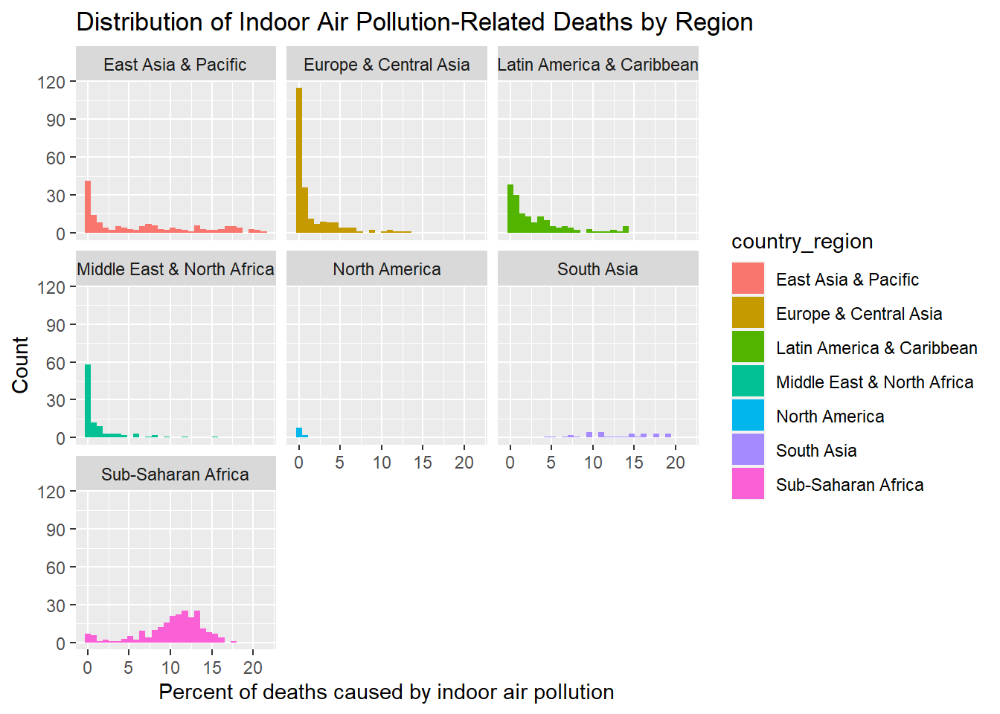

# Air Pollution and Global GDP/Climate trends

## Abstract

Premature deaths related to indoor air pollution data for many countries across the globe have been collected over three decades, which have been compiled in this data set as percentages of the population for a given year. Using the information, this analysis will attempt to infer two important characteristics that may offer insight into the cause of inadequate/unsafe indoor conditions; impact of GDP on the percent deaths is the first layer, and impact of average climates in the regions with similar GDP is the second. Firstly, exploratory analysis done to generate these hypotheses found that time will be a significant factor to consider, throughout this analysis.

## Introduction

**Since the earliest days of thinking about the dangers associated with pollution in the air, much of the conversation has been focused on the risks associated with our infrastructure --vehicles, energy, and manufacturing at the forefront. More recently, it is becoming more apparent that we are also in need of considering the risks associated with out indoor air pollutants, which is now understood to be a source of premature deaths worthy of concern.**

-   WHO suggests indoor air pollutants can become well over 100x more concentrated in large, poorly ventilated indoor spaces both public and private. On top of that, it has been documented that people living in developed regions spend 80-90% of our lives indoors.

-   Some reports suggest as much as three billion individuals are impacted by toxic indoor air pollutants every day, with as many as 3.8 million deaths yearly being attributed to IAP exposure.

## Defining Indoor Air Pollutants

-   **Volatile Organic Compounds:** emitted from everyday household items such as aerosol cleaners, plastic products, furniture, paints, candles/scented items, adhesives, and many other products. VOCs are the least understood of the indoor air pollutants, and many have still yet to be identified, let alone medically understood.

    -   The five most common VOCs include benzene, formaldehyde, methylene chloride, tetrachloroethylene, toluene, xylene, and 1,3-butadiene

-   **Particulate matter:** Dust, smoke, dirt, and other small particles created from many sources and suspended in moving air. Some of the most significant indoor air pollutants are produced by combustion from cooking, heating, or smoking. PM ranges from a mild irritant to a major cause of death depending on the concentration and extent of exposure.

    -   Burning biofuels like wood or crops produce significantly more hazardous particulate matter then fuels like ethanol or biodiesel. Wood contains heavy metals like arsenic, cadmium, and lead that can accumulate in soils and then get taken into the air, producing dust and ash from incomplete combustion.

-   **Nitrogen Oxides:** Also an aspect of biofuel combustion, NOx compounds are known to have significant adverse health affects affecting the respiratory and cardiovascular system, which has been linked to asthma, bronchitis, eye/skin/throat irritation, headaches & nausea as well as a weakened immune system

-   **Carbon monoxide/dioxide:** Both carbon monoxide and dioxide are hazardous in large concentrations and are produced by the combustion of all fuels, including gas. Carbon monoxide can be hazardous, with hundreds of deaths still caused in the US by accidental CO poisoning.

-   **Radon:** Second leading cause of lung cancer globally, radon is naturally released by soil, rocks, and water, which can release slowly and build up inside poorly ventilated homes.

    ## Determining Hypothesis with Testing Data


::: {.cell}

```{.r .cell-code}
library(tidyverse)
```

::: {.cell-output .cell-output-stderr}
```
── Attaching packages ─────────────────────────────────────── tidyverse 1.3.2 ──
✔ ggplot2 3.4.0     ✔ purrr   1.0.1
✔ tibble  3.1.8     ✔ dplyr   1.1.0
✔ tidyr   1.3.0     ✔ stringr 1.5.0
✔ readr   2.1.3     ✔ forcats 1.0.0
── Conflicts ────────────────────────────────────────── tidyverse_conflicts() ──
✖ dplyr::filter() masks stats::filter()
✖ dplyr::lag()    masks stats::lag()
```
:::

```{.r .cell-code}
library(kableExtra)
```

::: {.cell-output .cell-output-stderr}
```

Attaching package: 'kableExtra'

The following object is masked from 'package:dplyr':

    group_rows
```
:::

```{.r .cell-code}
library(ggplot2)
library(tidymodels)
```

::: {.cell-output .cell-output-stderr}
```
── Attaching packages ────────────────────────────────────── tidymodels 1.0.0 ──
✔ broom        1.0.3     ✔ rsample      1.1.1
✔ dials        1.1.0     ✔ tune         1.0.1
✔ infer        1.0.4     ✔ workflows    1.1.2
✔ modeldata    1.1.0     ✔ workflowsets 1.0.0
✔ parsnip      1.0.3     ✔ yardstick    1.1.0
✔ recipes      1.0.4     
── Conflicts ───────────────────────────────────────── tidymodels_conflicts() ──
✖ scales::discard()        masks purrr::discard()
✖ dplyr::filter()          masks stats::filter()
✖ recipes::fixed()         masks stringr::fixed()
✖ kableExtra::group_rows() masks dplyr::group_rows()
✖ dplyr::lag()             masks stats::lag()
✖ yardstick::spec()        masks readr::spec()
✖ recipes::step()          masks stats::step()
• Use suppressPackageStartupMessages() to eliminate package startup messages
```
:::

```{.r .cell-code}
library(janitor)
```

::: {.cell-output .cell-output-stderr}
```

Attaching package: 'janitor'

The following objects are masked from 'package:stats':

    chisq.test, fisher.test
```
:::

```{.r .cell-code}
library(magrittr)
```

::: {.cell-output .cell-output-stderr}
```

Attaching package: 'magrittr'

The following object is masked from 'package:purrr':

    set_names

The following object is masked from 'package:tidyr':

    extract
```
:::

```{.r .cell-code}
 library(dplyr)
library(countrycode)
library(gapminder)

indoor_pollution <- readr::read_csv('https://raw.githubusercontent.com/rfordatascience/tidytuesday/master/data/2022/2022-04-12/indoor_pollution.csv') %>%

clean_names()
```

::: {.cell-output .cell-output-stderr}
```
Rows: 8010 Columns: 4
── Column specification ────────────────────────────────────────────────────────
Delimiter: ","
chr (2): Entity, Code
dbl (2): Year, Deaths - Cause: All causes - Risk: Household air pollution fr...

ℹ Use `spec()` to retrieve the full column specification for this data.
ℹ Specify the column types or set `show_col_types = FALSE` to quiet this message.
```
:::
:::


### Quick Summary of Data -- Finding the Variables Present in the Data Set


::: {.cell}

```{.r .cell-code}
# Create a data split containing 15% of the total dataset for exploratory analysis
 iap_splits <- initial_split(indoor_pollution, prop = 0.15,
                                   pool = 1) 
 

exploratory_data <- training(iap_splits) ##Rename training split
test_data <- testing(iap_splits) ##Rename testing split

head(exploratory_data) %>% 
  
  rename(percent_deaths_by_household_pollution = deaths_cause_all_causes_risk_household_air_pollution_from_solid_fuels_sex_both_age_age_standardized_percent) %>% #shorten the long name 
  
kable(digits = c(1,0,0,2)) %>%
    kable_styling(bootstrap_options = c("hover", "striped"))
```

::: {.cell-output-display}

`````{=html}
<table class="table table-hover table-striped" style="margin-left: auto; margin-right: auto;">
 <thead>
  <tr>
   <th style="text-align:left;"> entity </th>
   <th style="text-align:left;"> code </th>
   <th style="text-align:right;"> year </th>
   <th style="text-align:right;"> percent_deaths_by_household_pollution </th>
  </tr>
 </thead>
<tbody>
  <tr>
   <td style="text-align:left;"> Malaysia </td>
   <td style="text-align:left;"> MYS </td>
   <td style="text-align:right;"> 2013 </td>
   <td style="text-align:right;"> 0.10 </td>
  </tr>
  <tr>
   <td style="text-align:left;"> Chile </td>
   <td style="text-align:left;"> CHL </td>
   <td style="text-align:right;"> 2009 </td>
   <td style="text-align:right;"> 0.60 </td>
  </tr>
  <tr>
   <td style="text-align:left;"> Poland </td>
   <td style="text-align:left;"> POL </td>
   <td style="text-align:right;"> 1991 </td>
   <td style="text-align:right;"> 3.25 </td>
  </tr>
  <tr>
   <td style="text-align:left;"> Caribbean </td>
   <td style="text-align:left;"> NA </td>
   <td style="text-align:right;"> 2018 </td>
   <td style="text-align:right;"> 3.88 </td>
  </tr>
  <tr>
   <td style="text-align:left;"> G20 </td>
   <td style="text-align:left;"> NA </td>
   <td style="text-align:right;"> 1999 </td>
   <td style="text-align:right;"> 6.72 </td>
  </tr>
  <tr>
   <td style="text-align:left;"> Israel </td>
   <td style="text-align:left;"> ISR </td>
   <td style="text-align:right;"> 2007 </td>
   <td style="text-align:right;"> 0.01 </td>
  </tr>
</tbody>
</table>

`````

:::
:::


::: {.callout-note style="color:gray" appearance="simple"}
**Observation:**

This data set contains variables gathered across multiple years, listing the percent of deaths caused by indoor air pollutants created from indoor combustion. Given the amount of data present in this dataset, several potential hypotheses could likely be considered.

The data, listed by country and region, are mixed in the data set and will likely require some cleaning to separate. categorical data and contains variables that were collected over many years.

-   Depending on the scope of research, it may be more useful to focus on the data set containing regional data rather than country-specific to highlight what role climate plays in the effect of indoor air pollution.

    -   In temperate climates, it is more likely to use biofuels for heating as well as cooking. Alongside the availability of insulation material for homes that reduced the ability for indoor and outdoor atmosphere gas exchange, this may be an essential factor that could be compared with this data.

    -   Using the temporal variable that is available in this data, some conclusions could be made about the

-   focusing on the countries rather than regions in this data could be used to show how countries that have invested in new technologies or better homes could correlate with either improved or worsened indoor air quality. Suppose homes are made more insulated but old gas stoves and wood fires are built into them. In that case, it is possible that the data could show up to a point a worsened impact on indoor air quality is associated with a country's growth in economic opportunity.
:::


::: {.cell}

```{.r .cell-code}
exploratory_data %>%
  
   mutate(region = countrycode(entity, origin = "country.name", destination = "region")) %>%
  filter(region!= 0) %>%
  group_by(region, entity) %>%
  summarise() %>%
  group_by(region) %>%
  summarise("Unique Countries" = paste(unique(entity), collapse = ", "))
```

::: {.cell-output .cell-output-stderr}
```
Warning: There was 1 warning in `mutate()`.
ℹ In argument: `region = countrycode(entity, origin = "country.name",
  destination = "region")`.
Caused by warning in `countrycode_convert()`:
! Some values were not matched unambiguously: Africa, African Region, African Union, America, Andean Latin America, Asia, Australasia, Caribbean, Central Asia, Central Europe, Central Europe, Eastern Europe, and Central Asia, Central Latin America, Central sub-Saharan Africa, Commonwealth, Commonwealth High Income, Commonwealth Low Income, Commonwealth Middle Income, East Asia, East Asia & Pacific - World Bank region, Eastern Europe, Eastern Mediterranean Region, Eastern sub-Saharan Africa, England, Europe, Europe & Central Asia - World Bank region, European Region, European Union, G20, High-income, High-income Asia Pacific, High-income North America, High-middle SDI, High SDI, Latin America & Caribbean - World Bank region, Low-middle SDI, Low SDI, Micronesia (country), Middle East & North Africa, Middle SDI, Nordic Region, North Africa and Middle East, North America, Northern Ireland, Oceania, OECD Countries, Region of the Americas, Scotland, South-East Asia Region, South Asia - World Bank region, Southeast Asia, Southeast Asia, East Asia, and Oceania, Southern Latin America, Southern sub-Saharan Africa, Sub-Saharan Africa - World Bank region, Timor, Tropical Latin America, Wales, Western Europe, Western Pacific Region, Western sub-Saharan Africa, World, World Bank High Income, World Bank Low Income, World Bank Lower Middle Income, World Bank Upper Middle Income
```
:::

::: {.cell-output .cell-output-stderr}
```
`summarise()` has grouped output by 'region'. You can override using the
`.groups` argument.
```
:::

::: {.cell-output .cell-output-stdout}
```
# A tibble: 7 × 2
  region                     `Unique Countries`                                 
  <chr>                      <chr>                                              
1 East Asia & Pacific        American Samoa, Australia, Brunei, Cambodia, China…
2 Europe & Central Asia      Albania, Andorra, Armenia, Austria, Azerbaijan, Be…
3 Latin America & Caribbean  Antigua and Barbuda, Argentina, Bahamas, Barbados,…
4 Middle East & North Africa Algeria, Bahrain, Djibouti, Egypt, Iran, Iraq, Isr…
5 North America              Bermuda, Canada, United States                     
6 South Asia                 Afghanistan, Bangladesh, Bhutan, India, Maldives, …
7 Sub-Saharan Africa         Angola, Benin, Botswana, Burkina Faso, Burundi, Ca…
```
:::
:::


(


::: {.cell}

```{.r .cell-code}
exploratory_data %>% #quick summary of some of the data to see what the range is.
  
   mutate(country_region = countrycode(entity, origin = "country.name", destination = "region")) %>%
  
  group_by(country_region) %>% #group the data by region to split the summary
  
  
summarize(
  "Lowest percentage of deaths" = min(deaths_cause_all_causes_risk_household_air_pollution_from_solid_fuels_sex_both_age_age_standardized_percent),
  
  "Highest percentage of deaths"= max(deaths_cause_all_causes_risk_household_air_pollution_from_solid_fuels_sex_both_age_age_standardized_percent),
  "Average percentage of deaths" =mean(deaths_cause_all_causes_risk_household_air_pollution_from_solid_fuels_sex_both_age_age_standardized_percent),
  "Standard Deviation" = sd(deaths_cause_all_causes_risk_household_air_pollution_from_solid_fuels_sex_both_age_age_standardized_percent)
) %>%
  
  kable(digits = c(1,3,1,2,1)) %>%
    kable_styling(bootstrap_options = c("hover", "striped"))
```

::: {.cell-output .cell-output-stderr}
```
Warning: There was 1 warning in `mutate()`.
ℹ In argument: `country_region = countrycode(entity, origin = "country.name",
  destination = "region")`.
Caused by warning in `countrycode_convert()`:
! Some values were not matched unambiguously: Africa, African Region, African Union, America, Andean Latin America, Asia, Australasia, Caribbean, Central Asia, Central Europe, Central Europe, Eastern Europe, and Central Asia, Central Latin America, Central sub-Saharan Africa, Commonwealth, Commonwealth High Income, Commonwealth Low Income, Commonwealth Middle Income, East Asia, East Asia & Pacific - World Bank region, Eastern Europe, Eastern Mediterranean Region, Eastern sub-Saharan Africa, England, Europe, Europe & Central Asia - World Bank region, European Region, European Union, G20, High-income, High-income Asia Pacific, High-income North America, High-middle SDI, High SDI, Latin America & Caribbean - World Bank region, Low-middle SDI, Low SDI, Micronesia (country), Middle East & North Africa, Middle SDI, Nordic Region, North Africa and Middle East, North America, Northern Ireland, Oceania, OECD Countries, Region of the Americas, Scotland, South-East Asia Region, South Asia - World Bank region, Southeast Asia, Southeast Asia, East Asia, and Oceania, Southern Latin America, Southern sub-Saharan Africa, Sub-Saharan Africa - World Bank region, Timor, Tropical Latin America, Wales, Western Europe, Western Pacific Region, Western sub-Saharan Africa, World, World Bank High Income, World Bank Low Income, World Bank Lower Middle Income, World Bank Upper Middle Income
```
:::

::: {.cell-output-display}

`````{=html}
<table class="table table-hover table-striped" style="margin-left: auto; margin-right: auto;">
 <thead>
  <tr>
   <th style="text-align:left;"> country_region </th>
   <th style="text-align:right;"> Lowest percentage of deaths </th>
   <th style="text-align:right;"> Highest percentage of deaths </th>
   <th style="text-align:right;"> Average percentage of deaths </th>
   <th style="text-align:right;"> Standard Deviation </th>
  </tr>
 </thead>
<tbody>
  <tr>
   <td style="text-align:left;"> East Asia &amp; Pacific </td>
   <td style="text-align:right;"> 0.005 </td>
   <td style="text-align:right;"> 21.3 </td>
   <td style="text-align:right;"> 6.50 </td>
   <td style="text-align:right;"> 6.7 </td>
  </tr>
  <tr>
   <td style="text-align:left;"> Europe &amp; Central Asia </td>
   <td style="text-align:right;"> 0.002 </td>
   <td style="text-align:right;"> 13.4 </td>
   <td style="text-align:right;"> 1.48 </td>
   <td style="text-align:right;"> 2.5 </td>
  </tr>
  <tr>
   <td style="text-align:left;"> Latin America &amp; Caribbean </td>
   <td style="text-align:right;"> 0.003 </td>
   <td style="text-align:right;"> 14.3 </td>
   <td style="text-align:right;"> 3.05 </td>
   <td style="text-align:right;"> 3.5 </td>
  </tr>
  <tr>
   <td style="text-align:left;"> Middle East &amp; North Africa </td>
   <td style="text-align:right;"> 0.001 </td>
   <td style="text-align:right;"> 15.3 </td>
   <td style="text-align:right;"> 1.39 </td>
   <td style="text-align:right;"> 2.7 </td>
  </tr>
  <tr>
   <td style="text-align:left;"> North America </td>
   <td style="text-align:right;"> 0.006 </td>
   <td style="text-align:right;"> 0.6 </td>
   <td style="text-align:right;"> 0.16 </td>
   <td style="text-align:right;"> 0.2 </td>
  </tr>
  <tr>
   <td style="text-align:left;"> South Asia </td>
   <td style="text-align:right;"> 4.650 </td>
   <td style="text-align:right;"> 19.3 </td>
   <td style="text-align:right;"> 12.65 </td>
   <td style="text-align:right;"> 4.3 </td>
  </tr>
  <tr>
   <td style="text-align:left;"> Sub-Saharan Africa </td>
   <td style="text-align:right;"> 0.045 </td>
   <td style="text-align:right;"> 17.3 </td>
   <td style="text-align:right;"> 10.28 </td>
   <td style="text-align:right;"> 3.8 </td>
  </tr>
  <tr>
   <td style="text-align:left;"> NA </td>
   <td style="text-align:right;"> 0.002 </td>
   <td style="text-align:right;"> 18.0 </td>
   <td style="text-align:right;"> 5.00 </td>
   <td style="text-align:right;"> 5.2 </td>
  </tr>
</tbody>
</table>

`````

:::
:::


::: callout-note
**Observations:**

-   All regions besides S. Asia have at least one country that has a very low percent deaths caused by indoor air pollution, while the highest and average percent deaths by region ranges fairly widely.

    -   South Asia is clearly the most impacted region by indoor air pollution as shown in this breakdown. Not only is the lowest percent deaths 2.1%, but the average is 3% higher then Sub-Saharan Africa (10.3%) which is nearly double the next largest, Ease Asia & Pacific (7.0%)

        -   **Afghanistan, Bangladesh, Bhutan, India, Maldives, Nepal, Pakistan, Sri Lanka** are the only countries that are contained in the S. Asia region, with exceedingly poor air quality seemingly being a widespread issue for these countries. India has the second largest population of any country, meaning although this region is represented by less countries, it is representing a large amount of human being. This will likely be something that returns in future analysis and inference.

    -   
:::


::: {.cell}

```{.r .cell-code}
  # mutate(country_region = countrycode(entity, origin = "country.name", destination = "region")) %>%
  
 # mutate(continent = countrycode (entity, origin = "country.name", destination = "continent"))%>%
  
 #  filter(continent!= 0) %>%
  
 # kable() %>%
   # kable_styling(bootstrap_options = c("hover", "striped"))
```
:::

::: {.cell}

```{.r .cell-code}
exploratory_data %>%
  
  rename(percent_deaths_by_household_pollution = deaths_cause_all_causes_risk_household_air_pollution_from_solid_fuels_sex_both_age_age_standardized_percent) %>%
  
   mutate(country_region = countrycode(entity, origin = "country.name", destination = "region")) %>%
  mutate(continent = countrycode (entity, origin = "country.name", destination = "continent")) %>%

   filter(continent!= 0) %>%
  ggplot() + 
  geom_histogram(mapping = aes(fill = country_region, 
                               x= percent_deaths_by_household_pollution,
                               na.rm = TRUE)) +
  facet_wrap(~country_region) +
  labs(x = "Percent of deaths caused by indoor air pollution",
     y = "Count",
     title = "Distribution of Indoor Air Pollution-Related Deaths by Region")
```

::: {.cell-output .cell-output-stderr}
```
Warning: There was 1 warning in `mutate()`.
ℹ In argument: `country_region = countrycode(entity, origin = "country.name",
  destination = "region")`.
Caused by warning in `countrycode_convert()`:
! Some values were not matched unambiguously: Africa, African Region, African Union, America, Andean Latin America, Asia, Australasia, Caribbean, Central Asia, Central Europe, Central Europe, Eastern Europe, and Central Asia, Central Latin America, Central sub-Saharan Africa, Commonwealth, Commonwealth High Income, Commonwealth Low Income, Commonwealth Middle Income, East Asia, East Asia & Pacific - World Bank region, Eastern Europe, Eastern Mediterranean Region, Eastern sub-Saharan Africa, England, Europe, Europe & Central Asia - World Bank region, European Region, European Union, G20, High-income, High-income Asia Pacific, High-income North America, High-middle SDI, High SDI, Latin America & Caribbean - World Bank region, Low-middle SDI, Low SDI, Micronesia (country), Middle East & North Africa, Middle SDI, Nordic Region, North Africa and Middle East, North America, Northern Ireland, Oceania, OECD Countries, Region of the Americas, Scotland, South-East Asia Region, South Asia - World Bank region, Southeast Asia, Southeast Asia, East Asia, and Oceania, Southern Latin America, Southern sub-Saharan Africa, Sub-Saharan Africa - World Bank region, Timor, Tropical Latin America, Wales, Western Europe, Western Pacific Region, Western sub-Saharan Africa, World, World Bank High Income, World Bank Low Income, World Bank Lower Middle Income, World Bank Upper Middle Income
```
:::

::: {.cell-output .cell-output-stderr}
```
Warning: There was 1 warning in `mutate()`.
ℹ In argument: `continent = countrycode(entity, origin = "country.name",
  destination = "continent")`.
Caused by warning in `countrycode_convert()`:
! Some values were not matched unambiguously: Africa, African Region, African Union, America, Andean Latin America, Asia, Australasia, Caribbean, Central Asia, Central Europe, Central Europe, Eastern Europe, and Central Asia, Central Latin America, Central sub-Saharan Africa, Commonwealth, Commonwealth High Income, Commonwealth Low Income, Commonwealth Middle Income, East Asia, East Asia & Pacific - World Bank region, Eastern Europe, Eastern Mediterranean Region, Eastern sub-Saharan Africa, England, Europe, Europe & Central Asia - World Bank region, European Region, European Union, G20, High-income, High-income Asia Pacific, High-income North America, High-middle SDI, High SDI, Latin America & Caribbean - World Bank region, Low-middle SDI, Low SDI, Micronesia (country), Middle East & North Africa, Middle SDI, Nordic Region, North Africa and Middle East, North America, Northern Ireland, Oceania, OECD Countries, Region of the Americas, Scotland, South-East Asia Region, South Asia - World Bank region, Southeast Asia, Southeast Asia, East Asia, and Oceania, Southern Latin America, Southern sub-Saharan Africa, Sub-Saharan Africa - World Bank region, Timor, Tropical Latin America, Wales, Western Europe, Western Pacific Region, Western sub-Saharan Africa, World, World Bank High Income, World Bank Low Income, World Bank Lower Middle Income, World Bank Upper Middle Income
```
:::

::: {.cell-output .cell-output-stderr}
```
Warning in geom_histogram(mapping = aes(fill = country_region, x =
percent_deaths_by_household_pollution, : Ignoring unknown aesthetics: na.rm
```
:::

::: {.cell-output .cell-output-stderr}
```
`stat_bin()` using `bins = 30`. Pick better value with `binwidth`.
```
:::

::: {.cell-output-display}
{width=672}
:::
:::


::: callout-note
## Observations

-   these graphs show variables taken across a range of 30 years where the number of deaths in the country attributed to indoor air pollution caused by the combustion of bio fuels. each graph represents a distribution of these variables grouped by region.

    -   **East Asia & Pacific** contains a large distribution of countries with different rates of death. there is a larger amount of countries in east asia with a very low percentage of deaths for this cause.

    -   **Europe and Central Asia** has the largest amount of variables measured at 0 percent deaths caused by IAP (over 125) compared to any other region. Nearly all variables in this region are below 10 percent deaths by IAP, but a fairly large amount of variables fall between 1% and 5%.

    -   **Latin America & Caribbean** data is relatively spread out across 0% through 5% with over 100 countries in this group. there are a a smaller number of countries spread between 6% and 15% with no species over 15 percent.

    -   **Middle East and North Africa** does not contain a large number of countries in the histogram (less then 100). The largest portion are between 0% and 5%, relatively low levels compared to other countries like East Asia and Sub-Saharan Africa.

    -   **North America** is represented by the fewest countries of any region in this comparison. Considering that two of these countries are the U.S and Canada it is not suprising that there are a very low percentage of deaths per year caused by indoor air pollution.

    -   **South Asia** is not represented by any countries that are 0 or even nearly 0% deaths caused by IAP from bio fuels. Although this region has \~50 variables, the % death ranges from a minimum of 4% to as high as 19%.

    -   **Sub-Saharan Africa** is represented by a larger number of variables that are in the 5%-15% range. this region will likely provide an interesting year-to-year comparison that could show improvement over time.

-   because these variables are taken across such a wide temporal scale, it does not serve as a distinctly insightful comparison. Still, some things can be inferred.
:::


::: {.cell}

```{.r .cell-code}
exploratory_data %>%
  
  filter(year>2014) %>%
  
  rename(n = deaths_cause_all_causes_risk_household_air_pollution_from_solid_fuels_sex_both_age_age_standardized_percent) %>%
  
   mutate("Regions" = countrycode(entity, 
                                       origin = "country.name", 
                                       destination= "region"
                                       )) %>%
  filter(!is.na(Regions)) %>%
  group_by(Regions) %>%

  summarize(
    'Average Percent Deaths by Region' = mean(n),
    'Standard Deviation of % Deaths by Region' = sd(n),
    
    'Number of Variables Measured' = length(unique(entity))) %>%
  
 kable(digits = c(0,4,4,0)) %>%
    kable_styling(bootstrap_options = c("hover", "striped"))
```

::: {.cell-output .cell-output-stderr}
```
Warning: There was 1 warning in `mutate()`.
ℹ In argument: `Regions = countrycode(entity, origin = "country.name",
  destination = "region")`.
Caused by warning in `countrycode_convert()`:
! Some values were not matched unambiguously: Africa, African Union, Andean Latin America, Asia, Caribbean, Central Asia, Central Europe, Eastern Europe, and Central Asia, Central Latin America, Central sub-Saharan Africa, Commonwealth High Income, Commonwealth Low Income, Commonwealth Middle Income, East Asia, Eastern Europe, Eastern sub-Saharan Africa, England, Europe, Europe & Central Asia - World Bank region, European Union, G20, High-income, High-income North America, Middle East & North Africa, Middle SDI, Nordic Region, Oceania, Region of the Americas, South-East Asia Region, Southeast Asia, Southern Latin America, Southern sub-Saharan Africa, Western Europe, World, World Bank High Income, World Bank Low Income, World Bank Lower Middle Income
```
:::

::: {.cell-output-display}

`````{=html}
<table class="table table-hover table-striped" style="margin-left: auto; margin-right: auto;">
 <thead>
  <tr>
   <th style="text-align:left;"> Regions </th>
   <th style="text-align:right;"> Average Percent Deaths by Region </th>
   <th style="text-align:right;"> Standard Deviation of % Deaths by Region </th>
   <th style="text-align:right;"> Number of Variables Measured </th>
  </tr>
 </thead>
<tbody>
  <tr>
   <td style="text-align:left;"> East Asia &amp; Pacific </td>
   <td style="text-align:right;"> 6.2558 </td>
   <td style="text-align:right;"> 6.9724 </td>
   <td style="text-align:right;"> 19 </td>
  </tr>
  <tr>
   <td style="text-align:left;"> Europe &amp; Central Asia </td>
   <td style="text-align:right;"> 0.4975 </td>
   <td style="text-align:right;"> 1.0142 </td>
   <td style="text-align:right;"> 28 </td>
  </tr>
  <tr>
   <td style="text-align:left;"> Latin America &amp; Caribbean </td>
   <td style="text-align:right;"> 1.7890 </td>
   <td style="text-align:right;"> 3.0338 </td>
   <td style="text-align:right;"> 20 </td>
  </tr>
  <tr>
   <td style="text-align:left;"> Middle East &amp; North Africa </td>
   <td style="text-align:right;"> 0.9756 </td>
   <td style="text-align:right;"> 2.0375 </td>
   <td style="text-align:right;"> 10 </td>
  </tr>
  <tr>
   <td style="text-align:left;"> North America </td>
   <td style="text-align:right;"> 0.0795 </td>
   <td style="text-align:right;"> 0.1042 </td>
   <td style="text-align:right;"> 2 </td>
  </tr>
  <tr>
   <td style="text-align:left;"> South Asia </td>
   <td style="text-align:right;"> 11.0733 </td>
   <td style="text-align:right;"> 2.4180 </td>
   <td style="text-align:right;"> 4 </td>
  </tr>
  <tr>
   <td style="text-align:left;"> Sub-Saharan Africa </td>
   <td style="text-align:right;"> 8.3015 </td>
   <td style="text-align:right;"> 4.5549 </td>
   <td style="text-align:right;"> 23 </td>
  </tr>
</tbody>
</table>

`````

:::
:::


::: callout-note
## Observations

This data summarizes the variables from only 2014-2019 to see a comparison of all the countries in recent years. Something that can be inferred from this data is that some countries have a significantly more significant standard deviation then others.

-   While South Asia and Sub-Saharan Africa have the highest average, the deviation is much smggesting most of the variables (countries) measured in this timespan are relatively close to the 10.00 % mean percent deaths by IAP

<!-- -->

    -   East Asia & Pacific are significantly lower in percent deaths by IAP at nearly half of the previously mentioned, however, the standard deviation is over 1% greater then either South Asia or Sub-Saharan Africa, suggesting that some countries could be significantly worse off then most.

    -   although Middle East & North Africa does not have a particularly large standard deviation, it is the largest in comparison to its average. This Region along with Latin America & Caribbean do not fit this theory as nicely, and show the need for economic factors that play a role in deaths caused by pollution.

        -   This will be important for my hypothesis, since the geographic position of East Asia & pacific would likely make climate an interesting factor for comparison.

<!-- -->

-   Regions with the lowest deviation from the mean were Europe & Central Asia as well as North America (despite lacking a stawithon, it is only made up of 3 countries and likely deviated minimally
:::


::: {.cell}

```{.r .cell-code}
exploratory_data %>%
  
count(year) %>%
 
  kable() %>%
    kable_styling(bootstrap_options = c("hover", "striped"))
```

::: {.cell-output-display}

`````{=html}
<table class="table table-hover table-striped" style="margin-left: auto; margin-right: auto;">
 <thead>
  <tr>
   <th style="text-align:right;"> year </th>
   <th style="text-align:right;"> n </th>
  </tr>
 </thead>
<tbody>
  <tr>
   <td style="text-align:right;"> 1990 </td>
   <td style="text-align:right;"> 40 </td>
  </tr>
  <tr>
   <td style="text-align:right;"> 1991 </td>
   <td style="text-align:right;"> 44 </td>
  </tr>
  <tr>
   <td style="text-align:right;"> 1992 </td>
   <td style="text-align:right;"> 59 </td>
  </tr>
  <tr>
   <td style="text-align:right;"> 1993 </td>
   <td style="text-align:right;"> 49 </td>
  </tr>
  <tr>
   <td style="text-align:right;"> 1994 </td>
   <td style="text-align:right;"> 28 </td>
  </tr>
  <tr>
   <td style="text-align:right;"> 1995 </td>
   <td style="text-align:right;"> 41 </td>
  </tr>
  <tr>
   <td style="text-align:right;"> 1996 </td>
   <td style="text-align:right;"> 48 </td>
  </tr>
  <tr>
   <td style="text-align:right;"> 1997 </td>
   <td style="text-align:right;"> 44 </td>
  </tr>
  <tr>
   <td style="text-align:right;"> 1998 </td>
   <td style="text-align:right;"> 31 </td>
  </tr>
  <tr>
   <td style="text-align:right;"> 1999 </td>
   <td style="text-align:right;"> 39 </td>
  </tr>
  <tr>
   <td style="text-align:right;"> 2000 </td>
   <td style="text-align:right;"> 35 </td>
  </tr>
  <tr>
   <td style="text-align:right;"> 2001 </td>
   <td style="text-align:right;"> 39 </td>
  </tr>
  <tr>
   <td style="text-align:right;"> 2002 </td>
   <td style="text-align:right;"> 35 </td>
  </tr>
  <tr>
   <td style="text-align:right;"> 2003 </td>
   <td style="text-align:right;"> 31 </td>
  </tr>
  <tr>
   <td style="text-align:right;"> 2004 </td>
   <td style="text-align:right;"> 48 </td>
  </tr>
  <tr>
   <td style="text-align:right;"> 2005 </td>
   <td style="text-align:right;"> 51 </td>
  </tr>
  <tr>
   <td style="text-align:right;"> 2006 </td>
   <td style="text-align:right;"> 43 </td>
  </tr>
  <tr>
   <td style="text-align:right;"> 2007 </td>
   <td style="text-align:right;"> 49 </td>
  </tr>
  <tr>
   <td style="text-align:right;"> 2008 </td>
   <td style="text-align:right;"> 38 </td>
  </tr>
  <tr>
   <td style="text-align:right;"> 2009 </td>
   <td style="text-align:right;"> 37 </td>
  </tr>
  <tr>
   <td style="text-align:right;"> 2010 </td>
   <td style="text-align:right;"> 38 </td>
  </tr>
  <tr>
   <td style="text-align:right;"> 2011 </td>
   <td style="text-align:right;"> 30 </td>
  </tr>
  <tr>
   <td style="text-align:right;"> 2012 </td>
   <td style="text-align:right;"> 26 </td>
  </tr>
  <tr>
   <td style="text-align:right;"> 2013 </td>
   <td style="text-align:right;"> 31 </td>
  </tr>
  <tr>
   <td style="text-align:right;"> 2014 </td>
   <td style="text-align:right;"> 44 </td>
  </tr>
  <tr>
   <td style="text-align:right;"> 2015 </td>
   <td style="text-align:right;"> 49 </td>
  </tr>
  <tr>
   <td style="text-align:right;"> 2016 </td>
   <td style="text-align:right;"> 36 </td>
  </tr>
  <tr>
   <td style="text-align:right;"> 2017 </td>
   <td style="text-align:right;"> 44 </td>
  </tr>
  <tr>
   <td style="text-align:right;"> 2018 </td>
   <td style="text-align:right;"> 37 </td>
  </tr>
  <tr>
   <td style="text-align:right;"> 2019 </td>
   <td style="text-align:right;"> 37 </td>
  </tr>
</tbody>
</table>

`````

:::
:::


::: {.callout-note style="color:gray" appearance="simple"}
## Observations

This data shows the distribution of variables across several years.

-   This spread suggests there is a lot of value in interpreting this data by year.

    -   How do different regions compare to each other? What can be said about the rate of progress towards reducing the number of deaths over the 30 years of data records?

    -   Can environmental factors be considered? N. America has a lot of rich natural resources and mild climates that, among other factors, have enabled its success in terms of providing humanitarian needs to a large population.

        -   areas where temperatures are very cold probably have more insulated homes burning bio fuels on top of cooking with combustion. Can a correlation be made suggesting that, despite economic wealth per capita, IAP caused by combustion is a bigger issue in Northern countries? This would likely only apply to countries that have not reached "western civilization" levels of wealth

-   It seems that the quantity of variables spread across this time span eliminates any hypothesis that would not involve a temporal comparison. If focusing on a single-year comparison becomes functional to the goals of this analysis, it may be valuable to pick a year with the most variables since they are not all the same.
:::


::: {.cell}

```{.r .cell-code}
exploratory_data %>%
  
  rename(n = deaths_cause_all_causes_risk_household_air_pollution_from_solid_fuels_sex_both_age_age_standardized_percent) %>%
  
   mutate("Regions" = countrycode(entity,origin = "country.name",
   destination= "region")) %>%
  filter(!is.na(Regions)) %>%
  
  group_by(Regions) %>%
  
  ggplot(aes(x= year,y= n, group = 1, color = Regions, group = interaction(region,year))) +
  geom_line() +
  facet_wrap(~Regions)+
  geom_smooth()
```

::: {.cell-output .cell-output-stderr}
```
Warning: There was 1 warning in `mutate()`.
ℹ In argument: `Regions = countrycode(entity, origin = "country.name",
  destination = "region")`.
Caused by warning in `countrycode_convert()`:
! Some values were not matched unambiguously: Africa, African Region, African Union, America, Andean Latin America, Asia, Australasia, Caribbean, Central Asia, Central Europe, Central Europe, Eastern Europe, and Central Asia, Central Latin America, Central sub-Saharan Africa, Commonwealth, Commonwealth High Income, Commonwealth Low Income, Commonwealth Middle Income, East Asia, East Asia & Pacific - World Bank region, Eastern Europe, Eastern Mediterranean Region, Eastern sub-Saharan Africa, England, Europe, Europe & Central Asia - World Bank region, European Region, European Union, G20, High-income, High-income Asia Pacific, High-income North America, High-middle SDI, High SDI, Latin America & Caribbean - World Bank region, Low-middle SDI, Low SDI, Micronesia (country), Middle East & North Africa, Middle SDI, Nordic Region, North Africa and Middle East, North America, Northern Ireland, Oceania, OECD Countries, Region of the Americas, Scotland, South-East Asia Region, South Asia - World Bank region, Southeast Asia, Southeast Asia, East Asia, and Oceania, Southern Latin America, Southern sub-Saharan Africa, Sub-Saharan Africa - World Bank region, Timor, Tropical Latin America, Wales, Western Europe, Western Pacific Region, Western sub-Saharan Africa, World, World Bank High Income, World Bank Low Income, World Bank Lower Middle Income, World Bank Upper Middle Income
```
:::

::: {.cell-output .cell-output-stderr}
```
Warning: Duplicated aesthetics after name standardisation: group
```
:::

::: {.cell-output .cell-output-stderr}
```
`geom_smooth()` using method = 'loess' and formula = 'y ~ x'
```
:::

::: {.cell-output-display}
{width=672}
:::
:::


::: callout-note
## Observations

These graphs seem to give some very valuable comparative evidence for both the value of region and time based analysis. Some things that can be seen as trends in this graph would be the downward trend downward that can be seen at the global scale.

-   Europe & Central Asia, Latin America & Caribbean ,Middle East & North Africa and North America were relatively low compared to East Asia & Pacific, South Asia and Sub-Saharan Africa.

-   East Asia & Pacific countries seem to have the greatest reduction in the percent deaths that were measured

-   While this is a global issue, there are clearly countries and regions that are significantly more impacted then others by the loss of life attributed to indoor air pollution and bio fuel combustion
:::

**Potential Hypothesis: Average % deaths decreased globally from 1990 - 2020**

**Potential Hypothesis: Temperate vs. Tropical regions will impact the IAP of developing countries**


::: {.cell}

```{.r .cell-code}
model_data<- exploratory_data %>%
  
  rename("percent_deaths_by_IAP" = deaths_cause_all_causes_risk_household_air_pollution_from_solid_fuels_sex_both_age_age_standardized_percent) %>%
  
   mutate("Regions" = countrycode(entity,origin = "country.name",
   destination= "region")) %>%
  filter(!is.na(Regions))
```

::: {.cell-output .cell-output-stderr}
```
Warning: There was 1 warning in `mutate()`.
ℹ In argument: `Regions = countrycode(entity, origin = "country.name",
  destination = "region")`.
Caused by warning in `countrycode_convert()`:
! Some values were not matched unambiguously: Africa, African Region, African Union, America, Andean Latin America, Asia, Australasia, Caribbean, Central Asia, Central Europe, Central Europe, Eastern Europe, and Central Asia, Central Latin America, Central sub-Saharan Africa, Commonwealth, Commonwealth High Income, Commonwealth Low Income, Commonwealth Middle Income, East Asia, East Asia & Pacific - World Bank region, Eastern Europe, Eastern Mediterranean Region, Eastern sub-Saharan Africa, England, Europe, Europe & Central Asia - World Bank region, European Region, European Union, G20, High-income, High-income Asia Pacific, High-income North America, High-middle SDI, High SDI, Latin America & Caribbean - World Bank region, Low-middle SDI, Low SDI, Micronesia (country), Middle East & North Africa, Middle SDI, Nordic Region, North Africa and Middle East, North America, Northern Ireland, Oceania, OECD Countries, Region of the Americas, Scotland, South-East Asia Region, South Asia - World Bank region, Southeast Asia, Southeast Asia, East Asia, and Oceania, Southern Latin America, Southern sub-Saharan Africa, Sub-Saharan Africa - World Bank region, Timor, Tropical Latin America, Wales, Western Europe, Western Pacific Region, Western sub-Saharan Africa, World, World Bank High Income, World Bank Low Income, World Bank Lower Middle Income, World Bank Upper Middle Income
```
:::

```{.r .cell-code}
model_region_temp <- linear_reg() %>% 
  set_engine("lm")  #construct model instance

model_region_reg<-
  recipe(percent_deaths_by_IAP~year,
         data = model_data)
  #generate a recipe -- what variables do we have in y = mx+b

model_region<-
  workflow() %>%
  add_model(model_region_temp) %>%
  add_recipe(model_region_reg) #combine the model and recipe to generate a regression analysis

model_region_fit <- model_region %>% fit(model_data)

 model_region_fit %>%
  glance() %>% 
  kable(digits=c(4,4,2,4,0,0,2,2,2,2,0,0)) %>% 
  kable_styling(bootstrap_options = c("hover", "striped"))
```

::: {.cell-output-display}

`````{=html}
<table class="table table-hover table-striped" style="margin-left: auto; margin-right: auto;">
 <thead>
  <tr>
   <th style="text-align:right;"> r.squared </th>
   <th style="text-align:right;"> adj.r.squared </th>
   <th style="text-align:right;"> sigma </th>
   <th style="text-align:right;"> statistic </th>
   <th style="text-align:right;"> p.value </th>
   <th style="text-align:right;"> df </th>
   <th style="text-align:right;"> logLik </th>
   <th style="text-align:right;"> AIC </th>
   <th style="text-align:right;"> BIC </th>
   <th style="text-align:right;"> deviance </th>
   <th style="text-align:right;"> df.residual </th>
   <th style="text-align:right;"> nobs </th>
  </tr>
 </thead>
<tbody>
  <tr>
   <td style="text-align:right;"> 0.0435 </td>
   <td style="text-align:right;"> 0.0424 </td>
   <td style="text-align:right;"> 5.46 </td>
   <td style="text-align:right;"> 40.4143 </td>
   <td style="text-align:right;"> 0 </td>
   <td style="text-align:right;"> 1 </td>
   <td style="text-align:right;"> -2774.98 </td>
   <td style="text-align:right;"> 5555.95 </td>
   <td style="text-align:right;"> 5570.33 </td>
   <td style="text-align:right;"> 26459.5 </td>
   <td style="text-align:right;"> 889 </td>
   <td style="text-align:right;"> 891 </td>
  </tr>
</tbody>
</table>

`````

:::

```{.r .cell-code}
  # looking to build a regression analysis to determine if a correltion can be seen in the data. prediction is decreasing n over time grouped by region 
```
:::


::: {.callout-note appearance="simple"}
## Observations

This regression analysis provides some useful information that will be valuable to repeat with the entire data set.

-   **r-squared value**: Describes how well the variables fit the dependent variable (model) and describe the data. The higher the R\^2 value, the more significant the relationship between the model and the predictor. the r-squared value suggests that between some percent of the deaths caused by IAP in this data set is explained by the year variable. This will be important to rerun for the full data set.

-   **P-value**: this is the statistical variable generated to describe if the prediction that year has a statistically significant impact on the % deaths per year. The small p-value suggests year will show a correlation to a decrease in n in a larger population, even if the overall impact is relatively small.
:::


::: {.cell}

```{.r .cell-code}
model_region_fit %>%
  extract_fit_engine() %>%
  tidy() %>%
  kable(digits = c(4,3,3,3)) %>%
  kable_styling(bootstrap_options = c("hover", "striped"))
```

::: {.cell-output-display}

`````{=html}
<table class="table table-hover table-striped" style="margin-left: auto; margin-right: auto;">
 <thead>
  <tr>
   <th style="text-align:left;"> term </th>
   <th style="text-align:right;"> estimate </th>
   <th style="text-align:right;"> std.error </th>
   <th style="text-align:right;"> statistic </th>
   <th style="text-align:right;"> p.value </th>
  </tr>
 </thead>
<tbody>
  <tr>
   <td style="text-align:left;"> (Intercept) </td>
   <td style="text-align:right;"> 270.444 </td>
   <td style="text-align:right;"> 41.726 </td>
   <td style="text-align:right;"> 6.481 </td>
   <td style="text-align:right;"> 0 </td>
  </tr>
  <tr>
   <td style="text-align:left;"> year </td>
   <td style="text-align:right;"> -0.132 </td>
   <td style="text-align:right;"> 0.021 </td>
   <td style="text-align:right;"> -6.357 </td>
   <td style="text-align:right;"> 0 </td>
  </tr>
</tbody>
</table>

`````

:::
:::


::: {.callout-note style="color:gray" appearance="simple"}
## Observations
:::


::: {.cell}

```{.r .cell-code}
model_data <- exploratory_data %>%
  
  rename("percent_IAP" = deaths_cause_all_causes_risk_household_air_pollution_from_solid_fuels_sex_both_age_age_standardized_percent) %>%
  
  mutate("region" = countrycode(entity, origin = "country.name", destination = "region")) %>%
  filter(!is.na(region))
```

::: {.cell-output .cell-output-stderr}
```
Warning: There was 1 warning in `mutate()`.
ℹ In argument: `region = countrycode(entity, origin = "country.name",
  destination = "region")`.
Caused by warning in `countrycode_convert()`:
! Some values were not matched unambiguously: Africa, African Region, African Union, America, Andean Latin America, Asia, Australasia, Caribbean, Central Asia, Central Europe, Central Europe, Eastern Europe, and Central Asia, Central Latin America, Central sub-Saharan Africa, Commonwealth, Commonwealth High Income, Commonwealth Low Income, Commonwealth Middle Income, East Asia, East Asia & Pacific - World Bank region, Eastern Europe, Eastern Mediterranean Region, Eastern sub-Saharan Africa, England, Europe, Europe & Central Asia - World Bank region, European Region, European Union, G20, High-income, High-income Asia Pacific, High-income North America, High-middle SDI, High SDI, Latin America & Caribbean - World Bank region, Low-middle SDI, Low SDI, Micronesia (country), Middle East & North Africa, Middle SDI, Nordic Region, North Africa and Middle East, North America, Northern Ireland, Oceania, OECD Countries, Region of the Americas, Scotland, South-East Asia Region, South Asia - World Bank region, Southeast Asia, Southeast Asia, East Asia, and Oceania, Southern Latin America, Southern sub-Saharan Africa, Sub-Saharan Africa - World Bank region, Timor, Tropical Latin America, Wales, Western Europe, Western Pacific Region, Western sub-Saharan Africa, World, World Bank High Income, World Bank Low Income, World Bank Lower Middle Income, World Bank Upper Middle Income
```
:::

```{.r .cell-code}
model_region_temp <- linear_reg() %>%
  set_engine("lm")  # construct model instance

model_region_recipe <- recipe(percent_IAP ~ region + year, data = model_data) %>%
  
  step_interact(~ region:year) # define a step for interaction between region and year

model_region <-
  workflow() %>%
  add_model(model_region_temp) %>%
  add_recipe(model_region_recipe)  # combine the model and recipe to generate a regression analysis

model_region_fit <- model_region %>% fit(model_data)

model_region_fit %>%
  glance() %>%
  kable(digits = c(4, 4, 4, 4, 4, 4, 2, 2, 2, 2, 4, 4)) %>%
  kable_styling(bootstrap_options = c("hover", "striped"))
```

::: {.cell-output-display}

`````{=html}
<table class="table table-hover table-striped" style="margin-left: auto; margin-right: auto;">
 <thead>
  <tr>
   <th style="text-align:right;"> r.squared </th>
   <th style="text-align:right;"> adj.r.squared </th>
   <th style="text-align:right;"> sigma </th>
   <th style="text-align:right;"> statistic </th>
   <th style="text-align:right;"> p.value </th>
   <th style="text-align:right;"> df </th>
   <th style="text-align:right;"> logLik </th>
   <th style="text-align:right;"> AIC </th>
   <th style="text-align:right;"> BIC </th>
   <th style="text-align:right;"> deviance </th>
   <th style="text-align:right;"> df.residual </th>
   <th style="text-align:right;"> nobs </th>
  </tr>
 </thead>
<tbody>
  <tr>
   <td style="text-align:right;"> 0.5079 </td>
   <td style="text-align:right;"> 0.5007 </td>
   <td style="text-align:right;"> 3.9396 </td>
   <td style="text-align:right;"> 69.641 </td>
   <td style="text-align:right;"> 0 </td>
   <td style="text-align:right;"> 13 </td>
   <td style="text-align:right;"> -2478.85 </td>
   <td style="text-align:right;"> 4987.69 </td>
   <td style="text-align:right;"> 5059.58 </td>
   <td style="text-align:right;"> 13611.31 </td>
   <td style="text-align:right;"> 877 </td>
   <td style="text-align:right;"> 891 </td>
  </tr>
</tbody>
</table>

`````

:::
:::


::: {.callout-note style="color: gray" appearance="simple"}
## Observations

This is a multiple regression analysis generated to determine the amount (by percent) of deaths associated with indoor pollution that can be predicted based on region, as well as year.
:::

## Hypothesis: **Fuel combustion and Indoor Air Pollution**

Considering the data that is present, their are two layers of analysis that could generate useful hypothesis for understanding the global impact of indoor air pollution. Considering the country-specific data, it may be valuable to try and find an additional data set for each layer to use for an additional comparison. These second data sets will be considered in thy hypothesis for each layer.

## Layer One: Countries and Resources

**It is likely that this data will show a correlation between the amount of resources a country has to invest in clean technologies and health care (represented by GDP) having the lowest percent deaths globally. Representing GDP by country would provide a good comparison to determine this correlation's strength.**

-   The following analysis will attempt to show a strong correlation between GDP and the deaths related to indoor pollution.
-   despite the likely correlation between a nations GDP and its percent deaths caused by IAP, it also seems the data will show an overall decrease in the 30yrs in every part of the world. [Comparing the amount that countries have improved over time may be a useful characteristic to infer from this dataset]{.underline}
    -   What rate increase of GDP is required to create meaningful improvements in the percent of deaths from IAP?

## Layer Two: Regions and Climates

**Assuming GDP is a significant factor for percent deaths, comparing countries of similar GDP from different regions that are impacted by winter conditions may show a correlation between the need to winterize for cold regions increasing the exposure to toxic indoor air pollutants.**

-   If this hypothesis proves a strong correlation between countries in different climate regions for a single year, it may be useful to extrapolate this comparison over the 30 year time span. if no correlation is found, it may not be worth further consideration.

-   Temperate regions are more likely to invest in indoor heating which often involved the use of bio fuels like wood stoves. Poor ventilation is also likely to be a component that will play a role in temperate regions being associated with greater % deaths by IAP.

## Part 1: Countries and resources


::: {.cell}

```{.r .cell-code}
gm_df <- gapminder %>%
    clean_names() %>%
    rename("entity"="country")

merged_df <- indoor_pollution %>%
  left_join(gm_df) %>%
  filter_all(all_vars(!is.na(.)))
```

::: {.cell-output .cell-output-stderr}
```
Joining with `by = join_by(entity, year)`
```
:::
:::

::: {.cell}

```{.r .cell-code}
merged_df %>%
  
   rename("percent_IAP" = deaths_cause_all_causes_risk_household_air_pollution_from_solid_fuels_sex_both_age_age_standardized_percent) %>%
  
  mutate(region= countrycode(entity, origin = "country.name", destination = "region")) %>%
  
  group_by(entity,region) %>%
  summarize(mean_gdp = mean(gdp_percap),
            mean_deaths = mean(percent_IAP)) %>%
  
# create a scatter plot with GDP per capita on the x-axis and deaths caused by air pollution on the y-axis, colored by region
  ggplot(aes(x = mean_gdp, y = mean_deaths, color = region)) +
  geom_point(size = 2) +
  labs(title = "GDP ($USD) per capita vs. % deaths caused by air pollution, by region",
       x = "GDP per capita",
       y = "Percent deaths caused by air pollution",
       color = "Region") +
  geom_smooth(method = "lm",
              size = .75)
```

::: {.cell-output .cell-output-stderr}
```
`summarise()` has grouped output by 'entity'. You can override using the
`.groups` argument.
```
:::

::: {.cell-output .cell-output-stderr}
```
Warning: Using `size` aesthetic for lines was deprecated in ggplot2 3.4.0.
ℹ Please use `linewidth` instead.
```
:::

::: {.cell-output .cell-output-stderr}
```
`geom_smooth()` using formula = 'y ~ x'
```
:::

::: {.cell-output .cell-output-stderr}
```
Warning in qt((1 - level)/2, df): NaNs produced
```
:::

::: {.cell-output .cell-output-stderr}
```
Warning in max(ids, na.rm = TRUE): no non-missing arguments to max; returning
-Inf
```
:::

::: {.cell-output-display}
{width=672}
:::
:::


::: callout-note
## Observations

This data is not grouped by year and includes data from 1952, 1957, 2002, and 2007. This visualization shows a clear impact that can be attributed to GDP

-   South Asia has a 10% reduction in percent deaths with a small amount of variation in GDP, suggesting that some countries may be able to do more with a small change in GDP up to a certain point.

    -   Latin America & Caribbean and East Asia & Pacific all have their highest percent deaths around where South Asia and Sub-Saharan Africa has their lowest (if considering the cluster of datum around the 10-15% seen in Sub-Saharan Africa).

        -   Would a model based on region and GDP predict GDP having a large or small effect on % deaths for South Asia and Sub-Saharan Africa?
:::

### Regression Analysis : [Percent Deaths and Population]{.underline}


::: {.cell}

```{.r .cell-code}
model_data <- merged_df %>%
  
  rename("percent_IAP" = deaths_cause_all_causes_risk_household_air_pollution_from_solid_fuels_sex_both_age_age_standardized_percent) %>%
  
  mutate("region" = countrycode(entity, origin = "country.name", destination = "region")) %>%
  filter(!is.na(region))

model_region_temp <- linear_reg() %>%
  set_engine("lm")  # construct model instance

# Run a regression analysis, determine if population size is a factor contributing to indoor air pollution deaths. 
## This analysis will be valuable for determining if population has any compounding effect with other variables in further analysis. 

model_region_recipe <- recipe(percent_IAP~pop, data = model_data)

 # combine the recipe with the model to generate a regression analysis
model_region <-
  workflow() %>%
  add_model(model_region_temp) %>% 
  add_recipe(model_region_recipe) 

model_region_fit <- model_region %>% fit(model_data)

model_region_fit %>%
  glance() %>%
  kable(digits = c(4, 4, 2, 4, 0, 0, 2, 2, 2, 2, 0, 0)) %>%
  kable_styling(bootstrap_options = c("hover", "striped"))
```

::: {.cell-output-display}

`````{=html}
<table class="table table-hover table-striped" style="margin-left: auto; margin-right: auto;">
 <thead>
  <tr>
   <th style="text-align:right;"> r.squared </th>
   <th style="text-align:right;"> adj.r.squared </th>
   <th style="text-align:right;"> sigma </th>
   <th style="text-align:right;"> statistic </th>
   <th style="text-align:right;"> p.value </th>
   <th style="text-align:right;"> df </th>
   <th style="text-align:right;"> logLik </th>
   <th style="text-align:right;"> AIC </th>
   <th style="text-align:right;"> BIC </th>
   <th style="text-align:right;"> deviance </th>
   <th style="text-align:right;"> df.residual </th>
   <th style="text-align:right;"> nobs </th>
  </tr>
 </thead>
<tbody>
  <tr>
   <td style="text-align:right;"> 0.012 </td>
   <td style="text-align:right;"> 0.0101 </td>
   <td style="text-align:right;"> 5.74 </td>
   <td style="text-align:right;"> 6.3233 </td>
   <td style="text-align:right;"> 0 </td>
   <td style="text-align:right;"> 1 </td>
   <td style="text-align:right;"> -1658.44 </td>
   <td style="text-align:right;"> 3322.88 </td>
   <td style="text-align:right;"> 3335.66 </td>
   <td style="text-align:right;"> 17215 </td>
   <td style="text-align:right;"> 522 </td>
   <td style="text-align:right;"> 524 </td>
  </tr>
</tbody>
</table>

`````

:::
:::

::: {.cell}

```{.r .cell-code}
model_region_fit %>%
  extract_fit_engine() %>%
  tidy() %>%
  kable(digits = c(4,4,4,4)) %>%
  kable_styling(bootstrap_options = c("hover", "striped"))
```

::: {.cell-output-display}

`````{=html}
<table class="table table-hover table-striped" style="margin-left: auto; margin-right: auto;">
 <thead>
  <tr>
   <th style="text-align:left;"> term </th>
   <th style="text-align:right;"> estimate </th>
   <th style="text-align:right;"> std.error </th>
   <th style="text-align:right;"> statistic </th>
   <th style="text-align:right;"> p.value </th>
  </tr>
 </thead>
<tbody>
  <tr>
   <td style="text-align:left;"> (Intercept) </td>
   <td style="text-align:right;"> 6.0303 </td>
   <td style="text-align:right;"> 0.2617 </td>
   <td style="text-align:right;"> 23.0401 </td>
   <td style="text-align:right;"> 0.0000 </td>
  </tr>
  <tr>
   <td style="text-align:left;"> pop </td>
   <td style="text-align:right;"> 0.0000 </td>
   <td style="text-align:right;"> 0.0000 </td>
   <td style="text-align:right;"> 2.5146 </td>
   <td style="text-align:right;"> 0.0122 </td>
  </tr>
</tbody>
</table>

`````

:::
:::


### Regression Analysis : [Percent Deaths and Year]{.underline}


::: {.cell}

```{.r .cell-code}
indoor_pollution %>%
  
  rename("percent_IAP" = deaths_cause_all_causes_risk_household_air_pollution_from_solid_fuels_sex_both_age_age_standardized_percent) %>%
  
  mutate("region" = countrycode(entity, origin = "country.name", destination = "region")) %>%
  filter(!is.na(region))
```

::: {.cell-output .cell-output-stderr}
```
Warning: There was 1 warning in `mutate()`.
ℹ In argument: `region = countrycode(entity, origin = "country.name",
  destination = "region")`.
Caused by warning in `countrycode_convert()`:
! Some values were not matched unambiguously: Africa, African Region, African Union, America, Andean Latin America, Asia, Australasia, Caribbean, Central Asia, Central Europe, Central Europe, Eastern Europe, and Central Asia, Central Latin America, Central sub-Saharan Africa, Commonwealth, Commonwealth High Income, Commonwealth Low Income, Commonwealth Middle Income, East Asia, East Asia & Pacific - World Bank region, Eastern Europe, Eastern Mediterranean Region, Eastern sub-Saharan Africa, England, Europe, Europe & Central Asia - World Bank region, European Region, European Union, G20, High-income, High-income Asia Pacific, High-income North America, High-middle SDI, High SDI, Latin America & Caribbean - World Bank region, Low-middle SDI, Low SDI, Micronesia (country), Middle East & North Africa, Middle SDI, Nordic Region, North Africa and Middle East, North America, Northern Ireland, Oceania, OECD Countries, Region of the Americas, Scotland, South-East Asia Region, South Asia - World Bank region, Southeast Asia, Southeast Asia, East Asia, and Oceania, Southern Latin America, Southern sub-Saharan Africa, Sub-Saharan Africa - World Bank region, Timor, Tropical Latin America, Wales, Western Europe, Western Pacific Region, Western sub-Saharan Africa, World, World Bank High Income, World Bank Low Income, World Bank Lower Middle Income, World Bank Upper Middle Income
```
:::

::: {.cell-output .cell-output-stdout}
```
# A tibble: 6,060 × 5
   entity      code   year percent_IAP region    
   <chr>       <chr> <dbl>       <dbl> <chr>     
 1 Afghanistan AFG    1990        19.6 South Asia
 2 Afghanistan AFG    1991        19.3 South Asia
 3 Afghanistan AFG    1992        19.5 South Asia
 4 Afghanistan AFG    1993        19.7 South Asia
 5 Afghanistan AFG    1994        19.4 South Asia
 6 Afghanistan AFG    1995        19.6 South Asia
 7 Afghanistan AFG    1996        19.8 South Asia
 8 Afghanistan AFG    1997        19.7 South Asia
 9 Afghanistan AFG    1998        19.0 South Asia
10 Afghanistan AFG    1999        19.9 South Asia
# … with 6,050 more rows
```
:::

```{.r .cell-code}
model_region_temp <- linear_reg() %>%
  set_engine("lm")  # construct model instance

model_region_recipe <- recipe(deaths_cause_all_causes_risk_household_air_pollution_from_solid_fuels_sex_both_age_age_standardized_percent~year, data = indoor_pollution)

model_region <-
  workflow() %>%
  add_model(model_region_temp) %>%
  add_recipe(model_region_recipe)  # combine the model and recipe to generate a regression analysis

model_region_fit <- model_region %>% fit(indoor_pollution)

model_region_fit %>%
  glance() %>%
  kable(digits = c(4, 4, 2, 4, 0, 0, 2, 2, 2, 2, 0, 0)) %>%
  kable_styling(bootstrap_options = c("hover", "striped"))
```

::: {.cell-output-display}

`````{=html}
<table class="table table-hover table-striped" style="margin-left: auto; margin-right: auto;">
 <thead>
  <tr>
   <th style="text-align:right;"> r.squared </th>
   <th style="text-align:right;"> adj.r.squared </th>
   <th style="text-align:right;"> sigma </th>
   <th style="text-align:right;"> statistic </th>
   <th style="text-align:right;"> p.value </th>
   <th style="text-align:right;"> df </th>
   <th style="text-align:right;"> logLik </th>
   <th style="text-align:right;"> AIC </th>
   <th style="text-align:right;"> BIC </th>
   <th style="text-align:right;"> deviance </th>
   <th style="text-align:right;"> df.residual </th>
   <th style="text-align:right;"> nobs </th>
  </tr>
 </thead>
<tbody>
  <tr>
   <td style="text-align:right;"> 0.0285 </td>
   <td style="text-align:right;"> 0.0284 </td>
   <td style="text-align:right;"> 5.47 </td>
   <td style="text-align:right;"> 235.1636 </td>
   <td style="text-align:right;"> 0 </td>
   <td style="text-align:right;"> 1 </td>
   <td style="text-align:right;"> -24978.2 </td>
   <td style="text-align:right;"> 49962.39 </td>
   <td style="text-align:right;"> 49983.36 </td>
   <td style="text-align:right;"> 239742.8 </td>
   <td style="text-align:right;"> 8008 </td>
   <td style="text-align:right;"> 8010 </td>
  </tr>
</tbody>
</table>

`````

:::
:::

::: {.cell}

```{.r .cell-code}
model_region_fit %>%
  extract_fit_engine() %>%
  tidy() %>%
  kable(digits =c(4,4,4,4)) %>%
  kable_styling(bootstrap_options = c("hover", "striped"))
```

::: {.cell-output-display}

`````{=html}
<table class="table table-hover table-striped" style="margin-left: auto; margin-right: auto;">
 <thead>
  <tr>
   <th style="text-align:left;"> term </th>
   <th style="text-align:right;"> estimate </th>
   <th style="text-align:right;"> std.error </th>
   <th style="text-align:right;"> statistic </th>
   <th style="text-align:right;"> p.value </th>
  </tr>
 </thead>
<tbody>
  <tr>
   <td style="text-align:left;"> (Intercept) </td>
   <td style="text-align:right;"> 222.3924 </td>
   <td style="text-align:right;"> 14.1584 </td>
   <td style="text-align:right;"> 15.7074 </td>
   <td style="text-align:right;"> 0 </td>
  </tr>
  <tr>
   <td style="text-align:left;"> year </td>
   <td style="text-align:right;"> -0.1083 </td>
   <td style="text-align:right;"> 0.0071 </td>
   <td style="text-align:right;"> -15.3350 </td>
   <td style="text-align:right;"> 0 </td>
  </tr>
</tbody>
</table>

`````

:::
:::


### Regression Analysis: [Percent Deaths and GDP]{.underline}


::: {.cell}

```{.r .cell-code}
model_data <- merged_df %>%
  
  rename("percent_IAP" = deaths_cause_all_causes_risk_household_air_pollution_from_solid_fuels_sex_both_age_age_standardized_percent) %>%
  
  mutate("region" = countrycode(entity, origin = "country.name", destination = "region")) %>%
  filter(!is.na(region))

model_region_temp <- linear_reg() %>%
  set_engine("lm")  # construct model instance

model_region_recipe <- recipe(percent_IAP~gdp_percap, data = model_data)

model_region <-
  workflow() %>%
  add_model(model_region_temp) %>%
  add_recipe(model_region_recipe)  # combine the model and recipe to generate a regression analysis

model_region_fit <- model_region %>% fit(model_data)

model_region_fit %>%
  glance() %>%
  kable(digits = c(4, 4, 2, 4, 0, 0, 2, 2, 2, 2, 0, 0)) %>%
  kable_styling(bootstrap_options = c("hover", "striped"))
```

::: {.cell-output-display}

`````{=html}
<table class="table table-hover table-striped" style="margin-left: auto; margin-right: auto;">
 <thead>
  <tr>
   <th style="text-align:right;"> r.squared </th>
   <th style="text-align:right;"> adj.r.squared </th>
   <th style="text-align:right;"> sigma </th>
   <th style="text-align:right;"> statistic </th>
   <th style="text-align:right;"> p.value </th>
   <th style="text-align:right;"> df </th>
   <th style="text-align:right;"> logLik </th>
   <th style="text-align:right;"> AIC </th>
   <th style="text-align:right;"> BIC </th>
   <th style="text-align:right;"> deviance </th>
   <th style="text-align:right;"> df.residual </th>
   <th style="text-align:right;"> nobs </th>
  </tr>
 </thead>
<tbody>
  <tr>
   <td style="text-align:right;"> 0.5079 </td>
   <td style="text-align:right;"> 0.507 </td>
   <td style="text-align:right;"> 4.05 </td>
   <td style="text-align:right;"> 538.7472 </td>
   <td style="text-align:right;"> 0 </td>
   <td style="text-align:right;"> 1 </td>
   <td style="text-align:right;"> -1475.82 </td>
   <td style="text-align:right;"> 2957.64 </td>
   <td style="text-align:right;"> 2970.42 </td>
   <td style="text-align:right;"> 8574.23 </td>
   <td style="text-align:right;"> 522 </td>
   <td style="text-align:right;"> 524 </td>
  </tr>
</tbody>
</table>

`````

:::
:::


### Regression Analysis: [Percent Deaths and Region]{.underline}


::: {.cell}

```{.r .cell-code}
model_data <- merged_df %>%
  
  rename("percent_IAP" = deaths_cause_all_causes_risk_household_air_pollution_from_solid_fuels_sex_both_age_age_standardized_percent) %>%
  
  mutate("region" = countrycode(entity, origin = "country.name", destination = "region")) %>%
  filter(!is.na(region))

model_region_temp <- linear_reg() %>%
  set_engine("lm")  # construct model instance

model_region_recipe <- recipe(percent_IAP~region, data = model_data)

model_region <-
  workflow() %>%
  add_model(model_region_temp) %>%
  add_recipe(model_region_recipe)  # combine the model and recipe to generate a regression analysis

model_region_fit <- model_region %>% fit(model_data)

model_region_fit %>%
  glance() %>%
  kable(digits = c(4, 4, 2, 4, 0, 0, 2, 2, 2, 2, 0, 0)) %>%
  kable_styling(bootstrap_options = c("hover", "striped"))
```

::: {.cell-output-display}

`````{=html}
<table class="table table-hover table-striped" style="margin-left: auto; margin-right: auto;">
 <thead>
  <tr>
   <th style="text-align:right;"> r.squared </th>
   <th style="text-align:right;"> adj.r.squared </th>
   <th style="text-align:right;"> sigma </th>
   <th style="text-align:right;"> statistic </th>
   <th style="text-align:right;"> p.value </th>
   <th style="text-align:right;"> df </th>
   <th style="text-align:right;"> logLik </th>
   <th style="text-align:right;"> AIC </th>
   <th style="text-align:right;"> BIC </th>
   <th style="text-align:right;"> deviance </th>
   <th style="text-align:right;"> df.residual </th>
   <th style="text-align:right;"> nobs </th>
  </tr>
 </thead>
<tbody>
  <tr>
   <td style="text-align:right;"> 0.5917 </td>
   <td style="text-align:right;"> 0.587 </td>
   <td style="text-align:right;"> 3.71 </td>
   <td style="text-align:right;"> 124.8931 </td>
   <td style="text-align:right;"> 0 </td>
   <td style="text-align:right;"> 6 </td>
   <td style="text-align:right;"> -1426.88 </td>
   <td style="text-align:right;"> 2869.76 </td>
   <td style="text-align:right;"> 2903.85 </td>
   <td style="text-align:right;"> 7113.28 </td>
   <td style="text-align:right;"> 517 </td>
   <td style="text-align:right;"> 524 </td>
  </tr>
</tbody>
</table>

`````

:::
:::


### Regression Analysis: [Percent Deaths and life expectancy]{.underline}


::: {.cell}

```{.r .cell-code}
model_data <- merged_df %>%
  
  rename("percent_IAP" = deaths_cause_all_causes_risk_household_air_pollution_from_solid_fuels_sex_both_age_age_standardized_percent) %>%
  
  mutate("region" = countrycode(entity, origin = "country.name", destination = "region")) %>%
  filter(!is.na(region))

model_region_temp <- linear_reg() %>%
  set_engine("lm")  # construct model instance

model_region_recipe <- recipe(percent_IAP~life_exp, data = model_data)

model_region <-
  workflow() %>%
  add_model(model_region_temp) %>%
  add_recipe(model_region_recipe)  # combine the model and recipe to generate a regression analysis

model_region_fit <- model_region %>% fit(model_data)

model_region_fit %>%
  glance() %>%
  kable(digits = c(4, 4, 2, 4, 0, 0, 2, 2, 2, 2, 0, 0)) %>%
  kable_styling(bootstrap_options = c("hover", "striped"))
```

::: {.cell-output-display}

`````{=html}
<table class="table table-hover table-striped" style="margin-left: auto; margin-right: auto;">
 <thead>
  <tr>
   <th style="text-align:right;"> r.squared </th>
   <th style="text-align:right;"> adj.r.squared </th>
   <th style="text-align:right;"> sigma </th>
   <th style="text-align:right;"> statistic </th>
   <th style="text-align:right;"> p.value </th>
   <th style="text-align:right;"> df </th>
   <th style="text-align:right;"> logLik </th>
   <th style="text-align:right;"> AIC </th>
   <th style="text-align:right;"> BIC </th>
   <th style="text-align:right;"> deviance </th>
   <th style="text-align:right;"> df.residual </th>
   <th style="text-align:right;"> nobs </th>
  </tr>
 </thead>
<tbody>
  <tr>
   <td style="text-align:right;"> 0.5767 </td>
   <td style="text-align:right;"> 0.5759 </td>
   <td style="text-align:right;"> 3.76 </td>
   <td style="text-align:right;"> 711.1291 </td>
   <td style="text-align:right;"> 0 </td>
   <td style="text-align:right;"> 1 </td>
   <td style="text-align:right;"> -1436.37 </td>
   <td style="text-align:right;"> 2878.74 </td>
   <td style="text-align:right;"> 2891.52 </td>
   <td style="text-align:right;"> 7375.62 </td>
   <td style="text-align:right;"> 522 </td>
   <td style="text-align:right;"> 524 </td>
  </tr>
</tbody>
</table>

`````

:::
:::

::: {.cell}

```{.r .cell-code}
model_region_fit %>%
  extract_fit_engine() %>%
  tidy() %>%
  kable(digits =c(4,4,4,4)) %>%
  kable_styling(bootstrap_options = c("hover", "striped"))
```

::: {.cell-output-display}

`````{=html}
<table class="table table-hover table-striped" style="margin-left: auto; margin-right: auto;">
 <thead>
  <tr>
   <th style="text-align:left;"> term </th>
   <th style="text-align:right;"> estimate </th>
   <th style="text-align:right;"> std.error </th>
   <th style="text-align:right;"> statistic </th>
   <th style="text-align:right;"> p.value </th>
  </tr>
 </thead>
<tbody>
  <tr>
   <td style="text-align:left;"> (Intercept) </td>
   <td style="text-align:right;"> 30.5141 </td>
   <td style="text-align:right;"> 0.9258 </td>
   <td style="text-align:right;"> 32.9606 </td>
   <td style="text-align:right;"> 0 </td>
  </tr>
  <tr>
   <td style="text-align:left;"> life_exp </td>
   <td style="text-align:right;"> -0.3714 </td>
   <td style="text-align:right;"> 0.0139 </td>
   <td style="text-align:right;"> -26.6670 </td>
   <td style="text-align:right;"> 0 </td>
  </tr>
</tbody>
</table>

`````

:::
:::


::: {.callout-note style="color:gray" appearance="simple"}

## Discussion

This analysis compared the relationship between percent deaths cause by Indoor air pollution to GDP, year, and region independently to understand the unique contributions of each. The hypothesis being tested suggests that GDP was the most significant factor impacting the percentage of a populations deaths. This test, however, shows that IAP could be predicted more accurately by region (59.2% IAP variation estimated to be predicted) then with GDP (50.8% variation in IAP deaths predicted by GDP).

Year was estimated to predict only 1.3% of the variation in indoor air pollutant related premature deaths, which is likely related to the fact that the oldest data represented was from 1992, well into the period of modern medicine where drug availability would be making a large impact on global deaths to what we now consider treatable conditions and infections. A multi-variable regression analysis to explore the correlation between indoor deaths and year in each region may show that the countries with the highest deaths (South Asia, Sub-Saharan Africa, East Asia) is improving yearly at a rate that is faster then regions where the percent deaths in 1990 is already relatively low.

Population was found to have the lowest impact in the percentage of deaths caused by indoor air pollution. This likely related to the fact that the deaths is given as a percentage of the population, so unless increasing the population contributes to a reduction of quality of life shared by the total population, the percentage should be relatively unaffected.
:::

### Multi-variable Regression Analysis: [Year and Region]{.underline}


::: {.cell}

```{.r .cell-code}
model_data <- merged_df %>%
  
  rename("percent_IAP" = deaths_cause_all_causes_risk_household_air_pollution_from_solid_fuels_sex_both_age_age_standardized_percent) %>%
  
  mutate("region" = countrycode(entity, origin = "country.name", destination = "region")) %>%
  filter(!is.na(region))

model_region_temp <- linear_reg() %>%
  set_engine("lm")  # construct model instance

model_region_recipe <- recipe(percent_IAP~region+year, data = model_data) %>%
  step_interact(~year:starts_with("region"))

model_region <-
  workflow() %>%
  add_model(model_region_temp) %>%
  add_recipe(model_region_recipe)  # combine the model and recipe to generate a regression analysis

model_region_fit <- model_region %>% fit(model_data)

model_region_fit %>%
  glance() %>%
  kable(digits = c(4, 4, 2, 4, 0, 0, 2, 2, 2, 2, 0, 0)) %>%
  kable_styling(bootstrap_options = c("hover", "striped"))
```

::: {.cell-output-display}

`````{=html}
<table class="table table-hover table-striped" style="margin-left: auto; margin-right: auto;">
 <thead>
  <tr>
   <th style="text-align:right;"> r.squared </th>
   <th style="text-align:right;"> adj.r.squared </th>
   <th style="text-align:right;"> sigma </th>
   <th style="text-align:right;"> statistic </th>
   <th style="text-align:right;"> p.value </th>
   <th style="text-align:right;"> df </th>
   <th style="text-align:right;"> logLik </th>
   <th style="text-align:right;"> AIC </th>
   <th style="text-align:right;"> BIC </th>
   <th style="text-align:right;"> deviance </th>
   <th style="text-align:right;"> df.residual </th>
   <th style="text-align:right;"> nobs </th>
  </tr>
 </thead>
<tbody>
  <tr>
   <td style="text-align:right;"> 0.6067 </td>
   <td style="text-align:right;"> 0.5967 </td>
   <td style="text-align:right;"> 3.67 </td>
   <td style="text-align:right;"> 60.5125 </td>
   <td style="text-align:right;"> 0 </td>
   <td style="text-align:right;"> 13 </td>
   <td style="text-align:right;"> -1417.11 </td>
   <td style="text-align:right;"> 2864.22 </td>
   <td style="text-align:right;"> 2928.15 </td>
   <td style="text-align:right;"> 6852.98 </td>
   <td style="text-align:right;"> 510 </td>
   <td style="text-align:right;"> 524 </td>
  </tr>
</tbody>
</table>

`````

:::
:::

::: {.cell}

```{.r .cell-code}
model_region_fit %>%
  extract_fit_engine() %>%
  tidy() %>%
  kable(digits =c(4,4,3,3)) %>%
  kable_styling(bootstrap_options = c("hover", "striped"))
```

::: {.cell-output-display}

`````{=html}
<table class="table table-hover table-striped" style="margin-left: auto; margin-right: auto;">
 <thead>
  <tr>
   <th style="text-align:left;"> term </th>
   <th style="text-align:right;"> estimate </th>
   <th style="text-align:right;"> std.error </th>
   <th style="text-align:right;"> statistic </th>
   <th style="text-align:right;"> p.value </th>
  </tr>
 </thead>
<tbody>
  <tr>
   <td style="text-align:left;"> (Intercept) </td>
   <td style="text-align:right;"> 314.0192 </td>
   <td style="text-align:right;"> 175.210 </td>
   <td style="text-align:right;"> 1.792 </td>
   <td style="text-align:right;"> 0.0737 </td>
  </tr>
  <tr>
   <td style="text-align:left;"> regionEurope &amp; Central Asia </td>
   <td style="text-align:right;"> -182.9784 </td>
   <td style="text-align:right;"> 214.587 </td>
   <td style="text-align:right;"> -0.853 </td>
   <td style="text-align:right;"> 0.3942 </td>
  </tr>
  <tr>
   <td style="text-align:left;"> regionLatin America &amp; Caribbean </td>
   <td style="text-align:right;"> -0.4776 </td>
   <td style="text-align:right;"> 222.226 </td>
   <td style="text-align:right;"> -0.002 </td>
   <td style="text-align:right;"> 0.9983 </td>
  </tr>
  <tr>
   <td style="text-align:left;"> regionMiddle East &amp; North Africa </td>
   <td style="text-align:right;"> -10.5247 </td>
   <td style="text-align:right;"> 239.916 </td>
   <td style="text-align:right;"> -0.044 </td>
   <td style="text-align:right;"> 0.9650 </td>
  </tr>
  <tr>
   <td style="text-align:left;"> regionNorth America </td>
   <td style="text-align:right;"> -311.0244 </td>
   <td style="text-align:right;"> 495.569 </td>
   <td style="text-align:right;"> -0.628 </td>
   <td style="text-align:right;"> 0.5305 </td>
  </tr>
  <tr>
   <td style="text-align:left;"> regionSouth Asia </td>
   <td style="text-align:right;"> -61.8841 </td>
   <td style="text-align:right;"> 319.888 </td>
   <td style="text-align:right;"> -0.193 </td>
   <td style="text-align:right;"> 0.8467 </td>
  </tr>
  <tr>
   <td style="text-align:left;"> regionSub-Saharan Africa </td>
   <td style="text-align:right;"> -57.0697 </td>
   <td style="text-align:right;"> 202.315 </td>
   <td style="text-align:right;"> -0.282 </td>
   <td style="text-align:right;"> 0.7780 </td>
  </tr>
  <tr>
   <td style="text-align:left;"> year </td>
   <td style="text-align:right;"> -0.1537 </td>
   <td style="text-align:right;"> 0.088 </td>
   <td style="text-align:right;"> -1.754 </td>
   <td style="text-align:right;"> 0.0800 </td>
  </tr>
  <tr>
   <td style="text-align:left;"> `year_x_regionEurope &amp; Central Asia` </td>
   <td style="text-align:right;"> 0.0889 </td>
   <td style="text-align:right;"> 0.107 </td>
   <td style="text-align:right;"> 0.828 </td>
   <td style="text-align:right;"> 0.4079 </td>
  </tr>
  <tr>
   <td style="text-align:left;"> `year_x_regionLatin America &amp; Caribbean` </td>
   <td style="text-align:right;"> -0.0008 </td>
   <td style="text-align:right;"> 0.111 </td>
   <td style="text-align:right;"> -0.007 </td>
   <td style="text-align:right;"> 0.9941 </td>
  </tr>
  <tr>
   <td style="text-align:left;"> `year_x_regionMiddle East &amp; North Africa` </td>
   <td style="text-align:right;"> 0.0027 </td>
   <td style="text-align:right;"> 0.120 </td>
   <td style="text-align:right;"> 0.023 </td>
   <td style="text-align:right;"> 0.9820 </td>
  </tr>
  <tr>
   <td style="text-align:left;"> `year_x_regionNorth America` </td>
   <td style="text-align:right;"> 0.1522 </td>
   <td style="text-align:right;"> 0.248 </td>
   <td style="text-align:right;"> 0.614 </td>
   <td style="text-align:right;"> 0.5393 </td>
  </tr>
  <tr>
   <td style="text-align:left;"> `year_x_regionSouth Asia` </td>
   <td style="text-align:right;"> 0.0350 </td>
   <td style="text-align:right;"> 0.160 </td>
   <td style="text-align:right;"> 0.219 </td>
   <td style="text-align:right;"> 0.8269 </td>
  </tr>
  <tr>
   <td style="text-align:left;"> `year_x_regionSub-Saharan Africa` </td>
   <td style="text-align:right;"> 0.0308 </td>
   <td style="text-align:right;"> 0.101 </td>
   <td style="text-align:right;"> 0.304 </td>
   <td style="text-align:right;"> 0.7613 </td>
  </tr>
</tbody>
</table>

`````

:::
:::


::: {.callout-note style="color:gray" appearance="simple"}
## Discussion

This multi-variable regression extraction shows the compounding effect of year is not significant enough to increase or reduce the effect of year, which represent a strong predictive factor related to the percent of deaths caused by indoor air pollutants. The estimated correlation coefficient for most regions shows a predicted decline in indoor air pollution
:::

### Multi-variable Regression Analysis: [Percent Deaths and GDP + Region]{.underline}


::: {.cell}

```{.r .cell-code}
model_data <- merged_df %>%
  
  rename("percent_IAP" = deaths_cause_all_causes_risk_household_air_pollution_from_solid_fuels_sex_both_age_age_standardized_percent) %>%
  
  mutate("region" = countrycode(entity, origin = "country.name", destination = "region")) %>%
  filter(!is.na(region))

model_region_temp <- linear_reg() %>%
  set_engine("lm")  # construct model instance

model_region_recipe <- recipe(percent_IAP~region+gdp_percap, data = model_data)

model_region <-
  workflow() %>%
  add_model(model_region_temp) %>%
  add_recipe(model_region_recipe)  # combine the model and recipe to generate a regression analysis

model_region_fit <- model_region %>% fit(model_data)

model_region_fit %>%
  glance() %>%
  kable(digits = c(4, 4, 2, 4, 0, 0, 2, 2, 2, 2, 0, 0)) %>%
  kable_styling(bootstrap_options = c("hover", "striped"))
```

::: {.cell-output-display}

`````{=html}
<table class="table table-hover table-striped" style="margin-left: auto; margin-right: auto;">
 <thead>
  <tr>
   <th style="text-align:right;"> r.squared </th>
   <th style="text-align:right;"> adj.r.squared </th>
   <th style="text-align:right;"> sigma </th>
   <th style="text-align:right;"> statistic </th>
   <th style="text-align:right;"> p.value </th>
   <th style="text-align:right;"> df </th>
   <th style="text-align:right;"> logLik </th>
   <th style="text-align:right;"> AIC </th>
   <th style="text-align:right;"> BIC </th>
   <th style="text-align:right;"> deviance </th>
   <th style="text-align:right;"> df.residual </th>
   <th style="text-align:right;"> nobs </th>
  </tr>
 </thead>
<tbody>
  <tr>
   <td style="text-align:right;"> 0.7187 </td>
   <td style="text-align:right;"> 0.7149 </td>
   <td style="text-align:right;"> 3.08 </td>
   <td style="text-align:right;"> 188.342 </td>
   <td style="text-align:right;"> 0 </td>
   <td style="text-align:right;"> 7 </td>
   <td style="text-align:right;"> -1329.28 </td>
   <td style="text-align:right;"> 2676.57 </td>
   <td style="text-align:right;"> 2714.92 </td>
   <td style="text-align:right;"> 4901.1 </td>
   <td style="text-align:right;"> 516 </td>
   <td style="text-align:right;"> 524 </td>
  </tr>
</tbody>
</table>

`````

:::
:::

::: {.cell}

```{.r .cell-code}
model_region_fit %>%
  extract_fit_engine() %>%
  tidy() %>%
  kable(digits = c(3,3,3,4)) %>%
  kable_styling(bootstrap_options = c("hover", "striped"))
```

::: {.cell-output-display}

`````{=html}
<table class="table table-hover table-striped" style="margin-left: auto; margin-right: auto;">
 <thead>
  <tr>
   <th style="text-align:left;"> term </th>
   <th style="text-align:right;"> estimate </th>
   <th style="text-align:right;"> std.error </th>
   <th style="text-align:right;"> statistic </th>
   <th style="text-align:right;"> p.value </th>
  </tr>
 </thead>
<tbody>
  <tr>
   <td style="text-align:left;"> (Intercept) </td>
   <td style="text-align:right;"> 9.770 </td>
   <td style="text-align:right;"> 0.460 </td>
   <td style="text-align:right;"> 21.2449 </td>
   <td style="text-align:right;"> 0.000 </td>
  </tr>
  <tr>
   <td style="text-align:left;"> regionEurope &amp; Central Asia </td>
   <td style="text-align:right;"> -2.862 </td>
   <td style="text-align:right;"> 0.528 </td>
   <td style="text-align:right;"> -5.4186 </td>
   <td style="text-align:right;"> 0.000 </td>
  </tr>
  <tr>
   <td style="text-align:left;"> regionLatin America &amp; Caribbean </td>
   <td style="text-align:right;"> -3.383 </td>
   <td style="text-align:right;"> 0.529 </td>
   <td style="text-align:right;"> -6.3980 </td>
   <td style="text-align:right;"> 0.000 </td>
  </tr>
  <tr>
   <td style="text-align:left;"> regionMiddle East &amp; North Africa </td>
   <td style="text-align:right;"> -5.177 </td>
   <td style="text-align:right;"> 0.564 </td>
   <td style="text-align:right;"> -9.1790 </td>
   <td style="text-align:right;"> 0.000 </td>
  </tr>
  <tr>
   <td style="text-align:left;"> regionNorth America </td>
   <td style="text-align:right;"> -0.763 </td>
   <td style="text-align:right;"> 1.227 </td>
   <td style="text-align:right;"> -0.6217 </td>
   <td style="text-align:right;"> 0.534 </td>
  </tr>
  <tr>
   <td style="text-align:left;"> regionSouth Asia </td>
   <td style="text-align:right;"> 5.422 </td>
   <td style="text-align:right;"> 0.772 </td>
   <td style="text-align:right;"> 7.0191 </td>
   <td style="text-align:right;"> 0.000 </td>
  </tr>
  <tr>
   <td style="text-align:left;"> regionSub-Saharan Africa </td>
   <td style="text-align:right;"> 1.861 </td>
   <td style="text-align:right;"> 0.504 </td>
   <td style="text-align:right;"> 3.6891 </td>
   <td style="text-align:right;"> 0.000 </td>
  </tr>
  <tr>
   <td style="text-align:left;"> gdp_percap </td>
   <td style="text-align:right;"> 0.000 </td>
   <td style="text-align:right;"> 0.000 </td>
   <td style="text-align:right;"> -15.2612 </td>
   <td style="text-align:right;"> 0.000 </td>
  </tr>
</tbody>
</table>

`````

:::
:::


## Multi-Variable Regression Analysis: [GDP by Country]{.underline}


::: {.cell}

```{.r .cell-code}
model_data <- merged_df %>%
  
  rename("percent_deaths_by_IAP" = deaths_cause_all_causes_risk_household_air_pollution_from_solid_fuels_sex_both_age_age_standardized_percent) %>%
  
   mutate("region" = countrycode(entity,origin = "country.name",
   destination= "region")) %>%
  filter(!is.na(region))
  
model_region_temp <- linear_reg() %>% 
  set_engine("lm")  #construct model instance

model_region_reg<-
  recipe(percent_deaths_by_IAP~gdp_percap+entity,
         data = model_data)
  #generate a recipe -- what variables do we have in y = mx+b

model_region<-
  workflow() %>%
  add_model(model_region_temp) %>%
  add_recipe(model_region_reg) #combine the model and recipe to generate a regression analysis

model_region_fit <- model_region %>% fit(model_data)

 model_region_fit %>%
  glance() %>% 
  kable(digits=c(4,4,2,4,0,0,2,2,2,2,0,0)) %>% 
  kable_styling(bootstrap_options = c("hover", "striped"))
```

::: {.cell-output-display}

`````{=html}
<table class="table table-hover table-striped" style="margin-left: auto; margin-right: auto;">
 <thead>
  <tr>
   <th style="text-align:right;"> r.squared </th>
   <th style="text-align:right;"> adj.r.squared </th>
   <th style="text-align:right;"> sigma </th>
   <th style="text-align:right;"> statistic </th>
   <th style="text-align:right;"> p.value </th>
   <th style="text-align:right;"> df </th>
   <th style="text-align:right;"> logLik </th>
   <th style="text-align:right;"> AIC </th>
   <th style="text-align:right;"> BIC </th>
   <th style="text-align:right;"> deviance </th>
   <th style="text-align:right;"> df.residual </th>
   <th style="text-align:right;"> nobs </th>
  </tr>
 </thead>
<tbody>
  <tr>
   <td style="text-align:right;"> 0.9709 </td>
   <td style="text-align:right;"> 0.9612 </td>
   <td style="text-align:right;"> 1.14 </td>
   <td style="text-align:right;"> 99.9394 </td>
   <td style="text-align:right;"> 0 </td>
   <td style="text-align:right;"> 131 </td>
   <td style="text-align:right;"> -734.64 </td>
   <td style="text-align:right;"> 1735.28 </td>
   <td style="text-align:right;"> 2302.05 </td>
   <td style="text-align:right;"> 506.53 </td>
   <td style="text-align:right;"> 392 </td>
   <td style="text-align:right;"> 524 </td>
  </tr>
</tbody>
</table>

`````

:::
:::


## Multi-Variable Regression Analysis: [GDP and population size]{.underline}


::: {.cell}

```{.r .cell-code}
model_data <- merged_df %>%
  
  rename("percent_deaths_by_IAP" = deaths_cause_all_causes_risk_household_air_pollution_from_solid_fuels_sex_both_age_age_standardized_percent) %>%
  
   mutate("region" = countrycode(entity,origin = "country.name",
   destination= "region")) %>%
  filter(!is.na(region))
  
model_region_temp <- linear_reg() %>% 
  set_engine("lm")  #construct model instance

model_region_reg<-
  recipe(percent_deaths_by_IAP~gdp_percap+pop,
         data = model_data)
  #generate a recipe -- what variables do we have in y = mx+b

model_region<-
  workflow() %>%
  add_model(model_region_temp) %>%
  add_recipe(model_region_reg) #combine the model and recipe to generate a regression analysis

model_region_fit <- model_region %>% fit(model_data)

 model_region_fit %>%
  glance() %>% 
  kable(digits=c(4,4,2,4,0,0,2,2,2,2,0,0)) %>% 
  kable_styling(bootstrap_options = c("hover", "striped"))
```

::: {.cell-output-display}

`````{=html}
<table class="table table-hover table-striped" style="margin-left: auto; margin-right: auto;">
 <thead>
  <tr>
   <th style="text-align:right;"> r.squared </th>
   <th style="text-align:right;"> adj.r.squared </th>
   <th style="text-align:right;"> sigma </th>
   <th style="text-align:right;"> statistic </th>
   <th style="text-align:right;"> p.value </th>
   <th style="text-align:right;"> df </th>
   <th style="text-align:right;"> logLik </th>
   <th style="text-align:right;"> AIC </th>
   <th style="text-align:right;"> BIC </th>
   <th style="text-align:right;"> deviance </th>
   <th style="text-align:right;"> df.residual </th>
   <th style="text-align:right;"> nobs </th>
  </tr>
 </thead>
<tbody>
  <tr>
   <td style="text-align:right;"> 0.5135 </td>
   <td style="text-align:right;"> 0.5116 </td>
   <td style="text-align:right;"> 4.03 </td>
   <td style="text-align:right;"> 274.9573 </td>
   <td style="text-align:right;"> 0 </td>
   <td style="text-align:right;"> 2 </td>
   <td style="text-align:right;"> -1472.82 </td>
   <td style="text-align:right;"> 2953.64 </td>
   <td style="text-align:right;"> 2970.68 </td>
   <td style="text-align:right;"> 8476.55 </td>
   <td style="text-align:right;"> 521 </td>
   <td style="text-align:right;"> 524 </td>
  </tr>
</tbody>
</table>

`````

:::

```{.r .cell-code}
  # looking to build a regression analysis to determine if a correltion can be seen in the data. prediction is decreasing n over time grouped by region 
```
:::

::: {.cell}

```{.r .cell-code}
model_region_fit %>%
  extract_fit_engine() %>%
  tidy() %>%
  kable(digits =c(3,5,3,3)) %>%
  kable_styling(bootstrap_options = c("hover", "striped"))
```

::: {.cell-output-display}

`````{=html}
<table class="table table-hover table-striped" style="margin-left: auto; margin-right: auto;">
 <thead>
  <tr>
   <th style="text-align:left;"> term </th>
   <th style="text-align:right;"> estimate </th>
   <th style="text-align:right;"> std.error </th>
   <th style="text-align:right;"> statistic </th>
   <th style="text-align:right;"> p.value </th>
  </tr>
 </thead>
<tbody>
  <tr>
   <td style="text-align:left;"> (Intercept) </td>
   <td style="text-align:right;"> 9.68950 </td>
   <td style="text-align:right;"> 0.242 </td>
   <td style="text-align:right;"> 39.984 </td>
   <td style="text-align:right;"> 0.000 </td>
  </tr>
  <tr>
   <td style="text-align:left;"> gdp_percap </td>
   <td style="text-align:right;"> -0.00037 </td>
   <td style="text-align:right;"> 0.000 </td>
   <td style="text-align:right;"> -23.175 </td>
   <td style="text-align:right;"> 0.000 </td>
  </tr>
  <tr>
   <td style="text-align:left;"> pop </td>
   <td style="text-align:right;"> 0.00000 </td>
   <td style="text-align:right;"> 0.000 </td>
   <td style="text-align:right;"> 2.450 </td>
   <td style="text-align:right;"> 0.015 </td>
  </tr>
</tbody>
</table>

`````

:::
:::


## Multi-Variable Regression Analysis: [GDP, population size, and life expectancy]{.underline}


::: {.cell}

```{.r .cell-code}
model_data <- merged_df %>%
  
  rename("percent_deaths_by_IAP" = deaths_cause_all_causes_risk_household_air_pollution_from_solid_fuels_sex_both_age_age_standardized_percent) %>%
  
   mutate("region" = countrycode(entity,origin = "country.name",
   destination= "region")) %>%
  filter(!is.na(region))
  
model_region_temp <- linear_reg() %>% 
  set_engine("lm")  #construct model instance

model_region_reg<-
  recipe(percent_deaths_by_IAP~life_exp+pop+gdp_percap,
         data = model_data)
  #generate a recipe -- what variables do we have in y = mx+b

model_region<-
  workflow() %>%
  add_model(model_region_temp) %>%
  add_recipe(model_region_reg) #combine the model and recipe to generate a regression analysis

model_region_fit <- model_region %>% fit(model_data)

 model_region_fit %>%
  glance() %>% 
  kable(digits=c(4,4,2,4,0,0,2,2,2,2,0,0)) %>% 
  kable_styling(bootstrap_options = c("hover", "striped"))
```

::: {.cell-output-display}

`````{=html}
<table class="table table-hover table-striped" style="margin-left: auto; margin-right: auto;">
 <thead>
  <tr>
   <th style="text-align:right;"> r.squared </th>
   <th style="text-align:right;"> adj.r.squared </th>
   <th style="text-align:right;"> sigma </th>
   <th style="text-align:right;"> statistic </th>
   <th style="text-align:right;"> p.value </th>
   <th style="text-align:right;"> df </th>
   <th style="text-align:right;"> logLik </th>
   <th style="text-align:right;"> AIC </th>
   <th style="text-align:right;"> BIC </th>
   <th style="text-align:right;"> deviance </th>
   <th style="text-align:right;"> df.residual </th>
   <th style="text-align:right;"> nobs </th>
  </tr>
 </thead>
<tbody>
  <tr>
   <td style="text-align:right;"> 0.659 </td>
   <td style="text-align:right;"> 0.657 </td>
   <td style="text-align:right;"> 3.38 </td>
   <td style="text-align:right;"> 334.9941 </td>
   <td style="text-align:right;"> 0 </td>
   <td style="text-align:right;"> 3 </td>
   <td style="text-align:right;"> -1379.71 </td>
   <td style="text-align:right;"> 2769.41 </td>
   <td style="text-align:right;"> 2790.72 </td>
   <td style="text-align:right;"> 5941.21 </td>
   <td style="text-align:right;"> 520 </td>
   <td style="text-align:right;"> 524 </td>
  </tr>
</tbody>
</table>

`````

:::
:::

::: {.cell}

```{.r .cell-code}
model_region_fit %>%
  extract_fit_engine() %>%
  tidy() %>%
  kable(digits =c(3,5,3,3)) %>%
  kable_styling(bootstrap_options = c("hover", "striped"))
```

::: {.cell-output-display}

`````{=html}
<table class="table table-hover table-striped" style="margin-left: auto; margin-right: auto;">
 <thead>
  <tr>
   <th style="text-align:left;"> term </th>
   <th style="text-align:right;"> estimate </th>
   <th style="text-align:right;"> std.error </th>
   <th style="text-align:right;"> statistic </th>
   <th style="text-align:right;"> p.value </th>
  </tr>
 </thead>
<tbody>
  <tr>
   <td style="text-align:left;"> (Intercept) </td>
   <td style="text-align:right;"> 24.72684 </td>
   <td style="text-align:right;"> 1.030 </td>
   <td style="text-align:right;"> 24.014 </td>
   <td style="text-align:right;"> 0 </td>
  </tr>
  <tr>
   <td style="text-align:left;"> life_exp </td>
   <td style="text-align:right;"> -0.25967 </td>
   <td style="text-align:right;"> 0.017 </td>
   <td style="text-align:right;"> -14.896 </td>
   <td style="text-align:right;"> 0 </td>
  </tr>
  <tr>
   <td style="text-align:left;"> pop </td>
   <td style="text-align:right;"> 0.00000 </td>
   <td style="text-align:right;"> 0.000 </td>
   <td style="text-align:right;"> 4.693 </td>
   <td style="text-align:right;"> 0 </td>
  </tr>
  <tr>
   <td style="text-align:left;"> gdp_percap </td>
   <td style="text-align:right;"> -0.00018 </td>
   <td style="text-align:right;"> 0.000 </td>
   <td style="text-align:right;"> -9.548 </td>
   <td style="text-align:right;"> 0 </td>
  </tr>
</tbody>
</table>

`````

:::
:::
