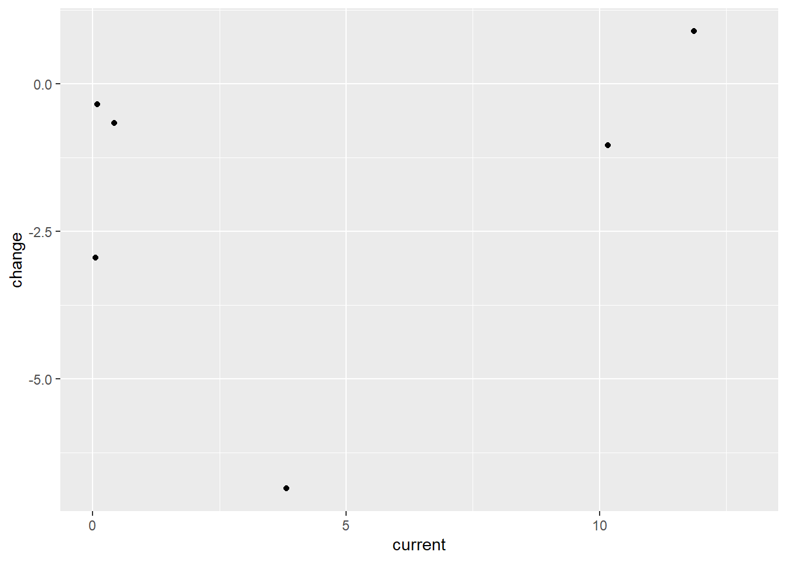

# Analysis of Indoor Air Quality


::: {.cell}

```{.r .cell-code}
library(tidyverse)
```

::: {.cell-output .cell-output-stderr}
```
── Attaching packages ─────────────────────────────────────── tidyverse 1.3.2 ──
✔ ggplot2 3.4.0     ✔ purrr   1.0.1
✔ tibble  3.1.8     ✔ dplyr   1.1.0
✔ tidyr   1.3.0     ✔ stringr 1.5.0
✔ readr   2.1.3     ✔ forcats 1.0.0
── Conflicts ────────────────────────────────────────── tidyverse_conflicts() ──
✖ dplyr::filter() masks stats::filter()
✖ dplyr::lag()    masks stats::lag()
```
:::

```{.r .cell-code}
library(kableExtra)
```

::: {.cell-output .cell-output-stderr}
```

Attaching package: 'kableExtra'

The following object is masked from 'package:dplyr':

    group_rows
```
:::

```{.r .cell-code}
library(ggplot2)
library(tidymodels)
```

::: {.cell-output .cell-output-stderr}
```
── Attaching packages ────────────────────────────────────── tidymodels 1.0.0 ──
✔ broom        1.0.3     ✔ rsample      1.1.1
✔ dials        1.1.0     ✔ tune         1.0.1
✔ infer        1.0.4     ✔ workflows    1.1.2
✔ modeldata    1.1.0     ✔ workflowsets 1.0.0
✔ parsnip      1.0.3     ✔ yardstick    1.1.0
✔ recipes      1.0.4     
── Conflicts ───────────────────────────────────────── tidymodels_conflicts() ──
✖ scales::discard()        masks purrr::discard()
✖ dplyr::filter()          masks stats::filter()
✖ recipes::fixed()         masks stringr::fixed()
✖ kableExtra::group_rows() masks dplyr::group_rows()
✖ dplyr::lag()             masks stats::lag()
✖ yardstick::spec()        masks readr::spec()
✖ recipes::step()          masks stats::step()
• Learn how to get started at https://www.tidymodels.org/start/
```
:::

```{.r .cell-code}
library(janitor)
```

::: {.cell-output .cell-output-stderr}
```

Attaching package: 'janitor'

The following objects are masked from 'package:stats':

    chisq.test, fisher.test
```
:::

```{.r .cell-code}
library(magrittr)
```

::: {.cell-output .cell-output-stderr}
```

Attaching package: 'magrittr'

The following object is masked from 'package:purrr':

    set_names

The following object is masked from 'package:tidyr':

    extract
```
:::

```{.r .cell-code}
 library(dplyr)

indoor_pollution <- readr::read_csv('https://raw.githubusercontent.com/rfordatascience/tidytuesday/master/data/2022/2022-04-12/indoor_pollution.csv') %>%

clean_names()
```

::: {.cell-output .cell-output-stderr}
```
Rows: 8010 Columns: 4
── Column specification ────────────────────────────────────────────────────────
Delimiter: ","
chr (2): Entity, Code
dbl (2): Year, Deaths - Cause: All causes - Risk: Household air pollution fr...

ℹ Use `spec()` to retrieve the full column specification for this data.
ℹ Specify the column types or set `show_col_types = FALSE` to quiet this message.
```
:::
:::

::: {.cell}

```{.r .cell-code}
 iap_splits <- initial_split(indoor_pollution, prop = 0.15,
                                   pool = 1) 

exploratory_data <- training(iap_splits)
test_data <- testing(iap_splits)

head(exploratory_data) %>%
  
  rename(percent_deaths_by_household_pollution = deaths_cause_all_causes_risk_household_air_pollution_from_solid_fuels_sex_both_age_age_standardized_percent) %>% #shorten the long name 
  
kable() %>%
    kable_styling(bootstrap_options = c("hover", "striped"))
```

::: {.cell-output-display}

`````{=html}
<table class="table table-hover table-striped" style="margin-left: auto; margin-right: auto;">
 <thead>
  <tr>
   <th style="text-align:left;"> entity </th>
   <th style="text-align:left;"> code </th>
   <th style="text-align:right;"> year </th>
   <th style="text-align:right;"> percent_deaths_by_household_pollution </th>
  </tr>
 </thead>
<tbody>
  <tr>
   <td style="text-align:left;"> Commonwealth Middle Income </td>
   <td style="text-align:left;"> NA </td>
   <td style="text-align:right;"> 2016 </td>
   <td style="text-align:right;"> 7.381989 </td>
  </tr>
  <tr>
   <td style="text-align:left;"> Albania </td>
   <td style="text-align:left;"> ALB </td>
   <td style="text-align:right;"> 2002 </td>
   <td style="text-align:right;"> 8.270560 </td>
  </tr>
  <tr>
   <td style="text-align:left;"> Somalia </td>
   <td style="text-align:left;"> SOM </td>
   <td style="text-align:right;"> 2017 </td>
   <td style="text-align:right;"> 16.475606 </td>
  </tr>
  <tr>
   <td style="text-align:left;"> Central Europe </td>
   <td style="text-align:left;"> NA </td>
   <td style="text-align:right;"> 2008 </td>
   <td style="text-align:right;"> 1.559082 </td>
  </tr>
  <tr>
   <td style="text-align:left;"> Sao Tome and Principe </td>
   <td style="text-align:left;"> STP </td>
   <td style="text-align:right;"> 1995 </td>
   <td style="text-align:right;"> 15.927135 </td>
  </tr>
  <tr>
   <td style="text-align:left;"> Uzbekistan </td>
   <td style="text-align:left;"> UZB </td>
   <td style="text-align:right;"> 2015 </td>
   <td style="text-align:right;"> 2.105938 </td>
  </tr>
</tbody>
</table>

`````

:::
:::


::: callout-note
**Observation:**

This data set contains variables gathered across multiple years, listing the percent of deaths caused by indoor air pollutants created from indoor combustion. Given the amount of data present in this dataset, several potential hypotheses could likely be considered.

The data, listed by country and region, are mixed in the dataset and will likely require some cleaning to separate. categorical data and contains variables that were collected over many years.

-   Depending on the scope of research, it may be more useful to focus on the dataset containing regional data rather than country-specific to highlight what role climate plays in the effect of indoor air pollution.

    -   In temperate climates, it is more likely to use biofuels for heating as well as cooking. Alongside the availability of insulation material for homes that reduced the ability for indoor and outdoor atmosphere gas exchange, this may be an essential factor that could be compared with this data.

    -   Using the temporal variable that is available in this data, some conclusions could be made about the

-   focusing on the countries rather than regions in this data could be used to show how countries that have invested in new technologies or better homes could correlate with either improved or worsened indoor air quality. Suppose homes are made more insulated but old gas stoves and wood fires are built into them. In that case, it is possible that the data could show up to a point a worsened impact on indoor air quality is associated with a country's growth in economic opportunity.
:::


::: {.cell}

```{.r .cell-code}
exploratory_data %>%
  
  rename(percent_deaths_by_household_pollution = deaths_cause_all_causes_risk_household_air_pollution_from_solid_fuels_sex_both_age_age_standardized_percent) %>% #shorten the long name 
  
  kable() %>%
    kable_styling(bootstrap_options = c("hover", "striped"))
```

::: {.cell-output-display}

`````{=html}
<table class="table table-hover table-striped" style="margin-left: auto; margin-right: auto;">
 <thead>
  <tr>
   <th style="text-align:left;"> entity </th>
   <th style="text-align:left;"> code </th>
   <th style="text-align:right;"> year </th>
   <th style="text-align:right;"> percent_deaths_by_household_pollution </th>
  </tr>
 </thead>
<tbody>
  <tr>
   <td style="text-align:left;"> Commonwealth Middle Income </td>
   <td style="text-align:left;"> NA </td>
   <td style="text-align:right;"> 2016 </td>
   <td style="text-align:right;"> 7.3819891 </td>
  </tr>
  <tr>
   <td style="text-align:left;"> Albania </td>
   <td style="text-align:left;"> ALB </td>
   <td style="text-align:right;"> 2002 </td>
   <td style="text-align:right;"> 8.2705600 </td>
  </tr>
  <tr>
   <td style="text-align:left;"> Somalia </td>
   <td style="text-align:left;"> SOM </td>
   <td style="text-align:right;"> 2017 </td>
   <td style="text-align:right;"> 16.4756057 </td>
  </tr>
  <tr>
   <td style="text-align:left;"> Central Europe </td>
   <td style="text-align:left;"> NA </td>
   <td style="text-align:right;"> 2008 </td>
   <td style="text-align:right;"> 1.5590816 </td>
  </tr>
  <tr>
   <td style="text-align:left;"> Sao Tome and Principe </td>
   <td style="text-align:left;"> STP </td>
   <td style="text-align:right;"> 1995 </td>
   <td style="text-align:right;"> 15.9271349 </td>
  </tr>
  <tr>
   <td style="text-align:left;"> Uzbekistan </td>
   <td style="text-align:left;"> UZB </td>
   <td style="text-align:right;"> 2015 </td>
   <td style="text-align:right;"> 2.1059380 </td>
  </tr>
  <tr>
   <td style="text-align:left;"> Niger </td>
   <td style="text-align:left;"> NER </td>
   <td style="text-align:right;"> 2017 </td>
   <td style="text-align:right;"> 15.9347915 </td>
  </tr>
  <tr>
   <td style="text-align:left;"> Commonwealth Middle Income </td>
   <td style="text-align:left;"> NA </td>
   <td style="text-align:right;"> 2007 </td>
   <td style="text-align:right;"> 10.1184492 </td>
  </tr>
  <tr>
   <td style="text-align:left;"> Cote d'Ivoire </td>
   <td style="text-align:left;"> CIV </td>
   <td style="text-align:right;"> 1995 </td>
   <td style="text-align:right;"> 11.2048534 </td>
  </tr>
  <tr>
   <td style="text-align:left;"> Middle SDI </td>
   <td style="text-align:left;"> NA </td>
   <td style="text-align:right;"> 1990 </td>
   <td style="text-align:right;"> 12.2659763 </td>
  </tr>
  <tr>
   <td style="text-align:left;"> Bahamas </td>
   <td style="text-align:left;"> BHS </td>
   <td style="text-align:right;"> 2016 </td>
   <td style="text-align:right;"> 0.0926613 </td>
  </tr>
  <tr>
   <td style="text-align:left;"> Sudan </td>
   <td style="text-align:left;"> SDN </td>
   <td style="text-align:right;"> 1994 </td>
   <td style="text-align:right;"> 17.0423069 </td>
  </tr>
  <tr>
   <td style="text-align:left;"> Singapore </td>
   <td style="text-align:left;"> SGP </td>
   <td style="text-align:right;"> 2010 </td>
   <td style="text-align:right;"> 0.0194680 </td>
  </tr>
  <tr>
   <td style="text-align:left;"> Sudan </td>
   <td style="text-align:left;"> SDN </td>
   <td style="text-align:right;"> 2016 </td>
   <td style="text-align:right;"> 8.0391625 </td>
  </tr>
  <tr>
   <td style="text-align:left;"> Luxembourg </td>
   <td style="text-align:left;"> LUX </td>
   <td style="text-align:right;"> 2001 </td>
   <td style="text-align:right;"> 0.0173418 </td>
  </tr>
  <tr>
   <td style="text-align:left;"> Malta </td>
   <td style="text-align:left;"> MLT </td>
   <td style="text-align:right;"> 2003 </td>
   <td style="text-align:right;"> 0.0419429 </td>
  </tr>
  <tr>
   <td style="text-align:left;"> Burkina Faso </td>
   <td style="text-align:left;"> BFA </td>
   <td style="text-align:right;"> 2000 </td>
   <td style="text-align:right;"> 12.1370768 </td>
  </tr>
  <tr>
   <td style="text-align:left;"> Burkina Faso </td>
   <td style="text-align:left;"> BFA </td>
   <td style="text-align:right;"> 1995 </td>
   <td style="text-align:right;"> 11.8697286 </td>
  </tr>
  <tr>
   <td style="text-align:left;"> Belarus </td>
   <td style="text-align:left;"> BLR </td>
   <td style="text-align:right;"> 2019 </td>
   <td style="text-align:right;"> 0.0754654 </td>
  </tr>
  <tr>
   <td style="text-align:left;"> Bosnia and Herzegovina </td>
   <td style="text-align:left;"> BIH </td>
   <td style="text-align:right;"> 2005 </td>
   <td style="text-align:right;"> 5.3704883 </td>
  </tr>
  <tr>
   <td style="text-align:left;"> Nordic Region </td>
   <td style="text-align:left;"> NA </td>
   <td style="text-align:right;"> 1996 </td>
   <td style="text-align:right;"> 0.0199760 </td>
  </tr>
  <tr>
   <td style="text-align:left;"> Netherlands </td>
   <td style="text-align:left;"> NLD </td>
   <td style="text-align:right;"> 2015 </td>
   <td style="text-align:right;"> 0.0043125 </td>
  </tr>
  <tr>
   <td style="text-align:left;"> America </td>
   <td style="text-align:left;"> NA </td>
   <td style="text-align:right;"> 1994 </td>
   <td style="text-align:right;"> 2.2365172 </td>
  </tr>
  <tr>
   <td style="text-align:left;"> Sao Tome and Principe </td>
   <td style="text-align:left;"> STP </td>
   <td style="text-align:right;"> 2019 </td>
   <td style="text-align:right;"> 9.2274836 </td>
  </tr>
  <tr>
   <td style="text-align:left;"> Honduras </td>
   <td style="text-align:left;"> HND </td>
   <td style="text-align:right;"> 2012 </td>
   <td style="text-align:right;"> 8.4926699 </td>
  </tr>
  <tr>
   <td style="text-align:left;"> Cyprus </td>
   <td style="text-align:left;"> CYP </td>
   <td style="text-align:right;"> 1992 </td>
   <td style="text-align:right;"> 0.1224732 </td>
  </tr>
  <tr>
   <td style="text-align:left;"> World Bank Upper Middle Income </td>
   <td style="text-align:left;"> NA </td>
   <td style="text-align:right;"> 2008 </td>
   <td style="text-align:right;"> 4.4431464 </td>
  </tr>
  <tr>
   <td style="text-align:left;"> Portugal </td>
   <td style="text-align:left;"> PRT </td>
   <td style="text-align:right;"> 2009 </td>
   <td style="text-align:right;"> 0.0738750 </td>
  </tr>
  <tr>
   <td style="text-align:left;"> Maldives </td>
   <td style="text-align:left;"> MDV </td>
   <td style="text-align:right;"> 2008 </td>
   <td style="text-align:right;"> 4.1813488 </td>
  </tr>
  <tr>
   <td style="text-align:left;"> Guyana </td>
   <td style="text-align:left;"> GUY </td>
   <td style="text-align:right;"> 1990 </td>
   <td style="text-align:right;"> 4.6329525 </td>
  </tr>
  <tr>
   <td style="text-align:left;"> Palau </td>
   <td style="text-align:left;"> PLW </td>
   <td style="text-align:right;"> 2018 </td>
   <td style="text-align:right;"> 0.0054239 </td>
  </tr>
  <tr>
   <td style="text-align:left;"> Middle East &amp; North Africa </td>
   <td style="text-align:left;"> NA </td>
   <td style="text-align:right;"> 2000 </td>
   <td style="text-align:right;"> 1.8471093 </td>
  </tr>
  <tr>
   <td style="text-align:left;"> San Marino </td>
   <td style="text-align:left;"> SMR </td>
   <td style="text-align:right;"> 2014 </td>
   <td style="text-align:right;"> 0.0063874 </td>
  </tr>
  <tr>
   <td style="text-align:left;"> Kazakhstan </td>
   <td style="text-align:left;"> KAZ </td>
   <td style="text-align:right;"> 1990 </td>
   <td style="text-align:right;"> 5.6882706 </td>
  </tr>
  <tr>
   <td style="text-align:left;"> Commonwealth Low Income </td>
   <td style="text-align:left;"> NA </td>
   <td style="text-align:right;"> 2002 </td>
   <td style="text-align:right;"> 12.5592550 </td>
  </tr>
  <tr>
   <td style="text-align:left;"> Taiwan </td>
   <td style="text-align:left;"> TWN </td>
   <td style="text-align:right;"> 1994 </td>
   <td style="text-align:right;"> 2.1746966 </td>
  </tr>
  <tr>
   <td style="text-align:left;"> Saint Vincent and the Grenadines </td>
   <td style="text-align:left;"> VCT </td>
   <td style="text-align:right;"> 2014 </td>
   <td style="text-align:right;"> 0.5554104 </td>
  </tr>
  <tr>
   <td style="text-align:left;"> European Region </td>
   <td style="text-align:left;"> NA </td>
   <td style="text-align:right;"> 2017 </td>
   <td style="text-align:right;"> 0.3769173 </td>
  </tr>
  <tr>
   <td style="text-align:left;"> Yemen </td>
   <td style="text-align:left;"> YEM </td>
   <td style="text-align:right;"> 2018 </td>
   <td style="text-align:right;"> 5.9011807 </td>
  </tr>
  <tr>
   <td style="text-align:left;"> Western Pacific Region </td>
   <td style="text-align:left;"> NA </td>
   <td style="text-align:right;"> 1999 </td>
   <td style="text-align:right;"> 10.0578908 </td>
  </tr>
  <tr>
   <td style="text-align:left;"> Puerto Rico </td>
   <td style="text-align:left;"> PRI </td>
   <td style="text-align:right;"> 1993 </td>
   <td style="text-align:right;"> 0.0073727 </td>
  </tr>
  <tr>
   <td style="text-align:left;"> New Zealand </td>
   <td style="text-align:left;"> NZL </td>
   <td style="text-align:right;"> 2004 </td>
   <td style="text-align:right;"> 0.0190037 </td>
  </tr>
  <tr>
   <td style="text-align:left;"> Nordic Region </td>
   <td style="text-align:left;"> NA </td>
   <td style="text-align:right;"> 2005 </td>
   <td style="text-align:right;"> 0.0095790 </td>
  </tr>
  <tr>
   <td style="text-align:left;"> Chad </td>
   <td style="text-align:left;"> TCD </td>
   <td style="text-align:right;"> 2019 </td>
   <td style="text-align:right;"> 13.9779472 </td>
  </tr>
  <tr>
   <td style="text-align:left;"> Malta </td>
   <td style="text-align:left;"> MLT </td>
   <td style="text-align:right;"> 2016 </td>
   <td style="text-align:right;"> 0.0130177 </td>
  </tr>
  <tr>
   <td style="text-align:left;"> Luxembourg </td>
   <td style="text-align:left;"> LUX </td>
   <td style="text-align:right;"> 2003 </td>
   <td style="text-align:right;"> 0.0152799 </td>
  </tr>
  <tr>
   <td style="text-align:left;"> Congo </td>
   <td style="text-align:left;"> COG </td>
   <td style="text-align:right;"> 2011 </td>
   <td style="text-align:right;"> 7.4229149 </td>
  </tr>
  <tr>
   <td style="text-align:left;"> Lithuania </td>
   <td style="text-align:left;"> LTU </td>
   <td style="text-align:right;"> 2013 </td>
   <td style="text-align:right;"> 0.2207118 </td>
  </tr>
  <tr>
   <td style="text-align:left;"> Trinidad and Tobago </td>
   <td style="text-align:left;"> TTO </td>
   <td style="text-align:right;"> 2009 </td>
   <td style="text-align:right;"> 0.0213992 </td>
  </tr>
  <tr>
   <td style="text-align:left;"> American Samoa </td>
   <td style="text-align:left;"> ASM </td>
   <td style="text-align:right;"> 1996 </td>
   <td style="text-align:right;"> 3.2961654 </td>
  </tr>
  <tr>
   <td style="text-align:left;"> Antigua and Barbuda </td>
   <td style="text-align:left;"> ATG </td>
   <td style="text-align:right;"> 2014 </td>
   <td style="text-align:right;"> 0.1211412 </td>
  </tr>
  <tr>
   <td style="text-align:left;"> South Asia - World Bank region </td>
   <td style="text-align:left;"> NA </td>
   <td style="text-align:right;"> 2015 </td>
   <td style="text-align:right;"> 8.4281627 </td>
  </tr>
  <tr>
   <td style="text-align:left;"> Puerto Rico </td>
   <td style="text-align:left;"> PRI </td>
   <td style="text-align:right;"> 2007 </td>
   <td style="text-align:right;"> 0.0035680 </td>
  </tr>
  <tr>
   <td style="text-align:left;"> Vanuatu </td>
   <td style="text-align:left;"> VUT </td>
   <td style="text-align:right;"> 1991 </td>
   <td style="text-align:right;"> 18.2713208 </td>
  </tr>
  <tr>
   <td style="text-align:left;"> Bolivia </td>
   <td style="text-align:left;"> BOL </td>
   <td style="text-align:right;"> 1991 </td>
   <td style="text-align:right;"> 8.0195381 </td>
  </tr>
  <tr>
   <td style="text-align:left;"> Oman </td>
   <td style="text-align:left;"> OMN </td>
   <td style="text-align:right;"> 2006 </td>
   <td style="text-align:right;"> 0.3952848 </td>
  </tr>
  <tr>
   <td style="text-align:left;"> Southern sub-Saharan Africa </td>
   <td style="text-align:left;"> NA </td>
   <td style="text-align:right;"> 2002 </td>
   <td style="text-align:right;"> 3.6336590 </td>
  </tr>
  <tr>
   <td style="text-align:left;"> Luxembourg </td>
   <td style="text-align:left;"> LUX </td>
   <td style="text-align:right;"> 1990 </td>
   <td style="text-align:right;"> 0.0309207 </td>
  </tr>
  <tr>
   <td style="text-align:left;"> Greece </td>
   <td style="text-align:left;"> GRC </td>
   <td style="text-align:right;"> 2003 </td>
   <td style="text-align:right;"> 0.0907921 </td>
  </tr>
  <tr>
   <td style="text-align:left;"> Bahrain </td>
   <td style="text-align:left;"> BHR </td>
   <td style="text-align:right;"> 2000 </td>
   <td style="text-align:right;"> 0.4057527 </td>
  </tr>
  <tr>
   <td style="text-align:left;"> Georgia </td>
   <td style="text-align:left;"> GEO </td>
   <td style="text-align:right;"> 2006 </td>
   <td style="text-align:right;"> 6.5788029 </td>
  </tr>
  <tr>
   <td style="text-align:left;"> Guyana </td>
   <td style="text-align:left;"> GUY </td>
   <td style="text-align:right;"> 2015 </td>
   <td style="text-align:right;"> 1.1566587 </td>
  </tr>
  <tr>
   <td style="text-align:left;"> Caribbean </td>
   <td style="text-align:left;"> NA </td>
   <td style="text-align:right;"> 1998 </td>
   <td style="text-align:right;"> 4.9783172 </td>
  </tr>
  <tr>
   <td style="text-align:left;"> Eastern sub-Saharan Africa </td>
   <td style="text-align:left;"> NA </td>
   <td style="text-align:right;"> 2010 </td>
   <td style="text-align:right;"> 11.9229801 </td>
  </tr>
  <tr>
   <td style="text-align:left;"> Comoros </td>
   <td style="text-align:left;"> COM </td>
   <td style="text-align:right;"> 2004 </td>
   <td style="text-align:right;"> 12.6182506 </td>
  </tr>
  <tr>
   <td style="text-align:left;"> Vietnam </td>
   <td style="text-align:left;"> VNM </td>
   <td style="text-align:right;"> 2018 </td>
   <td style="text-align:right;"> 5.5723214 </td>
  </tr>
  <tr>
   <td style="text-align:left;"> Seychelles </td>
   <td style="text-align:left;"> SYC </td>
   <td style="text-align:right;"> 2003 </td>
   <td style="text-align:right;"> 0.1875350 </td>
  </tr>
  <tr>
   <td style="text-align:left;"> Kazakhstan </td>
   <td style="text-align:left;"> KAZ </td>
   <td style="text-align:right;"> 2019 </td>
   <td style="text-align:right;"> 1.0410325 </td>
  </tr>
  <tr>
   <td style="text-align:left;"> Australasia </td>
   <td style="text-align:left;"> NA </td>
   <td style="text-align:right;"> 1998 </td>
   <td style="text-align:right;"> 0.0505357 </td>
  </tr>
  <tr>
   <td style="text-align:left;"> Guinea </td>
   <td style="text-align:left;"> GIN </td>
   <td style="text-align:right;"> 2009 </td>
   <td style="text-align:right;"> 13.7167296 </td>
  </tr>
  <tr>
   <td style="text-align:left;"> World Bank Low Income </td>
   <td style="text-align:left;"> NA </td>
   <td style="text-align:right;"> 2018 </td>
   <td style="text-align:right;"> 12.7289506 </td>
  </tr>
  <tr>
   <td style="text-align:left;"> Singapore </td>
   <td style="text-align:left;"> SGP </td>
   <td style="text-align:right;"> 1998 </td>
   <td style="text-align:right;"> 0.1362979 </td>
  </tr>
  <tr>
   <td style="text-align:left;"> Uzbekistan </td>
   <td style="text-align:left;"> UZB </td>
   <td style="text-align:right;"> 2007 </td>
   <td style="text-align:right;"> 3.7657327 </td>
  </tr>
  <tr>
   <td style="text-align:left;"> Cook Islands </td>
   <td style="text-align:left;"> COK </td>
   <td style="text-align:right;"> 2014 </td>
   <td style="text-align:right;"> 0.5173627 </td>
  </tr>
  <tr>
   <td style="text-align:left;"> Papua New Guinea </td>
   <td style="text-align:left;"> PNG </td>
   <td style="text-align:right;"> 2010 </td>
   <td style="text-align:right;"> 19.1393095 </td>
  </tr>
  <tr>
   <td style="text-align:left;"> Armenia </td>
   <td style="text-align:left;"> ARM </td>
   <td style="text-align:right;"> 2016 </td>
   <td style="text-align:right;"> 0.3337881 </td>
  </tr>
  <tr>
   <td style="text-align:left;"> Saint Lucia </td>
   <td style="text-align:left;"> LCA </td>
   <td style="text-align:right;"> 2010 </td>
   <td style="text-align:right;"> 0.6329876 </td>
  </tr>
  <tr>
   <td style="text-align:left;"> Bermuda </td>
   <td style="text-align:left;"> BMU </td>
   <td style="text-align:right;"> 1995 </td>
   <td style="text-align:right;"> 0.8681930 </td>
  </tr>
  <tr>
   <td style="text-align:left;"> Portugal </td>
   <td style="text-align:left;"> PRT </td>
   <td style="text-align:right;"> 1995 </td>
   <td style="text-align:right;"> 0.3354584 </td>
  </tr>
  <tr>
   <td style="text-align:left;"> Wales </td>
   <td style="text-align:left;"> NA </td>
   <td style="text-align:right;"> 2000 </td>
   <td style="text-align:right;"> 0.0092206 </td>
  </tr>
  <tr>
   <td style="text-align:left;"> Middle SDI </td>
   <td style="text-align:left;"> NA </td>
   <td style="text-align:right;"> 1993 </td>
   <td style="text-align:right;"> 11.2813171 </td>
  </tr>
  <tr>
   <td style="text-align:left;"> World Bank High Income </td>
   <td style="text-align:left;"> NA </td>
   <td style="text-align:right;"> 1999 </td>
   <td style="text-align:right;"> 0.2022270 </td>
  </tr>
  <tr>
   <td style="text-align:left;"> Rwanda </td>
   <td style="text-align:left;"> RWA </td>
   <td style="text-align:right;"> 2002 </td>
   <td style="text-align:right;"> 11.4953298 </td>
  </tr>
  <tr>
   <td style="text-align:left;"> United Arab Emirates </td>
   <td style="text-align:left;"> ARE </td>
   <td style="text-align:right;"> 1999 </td>
   <td style="text-align:right;"> 0.0108052 </td>
  </tr>
  <tr>
   <td style="text-align:left;"> Cameroon </td>
   <td style="text-align:left;"> CMR </td>
   <td style="text-align:right;"> 1995 </td>
   <td style="text-align:right;"> 9.7769962 </td>
  </tr>
  <tr>
   <td style="text-align:left;"> Uruguay </td>
   <td style="text-align:left;"> URY </td>
   <td style="text-align:right;"> 2011 </td>
   <td style="text-align:right;"> 0.2684852 </td>
  </tr>
  <tr>
   <td style="text-align:left;"> Bulgaria </td>
   <td style="text-align:left;"> BGR </td>
   <td style="text-align:right;"> 1990 </td>
   <td style="text-align:right;"> 3.6968671 </td>
  </tr>
  <tr>
   <td style="text-align:left;"> Eritrea </td>
   <td style="text-align:left;"> ERI </td>
   <td style="text-align:right;"> 2013 </td>
   <td style="text-align:right;"> 11.1515932 </td>
  </tr>
  <tr>
   <td style="text-align:left;"> Central Latin America </td>
   <td style="text-align:left;"> NA </td>
   <td style="text-align:right;"> 2002 </td>
   <td style="text-align:right;"> 3.2990697 </td>
  </tr>
  <tr>
   <td style="text-align:left;"> Western sub-Saharan Africa </td>
   <td style="text-align:left;"> NA </td>
   <td style="text-align:right;"> 1990 </td>
   <td style="text-align:right;"> 12.8202000 </td>
  </tr>
  <tr>
   <td style="text-align:left;"> Nigeria </td>
   <td style="text-align:left;"> NGA </td>
   <td style="text-align:right;"> 1994 </td>
   <td style="text-align:right;"> 12.0738894 </td>
  </tr>
  <tr>
   <td style="text-align:left;"> Eastern Europe </td>
   <td style="text-align:left;"> NA </td>
   <td style="text-align:right;"> 2012 </td>
   <td style="text-align:right;"> 0.2791135 </td>
  </tr>
  <tr>
   <td style="text-align:left;"> Nauru </td>
   <td style="text-align:left;"> NRU </td>
   <td style="text-align:right;"> 2009 </td>
   <td style="text-align:right;"> 1.5659575 </td>
  </tr>
  <tr>
   <td style="text-align:left;"> Western Europe </td>
   <td style="text-align:left;"> NA </td>
   <td style="text-align:right;"> 2013 </td>
   <td style="text-align:right;"> 0.0159992 </td>
  </tr>
  <tr>
   <td style="text-align:left;"> Trinidad and Tobago </td>
   <td style="text-align:left;"> TTO </td>
   <td style="text-align:right;"> 2014 </td>
   <td style="text-align:right;"> 0.0147606 </td>
  </tr>
  <tr>
   <td style="text-align:left;"> Barbados </td>
   <td style="text-align:left;"> BRB </td>
   <td style="text-align:right;"> 2013 </td>
   <td style="text-align:right;"> 0.0090366 </td>
  </tr>
  <tr>
   <td style="text-align:left;"> Timor </td>
   <td style="text-align:left;"> TLS </td>
   <td style="text-align:right;"> 2017 </td>
   <td style="text-align:right;"> 13.9659506 </td>
  </tr>
  <tr>
   <td style="text-align:left;"> Andean Latin America </td>
   <td style="text-align:left;"> NA </td>
   <td style="text-align:right;"> 1999 </td>
   <td style="text-align:right;"> 4.4227579 </td>
  </tr>
  <tr>
   <td style="text-align:left;"> Latin America &amp; Caribbean - World Bank region </td>
   <td style="text-align:left;"> NA </td>
   <td style="text-align:right;"> 2011 </td>
   <td style="text-align:right;"> 2.1792623 </td>
  </tr>
  <tr>
   <td style="text-align:left;"> OECD Countries </td>
   <td style="text-align:left;"> NA </td>
   <td style="text-align:right;"> 1991 </td>
   <td style="text-align:right;"> 0.5894371 </td>
  </tr>
  <tr>
   <td style="text-align:left;"> High SDI </td>
   <td style="text-align:left;"> NA </td>
   <td style="text-align:right;"> 2016 </td>
   <td style="text-align:right;"> 0.0242860 </td>
  </tr>
  <tr>
   <td style="text-align:left;"> Guinea-Bissau </td>
   <td style="text-align:left;"> GNB </td>
   <td style="text-align:right;"> 1997 </td>
   <td style="text-align:right;"> 13.5338109 </td>
  </tr>
  <tr>
   <td style="text-align:left;"> Albania </td>
   <td style="text-align:left;"> ALB </td>
   <td style="text-align:right;"> 2019 </td>
   <td style="text-align:right;"> 3.0463064 </td>
  </tr>
  <tr>
   <td style="text-align:left;"> Mexico </td>
   <td style="text-align:left;"> MEX </td>
   <td style="text-align:right;"> 2018 </td>
   <td style="text-align:right;"> 1.4537403 </td>
  </tr>
  <tr>
   <td style="text-align:left;"> Commonwealth High Income </td>
   <td style="text-align:left;"> NA </td>
   <td style="text-align:right;"> 1995 </td>
   <td style="text-align:right;"> 0.0318678 </td>
  </tr>
  <tr>
   <td style="text-align:left;"> Niger </td>
   <td style="text-align:left;"> NER </td>
   <td style="text-align:right;"> 2013 </td>
   <td style="text-align:right;"> 15.3008260 </td>
  </tr>
  <tr>
   <td style="text-align:left;"> Eritrea </td>
   <td style="text-align:left;"> ERI </td>
   <td style="text-align:right;"> 2019 </td>
   <td style="text-align:right;"> 10.2382636 </td>
  </tr>
  <tr>
   <td style="text-align:left;"> Netherlands </td>
   <td style="text-align:left;"> NLD </td>
   <td style="text-align:right;"> 2019 </td>
   <td style="text-align:right;"> 0.0035662 </td>
  </tr>
  <tr>
   <td style="text-align:left;"> Cote d'Ivoire </td>
   <td style="text-align:left;"> CIV </td>
   <td style="text-align:right;"> 1994 </td>
   <td style="text-align:right;"> 11.5817910 </td>
  </tr>
  <tr>
   <td style="text-align:left;"> Namibia </td>
   <td style="text-align:left;"> NAM </td>
   <td style="text-align:right;"> 1997 </td>
   <td style="text-align:right;"> 8.5419094 </td>
  </tr>
  <tr>
   <td style="text-align:left;"> North Korea </td>
   <td style="text-align:left;"> PRK </td>
   <td style="text-align:right;"> 2005 </td>
   <td style="text-align:right;"> 17.9488226 </td>
  </tr>
  <tr>
   <td style="text-align:left;"> England </td>
   <td style="text-align:left;"> NA </td>
   <td style="text-align:right;"> 2008 </td>
   <td style="text-align:right;"> 0.0033704 </td>
  </tr>
  <tr>
   <td style="text-align:left;"> Papua New Guinea </td>
   <td style="text-align:left;"> PNG </td>
   <td style="text-align:right;"> 2000 </td>
   <td style="text-align:right;"> 20.1072702 </td>
  </tr>
  <tr>
   <td style="text-align:left;"> Thailand </td>
   <td style="text-align:left;"> THA </td>
   <td style="text-align:right;"> 2011 </td>
   <td style="text-align:right;"> 2.4531593 </td>
  </tr>
  <tr>
   <td style="text-align:left;"> South Sudan </td>
   <td style="text-align:left;"> SSD </td>
   <td style="text-align:right;"> 1999 </td>
   <td style="text-align:right;"> 11.8134755 </td>
  </tr>
  <tr>
   <td style="text-align:left;"> Eswatini </td>
   <td style="text-align:left;"> SWZ </td>
   <td style="text-align:right;"> 1994 </td>
   <td style="text-align:right;"> 10.7117194 </td>
  </tr>
  <tr>
   <td style="text-align:left;"> Algeria </td>
   <td style="text-align:left;"> DZA </td>
   <td style="text-align:right;"> 1993 </td>
   <td style="text-align:right;"> 1.6356766 </td>
  </tr>
  <tr>
   <td style="text-align:left;"> Mongolia </td>
   <td style="text-align:left;"> MNG </td>
   <td style="text-align:right;"> 2008 </td>
   <td style="text-align:right;"> 8.0170333 </td>
  </tr>
  <tr>
   <td style="text-align:left;"> Marshall Islands </td>
   <td style="text-align:left;"> MHL </td>
   <td style="text-align:right;"> 2007 </td>
   <td style="text-align:right;"> 7.1746263 </td>
  </tr>
  <tr>
   <td style="text-align:left;"> United Kingdom </td>
   <td style="text-align:left;"> GBR </td>
   <td style="text-align:right;"> 1997 </td>
   <td style="text-align:right;"> 0.0073519 </td>
  </tr>
  <tr>
   <td style="text-align:left;"> Andorra </td>
   <td style="text-align:left;"> AND </td>
   <td style="text-align:right;"> 2018 </td>
   <td style="text-align:right;"> 0.0039268 </td>
  </tr>
  <tr>
   <td style="text-align:left;"> OECD Countries </td>
   <td style="text-align:left;"> NA </td>
   <td style="text-align:right;"> 1992 </td>
   <td style="text-align:right;"> 0.5514249 </td>
  </tr>
  <tr>
   <td style="text-align:left;"> Morocco </td>
   <td style="text-align:left;"> MAR </td>
   <td style="text-align:right;"> 1995 </td>
   <td style="text-align:right;"> 5.8927615 </td>
  </tr>
  <tr>
   <td style="text-align:left;"> Malawi </td>
   <td style="text-align:left;"> MWI </td>
   <td style="text-align:right;"> 2006 </td>
   <td style="text-align:right;"> 9.2571297 </td>
  </tr>
  <tr>
   <td style="text-align:left;"> Slovenia </td>
   <td style="text-align:left;"> SVN </td>
   <td style="text-align:right;"> 1995 </td>
   <td style="text-align:right;"> 1.0962640 </td>
  </tr>
  <tr>
   <td style="text-align:left;"> Azerbaijan </td>
   <td style="text-align:left;"> AZE </td>
   <td style="text-align:right;"> 1998 </td>
   <td style="text-align:right;"> 6.0467752 </td>
  </tr>
  <tr>
   <td style="text-align:left;"> Vanuatu </td>
   <td style="text-align:left;"> VUT </td>
   <td style="text-align:right;"> 2010 </td>
   <td style="text-align:right;"> 16.7384605 </td>
  </tr>
  <tr>
   <td style="text-align:left;"> Netherlands </td>
   <td style="text-align:left;"> NLD </td>
   <td style="text-align:right;"> 2012 </td>
   <td style="text-align:right;"> 0.0051779 </td>
  </tr>
  <tr>
   <td style="text-align:left;"> Guinea </td>
   <td style="text-align:left;"> GIN </td>
   <td style="text-align:right;"> 2006 </td>
   <td style="text-align:right;"> 13.8596335 </td>
  </tr>
  <tr>
   <td style="text-align:left;"> Gambia </td>
   <td style="text-align:left;"> GMB </td>
   <td style="text-align:right;"> 2008 </td>
   <td style="text-align:right;"> 12.8275805 </td>
  </tr>
  <tr>
   <td style="text-align:left;"> Africa </td>
   <td style="text-align:left;"> NA </td>
   <td style="text-align:right;"> 1991 </td>
   <td style="text-align:right;"> 10.8784369 </td>
  </tr>
  <tr>
   <td style="text-align:left;"> India </td>
   <td style="text-align:left;"> IND </td>
   <td style="text-align:right;"> 2017 </td>
   <td style="text-align:right;"> 7.2710429 </td>
  </tr>
  <tr>
   <td style="text-align:left;"> Region of the Americas </td>
   <td style="text-align:left;"> NA </td>
   <td style="text-align:right;"> 2017 </td>
   <td style="text-align:right;"> 0.9501793 </td>
  </tr>
  <tr>
   <td style="text-align:left;"> Western sub-Saharan Africa </td>
   <td style="text-align:left;"> NA </td>
   <td style="text-align:right;"> 2000 </td>
   <td style="text-align:right;"> 11.3697290 </td>
  </tr>
  <tr>
   <td style="text-align:left;"> Belgium </td>
   <td style="text-align:left;"> BEL </td>
   <td style="text-align:right;"> 2001 </td>
   <td style="text-align:right;"> 0.0182279 </td>
  </tr>
  <tr>
   <td style="text-align:left;"> Tonga </td>
   <td style="text-align:left;"> TON </td>
   <td style="text-align:right;"> 1991 </td>
   <td style="text-align:right;"> 10.8956047 </td>
  </tr>
  <tr>
   <td style="text-align:left;"> Samoa </td>
   <td style="text-align:left;"> WSM </td>
   <td style="text-align:right;"> 2016 </td>
   <td style="text-align:right;"> 11.6459726 </td>
  </tr>
  <tr>
   <td style="text-align:left;"> Thailand </td>
   <td style="text-align:left;"> THA </td>
   <td style="text-align:right;"> 1999 </td>
   <td style="text-align:right;"> 4.5519410 </td>
  </tr>
  <tr>
   <td style="text-align:left;"> Zambia </td>
   <td style="text-align:left;"> ZMB </td>
   <td style="text-align:right;"> 1990 </td>
   <td style="text-align:right;"> 10.8846051 </td>
  </tr>
  <tr>
   <td style="text-align:left;"> Europe </td>
   <td style="text-align:left;"> NA </td>
   <td style="text-align:right;"> 2002 </td>
   <td style="text-align:right;"> 0.6965142 </td>
  </tr>
  <tr>
   <td style="text-align:left;"> El Salvador </td>
   <td style="text-align:left;"> SLV </td>
   <td style="text-align:right;"> 2005 </td>
   <td style="text-align:right;"> 4.8299256 </td>
  </tr>
  <tr>
   <td style="text-align:left;"> World Bank Lower Middle Income </td>
   <td style="text-align:left;"> NA </td>
   <td style="text-align:right;"> 1997 </td>
   <td style="text-align:right;"> 11.2956039 </td>
  </tr>
  <tr>
   <td style="text-align:left;"> Bermuda </td>
   <td style="text-align:left;"> BMU </td>
   <td style="text-align:right;"> 2007 </td>
   <td style="text-align:right;"> 0.3021953 </td>
  </tr>
  <tr>
   <td style="text-align:left;"> Solomon Islands </td>
   <td style="text-align:left;"> SLB </td>
   <td style="text-align:right;"> 2017 </td>
   <td style="text-align:right;"> 20.8636959 </td>
  </tr>
  <tr>
   <td style="text-align:left;"> High-income </td>
   <td style="text-align:left;"> NA </td>
   <td style="text-align:right;"> 1994 </td>
   <td style="text-align:right;"> 0.1108133 </td>
  </tr>
  <tr>
   <td style="text-align:left;"> Belarus </td>
   <td style="text-align:left;"> BLR </td>
   <td style="text-align:right;"> 1995 </td>
   <td style="text-align:right;"> 0.6036668 </td>
  </tr>
  <tr>
   <td style="text-align:left;"> Singapore </td>
   <td style="text-align:left;"> SGP </td>
   <td style="text-align:right;"> 2006 </td>
   <td style="text-align:right;"> 0.0364316 </td>
  </tr>
  <tr>
   <td style="text-align:left;"> Iran </td>
   <td style="text-align:left;"> IRN </td>
   <td style="text-align:right;"> 1993 </td>
   <td style="text-align:right;"> 1.4896693 </td>
  </tr>
  <tr>
   <td style="text-align:left;"> Australia </td>
   <td style="text-align:left;"> AUS </td>
   <td style="text-align:right;"> 2018 </td>
   <td style="text-align:right;"> 0.0081680 </td>
  </tr>
  <tr>
   <td style="text-align:left;"> United Arab Emirates </td>
   <td style="text-align:left;"> ARE </td>
   <td style="text-align:right;"> 2017 </td>
   <td style="text-align:right;"> 0.0006213 </td>
  </tr>
  <tr>
   <td style="text-align:left;"> Western Europe </td>
   <td style="text-align:left;"> NA </td>
   <td style="text-align:right;"> 1996 </td>
   <td style="text-align:right;"> 0.0588839 </td>
  </tr>
  <tr>
   <td style="text-align:left;"> Angola </td>
   <td style="text-align:left;"> AGO </td>
   <td style="text-align:right;"> 1994 </td>
   <td style="text-align:right;"> 12.2425309 </td>
  </tr>
  <tr>
   <td style="text-align:left;"> Seychelles </td>
   <td style="text-align:left;"> SYC </td>
   <td style="text-align:right;"> 2010 </td>
   <td style="text-align:right;"> 0.0938481 </td>
  </tr>
  <tr>
   <td style="text-align:left;"> North America </td>
   <td style="text-align:left;"> NA </td>
   <td style="text-align:right;"> 1991 </td>
   <td style="text-align:right;"> 0.0189736 </td>
  </tr>
  <tr>
   <td style="text-align:left;"> Saint Vincent and the Grenadines </td>
   <td style="text-align:left;"> VCT </td>
   <td style="text-align:right;"> 2007 </td>
   <td style="text-align:right;"> 0.8205803 </td>
  </tr>
  <tr>
   <td style="text-align:left;"> Paraguay </td>
   <td style="text-align:left;"> PRY </td>
   <td style="text-align:right;"> 2006 </td>
   <td style="text-align:right;"> 7.2374351 </td>
  </tr>
  <tr>
   <td style="text-align:left;"> Gabon </td>
   <td style="text-align:left;"> GAB </td>
   <td style="text-align:right;"> 2015 </td>
   <td style="text-align:right;"> 1.0485340 </td>
  </tr>
  <tr>
   <td style="text-align:left;"> Commonwealth Low Income </td>
   <td style="text-align:left;"> NA </td>
   <td style="text-align:right;"> 2018 </td>
   <td style="text-align:right;"> 11.1411831 </td>
  </tr>
  <tr>
   <td style="text-align:left;"> Italy </td>
   <td style="text-align:left;"> ITA </td>
   <td style="text-align:right;"> 2008 </td>
   <td style="text-align:right;"> 0.0342351 </td>
  </tr>
  <tr>
   <td style="text-align:left;"> Guinea </td>
   <td style="text-align:left;"> GIN </td>
   <td style="text-align:right;"> 2013 </td>
   <td style="text-align:right;"> 13.7158024 </td>
  </tr>
  <tr>
   <td style="text-align:left;"> Guinea-Bissau </td>
   <td style="text-align:left;"> GNB </td>
   <td style="text-align:right;"> 2016 </td>
   <td style="text-align:right;"> 13.5898817 </td>
  </tr>
  <tr>
   <td style="text-align:left;"> Tokelau </td>
   <td style="text-align:left;"> TKL </td>
   <td style="text-align:right;"> 1991 </td>
   <td style="text-align:right;"> 0.0752783 </td>
  </tr>
  <tr>
   <td style="text-align:left;"> Taiwan </td>
   <td style="text-align:left;"> TWN </td>
   <td style="text-align:right;"> 1995 </td>
   <td style="text-align:right;"> 1.9481192 </td>
  </tr>
  <tr>
   <td style="text-align:left;"> Eritrea </td>
   <td style="text-align:left;"> ERI </td>
   <td style="text-align:right;"> 2017 </td>
   <td style="text-align:right;"> 10.6148191 </td>
  </tr>
  <tr>
   <td style="text-align:left;"> Africa </td>
   <td style="text-align:left;"> NA </td>
   <td style="text-align:right;"> 1996 </td>
   <td style="text-align:right;"> 9.9244462 </td>
  </tr>
  <tr>
   <td style="text-align:left;"> Chile </td>
   <td style="text-align:left;"> CHL </td>
   <td style="text-align:right;"> 2001 </td>
   <td style="text-align:right;"> 1.1071750 </td>
  </tr>
  <tr>
   <td style="text-align:left;"> United States Virgin Islands </td>
   <td style="text-align:left;"> VIR </td>
   <td style="text-align:right;"> 1992 </td>
   <td style="text-align:right;"> 0.3569602 </td>
  </tr>
  <tr>
   <td style="text-align:left;"> America </td>
   <td style="text-align:left;"> NA </td>
   <td style="text-align:right;"> 1998 </td>
   <td style="text-align:right;"> 1.8790140 </td>
  </tr>
  <tr>
   <td style="text-align:left;"> Dominica </td>
   <td style="text-align:left;"> DMA </td>
   <td style="text-align:right;"> 2006 </td>
   <td style="text-align:right;"> 1.1229164 </td>
  </tr>
  <tr>
   <td style="text-align:left;"> World Bank Low Income </td>
   <td style="text-align:left;"> NA </td>
   <td style="text-align:right;"> 1992 </td>
   <td style="text-align:right;"> 14.2070626 </td>
  </tr>
  <tr>
   <td style="text-align:left;"> Paraguay </td>
   <td style="text-align:left;"> PRY </td>
   <td style="text-align:right;"> 1998 </td>
   <td style="text-align:right;"> 9.0654793 </td>
  </tr>
  <tr>
   <td style="text-align:left;"> Eastern Mediterranean Region </td>
   <td style="text-align:left;"> NA </td>
   <td style="text-align:right;"> 1999 </td>
   <td style="text-align:right;"> 8.5801616 </td>
  </tr>
  <tr>
   <td style="text-align:left;"> Northern Ireland </td>
   <td style="text-align:left;"> NA </td>
   <td style="text-align:right;"> 2000 </td>
   <td style="text-align:right;"> 0.0115042 </td>
  </tr>
  <tr>
   <td style="text-align:left;"> China </td>
   <td style="text-align:left;"> CHN </td>
   <td style="text-align:right;"> 1999 </td>
   <td style="text-align:right;"> 12.2363395 </td>
  </tr>
  <tr>
   <td style="text-align:left;"> Middle East &amp; North Africa </td>
   <td style="text-align:left;"> NA </td>
   <td style="text-align:right;"> 2006 </td>
   <td style="text-align:right;"> 1.1522147 </td>
  </tr>
  <tr>
   <td style="text-align:left;"> Fiji </td>
   <td style="text-align:left;"> FJI </td>
   <td style="text-align:right;"> 2007 </td>
   <td style="text-align:right;"> 6.6826468 </td>
  </tr>
  <tr>
   <td style="text-align:left;"> Guinea-Bissau </td>
   <td style="text-align:left;"> GNB </td>
   <td style="text-align:right;"> 1995 </td>
   <td style="text-align:right;"> 14.0551954 </td>
  </tr>
  <tr>
   <td style="text-align:left;"> Haiti </td>
   <td style="text-align:left;"> HTI </td>
   <td style="text-align:right;"> 1997 </td>
   <td style="text-align:right;"> 14.6174744 </td>
  </tr>
  <tr>
   <td style="text-align:left;"> Low SDI </td>
   <td style="text-align:left;"> NA </td>
   <td style="text-align:right;"> 2004 </td>
   <td style="text-align:right;"> 13.1892829 </td>
  </tr>
  <tr>
   <td style="text-align:left;"> Middle East &amp; North Africa </td>
   <td style="text-align:left;"> NA </td>
   <td style="text-align:right;"> 1994 </td>
   <td style="text-align:right;"> 2.9178428 </td>
  </tr>
  <tr>
   <td style="text-align:left;"> Commonwealth Low Income </td>
   <td style="text-align:left;"> NA </td>
   <td style="text-align:right;"> 1992 </td>
   <td style="text-align:right;"> 13.6990415 </td>
  </tr>
  <tr>
   <td style="text-align:left;"> Malaysia </td>
   <td style="text-align:left;"> MYS </td>
   <td style="text-align:right;"> 1999 </td>
   <td style="text-align:right;"> 0.3353684 </td>
  </tr>
  <tr>
   <td style="text-align:left;"> Benin </td>
   <td style="text-align:left;"> BEN </td>
   <td style="text-align:right;"> 1994 </td>
   <td style="text-align:right;"> 14.8962625 </td>
  </tr>
  <tr>
   <td style="text-align:left;"> Cook Islands </td>
   <td style="text-align:left;"> COK </td>
   <td style="text-align:right;"> 2001 </td>
   <td style="text-align:right;"> 0.9131933 </td>
  </tr>
  <tr>
   <td style="text-align:left;"> Central Asia </td>
   <td style="text-align:left;"> NA </td>
   <td style="text-align:right;"> 2019 </td>
   <td style="text-align:right;"> 1.8983019 </td>
  </tr>
  <tr>
   <td style="text-align:left;"> Central Europe </td>
   <td style="text-align:left;"> NA </td>
   <td style="text-align:right;"> 2015 </td>
   <td style="text-align:right;"> 1.1098765 </td>
  </tr>
  <tr>
   <td style="text-align:left;"> East Asia </td>
   <td style="text-align:left;"> NA </td>
   <td style="text-align:right;"> 2014 </td>
   <td style="text-align:right;"> 4.8506201 </td>
  </tr>
  <tr>
   <td style="text-align:left;"> Timor </td>
   <td style="text-align:left;"> TLS </td>
   <td style="text-align:right;"> 1994 </td>
   <td style="text-align:right;"> 16.8876250 </td>
  </tr>
  <tr>
   <td style="text-align:left;"> Barbados </td>
   <td style="text-align:left;"> BRB </td>
   <td style="text-align:right;"> 1991 </td>
   <td style="text-align:right;"> 0.0344544 </td>
  </tr>
  <tr>
   <td style="text-align:left;"> Antigua and Barbuda </td>
   <td style="text-align:left;"> ATG </td>
   <td style="text-align:right;"> 2003 </td>
   <td style="text-align:right;"> 0.2368669 </td>
  </tr>
  <tr>
   <td style="text-align:left;"> Puerto Rico </td>
   <td style="text-align:left;"> PRI </td>
   <td style="text-align:right;"> 1998 </td>
   <td style="text-align:right;"> 0.0057400 </td>
  </tr>
  <tr>
   <td style="text-align:left;"> Croatia </td>
   <td style="text-align:left;"> HRV </td>
   <td style="text-align:right;"> 1996 </td>
   <td style="text-align:right;"> 1.2612863 </td>
  </tr>
  <tr>
   <td style="text-align:left;"> Tanzania </td>
   <td style="text-align:left;"> TZA </td>
   <td style="text-align:right;"> 2009 </td>
   <td style="text-align:right;"> 10.9464084 </td>
  </tr>
  <tr>
   <td style="text-align:left;"> Tropical Latin America </td>
   <td style="text-align:left;"> NA </td>
   <td style="text-align:right;"> 1990 </td>
   <td style="text-align:right;"> 6.1897490 </td>
  </tr>
  <tr>
   <td style="text-align:left;"> Paraguay </td>
   <td style="text-align:left;"> PRY </td>
   <td style="text-align:right;"> 2000 </td>
   <td style="text-align:right;"> 8.4477616 </td>
  </tr>
  <tr>
   <td style="text-align:left;"> Monaco </td>
   <td style="text-align:left;"> MCO </td>
   <td style="text-align:right;"> 1994 </td>
   <td style="text-align:right;"> 0.0081788 </td>
  </tr>
  <tr>
   <td style="text-align:left;"> Ukraine </td>
   <td style="text-align:left;"> UKR </td>
   <td style="text-align:right;"> 1998 </td>
   <td style="text-align:right;"> 1.0272013 </td>
  </tr>
  <tr>
   <td style="text-align:left;"> Bhutan </td>
   <td style="text-align:left;"> BTN </td>
   <td style="text-align:right;"> 2003 </td>
   <td style="text-align:right;"> 15.3188487 </td>
  </tr>
  <tr>
   <td style="text-align:left;"> United Arab Emirates </td>
   <td style="text-align:left;"> ARE </td>
   <td style="text-align:right;"> 1998 </td>
   <td style="text-align:right;"> 0.0137138 </td>
  </tr>
  <tr>
   <td style="text-align:left;"> Indonesia </td>
   <td style="text-align:left;"> IDN </td>
   <td style="text-align:right;"> 2008 </td>
   <td style="text-align:right;"> 7.0407006 </td>
  </tr>
  <tr>
   <td style="text-align:left;"> Congo </td>
   <td style="text-align:left;"> COG </td>
   <td style="text-align:right;"> 2010 </td>
   <td style="text-align:right;"> 7.6714206 </td>
  </tr>
  <tr>
   <td style="text-align:left;"> Ukraine </td>
   <td style="text-align:left;"> UKR </td>
   <td style="text-align:right;"> 1990 </td>
   <td style="text-align:right;"> 1.3557506 </td>
  </tr>
  <tr>
   <td style="text-align:left;"> United States </td>
   <td style="text-align:left;"> USA </td>
   <td style="text-align:right;"> 2009 </td>
   <td style="text-align:right;"> 0.0083769 </td>
  </tr>
  <tr>
   <td style="text-align:left;"> Libya </td>
   <td style="text-align:left;"> LBY </td>
   <td style="text-align:right;"> 1990 </td>
   <td style="text-align:right;"> 3.6194894 </td>
  </tr>
  <tr>
   <td style="text-align:left;"> Cameroon </td>
   <td style="text-align:left;"> CMR </td>
   <td style="text-align:right;"> 1996 </td>
   <td style="text-align:right;"> 9.5794808 </td>
  </tr>
  <tr>
   <td style="text-align:left;"> Western sub-Saharan Africa </td>
   <td style="text-align:left;"> NA </td>
   <td style="text-align:right;"> 1996 </td>
   <td style="text-align:right;"> 11.8862120 </td>
  </tr>
  <tr>
   <td style="text-align:left;"> Tunisia </td>
   <td style="text-align:left;"> TUN </td>
   <td style="text-align:right;"> 2002 </td>
   <td style="text-align:right;"> 0.4765395 </td>
  </tr>
  <tr>
   <td style="text-align:left;"> Low-middle SDI </td>
   <td style="text-align:left;"> NA </td>
   <td style="text-align:right;"> 2013 </td>
   <td style="text-align:right;"> 9.6779706 </td>
  </tr>
  <tr>
   <td style="text-align:left;"> South Korea </td>
   <td style="text-align:left;"> KOR </td>
   <td style="text-align:right;"> 2019 </td>
   <td style="text-align:right;"> 0.0046286 </td>
  </tr>
  <tr>
   <td style="text-align:left;"> Dominica </td>
   <td style="text-align:left;"> DMA </td>
   <td style="text-align:right;"> 1990 </td>
   <td style="text-align:right;"> 5.2121976 </td>
  </tr>
  <tr>
   <td style="text-align:left;"> Cyprus </td>
   <td style="text-align:left;"> CYP </td>
   <td style="text-align:right;"> 2011 </td>
   <td style="text-align:right;"> 0.0137861 </td>
  </tr>
  <tr>
   <td style="text-align:left;"> Mauritius </td>
   <td style="text-align:left;"> MUS </td>
   <td style="text-align:right;"> 2016 </td>
   <td style="text-align:right;"> 0.1697149 </td>
  </tr>
  <tr>
   <td style="text-align:left;"> Mozambique </td>
   <td style="text-align:left;"> MOZ </td>
   <td style="text-align:right;"> 2005 </td>
   <td style="text-align:right;"> 10.9786152 </td>
  </tr>
  <tr>
   <td style="text-align:left;"> Iraq </td>
   <td style="text-align:left;"> IRQ </td>
   <td style="text-align:right;"> 1990 </td>
   <td style="text-align:right;"> 4.5903430 </td>
  </tr>
  <tr>
   <td style="text-align:left;"> Benin </td>
   <td style="text-align:left;"> BEN </td>
   <td style="text-align:right;"> 2000 </td>
   <td style="text-align:right;"> 13.7017128 </td>
  </tr>
  <tr>
   <td style="text-align:left;"> Uganda </td>
   <td style="text-align:left;"> UGA </td>
   <td style="text-align:right;"> 1995 </td>
   <td style="text-align:right;"> 9.7581842 </td>
  </tr>
  <tr>
   <td style="text-align:left;"> Romania </td>
   <td style="text-align:left;"> ROU </td>
   <td style="text-align:right;"> 1991 </td>
   <td style="text-align:right;"> 4.9103095 </td>
  </tr>
  <tr>
   <td style="text-align:left;"> Portugal </td>
   <td style="text-align:left;"> PRT </td>
   <td style="text-align:right;"> 2011 </td>
   <td style="text-align:right;"> 0.0593183 </td>
  </tr>
  <tr>
   <td style="text-align:left;"> Laos </td>
   <td style="text-align:left;"> LAO </td>
   <td style="text-align:right;"> 2004 </td>
   <td style="text-align:right;"> 17.4971937 </td>
  </tr>
  <tr>
   <td style="text-align:left;"> Egypt </td>
   <td style="text-align:left;"> EGY </td>
   <td style="text-align:right;"> 2002 </td>
   <td style="text-align:right;"> 0.2568546 </td>
  </tr>
  <tr>
   <td style="text-align:left;"> Yemen </td>
   <td style="text-align:left;"> YEM </td>
   <td style="text-align:right;"> 2010 </td>
   <td style="text-align:right;"> 9.4088512 </td>
  </tr>
  <tr>
   <td style="text-align:left;"> Togo </td>
   <td style="text-align:left;"> TGO </td>
   <td style="text-align:right;"> 2005 </td>
   <td style="text-align:right;"> 11.2570594 </td>
  </tr>
  <tr>
   <td style="text-align:left;"> Zimbabwe </td>
   <td style="text-align:left;"> ZWE </td>
   <td style="text-align:right;"> 2007 </td>
   <td style="text-align:right;"> 6.1525188 </td>
  </tr>
  <tr>
   <td style="text-align:left;"> Israel </td>
   <td style="text-align:left;"> ISR </td>
   <td style="text-align:right;"> 1999 </td>
   <td style="text-align:right;"> 0.0264065 </td>
  </tr>
  <tr>
   <td style="text-align:left;"> Kenya </td>
   <td style="text-align:left;"> KEN </td>
   <td style="text-align:right;"> 2015 </td>
   <td style="text-align:right;"> 8.6690874 </td>
  </tr>
  <tr>
   <td style="text-align:left;"> Italy </td>
   <td style="text-align:left;"> ITA </td>
   <td style="text-align:right;"> 1995 </td>
   <td style="text-align:right;"> 0.0921324 </td>
  </tr>
  <tr>
   <td style="text-align:left;"> Niue </td>
   <td style="text-align:left;"> NIU </td>
   <td style="text-align:right;"> 1993 </td>
   <td style="text-align:right;"> 4.2325652 </td>
  </tr>
  <tr>
   <td style="text-align:left;"> World Bank High Income </td>
   <td style="text-align:left;"> NA </td>
   <td style="text-align:right;"> 2001 </td>
   <td style="text-align:right;"> 0.1698029 </td>
  </tr>
  <tr>
   <td style="text-align:left;"> Japan </td>
   <td style="text-align:left;"> JPN </td>
   <td style="text-align:right;"> 2008 </td>
   <td style="text-align:right;"> 0.0109092 </td>
  </tr>
  <tr>
   <td style="text-align:left;"> Brazil </td>
   <td style="text-align:left;"> BRA </td>
   <td style="text-align:right;"> 2002 </td>
   <td style="text-align:right;"> 2.9700565 </td>
  </tr>
  <tr>
   <td style="text-align:left;"> Poland </td>
   <td style="text-align:left;"> POL </td>
   <td style="text-align:right;"> 1998 </td>
   <td style="text-align:right;"> 2.0630118 </td>
  </tr>
  <tr>
   <td style="text-align:left;"> Western sub-Saharan Africa </td>
   <td style="text-align:left;"> NA </td>
   <td style="text-align:right;"> 2008 </td>
   <td style="text-align:right;"> 10.5737913 </td>
  </tr>
  <tr>
   <td style="text-align:left;"> American Samoa </td>
   <td style="text-align:left;"> ASM </td>
   <td style="text-align:right;"> 2012 </td>
   <td style="text-align:right;"> 2.1550496 </td>
  </tr>
  <tr>
   <td style="text-align:left;"> Namibia </td>
   <td style="text-align:left;"> NAM </td>
   <td style="text-align:right;"> 1995 </td>
   <td style="text-align:right;"> 9.7542014 </td>
  </tr>
  <tr>
   <td style="text-align:left;"> Central African Republic </td>
   <td style="text-align:left;"> CAF </td>
   <td style="text-align:right;"> 2019 </td>
   <td style="text-align:right;"> 12.0067964 </td>
  </tr>
  <tr>
   <td style="text-align:left;"> Cote d'Ivoire </td>
   <td style="text-align:left;"> CIV </td>
   <td style="text-align:right;"> 2002 </td>
   <td style="text-align:right;"> 9.8216565 </td>
  </tr>
  <tr>
   <td style="text-align:left;"> Bhutan </td>
   <td style="text-align:left;"> BTN </td>
   <td style="text-align:right;"> 1991 </td>
   <td style="text-align:right;"> 16.3791532 </td>
  </tr>
  <tr>
   <td style="text-align:left;"> Dominican Republic </td>
   <td style="text-align:left;"> DOM </td>
   <td style="text-align:right;"> 2015 </td>
   <td style="text-align:right;"> 1.8082674 </td>
  </tr>
  <tr>
   <td style="text-align:left;"> Tanzania </td>
   <td style="text-align:left;"> TZA </td>
   <td style="text-align:right;"> 2003 </td>
   <td style="text-align:right;"> 10.0815513 </td>
  </tr>
  <tr>
   <td style="text-align:left;"> Palau </td>
   <td style="text-align:left;"> PLW </td>
   <td style="text-align:right;"> 2003 </td>
   <td style="text-align:right;"> 0.0077138 </td>
  </tr>
  <tr>
   <td style="text-align:left;"> Azerbaijan </td>
   <td style="text-align:left;"> AZE </td>
   <td style="text-align:right;"> 2012 </td>
   <td style="text-align:right;"> 1.3475110 </td>
  </tr>
  <tr>
   <td style="text-align:left;"> Sao Tome and Principe </td>
   <td style="text-align:left;"> STP </td>
   <td style="text-align:right;"> 2010 </td>
   <td style="text-align:right;"> 13.0088140 </td>
  </tr>
  <tr>
   <td style="text-align:left;"> Morocco </td>
   <td style="text-align:left;"> MAR </td>
   <td style="text-align:right;"> 2008 </td>
   <td style="text-align:right;"> 2.7287742 </td>
  </tr>
  <tr>
   <td style="text-align:left;"> Tunisia </td>
   <td style="text-align:left;"> TUN </td>
   <td style="text-align:right;"> 2003 </td>
   <td style="text-align:right;"> 0.3844105 </td>
  </tr>
  <tr>
   <td style="text-align:left;"> Guyana </td>
   <td style="text-align:left;"> GUY </td>
   <td style="text-align:right;"> 1991 </td>
   <td style="text-align:right;"> 4.4690086 </td>
  </tr>
  <tr>
   <td style="text-align:left;"> European Union </td>
   <td style="text-align:left;"> NA </td>
   <td style="text-align:right;"> 2001 </td>
   <td style="text-align:right;"> 0.4856391 </td>
  </tr>
  <tr>
   <td style="text-align:left;"> Namibia </td>
   <td style="text-align:left;"> NAM </td>
   <td style="text-align:right;"> 2009 </td>
   <td style="text-align:right;"> 6.3053788 </td>
  </tr>
  <tr>
   <td style="text-align:left;"> Lesotho </td>
   <td style="text-align:left;"> LSO </td>
   <td style="text-align:right;"> 2008 </td>
   <td style="text-align:right;"> 6.8352528 </td>
  </tr>
  <tr>
   <td style="text-align:left;"> Sub-Saharan Africa - World Bank region </td>
   <td style="text-align:left;"> NA </td>
   <td style="text-align:right;"> 2002 </td>
   <td style="text-align:right;"> 10.2586027 </td>
  </tr>
  <tr>
   <td style="text-align:left;"> High-middle SDI </td>
   <td style="text-align:left;"> NA </td>
   <td style="text-align:right;"> 2011 </td>
   <td style="text-align:right;"> 1.5022829 </td>
  </tr>
  <tr>
   <td style="text-align:left;"> Montenegro </td>
   <td style="text-align:left;"> MNE </td>
   <td style="text-align:right;"> 2009 </td>
   <td style="text-align:right;"> 2.9493959 </td>
  </tr>
  <tr>
   <td style="text-align:left;"> Low-middle SDI </td>
   <td style="text-align:left;"> NA </td>
   <td style="text-align:right;"> 1990 </td>
   <td style="text-align:right;"> 15.1615672 </td>
  </tr>
  <tr>
   <td style="text-align:left;"> Benin </td>
   <td style="text-align:left;"> BEN </td>
   <td style="text-align:right;"> 1996 </td>
   <td style="text-align:right;"> 14.5255622 </td>
  </tr>
  <tr>
   <td style="text-align:left;"> Greenland </td>
   <td style="text-align:left;"> GRL </td>
   <td style="text-align:right;"> 2002 </td>
   <td style="text-align:right;"> 0.3110055 </td>
  </tr>
  <tr>
   <td style="text-align:left;"> Central Asia </td>
   <td style="text-align:left;"> NA </td>
   <td style="text-align:right;"> 2007 </td>
   <td style="text-align:right;"> 4.0409036 </td>
  </tr>
  <tr>
   <td style="text-align:left;"> North Korea </td>
   <td style="text-align:left;"> PRK </td>
   <td style="text-align:right;"> 1993 </td>
   <td style="text-align:right;"> 20.1725195 </td>
  </tr>
  <tr>
   <td style="text-align:left;"> World Bank High Income </td>
   <td style="text-align:left;"> NA </td>
   <td style="text-align:right;"> 2008 </td>
   <td style="text-align:right;"> 0.1101727 </td>
  </tr>
  <tr>
   <td style="text-align:left;"> Estonia </td>
   <td style="text-align:left;"> EST </td>
   <td style="text-align:right;"> 1991 </td>
   <td style="text-align:right;"> 2.1108380 </td>
  </tr>
  <tr>
   <td style="text-align:left;"> World Bank Lower Middle Income </td>
   <td style="text-align:left;"> NA </td>
   <td style="text-align:right;"> 2011 </td>
   <td style="text-align:right;"> 8.5201483 </td>
  </tr>
  <tr>
   <td style="text-align:left;"> Paraguay </td>
   <td style="text-align:left;"> PRY </td>
   <td style="text-align:right;"> 2002 </td>
   <td style="text-align:right;"> 7.9217311 </td>
  </tr>
  <tr>
   <td style="text-align:left;"> Gambia </td>
   <td style="text-align:left;"> GMB </td>
   <td style="text-align:right;"> 2006 </td>
   <td style="text-align:right;"> 13.2979518 </td>
  </tr>
  <tr>
   <td style="text-align:left;"> Commonwealth Middle Income </td>
   <td style="text-align:left;"> NA </td>
   <td style="text-align:right;"> 2002 </td>
   <td style="text-align:right;"> 11.2155820 </td>
  </tr>
  <tr>
   <td style="text-align:left;"> Eastern Europe </td>
   <td style="text-align:left;"> NA </td>
   <td style="text-align:right;"> 1997 </td>
   <td style="text-align:right;"> 0.8127353 </td>
  </tr>
  <tr>
   <td style="text-align:left;"> Myanmar </td>
   <td style="text-align:left;"> MMR </td>
   <td style="text-align:right;"> 2002 </td>
   <td style="text-align:right;"> 16.8526981 </td>
  </tr>
  <tr>
   <td style="text-align:left;"> Myanmar </td>
   <td style="text-align:left;"> MMR </td>
   <td style="text-align:right;"> 2015 </td>
   <td style="text-align:right;"> 13.0135026 </td>
  </tr>
  <tr>
   <td style="text-align:left;"> Greenland </td>
   <td style="text-align:left;"> GRL </td>
   <td style="text-align:right;"> 2004 </td>
   <td style="text-align:right;"> 0.2272300 </td>
  </tr>
  <tr>
   <td style="text-align:left;"> Kyrgyzstan </td>
   <td style="text-align:left;"> KGZ </td>
   <td style="text-align:right;"> 2000 </td>
   <td style="text-align:right;"> 9.5406908 </td>
  </tr>
  <tr>
   <td style="text-align:left;"> Ukraine </td>
   <td style="text-align:left;"> UKR </td>
   <td style="text-align:right;"> 2012 </td>
   <td style="text-align:right;"> 0.5037263 </td>
  </tr>
  <tr>
   <td style="text-align:left;"> Rwanda </td>
   <td style="text-align:left;"> RWA </td>
   <td style="text-align:right;"> 2003 </td>
   <td style="text-align:right;"> 11.6201334 </td>
  </tr>
  <tr>
   <td style="text-align:left;"> Russia </td>
   <td style="text-align:left;"> RUS </td>
   <td style="text-align:right;"> 2000 </td>
   <td style="text-align:right;"> 0.5342471 </td>
  </tr>
  <tr>
   <td style="text-align:left;"> Guyana </td>
   <td style="text-align:left;"> GUY </td>
   <td style="text-align:right;"> 2002 </td>
   <td style="text-align:right;"> 2.8384684 </td>
  </tr>
  <tr>
   <td style="text-align:left;"> High SDI </td>
   <td style="text-align:left;"> NA </td>
   <td style="text-align:right;"> 2008 </td>
   <td style="text-align:right;"> 0.0456026 </td>
  </tr>
  <tr>
   <td style="text-align:left;"> United States </td>
   <td style="text-align:left;"> USA </td>
   <td style="text-align:right;"> 2004 </td>
   <td style="text-align:right;"> 0.0110521 </td>
  </tr>
  <tr>
   <td style="text-align:left;"> Central Europe, Eastern Europe, and Central Asia </td>
   <td style="text-align:left;"> NA </td>
   <td style="text-align:right;"> 2003 </td>
   <td style="text-align:right;"> 1.5339738 </td>
  </tr>
  <tr>
   <td style="text-align:left;"> Poland </td>
   <td style="text-align:left;"> POL </td>
   <td style="text-align:right;"> 2018 </td>
   <td style="text-align:right;"> 0.7069132 </td>
  </tr>
  <tr>
   <td style="text-align:left;"> El Salvador </td>
   <td style="text-align:left;"> SLV </td>
   <td style="text-align:right;"> 2007 </td>
   <td style="text-align:right;"> 4.5066621 </td>
  </tr>
  <tr>
   <td style="text-align:left;"> Bosnia and Herzegovina </td>
   <td style="text-align:left;"> BIH </td>
   <td style="text-align:right;"> 1997 </td>
   <td style="text-align:right;"> 9.7403776 </td>
  </tr>
  <tr>
   <td style="text-align:left;"> Romania </td>
   <td style="text-align:left;"> ROU </td>
   <td style="text-align:right;"> 2017 </td>
   <td style="text-align:right;"> 0.9851874 </td>
  </tr>
  <tr>
   <td style="text-align:left;"> Syria </td>
   <td style="text-align:left;"> SYR </td>
   <td style="text-align:right;"> 2013 </td>
   <td style="text-align:right;"> 0.0307354 </td>
  </tr>
  <tr>
   <td style="text-align:left;"> Venezuela </td>
   <td style="text-align:left;"> VEN </td>
   <td style="text-align:right;"> 1991 </td>
   <td style="text-align:right;"> 0.4370129 </td>
  </tr>
  <tr>
   <td style="text-align:left;"> Central sub-Saharan Africa </td>
   <td style="text-align:left;"> NA </td>
   <td style="text-align:right;"> 2009 </td>
   <td style="text-align:right;"> 12.5538999 </td>
  </tr>
  <tr>
   <td style="text-align:left;"> Greece </td>
   <td style="text-align:left;"> GRC </td>
   <td style="text-align:right;"> 2014 </td>
   <td style="text-align:right;"> 0.0406170 </td>
  </tr>
  <tr>
   <td style="text-align:left;"> Europe &amp; Central Asia - World Bank region </td>
   <td style="text-align:left;"> NA </td>
   <td style="text-align:right;"> 2003 </td>
   <td style="text-align:right;"> 0.8688088 </td>
  </tr>
  <tr>
   <td style="text-align:left;"> Sierra Leone </td>
   <td style="text-align:left;"> SLE </td>
   <td style="text-align:right;"> 2014 </td>
   <td style="text-align:right;"> 12.0775612 </td>
  </tr>
  <tr>
   <td style="text-align:left;"> Bulgaria </td>
   <td style="text-align:left;"> BGR </td>
   <td style="text-align:right;"> 2004 </td>
   <td style="text-align:right;"> 2.2614750 </td>
  </tr>
  <tr>
   <td style="text-align:left;"> Gabon </td>
   <td style="text-align:left;"> GAB </td>
   <td style="text-align:right;"> 1991 </td>
   <td style="text-align:right;"> 8.4897075 </td>
  </tr>
  <tr>
   <td style="text-align:left;"> Mexico </td>
   <td style="text-align:left;"> MEX </td>
   <td style="text-align:right;"> 1990 </td>
   <td style="text-align:right;"> 3.9763899 </td>
  </tr>
  <tr>
   <td style="text-align:left;"> Panama </td>
   <td style="text-align:left;"> PAN </td>
   <td style="text-align:right;"> 1993 </td>
   <td style="text-align:right;"> 4.2928954 </td>
  </tr>
  <tr>
   <td style="text-align:left;"> Philippines </td>
   <td style="text-align:left;"> PHL </td>
   <td style="text-align:right;"> 2000 </td>
   <td style="text-align:right;"> 8.6057457 </td>
  </tr>
  <tr>
   <td style="text-align:left;"> Kuwait </td>
   <td style="text-align:left;"> KWT </td>
   <td style="text-align:right;"> 2000 </td>
   <td style="text-align:right;"> 0.0547346 </td>
  </tr>
  <tr>
   <td style="text-align:left;"> African Region </td>
   <td style="text-align:left;"> NA </td>
   <td style="text-align:right;"> 2002 </td>
   <td style="text-align:right;"> 9.7809955 </td>
  </tr>
  <tr>
   <td style="text-align:left;"> African Region </td>
   <td style="text-align:left;"> NA </td>
   <td style="text-align:right;"> 1994 </td>
   <td style="text-align:right;"> 10.5439739 </td>
  </tr>
  <tr>
   <td style="text-align:left;"> Cook Islands </td>
   <td style="text-align:left;"> COK </td>
   <td style="text-align:right;"> 1991 </td>
   <td style="text-align:right;"> 1.8914096 </td>
  </tr>
  <tr>
   <td style="text-align:left;"> Philippines </td>
   <td style="text-align:left;"> PHL </td>
   <td style="text-align:right;"> 2010 </td>
   <td style="text-align:right;"> 10.3808449 </td>
  </tr>
  <tr>
   <td style="text-align:left;"> Andean Latin America </td>
   <td style="text-align:left;"> NA </td>
   <td style="text-align:right;"> 2004 </td>
   <td style="text-align:right;"> 3.7545476 </td>
  </tr>
  <tr>
   <td style="text-align:left;"> Sudan </td>
   <td style="text-align:left;"> SDN </td>
   <td style="text-align:right;"> 2013 </td>
   <td style="text-align:right;"> 9.6640696 </td>
  </tr>
  <tr>
   <td style="text-align:left;"> Angola </td>
   <td style="text-align:left;"> AGO </td>
   <td style="text-align:right;"> 1992 </td>
   <td style="text-align:right;"> 12.4778119 </td>
  </tr>
  <tr>
   <td style="text-align:left;"> Malta </td>
   <td style="text-align:left;"> MLT </td>
   <td style="text-align:right;"> 2013 </td>
   <td style="text-align:right;"> 0.0161693 </td>
  </tr>
  <tr>
   <td style="text-align:left;"> Vanuatu </td>
   <td style="text-align:left;"> VUT </td>
   <td style="text-align:right;"> 1994 </td>
   <td style="text-align:right;"> 18.6096139 </td>
  </tr>
  <tr>
   <td style="text-align:left;"> Guam </td>
   <td style="text-align:left;"> GUM </td>
   <td style="text-align:right;"> 2002 </td>
   <td style="text-align:right;"> 0.4247127 </td>
  </tr>
  <tr>
   <td style="text-align:left;"> Southeast Asia, East Asia, and Oceania </td>
   <td style="text-align:left;"> NA </td>
   <td style="text-align:right;"> 2005 </td>
   <td style="text-align:right;"> 9.1093426 </td>
  </tr>
  <tr>
   <td style="text-align:left;"> France </td>
   <td style="text-align:left;"> FRA </td>
   <td style="text-align:right;"> 2009 </td>
   <td style="text-align:right;"> 0.0105861 </td>
  </tr>
  <tr>
   <td style="text-align:left;"> Brunei </td>
   <td style="text-align:left;"> BRN </td>
   <td style="text-align:right;"> 2014 </td>
   <td style="text-align:right;"> 0.0548812 </td>
  </tr>
  <tr>
   <td style="text-align:left;"> Bhutan </td>
   <td style="text-align:left;"> BTN </td>
   <td style="text-align:right;"> 2012 </td>
   <td style="text-align:right;"> 10.3210941 </td>
  </tr>
  <tr>
   <td style="text-align:left;"> India </td>
   <td style="text-align:left;"> IND </td>
   <td style="text-align:right;"> 2005 </td>
   <td style="text-align:right;"> 11.2061246 </td>
  </tr>
  <tr>
   <td style="text-align:left;"> Samoa </td>
   <td style="text-align:left;"> WSM </td>
   <td style="text-align:right;"> 1995 </td>
   <td style="text-align:right;"> 12.9276329 </td>
  </tr>
  <tr>
   <td style="text-align:left;"> Dominica </td>
   <td style="text-align:left;"> DMA </td>
   <td style="text-align:right;"> 2000 </td>
   <td style="text-align:right;"> 1.8882637 </td>
  </tr>
  <tr>
   <td style="text-align:left;"> Low SDI </td>
   <td style="text-align:left;"> NA </td>
   <td style="text-align:right;"> 2006 </td>
   <td style="text-align:right;"> 13.2534216 </td>
  </tr>
  <tr>
   <td style="text-align:left;"> Guam </td>
   <td style="text-align:left;"> GUM </td>
   <td style="text-align:right;"> 2005 </td>
   <td style="text-align:right;"> 0.3940051 </td>
  </tr>
  <tr>
   <td style="text-align:left;"> Uruguay </td>
   <td style="text-align:left;"> URY </td>
   <td style="text-align:right;"> 1990 </td>
   <td style="text-align:right;"> 1.3099788 </td>
  </tr>
  <tr>
   <td style="text-align:left;"> Timor </td>
   <td style="text-align:left;"> TLS </td>
   <td style="text-align:right;"> 2000 </td>
   <td style="text-align:right;"> 17.5936945 </td>
  </tr>
  <tr>
   <td style="text-align:left;"> Albania </td>
   <td style="text-align:left;"> ALB </td>
   <td style="text-align:right;"> 1997 </td>
   <td style="text-align:right;"> 9.8579014 </td>
  </tr>
  <tr>
   <td style="text-align:left;"> Albania </td>
   <td style="text-align:left;"> ALB </td>
   <td style="text-align:right;"> 2017 </td>
   <td style="text-align:right;"> 3.2955449 </td>
  </tr>
  <tr>
   <td style="text-align:left;"> Taiwan </td>
   <td style="text-align:left;"> TWN </td>
   <td style="text-align:right;"> 1996 </td>
   <td style="text-align:right;"> 1.7429286 </td>
  </tr>
  <tr>
   <td style="text-align:left;"> Yemen </td>
   <td style="text-align:left;"> YEM </td>
   <td style="text-align:right;"> 2001 </td>
   <td style="text-align:right;"> 12.8119667 </td>
  </tr>
  <tr>
   <td style="text-align:left;"> Tanzania </td>
   <td style="text-align:left;"> TZA </td>
   <td style="text-align:right;"> 2013 </td>
   <td style="text-align:right;"> 11.6894045 </td>
  </tr>
  <tr>
   <td style="text-align:left;"> South Asia - World Bank region </td>
   <td style="text-align:left;"> NA </td>
   <td style="text-align:right;"> 2000 </td>
   <td style="text-align:right;"> 12.9069055 </td>
  </tr>
  <tr>
   <td style="text-align:left;"> Guatemala </td>
   <td style="text-align:left;"> GTM </td>
   <td style="text-align:right;"> 2005 </td>
   <td style="text-align:right;"> 9.5292344 </td>
  </tr>
  <tr>
   <td style="text-align:left;"> Latin America &amp; Caribbean - World Bank region </td>
   <td style="text-align:left;"> NA </td>
   <td style="text-align:right;"> 1993 </td>
   <td style="text-align:right;"> 4.5064210 </td>
  </tr>
  <tr>
   <td style="text-align:left;"> American Samoa </td>
   <td style="text-align:left;"> ASM </td>
   <td style="text-align:right;"> 1997 </td>
   <td style="text-align:right;"> 3.1873656 </td>
  </tr>
  <tr>
   <td style="text-align:left;"> Mali </td>
   <td style="text-align:left;"> MLI </td>
   <td style="text-align:right;"> 1995 </td>
   <td style="text-align:right;"> 12.2778708 </td>
  </tr>
  <tr>
   <td style="text-align:left;"> Gambia </td>
   <td style="text-align:left;"> GMB </td>
   <td style="text-align:right;"> 2005 </td>
   <td style="text-align:right;"> 13.4925979 </td>
  </tr>
  <tr>
   <td style="text-align:left;"> High-middle SDI </td>
   <td style="text-align:left;"> NA </td>
   <td style="text-align:right;"> 1997 </td>
   <td style="text-align:right;"> 3.8487016 </td>
  </tr>
  <tr>
   <td style="text-align:left;"> Malaysia </td>
   <td style="text-align:left;"> MYS </td>
   <td style="text-align:right;"> 1996 </td>
   <td style="text-align:right;"> 0.5149104 </td>
  </tr>
  <tr>
   <td style="text-align:left;"> Cook Islands </td>
   <td style="text-align:left;"> COK </td>
   <td style="text-align:right;"> 2016 </td>
   <td style="text-align:right;"> 0.4969796 </td>
  </tr>
  <tr>
   <td style="text-align:left;"> America </td>
   <td style="text-align:left;"> NA </td>
   <td style="text-align:right;"> 2008 </td>
   <td style="text-align:right;"> 1.3692890 </td>
  </tr>
  <tr>
   <td style="text-align:left;"> OECD Countries </td>
   <td style="text-align:left;"> NA </td>
   <td style="text-align:right;"> 1995 </td>
   <td style="text-align:right;"> 0.4466980 </td>
  </tr>
  <tr>
   <td style="text-align:left;"> Puerto Rico </td>
   <td style="text-align:left;"> PRI </td>
   <td style="text-align:right;"> 2010 </td>
   <td style="text-align:right;"> 0.0031596 </td>
  </tr>
  <tr>
   <td style="text-align:left;"> Serbia </td>
   <td style="text-align:left;"> SRB </td>
   <td style="text-align:right;"> 1995 </td>
   <td style="text-align:right;"> 5.9198645 </td>
  </tr>
  <tr>
   <td style="text-align:left;"> Romania </td>
   <td style="text-align:left;"> ROU </td>
   <td style="text-align:right;"> 2016 </td>
   <td style="text-align:right;"> 1.0338452 </td>
  </tr>
  <tr>
   <td style="text-align:left;"> Grenada </td>
   <td style="text-align:left;"> GRD </td>
   <td style="text-align:right;"> 2009 </td>
   <td style="text-align:right;"> 0.5482271 </td>
  </tr>
  <tr>
   <td style="text-align:left;"> Morocco </td>
   <td style="text-align:left;"> MAR </td>
   <td style="text-align:right;"> 2009 </td>
   <td style="text-align:right;"> 2.4774240 </td>
  </tr>
  <tr>
   <td style="text-align:left;"> North Africa and Middle East </td>
   <td style="text-align:left;"> NA </td>
   <td style="text-align:right;"> 2014 </td>
   <td style="text-align:right;"> 1.8819208 </td>
  </tr>
  <tr>
   <td style="text-align:left;"> Rwanda </td>
   <td style="text-align:left;"> RWA </td>
   <td style="text-align:right;"> 2012 </td>
   <td style="text-align:right;"> 12.5676761 </td>
  </tr>
  <tr>
   <td style="text-align:left;"> Lebanon </td>
   <td style="text-align:left;"> LBN </td>
   <td style="text-align:right;"> 2015 </td>
   <td style="text-align:right;"> 0.0456262 </td>
  </tr>
  <tr>
   <td style="text-align:left;"> Russia </td>
   <td style="text-align:left;"> RUS </td>
   <td style="text-align:right;"> 2019 </td>
   <td style="text-align:right;"> 0.1296415 </td>
  </tr>
  <tr>
   <td style="text-align:left;"> Nigeria </td>
   <td style="text-align:left;"> NGA </td>
   <td style="text-align:right;"> 2008 </td>
   <td style="text-align:right;"> 9.5038024 </td>
  </tr>
  <tr>
   <td style="text-align:left;"> South Asia - World Bank region </td>
   <td style="text-align:left;"> NA </td>
   <td style="text-align:right;"> 1992 </td>
   <td style="text-align:right;"> 13.8968029 </td>
  </tr>
  <tr>
   <td style="text-align:left;"> India </td>
   <td style="text-align:left;"> IND </td>
   <td style="text-align:right;"> 2018 </td>
   <td style="text-align:right;"> 6.9587759 </td>
  </tr>
  <tr>
   <td style="text-align:left;"> Middle East &amp; North Africa </td>
   <td style="text-align:left;"> NA </td>
   <td style="text-align:right;"> 1996 </td>
   <td style="text-align:right;"> 2.5344362 </td>
  </tr>
  <tr>
   <td style="text-align:left;"> Niue </td>
   <td style="text-align:left;"> NIU </td>
   <td style="text-align:right;"> 1999 </td>
   <td style="text-align:right;"> 2.6876137 </td>
  </tr>
  <tr>
   <td style="text-align:left;"> Venezuela </td>
   <td style="text-align:left;"> VEN </td>
   <td style="text-align:right;"> 1990 </td>
   <td style="text-align:right;"> 0.4733514 </td>
  </tr>
  <tr>
   <td style="text-align:left;"> Eastern Europe </td>
   <td style="text-align:left;"> NA </td>
   <td style="text-align:right;"> 1992 </td>
   <td style="text-align:right;"> 0.9781614 </td>
  </tr>
  <tr>
   <td style="text-align:left;"> South Sudan </td>
   <td style="text-align:left;"> SSD </td>
   <td style="text-align:right;"> 2014 </td>
   <td style="text-align:right;"> 10.9633600 </td>
  </tr>
  <tr>
   <td style="text-align:left;"> Sierra Leone </td>
   <td style="text-align:left;"> SLE </td>
   <td style="text-align:right;"> 2013 </td>
   <td style="text-align:right;"> 13.1772563 </td>
  </tr>
  <tr>
   <td style="text-align:left;"> Netherlands </td>
   <td style="text-align:left;"> NLD </td>
   <td style="text-align:right;"> 2001 </td>
   <td style="text-align:right;"> 0.0135186 </td>
  </tr>
  <tr>
   <td style="text-align:left;"> Brazil </td>
   <td style="text-align:left;"> BRA </td>
   <td style="text-align:right;"> 2014 </td>
   <td style="text-align:right;"> 1.3876265 </td>
  </tr>
  <tr>
   <td style="text-align:left;"> Maldives </td>
   <td style="text-align:left;"> MDV </td>
   <td style="text-align:right;"> 2017 </td>
   <td style="text-align:right;"> 1.8634981 </td>
  </tr>
  <tr>
   <td style="text-align:left;"> Pakistan </td>
   <td style="text-align:left;"> PAK </td>
   <td style="text-align:right;"> 2000 </td>
   <td style="text-align:right;"> 13.5700597 </td>
  </tr>
  <tr>
   <td style="text-align:left;"> Saudi Arabia </td>
   <td style="text-align:left;"> SAU </td>
   <td style="text-align:right;"> 2001 </td>
   <td style="text-align:right;"> 0.8772726 </td>
  </tr>
  <tr>
   <td style="text-align:left;"> Panama </td>
   <td style="text-align:left;"> PAN </td>
   <td style="text-align:right;"> 2005 </td>
   <td style="text-align:right;"> 2.3679592 </td>
  </tr>
  <tr>
   <td style="text-align:left;"> G20 </td>
   <td style="text-align:left;"> NA </td>
   <td style="text-align:right;"> 2000 </td>
   <td style="text-align:right;"> 6.5574313 </td>
  </tr>
  <tr>
   <td style="text-align:left;"> Cote d'Ivoire </td>
   <td style="text-align:left;"> CIV </td>
   <td style="text-align:right;"> 2014 </td>
   <td style="text-align:right;"> 10.1191918 </td>
  </tr>
  <tr>
   <td style="text-align:left;"> Oman </td>
   <td style="text-align:left;"> OMN </td>
   <td style="text-align:right;"> 2004 </td>
   <td style="text-align:right;"> 0.5596392 </td>
  </tr>
  <tr>
   <td style="text-align:left;"> Myanmar </td>
   <td style="text-align:left;"> MMR </td>
   <td style="text-align:right;"> 1991 </td>
   <td style="text-align:right;"> 18.3445010 </td>
  </tr>
  <tr>
   <td style="text-align:left;"> Greece </td>
   <td style="text-align:left;"> GRC </td>
   <td style="text-align:right;"> 2007 </td>
   <td style="text-align:right;"> 0.0648845 </td>
  </tr>
  <tr>
   <td style="text-align:left;"> Tajikistan </td>
   <td style="text-align:left;"> TJK </td>
   <td style="text-align:right;"> 1997 </td>
   <td style="text-align:right;"> 13.0355552 </td>
  </tr>
  <tr>
   <td style="text-align:left;"> Azerbaijan </td>
   <td style="text-align:left;"> AZE </td>
   <td style="text-align:right;"> 1993 </td>
   <td style="text-align:right;"> 6.8820465 </td>
  </tr>
  <tr>
   <td style="text-align:left;"> Commonwealth Low Income </td>
   <td style="text-align:left;"> NA </td>
   <td style="text-align:right;"> 2012 </td>
   <td style="text-align:right;"> 12.2322633 </td>
  </tr>
  <tr>
   <td style="text-align:left;"> Timor </td>
   <td style="text-align:left;"> TLS </td>
   <td style="text-align:right;"> 1997 </td>
   <td style="text-align:right;"> 16.5305294 </td>
  </tr>
  <tr>
   <td style="text-align:left;"> Guyana </td>
   <td style="text-align:left;"> GUY </td>
   <td style="text-align:right;"> 2016 </td>
   <td style="text-align:right;"> 1.0558369 </td>
  </tr>
  <tr>
   <td style="text-align:left;"> Switzerland </td>
   <td style="text-align:left;"> CHE </td>
   <td style="text-align:right;"> 1990 </td>
   <td style="text-align:right;"> 0.0091008 </td>
  </tr>
  <tr>
   <td style="text-align:left;"> Bolivia </td>
   <td style="text-align:left;"> BOL </td>
   <td style="text-align:right;"> 2019 </td>
   <td style="text-align:right;"> 3.0969712 </td>
  </tr>
  <tr>
   <td style="text-align:left;"> Southern sub-Saharan Africa </td>
   <td style="text-align:left;"> NA </td>
   <td style="text-align:right;"> 1992 </td>
   <td style="text-align:right;"> 5.9101805 </td>
  </tr>
  <tr>
   <td style="text-align:left;"> Estonia </td>
   <td style="text-align:left;"> EST </td>
   <td style="text-align:right;"> 2006 </td>
   <td style="text-align:right;"> 0.7527649 </td>
  </tr>
  <tr>
   <td style="text-align:left;"> Singapore </td>
   <td style="text-align:left;"> SGP </td>
   <td style="text-align:right;"> 1996 </td>
   <td style="text-align:right;"> 0.1885643 </td>
  </tr>
  <tr>
   <td style="text-align:left;"> Australasia </td>
   <td style="text-align:left;"> NA </td>
   <td style="text-align:right;"> 2017 </td>
   <td style="text-align:right;"> 0.0084987 </td>
  </tr>
  <tr>
   <td style="text-align:left;"> Palestine </td>
   <td style="text-align:left;"> PSE </td>
   <td style="text-align:right;"> 1999 </td>
   <td style="text-align:right;"> 2.0831407 </td>
  </tr>
  <tr>
   <td style="text-align:left;"> America </td>
   <td style="text-align:left;"> NA </td>
   <td style="text-align:right;"> 1991 </td>
   <td style="text-align:right;"> 2.5637858 </td>
  </tr>
  <tr>
   <td style="text-align:left;"> Bahamas </td>
   <td style="text-align:left;"> BHS </td>
   <td style="text-align:right;"> 2003 </td>
   <td style="text-align:right;"> 0.2140138 </td>
  </tr>
  <tr>
   <td style="text-align:left;"> Vanuatu </td>
   <td style="text-align:left;"> VUT </td>
   <td style="text-align:right;"> 2019 </td>
   <td style="text-align:right;"> 16.3333186 </td>
  </tr>
  <tr>
   <td style="text-align:left;"> Chile </td>
   <td style="text-align:left;"> CHL </td>
   <td style="text-align:right;"> 2007 </td>
   <td style="text-align:right;"> 0.6850545 </td>
  </tr>
  <tr>
   <td style="text-align:left;"> Lesotho </td>
   <td style="text-align:left;"> LSO </td>
   <td style="text-align:right;"> 1997 </td>
   <td style="text-align:right;"> 8.4922225 </td>
  </tr>
  <tr>
   <td style="text-align:left;"> Iran </td>
   <td style="text-align:left;"> IRN </td>
   <td style="text-align:right;"> 2014 </td>
   <td style="text-align:right;"> 0.0499539 </td>
  </tr>
  <tr>
   <td style="text-align:left;"> Kazakhstan </td>
   <td style="text-align:left;"> KAZ </td>
   <td style="text-align:right;"> 2003 </td>
   <td style="text-align:right;"> 3.3491985 </td>
  </tr>
  <tr>
   <td style="text-align:left;"> Cambodia </td>
   <td style="text-align:left;"> KHM </td>
   <td style="text-align:right;"> 1997 </td>
   <td style="text-align:right;"> 17.1888673 </td>
  </tr>
  <tr>
   <td style="text-align:left;"> Mozambique </td>
   <td style="text-align:left;"> MOZ </td>
   <td style="text-align:right;"> 1996 </td>
   <td style="text-align:right;"> 12.7031042 </td>
  </tr>
  <tr>
   <td style="text-align:left;"> Nauru </td>
   <td style="text-align:left;"> NRU </td>
   <td style="text-align:right;"> 2013 </td>
   <td style="text-align:right;"> 1.0745509 </td>
  </tr>
  <tr>
   <td style="text-align:left;"> Latin America &amp; Caribbean - World Bank region </td>
   <td style="text-align:left;"> NA </td>
   <td style="text-align:right;"> 2005 </td>
   <td style="text-align:right;"> 2.7361119 </td>
  </tr>
  <tr>
   <td style="text-align:left;"> Costa Rica </td>
   <td style="text-align:left;"> CRI </td>
   <td style="text-align:right;"> 1998 </td>
   <td style="text-align:right;"> 2.0039477 </td>
  </tr>
  <tr>
   <td style="text-align:left;"> Mozambique </td>
   <td style="text-align:left;"> MOZ </td>
   <td style="text-align:right;"> 1992 </td>
   <td style="text-align:right;"> 13.1799672 </td>
  </tr>
  <tr>
   <td style="text-align:left;"> East Asia &amp; Pacific - World Bank region </td>
   <td style="text-align:left;"> NA </td>
   <td style="text-align:right;"> 1992 </td>
   <td style="text-align:right;"> 13.1005312 </td>
  </tr>
  <tr>
   <td style="text-align:left;"> Europe &amp; Central Asia - World Bank region </td>
   <td style="text-align:left;"> NA </td>
   <td style="text-align:right;"> 1994 </td>
   <td style="text-align:right;"> 1.3017812 </td>
  </tr>
  <tr>
   <td style="text-align:left;"> World Bank Low Income </td>
   <td style="text-align:left;"> NA </td>
   <td style="text-align:right;"> 2003 </td>
   <td style="text-align:right;"> 12.9836768 </td>
  </tr>
  <tr>
   <td style="text-align:left;"> Guyana </td>
   <td style="text-align:left;"> GUY </td>
   <td style="text-align:right;"> 2019 </td>
   <td style="text-align:right;"> 0.8320476 </td>
  </tr>
  <tr>
   <td style="text-align:left;"> Chile </td>
   <td style="text-align:left;"> CHL </td>
   <td style="text-align:right;"> 2013 </td>
   <td style="text-align:right;"> 0.4344812 </td>
  </tr>
  <tr>
   <td style="text-align:left;"> Sudan </td>
   <td style="text-align:left;"> SDN </td>
   <td style="text-align:right;"> 2012 </td>
   <td style="text-align:right;"> 10.2208492 </td>
  </tr>
  <tr>
   <td style="text-align:left;"> India </td>
   <td style="text-align:left;"> IND </td>
   <td style="text-align:right;"> 2002 </td>
   <td style="text-align:right;"> 12.0442394 </td>
  </tr>
  <tr>
   <td style="text-align:left;"> Sao Tome and Principe </td>
   <td style="text-align:left;"> STP </td>
   <td style="text-align:right;"> 1997 </td>
   <td style="text-align:right;"> 15.8131194 </td>
  </tr>
  <tr>
   <td style="text-align:left;"> Paraguay </td>
   <td style="text-align:left;"> PRY </td>
   <td style="text-align:right;"> 1993 </td>
   <td style="text-align:right;"> 10.6414130 </td>
  </tr>
  <tr>
   <td style="text-align:left;"> San Marino </td>
   <td style="text-align:left;"> SMR </td>
   <td style="text-align:right;"> 2010 </td>
   <td style="text-align:right;"> 0.0070857 </td>
  </tr>
  <tr>
   <td style="text-align:left;"> Estonia </td>
   <td style="text-align:left;"> EST </td>
   <td style="text-align:right;"> 1995 </td>
   <td style="text-align:right;"> 1.5332729 </td>
  </tr>
  <tr>
   <td style="text-align:left;"> Eritrea </td>
   <td style="text-align:left;"> ERI </td>
   <td style="text-align:right;"> 2008 </td>
   <td style="text-align:right;"> 11.2032213 </td>
  </tr>
  <tr>
   <td style="text-align:left;"> Djibouti </td>
   <td style="text-align:left;"> DJI </td>
   <td style="text-align:right;"> 2015 </td>
   <td style="text-align:right;"> 3.4582777 </td>
  </tr>
  <tr>
   <td style="text-align:left;"> African Union </td>
   <td style="text-align:left;"> NA </td>
   <td style="text-align:right;"> 1991 </td>
   <td style="text-align:right;"> 10.8784369 </td>
  </tr>
  <tr>
   <td style="text-align:left;"> Bahrain </td>
   <td style="text-align:left;"> BHR </td>
   <td style="text-align:right;"> 2007 </td>
   <td style="text-align:right;"> 0.1460475 </td>
  </tr>
  <tr>
   <td style="text-align:left;"> United Kingdom </td>
   <td style="text-align:left;"> GBR </td>
   <td style="text-align:right;"> 2018 </td>
   <td style="text-align:right;"> 0.0019619 </td>
  </tr>
  <tr>
   <td style="text-align:left;"> Qatar </td>
   <td style="text-align:left;"> QAT </td>
   <td style="text-align:right;"> 2014 </td>
   <td style="text-align:right;"> 0.0016354 </td>
  </tr>
  <tr>
   <td style="text-align:left;"> South Sudan </td>
   <td style="text-align:left;"> SSD </td>
   <td style="text-align:right;"> 2018 </td>
   <td style="text-align:right;"> 10.9517419 </td>
  </tr>
  <tr>
   <td style="text-align:left;"> Mauritania </td>
   <td style="text-align:left;"> MRT </td>
   <td style="text-align:right;"> 2005 </td>
   <td style="text-align:right;"> 9.5510992 </td>
  </tr>
  <tr>
   <td style="text-align:left;"> Bahrain </td>
   <td style="text-align:left;"> BHR </td>
   <td style="text-align:right;"> 1996 </td>
   <td style="text-align:right;"> 0.7211565 </td>
  </tr>
  <tr>
   <td style="text-align:left;"> Rwanda </td>
   <td style="text-align:left;"> RWA </td>
   <td style="text-align:right;"> 1991 </td>
   <td style="text-align:right;"> 13.0897593 </td>
  </tr>
  <tr>
   <td style="text-align:left;"> Honduras </td>
   <td style="text-align:left;"> HND </td>
   <td style="text-align:right;"> 2017 </td>
   <td style="text-align:right;"> 8.2156818 </td>
  </tr>
  <tr>
   <td style="text-align:left;"> Vietnam </td>
   <td style="text-align:left;"> VNM </td>
   <td style="text-align:right;"> 2008 </td>
   <td style="text-align:right;"> 9.0240402 </td>
  </tr>
  <tr>
   <td style="text-align:left;"> Belize </td>
   <td style="text-align:left;"> BLZ </td>
   <td style="text-align:right;"> 2000 </td>
   <td style="text-align:right;"> 3.9150921 </td>
  </tr>
  <tr>
   <td style="text-align:left;"> Western Pacific Region </td>
   <td style="text-align:left;"> NA </td>
   <td style="text-align:right;"> 2000 </td>
   <td style="text-align:right;"> 9.6736597 </td>
  </tr>
  <tr>
   <td style="text-align:left;"> African Region </td>
   <td style="text-align:left;"> NA </td>
   <td style="text-align:right;"> 1990 </td>
   <td style="text-align:right;"> 11.8630364 </td>
  </tr>
  <tr>
   <td style="text-align:left;"> Afghanistan </td>
   <td style="text-align:left;"> AFG </td>
   <td style="text-align:right;"> 1998 </td>
   <td style="text-align:right;"> 19.0267890 </td>
  </tr>
  <tr>
   <td style="text-align:left;"> Oman </td>
   <td style="text-align:left;"> OMN </td>
   <td style="text-align:right;"> 2007 </td>
   <td style="text-align:right;"> 0.3285890 </td>
  </tr>
  <tr>
   <td style="text-align:left;"> Australia </td>
   <td style="text-align:left;"> AUS </td>
   <td style="text-align:right;"> 2017 </td>
   <td style="text-align:right;"> 0.0085803 </td>
  </tr>
  <tr>
   <td style="text-align:left;"> Bahamas </td>
   <td style="text-align:left;"> BHS </td>
   <td style="text-align:right;"> 2000 </td>
   <td style="text-align:right;"> 0.2593684 </td>
  </tr>
  <tr>
   <td style="text-align:left;"> Central Asia </td>
   <td style="text-align:left;"> NA </td>
   <td style="text-align:right;"> 1997 </td>
   <td style="text-align:right;"> 6.2393607 </td>
  </tr>
  <tr>
   <td style="text-align:left;"> Kiribati </td>
   <td style="text-align:left;"> KIR </td>
   <td style="text-align:right;"> 2003 </td>
   <td style="text-align:right;"> 13.3680236 </td>
  </tr>
  <tr>
   <td style="text-align:left;"> Hungary </td>
   <td style="text-align:left;"> HUN </td>
   <td style="text-align:right;"> 1994 </td>
   <td style="text-align:right;"> 2.4862857 </td>
  </tr>
  <tr>
   <td style="text-align:left;"> Slovenia </td>
   <td style="text-align:left;"> SVN </td>
   <td style="text-align:right;"> 1997 </td>
   <td style="text-align:right;"> 0.9563382 </td>
  </tr>
  <tr>
   <td style="text-align:left;"> Taiwan </td>
   <td style="text-align:left;"> TWN </td>
   <td style="text-align:right;"> 2009 </td>
   <td style="text-align:right;"> 0.4623472 </td>
  </tr>
  <tr>
   <td style="text-align:left;"> Tunisia </td>
   <td style="text-align:left;"> TUN </td>
   <td style="text-align:right;"> 1997 </td>
   <td style="text-align:right;"> 1.1401337 </td>
  </tr>
  <tr>
   <td style="text-align:left;"> Guyana </td>
   <td style="text-align:left;"> GUY </td>
   <td style="text-align:right;"> 2012 </td>
   <td style="text-align:right;"> 1.5217711 </td>
  </tr>
  <tr>
   <td style="text-align:left;"> High-income North America </td>
   <td style="text-align:left;"> NA </td>
   <td style="text-align:right;"> 1990 </td>
   <td style="text-align:right;"> 0.0194730 </td>
  </tr>
  <tr>
   <td style="text-align:left;"> Uruguay </td>
   <td style="text-align:left;"> URY </td>
   <td style="text-align:right;"> 1998 </td>
   <td style="text-align:right;"> 0.6097369 </td>
  </tr>
  <tr>
   <td style="text-align:left;"> Slovenia </td>
   <td style="text-align:left;"> SVN </td>
   <td style="text-align:right;"> 1990 </td>
   <td style="text-align:right;"> 1.4108799 </td>
  </tr>
  <tr>
   <td style="text-align:left;"> Sub-Saharan Africa - World Bank region </td>
   <td style="text-align:left;"> NA </td>
   <td style="text-align:right;"> 2003 </td>
   <td style="text-align:right;"> 10.1377835 </td>
  </tr>
  <tr>
   <td style="text-align:left;"> Tunisia </td>
   <td style="text-align:left;"> TUN </td>
   <td style="text-align:right;"> 2018 </td>
   <td style="text-align:right;"> 0.0347912 </td>
  </tr>
  <tr>
   <td style="text-align:left;"> Ireland </td>
   <td style="text-align:left;"> IRL </td>
   <td style="text-align:right;"> 2007 </td>
   <td style="text-align:right;"> 0.0151229 </td>
  </tr>
  <tr>
   <td style="text-align:left;"> Japan </td>
   <td style="text-align:left;"> JPN </td>
   <td style="text-align:right;"> 2009 </td>
   <td style="text-align:right;"> 0.0101385 </td>
  </tr>
  <tr>
   <td style="text-align:left;"> Vietnam </td>
   <td style="text-align:left;"> VNM </td>
   <td style="text-align:right;"> 2016 </td>
   <td style="text-align:right;"> 6.1904501 </td>
  </tr>
  <tr>
   <td style="text-align:left;"> South Asia - World Bank region </td>
   <td style="text-align:left;"> NA </td>
   <td style="text-align:right;"> 1994 </td>
   <td style="text-align:right;"> 13.9053337 </td>
  </tr>
  <tr>
   <td style="text-align:left;"> Mozambique </td>
   <td style="text-align:left;"> MOZ </td>
   <td style="text-align:right;"> 2014 </td>
   <td style="text-align:right;"> 11.4115690 </td>
  </tr>
  <tr>
   <td style="text-align:left;"> Tropical Latin America </td>
   <td style="text-align:left;"> NA </td>
   <td style="text-align:right;"> 2005 </td>
   <td style="text-align:right;"> 2.6357889 </td>
  </tr>
  <tr>
   <td style="text-align:left;"> Poland </td>
   <td style="text-align:left;"> POL </td>
   <td style="text-align:right;"> 2015 </td>
   <td style="text-align:right;"> 0.8269782 </td>
  </tr>
  <tr>
   <td style="text-align:left;"> Tajikistan </td>
   <td style="text-align:left;"> TJK </td>
   <td style="text-align:right;"> 2004 </td>
   <td style="text-align:right;"> 10.7598057 </td>
  </tr>
  <tr>
   <td style="text-align:left;"> High-income North America </td>
   <td style="text-align:left;"> NA </td>
   <td style="text-align:right;"> 2013 </td>
   <td style="text-align:right;"> 0.0063890 </td>
  </tr>
  <tr>
   <td style="text-align:left;"> Costa Rica </td>
   <td style="text-align:left;"> CRI </td>
   <td style="text-align:right;"> 2004 </td>
   <td style="text-align:right;"> 1.1280669 </td>
  </tr>
  <tr>
   <td style="text-align:left;"> China </td>
   <td style="text-align:left;"> CHN </td>
   <td style="text-align:right;"> 2001 </td>
   <td style="text-align:right;"> 11.1495405 </td>
  </tr>
  <tr>
   <td style="text-align:left;"> Greenland </td>
   <td style="text-align:left;"> GRL </td>
   <td style="text-align:right;"> 1995 </td>
   <td style="text-align:right;"> 0.5235664 </td>
  </tr>
  <tr>
   <td style="text-align:left;"> Estonia </td>
   <td style="text-align:left;"> EST </td>
   <td style="text-align:right;"> 2014 </td>
   <td style="text-align:right;"> 0.3265481 </td>
  </tr>
  <tr>
   <td style="text-align:left;"> Azerbaijan </td>
   <td style="text-align:left;"> AZE </td>
   <td style="text-align:right;"> 2016 </td>
   <td style="text-align:right;"> 1.0134733 </td>
  </tr>
  <tr>
   <td style="text-align:left;"> Mauritania </td>
   <td style="text-align:left;"> MRT </td>
   <td style="text-align:right;"> 2014 </td>
   <td style="text-align:right;"> 7.4563630 </td>
  </tr>
  <tr>
   <td style="text-align:left;"> Guam </td>
   <td style="text-align:left;"> GUM </td>
   <td style="text-align:right;"> 1990 </td>
   <td style="text-align:right;"> 0.7278198 </td>
  </tr>
  <tr>
   <td style="text-align:left;"> Latvia </td>
   <td style="text-align:left;"> LVA </td>
   <td style="text-align:right;"> 2001 </td>
   <td style="text-align:right;"> 0.9063388 </td>
  </tr>
  <tr>
   <td style="text-align:left;"> Italy </td>
   <td style="text-align:left;"> ITA </td>
   <td style="text-align:right;"> 2012 </td>
   <td style="text-align:right;"> 0.0268717 </td>
  </tr>
  <tr>
   <td style="text-align:left;"> Puerto Rico </td>
   <td style="text-align:left;"> PRI </td>
   <td style="text-align:right;"> 2000 </td>
   <td style="text-align:right;"> 0.0051969 </td>
  </tr>
  <tr>
   <td style="text-align:left;"> Indonesia </td>
   <td style="text-align:left;"> IDN </td>
   <td style="text-align:right;"> 2000 </td>
   <td style="text-align:right;"> 7.8739882 </td>
  </tr>
  <tr>
   <td style="text-align:left;"> Micronesia (country) </td>
   <td style="text-align:left;"> FSM </td>
   <td style="text-align:right;"> 1996 </td>
   <td style="text-align:right;"> 11.4427754 </td>
  </tr>
  <tr>
   <td style="text-align:left;"> Commonwealth High Income </td>
   <td style="text-align:left;"> NA </td>
   <td style="text-align:right;"> 2001 </td>
   <td style="text-align:right;"> 0.0188871 </td>
  </tr>
  <tr>
   <td style="text-align:left;"> European Region </td>
   <td style="text-align:left;"> NA </td>
   <td style="text-align:right;"> 2002 </td>
   <td style="text-align:right;"> 0.9239995 </td>
  </tr>
  <tr>
   <td style="text-align:left;"> Central Asia </td>
   <td style="text-align:left;"> NA </td>
   <td style="text-align:right;"> 2016 </td>
   <td style="text-align:right;"> 2.2336378 </td>
  </tr>
  <tr>
   <td style="text-align:left;"> Eastern sub-Saharan Africa </td>
   <td style="text-align:left;"> NA </td>
   <td style="text-align:right;"> 2015 </td>
   <td style="text-align:right;"> 12.0217879 </td>
  </tr>
  <tr>
   <td style="text-align:left;"> Belize </td>
   <td style="text-align:left;"> BLZ </td>
   <td style="text-align:right;"> 2011 </td>
   <td style="text-align:right;"> 2.4196211 </td>
  </tr>
  <tr>
   <td style="text-align:left;"> Central Asia </td>
   <td style="text-align:left;"> NA </td>
   <td style="text-align:right;"> 2009 </td>
   <td style="text-align:right;"> 3.5675743 </td>
  </tr>
  <tr>
   <td style="text-align:left;"> Monaco </td>
   <td style="text-align:left;"> MCO </td>
   <td style="text-align:right;"> 2012 </td>
   <td style="text-align:right;"> 0.0035755 </td>
  </tr>
  <tr>
   <td style="text-align:left;"> North Africa and Middle East </td>
   <td style="text-align:left;"> NA </td>
   <td style="text-align:right;"> 2019 </td>
   <td style="text-align:right;"> 1.4785438 </td>
  </tr>
  <tr>
   <td style="text-align:left;"> African Region </td>
   <td style="text-align:left;"> NA </td>
   <td style="text-align:right;"> 2006 </td>
   <td style="text-align:right;"> 9.6295243 </td>
  </tr>
  <tr>
   <td style="text-align:left;"> Romania </td>
   <td style="text-align:left;"> ROU </td>
   <td style="text-align:right;"> 2019 </td>
   <td style="text-align:right;"> 0.8913366 </td>
  </tr>
  <tr>
   <td style="text-align:left;"> Sri Lanka </td>
   <td style="text-align:left;"> LKA </td>
   <td style="text-align:right;"> 2010 </td>
   <td style="text-align:right;"> 6.5303816 </td>
  </tr>
  <tr>
   <td style="text-align:left;"> Cote d'Ivoire </td>
   <td style="text-align:left;"> CIV </td>
   <td style="text-align:right;"> 2019 </td>
   <td style="text-align:right;"> 9.7255815 </td>
  </tr>
  <tr>
   <td style="text-align:left;"> Botswana </td>
   <td style="text-align:left;"> BWA </td>
   <td style="text-align:right;"> 2009 </td>
   <td style="text-align:right;"> 4.5002747 </td>
  </tr>
  <tr>
   <td style="text-align:left;"> Greece </td>
   <td style="text-align:left;"> GRC </td>
   <td style="text-align:right;"> 2019 </td>
   <td style="text-align:right;"> 0.0321369 </td>
  </tr>
  <tr>
   <td style="text-align:left;"> Armenia </td>
   <td style="text-align:left;"> ARM </td>
   <td style="text-align:right;"> 1990 </td>
   <td style="text-align:right;"> 4.0661884 </td>
  </tr>
  <tr>
   <td style="text-align:left;"> Paraguay </td>
   <td style="text-align:left;"> PRY </td>
   <td style="text-align:right;"> 2014 </td>
   <td style="text-align:right;"> 4.8650403 </td>
  </tr>
  <tr>
   <td style="text-align:left;"> Ireland </td>
   <td style="text-align:left;"> IRL </td>
   <td style="text-align:right;"> 1996 </td>
   <td style="text-align:right;"> 0.0465626 </td>
  </tr>
  <tr>
   <td style="text-align:left;"> North Korea </td>
   <td style="text-align:left;"> PRK </td>
   <td style="text-align:right;"> 1994 </td>
   <td style="text-align:right;"> 20.1267041 </td>
  </tr>
  <tr>
   <td style="text-align:left;"> South Africa </td>
   <td style="text-align:left;"> ZAF </td>
   <td style="text-align:right;"> 2013 </td>
   <td style="text-align:right;"> 1.5466907 </td>
  </tr>
  <tr>
   <td style="text-align:left;"> Andorra </td>
   <td style="text-align:left;"> AND </td>
   <td style="text-align:right;"> 2014 </td>
   <td style="text-align:right;"> 0.0047714 </td>
  </tr>
  <tr>
   <td style="text-align:left;"> Australasia </td>
   <td style="text-align:left;"> NA </td>
   <td style="text-align:right;"> 1996 </td>
   <td style="text-align:right;"> 0.0618285 </td>
  </tr>
  <tr>
   <td style="text-align:left;"> Romania </td>
   <td style="text-align:left;"> ROU </td>
   <td style="text-align:right;"> 1990 </td>
   <td style="text-align:right;"> 5.1008654 </td>
  </tr>
  <tr>
   <td style="text-align:left;"> America </td>
   <td style="text-align:left;"> NA </td>
   <td style="text-align:right;"> 2006 </td>
   <td style="text-align:right;"> 1.4595069 </td>
  </tr>
  <tr>
   <td style="text-align:left;"> Ukraine </td>
   <td style="text-align:left;"> UKR </td>
   <td style="text-align:right;"> 2010 </td>
   <td style="text-align:right;"> 0.5619895 </td>
  </tr>
  <tr>
   <td style="text-align:left;"> Saint Vincent and the Grenadines </td>
   <td style="text-align:left;"> VCT </td>
   <td style="text-align:right;"> 2010 </td>
   <td style="text-align:right;"> 0.6739249 </td>
  </tr>
  <tr>
   <td style="text-align:left;"> United Kingdom </td>
   <td style="text-align:left;"> GBR </td>
   <td style="text-align:right;"> 2010 </td>
   <td style="text-align:right;"> 0.0032262 </td>
  </tr>
  <tr>
   <td style="text-align:left;"> Europe </td>
   <td style="text-align:left;"> NA </td>
   <td style="text-align:right;"> 1997 </td>
   <td style="text-align:right;"> 0.9195311 </td>
  </tr>
  <tr>
   <td style="text-align:left;"> Tonga </td>
   <td style="text-align:left;"> TON </td>
   <td style="text-align:right;"> 2009 </td>
   <td style="text-align:right;"> 6.2450528 </td>
  </tr>
  <tr>
   <td style="text-align:left;"> Austria </td>
   <td style="text-align:left;"> AUT </td>
   <td style="text-align:right;"> 1998 </td>
   <td style="text-align:right;"> 0.0383683 </td>
  </tr>
  <tr>
   <td style="text-align:left;"> United Arab Emirates </td>
   <td style="text-align:left;"> ARE </td>
   <td style="text-align:right;"> 2009 </td>
   <td style="text-align:right;"> 0.0013126 </td>
  </tr>
  <tr>
   <td style="text-align:left;"> South Asia - World Bank region </td>
   <td style="text-align:left;"> NA </td>
   <td style="text-align:right;"> 2019 </td>
   <td style="text-align:right;"> 7.2109830 </td>
  </tr>
  <tr>
   <td style="text-align:left;"> Nauru </td>
   <td style="text-align:left;"> NRU </td>
   <td style="text-align:right;"> 1995 </td>
   <td style="text-align:right;"> 3.1771392 </td>
  </tr>
  <tr>
   <td style="text-align:left;"> Haiti </td>
   <td style="text-align:left;"> HTI </td>
   <td style="text-align:right;"> 2004 </td>
   <td style="text-align:right;"> 13.4748843 </td>
  </tr>
  <tr>
   <td style="text-align:left;"> Chile </td>
   <td style="text-align:left;"> CHL </td>
   <td style="text-align:right;"> 2018 </td>
   <td style="text-align:right;"> 0.3061726 </td>
  </tr>
  <tr>
   <td style="text-align:left;"> Poland </td>
   <td style="text-align:left;"> POL </td>
   <td style="text-align:right;"> 2013 </td>
   <td style="text-align:right;"> 0.9207707 </td>
  </tr>
  <tr>
   <td style="text-align:left;"> Zimbabwe </td>
   <td style="text-align:left;"> ZWE </td>
   <td style="text-align:right;"> 1996 </td>
   <td style="text-align:right;"> 6.1203568 </td>
  </tr>
  <tr>
   <td style="text-align:left;"> England </td>
   <td style="text-align:left;"> NA </td>
   <td style="text-align:right;"> 2014 </td>
   <td style="text-align:right;"> 0.0022054 </td>
  </tr>
  <tr>
   <td style="text-align:left;"> Venezuela </td>
   <td style="text-align:left;"> VEN </td>
   <td style="text-align:right;"> 2015 </td>
   <td style="text-align:right;"> 0.0582781 </td>
  </tr>
  <tr>
   <td style="text-align:left;"> Paraguay </td>
   <td style="text-align:left;"> PRY </td>
   <td style="text-align:right;"> 1991 </td>
   <td style="text-align:right;"> 10.8946817 </td>
  </tr>
  <tr>
   <td style="text-align:left;"> Palau </td>
   <td style="text-align:left;"> PLW </td>
   <td style="text-align:right;"> 2015 </td>
   <td style="text-align:right;"> 0.0085742 </td>
  </tr>
  <tr>
   <td style="text-align:left;"> Iran </td>
   <td style="text-align:left;"> IRN </td>
   <td style="text-align:right;"> 1990 </td>
   <td style="text-align:right;"> 1.8996349 </td>
  </tr>
  <tr>
   <td style="text-align:left;"> Bermuda </td>
   <td style="text-align:left;"> BMU </td>
   <td style="text-align:right;"> 2013 </td>
   <td style="text-align:right;"> 0.1743558 </td>
  </tr>
  <tr>
   <td style="text-align:left;"> Zambia </td>
   <td style="text-align:left;"> ZMB </td>
   <td style="text-align:right;"> 2014 </td>
   <td style="text-align:right;"> 8.8262945 </td>
  </tr>
  <tr>
   <td style="text-align:left;"> Vietnam </td>
   <td style="text-align:left;"> VNM </td>
   <td style="text-align:right;"> 1995 </td>
   <td style="text-align:right;"> 13.9763326 </td>
  </tr>
  <tr>
   <td style="text-align:left;"> Algeria </td>
   <td style="text-align:left;"> DZA </td>
   <td style="text-align:right;"> 2009 </td>
   <td style="text-align:right;"> 0.1466962 </td>
  </tr>
  <tr>
   <td style="text-align:left;"> Mali </td>
   <td style="text-align:left;"> MLI </td>
   <td style="text-align:right;"> 2009 </td>
   <td style="text-align:right;"> 12.4187318 </td>
  </tr>
  <tr>
   <td style="text-align:left;"> Rwanda </td>
   <td style="text-align:left;"> RWA </td>
   <td style="text-align:right;"> 1998 </td>
   <td style="text-align:right;"> 11.4825911 </td>
  </tr>
  <tr>
   <td style="text-align:left;"> American Samoa </td>
   <td style="text-align:left;"> ASM </td>
   <td style="text-align:right;"> 1995 </td>
   <td style="text-align:right;"> 3.4348662 </td>
  </tr>
  <tr>
   <td style="text-align:left;"> Namibia </td>
   <td style="text-align:left;"> NAM </td>
   <td style="text-align:right;"> 2010 </td>
   <td style="text-align:right;"> 6.1958219 </td>
  </tr>
  <tr>
   <td style="text-align:left;"> Lebanon </td>
   <td style="text-align:left;"> LBN </td>
   <td style="text-align:right;"> 1996 </td>
   <td style="text-align:right;"> 0.9288432 </td>
  </tr>
  <tr>
   <td style="text-align:left;"> Paraguay </td>
   <td style="text-align:left;"> PRY </td>
   <td style="text-align:right;"> 2010 </td>
   <td style="text-align:right;"> 6.2344802 </td>
  </tr>
  <tr>
   <td style="text-align:left;"> Kiribati </td>
   <td style="text-align:left;"> KIR </td>
   <td style="text-align:right;"> 2015 </td>
   <td style="text-align:right;"> 12.2424831 </td>
  </tr>
  <tr>
   <td style="text-align:left;"> Canada </td>
   <td style="text-align:left;"> CAN </td>
   <td style="text-align:right;"> 1993 </td>
   <td style="text-align:right;"> 0.0458124 </td>
  </tr>
  <tr>
   <td style="text-align:left;"> Chile </td>
   <td style="text-align:left;"> CHL </td>
   <td style="text-align:right;"> 2005 </td>
   <td style="text-align:right;"> 0.7850238 </td>
  </tr>
  <tr>
   <td style="text-align:left;"> Antigua and Barbuda </td>
   <td style="text-align:left;"> ATG </td>
   <td style="text-align:right;"> 2005 </td>
   <td style="text-align:right;"> 0.2126940 </td>
  </tr>
  <tr>
   <td style="text-align:left;"> Benin </td>
   <td style="text-align:left;"> BEN </td>
   <td style="text-align:right;"> 2011 </td>
   <td style="text-align:right;"> 13.2779256 </td>
  </tr>
  <tr>
   <td style="text-align:left;"> High-middle SDI </td>
   <td style="text-align:left;"> NA </td>
   <td style="text-align:right;"> 2005 </td>
   <td style="text-align:right;"> 2.4273266 </td>
  </tr>
  <tr>
   <td style="text-align:left;"> Commonwealth High Income </td>
   <td style="text-align:left;"> NA </td>
   <td style="text-align:right;"> 2013 </td>
   <td style="text-align:right;"> 0.0054139 </td>
  </tr>
  <tr>
   <td style="text-align:left;"> Caribbean </td>
   <td style="text-align:left;"> NA </td>
   <td style="text-align:right;"> 2004 </td>
   <td style="text-align:right;"> 4.5205955 </td>
  </tr>
  <tr>
   <td style="text-align:left;"> Australia </td>
   <td style="text-align:left;"> AUS </td>
   <td style="text-align:right;"> 1995 </td>
   <td style="text-align:right;"> 0.0742023 </td>
  </tr>
  <tr>
   <td style="text-align:left;"> Moldova </td>
   <td style="text-align:left;"> MDA </td>
   <td style="text-align:right;"> 2012 </td>
   <td style="text-align:right;"> 1.0895652 </td>
  </tr>
  <tr>
   <td style="text-align:left;"> World Bank Upper Middle Income </td>
   <td style="text-align:left;"> NA </td>
   <td style="text-align:right;"> 2009 </td>
   <td style="text-align:right;"> 4.1592222 </td>
  </tr>
  <tr>
   <td style="text-align:left;"> Middle SDI </td>
   <td style="text-align:left;"> NA </td>
   <td style="text-align:right;"> 2007 </td>
   <td style="text-align:right;"> 6.1781786 </td>
  </tr>
  <tr>
   <td style="text-align:left;"> Cyprus </td>
   <td style="text-align:left;"> CYP </td>
   <td style="text-align:right;"> 2000 </td>
   <td style="text-align:right;"> 0.0476587 </td>
  </tr>
  <tr>
   <td style="text-align:left;"> Guyana </td>
   <td style="text-align:left;"> GUY </td>
   <td style="text-align:right;"> 2011 </td>
   <td style="text-align:right;"> 1.6754385 </td>
  </tr>
  <tr>
   <td style="text-align:left;"> Tanzania </td>
   <td style="text-align:left;"> TZA </td>
   <td style="text-align:right;"> 2016 </td>
   <td style="text-align:right;"> 11.8605451 </td>
  </tr>
  <tr>
   <td style="text-align:left;"> Liberia </td>
   <td style="text-align:left;"> LBR </td>
   <td style="text-align:right;"> 1993 </td>
   <td style="text-align:right;"> 12.1968391 </td>
  </tr>
  <tr>
   <td style="text-align:left;"> Pakistan </td>
   <td style="text-align:left;"> PAK </td>
   <td style="text-align:right;"> 2019 </td>
   <td style="text-align:right;"> 8.0570477 </td>
  </tr>
  <tr>
   <td style="text-align:left;"> Lesotho </td>
   <td style="text-align:left;"> LSO </td>
   <td style="text-align:right;"> 2000 </td>
   <td style="text-align:right;"> 7.1076933 </td>
  </tr>
  <tr>
   <td style="text-align:left;"> World Bank Lower Middle Income </td>
   <td style="text-align:left;"> NA </td>
   <td style="text-align:right;"> 2007 </td>
   <td style="text-align:right;"> 9.5464337 </td>
  </tr>
  <tr>
   <td style="text-align:left;"> Kyrgyzstan </td>
   <td style="text-align:left;"> KGZ </td>
   <td style="text-align:right;"> 2016 </td>
   <td style="text-align:right;"> 5.0326843 </td>
  </tr>
  <tr>
   <td style="text-align:left;"> Dominican Republic </td>
   <td style="text-align:left;"> DOM </td>
   <td style="text-align:right;"> 2014 </td>
   <td style="text-align:right;"> 1.9019971 </td>
  </tr>
  <tr>
   <td style="text-align:left;"> Tunisia </td>
   <td style="text-align:left;"> TUN </td>
   <td style="text-align:right;"> 1995 </td>
   <td style="text-align:right;"> 1.4991343 </td>
  </tr>
  <tr>
   <td style="text-align:left;"> Libya </td>
   <td style="text-align:left;"> LBY </td>
   <td style="text-align:right;"> 2005 </td>
   <td style="text-align:right;"> 0.1596430 </td>
  </tr>
  <tr>
   <td style="text-align:left;"> Namibia </td>
   <td style="text-align:left;"> NAM </td>
   <td style="text-align:right;"> 2011 </td>
   <td style="text-align:right;"> 6.0396492 </td>
  </tr>
  <tr>
   <td style="text-align:left;"> Sri Lanka </td>
   <td style="text-align:left;"> LKA </td>
   <td style="text-align:right;"> 2003 </td>
   <td style="text-align:right;"> 7.6115664 </td>
  </tr>
  <tr>
   <td style="text-align:left;"> Guam </td>
   <td style="text-align:left;"> GUM </td>
   <td style="text-align:right;"> 1992 </td>
   <td style="text-align:right;"> 0.6764595 </td>
  </tr>
  <tr>
   <td style="text-align:left;"> Zimbabwe </td>
   <td style="text-align:left;"> ZWE </td>
   <td style="text-align:right;"> 2005 </td>
   <td style="text-align:right;"> 5.4997178 </td>
  </tr>
  <tr>
   <td style="text-align:left;"> Greece </td>
   <td style="text-align:left;"> GRC </td>
   <td style="text-align:right;"> 2018 </td>
   <td style="text-align:right;"> 0.0338629 </td>
  </tr>
  <tr>
   <td style="text-align:left;"> Libya </td>
   <td style="text-align:left;"> LBY </td>
   <td style="text-align:right;"> 1993 </td>
   <td style="text-align:right;"> 1.9803572 </td>
  </tr>
  <tr>
   <td style="text-align:left;"> Guatemala </td>
   <td style="text-align:left;"> GTM </td>
   <td style="text-align:right;"> 2008 </td>
   <td style="text-align:right;"> 8.7843944 </td>
  </tr>
  <tr>
   <td style="text-align:left;"> Lebanon </td>
   <td style="text-align:left;"> LBN </td>
   <td style="text-align:right;"> 2014 </td>
   <td style="text-align:right;"> 0.0536002 </td>
  </tr>
  <tr>
   <td style="text-align:left;"> Central Europe </td>
   <td style="text-align:left;"> NA </td>
   <td style="text-align:right;"> 2007 </td>
   <td style="text-align:right;"> 1.6620386 </td>
  </tr>
  <tr>
   <td style="text-align:left;"> American Samoa </td>
   <td style="text-align:left;"> ASM </td>
   <td style="text-align:right;"> 1993 </td>
   <td style="text-align:right;"> 3.9010772 </td>
  </tr>
  <tr>
   <td style="text-align:left;"> Portugal </td>
   <td style="text-align:left;"> PRT </td>
   <td style="text-align:right;"> 1992 </td>
   <td style="text-align:right;"> 0.4558436 </td>
  </tr>
  <tr>
   <td style="text-align:left;"> El Salvador </td>
   <td style="text-align:left;"> SLV </td>
   <td style="text-align:right;"> 1994 </td>
   <td style="text-align:right;"> 8.9264357 </td>
  </tr>
  <tr>
   <td style="text-align:left;"> Bhutan </td>
   <td style="text-align:left;"> BTN </td>
   <td style="text-align:right;"> 1993 </td>
   <td style="text-align:right;"> 16.5749280 </td>
  </tr>
  <tr>
   <td style="text-align:left;"> East Asia </td>
   <td style="text-align:left;"> NA </td>
   <td style="text-align:right;"> 1993 </td>
   <td style="text-align:right;"> 15.8843446 </td>
  </tr>
  <tr>
   <td style="text-align:left;"> Africa </td>
   <td style="text-align:left;"> NA </td>
   <td style="text-align:right;"> 2008 </td>
   <td style="text-align:right;"> 8.6842197 </td>
  </tr>
  <tr>
   <td style="text-align:left;"> Eastern sub-Saharan Africa </td>
   <td style="text-align:left;"> NA </td>
   <td style="text-align:right;"> 2003 </td>
   <td style="text-align:right;"> 11.1665041 </td>
  </tr>
  <tr>
   <td style="text-align:left;"> Libya </td>
   <td style="text-align:left;"> LBY </td>
   <td style="text-align:right;"> 2007 </td>
   <td style="text-align:right;"> 0.1098036 </td>
  </tr>
  <tr>
   <td style="text-align:left;"> North Africa and Middle East </td>
   <td style="text-align:left;"> NA </td>
   <td style="text-align:right;"> 2011 </td>
   <td style="text-align:right;"> 2.2929792 </td>
  </tr>
  <tr>
   <td style="text-align:left;"> Congo </td>
   <td style="text-align:left;"> COG </td>
   <td style="text-align:right;"> 2012 </td>
   <td style="text-align:right;"> 7.0668461 </td>
  </tr>
  <tr>
   <td style="text-align:left;"> Uganda </td>
   <td style="text-align:left;"> UGA </td>
   <td style="text-align:right;"> 2007 </td>
   <td style="text-align:right;"> 10.4723075 </td>
  </tr>
  <tr>
   <td style="text-align:left;"> Cote d'Ivoire </td>
   <td style="text-align:left;"> CIV </td>
   <td style="text-align:right;"> 2015 </td>
   <td style="text-align:right;"> 10.1675605 </td>
  </tr>
  <tr>
   <td style="text-align:left;"> Haiti </td>
   <td style="text-align:left;"> HTI </td>
   <td style="text-align:right;"> 2008 </td>
   <td style="text-align:right;"> 14.1688298 </td>
  </tr>
  <tr>
   <td style="text-align:left;"> African Union </td>
   <td style="text-align:left;"> NA </td>
   <td style="text-align:right;"> 2019 </td>
   <td style="text-align:right;"> 7.7081699 </td>
  </tr>
  <tr>
   <td style="text-align:left;"> Dominica </td>
   <td style="text-align:left;"> DMA </td>
   <td style="text-align:right;"> 2005 </td>
   <td style="text-align:right;"> 1.1972282 </td>
  </tr>
  <tr>
   <td style="text-align:left;"> Niue </td>
   <td style="text-align:left;"> NIU </td>
   <td style="text-align:right;"> 2018 </td>
   <td style="text-align:right;"> 0.5024120 </td>
  </tr>
  <tr>
   <td style="text-align:left;"> Jordan </td>
   <td style="text-align:left;"> JOR </td>
   <td style="text-align:right;"> 1998 </td>
   <td style="text-align:right;"> 0.0788297 </td>
  </tr>
  <tr>
   <td style="text-align:left;"> United States Virgin Islands </td>
   <td style="text-align:left;"> VIR </td>
   <td style="text-align:right;"> 2018 </td>
   <td style="text-align:right;"> 0.0622449 </td>
  </tr>
  <tr>
   <td style="text-align:left;"> Pakistan </td>
   <td style="text-align:left;"> PAK </td>
   <td style="text-align:right;"> 2016 </td>
   <td style="text-align:right;"> 9.0752135 </td>
  </tr>
  <tr>
   <td style="text-align:left;"> Commonwealth Low Income </td>
   <td style="text-align:left;"> NA </td>
   <td style="text-align:right;"> 2016 </td>
   <td style="text-align:right;"> 11.4261379 </td>
  </tr>
  <tr>
   <td style="text-align:left;"> Iraq </td>
   <td style="text-align:left;"> IRQ </td>
   <td style="text-align:right;"> 2008 </td>
   <td style="text-align:right;"> 0.5229406 </td>
  </tr>
  <tr>
   <td style="text-align:left;"> Ecuador </td>
   <td style="text-align:left;"> ECU </td>
   <td style="text-align:right;"> 1997 </td>
   <td style="text-align:right;"> 2.4604445 </td>
  </tr>
  <tr>
   <td style="text-align:left;"> Egypt </td>
   <td style="text-align:left;"> EGY </td>
   <td style="text-align:right;"> 1998 </td>
   <td style="text-align:right;"> 0.5674852 </td>
  </tr>
  <tr>
   <td style="text-align:left;"> Monaco </td>
   <td style="text-align:left;"> MCO </td>
   <td style="text-align:right;"> 1993 </td>
   <td style="text-align:right;"> 0.0087316 </td>
  </tr>
  <tr>
   <td style="text-align:left;"> Central African Republic </td>
   <td style="text-align:left;"> CAF </td>
   <td style="text-align:right;"> 1990 </td>
   <td style="text-align:right;"> 13.8248790 </td>
  </tr>
  <tr>
   <td style="text-align:left;"> World Bank Lower Middle Income </td>
   <td style="text-align:left;"> NA </td>
   <td style="text-align:right;"> 1990 </td>
   <td style="text-align:right;"> 12.1563469 </td>
  </tr>
  <tr>
   <td style="text-align:left;"> Commonwealth Low Income </td>
   <td style="text-align:left;"> NA </td>
   <td style="text-align:right;"> 2005 </td>
   <td style="text-align:right;"> 12.8738149 </td>
  </tr>
  <tr>
   <td style="text-align:left;"> Indonesia </td>
   <td style="text-align:left;"> IDN </td>
   <td style="text-align:right;"> 2004 </td>
   <td style="text-align:right;"> 7.0030931 </td>
  </tr>
  <tr>
   <td style="text-align:left;"> Jordan </td>
   <td style="text-align:left;"> JOR </td>
   <td style="text-align:right;"> 1992 </td>
   <td style="text-align:right;"> 0.2426726 </td>
  </tr>
  <tr>
   <td style="text-align:left;"> Mauritius </td>
   <td style="text-align:left;"> MUS </td>
   <td style="text-align:right;"> 1992 </td>
   <td style="text-align:right;"> 1.8461949 </td>
  </tr>
  <tr>
   <td style="text-align:left;"> New Zealand </td>
   <td style="text-align:left;"> NZL </td>
   <td style="text-align:right;"> 2018 </td>
   <td style="text-align:right;"> 0.0078025 </td>
  </tr>
  <tr>
   <td style="text-align:left;"> Saudi Arabia </td>
   <td style="text-align:left;"> SAU </td>
   <td style="text-align:right;"> 1991 </td>
   <td style="text-align:right;"> 6.1314792 </td>
  </tr>
  <tr>
   <td style="text-align:left;"> Tajikistan </td>
   <td style="text-align:left;"> TJK </td>
   <td style="text-align:right;"> 1998 </td>
   <td style="text-align:right;"> 12.9422266 </td>
  </tr>
  <tr>
   <td style="text-align:left;"> Africa </td>
   <td style="text-align:left;"> NA </td>
   <td style="text-align:right;"> 2003 </td>
   <td style="text-align:right;"> 8.8461581 </td>
  </tr>
  <tr>
   <td style="text-align:left;"> Luxembourg </td>
   <td style="text-align:left;"> LUX </td>
   <td style="text-align:right;"> 2014 </td>
   <td style="text-align:right;"> 0.0066089 </td>
  </tr>
  <tr>
   <td style="text-align:left;"> Yemen </td>
   <td style="text-align:left;"> YEM </td>
   <td style="text-align:right;"> 2015 </td>
   <td style="text-align:right;"> 7.7362054 </td>
  </tr>
  <tr>
   <td style="text-align:left;"> Eritrea </td>
   <td style="text-align:left;"> ERI </td>
   <td style="text-align:right;"> 1996 </td>
   <td style="text-align:right;"> 11.4518445 </td>
  </tr>
  <tr>
   <td style="text-align:left;"> Kazakhstan </td>
   <td style="text-align:left;"> KAZ </td>
   <td style="text-align:right;"> 2004 </td>
   <td style="text-align:right;"> 3.0896852 </td>
  </tr>
  <tr>
   <td style="text-align:left;"> Mauritania </td>
   <td style="text-align:left;"> MRT </td>
   <td style="text-align:right;"> 2006 </td>
   <td style="text-align:right;"> 9.5854593 </td>
  </tr>
  <tr>
   <td style="text-align:left;"> Norway </td>
   <td style="text-align:left;"> NOR </td>
   <td style="text-align:right;"> 1997 </td>
   <td style="text-align:right;"> 0.0133372 </td>
  </tr>
  <tr>
   <td style="text-align:left;"> Poland </td>
   <td style="text-align:left;"> POL </td>
   <td style="text-align:right;"> 2006 </td>
   <td style="text-align:right;"> 1.3145120 </td>
  </tr>
  <tr>
   <td style="text-align:left;"> Iraq </td>
   <td style="text-align:left;"> IRQ </td>
   <td style="text-align:right;"> 1998 </td>
   <td style="text-align:right;"> 2.4766577 </td>
  </tr>
  <tr>
   <td style="text-align:left;"> Mongolia </td>
   <td style="text-align:left;"> MNG </td>
   <td style="text-align:right;"> 1998 </td>
   <td style="text-align:right;"> 11.2036766 </td>
  </tr>
  <tr>
   <td style="text-align:left;"> Central sub-Saharan Africa </td>
   <td style="text-align:left;"> NA </td>
   <td style="text-align:right;"> 1990 </td>
   <td style="text-align:right;"> 13.3901765 </td>
  </tr>
  <tr>
   <td style="text-align:left;"> Moldova </td>
   <td style="text-align:left;"> MDA </td>
   <td style="text-align:right;"> 1997 </td>
   <td style="text-align:right;"> 7.0256481 </td>
  </tr>
  <tr>
   <td style="text-align:left;"> Yemen </td>
   <td style="text-align:left;"> YEM </td>
   <td style="text-align:right;"> 1994 </td>
   <td style="text-align:right;"> 15.9547880 </td>
  </tr>
  <tr>
   <td style="text-align:left;"> United States Virgin Islands </td>
   <td style="text-align:left;"> VIR </td>
   <td style="text-align:right;"> 1995 </td>
   <td style="text-align:right;"> 0.2730249 </td>
  </tr>
  <tr>
   <td style="text-align:left;"> Qatar </td>
   <td style="text-align:left;"> QAT </td>
   <td style="text-align:right;"> 1997 </td>
   <td style="text-align:right;"> 0.0188624 </td>
  </tr>
  <tr>
   <td style="text-align:left;"> Costa Rica </td>
   <td style="text-align:left;"> CRI </td>
   <td style="text-align:right;"> 1993 </td>
   <td style="text-align:right;"> 3.3239126 </td>
  </tr>
  <tr>
   <td style="text-align:left;"> Micronesia (country) </td>
   <td style="text-align:left;"> FSM </td>
   <td style="text-align:right;"> 2002 </td>
   <td style="text-align:right;"> 9.4418743 </td>
  </tr>
  <tr>
   <td style="text-align:left;"> Ghana </td>
   <td style="text-align:left;"> GHA </td>
   <td style="text-align:right;"> 2005 </td>
   <td style="text-align:right;"> 9.0486328 </td>
  </tr>
  <tr>
   <td style="text-align:left;"> Nordic Region </td>
   <td style="text-align:left;"> NA </td>
   <td style="text-align:right;"> 1991 </td>
   <td style="text-align:right;"> 0.0303378 </td>
  </tr>
  <tr>
   <td style="text-align:left;"> Bhutan </td>
   <td style="text-align:left;"> BTN </td>
   <td style="text-align:right;"> 2013 </td>
   <td style="text-align:right;"> 9.9622425 </td>
  </tr>
  <tr>
   <td style="text-align:left;"> Mongolia </td>
   <td style="text-align:left;"> MNG </td>
   <td style="text-align:right;"> 2009 </td>
   <td style="text-align:right;"> 7.5528064 </td>
  </tr>
  <tr>
   <td style="text-align:left;"> World Bank High Income </td>
   <td style="text-align:left;"> NA </td>
   <td style="text-align:right;"> 1994 </td>
   <td style="text-align:right;"> 0.3130803 </td>
  </tr>
  <tr>
   <td style="text-align:left;"> Colombia </td>
   <td style="text-align:left;"> COL </td>
   <td style="text-align:right;"> 2001 </td>
   <td style="text-align:right;"> 3.1534024 </td>
  </tr>
  <tr>
   <td style="text-align:left;"> Croatia </td>
   <td style="text-align:left;"> HRV </td>
   <td style="text-align:right;"> 2014 </td>
   <td style="text-align:right;"> 0.3974937 </td>
  </tr>
  <tr>
   <td style="text-align:left;"> Micronesia (country) </td>
   <td style="text-align:left;"> FSM </td>
   <td style="text-align:right;"> 1999 </td>
   <td style="text-align:right;"> 10.6075666 </td>
  </tr>
  <tr>
   <td style="text-align:left;"> Hungary </td>
   <td style="text-align:left;"> HUN </td>
   <td style="text-align:right;"> 2016 </td>
   <td style="text-align:right;"> 1.1776721 </td>
  </tr>
  <tr>
   <td style="text-align:left;"> Grenada </td>
   <td style="text-align:left;"> GRD </td>
   <td style="text-align:right;"> 1990 </td>
   <td style="text-align:right;"> 6.1482054 </td>
  </tr>
  <tr>
   <td style="text-align:left;"> Lebanon </td>
   <td style="text-align:left;"> LBN </td>
   <td style="text-align:right;"> 2002 </td>
   <td style="text-align:right;"> 0.4078195 </td>
  </tr>
  <tr>
   <td style="text-align:left;"> Palestine </td>
   <td style="text-align:left;"> PSE </td>
   <td style="text-align:right;"> 2014 </td>
   <td style="text-align:right;"> 0.3165789 </td>
  </tr>
  <tr>
   <td style="text-align:left;"> Ghana </td>
   <td style="text-align:left;"> GHA </td>
   <td style="text-align:right;"> 1992 </td>
   <td style="text-align:right;"> 11.2964006 </td>
  </tr>
  <tr>
   <td style="text-align:left;"> Guyana </td>
   <td style="text-align:left;"> GUY </td>
   <td style="text-align:right;"> 1997 </td>
   <td style="text-align:right;"> 3.5281598 </td>
  </tr>
  <tr>
   <td style="text-align:left;"> Kazakhstan </td>
   <td style="text-align:left;"> KAZ </td>
   <td style="text-align:right;"> 1995 </td>
   <td style="text-align:right;"> 4.8927055 </td>
  </tr>
  <tr>
   <td style="text-align:left;"> Equatorial Guinea </td>
   <td style="text-align:left;"> GNQ </td>
   <td style="text-align:right;"> 2015 </td>
   <td style="text-align:right;"> 2.2176495 </td>
  </tr>
  <tr>
   <td style="text-align:left;"> OECD Countries </td>
   <td style="text-align:left;"> NA </td>
   <td style="text-align:right;"> 2017 </td>
   <td style="text-align:right;"> 0.1688036 </td>
  </tr>
  <tr>
   <td style="text-align:left;"> United Kingdom </td>
   <td style="text-align:left;"> GBR </td>
   <td style="text-align:right;"> 2002 </td>
   <td style="text-align:right;"> 0.0052231 </td>
  </tr>
  <tr>
   <td style="text-align:left;"> Guatemala </td>
   <td style="text-align:left;"> GTM </td>
   <td style="text-align:right;"> 2007 </td>
   <td style="text-align:right;"> 9.0927674 </td>
  </tr>
  <tr>
   <td style="text-align:left;"> Serbia </td>
   <td style="text-align:left;"> SRB </td>
   <td style="text-align:right;"> 1999 </td>
   <td style="text-align:right;"> 4.5949909 </td>
  </tr>
  <tr>
   <td style="text-align:left;"> Namibia </td>
   <td style="text-align:left;"> NAM </td>
   <td style="text-align:right;"> 1996 </td>
   <td style="text-align:right;"> 9.1282546 </td>
  </tr>
  <tr>
   <td style="text-align:left;"> New Zealand </td>
   <td style="text-align:left;"> NZL </td>
   <td style="text-align:right;"> 2006 </td>
   <td style="text-align:right;"> 0.0160841 </td>
  </tr>
  <tr>
   <td style="text-align:left;"> Uruguay </td>
   <td style="text-align:left;"> URY </td>
   <td style="text-align:right;"> 2003 </td>
   <td style="text-align:right;"> 0.4332997 </td>
  </tr>
  <tr>
   <td style="text-align:left;"> Timor </td>
   <td style="text-align:left;"> TLS </td>
   <td style="text-align:right;"> 1990 </td>
   <td style="text-align:right;"> 16.7306476 </td>
  </tr>
  <tr>
   <td style="text-align:left;"> Kuwait </td>
   <td style="text-align:left;"> KWT </td>
   <td style="text-align:right;"> 2011 </td>
   <td style="text-align:right;"> 0.0127325 </td>
  </tr>
  <tr>
   <td style="text-align:left;"> Italy </td>
   <td style="text-align:left;"> ITA </td>
   <td style="text-align:right;"> 2000 </td>
   <td style="text-align:right;"> 0.0639238 </td>
  </tr>
  <tr>
   <td style="text-align:left;"> Jamaica </td>
   <td style="text-align:left;"> JAM </td>
   <td style="text-align:right;"> 1998 </td>
   <td style="text-align:right;"> 3.3161265 </td>
  </tr>
  <tr>
   <td style="text-align:left;"> Marshall Islands </td>
   <td style="text-align:left;"> MHL </td>
   <td style="text-align:right;"> 2008 </td>
   <td style="text-align:right;"> 7.2468545 </td>
  </tr>
  <tr>
   <td style="text-align:left;"> World Bank Upper Middle Income </td>
   <td style="text-align:left;"> NA </td>
   <td style="text-align:right;"> 1992 </td>
   <td style="text-align:right;"> 10.2269437 </td>
  </tr>
  <tr>
   <td style="text-align:left;"> Niue </td>
   <td style="text-align:left;"> NIU </td>
   <td style="text-align:right;"> 2003 </td>
   <td style="text-align:right;"> 1.9524032 </td>
  </tr>
  <tr>
   <td style="text-align:left;"> Mauritania </td>
   <td style="text-align:left;"> MRT </td>
   <td style="text-align:right;"> 2001 </td>
   <td style="text-align:right;"> 9.7639395 </td>
  </tr>
  <tr>
   <td style="text-align:left;"> European Region </td>
   <td style="text-align:left;"> NA </td>
   <td style="text-align:right;"> 2008 </td>
   <td style="text-align:right;"> 0.6323604 </td>
  </tr>
  <tr>
   <td style="text-align:left;"> Chile </td>
   <td style="text-align:left;"> CHL </td>
   <td style="text-align:right;"> 2008 </td>
   <td style="text-align:right;"> 0.6365674 </td>
  </tr>
  <tr>
   <td style="text-align:left;"> Azerbaijan </td>
   <td style="text-align:left;"> AZE </td>
   <td style="text-align:right;"> 2004 </td>
   <td style="text-align:right;"> 3.7216361 </td>
  </tr>
  <tr>
   <td style="text-align:left;"> Costa Rica </td>
   <td style="text-align:left;"> CRI </td>
   <td style="text-align:right;"> 2006 </td>
   <td style="text-align:right;"> 0.9505567 </td>
  </tr>
  <tr>
   <td style="text-align:left;"> Tokelau </td>
   <td style="text-align:left;"> TKL </td>
   <td style="text-align:right;"> 2002 </td>
   <td style="text-align:right;"> 0.0242587 </td>
  </tr>
  <tr>
   <td style="text-align:left;"> Finland </td>
   <td style="text-align:left;"> FIN </td>
   <td style="text-align:right;"> 2015 </td>
   <td style="text-align:right;"> 0.0047693 </td>
  </tr>
  <tr>
   <td style="text-align:left;"> Panama </td>
   <td style="text-align:left;"> PAN </td>
   <td style="text-align:right;"> 2001 </td>
   <td style="text-align:right;"> 2.5313959 </td>
  </tr>
  <tr>
   <td style="text-align:left;"> Austria </td>
   <td style="text-align:left;"> AUT </td>
   <td style="text-align:right;"> 1996 </td>
   <td style="text-align:right;"> 0.0426625 </td>
  </tr>
  <tr>
   <td style="text-align:left;"> Canada </td>
   <td style="text-align:left;"> CAN </td>
   <td style="text-align:right;"> 2018 </td>
   <td style="text-align:right;"> 0.0029674 </td>
  </tr>
  <tr>
   <td style="text-align:left;"> South Africa </td>
   <td style="text-align:left;"> ZAF </td>
   <td style="text-align:right;"> 1996 </td>
   <td style="text-align:right;"> 3.9767014 </td>
  </tr>
  <tr>
   <td style="text-align:left;"> OECD Countries </td>
   <td style="text-align:left;"> NA </td>
   <td style="text-align:right;"> 2018 </td>
   <td style="text-align:right;"> 0.1589035 </td>
  </tr>
  <tr>
   <td style="text-align:left;"> Rwanda </td>
   <td style="text-align:left;"> RWA </td>
   <td style="text-align:right;"> 2006 </td>
   <td style="text-align:right;"> 12.5651136 </td>
  </tr>
  <tr>
   <td style="text-align:left;"> Sub-Saharan Africa - World Bank region </td>
   <td style="text-align:left;"> NA </td>
   <td style="text-align:right;"> 2004 </td>
   <td style="text-align:right;"> 10.0787669 </td>
  </tr>
  <tr>
   <td style="text-align:left;"> Montenegro </td>
   <td style="text-align:left;"> MNE </td>
   <td style="text-align:right;"> 1999 </td>
   <td style="text-align:right;"> 4.0773898 </td>
  </tr>
  <tr>
   <td style="text-align:left;"> Senegal </td>
   <td style="text-align:left;"> SEN </td>
   <td style="text-align:right;"> 2015 </td>
   <td style="text-align:right;"> 11.0460317 </td>
  </tr>
  <tr>
   <td style="text-align:left;"> South Korea </td>
   <td style="text-align:left;"> KOR </td>
   <td style="text-align:right;"> 1991 </td>
   <td style="text-align:right;"> 0.2044711 </td>
  </tr>
  <tr>
   <td style="text-align:left;"> Greenland </td>
   <td style="text-align:left;"> GRL </td>
   <td style="text-align:right;"> 2018 </td>
   <td style="text-align:right;"> 0.0747349 </td>
  </tr>
  <tr>
   <td style="text-align:left;"> East Asia &amp; Pacific - World Bank region </td>
   <td style="text-align:left;"> NA </td>
   <td style="text-align:right;"> 1994 </td>
   <td style="text-align:right;"> 12.3105832 </td>
  </tr>
  <tr>
   <td style="text-align:left;"> Mexico </td>
   <td style="text-align:left;"> MEX </td>
   <td style="text-align:right;"> 1994 </td>
   <td style="text-align:right;"> 3.4756696 </td>
  </tr>
  <tr>
   <td style="text-align:left;"> High-income North America </td>
   <td style="text-align:left;"> NA </td>
   <td style="text-align:right;"> 1998 </td>
   <td style="text-align:right;"> 0.0158249 </td>
  </tr>
  <tr>
   <td style="text-align:left;"> North Africa and Middle East </td>
   <td style="text-align:left;"> NA </td>
   <td style="text-align:right;"> 2008 </td>
   <td style="text-align:right;"> 2.7506047 </td>
  </tr>
  <tr>
   <td style="text-align:left;"> Brunei </td>
   <td style="text-align:left;"> BRN </td>
   <td style="text-align:right;"> 1997 </td>
   <td style="text-align:right;"> 0.4173584 </td>
  </tr>
  <tr>
   <td style="text-align:left;"> Tanzania </td>
   <td style="text-align:left;"> TZA </td>
   <td style="text-align:right;"> 2012 </td>
   <td style="text-align:right;"> 11.4019575 </td>
  </tr>
  <tr>
   <td style="text-align:left;"> Nicaragua </td>
   <td style="text-align:left;"> NIC </td>
   <td style="text-align:right;"> 2013 </td>
   <td style="text-align:right;"> 7.6086633 </td>
  </tr>
  <tr>
   <td style="text-align:left;"> Guyana </td>
   <td style="text-align:left;"> GUY </td>
   <td style="text-align:right;"> 1993 </td>
   <td style="text-align:right;"> 4.2175498 </td>
  </tr>
  <tr>
   <td style="text-align:left;"> Ireland </td>
   <td style="text-align:left;"> IRL </td>
   <td style="text-align:right;"> 2003 </td>
   <td style="text-align:right;"> 0.0230645 </td>
  </tr>
  <tr>
   <td style="text-align:left;"> United States </td>
   <td style="text-align:left;"> USA </td>
   <td style="text-align:right;"> 2007 </td>
   <td style="text-align:right;"> 0.0094572 </td>
  </tr>
  <tr>
   <td style="text-align:left;"> Turkey </td>
   <td style="text-align:left;"> TUR </td>
   <td style="text-align:right;"> 2016 </td>
   <td style="text-align:right;"> 0.0765193 </td>
  </tr>
  <tr>
   <td style="text-align:left;"> Niger </td>
   <td style="text-align:left;"> NER </td>
   <td style="text-align:right;"> 2003 </td>
   <td style="text-align:right;"> 15.0264452 </td>
  </tr>
  <tr>
   <td style="text-align:left;"> Eastern Europe </td>
   <td style="text-align:left;"> NA </td>
   <td style="text-align:right;"> 1999 </td>
   <td style="text-align:right;"> 0.7530366 </td>
  </tr>
  <tr>
   <td style="text-align:left;"> G20 </td>
   <td style="text-align:left;"> NA </td>
   <td style="text-align:right;"> 2007 </td>
   <td style="text-align:right;"> 5.2914059 </td>
  </tr>
  <tr>
   <td style="text-align:left;"> Low SDI </td>
   <td style="text-align:left;"> NA </td>
   <td style="text-align:right;"> 1998 </td>
   <td style="text-align:right;"> 13.4804093 </td>
  </tr>
  <tr>
   <td style="text-align:left;"> Fiji </td>
   <td style="text-align:left;"> FJI </td>
   <td style="text-align:right;"> 2001 </td>
   <td style="text-align:right;"> 7.6497360 </td>
  </tr>
  <tr>
   <td style="text-align:left;"> Morocco </td>
   <td style="text-align:left;"> MAR </td>
   <td style="text-align:right;"> 2015 </td>
   <td style="text-align:right;"> 1.2651961 </td>
  </tr>
  <tr>
   <td style="text-align:left;"> Monaco </td>
   <td style="text-align:left;"> MCO </td>
   <td style="text-align:right;"> 2015 </td>
   <td style="text-align:right;"> 0.0032023 </td>
  </tr>
  <tr>
   <td style="text-align:left;"> Saudi Arabia </td>
   <td style="text-align:left;"> SAU </td>
   <td style="text-align:right;"> 1998 </td>
   <td style="text-align:right;"> 1.6431402 </td>
  </tr>
  <tr>
   <td style="text-align:left;"> Haiti </td>
   <td style="text-align:left;"> HTI </td>
   <td style="text-align:right;"> 1993 </td>
   <td style="text-align:right;"> 15.2964069 </td>
  </tr>
  <tr>
   <td style="text-align:left;"> Belgium </td>
   <td style="text-align:left;"> BEL </td>
   <td style="text-align:right;"> 2017 </td>
   <td style="text-align:right;"> 0.0055406 </td>
  </tr>
  <tr>
   <td style="text-align:left;"> Syria </td>
   <td style="text-align:left;"> SYR </td>
   <td style="text-align:right;"> 2012 </td>
   <td style="text-align:right;"> 0.0327091 </td>
  </tr>
  <tr>
   <td style="text-align:left;"> Austria </td>
   <td style="text-align:left;"> AUT </td>
   <td style="text-align:right;"> 2018 </td>
   <td style="text-align:right;"> 0.0110419 </td>
  </tr>
  <tr>
   <td style="text-align:left;"> High-income Asia Pacific </td>
   <td style="text-align:left;"> NA </td>
   <td style="text-align:right;"> 1995 </td>
   <td style="text-align:right;"> 0.0506527 </td>
  </tr>
  <tr>
   <td style="text-align:left;"> Saint Vincent and the Grenadines </td>
   <td style="text-align:left;"> VCT </td>
   <td style="text-align:right;"> 1996 </td>
   <td style="text-align:right;"> 2.8104418 </td>
  </tr>
  <tr>
   <td style="text-align:left;"> Botswana </td>
   <td style="text-align:left;"> BWA </td>
   <td style="text-align:right;"> 2013 </td>
   <td style="text-align:right;"> 4.2287094 </td>
  </tr>
  <tr>
   <td style="text-align:left;"> Nepal </td>
   <td style="text-align:left;"> NPL </td>
   <td style="text-align:right;"> 2015 </td>
   <td style="text-align:right;"> 12.8790979 </td>
  </tr>
  <tr>
   <td style="text-align:left;"> Saint Lucia </td>
   <td style="text-align:left;"> LCA </td>
   <td style="text-align:right;"> 2015 </td>
   <td style="text-align:right;"> 0.3954843 </td>
  </tr>
  <tr>
   <td style="text-align:left;"> Belize </td>
   <td style="text-align:left;"> BLZ </td>
   <td style="text-align:right;"> 2015 </td>
   <td style="text-align:right;"> 1.9918647 </td>
  </tr>
  <tr>
   <td style="text-align:left;"> Solomon Islands </td>
   <td style="text-align:left;"> SLB </td>
   <td style="text-align:right;"> 2019 </td>
   <td style="text-align:right;"> 20.6860173 </td>
  </tr>
  <tr>
   <td style="text-align:left;"> Luxembourg </td>
   <td style="text-align:left;"> LUX </td>
   <td style="text-align:right;"> 1996 </td>
   <td style="text-align:right;"> 0.0234698 </td>
  </tr>
  <tr>
   <td style="text-align:left;"> Czechia </td>
   <td style="text-align:left;"> CZE </td>
   <td style="text-align:right;"> 2017 </td>
   <td style="text-align:right;"> 0.0750907 </td>
  </tr>
  <tr>
   <td style="text-align:left;"> Central Asia </td>
   <td style="text-align:left;"> NA </td>
   <td style="text-align:right;"> 2012 </td>
   <td style="text-align:right;"> 2.9058149 </td>
  </tr>
  <tr>
   <td style="text-align:left;"> Dominica </td>
   <td style="text-align:left;"> DMA </td>
   <td style="text-align:right;"> 1992 </td>
   <td style="text-align:right;"> 4.2977717 </td>
  </tr>
  <tr>
   <td style="text-align:left;"> Turkmenistan </td>
   <td style="text-align:left;"> TKM </td>
   <td style="text-align:right;"> 1998 </td>
   <td style="text-align:right;"> 0.1220276 </td>
  </tr>
  <tr>
   <td style="text-align:left;"> Nauru </td>
   <td style="text-align:left;"> NRU </td>
   <td style="text-align:right;"> 1994 </td>
   <td style="text-align:right;"> 3.3104245 </td>
  </tr>
  <tr>
   <td style="text-align:left;"> Guyana </td>
   <td style="text-align:left;"> GUY </td>
   <td style="text-align:right;"> 1992 </td>
   <td style="text-align:right;"> 4.3300854 </td>
  </tr>
  <tr>
   <td style="text-align:left;"> World Bank High Income </td>
   <td style="text-align:left;"> NA </td>
   <td style="text-align:right;"> 2016 </td>
   <td style="text-align:right;"> 0.0688517 </td>
  </tr>
  <tr>
   <td style="text-align:left;"> Bahamas </td>
   <td style="text-align:left;"> BHS </td>
   <td style="text-align:right;"> 2006 </td>
   <td style="text-align:right;"> 0.1750553 </td>
  </tr>
  <tr>
   <td style="text-align:left;"> Bolivia </td>
   <td style="text-align:left;"> BOL </td>
   <td style="text-align:right;"> 1993 </td>
   <td style="text-align:right;"> 7.3873424 </td>
  </tr>
  <tr>
   <td style="text-align:left;"> Europe &amp; Central Asia - World Bank region </td>
   <td style="text-align:left;"> NA </td>
   <td style="text-align:right;"> 2004 </td>
   <td style="text-align:right;"> 0.8227959 </td>
  </tr>
  <tr>
   <td style="text-align:left;"> Netherlands </td>
   <td style="text-align:left;"> NLD </td>
   <td style="text-align:right;"> 2016 </td>
   <td style="text-align:right;"> 0.0041062 </td>
  </tr>
  <tr>
   <td style="text-align:left;"> Central Asia </td>
   <td style="text-align:left;"> NA </td>
   <td style="text-align:right;"> 2005 </td>
   <td style="text-align:right;"> 4.5604675 </td>
  </tr>
  <tr>
   <td style="text-align:left;"> Vanuatu </td>
   <td style="text-align:left;"> VUT </td>
   <td style="text-align:right;"> 2012 </td>
   <td style="text-align:right;"> 16.9196783 </td>
  </tr>
  <tr>
   <td style="text-align:left;"> Slovakia </td>
   <td style="text-align:left;"> SVK </td>
   <td style="text-align:right;"> 2006 </td>
   <td style="text-align:right;"> 0.1226614 </td>
  </tr>
  <tr>
   <td style="text-align:left;"> Costa Rica </td>
   <td style="text-align:left;"> CRI </td>
   <td style="text-align:right;"> 2019 </td>
   <td style="text-align:right;"> 0.4280706 </td>
  </tr>
  <tr>
   <td style="text-align:left;"> Gambia </td>
   <td style="text-align:left;"> GMB </td>
   <td style="text-align:right;"> 1995 </td>
   <td style="text-align:right;"> 14.5561118 </td>
  </tr>
  <tr>
   <td style="text-align:left;"> Central Asia </td>
   <td style="text-align:left;"> NA </td>
   <td style="text-align:right;"> 2014 </td>
   <td style="text-align:right;"> 2.5198443 </td>
  </tr>
  <tr>
   <td style="text-align:left;"> Western Europe </td>
   <td style="text-align:left;"> NA </td>
   <td style="text-align:right;"> 1992 </td>
   <td style="text-align:right;"> 0.0844285 </td>
  </tr>
  <tr>
   <td style="text-align:left;"> Africa </td>
   <td style="text-align:left;"> NA </td>
   <td style="text-align:right;"> 2017 </td>
   <td style="text-align:right;"> 7.8930636 </td>
  </tr>
  <tr>
   <td style="text-align:left;"> Lebanon </td>
   <td style="text-align:left;"> LBN </td>
   <td style="text-align:right;"> 1990 </td>
   <td style="text-align:right;"> 1.9093006 </td>
  </tr>
  <tr>
   <td style="text-align:left;"> Peru </td>
   <td style="text-align:left;"> PER </td>
   <td style="text-align:right;"> 2016 </td>
   <td style="text-align:right;"> 2.1373238 </td>
  </tr>
  <tr>
   <td style="text-align:left;"> Iceland </td>
   <td style="text-align:left;"> ISL </td>
   <td style="text-align:right;"> 2002 </td>
   <td style="text-align:right;"> 0.0131286 </td>
  </tr>
  <tr>
   <td style="text-align:left;"> Slovenia </td>
   <td style="text-align:left;"> SVN </td>
   <td style="text-align:right;"> 1994 </td>
   <td style="text-align:right;"> 1.1706535 </td>
  </tr>
  <tr>
   <td style="text-align:left;"> Central African Republic </td>
   <td style="text-align:left;"> CAF </td>
   <td style="text-align:right;"> 2013 </td>
   <td style="text-align:right;"> 11.1805850 </td>
  </tr>
  <tr>
   <td style="text-align:left;"> Senegal </td>
   <td style="text-align:left;"> SEN </td>
   <td style="text-align:right;"> 2003 </td>
   <td style="text-align:right;"> 10.5453984 </td>
  </tr>
  <tr>
   <td style="text-align:left;"> High-middle SDI </td>
   <td style="text-align:left;"> NA </td>
   <td style="text-align:right;"> 2002 </td>
   <td style="text-align:right;"> 2.9084731 </td>
  </tr>
  <tr>
   <td style="text-align:left;"> South Korea </td>
   <td style="text-align:left;"> KOR </td>
   <td style="text-align:right;"> 2013 </td>
   <td style="text-align:right;"> 0.0071911 </td>
  </tr>
  <tr>
   <td style="text-align:left;"> Guinea </td>
   <td style="text-align:left;"> GIN </td>
   <td style="text-align:right;"> 1990 </td>
   <td style="text-align:right;"> 15.1550798 </td>
  </tr>
  <tr>
   <td style="text-align:left;"> Qatar </td>
   <td style="text-align:left;"> QAT </td>
   <td style="text-align:right;"> 2017 </td>
   <td style="text-align:right;"> 0.0011933 </td>
  </tr>
  <tr>
   <td style="text-align:left;"> Mauritius </td>
   <td style="text-align:left;"> MUS </td>
   <td style="text-align:right;"> 2019 </td>
   <td style="text-align:right;"> 0.1291865 </td>
  </tr>
  <tr>
   <td style="text-align:left;"> Burundi </td>
   <td style="text-align:left;"> BDI </td>
   <td style="text-align:right;"> 2005 </td>
   <td style="text-align:right;"> 11.9234281 </td>
  </tr>
  <tr>
   <td style="text-align:left;"> Israel </td>
   <td style="text-align:left;"> ISR </td>
   <td style="text-align:right;"> 2019 </td>
   <td style="text-align:right;"> 0.0079605 </td>
  </tr>
  <tr>
   <td style="text-align:left;"> Croatia </td>
   <td style="text-align:left;"> HRV </td>
   <td style="text-align:right;"> 2000 </td>
   <td style="text-align:right;"> 0.9578908 </td>
  </tr>
  <tr>
   <td style="text-align:left;"> Cameroon </td>
   <td style="text-align:left;"> CMR </td>
   <td style="text-align:right;"> 1992 </td>
   <td style="text-align:right;"> 10.4336772 </td>
  </tr>
  <tr>
   <td style="text-align:left;"> Andorra </td>
   <td style="text-align:left;"> AND </td>
   <td style="text-align:right;"> 2019 </td>
   <td style="text-align:right;"> 0.0037957 </td>
  </tr>
  <tr>
   <td style="text-align:left;"> Montenegro </td>
   <td style="text-align:left;"> MNE </td>
   <td style="text-align:right;"> 2015 </td>
   <td style="text-align:right;"> 2.6843697 </td>
  </tr>
  <tr>
   <td style="text-align:left;"> Commonwealth </td>
   <td style="text-align:left;"> NA </td>
   <td style="text-align:right;"> 2000 </td>
   <td style="text-align:right;"> 10.2519825 </td>
  </tr>
  <tr>
   <td style="text-align:left;"> Tunisia </td>
   <td style="text-align:left;"> TUN </td>
   <td style="text-align:right;"> 1994 </td>
   <td style="text-align:right;"> 1.6807828 </td>
  </tr>
  <tr>
   <td style="text-align:left;"> Mauritania </td>
   <td style="text-align:left;"> MRT </td>
   <td style="text-align:right;"> 2002 </td>
   <td style="text-align:right;"> 9.7519922 </td>
  </tr>
  <tr>
   <td style="text-align:left;"> Brunei </td>
   <td style="text-align:left;"> BRN </td>
   <td style="text-align:right;"> 2015 </td>
   <td style="text-align:right;"> 0.0526530 </td>
  </tr>
  <tr>
   <td style="text-align:left;"> Bolivia </td>
   <td style="text-align:left;"> BOL </td>
   <td style="text-align:right;"> 2007 </td>
   <td style="text-align:right;"> 4.9519188 </td>
  </tr>
  <tr>
   <td style="text-align:left;"> El Salvador </td>
   <td style="text-align:left;"> SLV </td>
   <td style="text-align:right;"> 2014 </td>
   <td style="text-align:right;"> 2.6688939 </td>
  </tr>
  <tr>
   <td style="text-align:left;"> Niue </td>
   <td style="text-align:left;"> NIU </td>
   <td style="text-align:right;"> 2009 </td>
   <td style="text-align:right;"> 0.9890090 </td>
  </tr>
  <tr>
   <td style="text-align:left;"> Honduras </td>
   <td style="text-align:left;"> HND </td>
   <td style="text-align:right;"> 1997 </td>
   <td style="text-align:right;"> 11.3956418 </td>
  </tr>
  <tr>
   <td style="text-align:left;"> North Macedonia </td>
   <td style="text-align:left;"> MKD </td>
   <td style="text-align:right;"> 1995 </td>
   <td style="text-align:right;"> 5.7643901 </td>
  </tr>
  <tr>
   <td style="text-align:left;"> Barbados </td>
   <td style="text-align:left;"> BRB </td>
   <td style="text-align:right;"> 2016 </td>
   <td style="text-align:right;"> 0.0076823 </td>
  </tr>
  <tr>
   <td style="text-align:left;"> Moldova </td>
   <td style="text-align:left;"> MDA </td>
   <td style="text-align:right;"> 2005 </td>
   <td style="text-align:right;"> 3.0728766 </td>
  </tr>
  <tr>
   <td style="text-align:left;"> Middle East &amp; North Africa </td>
   <td style="text-align:left;"> NA </td>
   <td style="text-align:right;"> 2010 </td>
   <td style="text-align:right;"> 0.8722880 </td>
  </tr>
  <tr>
   <td style="text-align:left;"> Philippines </td>
   <td style="text-align:left;"> PHL </td>
   <td style="text-align:right;"> 2005 </td>
   <td style="text-align:right;"> 9.5584503 </td>
  </tr>
  <tr>
   <td style="text-align:left;"> African Union </td>
   <td style="text-align:left;"> NA </td>
   <td style="text-align:right;"> 2005 </td>
   <td style="text-align:right;"> 8.7488675 </td>
  </tr>
  <tr>
   <td style="text-align:left;"> Bangladesh </td>
   <td style="text-align:left;"> BGD </td>
   <td style="text-align:right;"> 2018 </td>
   <td style="text-align:right;"> 11.6579622 </td>
  </tr>
  <tr>
   <td style="text-align:left;"> Hungary </td>
   <td style="text-align:left;"> HUN </td>
   <td style="text-align:right;"> 1996 </td>
   <td style="text-align:right;"> 2.2253186 </td>
  </tr>
  <tr>
   <td style="text-align:left;"> Eastern Mediterranean Region </td>
   <td style="text-align:left;"> NA </td>
   <td style="text-align:right;"> 2011 </td>
   <td style="text-align:right;"> 5.8937675 </td>
  </tr>
  <tr>
   <td style="text-align:left;"> America </td>
   <td style="text-align:left;"> NA </td>
   <td style="text-align:right;"> 1995 </td>
   <td style="text-align:right;"> 2.1358313 </td>
  </tr>
  <tr>
   <td style="text-align:left;"> England </td>
   <td style="text-align:left;"> NA </td>
   <td style="text-align:right;"> 1991 </td>
   <td style="text-align:right;"> 0.0103927 </td>
  </tr>
  <tr>
   <td style="text-align:left;"> Yemen </td>
   <td style="text-align:left;"> YEM </td>
   <td style="text-align:right;"> 1998 </td>
   <td style="text-align:right;"> 14.2141604 </td>
  </tr>
  <tr>
   <td style="text-align:left;"> African Region </td>
   <td style="text-align:left;"> NA </td>
   <td style="text-align:right;"> 2017 </td>
   <td style="text-align:right;"> 9.0787599 </td>
  </tr>
  <tr>
   <td style="text-align:left;"> World Bank High Income </td>
   <td style="text-align:left;"> NA </td>
   <td style="text-align:right;"> 1997 </td>
   <td style="text-align:right;"> 0.2415802 </td>
  </tr>
  <tr>
   <td style="text-align:left;"> African Union </td>
   <td style="text-align:left;"> NA </td>
   <td style="text-align:right;"> 2002 </td>
   <td style="text-align:right;"> 9.0022260 </td>
  </tr>
  <tr>
   <td style="text-align:left;"> Gambia </td>
   <td style="text-align:left;"> GMB </td>
   <td style="text-align:right;"> 1990 </td>
   <td style="text-align:right;"> 15.0102067 </td>
  </tr>
  <tr>
   <td style="text-align:left;"> Haiti </td>
   <td style="text-align:left;"> HTI </td>
   <td style="text-align:right;"> 2005 </td>
   <td style="text-align:right;"> 14.0740695 </td>
  </tr>
  <tr>
   <td style="text-align:left;"> Azerbaijan </td>
   <td style="text-align:left;"> AZE </td>
   <td style="text-align:right;"> 2009 </td>
   <td style="text-align:right;"> 1.8634954 </td>
  </tr>
  <tr>
   <td style="text-align:left;"> Honduras </td>
   <td style="text-align:left;"> HND </td>
   <td style="text-align:right;"> 2008 </td>
   <td style="text-align:right;"> 9.1517141 </td>
  </tr>
  <tr>
   <td style="text-align:left;"> Kuwait </td>
   <td style="text-align:left;"> KWT </td>
   <td style="text-align:right;"> 2006 </td>
   <td style="text-align:right;"> 0.0252485 </td>
  </tr>
  <tr>
   <td style="text-align:left;"> Ecuador </td>
   <td style="text-align:left;"> ECU </td>
   <td style="text-align:right;"> 2015 </td>
   <td style="text-align:right;"> 0.6924875 </td>
  </tr>
  <tr>
   <td style="text-align:left;"> Sweden </td>
   <td style="text-align:left;"> SWE </td>
   <td style="text-align:right;"> 2004 </td>
   <td style="text-align:right;"> 0.0098479 </td>
  </tr>
  <tr>
   <td style="text-align:left;"> Senegal </td>
   <td style="text-align:left;"> SEN </td>
   <td style="text-align:right;"> 1993 </td>
   <td style="text-align:right;"> 11.6723040 </td>
  </tr>
  <tr>
   <td style="text-align:left;"> Cambodia </td>
   <td style="text-align:left;"> KHM </td>
   <td style="text-align:right;"> 2011 </td>
   <td style="text-align:right;"> 14.7934822 </td>
  </tr>
  <tr>
   <td style="text-align:left;"> Greece </td>
   <td style="text-align:left;"> GRC </td>
   <td style="text-align:right;"> 1997 </td>
   <td style="text-align:right;"> 0.1577310 </td>
  </tr>
  <tr>
   <td style="text-align:left;"> Libya </td>
   <td style="text-align:left;"> LBY </td>
   <td style="text-align:right;"> 1992 </td>
   <td style="text-align:right;"> 2.4476995 </td>
  </tr>
  <tr>
   <td style="text-align:left;"> Kyrgyzstan </td>
   <td style="text-align:left;"> KGZ </td>
   <td style="text-align:right;"> 2012 </td>
   <td style="text-align:right;"> 6.3118626 </td>
  </tr>
  <tr>
   <td style="text-align:left;"> Timor </td>
   <td style="text-align:left;"> TLS </td>
   <td style="text-align:right;"> 2001 </td>
   <td style="text-align:right;"> 17.5361337 </td>
  </tr>
  <tr>
   <td style="text-align:left;"> Montenegro </td>
   <td style="text-align:left;"> MNE </td>
   <td style="text-align:right;"> 2013 </td>
   <td style="text-align:right;"> 2.7633085 </td>
  </tr>
  <tr>
   <td style="text-align:left;"> Mexico </td>
   <td style="text-align:left;"> MEX </td>
   <td style="text-align:right;"> 2013 </td>
   <td style="text-align:right;"> 1.8827323 </td>
  </tr>
  <tr>
   <td style="text-align:left;"> Venezuela </td>
   <td style="text-align:left;"> VEN </td>
   <td style="text-align:right;"> 2006 </td>
   <td style="text-align:right;"> 0.1596374 </td>
  </tr>
  <tr>
   <td style="text-align:left;"> High-income Asia Pacific </td>
   <td style="text-align:left;"> NA </td>
   <td style="text-align:right;"> 2008 </td>
   <td style="text-align:right;"> 0.0111823 </td>
  </tr>
  <tr>
   <td style="text-align:left;"> Cyprus </td>
   <td style="text-align:left;"> CYP </td>
   <td style="text-align:right;"> 1996 </td>
   <td style="text-align:right;"> 0.0741597 </td>
  </tr>
  <tr>
   <td style="text-align:left;"> East Asia </td>
   <td style="text-align:left;"> NA </td>
   <td style="text-align:right;"> 2000 </td>
   <td style="text-align:right;"> 11.5426306 </td>
  </tr>
  <tr>
   <td style="text-align:left;"> Slovenia </td>
   <td style="text-align:left;"> SVN </td>
   <td style="text-align:right;"> 2008 </td>
   <td style="text-align:right;"> 0.4726912 </td>
  </tr>
  <tr>
   <td style="text-align:left;"> Scotland </td>
   <td style="text-align:left;"> NA </td>
   <td style="text-align:right;"> 1992 </td>
   <td style="text-align:right;"> 0.0115537 </td>
  </tr>
  <tr>
   <td style="text-align:left;"> Mauritania </td>
   <td style="text-align:left;"> MRT </td>
   <td style="text-align:right;"> 2007 </td>
   <td style="text-align:right;"> 9.2800702 </td>
  </tr>
  <tr>
   <td style="text-align:left;"> Saudi Arabia </td>
   <td style="text-align:left;"> SAU </td>
   <td style="text-align:right;"> 1997 </td>
   <td style="text-align:right;"> 2.0397228 </td>
  </tr>
  <tr>
   <td style="text-align:left;"> Czechia </td>
   <td style="text-align:left;"> CZE </td>
   <td style="text-align:right;"> 2010 </td>
   <td style="text-align:right;"> 0.0990454 </td>
  </tr>
  <tr>
   <td style="text-align:left;"> Congo </td>
   <td style="text-align:left;"> COG </td>
   <td style="text-align:right;"> 2000 </td>
   <td style="text-align:right;"> 8.5950352 </td>
  </tr>
  <tr>
   <td style="text-align:left;"> Tunisia </td>
   <td style="text-align:left;"> TUN </td>
   <td style="text-align:right;"> 2009 </td>
   <td style="text-align:right;"> 0.1149168 </td>
  </tr>
  <tr>
   <td style="text-align:left;"> Gabon </td>
   <td style="text-align:left;"> GAB </td>
   <td style="text-align:right;"> 2016 </td>
   <td style="text-align:right;"> 0.9351573 </td>
  </tr>
  <tr>
   <td style="text-align:left;"> Germany </td>
   <td style="text-align:left;"> DEU </td>
   <td style="text-align:right;"> 2001 </td>
   <td style="text-align:right;"> 0.0077005 </td>
  </tr>
  <tr>
   <td style="text-align:left;"> Turkmenistan </td>
   <td style="text-align:left;"> TKM </td>
   <td style="text-align:right;"> 2001 </td>
   <td style="text-align:right;"> 0.0953717 </td>
  </tr>
  <tr>
   <td style="text-align:left;"> United States </td>
   <td style="text-align:left;"> USA </td>
   <td style="text-align:right;"> 1991 </td>
   <td style="text-align:right;"> 0.0162699 </td>
  </tr>
  <tr>
   <td style="text-align:left;"> Montenegro </td>
   <td style="text-align:left;"> MNE </td>
   <td style="text-align:right;"> 2019 </td>
   <td style="text-align:right;"> 2.3596415 </td>
  </tr>
  <tr>
   <td style="text-align:left;"> Qatar </td>
   <td style="text-align:left;"> QAT </td>
   <td style="text-align:right;"> 1996 </td>
   <td style="text-align:right;"> 0.0222000 </td>
  </tr>
  <tr>
   <td style="text-align:left;"> Austria </td>
   <td style="text-align:left;"> AUT </td>
   <td style="text-align:right;"> 1994 </td>
   <td style="text-align:right;"> 0.0471325 </td>
  </tr>
  <tr>
   <td style="text-align:left;"> Uruguay </td>
   <td style="text-align:left;"> URY </td>
   <td style="text-align:right;"> 2004 </td>
   <td style="text-align:right;"> 0.4119866 </td>
  </tr>
  <tr>
   <td style="text-align:left;"> Armenia </td>
   <td style="text-align:left;"> ARM </td>
   <td style="text-align:right;"> 2004 </td>
   <td style="text-align:right;"> 2.2215610 </td>
  </tr>
  <tr>
   <td style="text-align:left;"> Azerbaijan </td>
   <td style="text-align:left;"> AZE </td>
   <td style="text-align:right;"> 2010 </td>
   <td style="text-align:right;"> 1.6287129 </td>
  </tr>
  <tr>
   <td style="text-align:left;"> Fiji </td>
   <td style="text-align:left;"> FJI </td>
   <td style="text-align:right;"> 1995 </td>
   <td style="text-align:right;"> 9.3865766 </td>
  </tr>
  <tr>
   <td style="text-align:left;"> Guinea </td>
   <td style="text-align:left;"> GIN </td>
   <td style="text-align:right;"> 1994 </td>
   <td style="text-align:right;"> 14.7775953 </td>
  </tr>
  <tr>
   <td style="text-align:left;"> Southern sub-Saharan Africa </td>
   <td style="text-align:left;"> NA </td>
   <td style="text-align:right;"> 2011 </td>
   <td style="text-align:right;"> 3.1702967 </td>
  </tr>
  <tr>
   <td style="text-align:left;"> Switzerland </td>
   <td style="text-align:left;"> CHE </td>
   <td style="text-align:right;"> 2004 </td>
   <td style="text-align:right;"> 0.0046025 </td>
  </tr>
  <tr>
   <td style="text-align:left;"> New Zealand </td>
   <td style="text-align:left;"> NZL </td>
   <td style="text-align:right;"> 2007 </td>
   <td style="text-align:right;"> 0.0149759 </td>
  </tr>
  <tr>
   <td style="text-align:left;"> Western Pacific Region </td>
   <td style="text-align:left;"> NA </td>
   <td style="text-align:right;"> 2013 </td>
   <td style="text-align:right;"> 4.6515894 </td>
  </tr>
  <tr>
   <td style="text-align:left;"> Russia </td>
   <td style="text-align:left;"> RUS </td>
   <td style="text-align:right;"> 2016 </td>
   <td style="text-align:right;"> 0.1482396 </td>
  </tr>
  <tr>
   <td style="text-align:left;"> Bahamas </td>
   <td style="text-align:left;"> BHS </td>
   <td style="text-align:right;"> 2013 </td>
   <td style="text-align:right;"> 0.1067973 </td>
  </tr>
  <tr>
   <td style="text-align:left;"> Australasia </td>
   <td style="text-align:left;"> NA </td>
   <td style="text-align:right;"> 2009 </td>
   <td style="text-align:right;"> 0.0148843 </td>
  </tr>
  <tr>
   <td style="text-align:left;"> Europe </td>
   <td style="text-align:left;"> NA </td>
   <td style="text-align:right;"> 2019 </td>
   <td style="text-align:right;"> 0.2441998 </td>
  </tr>
  <tr>
   <td style="text-align:left;"> Malta </td>
   <td style="text-align:left;"> MLT </td>
   <td style="text-align:right;"> 2018 </td>
   <td style="text-align:right;"> 0.0111830 </td>
  </tr>
  <tr>
   <td style="text-align:left;"> Kenya </td>
   <td style="text-align:left;"> KEN </td>
   <td style="text-align:right;"> 1998 </td>
   <td style="text-align:right;"> 7.9853316 </td>
  </tr>
  <tr>
   <td style="text-align:left;"> Laos </td>
   <td style="text-align:left;"> LAO </td>
   <td style="text-align:right;"> 1998 </td>
   <td style="text-align:right;"> 17.5963348 </td>
  </tr>
  <tr>
   <td style="text-align:left;"> Iran </td>
   <td style="text-align:left;"> IRN </td>
   <td style="text-align:right;"> 2003 </td>
   <td style="text-align:right;"> 0.2809295 </td>
  </tr>
  <tr>
   <td style="text-align:left;"> Norway </td>
   <td style="text-align:left;"> NOR </td>
   <td style="text-align:right;"> 2007 </td>
   <td style="text-align:right;"> 0.0058233 </td>
  </tr>
  <tr>
   <td style="text-align:left;"> Greece </td>
   <td style="text-align:left;"> GRC </td>
   <td style="text-align:right;"> 1996 </td>
   <td style="text-align:right;"> 0.1740842 </td>
  </tr>
  <tr>
   <td style="text-align:left;"> Oman </td>
   <td style="text-align:left;"> OMN </td>
   <td style="text-align:right;"> 1997 </td>
   <td style="text-align:right;"> 2.6148362 </td>
  </tr>
  <tr>
   <td style="text-align:left;"> Togo </td>
   <td style="text-align:left;"> TGO </td>
   <td style="text-align:right;"> 2016 </td>
   <td style="text-align:right;"> 11.1217855 </td>
  </tr>
  <tr>
   <td style="text-align:left;"> Europe &amp; Central Asia - World Bank region </td>
   <td style="text-align:left;"> NA </td>
   <td style="text-align:right;"> 2001 </td>
   <td style="text-align:right;"> 0.9718687 </td>
  </tr>
  <tr>
   <td style="text-align:left;"> Libya </td>
   <td style="text-align:left;"> LBY </td>
   <td style="text-align:right;"> 2001 </td>
   <td style="text-align:right;"> 0.3813018 </td>
  </tr>
  <tr>
   <td style="text-align:left;"> Singapore </td>
   <td style="text-align:left;"> SGP </td>
   <td style="text-align:right;"> 2008 </td>
   <td style="text-align:right;"> 0.0261968 </td>
  </tr>
  <tr>
   <td style="text-align:left;"> Seychelles </td>
   <td style="text-align:left;"> SYC </td>
   <td style="text-align:right;"> 2012 </td>
   <td style="text-align:right;"> 0.0806702 </td>
  </tr>
  <tr>
   <td style="text-align:left;"> Hungary </td>
   <td style="text-align:left;"> HUN </td>
   <td style="text-align:right;"> 2007 </td>
   <td style="text-align:right;"> 1.4822005 </td>
  </tr>
  <tr>
   <td style="text-align:left;"> Tuvalu </td>
   <td style="text-align:left;"> TUV </td>
   <td style="text-align:right;"> 2003 </td>
   <td style="text-align:right;"> 5.3650781 </td>
  </tr>
  <tr>
   <td style="text-align:left;"> World Bank High Income </td>
   <td style="text-align:left;"> NA </td>
   <td style="text-align:right;"> 1992 </td>
   <td style="text-align:right;"> 0.3767586 </td>
  </tr>
  <tr>
   <td style="text-align:left;"> European Union </td>
   <td style="text-align:left;"> NA </td>
   <td style="text-align:right;"> 2016 </td>
   <td style="text-align:right;"> 0.2115574 </td>
  </tr>
  <tr>
   <td style="text-align:left;"> Kazakhstan </td>
   <td style="text-align:left;"> KAZ </td>
   <td style="text-align:right;"> 2015 </td>
   <td style="text-align:right;"> 1.3247011 </td>
  </tr>
  <tr>
   <td style="text-align:left;"> Congo </td>
   <td style="text-align:left;"> COG </td>
   <td style="text-align:right;"> 1997 </td>
   <td style="text-align:right;"> 7.9884957 </td>
  </tr>
  <tr>
   <td style="text-align:left;"> Japan </td>
   <td style="text-align:left;"> JPN </td>
   <td style="text-align:right;"> 1996 </td>
   <td style="text-align:right;"> 0.0350834 </td>
  </tr>
  <tr>
   <td style="text-align:left;"> Spain </td>
   <td style="text-align:left;"> ESP </td>
   <td style="text-align:right;"> 1997 </td>
   <td style="text-align:right;"> 0.2222884 </td>
  </tr>
  <tr>
   <td style="text-align:left;"> Palau </td>
   <td style="text-align:left;"> PLW </td>
   <td style="text-align:right;"> 1996 </td>
   <td style="text-align:right;"> 0.0087033 </td>
  </tr>
  <tr>
   <td style="text-align:left;"> Bangladesh </td>
   <td style="text-align:left;"> BGD </td>
   <td style="text-align:right;"> 1997 </td>
   <td style="text-align:right;"> 16.2799248 </td>
  </tr>
  <tr>
   <td style="text-align:left;"> Pakistan </td>
   <td style="text-align:left;"> PAK </td>
   <td style="text-align:right;"> 2001 </td>
   <td style="text-align:right;"> 13.4185585 </td>
  </tr>
  <tr>
   <td style="text-align:left;"> Namibia </td>
   <td style="text-align:left;"> NAM </td>
   <td style="text-align:right;"> 2001 </td>
   <td style="text-align:right;"> 6.7380208 </td>
  </tr>
  <tr>
   <td style="text-align:left;"> High-income </td>
   <td style="text-align:left;"> NA </td>
   <td style="text-align:right;"> 1992 </td>
   <td style="text-align:right;"> 0.1330804 </td>
  </tr>
  <tr>
   <td style="text-align:left;"> Paraguay </td>
   <td style="text-align:left;"> PRY </td>
   <td style="text-align:right;"> 2016 </td>
   <td style="text-align:right;"> 4.3344504 </td>
  </tr>
  <tr>
   <td style="text-align:left;"> Peru </td>
   <td style="text-align:left;"> PER </td>
   <td style="text-align:right;"> 2015 </td>
   <td style="text-align:right;"> 2.3680350 </td>
  </tr>
  <tr>
   <td style="text-align:left;"> South Sudan </td>
   <td style="text-align:left;"> SSD </td>
   <td style="text-align:right;"> 2005 </td>
   <td style="text-align:right;"> 11.7267365 </td>
  </tr>
  <tr>
   <td style="text-align:left;"> Zimbabwe </td>
   <td style="text-align:left;"> ZWE </td>
   <td style="text-align:right;"> 2008 </td>
   <td style="text-align:right;"> 6.6611121 </td>
  </tr>
  <tr>
   <td style="text-align:left;"> France </td>
   <td style="text-align:left;"> FRA </td>
   <td style="text-align:right;"> 2003 </td>
   <td style="text-align:right;"> 0.0164993 </td>
  </tr>
  <tr>
   <td style="text-align:left;"> Nordic Region </td>
   <td style="text-align:left;"> NA </td>
   <td style="text-align:right;"> 2001 </td>
   <td style="text-align:right;"> 0.0136445 </td>
  </tr>
  <tr>
   <td style="text-align:left;"> Bahrain </td>
   <td style="text-align:left;"> BHR </td>
   <td style="text-align:right;"> 2013 </td>
   <td style="text-align:right;"> 0.0742756 </td>
  </tr>
  <tr>
   <td style="text-align:left;"> Lithuania </td>
   <td style="text-align:left;"> LTU </td>
   <td style="text-align:right;"> 2019 </td>
   <td style="text-align:right;"> 0.1476475 </td>
  </tr>
  <tr>
   <td style="text-align:left;"> Monaco </td>
   <td style="text-align:left;"> MCO </td>
   <td style="text-align:right;"> 1995 </td>
   <td style="text-align:right;"> 0.0078552 </td>
  </tr>
  <tr>
   <td style="text-align:left;"> Asia </td>
   <td style="text-align:left;"> NA </td>
   <td style="text-align:right;"> 2005 </td>
   <td style="text-align:right;"> 9.1114599 </td>
  </tr>
  <tr>
   <td style="text-align:left;"> Samoa </td>
   <td style="text-align:left;"> WSM </td>
   <td style="text-align:right;"> 2003 </td>
   <td style="text-align:right;"> 12.8589139 </td>
  </tr>
  <tr>
   <td style="text-align:left;"> High SDI </td>
   <td style="text-align:left;"> NA </td>
   <td style="text-align:right;"> 1995 </td>
   <td style="text-align:right;"> 0.1721771 </td>
  </tr>
  <tr>
   <td style="text-align:left;"> Hungary </td>
   <td style="text-align:left;"> HUN </td>
   <td style="text-align:right;"> 2012 </td>
   <td style="text-align:right;"> 1.3142157 </td>
  </tr>
  <tr>
   <td style="text-align:left;"> Croatia </td>
   <td style="text-align:left;"> HRV </td>
   <td style="text-align:right;"> 2018 </td>
   <td style="text-align:right;"> 0.3269837 </td>
  </tr>
  <tr>
   <td style="text-align:left;"> Georgia </td>
   <td style="text-align:left;"> GEO </td>
   <td style="text-align:right;"> 1996 </td>
   <td style="text-align:right;"> 7.7077299 </td>
  </tr>
  <tr>
   <td style="text-align:left;"> Tunisia </td>
   <td style="text-align:left;"> TUN </td>
   <td style="text-align:right;"> 2017 </td>
   <td style="text-align:right;"> 0.0396943 </td>
  </tr>
  <tr>
   <td style="text-align:left;"> Palau </td>
   <td style="text-align:left;"> PLW </td>
   <td style="text-align:right;"> 2010 </td>
   <td style="text-align:right;"> 0.0060079 </td>
  </tr>
  <tr>
   <td style="text-align:left;"> Equatorial Guinea </td>
   <td style="text-align:left;"> GNQ </td>
   <td style="text-align:right;"> 1997 </td>
   <td style="text-align:right;"> 12.0016860 </td>
  </tr>
  <tr>
   <td style="text-align:left;"> Mauritius </td>
   <td style="text-align:left;"> MUS </td>
   <td style="text-align:right;"> 2015 </td>
   <td style="text-align:right;"> 0.1875371 </td>
  </tr>
  <tr>
   <td style="text-align:left;"> China </td>
   <td style="text-align:left;"> CHN </td>
   <td style="text-align:right;"> 1993 </td>
   <td style="text-align:right;"> 15.9950652 </td>
  </tr>
  <tr>
   <td style="text-align:left;"> Mauritania </td>
   <td style="text-align:left;"> MRT </td>
   <td style="text-align:right;"> 1994 </td>
   <td style="text-align:right;"> 10.8134184 </td>
  </tr>
  <tr>
   <td style="text-align:left;"> Latvia </td>
   <td style="text-align:left;"> LVA </td>
   <td style="text-align:right;"> 1996 </td>
   <td style="text-align:right;"> 1.0434472 </td>
  </tr>
  <tr>
   <td style="text-align:left;"> Algeria </td>
   <td style="text-align:left;"> DZA </td>
   <td style="text-align:right;"> 2018 </td>
   <td style="text-align:right;"> 0.0371927 </td>
  </tr>
  <tr>
   <td style="text-align:left;"> United States </td>
   <td style="text-align:left;"> USA </td>
   <td style="text-align:right;"> 2002 </td>
   <td style="text-align:right;"> 0.0121211 </td>
  </tr>
  <tr>
   <td style="text-align:left;"> Israel </td>
   <td style="text-align:left;"> ISR </td>
   <td style="text-align:right;"> 2012 </td>
   <td style="text-align:right;"> 0.0103194 </td>
  </tr>
  <tr>
   <td style="text-align:left;"> Finland </td>
   <td style="text-align:left;"> FIN </td>
   <td style="text-align:right;"> 2016 </td>
   <td style="text-align:right;"> 0.0042083 </td>
  </tr>
  <tr>
   <td style="text-align:left;"> Democratic Republic of Congo </td>
   <td style="text-align:left;"> COD </td>
   <td style="text-align:right;"> 2010 </td>
   <td style="text-align:right;"> 14.0472616 </td>
  </tr>
  <tr>
   <td style="text-align:left;"> Low SDI </td>
   <td style="text-align:left;"> NA </td>
   <td style="text-align:right;"> 1995 </td>
   <td style="text-align:right;"> 13.8150729 </td>
  </tr>
  <tr>
   <td style="text-align:left;"> Somalia </td>
   <td style="text-align:left;"> SOM </td>
   <td style="text-align:right;"> 2004 </td>
   <td style="text-align:right;"> 15.1276877 </td>
  </tr>
  <tr>
   <td style="text-align:left;"> United States </td>
   <td style="text-align:left;"> USA </td>
   <td style="text-align:right;"> 2018 </td>
   <td style="text-align:right;"> 0.0051437 </td>
  </tr>
  <tr>
   <td style="text-align:left;"> Europe </td>
   <td style="text-align:left;"> NA </td>
   <td style="text-align:right;"> 2017 </td>
   <td style="text-align:right;"> 0.2687450 </td>
  </tr>
  <tr>
   <td style="text-align:left;"> Eswatini </td>
   <td style="text-align:left;"> SWZ </td>
   <td style="text-align:right;"> 2005 </td>
   <td style="text-align:right;"> 5.4787924 </td>
  </tr>
  <tr>
   <td style="text-align:left;"> Uganda </td>
   <td style="text-align:left;"> UGA </td>
   <td style="text-align:right;"> 2000 </td>
   <td style="text-align:right;"> 9.8851006 </td>
  </tr>
  <tr>
   <td style="text-align:left;"> Monaco </td>
   <td style="text-align:left;"> MCO </td>
   <td style="text-align:right;"> 2006 </td>
   <td style="text-align:right;"> 0.0048875 </td>
  </tr>
  <tr>
   <td style="text-align:left;"> Central Europe </td>
   <td style="text-align:left;"> NA </td>
   <td style="text-align:right;"> 2011 </td>
   <td style="text-align:right;"> 1.3245751 </td>
  </tr>
  <tr>
   <td style="text-align:left;"> Guatemala </td>
   <td style="text-align:left;"> GTM </td>
   <td style="text-align:right;"> 2017 </td>
   <td style="text-align:right;"> 6.6026659 </td>
  </tr>
  <tr>
   <td style="text-align:left;"> Egypt </td>
   <td style="text-align:left;"> EGY </td>
   <td style="text-align:right;"> 2014 </td>
   <td style="text-align:right;"> 0.0278133 </td>
  </tr>
  <tr>
   <td style="text-align:left;"> Georgia </td>
   <td style="text-align:left;"> GEO </td>
   <td style="text-align:right;"> 2000 </td>
   <td style="text-align:right;"> 8.2340843 </td>
  </tr>
  <tr>
   <td style="text-align:left;"> Central sub-Saharan Africa </td>
   <td style="text-align:left;"> NA </td>
   <td style="text-align:right;"> 2008 </td>
   <td style="text-align:right;"> 12.6175255 </td>
  </tr>
  <tr>
   <td style="text-align:left;"> Sub-Saharan Africa - World Bank region </td>
   <td style="text-align:left;"> NA </td>
   <td style="text-align:right;"> 1999 </td>
   <td style="text-align:right;"> 10.5932934 </td>
  </tr>
  <tr>
   <td style="text-align:left;"> Latvia </td>
   <td style="text-align:left;"> LVA </td>
   <td style="text-align:right;"> 2018 </td>
   <td style="text-align:right;"> 0.3664448 </td>
  </tr>
  <tr>
   <td style="text-align:left;"> France </td>
   <td style="text-align:left;"> FRA </td>
   <td style="text-align:right;"> 1994 </td>
   <td style="text-align:right;"> 0.0293617 </td>
  </tr>
  <tr>
   <td style="text-align:left;"> Afghanistan </td>
   <td style="text-align:left;"> AFG </td>
   <td style="text-align:right;"> 2012 </td>
   <td style="text-align:right;"> 16.3419810 </td>
  </tr>
  <tr>
   <td style="text-align:left;"> Region of the Americas </td>
   <td style="text-align:left;"> NA </td>
   <td style="text-align:right;"> 1995 </td>
   <td style="text-align:right;"> 2.1358313 </td>
  </tr>
  <tr>
   <td style="text-align:left;"> Central Latin America </td>
   <td style="text-align:left;"> NA </td>
   <td style="text-align:right;"> 1990 </td>
   <td style="text-align:right;"> 5.0693262 </td>
  </tr>
  <tr>
   <td style="text-align:left;"> Saudi Arabia </td>
   <td style="text-align:left;"> SAU </td>
   <td style="text-align:right;"> 2006 </td>
   <td style="text-align:right;"> 0.3171967 </td>
  </tr>
  <tr>
   <td style="text-align:left;"> Yemen </td>
   <td style="text-align:left;"> YEM </td>
   <td style="text-align:right;"> 2017 </td>
   <td style="text-align:right;"> 6.9669531 </td>
  </tr>
  <tr>
   <td style="text-align:left;"> Middle East &amp; North Africa </td>
   <td style="text-align:left;"> NA </td>
   <td style="text-align:right;"> 2017 </td>
   <td style="text-align:right;"> 0.5493148 </td>
  </tr>
  <tr>
   <td style="text-align:left;"> Antigua and Barbuda </td>
   <td style="text-align:left;"> ATG </td>
   <td style="text-align:right;"> 2016 </td>
   <td style="text-align:right;"> 0.1032351 </td>
  </tr>
  <tr>
   <td style="text-align:left;"> Taiwan </td>
   <td style="text-align:left;"> TWN </td>
   <td style="text-align:right;"> 1990 </td>
   <td style="text-align:right;"> 3.3300838 </td>
  </tr>
  <tr>
   <td style="text-align:left;"> Honduras </td>
   <td style="text-align:left;"> HND </td>
   <td style="text-align:right;"> 2019 </td>
   <td style="text-align:right;"> 7.7769757 </td>
  </tr>
  <tr>
   <td style="text-align:left;"> Burundi </td>
   <td style="text-align:left;"> BDI </td>
   <td style="text-align:right;"> 2006 </td>
   <td style="text-align:right;"> 13.2730542 </td>
  </tr>
  <tr>
   <td style="text-align:left;"> Guinea </td>
   <td style="text-align:left;"> GIN </td>
   <td style="text-align:right;"> 1996 </td>
   <td style="text-align:right;"> 14.5576984 </td>
  </tr>
  <tr>
   <td style="text-align:left;"> Moldova </td>
   <td style="text-align:left;"> MDA </td>
   <td style="text-align:right;"> 2006 </td>
   <td style="text-align:right;"> 2.6271097 </td>
  </tr>
  <tr>
   <td style="text-align:left;"> Benin </td>
   <td style="text-align:left;"> BEN </td>
   <td style="text-align:right;"> 2012 </td>
   <td style="text-align:right;"> 13.1729734 </td>
  </tr>
  <tr>
   <td style="text-align:left;"> Mongolia </td>
   <td style="text-align:left;"> MNG </td>
   <td style="text-align:right;"> 1994 </td>
   <td style="text-align:right;"> 11.7007729 </td>
  </tr>
  <tr>
   <td style="text-align:left;"> Ecuador </td>
   <td style="text-align:left;"> ECU </td>
   <td style="text-align:right;"> 2005 </td>
   <td style="text-align:right;"> 1.3546641 </td>
  </tr>
  <tr>
   <td style="text-align:left;"> Turkmenistan </td>
   <td style="text-align:left;"> TKM </td>
   <td style="text-align:right;"> 1995 </td>
   <td style="text-align:right;"> 0.1669222 </td>
  </tr>
  <tr>
   <td style="text-align:left;"> Singapore </td>
   <td style="text-align:left;"> SGP </td>
   <td style="text-align:right;"> 2016 </td>
   <td style="text-align:right;"> 0.0111886 </td>
  </tr>
  <tr>
   <td style="text-align:left;"> Ghana </td>
   <td style="text-align:left;"> GHA </td>
   <td style="text-align:right;"> 2016 </td>
   <td style="text-align:right;"> 6.7881944 </td>
  </tr>
  <tr>
   <td style="text-align:left;"> Europe </td>
   <td style="text-align:left;"> NA </td>
   <td style="text-align:right;"> 2000 </td>
   <td style="text-align:right;"> 0.7790703 </td>
  </tr>
  <tr>
   <td style="text-align:left;"> Jordan </td>
   <td style="text-align:left;"> JOR </td>
   <td style="text-align:right;"> 2018 </td>
   <td style="text-align:right;"> 0.0050760 </td>
  </tr>
  <tr>
   <td style="text-align:left;"> Vietnam </td>
   <td style="text-align:left;"> VNM </td>
   <td style="text-align:right;"> 1996 </td>
   <td style="text-align:right;"> 13.6378818 </td>
  </tr>
  <tr>
   <td style="text-align:left;"> Marshall Islands </td>
   <td style="text-align:left;"> MHL </td>
   <td style="text-align:right;"> 1997 </td>
   <td style="text-align:right;"> 8.6735826 </td>
  </tr>
  <tr>
   <td style="text-align:left;"> World Bank Upper Middle Income </td>
   <td style="text-align:left;"> NA </td>
   <td style="text-align:right;"> 2013 </td>
   <td style="text-align:right;"> 3.1771671 </td>
  </tr>
  <tr>
   <td style="text-align:left;"> Madagascar </td>
   <td style="text-align:left;"> MDG </td>
   <td style="text-align:right;"> 1990 </td>
   <td style="text-align:right;"> 15.3758124 </td>
  </tr>
  <tr>
   <td style="text-align:left;"> Maldives </td>
   <td style="text-align:left;"> MDV </td>
   <td style="text-align:right;"> 2016 </td>
   <td style="text-align:right;"> 1.9866170 </td>
  </tr>
  <tr>
   <td style="text-align:left;"> Nepal </td>
   <td style="text-align:left;"> NPL </td>
   <td style="text-align:right;"> 2008 </td>
   <td style="text-align:right;"> 16.8002717 </td>
  </tr>
  <tr>
   <td style="text-align:left;"> Maldives </td>
   <td style="text-align:left;"> MDV </td>
   <td style="text-align:right;"> 1994 </td>
   <td style="text-align:right;"> 12.3421997 </td>
  </tr>
  <tr>
   <td style="text-align:left;"> Switzerland </td>
   <td style="text-align:left;"> CHE </td>
   <td style="text-align:right;"> 2011 </td>
   <td style="text-align:right;"> 0.0029311 </td>
  </tr>
  <tr>
   <td style="text-align:left;"> Sudan </td>
   <td style="text-align:left;"> SDN </td>
   <td style="text-align:right;"> 1995 </td>
   <td style="text-align:right;"> 16.8094857 </td>
  </tr>
  <tr>
   <td style="text-align:left;"> Central Europe, Eastern Europe, and Central Asia </td>
   <td style="text-align:left;"> NA </td>
   <td style="text-align:right;"> 2006 </td>
   <td style="text-align:right;"> 1.2925666 </td>
  </tr>
  <tr>
   <td style="text-align:left;"> Suriname </td>
   <td style="text-align:left;"> SUR </td>
   <td style="text-align:right;"> 2017 </td>
   <td style="text-align:right;"> 1.1786208 </td>
  </tr>
  <tr>
   <td style="text-align:left;"> Peru </td>
   <td style="text-align:left;"> PER </td>
   <td style="text-align:right;"> 1995 </td>
   <td style="text-align:right;"> 5.6786745 </td>
  </tr>
  <tr>
   <td style="text-align:left;"> South-East Asia Region </td>
   <td style="text-align:left;"> NA </td>
   <td style="text-align:right;"> 1995 </td>
   <td style="text-align:right;"> 12.8485279 </td>
  </tr>
  <tr>
   <td style="text-align:left;"> Asia </td>
   <td style="text-align:left;"> NA </td>
   <td style="text-align:right;"> 1999 </td>
   <td style="text-align:right;"> 10.8078184 </td>
  </tr>
  <tr>
   <td style="text-align:left;"> Latin America &amp; Caribbean - World Bank region </td>
   <td style="text-align:left;"> NA </td>
   <td style="text-align:right;"> 2000 </td>
   <td style="text-align:right;"> 3.2373785 </td>
  </tr>
  <tr>
   <td style="text-align:left;"> Jordan </td>
   <td style="text-align:left;"> JOR </td>
   <td style="text-align:right;"> 2009 </td>
   <td style="text-align:right;"> 0.0138428 </td>
  </tr>
  <tr>
   <td style="text-align:left;"> Bhutan </td>
   <td style="text-align:left;"> BTN </td>
   <td style="text-align:right;"> 2010 </td>
   <td style="text-align:right;"> 11.1391999 </td>
  </tr>
  <tr>
   <td style="text-align:left;"> Djibouti </td>
   <td style="text-align:left;"> DJI </td>
   <td style="text-align:right;"> 2019 </td>
   <td style="text-align:right;"> 2.9379829 </td>
  </tr>
  <tr>
   <td style="text-align:left;"> Malawi </td>
   <td style="text-align:left;"> MWI </td>
   <td style="text-align:right;"> 2009 </td>
   <td style="text-align:right;"> 10.2389827 </td>
  </tr>
  <tr>
   <td style="text-align:left;"> Nordic Region </td>
   <td style="text-align:left;"> NA </td>
   <td style="text-align:right;"> 2015 </td>
   <td style="text-align:right;"> 0.0042563 </td>
  </tr>
  <tr>
   <td style="text-align:left;"> Armenia </td>
   <td style="text-align:left;"> ARM </td>
   <td style="text-align:right;"> 1995 </td>
   <td style="text-align:right;"> 4.0777037 </td>
  </tr>
  <tr>
   <td style="text-align:left;"> United States Virgin Islands </td>
   <td style="text-align:left;"> VIR </td>
   <td style="text-align:right;"> 2007 </td>
   <td style="text-align:right;"> 0.1127859 </td>
  </tr>
  <tr>
   <td style="text-align:left;"> Western Pacific Region </td>
   <td style="text-align:left;"> NA </td>
   <td style="text-align:right;"> 1997 </td>
   <td style="text-align:right;"> 11.0992508 </td>
  </tr>
  <tr>
   <td style="text-align:left;"> Tonga </td>
   <td style="text-align:left;"> TON </td>
   <td style="text-align:right;"> 1995 </td>
   <td style="text-align:right;"> 9.4940891 </td>
  </tr>
  <tr>
   <td style="text-align:left;"> Mexico </td>
   <td style="text-align:left;"> MEX </td>
   <td style="text-align:right;"> 2007 </td>
   <td style="text-align:right;"> 2.2062055 </td>
  </tr>
  <tr>
   <td style="text-align:left;"> Kyrgyzstan </td>
   <td style="text-align:left;"> KGZ </td>
   <td style="text-align:right;"> 2006 </td>
   <td style="text-align:right;"> 8.3646495 </td>
  </tr>
  <tr>
   <td style="text-align:left;"> Vietnam </td>
   <td style="text-align:left;"> VNM </td>
   <td style="text-align:right;"> 1994 </td>
   <td style="text-align:right;"> 14.2619151 </td>
  </tr>
  <tr>
   <td style="text-align:left;"> Latvia </td>
   <td style="text-align:left;"> LVA </td>
   <td style="text-align:right;"> 1990 </td>
   <td style="text-align:right;"> 1.5686579 </td>
  </tr>
  <tr>
   <td style="text-align:left;"> Lebanon </td>
   <td style="text-align:left;"> LBN </td>
   <td style="text-align:right;"> 2004 </td>
   <td style="text-align:right;"> 0.3010813 </td>
  </tr>
  <tr>
   <td style="text-align:left;"> Bosnia and Herzegovina </td>
   <td style="text-align:left;"> BIH </td>
   <td style="text-align:right;"> 2014 </td>
   <td style="text-align:right;"> 3.4562693 </td>
  </tr>
  <tr>
   <td style="text-align:left;"> Europe &amp; Central Asia - World Bank region </td>
   <td style="text-align:left;"> NA </td>
   <td style="text-align:right;"> 2016 </td>
   <td style="text-align:right;"> 0.3900354 </td>
  </tr>
  <tr>
   <td style="text-align:left;"> Zambia </td>
   <td style="text-align:left;"> ZMB </td>
   <td style="text-align:right;"> 2006 </td>
   <td style="text-align:right;"> 8.3250578 </td>
  </tr>
  <tr>
   <td style="text-align:left;"> Grenada </td>
   <td style="text-align:left;"> GRD </td>
   <td style="text-align:right;"> 1997 </td>
   <td style="text-align:right;"> 2.1952841 </td>
  </tr>
  <tr>
   <td style="text-align:left;"> Madagascar </td>
   <td style="text-align:left;"> MDG </td>
   <td style="text-align:right;"> 2010 </td>
   <td style="text-align:right;"> 16.0442392 </td>
  </tr>
  <tr>
   <td style="text-align:left;"> Colombia </td>
   <td style="text-align:left;"> COL </td>
   <td style="text-align:right;"> 1995 </td>
   <td style="text-align:right;"> 4.6098958 </td>
  </tr>
  <tr>
   <td style="text-align:left;"> Switzerland </td>
   <td style="text-align:left;"> CHE </td>
   <td style="text-align:right;"> 2009 </td>
   <td style="text-align:right;"> 0.0033128 </td>
  </tr>
  <tr>
   <td style="text-align:left;"> Region of the Americas </td>
   <td style="text-align:left;"> NA </td>
   <td style="text-align:right;"> 1990 </td>
   <td style="text-align:right;"> 2.6933925 </td>
  </tr>
  <tr>
   <td style="text-align:left;"> American Samoa </td>
   <td style="text-align:left;"> ASM </td>
   <td style="text-align:right;"> 1994 </td>
   <td style="text-align:right;"> 3.6325623 </td>
  </tr>
  <tr>
   <td style="text-align:left;"> Bulgaria </td>
   <td style="text-align:left;"> BGR </td>
   <td style="text-align:right;"> 1998 </td>
   <td style="text-align:right;"> 2.6610390 </td>
  </tr>
  <tr>
   <td style="text-align:left;"> Turkey </td>
   <td style="text-align:left;"> TUR </td>
   <td style="text-align:right;"> 1998 </td>
   <td style="text-align:right;"> 0.8595404 </td>
  </tr>
  <tr>
   <td style="text-align:left;"> Southern Latin America </td>
   <td style="text-align:left;"> NA </td>
   <td style="text-align:right;"> 2016 </td>
   <td style="text-align:right;"> 0.2583573 </td>
  </tr>
  <tr>
   <td style="text-align:left;"> Cook Islands </td>
   <td style="text-align:left;"> COK </td>
   <td style="text-align:right;"> 1997 </td>
   <td style="text-align:right;"> 1.0564229 </td>
  </tr>
  <tr>
   <td style="text-align:left;"> Antigua and Barbuda </td>
   <td style="text-align:left;"> ATG </td>
   <td style="text-align:right;"> 1998 </td>
   <td style="text-align:right;"> 0.3300341 </td>
  </tr>
  <tr>
   <td style="text-align:left;"> Mongolia </td>
   <td style="text-align:left;"> MNG </td>
   <td style="text-align:right;"> 1991 </td>
   <td style="text-align:right;"> 12.3709957 </td>
  </tr>
  <tr>
   <td style="text-align:left;"> Philippines </td>
   <td style="text-align:left;"> PHL </td>
   <td style="text-align:right;"> 2013 </td>
   <td style="text-align:right;"> 9.1842787 </td>
  </tr>
  <tr>
   <td style="text-align:left;"> Australasia </td>
   <td style="text-align:left;"> NA </td>
   <td style="text-align:right;"> 2005 </td>
   <td style="text-align:right;"> 0.0219743 </td>
  </tr>
  <tr>
   <td style="text-align:left;"> Scotland </td>
   <td style="text-align:left;"> NA </td>
   <td style="text-align:right;"> 2009 </td>
   <td style="text-align:right;"> 0.0040424 </td>
  </tr>
  <tr>
   <td style="text-align:left;"> Laos </td>
   <td style="text-align:left;"> LAO </td>
   <td style="text-align:right;"> 2007 </td>
   <td style="text-align:right;"> 16.9566553 </td>
  </tr>
  <tr>
   <td style="text-align:left;"> Brunei </td>
   <td style="text-align:left;"> BRN </td>
   <td style="text-align:right;"> 2017 </td>
   <td style="text-align:right;"> 0.0420389 </td>
  </tr>
  <tr>
   <td style="text-align:left;"> Switzerland </td>
   <td style="text-align:left;"> CHE </td>
   <td style="text-align:right;"> 2002 </td>
   <td style="text-align:right;"> 0.0051924 </td>
  </tr>
  <tr>
   <td style="text-align:left;"> African Region </td>
   <td style="text-align:left;"> NA </td>
   <td style="text-align:right;"> 2011 </td>
   <td style="text-align:right;"> 9.5857337 </td>
  </tr>
  <tr>
   <td style="text-align:left;"> Argentina </td>
   <td style="text-align:left;"> ARG </td>
   <td style="text-align:right;"> 1992 </td>
   <td style="text-align:right;"> 1.3403680 </td>
  </tr>
  <tr>
   <td style="text-align:left;"> Portugal </td>
   <td style="text-align:left;"> PRT </td>
   <td style="text-align:right;"> 1997 </td>
   <td style="text-align:right;"> 0.2811007 </td>
  </tr>
  <tr>
   <td style="text-align:left;"> Micronesia (country) </td>
   <td style="text-align:left;"> FSM </td>
   <td style="text-align:right;"> 2009 </td>
   <td style="text-align:right;"> 7.7210108 </td>
  </tr>
  <tr>
   <td style="text-align:left;"> Switzerland </td>
   <td style="text-align:left;"> CHE </td>
   <td style="text-align:right;"> 1996 </td>
   <td style="text-align:right;"> 0.0068106 </td>
  </tr>
  <tr>
   <td style="text-align:left;"> Mexico </td>
   <td style="text-align:left;"> MEX </td>
   <td style="text-align:right;"> 1997 </td>
   <td style="text-align:right;"> 3.0514400 </td>
  </tr>
  <tr>
   <td style="text-align:left;"> Kenya </td>
   <td style="text-align:left;"> KEN </td>
   <td style="text-align:right;"> 2016 </td>
   <td style="text-align:right;"> 8.6619046 </td>
  </tr>
  <tr>
   <td style="text-align:left;"> Taiwan </td>
   <td style="text-align:left;"> TWN </td>
   <td style="text-align:right;"> 1993 </td>
   <td style="text-align:right;"> 2.4328216 </td>
  </tr>
  <tr>
   <td style="text-align:left;"> Belize </td>
   <td style="text-align:left;"> BLZ </td>
   <td style="text-align:right;"> 2002 </td>
   <td style="text-align:right;"> 3.5004703 </td>
  </tr>
  <tr>
   <td style="text-align:left;"> Botswana </td>
   <td style="text-align:left;"> BWA </td>
   <td style="text-align:right;"> 1992 </td>
   <td style="text-align:right;"> 9.7718042 </td>
  </tr>
  <tr>
   <td style="text-align:left;"> Central sub-Saharan Africa </td>
   <td style="text-align:left;"> NA </td>
   <td style="text-align:right;"> 2003 </td>
   <td style="text-align:right;"> 12.4702691 </td>
  </tr>
  <tr>
   <td style="text-align:left;"> Northern Mariana Islands </td>
   <td style="text-align:left;"> MNP </td>
   <td style="text-align:right;"> 2011 </td>
   <td style="text-align:right;"> 1.4482527 </td>
  </tr>
  <tr>
   <td style="text-align:left;"> Qatar </td>
   <td style="text-align:left;"> QAT </td>
   <td style="text-align:right;"> 1991 </td>
   <td style="text-align:right;"> 0.0546907 </td>
  </tr>
  <tr>
   <td style="text-align:left;"> Papua New Guinea </td>
   <td style="text-align:left;"> PNG </td>
   <td style="text-align:right;"> 1996 </td>
   <td style="text-align:right;"> 20.4449996 </td>
  </tr>
  <tr>
   <td style="text-align:left;"> Maldives </td>
   <td style="text-align:left;"> MDV </td>
   <td style="text-align:right;"> 1997 </td>
   <td style="text-align:right;"> 11.1229457 </td>
  </tr>
  <tr>
   <td style="text-align:left;"> Togo </td>
   <td style="text-align:left;"> TGO </td>
   <td style="text-align:right;"> 2017 </td>
   <td style="text-align:right;"> 11.2566248 </td>
  </tr>
  <tr>
   <td style="text-align:left;"> Afghanistan </td>
   <td style="text-align:left;"> AFG </td>
   <td style="text-align:right;"> 2011 </td>
   <td style="text-align:right;"> 16.9318853 </td>
  </tr>
  <tr>
   <td style="text-align:left;"> Bangladesh </td>
   <td style="text-align:left;"> BGD </td>
   <td style="text-align:right;"> 2004 </td>
   <td style="text-align:right;"> 16.8965120 </td>
  </tr>
  <tr>
   <td style="text-align:left;"> Guam </td>
   <td style="text-align:left;"> GUM </td>
   <td style="text-align:right;"> 1996 </td>
   <td style="text-align:right;"> 0.5570615 </td>
  </tr>
  <tr>
   <td style="text-align:left;"> Botswana </td>
   <td style="text-align:left;"> BWA </td>
   <td style="text-align:right;"> 2003 </td>
   <td style="text-align:right;"> 4.4691688 </td>
  </tr>
  <tr>
   <td style="text-align:left;"> Colombia </td>
   <td style="text-align:left;"> COL </td>
   <td style="text-align:right;"> 2011 </td>
   <td style="text-align:right;"> 1.9095838 </td>
  </tr>
  <tr>
   <td style="text-align:left;"> Egypt </td>
   <td style="text-align:left;"> EGY </td>
   <td style="text-align:right;"> 2011 </td>
   <td style="text-align:right;"> 0.0429475 </td>
  </tr>
  <tr>
   <td style="text-align:left;"> Luxembourg </td>
   <td style="text-align:left;"> LUX </td>
   <td style="text-align:right;"> 1999 </td>
   <td style="text-align:right;"> 0.0197191 </td>
  </tr>
  <tr>
   <td style="text-align:left;"> Wales </td>
   <td style="text-align:left;"> NA </td>
   <td style="text-align:right;"> 2002 </td>
   <td style="text-align:right;"> 0.0079427 </td>
  </tr>
  <tr>
   <td style="text-align:left;"> Guyana </td>
   <td style="text-align:left;"> GUY </td>
   <td style="text-align:right;"> 1999 </td>
   <td style="text-align:right;"> 3.0904560 </td>
  </tr>
  <tr>
   <td style="text-align:left;"> Grenada </td>
   <td style="text-align:left;"> GRD </td>
   <td style="text-align:right;"> 2013 </td>
   <td style="text-align:right;"> 0.4426100 </td>
  </tr>
  <tr>
   <td style="text-align:left;"> America </td>
   <td style="text-align:left;"> NA </td>
   <td style="text-align:right;"> 2002 </td>
   <td style="text-align:right;"> 1.6209192 </td>
  </tr>
  <tr>
   <td style="text-align:left;"> Guatemala </td>
   <td style="text-align:left;"> GTM </td>
   <td style="text-align:right;"> 1999 </td>
   <td style="text-align:right;"> 11.5501477 </td>
  </tr>
  <tr>
   <td style="text-align:left;"> Jamaica </td>
   <td style="text-align:left;"> JAM </td>
   <td style="text-align:right;"> 2014 </td>
   <td style="text-align:right;"> 1.4500188 </td>
  </tr>
  <tr>
   <td style="text-align:left;"> Seychelles </td>
   <td style="text-align:left;"> SYC </td>
   <td style="text-align:right;"> 2011 </td>
   <td style="text-align:right;"> 0.0864710 </td>
  </tr>
  <tr>
   <td style="text-align:left;"> Sweden </td>
   <td style="text-align:left;"> SWE </td>
   <td style="text-align:right;"> 2008 </td>
   <td style="text-align:right;"> 0.0076538 </td>
  </tr>
  <tr>
   <td style="text-align:left;"> Southern Latin America </td>
   <td style="text-align:left;"> NA </td>
   <td style="text-align:right;"> 1992 </td>
   <td style="text-align:right;"> 1.5312826 </td>
  </tr>
  <tr>
   <td style="text-align:left;"> Zimbabwe </td>
   <td style="text-align:left;"> ZWE </td>
   <td style="text-align:right;"> 2018 </td>
   <td style="text-align:right;"> 8.7362449 </td>
  </tr>
  <tr>
   <td style="text-align:left;"> Haiti </td>
   <td style="text-align:left;"> HTI </td>
   <td style="text-align:right;"> 2017 </td>
   <td style="text-align:right;"> 13.9483430 </td>
  </tr>
  <tr>
   <td style="text-align:left;"> Eastern Mediterranean Region </td>
   <td style="text-align:left;"> NA </td>
   <td style="text-align:right;"> 2015 </td>
   <td style="text-align:right;"> 4.9015451 </td>
  </tr>
  <tr>
   <td style="text-align:left;"> Bahrain </td>
   <td style="text-align:left;"> BHR </td>
   <td style="text-align:right;"> 1993 </td>
   <td style="text-align:right;"> 1.0370835 </td>
  </tr>
  <tr>
   <td style="text-align:left;"> Central African Republic </td>
   <td style="text-align:left;"> CAF </td>
   <td style="text-align:right;"> 2003 </td>
   <td style="text-align:right;"> 10.9775956 </td>
  </tr>
  <tr>
   <td style="text-align:left;"> Qatar </td>
   <td style="text-align:left;"> QAT </td>
   <td style="text-align:right;"> 1994 </td>
   <td style="text-align:right;"> 0.0315881 </td>
  </tr>
  <tr>
   <td style="text-align:left;"> Guinea </td>
   <td style="text-align:left;"> GIN </td>
   <td style="text-align:right;"> 1993 </td>
   <td style="text-align:right;"> 14.8911839 </td>
  </tr>
  <tr>
   <td style="text-align:left;"> Liberia </td>
   <td style="text-align:left;"> LBR </td>
   <td style="text-align:right;"> 2000 </td>
   <td style="text-align:right;"> 12.1455030 </td>
  </tr>
  <tr>
   <td style="text-align:left;"> Saint Vincent and the Grenadines </td>
   <td style="text-align:left;"> VCT </td>
   <td style="text-align:right;"> 2011 </td>
   <td style="text-align:right;"> 0.6477295 </td>
  </tr>
  <tr>
   <td style="text-align:left;"> Portugal </td>
   <td style="text-align:left;"> PRT </td>
   <td style="text-align:right;"> 1991 </td>
   <td style="text-align:right;"> 0.5068405 </td>
  </tr>
  <tr>
   <td style="text-align:left;"> Bangladesh </td>
   <td style="text-align:left;"> BGD </td>
   <td style="text-align:right;"> 2010 </td>
   <td style="text-align:right;"> 15.7504585 </td>
  </tr>
  <tr>
   <td style="text-align:left;"> G20 </td>
   <td style="text-align:left;"> NA </td>
   <td style="text-align:right;"> 1995 </td>
   <td style="text-align:right;"> 7.4975823 </td>
  </tr>
  <tr>
   <td style="text-align:left;"> Iran </td>
   <td style="text-align:left;"> IRN </td>
   <td style="text-align:right;"> 2011 </td>
   <td style="text-align:right;"> 0.0739227 </td>
  </tr>
  <tr>
   <td style="text-align:left;"> Nicaragua </td>
   <td style="text-align:left;"> NIC </td>
   <td style="text-align:right;"> 1993 </td>
   <td style="text-align:right;"> 12.2285878 </td>
  </tr>
  <tr>
   <td style="text-align:left;"> Chad </td>
   <td style="text-align:left;"> TCD </td>
   <td style="text-align:right;"> 2010 </td>
   <td style="text-align:right;"> 14.6313838 </td>
  </tr>
  <tr>
   <td style="text-align:left;"> Sudan </td>
   <td style="text-align:left;"> SDN </td>
   <td style="text-align:right;"> 1991 </td>
   <td style="text-align:right;"> 17.3196903 </td>
  </tr>
  <tr>
   <td style="text-align:left;"> North Korea </td>
   <td style="text-align:left;"> PRK </td>
   <td style="text-align:right;"> 2015 </td>
   <td style="text-align:right;"> 14.2576120 </td>
  </tr>
  <tr>
   <td style="text-align:left;"> Angola </td>
   <td style="text-align:left;"> AGO </td>
   <td style="text-align:right;"> 2010 </td>
   <td style="text-align:right;"> 9.6066446 </td>
  </tr>
  <tr>
   <td style="text-align:left;"> G20 </td>
   <td style="text-align:left;"> NA </td>
   <td style="text-align:right;"> 2001 </td>
   <td style="text-align:right;"> 6.4027598 </td>
  </tr>
  <tr>
   <td style="text-align:left;"> Bosnia and Herzegovina </td>
   <td style="text-align:left;"> BIH </td>
   <td style="text-align:right;"> 2019 </td>
   <td style="text-align:right;"> 2.9442459 </td>
  </tr>
  <tr>
   <td style="text-align:left;"> Sri Lanka </td>
   <td style="text-align:left;"> LKA </td>
   <td style="text-align:right;"> 2015 </td>
   <td style="text-align:right;"> 5.8833518 </td>
  </tr>
  <tr>
   <td style="text-align:left;"> Indonesia </td>
   <td style="text-align:left;"> IDN </td>
   <td style="text-align:right;"> 1999 </td>
   <td style="text-align:right;"> 8.0169192 </td>
  </tr>
  <tr>
   <td style="text-align:left;"> Oceania </td>
   <td style="text-align:left;"> NA </td>
   <td style="text-align:right;"> 1996 </td>
   <td style="text-align:right;"> 17.6159723 </td>
  </tr>
  <tr>
   <td style="text-align:left;"> Vanuatu </td>
   <td style="text-align:left;"> VUT </td>
   <td style="text-align:right;"> 1999 </td>
   <td style="text-align:right;"> 17.6719318 </td>
  </tr>
  <tr>
   <td style="text-align:left;"> Southern Latin America </td>
   <td style="text-align:left;"> NA </td>
   <td style="text-align:right;"> 2011 </td>
   <td style="text-align:right;"> 0.3642435 </td>
  </tr>
  <tr>
   <td style="text-align:left;"> Antigua and Barbuda </td>
   <td style="text-align:left;"> ATG </td>
   <td style="text-align:right;"> 2011 </td>
   <td style="text-align:right;"> 0.1470257 </td>
  </tr>
  <tr>
   <td style="text-align:left;"> Colombia </td>
   <td style="text-align:left;"> COL </td>
   <td style="text-align:right;"> 2010 </td>
   <td style="text-align:right;"> 2.0671569 </td>
  </tr>
  <tr>
   <td style="text-align:left;"> Eritrea </td>
   <td style="text-align:left;"> ERI </td>
   <td style="text-align:right;"> 1993 </td>
   <td style="text-align:right;"> 11.7157143 </td>
  </tr>
  <tr>
   <td style="text-align:left;"> Chad </td>
   <td style="text-align:left;"> TCD </td>
   <td style="text-align:right;"> 1995 </td>
   <td style="text-align:right;"> 14.7487894 </td>
  </tr>
  <tr>
   <td style="text-align:left;"> Honduras </td>
   <td style="text-align:left;"> HND </td>
   <td style="text-align:right;"> 2000 </td>
   <td style="text-align:right;"> 10.5199209 </td>
  </tr>
  <tr>
   <td style="text-align:left;"> Guam </td>
   <td style="text-align:left;"> GUM </td>
   <td style="text-align:right;"> 2012 </td>
   <td style="text-align:right;"> 0.4610079 </td>
  </tr>
  <tr>
   <td style="text-align:left;"> Commonwealth Middle Income </td>
   <td style="text-align:left;"> NA </td>
   <td style="text-align:right;"> 2010 </td>
   <td style="text-align:right;"> 9.2571882 </td>
  </tr>
  <tr>
   <td style="text-align:left;"> Venezuela </td>
   <td style="text-align:left;"> VEN </td>
   <td style="text-align:right;"> 2018 </td>
   <td style="text-align:right;"> 0.0488434 </td>
  </tr>
  <tr>
   <td style="text-align:left;"> Commonwealth Low Income </td>
   <td style="text-align:left;"> NA </td>
   <td style="text-align:right;"> 1990 </td>
   <td style="text-align:right;"> 14.2607673 </td>
  </tr>
  <tr>
   <td style="text-align:left;"> Trinidad and Tobago </td>
   <td style="text-align:left;"> TTO </td>
   <td style="text-align:right;"> 2015 </td>
   <td style="text-align:right;"> 0.0139163 </td>
  </tr>
  <tr>
   <td style="text-align:left;"> Guam </td>
   <td style="text-align:left;"> GUM </td>
   <td style="text-align:right;"> 2006 </td>
   <td style="text-align:right;"> 0.3946251 </td>
  </tr>
  <tr>
   <td style="text-align:left;"> Northern Ireland </td>
   <td style="text-align:left;"> NA </td>
   <td style="text-align:right;"> 2007 </td>
   <td style="text-align:right;"> 0.0066742 </td>
  </tr>
  <tr>
   <td style="text-align:left;"> Mozambique </td>
   <td style="text-align:left;"> MOZ </td>
   <td style="text-align:right;"> 2011 </td>
   <td style="text-align:right;"> 11.3990155 </td>
  </tr>
  <tr>
   <td style="text-align:left;"> Sierra Leone </td>
   <td style="text-align:left;"> SLE </td>
   <td style="text-align:right;"> 1997 </td>
   <td style="text-align:right;"> 13.5999768 </td>
  </tr>
  <tr>
   <td style="text-align:left;"> Brunei </td>
   <td style="text-align:left;"> BRN </td>
   <td style="text-align:right;"> 2006 </td>
   <td style="text-align:right;"> 0.1087136 </td>
  </tr>
  <tr>
   <td style="text-align:left;"> Low-middle SDI </td>
   <td style="text-align:left;"> NA </td>
   <td style="text-align:right;"> 2003 </td>
   <td style="text-align:right;"> 12.7657385 </td>
  </tr>
  <tr>
   <td style="text-align:left;"> Oceania </td>
   <td style="text-align:left;"> NA </td>
   <td style="text-align:right;"> 2009 </td>
   <td style="text-align:right;"> 16.4586437 </td>
  </tr>
  <tr>
   <td style="text-align:left;"> High SDI </td>
   <td style="text-align:left;"> NA </td>
   <td style="text-align:right;"> 2000 </td>
   <td style="text-align:right;"> 0.1018492 </td>
  </tr>
  <tr>
   <td style="text-align:left;"> Kazakhstan </td>
   <td style="text-align:left;"> KAZ </td>
   <td style="text-align:right;"> 2017 </td>
   <td style="text-align:right;"> 1.1756610 </td>
  </tr>
  <tr>
   <td style="text-align:left;"> Pakistan </td>
   <td style="text-align:left;"> PAK </td>
   <td style="text-align:right;"> 2012 </td>
   <td style="text-align:right;"> 10.3601859 </td>
  </tr>
  <tr>
   <td style="text-align:left;"> Yemen </td>
   <td style="text-align:left;"> YEM </td>
   <td style="text-align:right;"> 2003 </td>
   <td style="text-align:right;"> 11.9609212 </td>
  </tr>
  <tr>
   <td style="text-align:left;"> South Asia - World Bank region </td>
   <td style="text-align:left;"> NA </td>
   <td style="text-align:right;"> 1995 </td>
   <td style="text-align:right;"> 13.8159980 </td>
  </tr>
  <tr>
   <td style="text-align:left;"> Iraq </td>
   <td style="text-align:left;"> IRQ </td>
   <td style="text-align:right;"> 2007 </td>
   <td style="text-align:right;"> 0.6244037 </td>
  </tr>
  <tr>
   <td style="text-align:left;"> Bahamas </td>
   <td style="text-align:left;"> BHS </td>
   <td style="text-align:right;"> 1990 </td>
   <td style="text-align:right;"> 0.5883986 </td>
  </tr>
  <tr>
   <td style="text-align:left;"> Cook Islands </td>
   <td style="text-align:left;"> COK </td>
   <td style="text-align:right;"> 1998 </td>
   <td style="text-align:right;"> 1.1380640 </td>
  </tr>
  <tr>
   <td style="text-align:left;"> Middle East &amp; North Africa </td>
   <td style="text-align:left;"> NA </td>
   <td style="text-align:right;"> 2013 </td>
   <td style="text-align:right;"> 0.7113934 </td>
  </tr>
  <tr>
   <td style="text-align:left;"> Honduras </td>
   <td style="text-align:left;"> HND </td>
   <td style="text-align:right;"> 2013 </td>
   <td style="text-align:right;"> 8.4001404 </td>
  </tr>
  <tr>
   <td style="text-align:left;"> Yemen </td>
   <td style="text-align:left;"> YEM </td>
   <td style="text-align:right;"> 1997 </td>
   <td style="text-align:right;"> 14.8006987 </td>
  </tr>
  <tr>
   <td style="text-align:left;"> Albania </td>
   <td style="text-align:left;"> ALB </td>
   <td style="text-align:right;"> 2012 </td>
   <td style="text-align:right;"> 4.1183613 </td>
  </tr>
  <tr>
   <td style="text-align:left;"> Tuvalu </td>
   <td style="text-align:left;"> TUV </td>
   <td style="text-align:right;"> 2008 </td>
   <td style="text-align:right;"> 3.7063418 </td>
  </tr>
  <tr>
   <td style="text-align:left;"> Portugal </td>
   <td style="text-align:left;"> PRT </td>
   <td style="text-align:right;"> 1990 </td>
   <td style="text-align:right;"> 0.5604767 </td>
  </tr>
  <tr>
   <td style="text-align:left;"> Nicaragua </td>
   <td style="text-align:left;"> NIC </td>
   <td style="text-align:right;"> 2012 </td>
   <td style="text-align:right;"> 7.8971217 </td>
  </tr>
  <tr>
   <td style="text-align:left;"> Russia </td>
   <td style="text-align:left;"> RUS </td>
   <td style="text-align:right;"> 2002 </td>
   <td style="text-align:right;"> 0.4780448 </td>
  </tr>
  <tr>
   <td style="text-align:left;"> Samoa </td>
   <td style="text-align:left;"> WSM </td>
   <td style="text-align:right;"> 2009 </td>
   <td style="text-align:right;"> 11.9213950 </td>
  </tr>
  <tr>
   <td style="text-align:left;"> Guinea </td>
   <td style="text-align:left;"> GIN </td>
   <td style="text-align:right;"> 2011 </td>
   <td style="text-align:right;"> 13.7780268 </td>
  </tr>
  <tr>
   <td style="text-align:left;"> South Africa </td>
   <td style="text-align:left;"> ZAF </td>
   <td style="text-align:right;"> 1997 </td>
   <td style="text-align:right;"> 3.8006929 </td>
  </tr>
  <tr>
   <td style="text-align:left;"> Kyrgyzstan </td>
   <td style="text-align:left;"> KGZ </td>
   <td style="text-align:right;"> 2005 </td>
   <td style="text-align:right;"> 8.6362607 </td>
  </tr>
  <tr>
   <td style="text-align:left;"> Italy </td>
   <td style="text-align:left;"> ITA </td>
   <td style="text-align:right;"> 2015 </td>
   <td style="text-align:right;"> 0.0233611 </td>
  </tr>
  <tr>
   <td style="text-align:left;"> High-income North America </td>
   <td style="text-align:left;"> NA </td>
   <td style="text-align:right;"> 2004 </td>
   <td style="text-align:right;"> 0.0114950 </td>
  </tr>
  <tr>
   <td style="text-align:left;"> Solomon Islands </td>
   <td style="text-align:left;"> SLB </td>
   <td style="text-align:right;"> 2014 </td>
   <td style="text-align:right;"> 21.3418847 </td>
  </tr>
  <tr>
   <td style="text-align:left;"> Central sub-Saharan Africa </td>
   <td style="text-align:left;"> NA </td>
   <td style="text-align:right;"> 2016 </td>
   <td style="text-align:right;"> 11.2216804 </td>
  </tr>
  <tr>
   <td style="text-align:left;"> World Bank Upper Middle Income </td>
   <td style="text-align:left;"> NA </td>
   <td style="text-align:right;"> 2015 </td>
   <td style="text-align:right;"> 2.7817582 </td>
  </tr>
  <tr>
   <td style="text-align:left;"> Scotland </td>
   <td style="text-align:left;"> NA </td>
   <td style="text-align:right;"> 1994 </td>
   <td style="text-align:right;"> 0.0100397 </td>
  </tr>
  <tr>
   <td style="text-align:left;"> Brazil </td>
   <td style="text-align:left;"> BRA </td>
   <td style="text-align:right;"> 2010 </td>
   <td style="text-align:right;"> 1.8482309 </td>
  </tr>
  <tr>
   <td style="text-align:left;"> Nicaragua </td>
   <td style="text-align:left;"> NIC </td>
   <td style="text-align:right;"> 2019 </td>
   <td style="text-align:right;"> 6.2664545 </td>
  </tr>
  <tr>
   <td style="text-align:left;"> Philippines </td>
   <td style="text-align:left;"> PHL </td>
   <td style="text-align:right;"> 2003 </td>
   <td style="text-align:right;"> 9.2579299 </td>
  </tr>
  <tr>
   <td style="text-align:left;"> Liberia </td>
   <td style="text-align:left;"> LBR </td>
   <td style="text-align:right;"> 2014 </td>
   <td style="text-align:right;"> 9.5925756 </td>
  </tr>
  <tr>
   <td style="text-align:left;"> Armenia </td>
   <td style="text-align:left;"> ARM </td>
   <td style="text-align:right;"> 1998 </td>
   <td style="text-align:right;"> 3.8487565 </td>
  </tr>
  <tr>
   <td style="text-align:left;"> North Macedonia </td>
   <td style="text-align:left;"> MKD </td>
   <td style="text-align:right;"> 2004 </td>
   <td style="text-align:right;"> 3.8730152 </td>
  </tr>
  <tr>
   <td style="text-align:left;"> Greenland </td>
   <td style="text-align:left;"> GRL </td>
   <td style="text-align:right;"> 1998 </td>
   <td style="text-align:right;"> 0.4494264 </td>
  </tr>
  <tr>
   <td style="text-align:left;"> Wales </td>
   <td style="text-align:left;"> NA </td>
   <td style="text-align:right;"> 1998 </td>
   <td style="text-align:right;"> 0.0107687 </td>
  </tr>
  <tr>
   <td style="text-align:left;"> New Zealand </td>
   <td style="text-align:left;"> NZL </td>
   <td style="text-align:right;"> 2013 </td>
   <td style="text-align:right;"> 0.0101152 </td>
  </tr>
  <tr>
   <td style="text-align:left;"> World Bank Upper Middle Income </td>
   <td style="text-align:left;"> NA </td>
   <td style="text-align:right;"> 1990 </td>
   <td style="text-align:right;"> 10.9141200 </td>
  </tr>
  <tr>
   <td style="text-align:left;"> Central sub-Saharan Africa </td>
   <td style="text-align:left;"> NA </td>
   <td style="text-align:right;"> 2002 </td>
   <td style="text-align:right;"> 12.3093438 </td>
  </tr>
  <tr>
   <td style="text-align:left;"> East Asia </td>
   <td style="text-align:left;"> NA </td>
   <td style="text-align:right;"> 1997 </td>
   <td style="text-align:right;"> 13.3970458 </td>
  </tr>
  <tr>
   <td style="text-align:left;"> North Korea </td>
   <td style="text-align:left;"> PRK </td>
   <td style="text-align:right;"> 1999 </td>
   <td style="text-align:right;"> 14.0705361 </td>
  </tr>
  <tr>
   <td style="text-align:left;"> Sierra Leone </td>
   <td style="text-align:left;"> SLE </td>
   <td style="text-align:right;"> 1991 </td>
   <td style="text-align:right;"> 14.2883744 </td>
  </tr>
  <tr>
   <td style="text-align:left;"> Gabon </td>
   <td style="text-align:left;"> GAB </td>
   <td style="text-align:right;"> 2013 </td>
   <td style="text-align:right;"> 1.3678415 </td>
  </tr>
  <tr>
   <td style="text-align:left;"> Bosnia and Herzegovina </td>
   <td style="text-align:left;"> BIH </td>
   <td style="text-align:right;"> 1996 </td>
   <td style="text-align:right;"> 10.4245680 </td>
  </tr>
  <tr>
   <td style="text-align:left;"> Comoros </td>
   <td style="text-align:left;"> COM </td>
   <td style="text-align:right;"> 2001 </td>
   <td style="text-align:right;"> 13.4674397 </td>
  </tr>
  <tr>
   <td style="text-align:left;"> Finland </td>
   <td style="text-align:left;"> FIN </td>
   <td style="text-align:right;"> 2002 </td>
   <td style="text-align:right;"> 0.0170785 </td>
  </tr>
  <tr>
   <td style="text-align:left;"> Cape Verde </td>
   <td style="text-align:left;"> CPV </td>
   <td style="text-align:right;"> 2007 </td>
   <td style="text-align:right;"> 6.4132198 </td>
  </tr>
  <tr>
   <td style="text-align:left;"> Lithuania </td>
   <td style="text-align:left;"> LTU </td>
   <td style="text-align:right;"> 2005 </td>
   <td style="text-align:right;"> 0.4074470 </td>
  </tr>
  <tr>
   <td style="text-align:left;"> Ukraine </td>
   <td style="text-align:left;"> UKR </td>
   <td style="text-align:right;"> 1994 </td>
   <td style="text-align:right;"> 1.1299486 </td>
  </tr>
  <tr>
   <td style="text-align:left;"> Cuba </td>
   <td style="text-align:left;"> CUB </td>
   <td style="text-align:right;"> 2003 </td>
   <td style="text-align:right;"> 0.5503800 </td>
  </tr>
  <tr>
   <td style="text-align:left;"> Afghanistan </td>
   <td style="text-align:left;"> AFG </td>
   <td style="text-align:right;"> 2009 </td>
   <td style="text-align:right;"> 17.8700113 </td>
  </tr>
  <tr>
   <td style="text-align:left;"> Sudan </td>
   <td style="text-align:left;"> SDN </td>
   <td style="text-align:right;"> 2015 </td>
   <td style="text-align:right;"> 8.6128566 </td>
  </tr>
  <tr>
   <td style="text-align:left;"> Germany </td>
   <td style="text-align:left;"> DEU </td>
   <td style="text-align:right;"> 1996 </td>
   <td style="text-align:right;"> 0.0095455 </td>
  </tr>
  <tr>
   <td style="text-align:left;"> Kenya </td>
   <td style="text-align:left;"> KEN </td>
   <td style="text-align:right;"> 1994 </td>
   <td style="text-align:right;"> 9.4347335 </td>
  </tr>
  <tr>
   <td style="text-align:left;"> Bahrain </td>
   <td style="text-align:left;"> BHR </td>
   <td style="text-align:right;"> 2009 </td>
   <td style="text-align:right;"> 0.1148748 </td>
  </tr>
  <tr>
   <td style="text-align:left;"> Costa Rica </td>
   <td style="text-align:left;"> CRI </td>
   <td style="text-align:right;"> 2001 </td>
   <td style="text-align:right;"> 1.4824857 </td>
  </tr>
  <tr>
   <td style="text-align:left;"> Togo </td>
   <td style="text-align:left;"> TGO </td>
   <td style="text-align:right;"> 1990 </td>
   <td style="text-align:right;"> 13.9290333 </td>
  </tr>
  <tr>
   <td style="text-align:left;"> African Union </td>
   <td style="text-align:left;"> NA </td>
   <td style="text-align:right;"> 2007 </td>
   <td style="text-align:right;"> 8.7177288 </td>
  </tr>
  <tr>
   <td style="text-align:left;"> Belize </td>
   <td style="text-align:left;"> BLZ </td>
   <td style="text-align:right;"> 1997 </td>
   <td style="text-align:right;"> 4.4190986 </td>
  </tr>
  <tr>
   <td style="text-align:left;"> World Bank High Income </td>
   <td style="text-align:left;"> NA </td>
   <td style="text-align:right;"> 2003 </td>
   <td style="text-align:right;"> 0.1472056 </td>
  </tr>
  <tr>
   <td style="text-align:left;"> Eritrea </td>
   <td style="text-align:left;"> ERI </td>
   <td style="text-align:right;"> 2011 </td>
   <td style="text-align:right;"> 11.1993812 </td>
  </tr>
  <tr>
   <td style="text-align:left;"> South Africa </td>
   <td style="text-align:left;"> ZAF </td>
   <td style="text-align:right;"> 2018 </td>
   <td style="text-align:right;"> 1.0833682 </td>
  </tr>
  <tr>
   <td style="text-align:left;"> Congo </td>
   <td style="text-align:left;"> COG </td>
   <td style="text-align:right;"> 2018 </td>
   <td style="text-align:right;"> 5.5636729 </td>
  </tr>
  <tr>
   <td style="text-align:left;"> Peru </td>
   <td style="text-align:left;"> PER </td>
   <td style="text-align:right;"> 2006 </td>
   <td style="text-align:right;"> 4.1324464 </td>
  </tr>
  <tr>
   <td style="text-align:left;"> Togo </td>
   <td style="text-align:left;"> TGO </td>
   <td style="text-align:right;"> 1994 </td>
   <td style="text-align:right;"> 13.2028908 </td>
  </tr>
  <tr>
   <td style="text-align:left;"> Haiti </td>
   <td style="text-align:left;"> HTI </td>
   <td style="text-align:right;"> 1995 </td>
   <td style="text-align:right;"> 15.0399427 </td>
  </tr>
  <tr>
   <td style="text-align:left;"> Haiti </td>
   <td style="text-align:left;"> HTI </td>
   <td style="text-align:right;"> 1998 </td>
   <td style="text-align:right;"> 14.3145106 </td>
  </tr>
  <tr>
   <td style="text-align:left;"> Sudan </td>
   <td style="text-align:left;"> SDN </td>
   <td style="text-align:right;"> 2001 </td>
   <td style="text-align:right;"> 14.8504188 </td>
  </tr>
  <tr>
   <td style="text-align:left;"> Europe </td>
   <td style="text-align:left;"> NA </td>
   <td style="text-align:right;"> 2008 </td>
   <td style="text-align:right;"> 0.4522869 </td>
  </tr>
  <tr>
   <td style="text-align:left;"> Switzerland </td>
   <td style="text-align:left;"> CHE </td>
   <td style="text-align:right;"> 1997 </td>
   <td style="text-align:right;"> 0.0065726 </td>
  </tr>
  <tr>
   <td style="text-align:left;"> Kenya </td>
   <td style="text-align:left;"> KEN </td>
   <td style="text-align:right;"> 2000 </td>
   <td style="text-align:right;"> 7.7981166 </td>
  </tr>
  <tr>
   <td style="text-align:left;"> Peru </td>
   <td style="text-align:left;"> PER </td>
   <td style="text-align:right;"> 2001 </td>
   <td style="text-align:right;"> 4.4957574 </td>
  </tr>
  <tr>
   <td style="text-align:left;"> United Kingdom </td>
   <td style="text-align:left;"> GBR </td>
   <td style="text-align:right;"> 2005 </td>
   <td style="text-align:right;"> 0.0043195 </td>
  </tr>
  <tr>
   <td style="text-align:left;"> Portugal </td>
   <td style="text-align:left;"> PRT </td>
   <td style="text-align:right;"> 1998 </td>
   <td style="text-align:right;"> 0.2585420 </td>
  </tr>
  <tr>
   <td style="text-align:left;"> Congo </td>
   <td style="text-align:left;"> COG </td>
   <td style="text-align:right;"> 2015 </td>
   <td style="text-align:right;"> 6.1773078 </td>
  </tr>
  <tr>
   <td style="text-align:left;"> Zambia </td>
   <td style="text-align:left;"> ZMB </td>
   <td style="text-align:right;"> 2016 </td>
   <td style="text-align:right;"> 8.6656489 </td>
  </tr>
  <tr>
   <td style="text-align:left;"> African Region </td>
   <td style="text-align:left;"> NA </td>
   <td style="text-align:right;"> 1996 </td>
   <td style="text-align:right;"> 10.6614048 </td>
  </tr>
  <tr>
   <td style="text-align:left;"> Libya </td>
   <td style="text-align:left;"> LBY </td>
   <td style="text-align:right;"> 2000 </td>
   <td style="text-align:right;"> 0.4661326 </td>
  </tr>
  <tr>
   <td style="text-align:left;"> Zimbabwe </td>
   <td style="text-align:left;"> ZWE </td>
   <td style="text-align:right;"> 2001 </td>
   <td style="text-align:right;"> 5.0920167 </td>
  </tr>
  <tr>
   <td style="text-align:left;"> Kyrgyzstan </td>
   <td style="text-align:left;"> KGZ </td>
   <td style="text-align:right;"> 2001 </td>
   <td style="text-align:right;"> 9.3971976 </td>
  </tr>
  <tr>
   <td style="text-align:left;"> Liberia </td>
   <td style="text-align:left;"> LBR </td>
   <td style="text-align:right;"> 2012 </td>
   <td style="text-align:right;"> 11.9645461 </td>
  </tr>
  <tr>
   <td style="text-align:left;"> Saint Vincent and the Grenadines </td>
   <td style="text-align:left;"> VCT </td>
   <td style="text-align:right;"> 1993 </td>
   <td style="text-align:right;"> 3.9334125 </td>
  </tr>
  <tr>
   <td style="text-align:left;"> Saint Lucia </td>
   <td style="text-align:left;"> LCA </td>
   <td style="text-align:right;"> 2018 </td>
   <td style="text-align:right;"> 0.3378231 </td>
  </tr>
  <tr>
   <td style="text-align:left;"> World Bank Lower Middle Income </td>
   <td style="text-align:left;"> NA </td>
   <td style="text-align:right;"> 1992 </td>
   <td style="text-align:right;"> 11.8186094 </td>
  </tr>
  <tr>
   <td style="text-align:left;"> Montenegro </td>
   <td style="text-align:left;"> MNE </td>
   <td style="text-align:right;"> 1995 </td>
   <td style="text-align:right;"> 4.4923928 </td>
  </tr>
  <tr>
   <td style="text-align:left;"> Peru </td>
   <td style="text-align:left;"> PER </td>
   <td style="text-align:right;"> 2007 </td>
   <td style="text-align:right;"> 3.9410163 </td>
  </tr>
  <tr>
   <td style="text-align:left;"> Nicaragua </td>
   <td style="text-align:left;"> NIC </td>
   <td style="text-align:right;"> 1997 </td>
   <td style="text-align:right;"> 11.6948668 </td>
  </tr>
  <tr>
   <td style="text-align:left;"> Slovenia </td>
   <td style="text-align:left;"> SVN </td>
   <td style="text-align:right;"> 1998 </td>
   <td style="text-align:right;"> 0.8881027 </td>
  </tr>
  <tr>
   <td style="text-align:left;"> Comoros </td>
   <td style="text-align:left;"> COM </td>
   <td style="text-align:right;"> 1995 </td>
   <td style="text-align:right;"> 14.4539622 </td>
  </tr>
  <tr>
   <td style="text-align:left;"> Estonia </td>
   <td style="text-align:left;"> EST </td>
   <td style="text-align:right;"> 2001 </td>
   <td style="text-align:right;"> 1.0400188 </td>
  </tr>
  <tr>
   <td style="text-align:left;"> Southeast Asia </td>
   <td style="text-align:left;"> NA </td>
   <td style="text-align:right;"> 1998 </td>
   <td style="text-align:right;"> 9.9596217 </td>
  </tr>
  <tr>
   <td style="text-align:left;"> Southeast Asia </td>
   <td style="text-align:left;"> NA </td>
   <td style="text-align:right;"> 1994 </td>
   <td style="text-align:right;"> 10.8993100 </td>
  </tr>
  <tr>
   <td style="text-align:left;"> Armenia </td>
   <td style="text-align:left;"> ARM </td>
   <td style="text-align:right;"> 2018 </td>
   <td style="text-align:right;"> 0.2930192 </td>
  </tr>
  <tr>
   <td style="text-align:left;"> Togo </td>
   <td style="text-align:left;"> TGO </td>
   <td style="text-align:right;"> 2002 </td>
   <td style="text-align:right;"> 11.3269916 </td>
  </tr>
  <tr>
   <td style="text-align:left;"> Jamaica </td>
   <td style="text-align:left;"> JAM </td>
   <td style="text-align:right;"> 1992 </td>
   <td style="text-align:right;"> 6.7443737 </td>
  </tr>
  <tr>
   <td style="text-align:left;"> Middle SDI </td>
   <td style="text-align:left;"> NA </td>
   <td style="text-align:right;"> 2013 </td>
   <td style="text-align:right;"> 4.2789758 </td>
  </tr>
  <tr>
   <td style="text-align:left;"> Low-middle SDI </td>
   <td style="text-align:left;"> NA </td>
   <td style="text-align:right;"> 2001 </td>
   <td style="text-align:right;"> 13.0952874 </td>
  </tr>
  <tr>
   <td style="text-align:left;"> United States </td>
   <td style="text-align:left;"> USA </td>
   <td style="text-align:right;"> 2016 </td>
   <td style="text-align:right;"> 0.0054935 </td>
  </tr>
  <tr>
   <td style="text-align:left;"> Peru </td>
   <td style="text-align:left;"> PER </td>
   <td style="text-align:right;"> 2002 </td>
   <td style="text-align:right;"> 4.4476277 </td>
  </tr>
  <tr>
   <td style="text-align:left;"> Somalia </td>
   <td style="text-align:left;"> SOM </td>
   <td style="text-align:right;"> 1991 </td>
   <td style="text-align:right;"> 14.6590506 </td>
  </tr>
  <tr>
   <td style="text-align:left;"> Bermuda </td>
   <td style="text-align:left;"> BMU </td>
   <td style="text-align:right;"> 1996 </td>
   <td style="text-align:right;"> 0.7995088 </td>
  </tr>
  <tr>
   <td style="text-align:left;"> Switzerland </td>
   <td style="text-align:left;"> CHE </td>
   <td style="text-align:right;"> 2007 </td>
   <td style="text-align:right;"> 0.0037919 </td>
  </tr>
  <tr>
   <td style="text-align:left;"> Greece </td>
   <td style="text-align:left;"> GRC </td>
   <td style="text-align:right;"> 2001 </td>
   <td style="text-align:right;"> 0.1082896 </td>
  </tr>
  <tr>
   <td style="text-align:left;"> Myanmar </td>
   <td style="text-align:left;"> MMR </td>
   <td style="text-align:right;"> 2009 </td>
   <td style="text-align:right;"> 14.0682215 </td>
  </tr>
  <tr>
   <td style="text-align:left;"> Equatorial Guinea </td>
   <td style="text-align:left;"> GNQ </td>
   <td style="text-align:right;"> 2005 </td>
   <td style="text-align:right;"> 7.1470717 </td>
  </tr>
  <tr>
   <td style="text-align:left;"> Norway </td>
   <td style="text-align:left;"> NOR </td>
   <td style="text-align:right;"> 1993 </td>
   <td style="text-align:right;"> 0.0182335 </td>
  </tr>
  <tr>
   <td style="text-align:left;"> Cook Islands </td>
   <td style="text-align:left;"> COK </td>
   <td style="text-align:right;"> 1992 </td>
   <td style="text-align:right;"> 1.7473516 </td>
  </tr>
  <tr>
   <td style="text-align:left;"> Trinidad and Tobago </td>
   <td style="text-align:left;"> TTO </td>
   <td style="text-align:right;"> 2016 </td>
   <td style="text-align:right;"> 0.0132205 </td>
  </tr>
  <tr>
   <td style="text-align:left;"> Russia </td>
   <td style="text-align:left;"> RUS </td>
   <td style="text-align:right;"> 2014 </td>
   <td style="text-align:right;"> 0.1677031 </td>
  </tr>
  <tr>
   <td style="text-align:left;"> Guyana </td>
   <td style="text-align:left;"> GUY </td>
   <td style="text-align:right;"> 2007 </td>
   <td style="text-align:right;"> 2.3560339 </td>
  </tr>
  <tr>
   <td style="text-align:left;"> Ireland </td>
   <td style="text-align:left;"> IRL </td>
   <td style="text-align:right;"> 1993 </td>
   <td style="text-align:right;"> 0.0601284 </td>
  </tr>
  <tr>
   <td style="text-align:left;"> Oman </td>
   <td style="text-align:left;"> OMN </td>
   <td style="text-align:right;"> 2015 </td>
   <td style="text-align:right;"> 0.0958627 </td>
  </tr>
  <tr>
   <td style="text-align:left;"> Hungary </td>
   <td style="text-align:left;"> HUN </td>
   <td style="text-align:right;"> 1998 </td>
   <td style="text-align:right;"> 1.9864583 </td>
  </tr>
  <tr>
   <td style="text-align:left;"> East Asia &amp; Pacific - World Bank region </td>
   <td style="text-align:left;"> NA </td>
   <td style="text-align:right;"> 1996 </td>
   <td style="text-align:right;"> 11.3951894 </td>
  </tr>
  <tr>
   <td style="text-align:left;"> Cote d'Ivoire </td>
   <td style="text-align:left;"> CIV </td>
   <td style="text-align:right;"> 2000 </td>
   <td style="text-align:right;"> 9.9114482 </td>
  </tr>
  <tr>
   <td style="text-align:left;"> Algeria </td>
   <td style="text-align:left;"> DZA </td>
   <td style="text-align:right;"> 2000 </td>
   <td style="text-align:right;"> 0.6248442 </td>
  </tr>
  <tr>
   <td style="text-align:left;"> Moldova </td>
   <td style="text-align:left;"> MDA </td>
   <td style="text-align:right;"> 2011 </td>
   <td style="text-align:right;"> 1.2163504 </td>
  </tr>
  <tr>
   <td style="text-align:left;"> Libya </td>
   <td style="text-align:left;"> LBY </td>
   <td style="text-align:right;"> 2016 </td>
   <td style="text-align:right;"> 0.0324499 </td>
  </tr>
  <tr>
   <td style="text-align:left;"> Antigua and Barbuda </td>
   <td style="text-align:left;"> ATG </td>
   <td style="text-align:right;"> 1991 </td>
   <td style="text-align:right;"> 0.5877499 </td>
  </tr>
  <tr>
   <td style="text-align:left;"> Mali </td>
   <td style="text-align:left;"> MLI </td>
   <td style="text-align:right;"> 2008 </td>
   <td style="text-align:right;"> 12.3567659 </td>
  </tr>
  <tr>
   <td style="text-align:left;"> World Bank Lower Middle Income </td>
   <td style="text-align:left;"> NA </td>
   <td style="text-align:right;"> 1993 </td>
   <td style="text-align:right;"> 11.6944353 </td>
  </tr>
  <tr>
   <td style="text-align:left;"> Dominican Republic </td>
   <td style="text-align:left;"> DOM </td>
   <td style="text-align:right;"> 2018 </td>
   <td style="text-align:right;"> 1.4393115 </td>
  </tr>
  <tr>
   <td style="text-align:left;"> World Bank Lower Middle Income </td>
   <td style="text-align:left;"> NA </td>
   <td style="text-align:right;"> 1996 </td>
   <td style="text-align:right;"> 11.3690069 </td>
  </tr>
  <tr>
   <td style="text-align:left;"> Rwanda </td>
   <td style="text-align:left;"> RWA </td>
   <td style="text-align:right;"> 2017 </td>
   <td style="text-align:right;"> 12.1553414 </td>
  </tr>
  <tr>
   <td style="text-align:left;"> Samoa </td>
   <td style="text-align:left;"> WSM </td>
   <td style="text-align:right;"> 1997 </td>
   <td style="text-align:right;"> 12.8091411 </td>
  </tr>
  <tr>
   <td style="text-align:left;"> Eswatini </td>
   <td style="text-align:left;"> SWZ </td>
   <td style="text-align:right;"> 2019 </td>
   <td style="text-align:right;"> 5.1050081 </td>
  </tr>
  <tr>
   <td style="text-align:left;"> Finland </td>
   <td style="text-align:left;"> FIN </td>
   <td style="text-align:right;"> 2001 </td>
   <td style="text-align:right;"> 0.0187513 </td>
  </tr>
  <tr>
   <td style="text-align:left;"> Israel </td>
   <td style="text-align:left;"> ISR </td>
   <td style="text-align:right;"> 2011 </td>
   <td style="text-align:right;"> 0.0107377 </td>
  </tr>
  <tr>
   <td style="text-align:left;"> Guinea </td>
   <td style="text-align:left;"> GIN </td>
   <td style="text-align:right;"> 2017 </td>
   <td style="text-align:right;"> 13.6333052 </td>
  </tr>
  <tr>
   <td style="text-align:left;"> American Samoa </td>
   <td style="text-align:left;"> ASM </td>
   <td style="text-align:right;"> 1998 </td>
   <td style="text-align:right;"> 3.0939245 </td>
  </tr>
  <tr>
   <td style="text-align:left;"> Western Pacific Region </td>
   <td style="text-align:left;"> NA </td>
   <td style="text-align:right;"> 2019 </td>
   <td style="text-align:right;"> 3.1890106 </td>
  </tr>
  <tr>
   <td style="text-align:left;"> Gabon </td>
   <td style="text-align:left;"> GAB </td>
   <td style="text-align:right;"> 2000 </td>
   <td style="text-align:right;"> 4.2435362 </td>
  </tr>
  <tr>
   <td style="text-align:left;"> Wales </td>
   <td style="text-align:left;"> NA </td>
   <td style="text-align:right;"> 1992 </td>
   <td style="text-align:right;"> 0.0174472 </td>
  </tr>
  <tr>
   <td style="text-align:left;"> Sri Lanka </td>
   <td style="text-align:left;"> LKA </td>
   <td style="text-align:right;"> 1990 </td>
   <td style="text-align:right;"> 10.3229820 </td>
  </tr>
  <tr>
   <td style="text-align:left;"> Italy </td>
   <td style="text-align:left;"> ITA </td>
   <td style="text-align:right;"> 2005 </td>
   <td style="text-align:right;"> 0.0431888 </td>
  </tr>
  <tr>
   <td style="text-align:left;"> South Asia - World Bank region </td>
   <td style="text-align:left;"> NA </td>
   <td style="text-align:right;"> 2018 </td>
   <td style="text-align:right;"> 7.6094043 </td>
  </tr>
  <tr>
   <td style="text-align:left;"> Micronesia (country) </td>
   <td style="text-align:left;"> FSM </td>
   <td style="text-align:right;"> 2012 </td>
   <td style="text-align:right;"> 6.9169120 </td>
  </tr>
  <tr>
   <td style="text-align:left;"> Middle SDI </td>
   <td style="text-align:left;"> NA </td>
   <td style="text-align:right;"> 2008 </td>
   <td style="text-align:right;"> 5.7941045 </td>
  </tr>
  <tr>
   <td style="text-align:left;"> Rwanda </td>
   <td style="text-align:left;"> RWA </td>
   <td style="text-align:right;"> 2014 </td>
   <td style="text-align:right;"> 12.4223385 </td>
  </tr>
  <tr>
   <td style="text-align:left;"> Belgium </td>
   <td style="text-align:left;"> BEL </td>
   <td style="text-align:right;"> 2006 </td>
   <td style="text-align:right;"> 0.0120232 </td>
  </tr>
  <tr>
   <td style="text-align:left;"> Myanmar </td>
   <td style="text-align:left;"> MMR </td>
   <td style="text-align:right;"> 1999 </td>
   <td style="text-align:right;"> 17.7506131 </td>
  </tr>
  <tr>
   <td style="text-align:left;"> Morocco </td>
   <td style="text-align:left;"> MAR </td>
   <td style="text-align:right;"> 2002 </td>
   <td style="text-align:right;"> 4.1958678 </td>
  </tr>
  <tr>
   <td style="text-align:left;"> World Bank Upper Middle Income </td>
   <td style="text-align:left;"> NA </td>
   <td style="text-align:right;"> 2018 </td>
   <td style="text-align:right;"> 2.3210843 </td>
  </tr>
  <tr>
   <td style="text-align:left;"> Australia </td>
   <td style="text-align:left;"> AUS </td>
   <td style="text-align:right;"> 2006 </td>
   <td style="text-align:right;"> 0.0205728 </td>
  </tr>
  <tr>
   <td style="text-align:left;"> Dominican Republic </td>
   <td style="text-align:left;"> DOM </td>
   <td style="text-align:right;"> 2006 </td>
   <td style="text-align:right;"> 2.9787797 </td>
  </tr>
  <tr>
   <td style="text-align:left;"> Eastern sub-Saharan Africa </td>
   <td style="text-align:left;"> NA </td>
   <td style="text-align:right;"> 2001 </td>
   <td style="text-align:right;"> 11.1466403 </td>
  </tr>
  <tr>
   <td style="text-align:left;"> Singapore </td>
   <td style="text-align:left;"> SGP </td>
   <td style="text-align:right;"> 2007 </td>
   <td style="text-align:right;"> 0.0308578 </td>
  </tr>
  <tr>
   <td style="text-align:left;"> Malta </td>
   <td style="text-align:left;"> MLT </td>
   <td style="text-align:right;"> 2000 </td>
   <td style="text-align:right;"> 0.0567653 </td>
  </tr>
  <tr>
   <td style="text-align:left;"> Bolivia </td>
   <td style="text-align:left;"> BOL </td>
   <td style="text-align:right;"> 2018 </td>
   <td style="text-align:right;"> 3.2521099 </td>
  </tr>
  <tr>
   <td style="text-align:left;"> Western Europe </td>
   <td style="text-align:left;"> NA </td>
   <td style="text-align:right;"> 2019 </td>
   <td style="text-align:right;"> 0.0112005 </td>
  </tr>
  <tr>
   <td style="text-align:left;"> Puerto Rico </td>
   <td style="text-align:left;"> PRI </td>
   <td style="text-align:right;"> 2003 </td>
   <td style="text-align:right;"> 0.0043287 </td>
  </tr>
  <tr>
   <td style="text-align:left;"> Eastern Mediterranean Region </td>
   <td style="text-align:left;"> NA </td>
   <td style="text-align:right;"> 1997 </td>
   <td style="text-align:right;"> 9.1238824 </td>
  </tr>
  <tr>
   <td style="text-align:left;"> Saint Lucia </td>
   <td style="text-align:left;"> LCA </td>
   <td style="text-align:right;"> 1999 </td>
   <td style="text-align:right;"> 2.2239770 </td>
  </tr>
  <tr>
   <td style="text-align:left;"> Central sub-Saharan Africa </td>
   <td style="text-align:left;"> NA </td>
   <td style="text-align:right;"> 2006 </td>
   <td style="text-align:right;"> 12.6655684 </td>
  </tr>
  <tr>
   <td style="text-align:left;"> Israel </td>
   <td style="text-align:left;"> ISR </td>
   <td style="text-align:right;"> 2018 </td>
   <td style="text-align:right;"> 0.0083024 </td>
  </tr>
  <tr>
   <td style="text-align:left;"> Eswatini </td>
   <td style="text-align:left;"> SWZ </td>
   <td style="text-align:right;"> 1993 </td>
   <td style="text-align:right;"> 11.3310365 </td>
  </tr>
  <tr>
   <td style="text-align:left;"> Honduras </td>
   <td style="text-align:left;"> HND </td>
   <td style="text-align:right;"> 2007 </td>
   <td style="text-align:right;"> 9.2534302 </td>
  </tr>
  <tr>
   <td style="text-align:left;"> Southeast Asia, East Asia, and Oceania </td>
   <td style="text-align:left;"> NA </td>
   <td style="text-align:right;"> 1994 </td>
   <td style="text-align:right;"> 14.1551966 </td>
  </tr>
  <tr>
   <td style="text-align:left;"> Bolivia </td>
   <td style="text-align:left;"> BOL </td>
   <td style="text-align:right;"> 2011 </td>
   <td style="text-align:right;"> 4.4992946 </td>
  </tr>
  <tr>
   <td style="text-align:left;"> Honduras </td>
   <td style="text-align:left;"> HND </td>
   <td style="text-align:right;"> 1993 </td>
   <td style="text-align:right;"> 11.5345188 </td>
  </tr>
  <tr>
   <td style="text-align:left;"> North America </td>
   <td style="text-align:left;"> NA </td>
   <td style="text-align:right;"> 2000 </td>
   <td style="text-align:right;"> 0.0147163 </td>
  </tr>
  <tr>
   <td style="text-align:left;"> Croatia </td>
   <td style="text-align:left;"> HRV </td>
   <td style="text-align:right;"> 2003 </td>
   <td style="text-align:right;"> 0.7832647 </td>
  </tr>
  <tr>
   <td style="text-align:left;"> Lithuania </td>
   <td style="text-align:left;"> LTU </td>
   <td style="text-align:right;"> 2006 </td>
   <td style="text-align:right;"> 0.3762408 </td>
  </tr>
  <tr>
   <td style="text-align:left;"> Mauritius </td>
   <td style="text-align:left;"> MUS </td>
   <td style="text-align:right;"> 2012 </td>
   <td style="text-align:right;"> 0.2614547 </td>
  </tr>
  <tr>
   <td style="text-align:left;"> Africa </td>
   <td style="text-align:left;"> NA </td>
   <td style="text-align:right;"> 1992 </td>
   <td style="text-align:right;"> 10.7407085 </td>
  </tr>
  <tr>
   <td style="text-align:left;"> Egypt </td>
   <td style="text-align:left;"> EGY </td>
   <td style="text-align:right;"> 2018 </td>
   <td style="text-align:right;"> 0.0147225 </td>
  </tr>
  <tr>
   <td style="text-align:left;"> Sub-Saharan Africa - World Bank region </td>
   <td style="text-align:left;"> NA </td>
   <td style="text-align:right;"> 2012 </td>
   <td style="text-align:right;"> 10.0178348 </td>
  </tr>
  <tr>
   <td style="text-align:left;"> Vietnam </td>
   <td style="text-align:left;"> VNM </td>
   <td style="text-align:right;"> 2002 </td>
   <td style="text-align:right;"> 11.5773962 </td>
  </tr>
  <tr>
   <td style="text-align:left;"> United Kingdom </td>
   <td style="text-align:left;"> GBR </td>
   <td style="text-align:right;"> 2009 </td>
   <td style="text-align:right;"> 0.0034290 </td>
  </tr>
  <tr>
   <td style="text-align:left;"> Egypt </td>
   <td style="text-align:left;"> EGY </td>
   <td style="text-align:right;"> 2007 </td>
   <td style="text-align:right;"> 0.0841014 </td>
  </tr>
  <tr>
   <td style="text-align:left;"> Tanzania </td>
   <td style="text-align:left;"> TZA </td>
   <td style="text-align:right;"> 2018 </td>
   <td style="text-align:right;"> 11.9353355 </td>
  </tr>
  <tr>
   <td style="text-align:left;"> Bulgaria </td>
   <td style="text-align:left;"> BGR </td>
   <td style="text-align:right;"> 2017 </td>
   <td style="text-align:right;"> 1.4822527 </td>
  </tr>
  <tr>
   <td style="text-align:left;"> Portugal </td>
   <td style="text-align:left;"> PRT </td>
   <td style="text-align:right;"> 2012 </td>
   <td style="text-align:right;"> 0.0538276 </td>
  </tr>
  <tr>
   <td style="text-align:left;"> Low SDI </td>
   <td style="text-align:left;"> NA </td>
   <td style="text-align:right;"> 2000 </td>
   <td style="text-align:right;"> 13.2746114 </td>
  </tr>
  <tr>
   <td style="text-align:left;"> World </td>
   <td style="text-align:left;"> OWID_WRL </td>
   <td style="text-align:right;"> 2008 </td>
   <td style="text-align:right;"> 6.0304441 </td>
  </tr>
  <tr>
   <td style="text-align:left;"> Belgium </td>
   <td style="text-align:left;"> BEL </td>
   <td style="text-align:right;"> 2019 </td>
   <td style="text-align:right;"> 0.0050152 </td>
  </tr>
  <tr>
   <td style="text-align:left;"> Nigeria </td>
   <td style="text-align:left;"> NGA </td>
   <td style="text-align:right;"> 2002 </td>
   <td style="text-align:right;"> 10.8150263 </td>
  </tr>
  <tr>
   <td style="text-align:left;"> Northern Ireland </td>
   <td style="text-align:left;"> NA </td>
   <td style="text-align:right;"> 2005 </td>
   <td style="text-align:right;"> 0.0077164 </td>
  </tr>
  <tr>
   <td style="text-align:left;"> Zimbabwe </td>
   <td style="text-align:left;"> ZWE </td>
   <td style="text-align:right;"> 2006 </td>
   <td style="text-align:right;"> 5.7846211 </td>
  </tr>
  <tr>
   <td style="text-align:left;"> Greenland </td>
   <td style="text-align:left;"> GRL </td>
   <td style="text-align:right;"> 1997 </td>
   <td style="text-align:right;"> 0.4803519 </td>
  </tr>
  <tr>
   <td style="text-align:left;"> Morocco </td>
   <td style="text-align:left;"> MAR </td>
   <td style="text-align:right;"> 1996 </td>
   <td style="text-align:right;"> 5.6779725 </td>
  </tr>
  <tr>
   <td style="text-align:left;"> Yemen </td>
   <td style="text-align:left;"> YEM </td>
   <td style="text-align:right;"> 2004 </td>
   <td style="text-align:right;"> 11.5590243 </td>
  </tr>
  <tr>
   <td style="text-align:left;"> Bahrain </td>
   <td style="text-align:left;"> BHR </td>
   <td style="text-align:right;"> 1992 </td>
   <td style="text-align:right;"> 1.1613044 </td>
  </tr>
  <tr>
   <td style="text-align:left;"> Gabon </td>
   <td style="text-align:left;"> GAB </td>
   <td style="text-align:right;"> 2019 </td>
   <td style="text-align:right;"> 0.6492968 </td>
  </tr>
  <tr>
   <td style="text-align:left;"> Dominica </td>
   <td style="text-align:left;"> DMA </td>
   <td style="text-align:right;"> 1997 </td>
   <td style="text-align:right;"> 2.6010196 </td>
  </tr>
  <tr>
   <td style="text-align:left;"> Vanuatu </td>
   <td style="text-align:left;"> VUT </td>
   <td style="text-align:right;"> 2011 </td>
   <td style="text-align:right;"> 16.8866748 </td>
  </tr>
  <tr>
   <td style="text-align:left;"> World Bank Low Income </td>
   <td style="text-align:left;"> NA </td>
   <td style="text-align:right;"> 1995 </td>
   <td style="text-align:right;"> 13.2492626 </td>
  </tr>
  <tr>
   <td style="text-align:left;"> Samoa </td>
   <td style="text-align:left;"> WSM </td>
   <td style="text-align:right;"> 2011 </td>
   <td style="text-align:right;"> 12.8261521 </td>
  </tr>
  <tr>
   <td style="text-align:left;"> North America </td>
   <td style="text-align:left;"> NA </td>
   <td style="text-align:right;"> 2007 </td>
   <td style="text-align:right;"> 0.0094513 </td>
  </tr>
  <tr>
   <td style="text-align:left;"> Djibouti </td>
   <td style="text-align:left;"> DJI </td>
   <td style="text-align:right;"> 2005 </td>
   <td style="text-align:right;"> 4.2958428 </td>
  </tr>
  <tr>
   <td style="text-align:left;"> Slovenia </td>
   <td style="text-align:left;"> SVN </td>
   <td style="text-align:right;"> 2012 </td>
   <td style="text-align:right;"> 0.4018370 </td>
  </tr>
  <tr>
   <td style="text-align:left;"> Region of the Americas </td>
   <td style="text-align:left;"> NA </td>
   <td style="text-align:right;"> 1994 </td>
   <td style="text-align:right;"> 2.2365172 </td>
  </tr>
  <tr>
   <td style="text-align:left;"> Australasia </td>
   <td style="text-align:left;"> NA </td>
   <td style="text-align:right;"> 2003 </td>
   <td style="text-align:right;"> 0.0282470 </td>
  </tr>
  <tr>
   <td style="text-align:left;"> Spain </td>
   <td style="text-align:left;"> ESP </td>
   <td style="text-align:right;"> 1991 </td>
   <td style="text-align:right;"> 0.4249554 </td>
  </tr>
  <tr>
   <td style="text-align:left;"> Sub-Saharan Africa - World Bank region </td>
   <td style="text-align:left;"> NA </td>
   <td style="text-align:right;"> 2011 </td>
   <td style="text-align:right;"> 10.0560847 </td>
  </tr>
  <tr>
   <td style="text-align:left;"> Cuba </td>
   <td style="text-align:left;"> CUB </td>
   <td style="text-align:right;"> 2005 </td>
   <td style="text-align:right;"> 0.4880097 </td>
  </tr>
  <tr>
   <td style="text-align:left;"> Central Europe </td>
   <td style="text-align:left;"> NA </td>
   <td style="text-align:right;"> 2010 </td>
   <td style="text-align:right;"> 1.3940398 </td>
  </tr>
  <tr>
   <td style="text-align:left;"> United States </td>
   <td style="text-align:left;"> USA </td>
   <td style="text-align:right;"> 2011 </td>
   <td style="text-align:right;"> 0.0074457 </td>
  </tr>
  <tr>
   <td style="text-align:left;"> Sudan </td>
   <td style="text-align:left;"> SDN </td>
   <td style="text-align:right;"> 2017 </td>
   <td style="text-align:right;"> 7.4586169 </td>
  </tr>
  <tr>
   <td style="text-align:left;"> South Sudan </td>
   <td style="text-align:left;"> SSD </td>
   <td style="text-align:right;"> 2010 </td>
   <td style="text-align:right;"> 11.5766051 </td>
  </tr>
  <tr>
   <td style="text-align:left;"> Congo </td>
   <td style="text-align:left;"> COG </td>
   <td style="text-align:right;"> 2009 </td>
   <td style="text-align:right;"> 7.9257128 </td>
  </tr>
  <tr>
   <td style="text-align:left;"> Northern Mariana Islands </td>
   <td style="text-align:left;"> MNP </td>
   <td style="text-align:right;"> 1994 </td>
   <td style="text-align:right;"> 1.8979233 </td>
  </tr>
  <tr>
   <td style="text-align:left;"> Trinidad and Tobago </td>
   <td style="text-align:left;"> TTO </td>
   <td style="text-align:right;"> 2001 </td>
   <td style="text-align:right;"> 0.0558800 </td>
  </tr>
  <tr>
   <td style="text-align:left;"> Philippines </td>
   <td style="text-align:left;"> PHL </td>
   <td style="text-align:right;"> 2002 </td>
   <td style="text-align:right;"> 9.1272339 </td>
  </tr>
  <tr>
   <td style="text-align:left;"> South Korea </td>
   <td style="text-align:left;"> KOR </td>
   <td style="text-align:right;"> 1997 </td>
   <td style="text-align:right;"> 0.0635668 </td>
  </tr>
  <tr>
   <td style="text-align:left;"> New Zealand </td>
   <td style="text-align:left;"> NZL </td>
   <td style="text-align:right;"> 2000 </td>
   <td style="text-align:right;"> 0.0281187 </td>
  </tr>
  <tr>
   <td style="text-align:left;"> Myanmar </td>
   <td style="text-align:left;"> MMR </td>
   <td style="text-align:right;"> 1997 </td>
   <td style="text-align:right;"> 18.0341409 </td>
  </tr>
  <tr>
   <td style="text-align:left;"> India </td>
   <td style="text-align:left;"> IND </td>
   <td style="text-align:right;"> 2014 </td>
   <td style="text-align:right;"> 8.1155274 </td>
  </tr>
  <tr>
   <td style="text-align:left;"> Mali </td>
   <td style="text-align:left;"> MLI </td>
   <td style="text-align:right;"> 2019 </td>
   <td style="text-align:right;"> 12.2587629 </td>
  </tr>
  <tr>
   <td style="text-align:left;"> East Asia </td>
   <td style="text-align:left;"> NA </td>
   <td style="text-align:right;"> 2015 </td>
   <td style="text-align:right;"> 4.5614846 </td>
  </tr>
  <tr>
   <td style="text-align:left;"> Lebanon </td>
   <td style="text-align:left;"> LBN </td>
   <td style="text-align:right;"> 2019 </td>
   <td style="text-align:right;"> 0.0279200 </td>
  </tr>
  <tr>
   <td style="text-align:left;"> Eastern Europe </td>
   <td style="text-align:left;"> NA </td>
   <td style="text-align:right;"> 2000 </td>
   <td style="text-align:right;"> 0.7253083 </td>
  </tr>
  <tr>
   <td style="text-align:left;"> Central African Republic </td>
   <td style="text-align:left;"> CAF </td>
   <td style="text-align:right;"> 2014 </td>
   <td style="text-align:right;"> 11.0047958 </td>
  </tr>
  <tr>
   <td style="text-align:left;"> Nigeria </td>
   <td style="text-align:left;"> NGA </td>
   <td style="text-align:right;"> 2017 </td>
   <td style="text-align:right;"> 7.8136066 </td>
  </tr>
  <tr>
   <td style="text-align:left;"> Bermuda </td>
   <td style="text-align:left;"> BMU </td>
   <td style="text-align:right;"> 1997 </td>
   <td style="text-align:right;"> 0.7363057 </td>
  </tr>
  <tr>
   <td style="text-align:left;"> Colombia </td>
   <td style="text-align:left;"> COL </td>
   <td style="text-align:right;"> 2013 </td>
   <td style="text-align:right;"> 1.6224319 </td>
  </tr>
  <tr>
   <td style="text-align:left;"> Iran </td>
   <td style="text-align:left;"> IRN </td>
   <td style="text-align:right;"> 1997 </td>
   <td style="text-align:right;"> 0.9028869 </td>
  </tr>
  <tr>
   <td style="text-align:left;"> Mauritius </td>
   <td style="text-align:left;"> MUS </td>
   <td style="text-align:right;"> 1999 </td>
   <td style="text-align:right;"> 0.9810290 </td>
  </tr>
  <tr>
   <td style="text-align:left;"> World Bank High Income </td>
   <td style="text-align:left;"> NA </td>
   <td style="text-align:right;"> 1990 </td>
   <td style="text-align:right;"> 0.4396706 </td>
  </tr>
  <tr>
   <td style="text-align:left;"> Italy </td>
   <td style="text-align:left;"> ITA </td>
   <td style="text-align:right;"> 2006 </td>
   <td style="text-align:right;"> 0.0399439 </td>
  </tr>
  <tr>
   <td style="text-align:left;"> Nicaragua </td>
   <td style="text-align:left;"> NIC </td>
   <td style="text-align:right;"> 2005 </td>
   <td style="text-align:right;"> 9.9787854 </td>
  </tr>
  <tr>
   <td style="text-align:left;"> Laos </td>
   <td style="text-align:left;"> LAO </td>
   <td style="text-align:right;"> 2000 </td>
   <td style="text-align:right;"> 17.5957617 </td>
  </tr>
  <tr>
   <td style="text-align:left;"> Libya </td>
   <td style="text-align:left;"> LBY </td>
   <td style="text-align:right;"> 1996 </td>
   <td style="text-align:right;"> 0.9712659 </td>
  </tr>
  <tr>
   <td style="text-align:left;"> Portugal </td>
   <td style="text-align:left;"> PRT </td>
   <td style="text-align:right;"> 2018 </td>
   <td style="text-align:right;"> 0.0308958 </td>
  </tr>
  <tr>
   <td style="text-align:left;"> Canada </td>
   <td style="text-align:left;"> CAN </td>
   <td style="text-align:right;"> 2010 </td>
   <td style="text-align:right;"> 0.0051870 </td>
  </tr>
  <tr>
   <td style="text-align:left;"> Maldives </td>
   <td style="text-align:left;"> MDV </td>
   <td style="text-align:right;"> 2013 </td>
   <td style="text-align:right;"> 2.5486726 </td>
  </tr>
  <tr>
   <td style="text-align:left;"> Suriname </td>
   <td style="text-align:left;"> SUR </td>
   <td style="text-align:right;"> 1997 </td>
   <td style="text-align:right;"> 4.0394393 </td>
  </tr>
  <tr>
   <td style="text-align:left;"> Australia </td>
   <td style="text-align:left;"> AUS </td>
   <td style="text-align:right;"> 1993 </td>
   <td style="text-align:right;"> 0.0900120 </td>
  </tr>
  <tr>
   <td style="text-align:left;"> Costa Rica </td>
   <td style="text-align:left;"> CRI </td>
   <td style="text-align:right;"> 2015 </td>
   <td style="text-align:right;"> 0.5378313 </td>
  </tr>
  <tr>
   <td style="text-align:left;"> High-middle SDI </td>
   <td style="text-align:left;"> NA </td>
   <td style="text-align:right;"> 2013 </td>
   <td style="text-align:right;"> 1.2758173 </td>
  </tr>
  <tr>
   <td style="text-align:left;"> Thailand </td>
   <td style="text-align:left;"> THA </td>
   <td style="text-align:right;"> 2006 </td>
   <td style="text-align:right;"> 3.2861627 </td>
  </tr>
</tbody>
</table>

`````

:::
:::

::: {.cell}

```{.r .cell-code}
exploratory_data %>% 
  
  summarize(
  "Lowest percentage of deaths" = min(deaths_cause_all_causes_risk_household_air_pollution_from_solid_fuels_sex_both_age_age_standardized_percent),
  
  "Highest percentage of deaths"= max(deaths_cause_all_causes_risk_household_air_pollution_from_solid_fuels_sex_both_age_age_standardized_percent),
  "average percentage of deaths" =mean(deaths_cause_all_causes_risk_household_air_pollution_from_solid_fuels_sex_both_age_age_standardized_percent),
  "Standard deviation" = sd(deaths_cause_all_causes_risk_household_air_pollution_from_solid_fuels_sex_both_age_age_standardized_percent)
) %>%
  pivot_longer(cols = 1:4) %>%
  
  kable() %>%
    kable_styling(bootstrap_options = c("hover", "striped"))
```

::: {.cell-output-display}

`````{=html}
<table class="table table-hover table-striped" style="margin-left: auto; margin-right: auto;">
 <thead>
  <tr>
   <th style="text-align:left;"> name </th>
   <th style="text-align:right;"> value </th>
  </tr>
 </thead>
<tbody>
  <tr>
   <td style="text-align:left;"> Lowest percentage of deaths </td>
   <td style="text-align:right;"> 0.0006213 </td>
  </tr>
  <tr>
   <td style="text-align:left;"> Highest percentage of deaths </td>
   <td style="text-align:right;"> 21.3418847 </td>
  </tr>
  <tr>
   <td style="text-align:left;"> average percentage of deaths </td>
   <td style="text-align:right;"> 5.2710306 </td>
  </tr>
  <tr>
   <td style="text-align:left;"> Standard deviation </td>
   <td style="text-align:right;"> 5.4955309 </td>
  </tr>
</tbody>
</table>

`````

:::
:::


::: callout-note
**Observations:**

-   0.0016 % deaths is extremely low, especially compared to the maximum at 23%, and even the average of 5.57 shows a significant spread across datapoints this broad range suggests

    -   This data does not provide particularly useful information since the data is not group by year. Potentially plotting the mean percentage across time could provide a useful visual to see how this data changes.

-   the maximum deaths at 23.04% is extremely high, and I am very curious at which country/region was measured this high-- potentially an outlier?

-   5.77 standard deviation seems very large for the size of the data set being considered. This will be interesting to reference when seperating by country, region or year.
:::


::: {.cell}

```{.r .cell-code}
library(countrycode)

exploratory_data %>% 
  
   rename(percent_deaths_by_household_pollution = deaths_cause_all_causes_risk_household_air_pollution_from_solid_fuels_sex_both_age_age_standardized_percent) %>% #shorten the long name 

  
   mutate(country_region = countrycode(entity, origin = "country.name", destination = "region")) %>%
  
  mutate(continent = countrycode (entity, origin = "country.name", destination = "continent")) %>%

   filter(continent!= 0) %>%
  
  kable() %>%
    kable_styling(bootstrap_options = c("hover", "striped"))
```

::: {.cell-output .cell-output-stderr}
```
Warning: There was 1 warning in `mutate()`.
ℹ In argument: `country_region = countrycode(entity, origin = "country.name",
  destination = "region")`.
Caused by warning in `countrycode_convert()`:
! Some values were not matched unambiguously: Africa, African Region, African Union, America, Andean Latin America, Asia, Australasia, Caribbean, Central Asia, Central Europe, Central Europe, Eastern Europe, and Central Asia, Central Latin America, Central sub-Saharan Africa, Commonwealth, Commonwealth High Income, Commonwealth Low Income, Commonwealth Middle Income, East Asia, East Asia & Pacific - World Bank region, Eastern Europe, Eastern Mediterranean Region, Eastern sub-Saharan Africa, England, Europe, Europe & Central Asia - World Bank region, European Region, European Union, G20, High-income, High-income Asia Pacific, High-income North America, High-middle SDI, High SDI, Latin America & Caribbean - World Bank region, Low-middle SDI, Low SDI, Micronesia (country), Middle East & North Africa, Middle SDI, Nordic Region, North Africa and Middle East, North America, Northern Ireland, Oceania, OECD Countries, Region of the Americas, Scotland, South-East Asia Region, South Asia - World Bank region, Southeast Asia, Southeast Asia, East Asia, and Oceania, Southern Latin America, Southern sub-Saharan Africa, Sub-Saharan Africa - World Bank region, Timor, Tropical Latin America, Wales, Western Europe, Western Pacific Region, Western sub-Saharan Africa, World, World Bank High Income, World Bank Low Income, World Bank Lower Middle Income, World Bank Upper Middle Income
```
:::

::: {.cell-output .cell-output-stderr}
```
Warning: There was 1 warning in `mutate()`.
ℹ In argument: `continent = countrycode(entity, origin = "country.name",
  destination = "continent")`.
Caused by warning in `countrycode_convert()`:
! Some values were not matched unambiguously: Africa, African Region, African Union, America, Andean Latin America, Asia, Australasia, Caribbean, Central Asia, Central Europe, Central Europe, Eastern Europe, and Central Asia, Central Latin America, Central sub-Saharan Africa, Commonwealth, Commonwealth High Income, Commonwealth Low Income, Commonwealth Middle Income, East Asia, East Asia & Pacific - World Bank region, Eastern Europe, Eastern Mediterranean Region, Eastern sub-Saharan Africa, England, Europe, Europe & Central Asia - World Bank region, European Region, European Union, G20, High-income, High-income Asia Pacific, High-income North America, High-middle SDI, High SDI, Latin America & Caribbean - World Bank region, Low-middle SDI, Low SDI, Micronesia (country), Middle East & North Africa, Middle SDI, Nordic Region, North Africa and Middle East, North America, Northern Ireland, Oceania, OECD Countries, Region of the Americas, Scotland, South-East Asia Region, South Asia - World Bank region, Southeast Asia, Southeast Asia, East Asia, and Oceania, Southern Latin America, Southern sub-Saharan Africa, Sub-Saharan Africa - World Bank region, Timor, Tropical Latin America, Wales, Western Europe, Western Pacific Region, Western sub-Saharan Africa, World, World Bank High Income, World Bank Low Income, World Bank Lower Middle Income, World Bank Upper Middle Income
```
:::

::: {.cell-output-display}

`````{=html}
<table class="table table-hover table-striped" style="margin-left: auto; margin-right: auto;">
 <thead>
  <tr>
   <th style="text-align:left;"> entity </th>
   <th style="text-align:left;"> code </th>
   <th style="text-align:right;"> year </th>
   <th style="text-align:right;"> percent_deaths_by_household_pollution </th>
   <th style="text-align:left;"> country_region </th>
   <th style="text-align:left;"> continent </th>
  </tr>
 </thead>
<tbody>
  <tr>
   <td style="text-align:left;"> Albania </td>
   <td style="text-align:left;"> ALB </td>
   <td style="text-align:right;"> 2002 </td>
   <td style="text-align:right;"> 8.2705600 </td>
   <td style="text-align:left;"> Europe &amp; Central Asia </td>
   <td style="text-align:left;"> Europe </td>
  </tr>
  <tr>
   <td style="text-align:left;"> Somalia </td>
   <td style="text-align:left;"> SOM </td>
   <td style="text-align:right;"> 2017 </td>
   <td style="text-align:right;"> 16.4756057 </td>
   <td style="text-align:left;"> Sub-Saharan Africa </td>
   <td style="text-align:left;"> Africa </td>
  </tr>
  <tr>
   <td style="text-align:left;"> Sao Tome and Principe </td>
   <td style="text-align:left;"> STP </td>
   <td style="text-align:right;"> 1995 </td>
   <td style="text-align:right;"> 15.9271349 </td>
   <td style="text-align:left;"> Sub-Saharan Africa </td>
   <td style="text-align:left;"> Africa </td>
  </tr>
  <tr>
   <td style="text-align:left;"> Uzbekistan </td>
   <td style="text-align:left;"> UZB </td>
   <td style="text-align:right;"> 2015 </td>
   <td style="text-align:right;"> 2.1059380 </td>
   <td style="text-align:left;"> Europe &amp; Central Asia </td>
   <td style="text-align:left;"> Asia </td>
  </tr>
  <tr>
   <td style="text-align:left;"> Niger </td>
   <td style="text-align:left;"> NER </td>
   <td style="text-align:right;"> 2017 </td>
   <td style="text-align:right;"> 15.9347915 </td>
   <td style="text-align:left;"> Sub-Saharan Africa </td>
   <td style="text-align:left;"> Africa </td>
  </tr>
  <tr>
   <td style="text-align:left;"> Cote d'Ivoire </td>
   <td style="text-align:left;"> CIV </td>
   <td style="text-align:right;"> 1995 </td>
   <td style="text-align:right;"> 11.2048534 </td>
   <td style="text-align:left;"> Sub-Saharan Africa </td>
   <td style="text-align:left;"> Africa </td>
  </tr>
  <tr>
   <td style="text-align:left;"> Bahamas </td>
   <td style="text-align:left;"> BHS </td>
   <td style="text-align:right;"> 2016 </td>
   <td style="text-align:right;"> 0.0926613 </td>
   <td style="text-align:left;"> Latin America &amp; Caribbean </td>
   <td style="text-align:left;"> Americas </td>
  </tr>
  <tr>
   <td style="text-align:left;"> Sudan </td>
   <td style="text-align:left;"> SDN </td>
   <td style="text-align:right;"> 1994 </td>
   <td style="text-align:right;"> 17.0423069 </td>
   <td style="text-align:left;"> Sub-Saharan Africa </td>
   <td style="text-align:left;"> Africa </td>
  </tr>
  <tr>
   <td style="text-align:left;"> Singapore </td>
   <td style="text-align:left;"> SGP </td>
   <td style="text-align:right;"> 2010 </td>
   <td style="text-align:right;"> 0.0194680 </td>
   <td style="text-align:left;"> East Asia &amp; Pacific </td>
   <td style="text-align:left;"> Asia </td>
  </tr>
  <tr>
   <td style="text-align:left;"> Sudan </td>
   <td style="text-align:left;"> SDN </td>
   <td style="text-align:right;"> 2016 </td>
   <td style="text-align:right;"> 8.0391625 </td>
   <td style="text-align:left;"> Sub-Saharan Africa </td>
   <td style="text-align:left;"> Africa </td>
  </tr>
  <tr>
   <td style="text-align:left;"> Luxembourg </td>
   <td style="text-align:left;"> LUX </td>
   <td style="text-align:right;"> 2001 </td>
   <td style="text-align:right;"> 0.0173418 </td>
   <td style="text-align:left;"> Europe &amp; Central Asia </td>
   <td style="text-align:left;"> Europe </td>
  </tr>
  <tr>
   <td style="text-align:left;"> Malta </td>
   <td style="text-align:left;"> MLT </td>
   <td style="text-align:right;"> 2003 </td>
   <td style="text-align:right;"> 0.0419429 </td>
   <td style="text-align:left;"> Middle East &amp; North Africa </td>
   <td style="text-align:left;"> Europe </td>
  </tr>
  <tr>
   <td style="text-align:left;"> Burkina Faso </td>
   <td style="text-align:left;"> BFA </td>
   <td style="text-align:right;"> 2000 </td>
   <td style="text-align:right;"> 12.1370768 </td>
   <td style="text-align:left;"> Sub-Saharan Africa </td>
   <td style="text-align:left;"> Africa </td>
  </tr>
  <tr>
   <td style="text-align:left;"> Burkina Faso </td>
   <td style="text-align:left;"> BFA </td>
   <td style="text-align:right;"> 1995 </td>
   <td style="text-align:right;"> 11.8697286 </td>
   <td style="text-align:left;"> Sub-Saharan Africa </td>
   <td style="text-align:left;"> Africa </td>
  </tr>
  <tr>
   <td style="text-align:left;"> Belarus </td>
   <td style="text-align:left;"> BLR </td>
   <td style="text-align:right;"> 2019 </td>
   <td style="text-align:right;"> 0.0754654 </td>
   <td style="text-align:left;"> Europe &amp; Central Asia </td>
   <td style="text-align:left;"> Europe </td>
  </tr>
  <tr>
   <td style="text-align:left;"> Bosnia and Herzegovina </td>
   <td style="text-align:left;"> BIH </td>
   <td style="text-align:right;"> 2005 </td>
   <td style="text-align:right;"> 5.3704883 </td>
   <td style="text-align:left;"> Europe &amp; Central Asia </td>
   <td style="text-align:left;"> Europe </td>
  </tr>
  <tr>
   <td style="text-align:left;"> Netherlands </td>
   <td style="text-align:left;"> NLD </td>
   <td style="text-align:right;"> 2015 </td>
   <td style="text-align:right;"> 0.0043125 </td>
   <td style="text-align:left;"> Europe &amp; Central Asia </td>
   <td style="text-align:left;"> Europe </td>
  </tr>
  <tr>
   <td style="text-align:left;"> Sao Tome and Principe </td>
   <td style="text-align:left;"> STP </td>
   <td style="text-align:right;"> 2019 </td>
   <td style="text-align:right;"> 9.2274836 </td>
   <td style="text-align:left;"> Sub-Saharan Africa </td>
   <td style="text-align:left;"> Africa </td>
  </tr>
  <tr>
   <td style="text-align:left;"> Honduras </td>
   <td style="text-align:left;"> HND </td>
   <td style="text-align:right;"> 2012 </td>
   <td style="text-align:right;"> 8.4926699 </td>
   <td style="text-align:left;"> Latin America &amp; Caribbean </td>
   <td style="text-align:left;"> Americas </td>
  </tr>
  <tr>
   <td style="text-align:left;"> Cyprus </td>
   <td style="text-align:left;"> CYP </td>
   <td style="text-align:right;"> 1992 </td>
   <td style="text-align:right;"> 0.1224732 </td>
   <td style="text-align:left;"> Europe &amp; Central Asia </td>
   <td style="text-align:left;"> Asia </td>
  </tr>
  <tr>
   <td style="text-align:left;"> Portugal </td>
   <td style="text-align:left;"> PRT </td>
   <td style="text-align:right;"> 2009 </td>
   <td style="text-align:right;"> 0.0738750 </td>
   <td style="text-align:left;"> Europe &amp; Central Asia </td>
   <td style="text-align:left;"> Europe </td>
  </tr>
  <tr>
   <td style="text-align:left;"> Maldives </td>
   <td style="text-align:left;"> MDV </td>
   <td style="text-align:right;"> 2008 </td>
   <td style="text-align:right;"> 4.1813488 </td>
   <td style="text-align:left;"> South Asia </td>
   <td style="text-align:left;"> Asia </td>
  </tr>
  <tr>
   <td style="text-align:left;"> Guyana </td>
   <td style="text-align:left;"> GUY </td>
   <td style="text-align:right;"> 1990 </td>
   <td style="text-align:right;"> 4.6329525 </td>
   <td style="text-align:left;"> Latin America &amp; Caribbean </td>
   <td style="text-align:left;"> Americas </td>
  </tr>
  <tr>
   <td style="text-align:left;"> Palau </td>
   <td style="text-align:left;"> PLW </td>
   <td style="text-align:right;"> 2018 </td>
   <td style="text-align:right;"> 0.0054239 </td>
   <td style="text-align:left;"> East Asia &amp; Pacific </td>
   <td style="text-align:left;"> Oceania </td>
  </tr>
  <tr>
   <td style="text-align:left;"> San Marino </td>
   <td style="text-align:left;"> SMR </td>
   <td style="text-align:right;"> 2014 </td>
   <td style="text-align:right;"> 0.0063874 </td>
   <td style="text-align:left;"> Europe &amp; Central Asia </td>
   <td style="text-align:left;"> Europe </td>
  </tr>
  <tr>
   <td style="text-align:left;"> Kazakhstan </td>
   <td style="text-align:left;"> KAZ </td>
   <td style="text-align:right;"> 1990 </td>
   <td style="text-align:right;"> 5.6882706 </td>
   <td style="text-align:left;"> Europe &amp; Central Asia </td>
   <td style="text-align:left;"> Asia </td>
  </tr>
  <tr>
   <td style="text-align:left;"> Taiwan </td>
   <td style="text-align:left;"> TWN </td>
   <td style="text-align:right;"> 1994 </td>
   <td style="text-align:right;"> 2.1746966 </td>
   <td style="text-align:left;"> East Asia &amp; Pacific </td>
   <td style="text-align:left;"> Asia </td>
  </tr>
  <tr>
   <td style="text-align:left;"> Saint Vincent and the Grenadines </td>
   <td style="text-align:left;"> VCT </td>
   <td style="text-align:right;"> 2014 </td>
   <td style="text-align:right;"> 0.5554104 </td>
   <td style="text-align:left;"> Latin America &amp; Caribbean </td>
   <td style="text-align:left;"> Americas </td>
  </tr>
  <tr>
   <td style="text-align:left;"> Yemen </td>
   <td style="text-align:left;"> YEM </td>
   <td style="text-align:right;"> 2018 </td>
   <td style="text-align:right;"> 5.9011807 </td>
   <td style="text-align:left;"> Middle East &amp; North Africa </td>
   <td style="text-align:left;"> Asia </td>
  </tr>
  <tr>
   <td style="text-align:left;"> Puerto Rico </td>
   <td style="text-align:left;"> PRI </td>
   <td style="text-align:right;"> 1993 </td>
   <td style="text-align:right;"> 0.0073727 </td>
   <td style="text-align:left;"> Latin America &amp; Caribbean </td>
   <td style="text-align:left;"> Americas </td>
  </tr>
  <tr>
   <td style="text-align:left;"> New Zealand </td>
   <td style="text-align:left;"> NZL </td>
   <td style="text-align:right;"> 2004 </td>
   <td style="text-align:right;"> 0.0190037 </td>
   <td style="text-align:left;"> East Asia &amp; Pacific </td>
   <td style="text-align:left;"> Oceania </td>
  </tr>
  <tr>
   <td style="text-align:left;"> Chad </td>
   <td style="text-align:left;"> TCD </td>
   <td style="text-align:right;"> 2019 </td>
   <td style="text-align:right;"> 13.9779472 </td>
   <td style="text-align:left;"> Sub-Saharan Africa </td>
   <td style="text-align:left;"> Africa </td>
  </tr>
  <tr>
   <td style="text-align:left;"> Malta </td>
   <td style="text-align:left;"> MLT </td>
   <td style="text-align:right;"> 2016 </td>
   <td style="text-align:right;"> 0.0130177 </td>
   <td style="text-align:left;"> Middle East &amp; North Africa </td>
   <td style="text-align:left;"> Europe </td>
  </tr>
  <tr>
   <td style="text-align:left;"> Luxembourg </td>
   <td style="text-align:left;"> LUX </td>
   <td style="text-align:right;"> 2003 </td>
   <td style="text-align:right;"> 0.0152799 </td>
   <td style="text-align:left;"> Europe &amp; Central Asia </td>
   <td style="text-align:left;"> Europe </td>
  </tr>
  <tr>
   <td style="text-align:left;"> Congo </td>
   <td style="text-align:left;"> COG </td>
   <td style="text-align:right;"> 2011 </td>
   <td style="text-align:right;"> 7.4229149 </td>
   <td style="text-align:left;"> Sub-Saharan Africa </td>
   <td style="text-align:left;"> Africa </td>
  </tr>
  <tr>
   <td style="text-align:left;"> Lithuania </td>
   <td style="text-align:left;"> LTU </td>
   <td style="text-align:right;"> 2013 </td>
   <td style="text-align:right;"> 0.2207118 </td>
   <td style="text-align:left;"> Europe &amp; Central Asia </td>
   <td style="text-align:left;"> Europe </td>
  </tr>
  <tr>
   <td style="text-align:left;"> Trinidad and Tobago </td>
   <td style="text-align:left;"> TTO </td>
   <td style="text-align:right;"> 2009 </td>
   <td style="text-align:right;"> 0.0213992 </td>
   <td style="text-align:left;"> Latin America &amp; Caribbean </td>
   <td style="text-align:left;"> Americas </td>
  </tr>
  <tr>
   <td style="text-align:left;"> American Samoa </td>
   <td style="text-align:left;"> ASM </td>
   <td style="text-align:right;"> 1996 </td>
   <td style="text-align:right;"> 3.2961654 </td>
   <td style="text-align:left;"> East Asia &amp; Pacific </td>
   <td style="text-align:left;"> Oceania </td>
  </tr>
  <tr>
   <td style="text-align:left;"> Antigua and Barbuda </td>
   <td style="text-align:left;"> ATG </td>
   <td style="text-align:right;"> 2014 </td>
   <td style="text-align:right;"> 0.1211412 </td>
   <td style="text-align:left;"> Latin America &amp; Caribbean </td>
   <td style="text-align:left;"> Americas </td>
  </tr>
  <tr>
   <td style="text-align:left;"> Puerto Rico </td>
   <td style="text-align:left;"> PRI </td>
   <td style="text-align:right;"> 2007 </td>
   <td style="text-align:right;"> 0.0035680 </td>
   <td style="text-align:left;"> Latin America &amp; Caribbean </td>
   <td style="text-align:left;"> Americas </td>
  </tr>
  <tr>
   <td style="text-align:left;"> Vanuatu </td>
   <td style="text-align:left;"> VUT </td>
   <td style="text-align:right;"> 1991 </td>
   <td style="text-align:right;"> 18.2713208 </td>
   <td style="text-align:left;"> East Asia &amp; Pacific </td>
   <td style="text-align:left;"> Oceania </td>
  </tr>
  <tr>
   <td style="text-align:left;"> Bolivia </td>
   <td style="text-align:left;"> BOL </td>
   <td style="text-align:right;"> 1991 </td>
   <td style="text-align:right;"> 8.0195381 </td>
   <td style="text-align:left;"> Latin America &amp; Caribbean </td>
   <td style="text-align:left;"> Americas </td>
  </tr>
  <tr>
   <td style="text-align:left;"> Oman </td>
   <td style="text-align:left;"> OMN </td>
   <td style="text-align:right;"> 2006 </td>
   <td style="text-align:right;"> 0.3952848 </td>
   <td style="text-align:left;"> Middle East &amp; North Africa </td>
   <td style="text-align:left;"> Asia </td>
  </tr>
  <tr>
   <td style="text-align:left;"> Luxembourg </td>
   <td style="text-align:left;"> LUX </td>
   <td style="text-align:right;"> 1990 </td>
   <td style="text-align:right;"> 0.0309207 </td>
   <td style="text-align:left;"> Europe &amp; Central Asia </td>
   <td style="text-align:left;"> Europe </td>
  </tr>
  <tr>
   <td style="text-align:left;"> Greece </td>
   <td style="text-align:left;"> GRC </td>
   <td style="text-align:right;"> 2003 </td>
   <td style="text-align:right;"> 0.0907921 </td>
   <td style="text-align:left;"> Europe &amp; Central Asia </td>
   <td style="text-align:left;"> Europe </td>
  </tr>
  <tr>
   <td style="text-align:left;"> Bahrain </td>
   <td style="text-align:left;"> BHR </td>
   <td style="text-align:right;"> 2000 </td>
   <td style="text-align:right;"> 0.4057527 </td>
   <td style="text-align:left;"> Middle East &amp; North Africa </td>
   <td style="text-align:left;"> Asia </td>
  </tr>
  <tr>
   <td style="text-align:left;"> Georgia </td>
   <td style="text-align:left;"> GEO </td>
   <td style="text-align:right;"> 2006 </td>
   <td style="text-align:right;"> 6.5788029 </td>
   <td style="text-align:left;"> Europe &amp; Central Asia </td>
   <td style="text-align:left;"> Asia </td>
  </tr>
  <tr>
   <td style="text-align:left;"> Guyana </td>
   <td style="text-align:left;"> GUY </td>
   <td style="text-align:right;"> 2015 </td>
   <td style="text-align:right;"> 1.1566587 </td>
   <td style="text-align:left;"> Latin America &amp; Caribbean </td>
   <td style="text-align:left;"> Americas </td>
  </tr>
  <tr>
   <td style="text-align:left;"> Comoros </td>
   <td style="text-align:left;"> COM </td>
   <td style="text-align:right;"> 2004 </td>
   <td style="text-align:right;"> 12.6182506 </td>
   <td style="text-align:left;"> Sub-Saharan Africa </td>
   <td style="text-align:left;"> Africa </td>
  </tr>
  <tr>
   <td style="text-align:left;"> Vietnam </td>
   <td style="text-align:left;"> VNM </td>
   <td style="text-align:right;"> 2018 </td>
   <td style="text-align:right;"> 5.5723214 </td>
   <td style="text-align:left;"> East Asia &amp; Pacific </td>
   <td style="text-align:left;"> Asia </td>
  </tr>
  <tr>
   <td style="text-align:left;"> Seychelles </td>
   <td style="text-align:left;"> SYC </td>
   <td style="text-align:right;"> 2003 </td>
   <td style="text-align:right;"> 0.1875350 </td>
   <td style="text-align:left;"> Sub-Saharan Africa </td>
   <td style="text-align:left;"> Africa </td>
  </tr>
  <tr>
   <td style="text-align:left;"> Kazakhstan </td>
   <td style="text-align:left;"> KAZ </td>
   <td style="text-align:right;"> 2019 </td>
   <td style="text-align:right;"> 1.0410325 </td>
   <td style="text-align:left;"> Europe &amp; Central Asia </td>
   <td style="text-align:left;"> Asia </td>
  </tr>
  <tr>
   <td style="text-align:left;"> Guinea </td>
   <td style="text-align:left;"> GIN </td>
   <td style="text-align:right;"> 2009 </td>
   <td style="text-align:right;"> 13.7167296 </td>
   <td style="text-align:left;"> Sub-Saharan Africa </td>
   <td style="text-align:left;"> Africa </td>
  </tr>
  <tr>
   <td style="text-align:left;"> Singapore </td>
   <td style="text-align:left;"> SGP </td>
   <td style="text-align:right;"> 1998 </td>
   <td style="text-align:right;"> 0.1362979 </td>
   <td style="text-align:left;"> East Asia &amp; Pacific </td>
   <td style="text-align:left;"> Asia </td>
  </tr>
  <tr>
   <td style="text-align:left;"> Uzbekistan </td>
   <td style="text-align:left;"> UZB </td>
   <td style="text-align:right;"> 2007 </td>
   <td style="text-align:right;"> 3.7657327 </td>
   <td style="text-align:left;"> Europe &amp; Central Asia </td>
   <td style="text-align:left;"> Asia </td>
  </tr>
  <tr>
   <td style="text-align:left;"> Cook Islands </td>
   <td style="text-align:left;"> COK </td>
   <td style="text-align:right;"> 2014 </td>
   <td style="text-align:right;"> 0.5173627 </td>
   <td style="text-align:left;"> East Asia &amp; Pacific </td>
   <td style="text-align:left;"> Oceania </td>
  </tr>
  <tr>
   <td style="text-align:left;"> Papua New Guinea </td>
   <td style="text-align:left;"> PNG </td>
   <td style="text-align:right;"> 2010 </td>
   <td style="text-align:right;"> 19.1393095 </td>
   <td style="text-align:left;"> East Asia &amp; Pacific </td>
   <td style="text-align:left;"> Oceania </td>
  </tr>
  <tr>
   <td style="text-align:left;"> Armenia </td>
   <td style="text-align:left;"> ARM </td>
   <td style="text-align:right;"> 2016 </td>
   <td style="text-align:right;"> 0.3337881 </td>
   <td style="text-align:left;"> Europe &amp; Central Asia </td>
   <td style="text-align:left;"> Asia </td>
  </tr>
  <tr>
   <td style="text-align:left;"> Saint Lucia </td>
   <td style="text-align:left;"> LCA </td>
   <td style="text-align:right;"> 2010 </td>
   <td style="text-align:right;"> 0.6329876 </td>
   <td style="text-align:left;"> Latin America &amp; Caribbean </td>
   <td style="text-align:left;"> Americas </td>
  </tr>
  <tr>
   <td style="text-align:left;"> Bermuda </td>
   <td style="text-align:left;"> BMU </td>
   <td style="text-align:right;"> 1995 </td>
   <td style="text-align:right;"> 0.8681930 </td>
   <td style="text-align:left;"> North America </td>
   <td style="text-align:left;"> Americas </td>
  </tr>
  <tr>
   <td style="text-align:left;"> Portugal </td>
   <td style="text-align:left;"> PRT </td>
   <td style="text-align:right;"> 1995 </td>
   <td style="text-align:right;"> 0.3354584 </td>
   <td style="text-align:left;"> Europe &amp; Central Asia </td>
   <td style="text-align:left;"> Europe </td>
  </tr>
  <tr>
   <td style="text-align:left;"> Rwanda </td>
   <td style="text-align:left;"> RWA </td>
   <td style="text-align:right;"> 2002 </td>
   <td style="text-align:right;"> 11.4953298 </td>
   <td style="text-align:left;"> Sub-Saharan Africa </td>
   <td style="text-align:left;"> Africa </td>
  </tr>
  <tr>
   <td style="text-align:left;"> United Arab Emirates </td>
   <td style="text-align:left;"> ARE </td>
   <td style="text-align:right;"> 1999 </td>
   <td style="text-align:right;"> 0.0108052 </td>
   <td style="text-align:left;"> Middle East &amp; North Africa </td>
   <td style="text-align:left;"> Asia </td>
  </tr>
  <tr>
   <td style="text-align:left;"> Cameroon </td>
   <td style="text-align:left;"> CMR </td>
   <td style="text-align:right;"> 1995 </td>
   <td style="text-align:right;"> 9.7769962 </td>
   <td style="text-align:left;"> Sub-Saharan Africa </td>
   <td style="text-align:left;"> Africa </td>
  </tr>
  <tr>
   <td style="text-align:left;"> Uruguay </td>
   <td style="text-align:left;"> URY </td>
   <td style="text-align:right;"> 2011 </td>
   <td style="text-align:right;"> 0.2684852 </td>
   <td style="text-align:left;"> Latin America &amp; Caribbean </td>
   <td style="text-align:left;"> Americas </td>
  </tr>
  <tr>
   <td style="text-align:left;"> Bulgaria </td>
   <td style="text-align:left;"> BGR </td>
   <td style="text-align:right;"> 1990 </td>
   <td style="text-align:right;"> 3.6968671 </td>
   <td style="text-align:left;"> Europe &amp; Central Asia </td>
   <td style="text-align:left;"> Europe </td>
  </tr>
  <tr>
   <td style="text-align:left;"> Eritrea </td>
   <td style="text-align:left;"> ERI </td>
   <td style="text-align:right;"> 2013 </td>
   <td style="text-align:right;"> 11.1515932 </td>
   <td style="text-align:left;"> Sub-Saharan Africa </td>
   <td style="text-align:left;"> Africa </td>
  </tr>
  <tr>
   <td style="text-align:left;"> Nigeria </td>
   <td style="text-align:left;"> NGA </td>
   <td style="text-align:right;"> 1994 </td>
   <td style="text-align:right;"> 12.0738894 </td>
   <td style="text-align:left;"> Sub-Saharan Africa </td>
   <td style="text-align:left;"> Africa </td>
  </tr>
  <tr>
   <td style="text-align:left;"> Nauru </td>
   <td style="text-align:left;"> NRU </td>
   <td style="text-align:right;"> 2009 </td>
   <td style="text-align:right;"> 1.5659575 </td>
   <td style="text-align:left;"> East Asia &amp; Pacific </td>
   <td style="text-align:left;"> Oceania </td>
  </tr>
  <tr>
   <td style="text-align:left;"> Trinidad and Tobago </td>
   <td style="text-align:left;"> TTO </td>
   <td style="text-align:right;"> 2014 </td>
   <td style="text-align:right;"> 0.0147606 </td>
   <td style="text-align:left;"> Latin America &amp; Caribbean </td>
   <td style="text-align:left;"> Americas </td>
  </tr>
  <tr>
   <td style="text-align:left;"> Barbados </td>
   <td style="text-align:left;"> BRB </td>
   <td style="text-align:right;"> 2013 </td>
   <td style="text-align:right;"> 0.0090366 </td>
   <td style="text-align:left;"> Latin America &amp; Caribbean </td>
   <td style="text-align:left;"> Americas </td>
  </tr>
  <tr>
   <td style="text-align:left;"> Guinea-Bissau </td>
   <td style="text-align:left;"> GNB </td>
   <td style="text-align:right;"> 1997 </td>
   <td style="text-align:right;"> 13.5338109 </td>
   <td style="text-align:left;"> Sub-Saharan Africa </td>
   <td style="text-align:left;"> Africa </td>
  </tr>
  <tr>
   <td style="text-align:left;"> Albania </td>
   <td style="text-align:left;"> ALB </td>
   <td style="text-align:right;"> 2019 </td>
   <td style="text-align:right;"> 3.0463064 </td>
   <td style="text-align:left;"> Europe &amp; Central Asia </td>
   <td style="text-align:left;"> Europe </td>
  </tr>
  <tr>
   <td style="text-align:left;"> Mexico </td>
   <td style="text-align:left;"> MEX </td>
   <td style="text-align:right;"> 2018 </td>
   <td style="text-align:right;"> 1.4537403 </td>
   <td style="text-align:left;"> Latin America &amp; Caribbean </td>
   <td style="text-align:left;"> Americas </td>
  </tr>
  <tr>
   <td style="text-align:left;"> Niger </td>
   <td style="text-align:left;"> NER </td>
   <td style="text-align:right;"> 2013 </td>
   <td style="text-align:right;"> 15.3008260 </td>
   <td style="text-align:left;"> Sub-Saharan Africa </td>
   <td style="text-align:left;"> Africa </td>
  </tr>
  <tr>
   <td style="text-align:left;"> Eritrea </td>
   <td style="text-align:left;"> ERI </td>
   <td style="text-align:right;"> 2019 </td>
   <td style="text-align:right;"> 10.2382636 </td>
   <td style="text-align:left;"> Sub-Saharan Africa </td>
   <td style="text-align:left;"> Africa </td>
  </tr>
  <tr>
   <td style="text-align:left;"> Netherlands </td>
   <td style="text-align:left;"> NLD </td>
   <td style="text-align:right;"> 2019 </td>
   <td style="text-align:right;"> 0.0035662 </td>
   <td style="text-align:left;"> Europe &amp; Central Asia </td>
   <td style="text-align:left;"> Europe </td>
  </tr>
  <tr>
   <td style="text-align:left;"> Cote d'Ivoire </td>
   <td style="text-align:left;"> CIV </td>
   <td style="text-align:right;"> 1994 </td>
   <td style="text-align:right;"> 11.5817910 </td>
   <td style="text-align:left;"> Sub-Saharan Africa </td>
   <td style="text-align:left;"> Africa </td>
  </tr>
  <tr>
   <td style="text-align:left;"> Namibia </td>
   <td style="text-align:left;"> NAM </td>
   <td style="text-align:right;"> 1997 </td>
   <td style="text-align:right;"> 8.5419094 </td>
   <td style="text-align:left;"> Sub-Saharan Africa </td>
   <td style="text-align:left;"> Africa </td>
  </tr>
  <tr>
   <td style="text-align:left;"> North Korea </td>
   <td style="text-align:left;"> PRK </td>
   <td style="text-align:right;"> 2005 </td>
   <td style="text-align:right;"> 17.9488226 </td>
   <td style="text-align:left;"> East Asia &amp; Pacific </td>
   <td style="text-align:left;"> Asia </td>
  </tr>
  <tr>
   <td style="text-align:left;"> Papua New Guinea </td>
   <td style="text-align:left;"> PNG </td>
   <td style="text-align:right;"> 2000 </td>
   <td style="text-align:right;"> 20.1072702 </td>
   <td style="text-align:left;"> East Asia &amp; Pacific </td>
   <td style="text-align:left;"> Oceania </td>
  </tr>
  <tr>
   <td style="text-align:left;"> Thailand </td>
   <td style="text-align:left;"> THA </td>
   <td style="text-align:right;"> 2011 </td>
   <td style="text-align:right;"> 2.4531593 </td>
   <td style="text-align:left;"> East Asia &amp; Pacific </td>
   <td style="text-align:left;"> Asia </td>
  </tr>
  <tr>
   <td style="text-align:left;"> South Sudan </td>
   <td style="text-align:left;"> SSD </td>
   <td style="text-align:right;"> 1999 </td>
   <td style="text-align:right;"> 11.8134755 </td>
   <td style="text-align:left;"> Sub-Saharan Africa </td>
   <td style="text-align:left;"> Africa </td>
  </tr>
  <tr>
   <td style="text-align:left;"> Eswatini </td>
   <td style="text-align:left;"> SWZ </td>
   <td style="text-align:right;"> 1994 </td>
   <td style="text-align:right;"> 10.7117194 </td>
   <td style="text-align:left;"> Sub-Saharan Africa </td>
   <td style="text-align:left;"> Africa </td>
  </tr>
  <tr>
   <td style="text-align:left;"> Algeria </td>
   <td style="text-align:left;"> DZA </td>
   <td style="text-align:right;"> 1993 </td>
   <td style="text-align:right;"> 1.6356766 </td>
   <td style="text-align:left;"> Middle East &amp; North Africa </td>
   <td style="text-align:left;"> Africa </td>
  </tr>
  <tr>
   <td style="text-align:left;"> Mongolia </td>
   <td style="text-align:left;"> MNG </td>
   <td style="text-align:right;"> 2008 </td>
   <td style="text-align:right;"> 8.0170333 </td>
   <td style="text-align:left;"> East Asia &amp; Pacific </td>
   <td style="text-align:left;"> Asia </td>
  </tr>
  <tr>
   <td style="text-align:left;"> Marshall Islands </td>
   <td style="text-align:left;"> MHL </td>
   <td style="text-align:right;"> 2007 </td>
   <td style="text-align:right;"> 7.1746263 </td>
   <td style="text-align:left;"> East Asia &amp; Pacific </td>
   <td style="text-align:left;"> Oceania </td>
  </tr>
  <tr>
   <td style="text-align:left;"> United Kingdom </td>
   <td style="text-align:left;"> GBR </td>
   <td style="text-align:right;"> 1997 </td>
   <td style="text-align:right;"> 0.0073519 </td>
   <td style="text-align:left;"> Europe &amp; Central Asia </td>
   <td style="text-align:left;"> Europe </td>
  </tr>
  <tr>
   <td style="text-align:left;"> Andorra </td>
   <td style="text-align:left;"> AND </td>
   <td style="text-align:right;"> 2018 </td>
   <td style="text-align:right;"> 0.0039268 </td>
   <td style="text-align:left;"> Europe &amp; Central Asia </td>
   <td style="text-align:left;"> Europe </td>
  </tr>
  <tr>
   <td style="text-align:left;"> Morocco </td>
   <td style="text-align:left;"> MAR </td>
   <td style="text-align:right;"> 1995 </td>
   <td style="text-align:right;"> 5.8927615 </td>
   <td style="text-align:left;"> Middle East &amp; North Africa </td>
   <td style="text-align:left;"> Africa </td>
  </tr>
  <tr>
   <td style="text-align:left;"> Malawi </td>
   <td style="text-align:left;"> MWI </td>
   <td style="text-align:right;"> 2006 </td>
   <td style="text-align:right;"> 9.2571297 </td>
   <td style="text-align:left;"> Sub-Saharan Africa </td>
   <td style="text-align:left;"> Africa </td>
  </tr>
  <tr>
   <td style="text-align:left;"> Slovenia </td>
   <td style="text-align:left;"> SVN </td>
   <td style="text-align:right;"> 1995 </td>
   <td style="text-align:right;"> 1.0962640 </td>
   <td style="text-align:left;"> Europe &amp; Central Asia </td>
   <td style="text-align:left;"> Europe </td>
  </tr>
  <tr>
   <td style="text-align:left;"> Azerbaijan </td>
   <td style="text-align:left;"> AZE </td>
   <td style="text-align:right;"> 1998 </td>
   <td style="text-align:right;"> 6.0467752 </td>
   <td style="text-align:left;"> Europe &amp; Central Asia </td>
   <td style="text-align:left;"> Asia </td>
  </tr>
  <tr>
   <td style="text-align:left;"> Vanuatu </td>
   <td style="text-align:left;"> VUT </td>
   <td style="text-align:right;"> 2010 </td>
   <td style="text-align:right;"> 16.7384605 </td>
   <td style="text-align:left;"> East Asia &amp; Pacific </td>
   <td style="text-align:left;"> Oceania </td>
  </tr>
  <tr>
   <td style="text-align:left;"> Netherlands </td>
   <td style="text-align:left;"> NLD </td>
   <td style="text-align:right;"> 2012 </td>
   <td style="text-align:right;"> 0.0051779 </td>
   <td style="text-align:left;"> Europe &amp; Central Asia </td>
   <td style="text-align:left;"> Europe </td>
  </tr>
  <tr>
   <td style="text-align:left;"> Guinea </td>
   <td style="text-align:left;"> GIN </td>
   <td style="text-align:right;"> 2006 </td>
   <td style="text-align:right;"> 13.8596335 </td>
   <td style="text-align:left;"> Sub-Saharan Africa </td>
   <td style="text-align:left;"> Africa </td>
  </tr>
  <tr>
   <td style="text-align:left;"> Gambia </td>
   <td style="text-align:left;"> GMB </td>
   <td style="text-align:right;"> 2008 </td>
   <td style="text-align:right;"> 12.8275805 </td>
   <td style="text-align:left;"> Sub-Saharan Africa </td>
   <td style="text-align:left;"> Africa </td>
  </tr>
  <tr>
   <td style="text-align:left;"> India </td>
   <td style="text-align:left;"> IND </td>
   <td style="text-align:right;"> 2017 </td>
   <td style="text-align:right;"> 7.2710429 </td>
   <td style="text-align:left;"> South Asia </td>
   <td style="text-align:left;"> Asia </td>
  </tr>
  <tr>
   <td style="text-align:left;"> Belgium </td>
   <td style="text-align:left;"> BEL </td>
   <td style="text-align:right;"> 2001 </td>
   <td style="text-align:right;"> 0.0182279 </td>
   <td style="text-align:left;"> Europe &amp; Central Asia </td>
   <td style="text-align:left;"> Europe </td>
  </tr>
  <tr>
   <td style="text-align:left;"> Tonga </td>
   <td style="text-align:left;"> TON </td>
   <td style="text-align:right;"> 1991 </td>
   <td style="text-align:right;"> 10.8956047 </td>
   <td style="text-align:left;"> East Asia &amp; Pacific </td>
   <td style="text-align:left;"> Oceania </td>
  </tr>
  <tr>
   <td style="text-align:left;"> Samoa </td>
   <td style="text-align:left;"> WSM </td>
   <td style="text-align:right;"> 2016 </td>
   <td style="text-align:right;"> 11.6459726 </td>
   <td style="text-align:left;"> East Asia &amp; Pacific </td>
   <td style="text-align:left;"> Oceania </td>
  </tr>
  <tr>
   <td style="text-align:left;"> Thailand </td>
   <td style="text-align:left;"> THA </td>
   <td style="text-align:right;"> 1999 </td>
   <td style="text-align:right;"> 4.5519410 </td>
   <td style="text-align:left;"> East Asia &amp; Pacific </td>
   <td style="text-align:left;"> Asia </td>
  </tr>
  <tr>
   <td style="text-align:left;"> Zambia </td>
   <td style="text-align:left;"> ZMB </td>
   <td style="text-align:right;"> 1990 </td>
   <td style="text-align:right;"> 10.8846051 </td>
   <td style="text-align:left;"> Sub-Saharan Africa </td>
   <td style="text-align:left;"> Africa </td>
  </tr>
  <tr>
   <td style="text-align:left;"> El Salvador </td>
   <td style="text-align:left;"> SLV </td>
   <td style="text-align:right;"> 2005 </td>
   <td style="text-align:right;"> 4.8299256 </td>
   <td style="text-align:left;"> Latin America &amp; Caribbean </td>
   <td style="text-align:left;"> Americas </td>
  </tr>
  <tr>
   <td style="text-align:left;"> Bermuda </td>
   <td style="text-align:left;"> BMU </td>
   <td style="text-align:right;"> 2007 </td>
   <td style="text-align:right;"> 0.3021953 </td>
   <td style="text-align:left;"> North America </td>
   <td style="text-align:left;"> Americas </td>
  </tr>
  <tr>
   <td style="text-align:left;"> Solomon Islands </td>
   <td style="text-align:left;"> SLB </td>
   <td style="text-align:right;"> 2017 </td>
   <td style="text-align:right;"> 20.8636959 </td>
   <td style="text-align:left;"> East Asia &amp; Pacific </td>
   <td style="text-align:left;"> Oceania </td>
  </tr>
  <tr>
   <td style="text-align:left;"> Belarus </td>
   <td style="text-align:left;"> BLR </td>
   <td style="text-align:right;"> 1995 </td>
   <td style="text-align:right;"> 0.6036668 </td>
   <td style="text-align:left;"> Europe &amp; Central Asia </td>
   <td style="text-align:left;"> Europe </td>
  </tr>
  <tr>
   <td style="text-align:left;"> Singapore </td>
   <td style="text-align:left;"> SGP </td>
   <td style="text-align:right;"> 2006 </td>
   <td style="text-align:right;"> 0.0364316 </td>
   <td style="text-align:left;"> East Asia &amp; Pacific </td>
   <td style="text-align:left;"> Asia </td>
  </tr>
  <tr>
   <td style="text-align:left;"> Iran </td>
   <td style="text-align:left;"> IRN </td>
   <td style="text-align:right;"> 1993 </td>
   <td style="text-align:right;"> 1.4896693 </td>
   <td style="text-align:left;"> Middle East &amp; North Africa </td>
   <td style="text-align:left;"> Asia </td>
  </tr>
  <tr>
   <td style="text-align:left;"> Australia </td>
   <td style="text-align:left;"> AUS </td>
   <td style="text-align:right;"> 2018 </td>
   <td style="text-align:right;"> 0.0081680 </td>
   <td style="text-align:left;"> East Asia &amp; Pacific </td>
   <td style="text-align:left;"> Oceania </td>
  </tr>
  <tr>
   <td style="text-align:left;"> United Arab Emirates </td>
   <td style="text-align:left;"> ARE </td>
   <td style="text-align:right;"> 2017 </td>
   <td style="text-align:right;"> 0.0006213 </td>
   <td style="text-align:left;"> Middle East &amp; North Africa </td>
   <td style="text-align:left;"> Asia </td>
  </tr>
  <tr>
   <td style="text-align:left;"> Angola </td>
   <td style="text-align:left;"> AGO </td>
   <td style="text-align:right;"> 1994 </td>
   <td style="text-align:right;"> 12.2425309 </td>
   <td style="text-align:left;"> Sub-Saharan Africa </td>
   <td style="text-align:left;"> Africa </td>
  </tr>
  <tr>
   <td style="text-align:left;"> Seychelles </td>
   <td style="text-align:left;"> SYC </td>
   <td style="text-align:right;"> 2010 </td>
   <td style="text-align:right;"> 0.0938481 </td>
   <td style="text-align:left;"> Sub-Saharan Africa </td>
   <td style="text-align:left;"> Africa </td>
  </tr>
  <tr>
   <td style="text-align:left;"> Saint Vincent and the Grenadines </td>
   <td style="text-align:left;"> VCT </td>
   <td style="text-align:right;"> 2007 </td>
   <td style="text-align:right;"> 0.8205803 </td>
   <td style="text-align:left;"> Latin America &amp; Caribbean </td>
   <td style="text-align:left;"> Americas </td>
  </tr>
  <tr>
   <td style="text-align:left;"> Paraguay </td>
   <td style="text-align:left;"> PRY </td>
   <td style="text-align:right;"> 2006 </td>
   <td style="text-align:right;"> 7.2374351 </td>
   <td style="text-align:left;"> Latin America &amp; Caribbean </td>
   <td style="text-align:left;"> Americas </td>
  </tr>
  <tr>
   <td style="text-align:left;"> Gabon </td>
   <td style="text-align:left;"> GAB </td>
   <td style="text-align:right;"> 2015 </td>
   <td style="text-align:right;"> 1.0485340 </td>
   <td style="text-align:left;"> Sub-Saharan Africa </td>
   <td style="text-align:left;"> Africa </td>
  </tr>
  <tr>
   <td style="text-align:left;"> Italy </td>
   <td style="text-align:left;"> ITA </td>
   <td style="text-align:right;"> 2008 </td>
   <td style="text-align:right;"> 0.0342351 </td>
   <td style="text-align:left;"> Europe &amp; Central Asia </td>
   <td style="text-align:left;"> Europe </td>
  </tr>
  <tr>
   <td style="text-align:left;"> Guinea </td>
   <td style="text-align:left;"> GIN </td>
   <td style="text-align:right;"> 2013 </td>
   <td style="text-align:right;"> 13.7158024 </td>
   <td style="text-align:left;"> Sub-Saharan Africa </td>
   <td style="text-align:left;"> Africa </td>
  </tr>
  <tr>
   <td style="text-align:left;"> Guinea-Bissau </td>
   <td style="text-align:left;"> GNB </td>
   <td style="text-align:right;"> 2016 </td>
   <td style="text-align:right;"> 13.5898817 </td>
   <td style="text-align:left;"> Sub-Saharan Africa </td>
   <td style="text-align:left;"> Africa </td>
  </tr>
  <tr>
   <td style="text-align:left;"> Tokelau </td>
   <td style="text-align:left;"> TKL </td>
   <td style="text-align:right;"> 1991 </td>
   <td style="text-align:right;"> 0.0752783 </td>
   <td style="text-align:left;"> East Asia &amp; Pacific </td>
   <td style="text-align:left;"> Oceania </td>
  </tr>
  <tr>
   <td style="text-align:left;"> Taiwan </td>
   <td style="text-align:left;"> TWN </td>
   <td style="text-align:right;"> 1995 </td>
   <td style="text-align:right;"> 1.9481192 </td>
   <td style="text-align:left;"> East Asia &amp; Pacific </td>
   <td style="text-align:left;"> Asia </td>
  </tr>
  <tr>
   <td style="text-align:left;"> Eritrea </td>
   <td style="text-align:left;"> ERI </td>
   <td style="text-align:right;"> 2017 </td>
   <td style="text-align:right;"> 10.6148191 </td>
   <td style="text-align:left;"> Sub-Saharan Africa </td>
   <td style="text-align:left;"> Africa </td>
  </tr>
  <tr>
   <td style="text-align:left;"> Chile </td>
   <td style="text-align:left;"> CHL </td>
   <td style="text-align:right;"> 2001 </td>
   <td style="text-align:right;"> 1.1071750 </td>
   <td style="text-align:left;"> Latin America &amp; Caribbean </td>
   <td style="text-align:left;"> Americas </td>
  </tr>
  <tr>
   <td style="text-align:left;"> United States Virgin Islands </td>
   <td style="text-align:left;"> VIR </td>
   <td style="text-align:right;"> 1992 </td>
   <td style="text-align:right;"> 0.3569602 </td>
   <td style="text-align:left;"> Latin America &amp; Caribbean </td>
   <td style="text-align:left;"> Americas </td>
  </tr>
  <tr>
   <td style="text-align:left;"> Dominica </td>
   <td style="text-align:left;"> DMA </td>
   <td style="text-align:right;"> 2006 </td>
   <td style="text-align:right;"> 1.1229164 </td>
   <td style="text-align:left;"> Latin America &amp; Caribbean </td>
   <td style="text-align:left;"> Americas </td>
  </tr>
  <tr>
   <td style="text-align:left;"> Paraguay </td>
   <td style="text-align:left;"> PRY </td>
   <td style="text-align:right;"> 1998 </td>
   <td style="text-align:right;"> 9.0654793 </td>
   <td style="text-align:left;"> Latin America &amp; Caribbean </td>
   <td style="text-align:left;"> Americas </td>
  </tr>
  <tr>
   <td style="text-align:left;"> China </td>
   <td style="text-align:left;"> CHN </td>
   <td style="text-align:right;"> 1999 </td>
   <td style="text-align:right;"> 12.2363395 </td>
   <td style="text-align:left;"> East Asia &amp; Pacific </td>
   <td style="text-align:left;"> Asia </td>
  </tr>
  <tr>
   <td style="text-align:left;"> Fiji </td>
   <td style="text-align:left;"> FJI </td>
   <td style="text-align:right;"> 2007 </td>
   <td style="text-align:right;"> 6.6826468 </td>
   <td style="text-align:left;"> East Asia &amp; Pacific </td>
   <td style="text-align:left;"> Oceania </td>
  </tr>
  <tr>
   <td style="text-align:left;"> Guinea-Bissau </td>
   <td style="text-align:left;"> GNB </td>
   <td style="text-align:right;"> 1995 </td>
   <td style="text-align:right;"> 14.0551954 </td>
   <td style="text-align:left;"> Sub-Saharan Africa </td>
   <td style="text-align:left;"> Africa </td>
  </tr>
  <tr>
   <td style="text-align:left;"> Haiti </td>
   <td style="text-align:left;"> HTI </td>
   <td style="text-align:right;"> 1997 </td>
   <td style="text-align:right;"> 14.6174744 </td>
   <td style="text-align:left;"> Latin America &amp; Caribbean </td>
   <td style="text-align:left;"> Americas </td>
  </tr>
  <tr>
   <td style="text-align:left;"> Malaysia </td>
   <td style="text-align:left;"> MYS </td>
   <td style="text-align:right;"> 1999 </td>
   <td style="text-align:right;"> 0.3353684 </td>
   <td style="text-align:left;"> East Asia &amp; Pacific </td>
   <td style="text-align:left;"> Asia </td>
  </tr>
  <tr>
   <td style="text-align:left;"> Benin </td>
   <td style="text-align:left;"> BEN </td>
   <td style="text-align:right;"> 1994 </td>
   <td style="text-align:right;"> 14.8962625 </td>
   <td style="text-align:left;"> Sub-Saharan Africa </td>
   <td style="text-align:left;"> Africa </td>
  </tr>
  <tr>
   <td style="text-align:left;"> Cook Islands </td>
   <td style="text-align:left;"> COK </td>
   <td style="text-align:right;"> 2001 </td>
   <td style="text-align:right;"> 0.9131933 </td>
   <td style="text-align:left;"> East Asia &amp; Pacific </td>
   <td style="text-align:left;"> Oceania </td>
  </tr>
  <tr>
   <td style="text-align:left;"> Barbados </td>
   <td style="text-align:left;"> BRB </td>
   <td style="text-align:right;"> 1991 </td>
   <td style="text-align:right;"> 0.0344544 </td>
   <td style="text-align:left;"> Latin America &amp; Caribbean </td>
   <td style="text-align:left;"> Americas </td>
  </tr>
  <tr>
   <td style="text-align:left;"> Antigua and Barbuda </td>
   <td style="text-align:left;"> ATG </td>
   <td style="text-align:right;"> 2003 </td>
   <td style="text-align:right;"> 0.2368669 </td>
   <td style="text-align:left;"> Latin America &amp; Caribbean </td>
   <td style="text-align:left;"> Americas </td>
  </tr>
  <tr>
   <td style="text-align:left;"> Puerto Rico </td>
   <td style="text-align:left;"> PRI </td>
   <td style="text-align:right;"> 1998 </td>
   <td style="text-align:right;"> 0.0057400 </td>
   <td style="text-align:left;"> Latin America &amp; Caribbean </td>
   <td style="text-align:left;"> Americas </td>
  </tr>
  <tr>
   <td style="text-align:left;"> Croatia </td>
   <td style="text-align:left;"> HRV </td>
   <td style="text-align:right;"> 1996 </td>
   <td style="text-align:right;"> 1.2612863 </td>
   <td style="text-align:left;"> Europe &amp; Central Asia </td>
   <td style="text-align:left;"> Europe </td>
  </tr>
  <tr>
   <td style="text-align:left;"> Tanzania </td>
   <td style="text-align:left;"> TZA </td>
   <td style="text-align:right;"> 2009 </td>
   <td style="text-align:right;"> 10.9464084 </td>
   <td style="text-align:left;"> Sub-Saharan Africa </td>
   <td style="text-align:left;"> Africa </td>
  </tr>
  <tr>
   <td style="text-align:left;"> Paraguay </td>
   <td style="text-align:left;"> PRY </td>
   <td style="text-align:right;"> 2000 </td>
   <td style="text-align:right;"> 8.4477616 </td>
   <td style="text-align:left;"> Latin America &amp; Caribbean </td>
   <td style="text-align:left;"> Americas </td>
  </tr>
  <tr>
   <td style="text-align:left;"> Monaco </td>
   <td style="text-align:left;"> MCO </td>
   <td style="text-align:right;"> 1994 </td>
   <td style="text-align:right;"> 0.0081788 </td>
   <td style="text-align:left;"> Europe &amp; Central Asia </td>
   <td style="text-align:left;"> Europe </td>
  </tr>
  <tr>
   <td style="text-align:left;"> Ukraine </td>
   <td style="text-align:left;"> UKR </td>
   <td style="text-align:right;"> 1998 </td>
   <td style="text-align:right;"> 1.0272013 </td>
   <td style="text-align:left;"> Europe &amp; Central Asia </td>
   <td style="text-align:left;"> Europe </td>
  </tr>
  <tr>
   <td style="text-align:left;"> Bhutan </td>
   <td style="text-align:left;"> BTN </td>
   <td style="text-align:right;"> 2003 </td>
   <td style="text-align:right;"> 15.3188487 </td>
   <td style="text-align:left;"> South Asia </td>
   <td style="text-align:left;"> Asia </td>
  </tr>
  <tr>
   <td style="text-align:left;"> United Arab Emirates </td>
   <td style="text-align:left;"> ARE </td>
   <td style="text-align:right;"> 1998 </td>
   <td style="text-align:right;"> 0.0137138 </td>
   <td style="text-align:left;"> Middle East &amp; North Africa </td>
   <td style="text-align:left;"> Asia </td>
  </tr>
  <tr>
   <td style="text-align:left;"> Indonesia </td>
   <td style="text-align:left;"> IDN </td>
   <td style="text-align:right;"> 2008 </td>
   <td style="text-align:right;"> 7.0407006 </td>
   <td style="text-align:left;"> East Asia &amp; Pacific </td>
   <td style="text-align:left;"> Asia </td>
  </tr>
  <tr>
   <td style="text-align:left;"> Congo </td>
   <td style="text-align:left;"> COG </td>
   <td style="text-align:right;"> 2010 </td>
   <td style="text-align:right;"> 7.6714206 </td>
   <td style="text-align:left;"> Sub-Saharan Africa </td>
   <td style="text-align:left;"> Africa </td>
  </tr>
  <tr>
   <td style="text-align:left;"> Ukraine </td>
   <td style="text-align:left;"> UKR </td>
   <td style="text-align:right;"> 1990 </td>
   <td style="text-align:right;"> 1.3557506 </td>
   <td style="text-align:left;"> Europe &amp; Central Asia </td>
   <td style="text-align:left;"> Europe </td>
  </tr>
  <tr>
   <td style="text-align:left;"> United States </td>
   <td style="text-align:left;"> USA </td>
   <td style="text-align:right;"> 2009 </td>
   <td style="text-align:right;"> 0.0083769 </td>
   <td style="text-align:left;"> North America </td>
   <td style="text-align:left;"> Americas </td>
  </tr>
  <tr>
   <td style="text-align:left;"> Libya </td>
   <td style="text-align:left;"> LBY </td>
   <td style="text-align:right;"> 1990 </td>
   <td style="text-align:right;"> 3.6194894 </td>
   <td style="text-align:left;"> Middle East &amp; North Africa </td>
   <td style="text-align:left;"> Africa </td>
  </tr>
  <tr>
   <td style="text-align:left;"> Cameroon </td>
   <td style="text-align:left;"> CMR </td>
   <td style="text-align:right;"> 1996 </td>
   <td style="text-align:right;"> 9.5794808 </td>
   <td style="text-align:left;"> Sub-Saharan Africa </td>
   <td style="text-align:left;"> Africa </td>
  </tr>
  <tr>
   <td style="text-align:left;"> Tunisia </td>
   <td style="text-align:left;"> TUN </td>
   <td style="text-align:right;"> 2002 </td>
   <td style="text-align:right;"> 0.4765395 </td>
   <td style="text-align:left;"> Middle East &amp; North Africa </td>
   <td style="text-align:left;"> Africa </td>
  </tr>
  <tr>
   <td style="text-align:left;"> South Korea </td>
   <td style="text-align:left;"> KOR </td>
   <td style="text-align:right;"> 2019 </td>
   <td style="text-align:right;"> 0.0046286 </td>
   <td style="text-align:left;"> East Asia &amp; Pacific </td>
   <td style="text-align:left;"> Asia </td>
  </tr>
  <tr>
   <td style="text-align:left;"> Dominica </td>
   <td style="text-align:left;"> DMA </td>
   <td style="text-align:right;"> 1990 </td>
   <td style="text-align:right;"> 5.2121976 </td>
   <td style="text-align:left;"> Latin America &amp; Caribbean </td>
   <td style="text-align:left;"> Americas </td>
  </tr>
  <tr>
   <td style="text-align:left;"> Cyprus </td>
   <td style="text-align:left;"> CYP </td>
   <td style="text-align:right;"> 2011 </td>
   <td style="text-align:right;"> 0.0137861 </td>
   <td style="text-align:left;"> Europe &amp; Central Asia </td>
   <td style="text-align:left;"> Asia </td>
  </tr>
  <tr>
   <td style="text-align:left;"> Mauritius </td>
   <td style="text-align:left;"> MUS </td>
   <td style="text-align:right;"> 2016 </td>
   <td style="text-align:right;"> 0.1697149 </td>
   <td style="text-align:left;"> Sub-Saharan Africa </td>
   <td style="text-align:left;"> Africa </td>
  </tr>
  <tr>
   <td style="text-align:left;"> Mozambique </td>
   <td style="text-align:left;"> MOZ </td>
   <td style="text-align:right;"> 2005 </td>
   <td style="text-align:right;"> 10.9786152 </td>
   <td style="text-align:left;"> Sub-Saharan Africa </td>
   <td style="text-align:left;"> Africa </td>
  </tr>
  <tr>
   <td style="text-align:left;"> Iraq </td>
   <td style="text-align:left;"> IRQ </td>
   <td style="text-align:right;"> 1990 </td>
   <td style="text-align:right;"> 4.5903430 </td>
   <td style="text-align:left;"> Middle East &amp; North Africa </td>
   <td style="text-align:left;"> Asia </td>
  </tr>
  <tr>
   <td style="text-align:left;"> Benin </td>
   <td style="text-align:left;"> BEN </td>
   <td style="text-align:right;"> 2000 </td>
   <td style="text-align:right;"> 13.7017128 </td>
   <td style="text-align:left;"> Sub-Saharan Africa </td>
   <td style="text-align:left;"> Africa </td>
  </tr>
  <tr>
   <td style="text-align:left;"> Uganda </td>
   <td style="text-align:left;"> UGA </td>
   <td style="text-align:right;"> 1995 </td>
   <td style="text-align:right;"> 9.7581842 </td>
   <td style="text-align:left;"> Sub-Saharan Africa </td>
   <td style="text-align:left;"> Africa </td>
  </tr>
  <tr>
   <td style="text-align:left;"> Romania </td>
   <td style="text-align:left;"> ROU </td>
   <td style="text-align:right;"> 1991 </td>
   <td style="text-align:right;"> 4.9103095 </td>
   <td style="text-align:left;"> Europe &amp; Central Asia </td>
   <td style="text-align:left;"> Europe </td>
  </tr>
  <tr>
   <td style="text-align:left;"> Portugal </td>
   <td style="text-align:left;"> PRT </td>
   <td style="text-align:right;"> 2011 </td>
   <td style="text-align:right;"> 0.0593183 </td>
   <td style="text-align:left;"> Europe &amp; Central Asia </td>
   <td style="text-align:left;"> Europe </td>
  </tr>
  <tr>
   <td style="text-align:left;"> Laos </td>
   <td style="text-align:left;"> LAO </td>
   <td style="text-align:right;"> 2004 </td>
   <td style="text-align:right;"> 17.4971937 </td>
   <td style="text-align:left;"> East Asia &amp; Pacific </td>
   <td style="text-align:left;"> Asia </td>
  </tr>
  <tr>
   <td style="text-align:left;"> Egypt </td>
   <td style="text-align:left;"> EGY </td>
   <td style="text-align:right;"> 2002 </td>
   <td style="text-align:right;"> 0.2568546 </td>
   <td style="text-align:left;"> Middle East &amp; North Africa </td>
   <td style="text-align:left;"> Africa </td>
  </tr>
  <tr>
   <td style="text-align:left;"> Yemen </td>
   <td style="text-align:left;"> YEM </td>
   <td style="text-align:right;"> 2010 </td>
   <td style="text-align:right;"> 9.4088512 </td>
   <td style="text-align:left;"> Middle East &amp; North Africa </td>
   <td style="text-align:left;"> Asia </td>
  </tr>
  <tr>
   <td style="text-align:left;"> Togo </td>
   <td style="text-align:left;"> TGO </td>
   <td style="text-align:right;"> 2005 </td>
   <td style="text-align:right;"> 11.2570594 </td>
   <td style="text-align:left;"> Sub-Saharan Africa </td>
   <td style="text-align:left;"> Africa </td>
  </tr>
  <tr>
   <td style="text-align:left;"> Zimbabwe </td>
   <td style="text-align:left;"> ZWE </td>
   <td style="text-align:right;"> 2007 </td>
   <td style="text-align:right;"> 6.1525188 </td>
   <td style="text-align:left;"> Sub-Saharan Africa </td>
   <td style="text-align:left;"> Africa </td>
  </tr>
  <tr>
   <td style="text-align:left;"> Israel </td>
   <td style="text-align:left;"> ISR </td>
   <td style="text-align:right;"> 1999 </td>
   <td style="text-align:right;"> 0.0264065 </td>
   <td style="text-align:left;"> Middle East &amp; North Africa </td>
   <td style="text-align:left;"> Asia </td>
  </tr>
  <tr>
   <td style="text-align:left;"> Kenya </td>
   <td style="text-align:left;"> KEN </td>
   <td style="text-align:right;"> 2015 </td>
   <td style="text-align:right;"> 8.6690874 </td>
   <td style="text-align:left;"> Sub-Saharan Africa </td>
   <td style="text-align:left;"> Africa </td>
  </tr>
  <tr>
   <td style="text-align:left;"> Italy </td>
   <td style="text-align:left;"> ITA </td>
   <td style="text-align:right;"> 1995 </td>
   <td style="text-align:right;"> 0.0921324 </td>
   <td style="text-align:left;"> Europe &amp; Central Asia </td>
   <td style="text-align:left;"> Europe </td>
  </tr>
  <tr>
   <td style="text-align:left;"> Niue </td>
   <td style="text-align:left;"> NIU </td>
   <td style="text-align:right;"> 1993 </td>
   <td style="text-align:right;"> 4.2325652 </td>
   <td style="text-align:left;"> East Asia &amp; Pacific </td>
   <td style="text-align:left;"> Oceania </td>
  </tr>
  <tr>
   <td style="text-align:left;"> Japan </td>
   <td style="text-align:left;"> JPN </td>
   <td style="text-align:right;"> 2008 </td>
   <td style="text-align:right;"> 0.0109092 </td>
   <td style="text-align:left;"> East Asia &amp; Pacific </td>
   <td style="text-align:left;"> Asia </td>
  </tr>
  <tr>
   <td style="text-align:left;"> Brazil </td>
   <td style="text-align:left;"> BRA </td>
   <td style="text-align:right;"> 2002 </td>
   <td style="text-align:right;"> 2.9700565 </td>
   <td style="text-align:left;"> Latin America &amp; Caribbean </td>
   <td style="text-align:left;"> Americas </td>
  </tr>
  <tr>
   <td style="text-align:left;"> Poland </td>
   <td style="text-align:left;"> POL </td>
   <td style="text-align:right;"> 1998 </td>
   <td style="text-align:right;"> 2.0630118 </td>
   <td style="text-align:left;"> Europe &amp; Central Asia </td>
   <td style="text-align:left;"> Europe </td>
  </tr>
  <tr>
   <td style="text-align:left;"> American Samoa </td>
   <td style="text-align:left;"> ASM </td>
   <td style="text-align:right;"> 2012 </td>
   <td style="text-align:right;"> 2.1550496 </td>
   <td style="text-align:left;"> East Asia &amp; Pacific </td>
   <td style="text-align:left;"> Oceania </td>
  </tr>
  <tr>
   <td style="text-align:left;"> Namibia </td>
   <td style="text-align:left;"> NAM </td>
   <td style="text-align:right;"> 1995 </td>
   <td style="text-align:right;"> 9.7542014 </td>
   <td style="text-align:left;"> Sub-Saharan Africa </td>
   <td style="text-align:left;"> Africa </td>
  </tr>
  <tr>
   <td style="text-align:left;"> Central African Republic </td>
   <td style="text-align:left;"> CAF </td>
   <td style="text-align:right;"> 2019 </td>
   <td style="text-align:right;"> 12.0067964 </td>
   <td style="text-align:left;"> Sub-Saharan Africa </td>
   <td style="text-align:left;"> Africa </td>
  </tr>
  <tr>
   <td style="text-align:left;"> Cote d'Ivoire </td>
   <td style="text-align:left;"> CIV </td>
   <td style="text-align:right;"> 2002 </td>
   <td style="text-align:right;"> 9.8216565 </td>
   <td style="text-align:left;"> Sub-Saharan Africa </td>
   <td style="text-align:left;"> Africa </td>
  </tr>
  <tr>
   <td style="text-align:left;"> Bhutan </td>
   <td style="text-align:left;"> BTN </td>
   <td style="text-align:right;"> 1991 </td>
   <td style="text-align:right;"> 16.3791532 </td>
   <td style="text-align:left;"> South Asia </td>
   <td style="text-align:left;"> Asia </td>
  </tr>
  <tr>
   <td style="text-align:left;"> Dominican Republic </td>
   <td style="text-align:left;"> DOM </td>
   <td style="text-align:right;"> 2015 </td>
   <td style="text-align:right;"> 1.8082674 </td>
   <td style="text-align:left;"> Latin America &amp; Caribbean </td>
   <td style="text-align:left;"> Americas </td>
  </tr>
  <tr>
   <td style="text-align:left;"> Tanzania </td>
   <td style="text-align:left;"> TZA </td>
   <td style="text-align:right;"> 2003 </td>
   <td style="text-align:right;"> 10.0815513 </td>
   <td style="text-align:left;"> Sub-Saharan Africa </td>
   <td style="text-align:left;"> Africa </td>
  </tr>
  <tr>
   <td style="text-align:left;"> Palau </td>
   <td style="text-align:left;"> PLW </td>
   <td style="text-align:right;"> 2003 </td>
   <td style="text-align:right;"> 0.0077138 </td>
   <td style="text-align:left;"> East Asia &amp; Pacific </td>
   <td style="text-align:left;"> Oceania </td>
  </tr>
  <tr>
   <td style="text-align:left;"> Azerbaijan </td>
   <td style="text-align:left;"> AZE </td>
   <td style="text-align:right;"> 2012 </td>
   <td style="text-align:right;"> 1.3475110 </td>
   <td style="text-align:left;"> Europe &amp; Central Asia </td>
   <td style="text-align:left;"> Asia </td>
  </tr>
  <tr>
   <td style="text-align:left;"> Sao Tome and Principe </td>
   <td style="text-align:left;"> STP </td>
   <td style="text-align:right;"> 2010 </td>
   <td style="text-align:right;"> 13.0088140 </td>
   <td style="text-align:left;"> Sub-Saharan Africa </td>
   <td style="text-align:left;"> Africa </td>
  </tr>
  <tr>
   <td style="text-align:left;"> Morocco </td>
   <td style="text-align:left;"> MAR </td>
   <td style="text-align:right;"> 2008 </td>
   <td style="text-align:right;"> 2.7287742 </td>
   <td style="text-align:left;"> Middle East &amp; North Africa </td>
   <td style="text-align:left;"> Africa </td>
  </tr>
  <tr>
   <td style="text-align:left;"> Tunisia </td>
   <td style="text-align:left;"> TUN </td>
   <td style="text-align:right;"> 2003 </td>
   <td style="text-align:right;"> 0.3844105 </td>
   <td style="text-align:left;"> Middle East &amp; North Africa </td>
   <td style="text-align:left;"> Africa </td>
  </tr>
  <tr>
   <td style="text-align:left;"> Guyana </td>
   <td style="text-align:left;"> GUY </td>
   <td style="text-align:right;"> 1991 </td>
   <td style="text-align:right;"> 4.4690086 </td>
   <td style="text-align:left;"> Latin America &amp; Caribbean </td>
   <td style="text-align:left;"> Americas </td>
  </tr>
  <tr>
   <td style="text-align:left;"> Namibia </td>
   <td style="text-align:left;"> NAM </td>
   <td style="text-align:right;"> 2009 </td>
   <td style="text-align:right;"> 6.3053788 </td>
   <td style="text-align:left;"> Sub-Saharan Africa </td>
   <td style="text-align:left;"> Africa </td>
  </tr>
  <tr>
   <td style="text-align:left;"> Lesotho </td>
   <td style="text-align:left;"> LSO </td>
   <td style="text-align:right;"> 2008 </td>
   <td style="text-align:right;"> 6.8352528 </td>
   <td style="text-align:left;"> Sub-Saharan Africa </td>
   <td style="text-align:left;"> Africa </td>
  </tr>
  <tr>
   <td style="text-align:left;"> Montenegro </td>
   <td style="text-align:left;"> MNE </td>
   <td style="text-align:right;"> 2009 </td>
   <td style="text-align:right;"> 2.9493959 </td>
   <td style="text-align:left;"> Europe &amp; Central Asia </td>
   <td style="text-align:left;"> Europe </td>
  </tr>
  <tr>
   <td style="text-align:left;"> Benin </td>
   <td style="text-align:left;"> BEN </td>
   <td style="text-align:right;"> 1996 </td>
   <td style="text-align:right;"> 14.5255622 </td>
   <td style="text-align:left;"> Sub-Saharan Africa </td>
   <td style="text-align:left;"> Africa </td>
  </tr>
  <tr>
   <td style="text-align:left;"> Greenland </td>
   <td style="text-align:left;"> GRL </td>
   <td style="text-align:right;"> 2002 </td>
   <td style="text-align:right;"> 0.3110055 </td>
   <td style="text-align:left;"> Europe &amp; Central Asia </td>
   <td style="text-align:left;"> Americas </td>
  </tr>
  <tr>
   <td style="text-align:left;"> North Korea </td>
   <td style="text-align:left;"> PRK </td>
   <td style="text-align:right;"> 1993 </td>
   <td style="text-align:right;"> 20.1725195 </td>
   <td style="text-align:left;"> East Asia &amp; Pacific </td>
   <td style="text-align:left;"> Asia </td>
  </tr>
  <tr>
   <td style="text-align:left;"> Estonia </td>
   <td style="text-align:left;"> EST </td>
   <td style="text-align:right;"> 1991 </td>
   <td style="text-align:right;"> 2.1108380 </td>
   <td style="text-align:left;"> Europe &amp; Central Asia </td>
   <td style="text-align:left;"> Europe </td>
  </tr>
  <tr>
   <td style="text-align:left;"> Paraguay </td>
   <td style="text-align:left;"> PRY </td>
   <td style="text-align:right;"> 2002 </td>
   <td style="text-align:right;"> 7.9217311 </td>
   <td style="text-align:left;"> Latin America &amp; Caribbean </td>
   <td style="text-align:left;"> Americas </td>
  </tr>
  <tr>
   <td style="text-align:left;"> Gambia </td>
   <td style="text-align:left;"> GMB </td>
   <td style="text-align:right;"> 2006 </td>
   <td style="text-align:right;"> 13.2979518 </td>
   <td style="text-align:left;"> Sub-Saharan Africa </td>
   <td style="text-align:left;"> Africa </td>
  </tr>
  <tr>
   <td style="text-align:left;"> Myanmar </td>
   <td style="text-align:left;"> MMR </td>
   <td style="text-align:right;"> 2002 </td>
   <td style="text-align:right;"> 16.8526981 </td>
   <td style="text-align:left;"> East Asia &amp; Pacific </td>
   <td style="text-align:left;"> Asia </td>
  </tr>
  <tr>
   <td style="text-align:left;"> Myanmar </td>
   <td style="text-align:left;"> MMR </td>
   <td style="text-align:right;"> 2015 </td>
   <td style="text-align:right;"> 13.0135026 </td>
   <td style="text-align:left;"> East Asia &amp; Pacific </td>
   <td style="text-align:left;"> Asia </td>
  </tr>
  <tr>
   <td style="text-align:left;"> Greenland </td>
   <td style="text-align:left;"> GRL </td>
   <td style="text-align:right;"> 2004 </td>
   <td style="text-align:right;"> 0.2272300 </td>
   <td style="text-align:left;"> Europe &amp; Central Asia </td>
   <td style="text-align:left;"> Americas </td>
  </tr>
  <tr>
   <td style="text-align:left;"> Kyrgyzstan </td>
   <td style="text-align:left;"> KGZ </td>
   <td style="text-align:right;"> 2000 </td>
   <td style="text-align:right;"> 9.5406908 </td>
   <td style="text-align:left;"> Europe &amp; Central Asia </td>
   <td style="text-align:left;"> Asia </td>
  </tr>
  <tr>
   <td style="text-align:left;"> Ukraine </td>
   <td style="text-align:left;"> UKR </td>
   <td style="text-align:right;"> 2012 </td>
   <td style="text-align:right;"> 0.5037263 </td>
   <td style="text-align:left;"> Europe &amp; Central Asia </td>
   <td style="text-align:left;"> Europe </td>
  </tr>
  <tr>
   <td style="text-align:left;"> Rwanda </td>
   <td style="text-align:left;"> RWA </td>
   <td style="text-align:right;"> 2003 </td>
   <td style="text-align:right;"> 11.6201334 </td>
   <td style="text-align:left;"> Sub-Saharan Africa </td>
   <td style="text-align:left;"> Africa </td>
  </tr>
  <tr>
   <td style="text-align:left;"> Russia </td>
   <td style="text-align:left;"> RUS </td>
   <td style="text-align:right;"> 2000 </td>
   <td style="text-align:right;"> 0.5342471 </td>
   <td style="text-align:left;"> Europe &amp; Central Asia </td>
   <td style="text-align:left;"> Europe </td>
  </tr>
  <tr>
   <td style="text-align:left;"> Guyana </td>
   <td style="text-align:left;"> GUY </td>
   <td style="text-align:right;"> 2002 </td>
   <td style="text-align:right;"> 2.8384684 </td>
   <td style="text-align:left;"> Latin America &amp; Caribbean </td>
   <td style="text-align:left;"> Americas </td>
  </tr>
  <tr>
   <td style="text-align:left;"> United States </td>
   <td style="text-align:left;"> USA </td>
   <td style="text-align:right;"> 2004 </td>
   <td style="text-align:right;"> 0.0110521 </td>
   <td style="text-align:left;"> North America </td>
   <td style="text-align:left;"> Americas </td>
  </tr>
  <tr>
   <td style="text-align:left;"> Poland </td>
   <td style="text-align:left;"> POL </td>
   <td style="text-align:right;"> 2018 </td>
   <td style="text-align:right;"> 0.7069132 </td>
   <td style="text-align:left;"> Europe &amp; Central Asia </td>
   <td style="text-align:left;"> Europe </td>
  </tr>
  <tr>
   <td style="text-align:left;"> El Salvador </td>
   <td style="text-align:left;"> SLV </td>
   <td style="text-align:right;"> 2007 </td>
   <td style="text-align:right;"> 4.5066621 </td>
   <td style="text-align:left;"> Latin America &amp; Caribbean </td>
   <td style="text-align:left;"> Americas </td>
  </tr>
  <tr>
   <td style="text-align:left;"> Bosnia and Herzegovina </td>
   <td style="text-align:left;"> BIH </td>
   <td style="text-align:right;"> 1997 </td>
   <td style="text-align:right;"> 9.7403776 </td>
   <td style="text-align:left;"> Europe &amp; Central Asia </td>
   <td style="text-align:left;"> Europe </td>
  </tr>
  <tr>
   <td style="text-align:left;"> Romania </td>
   <td style="text-align:left;"> ROU </td>
   <td style="text-align:right;"> 2017 </td>
   <td style="text-align:right;"> 0.9851874 </td>
   <td style="text-align:left;"> Europe &amp; Central Asia </td>
   <td style="text-align:left;"> Europe </td>
  </tr>
  <tr>
   <td style="text-align:left;"> Syria </td>
   <td style="text-align:left;"> SYR </td>
   <td style="text-align:right;"> 2013 </td>
   <td style="text-align:right;"> 0.0307354 </td>
   <td style="text-align:left;"> Middle East &amp; North Africa </td>
   <td style="text-align:left;"> Asia </td>
  </tr>
  <tr>
   <td style="text-align:left;"> Venezuela </td>
   <td style="text-align:left;"> VEN </td>
   <td style="text-align:right;"> 1991 </td>
   <td style="text-align:right;"> 0.4370129 </td>
   <td style="text-align:left;"> Latin America &amp; Caribbean </td>
   <td style="text-align:left;"> Americas </td>
  </tr>
  <tr>
   <td style="text-align:left;"> Greece </td>
   <td style="text-align:left;"> GRC </td>
   <td style="text-align:right;"> 2014 </td>
   <td style="text-align:right;"> 0.0406170 </td>
   <td style="text-align:left;"> Europe &amp; Central Asia </td>
   <td style="text-align:left;"> Europe </td>
  </tr>
  <tr>
   <td style="text-align:left;"> Sierra Leone </td>
   <td style="text-align:left;"> SLE </td>
   <td style="text-align:right;"> 2014 </td>
   <td style="text-align:right;"> 12.0775612 </td>
   <td style="text-align:left;"> Sub-Saharan Africa </td>
   <td style="text-align:left;"> Africa </td>
  </tr>
  <tr>
   <td style="text-align:left;"> Bulgaria </td>
   <td style="text-align:left;"> BGR </td>
   <td style="text-align:right;"> 2004 </td>
   <td style="text-align:right;"> 2.2614750 </td>
   <td style="text-align:left;"> Europe &amp; Central Asia </td>
   <td style="text-align:left;"> Europe </td>
  </tr>
  <tr>
   <td style="text-align:left;"> Gabon </td>
   <td style="text-align:left;"> GAB </td>
   <td style="text-align:right;"> 1991 </td>
   <td style="text-align:right;"> 8.4897075 </td>
   <td style="text-align:left;"> Sub-Saharan Africa </td>
   <td style="text-align:left;"> Africa </td>
  </tr>
  <tr>
   <td style="text-align:left;"> Mexico </td>
   <td style="text-align:left;"> MEX </td>
   <td style="text-align:right;"> 1990 </td>
   <td style="text-align:right;"> 3.9763899 </td>
   <td style="text-align:left;"> Latin America &amp; Caribbean </td>
   <td style="text-align:left;"> Americas </td>
  </tr>
  <tr>
   <td style="text-align:left;"> Panama </td>
   <td style="text-align:left;"> PAN </td>
   <td style="text-align:right;"> 1993 </td>
   <td style="text-align:right;"> 4.2928954 </td>
   <td style="text-align:left;"> Latin America &amp; Caribbean </td>
   <td style="text-align:left;"> Americas </td>
  </tr>
  <tr>
   <td style="text-align:left;"> Philippines </td>
   <td style="text-align:left;"> PHL </td>
   <td style="text-align:right;"> 2000 </td>
   <td style="text-align:right;"> 8.6057457 </td>
   <td style="text-align:left;"> East Asia &amp; Pacific </td>
   <td style="text-align:left;"> Asia </td>
  </tr>
  <tr>
   <td style="text-align:left;"> Kuwait </td>
   <td style="text-align:left;"> KWT </td>
   <td style="text-align:right;"> 2000 </td>
   <td style="text-align:right;"> 0.0547346 </td>
   <td style="text-align:left;"> Middle East &amp; North Africa </td>
   <td style="text-align:left;"> Asia </td>
  </tr>
  <tr>
   <td style="text-align:left;"> Cook Islands </td>
   <td style="text-align:left;"> COK </td>
   <td style="text-align:right;"> 1991 </td>
   <td style="text-align:right;"> 1.8914096 </td>
   <td style="text-align:left;"> East Asia &amp; Pacific </td>
   <td style="text-align:left;"> Oceania </td>
  </tr>
  <tr>
   <td style="text-align:left;"> Philippines </td>
   <td style="text-align:left;"> PHL </td>
   <td style="text-align:right;"> 2010 </td>
   <td style="text-align:right;"> 10.3808449 </td>
   <td style="text-align:left;"> East Asia &amp; Pacific </td>
   <td style="text-align:left;"> Asia </td>
  </tr>
  <tr>
   <td style="text-align:left;"> Sudan </td>
   <td style="text-align:left;"> SDN </td>
   <td style="text-align:right;"> 2013 </td>
   <td style="text-align:right;"> 9.6640696 </td>
   <td style="text-align:left;"> Sub-Saharan Africa </td>
   <td style="text-align:left;"> Africa </td>
  </tr>
  <tr>
   <td style="text-align:left;"> Angola </td>
   <td style="text-align:left;"> AGO </td>
   <td style="text-align:right;"> 1992 </td>
   <td style="text-align:right;"> 12.4778119 </td>
   <td style="text-align:left;"> Sub-Saharan Africa </td>
   <td style="text-align:left;"> Africa </td>
  </tr>
  <tr>
   <td style="text-align:left;"> Malta </td>
   <td style="text-align:left;"> MLT </td>
   <td style="text-align:right;"> 2013 </td>
   <td style="text-align:right;"> 0.0161693 </td>
   <td style="text-align:left;"> Middle East &amp; North Africa </td>
   <td style="text-align:left;"> Europe </td>
  </tr>
  <tr>
   <td style="text-align:left;"> Vanuatu </td>
   <td style="text-align:left;"> VUT </td>
   <td style="text-align:right;"> 1994 </td>
   <td style="text-align:right;"> 18.6096139 </td>
   <td style="text-align:left;"> East Asia &amp; Pacific </td>
   <td style="text-align:left;"> Oceania </td>
  </tr>
  <tr>
   <td style="text-align:left;"> Guam </td>
   <td style="text-align:left;"> GUM </td>
   <td style="text-align:right;"> 2002 </td>
   <td style="text-align:right;"> 0.4247127 </td>
   <td style="text-align:left;"> East Asia &amp; Pacific </td>
   <td style="text-align:left;"> Oceania </td>
  </tr>
  <tr>
   <td style="text-align:left;"> France </td>
   <td style="text-align:left;"> FRA </td>
   <td style="text-align:right;"> 2009 </td>
   <td style="text-align:right;"> 0.0105861 </td>
   <td style="text-align:left;"> Europe &amp; Central Asia </td>
   <td style="text-align:left;"> Europe </td>
  </tr>
  <tr>
   <td style="text-align:left;"> Brunei </td>
   <td style="text-align:left;"> BRN </td>
   <td style="text-align:right;"> 2014 </td>
   <td style="text-align:right;"> 0.0548812 </td>
   <td style="text-align:left;"> East Asia &amp; Pacific </td>
   <td style="text-align:left;"> Asia </td>
  </tr>
  <tr>
   <td style="text-align:left;"> Bhutan </td>
   <td style="text-align:left;"> BTN </td>
   <td style="text-align:right;"> 2012 </td>
   <td style="text-align:right;"> 10.3210941 </td>
   <td style="text-align:left;"> South Asia </td>
   <td style="text-align:left;"> Asia </td>
  </tr>
  <tr>
   <td style="text-align:left;"> India </td>
   <td style="text-align:left;"> IND </td>
   <td style="text-align:right;"> 2005 </td>
   <td style="text-align:right;"> 11.2061246 </td>
   <td style="text-align:left;"> South Asia </td>
   <td style="text-align:left;"> Asia </td>
  </tr>
  <tr>
   <td style="text-align:left;"> Samoa </td>
   <td style="text-align:left;"> WSM </td>
   <td style="text-align:right;"> 1995 </td>
   <td style="text-align:right;"> 12.9276329 </td>
   <td style="text-align:left;"> East Asia &amp; Pacific </td>
   <td style="text-align:left;"> Oceania </td>
  </tr>
  <tr>
   <td style="text-align:left;"> Dominica </td>
   <td style="text-align:left;"> DMA </td>
   <td style="text-align:right;"> 2000 </td>
   <td style="text-align:right;"> 1.8882637 </td>
   <td style="text-align:left;"> Latin America &amp; Caribbean </td>
   <td style="text-align:left;"> Americas </td>
  </tr>
  <tr>
   <td style="text-align:left;"> Guam </td>
   <td style="text-align:left;"> GUM </td>
   <td style="text-align:right;"> 2005 </td>
   <td style="text-align:right;"> 0.3940051 </td>
   <td style="text-align:left;"> East Asia &amp; Pacific </td>
   <td style="text-align:left;"> Oceania </td>
  </tr>
  <tr>
   <td style="text-align:left;"> Uruguay </td>
   <td style="text-align:left;"> URY </td>
   <td style="text-align:right;"> 1990 </td>
   <td style="text-align:right;"> 1.3099788 </td>
   <td style="text-align:left;"> Latin America &amp; Caribbean </td>
   <td style="text-align:left;"> Americas </td>
  </tr>
  <tr>
   <td style="text-align:left;"> Albania </td>
   <td style="text-align:left;"> ALB </td>
   <td style="text-align:right;"> 1997 </td>
   <td style="text-align:right;"> 9.8579014 </td>
   <td style="text-align:left;"> Europe &amp; Central Asia </td>
   <td style="text-align:left;"> Europe </td>
  </tr>
  <tr>
   <td style="text-align:left;"> Albania </td>
   <td style="text-align:left;"> ALB </td>
   <td style="text-align:right;"> 2017 </td>
   <td style="text-align:right;"> 3.2955449 </td>
   <td style="text-align:left;"> Europe &amp; Central Asia </td>
   <td style="text-align:left;"> Europe </td>
  </tr>
  <tr>
   <td style="text-align:left;"> Taiwan </td>
   <td style="text-align:left;"> TWN </td>
   <td style="text-align:right;"> 1996 </td>
   <td style="text-align:right;"> 1.7429286 </td>
   <td style="text-align:left;"> East Asia &amp; Pacific </td>
   <td style="text-align:left;"> Asia </td>
  </tr>
  <tr>
   <td style="text-align:left;"> Yemen </td>
   <td style="text-align:left;"> YEM </td>
   <td style="text-align:right;"> 2001 </td>
   <td style="text-align:right;"> 12.8119667 </td>
   <td style="text-align:left;"> Middle East &amp; North Africa </td>
   <td style="text-align:left;"> Asia </td>
  </tr>
  <tr>
   <td style="text-align:left;"> Tanzania </td>
   <td style="text-align:left;"> TZA </td>
   <td style="text-align:right;"> 2013 </td>
   <td style="text-align:right;"> 11.6894045 </td>
   <td style="text-align:left;"> Sub-Saharan Africa </td>
   <td style="text-align:left;"> Africa </td>
  </tr>
  <tr>
   <td style="text-align:left;"> Guatemala </td>
   <td style="text-align:left;"> GTM </td>
   <td style="text-align:right;"> 2005 </td>
   <td style="text-align:right;"> 9.5292344 </td>
   <td style="text-align:left;"> Latin America &amp; Caribbean </td>
   <td style="text-align:left;"> Americas </td>
  </tr>
  <tr>
   <td style="text-align:left;"> American Samoa </td>
   <td style="text-align:left;"> ASM </td>
   <td style="text-align:right;"> 1997 </td>
   <td style="text-align:right;"> 3.1873656 </td>
   <td style="text-align:left;"> East Asia &amp; Pacific </td>
   <td style="text-align:left;"> Oceania </td>
  </tr>
  <tr>
   <td style="text-align:left;"> Mali </td>
   <td style="text-align:left;"> MLI </td>
   <td style="text-align:right;"> 1995 </td>
   <td style="text-align:right;"> 12.2778708 </td>
   <td style="text-align:left;"> Sub-Saharan Africa </td>
   <td style="text-align:left;"> Africa </td>
  </tr>
  <tr>
   <td style="text-align:left;"> Gambia </td>
   <td style="text-align:left;"> GMB </td>
   <td style="text-align:right;"> 2005 </td>
   <td style="text-align:right;"> 13.4925979 </td>
   <td style="text-align:left;"> Sub-Saharan Africa </td>
   <td style="text-align:left;"> Africa </td>
  </tr>
  <tr>
   <td style="text-align:left;"> Malaysia </td>
   <td style="text-align:left;"> MYS </td>
   <td style="text-align:right;"> 1996 </td>
   <td style="text-align:right;"> 0.5149104 </td>
   <td style="text-align:left;"> East Asia &amp; Pacific </td>
   <td style="text-align:left;"> Asia </td>
  </tr>
  <tr>
   <td style="text-align:left;"> Cook Islands </td>
   <td style="text-align:left;"> COK </td>
   <td style="text-align:right;"> 2016 </td>
   <td style="text-align:right;"> 0.4969796 </td>
   <td style="text-align:left;"> East Asia &amp; Pacific </td>
   <td style="text-align:left;"> Oceania </td>
  </tr>
  <tr>
   <td style="text-align:left;"> Puerto Rico </td>
   <td style="text-align:left;"> PRI </td>
   <td style="text-align:right;"> 2010 </td>
   <td style="text-align:right;"> 0.0031596 </td>
   <td style="text-align:left;"> Latin America &amp; Caribbean </td>
   <td style="text-align:left;"> Americas </td>
  </tr>
  <tr>
   <td style="text-align:left;"> Serbia </td>
   <td style="text-align:left;"> SRB </td>
   <td style="text-align:right;"> 1995 </td>
   <td style="text-align:right;"> 5.9198645 </td>
   <td style="text-align:left;"> Europe &amp; Central Asia </td>
   <td style="text-align:left;"> Europe </td>
  </tr>
  <tr>
   <td style="text-align:left;"> Romania </td>
   <td style="text-align:left;"> ROU </td>
   <td style="text-align:right;"> 2016 </td>
   <td style="text-align:right;"> 1.0338452 </td>
   <td style="text-align:left;"> Europe &amp; Central Asia </td>
   <td style="text-align:left;"> Europe </td>
  </tr>
  <tr>
   <td style="text-align:left;"> Grenada </td>
   <td style="text-align:left;"> GRD </td>
   <td style="text-align:right;"> 2009 </td>
   <td style="text-align:right;"> 0.5482271 </td>
   <td style="text-align:left;"> Latin America &amp; Caribbean </td>
   <td style="text-align:left;"> Americas </td>
  </tr>
  <tr>
   <td style="text-align:left;"> Morocco </td>
   <td style="text-align:left;"> MAR </td>
   <td style="text-align:right;"> 2009 </td>
   <td style="text-align:right;"> 2.4774240 </td>
   <td style="text-align:left;"> Middle East &amp; North Africa </td>
   <td style="text-align:left;"> Africa </td>
  </tr>
  <tr>
   <td style="text-align:left;"> Rwanda </td>
   <td style="text-align:left;"> RWA </td>
   <td style="text-align:right;"> 2012 </td>
   <td style="text-align:right;"> 12.5676761 </td>
   <td style="text-align:left;"> Sub-Saharan Africa </td>
   <td style="text-align:left;"> Africa </td>
  </tr>
  <tr>
   <td style="text-align:left;"> Lebanon </td>
   <td style="text-align:left;"> LBN </td>
   <td style="text-align:right;"> 2015 </td>
   <td style="text-align:right;"> 0.0456262 </td>
   <td style="text-align:left;"> Middle East &amp; North Africa </td>
   <td style="text-align:left;"> Asia </td>
  </tr>
  <tr>
   <td style="text-align:left;"> Russia </td>
   <td style="text-align:left;"> RUS </td>
   <td style="text-align:right;"> 2019 </td>
   <td style="text-align:right;"> 0.1296415 </td>
   <td style="text-align:left;"> Europe &amp; Central Asia </td>
   <td style="text-align:left;"> Europe </td>
  </tr>
  <tr>
   <td style="text-align:left;"> Nigeria </td>
   <td style="text-align:left;"> NGA </td>
   <td style="text-align:right;"> 2008 </td>
   <td style="text-align:right;"> 9.5038024 </td>
   <td style="text-align:left;"> Sub-Saharan Africa </td>
   <td style="text-align:left;"> Africa </td>
  </tr>
  <tr>
   <td style="text-align:left;"> India </td>
   <td style="text-align:left;"> IND </td>
   <td style="text-align:right;"> 2018 </td>
   <td style="text-align:right;"> 6.9587759 </td>
   <td style="text-align:left;"> South Asia </td>
   <td style="text-align:left;"> Asia </td>
  </tr>
  <tr>
   <td style="text-align:left;"> Niue </td>
   <td style="text-align:left;"> NIU </td>
   <td style="text-align:right;"> 1999 </td>
   <td style="text-align:right;"> 2.6876137 </td>
   <td style="text-align:left;"> East Asia &amp; Pacific </td>
   <td style="text-align:left;"> Oceania </td>
  </tr>
  <tr>
   <td style="text-align:left;"> Venezuela </td>
   <td style="text-align:left;"> VEN </td>
   <td style="text-align:right;"> 1990 </td>
   <td style="text-align:right;"> 0.4733514 </td>
   <td style="text-align:left;"> Latin America &amp; Caribbean </td>
   <td style="text-align:left;"> Americas </td>
  </tr>
  <tr>
   <td style="text-align:left;"> South Sudan </td>
   <td style="text-align:left;"> SSD </td>
   <td style="text-align:right;"> 2014 </td>
   <td style="text-align:right;"> 10.9633600 </td>
   <td style="text-align:left;"> Sub-Saharan Africa </td>
   <td style="text-align:left;"> Africa </td>
  </tr>
  <tr>
   <td style="text-align:left;"> Sierra Leone </td>
   <td style="text-align:left;"> SLE </td>
   <td style="text-align:right;"> 2013 </td>
   <td style="text-align:right;"> 13.1772563 </td>
   <td style="text-align:left;"> Sub-Saharan Africa </td>
   <td style="text-align:left;"> Africa </td>
  </tr>
  <tr>
   <td style="text-align:left;"> Netherlands </td>
   <td style="text-align:left;"> NLD </td>
   <td style="text-align:right;"> 2001 </td>
   <td style="text-align:right;"> 0.0135186 </td>
   <td style="text-align:left;"> Europe &amp; Central Asia </td>
   <td style="text-align:left;"> Europe </td>
  </tr>
  <tr>
   <td style="text-align:left;"> Brazil </td>
   <td style="text-align:left;"> BRA </td>
   <td style="text-align:right;"> 2014 </td>
   <td style="text-align:right;"> 1.3876265 </td>
   <td style="text-align:left;"> Latin America &amp; Caribbean </td>
   <td style="text-align:left;"> Americas </td>
  </tr>
  <tr>
   <td style="text-align:left;"> Maldives </td>
   <td style="text-align:left;"> MDV </td>
   <td style="text-align:right;"> 2017 </td>
   <td style="text-align:right;"> 1.8634981 </td>
   <td style="text-align:left;"> South Asia </td>
   <td style="text-align:left;"> Asia </td>
  </tr>
  <tr>
   <td style="text-align:left;"> Pakistan </td>
   <td style="text-align:left;"> PAK </td>
   <td style="text-align:right;"> 2000 </td>
   <td style="text-align:right;"> 13.5700597 </td>
   <td style="text-align:left;"> South Asia </td>
   <td style="text-align:left;"> Asia </td>
  </tr>
  <tr>
   <td style="text-align:left;"> Saudi Arabia </td>
   <td style="text-align:left;"> SAU </td>
   <td style="text-align:right;"> 2001 </td>
   <td style="text-align:right;"> 0.8772726 </td>
   <td style="text-align:left;"> Middle East &amp; North Africa </td>
   <td style="text-align:left;"> Asia </td>
  </tr>
  <tr>
   <td style="text-align:left;"> Panama </td>
   <td style="text-align:left;"> PAN </td>
   <td style="text-align:right;"> 2005 </td>
   <td style="text-align:right;"> 2.3679592 </td>
   <td style="text-align:left;"> Latin America &amp; Caribbean </td>
   <td style="text-align:left;"> Americas </td>
  </tr>
  <tr>
   <td style="text-align:left;"> Cote d'Ivoire </td>
   <td style="text-align:left;"> CIV </td>
   <td style="text-align:right;"> 2014 </td>
   <td style="text-align:right;"> 10.1191918 </td>
   <td style="text-align:left;"> Sub-Saharan Africa </td>
   <td style="text-align:left;"> Africa </td>
  </tr>
  <tr>
   <td style="text-align:left;"> Oman </td>
   <td style="text-align:left;"> OMN </td>
   <td style="text-align:right;"> 2004 </td>
   <td style="text-align:right;"> 0.5596392 </td>
   <td style="text-align:left;"> Middle East &amp; North Africa </td>
   <td style="text-align:left;"> Asia </td>
  </tr>
  <tr>
   <td style="text-align:left;"> Myanmar </td>
   <td style="text-align:left;"> MMR </td>
   <td style="text-align:right;"> 1991 </td>
   <td style="text-align:right;"> 18.3445010 </td>
   <td style="text-align:left;"> East Asia &amp; Pacific </td>
   <td style="text-align:left;"> Asia </td>
  </tr>
  <tr>
   <td style="text-align:left;"> Greece </td>
   <td style="text-align:left;"> GRC </td>
   <td style="text-align:right;"> 2007 </td>
   <td style="text-align:right;"> 0.0648845 </td>
   <td style="text-align:left;"> Europe &amp; Central Asia </td>
   <td style="text-align:left;"> Europe </td>
  </tr>
  <tr>
   <td style="text-align:left;"> Tajikistan </td>
   <td style="text-align:left;"> TJK </td>
   <td style="text-align:right;"> 1997 </td>
   <td style="text-align:right;"> 13.0355552 </td>
   <td style="text-align:left;"> Europe &amp; Central Asia </td>
   <td style="text-align:left;"> Asia </td>
  </tr>
  <tr>
   <td style="text-align:left;"> Azerbaijan </td>
   <td style="text-align:left;"> AZE </td>
   <td style="text-align:right;"> 1993 </td>
   <td style="text-align:right;"> 6.8820465 </td>
   <td style="text-align:left;"> Europe &amp; Central Asia </td>
   <td style="text-align:left;"> Asia </td>
  </tr>
  <tr>
   <td style="text-align:left;"> Guyana </td>
   <td style="text-align:left;"> GUY </td>
   <td style="text-align:right;"> 2016 </td>
   <td style="text-align:right;"> 1.0558369 </td>
   <td style="text-align:left;"> Latin America &amp; Caribbean </td>
   <td style="text-align:left;"> Americas </td>
  </tr>
  <tr>
   <td style="text-align:left;"> Switzerland </td>
   <td style="text-align:left;"> CHE </td>
   <td style="text-align:right;"> 1990 </td>
   <td style="text-align:right;"> 0.0091008 </td>
   <td style="text-align:left;"> Europe &amp; Central Asia </td>
   <td style="text-align:left;"> Europe </td>
  </tr>
  <tr>
   <td style="text-align:left;"> Bolivia </td>
   <td style="text-align:left;"> BOL </td>
   <td style="text-align:right;"> 2019 </td>
   <td style="text-align:right;"> 3.0969712 </td>
   <td style="text-align:left;"> Latin America &amp; Caribbean </td>
   <td style="text-align:left;"> Americas </td>
  </tr>
  <tr>
   <td style="text-align:left;"> Estonia </td>
   <td style="text-align:left;"> EST </td>
   <td style="text-align:right;"> 2006 </td>
   <td style="text-align:right;"> 0.7527649 </td>
   <td style="text-align:left;"> Europe &amp; Central Asia </td>
   <td style="text-align:left;"> Europe </td>
  </tr>
  <tr>
   <td style="text-align:left;"> Singapore </td>
   <td style="text-align:left;"> SGP </td>
   <td style="text-align:right;"> 1996 </td>
   <td style="text-align:right;"> 0.1885643 </td>
   <td style="text-align:left;"> East Asia &amp; Pacific </td>
   <td style="text-align:left;"> Asia </td>
  </tr>
  <tr>
   <td style="text-align:left;"> Palestine </td>
   <td style="text-align:left;"> PSE </td>
   <td style="text-align:right;"> 1999 </td>
   <td style="text-align:right;"> 2.0831407 </td>
   <td style="text-align:left;"> Middle East &amp; North Africa </td>
   <td style="text-align:left;"> Asia </td>
  </tr>
  <tr>
   <td style="text-align:left;"> Bahamas </td>
   <td style="text-align:left;"> BHS </td>
   <td style="text-align:right;"> 2003 </td>
   <td style="text-align:right;"> 0.2140138 </td>
   <td style="text-align:left;"> Latin America &amp; Caribbean </td>
   <td style="text-align:left;"> Americas </td>
  </tr>
  <tr>
   <td style="text-align:left;"> Vanuatu </td>
   <td style="text-align:left;"> VUT </td>
   <td style="text-align:right;"> 2019 </td>
   <td style="text-align:right;"> 16.3333186 </td>
   <td style="text-align:left;"> East Asia &amp; Pacific </td>
   <td style="text-align:left;"> Oceania </td>
  </tr>
  <tr>
   <td style="text-align:left;"> Chile </td>
   <td style="text-align:left;"> CHL </td>
   <td style="text-align:right;"> 2007 </td>
   <td style="text-align:right;"> 0.6850545 </td>
   <td style="text-align:left;"> Latin America &amp; Caribbean </td>
   <td style="text-align:left;"> Americas </td>
  </tr>
  <tr>
   <td style="text-align:left;"> Lesotho </td>
   <td style="text-align:left;"> LSO </td>
   <td style="text-align:right;"> 1997 </td>
   <td style="text-align:right;"> 8.4922225 </td>
   <td style="text-align:left;"> Sub-Saharan Africa </td>
   <td style="text-align:left;"> Africa </td>
  </tr>
  <tr>
   <td style="text-align:left;"> Iran </td>
   <td style="text-align:left;"> IRN </td>
   <td style="text-align:right;"> 2014 </td>
   <td style="text-align:right;"> 0.0499539 </td>
   <td style="text-align:left;"> Middle East &amp; North Africa </td>
   <td style="text-align:left;"> Asia </td>
  </tr>
  <tr>
   <td style="text-align:left;"> Kazakhstan </td>
   <td style="text-align:left;"> KAZ </td>
   <td style="text-align:right;"> 2003 </td>
   <td style="text-align:right;"> 3.3491985 </td>
   <td style="text-align:left;"> Europe &amp; Central Asia </td>
   <td style="text-align:left;"> Asia </td>
  </tr>
  <tr>
   <td style="text-align:left;"> Cambodia </td>
   <td style="text-align:left;"> KHM </td>
   <td style="text-align:right;"> 1997 </td>
   <td style="text-align:right;"> 17.1888673 </td>
   <td style="text-align:left;"> East Asia &amp; Pacific </td>
   <td style="text-align:left;"> Asia </td>
  </tr>
  <tr>
   <td style="text-align:left;"> Mozambique </td>
   <td style="text-align:left;"> MOZ </td>
   <td style="text-align:right;"> 1996 </td>
   <td style="text-align:right;"> 12.7031042 </td>
   <td style="text-align:left;"> Sub-Saharan Africa </td>
   <td style="text-align:left;"> Africa </td>
  </tr>
  <tr>
   <td style="text-align:left;"> Nauru </td>
   <td style="text-align:left;"> NRU </td>
   <td style="text-align:right;"> 2013 </td>
   <td style="text-align:right;"> 1.0745509 </td>
   <td style="text-align:left;"> East Asia &amp; Pacific </td>
   <td style="text-align:left;"> Oceania </td>
  </tr>
  <tr>
   <td style="text-align:left;"> Costa Rica </td>
   <td style="text-align:left;"> CRI </td>
   <td style="text-align:right;"> 1998 </td>
   <td style="text-align:right;"> 2.0039477 </td>
   <td style="text-align:left;"> Latin America &amp; Caribbean </td>
   <td style="text-align:left;"> Americas </td>
  </tr>
  <tr>
   <td style="text-align:left;"> Mozambique </td>
   <td style="text-align:left;"> MOZ </td>
   <td style="text-align:right;"> 1992 </td>
   <td style="text-align:right;"> 13.1799672 </td>
   <td style="text-align:left;"> Sub-Saharan Africa </td>
   <td style="text-align:left;"> Africa </td>
  </tr>
  <tr>
   <td style="text-align:left;"> Guyana </td>
   <td style="text-align:left;"> GUY </td>
   <td style="text-align:right;"> 2019 </td>
   <td style="text-align:right;"> 0.8320476 </td>
   <td style="text-align:left;"> Latin America &amp; Caribbean </td>
   <td style="text-align:left;"> Americas </td>
  </tr>
  <tr>
   <td style="text-align:left;"> Chile </td>
   <td style="text-align:left;"> CHL </td>
   <td style="text-align:right;"> 2013 </td>
   <td style="text-align:right;"> 0.4344812 </td>
   <td style="text-align:left;"> Latin America &amp; Caribbean </td>
   <td style="text-align:left;"> Americas </td>
  </tr>
  <tr>
   <td style="text-align:left;"> Sudan </td>
   <td style="text-align:left;"> SDN </td>
   <td style="text-align:right;"> 2012 </td>
   <td style="text-align:right;"> 10.2208492 </td>
   <td style="text-align:left;"> Sub-Saharan Africa </td>
   <td style="text-align:left;"> Africa </td>
  </tr>
  <tr>
   <td style="text-align:left;"> India </td>
   <td style="text-align:left;"> IND </td>
   <td style="text-align:right;"> 2002 </td>
   <td style="text-align:right;"> 12.0442394 </td>
   <td style="text-align:left;"> South Asia </td>
   <td style="text-align:left;"> Asia </td>
  </tr>
  <tr>
   <td style="text-align:left;"> Sao Tome and Principe </td>
   <td style="text-align:left;"> STP </td>
   <td style="text-align:right;"> 1997 </td>
   <td style="text-align:right;"> 15.8131194 </td>
   <td style="text-align:left;"> Sub-Saharan Africa </td>
   <td style="text-align:left;"> Africa </td>
  </tr>
  <tr>
   <td style="text-align:left;"> Paraguay </td>
   <td style="text-align:left;"> PRY </td>
   <td style="text-align:right;"> 1993 </td>
   <td style="text-align:right;"> 10.6414130 </td>
   <td style="text-align:left;"> Latin America &amp; Caribbean </td>
   <td style="text-align:left;"> Americas </td>
  </tr>
  <tr>
   <td style="text-align:left;"> San Marino </td>
   <td style="text-align:left;"> SMR </td>
   <td style="text-align:right;"> 2010 </td>
   <td style="text-align:right;"> 0.0070857 </td>
   <td style="text-align:left;"> Europe &amp; Central Asia </td>
   <td style="text-align:left;"> Europe </td>
  </tr>
  <tr>
   <td style="text-align:left;"> Estonia </td>
   <td style="text-align:left;"> EST </td>
   <td style="text-align:right;"> 1995 </td>
   <td style="text-align:right;"> 1.5332729 </td>
   <td style="text-align:left;"> Europe &amp; Central Asia </td>
   <td style="text-align:left;"> Europe </td>
  </tr>
  <tr>
   <td style="text-align:left;"> Eritrea </td>
   <td style="text-align:left;"> ERI </td>
   <td style="text-align:right;"> 2008 </td>
   <td style="text-align:right;"> 11.2032213 </td>
   <td style="text-align:left;"> Sub-Saharan Africa </td>
   <td style="text-align:left;"> Africa </td>
  </tr>
  <tr>
   <td style="text-align:left;"> Djibouti </td>
   <td style="text-align:left;"> DJI </td>
   <td style="text-align:right;"> 2015 </td>
   <td style="text-align:right;"> 3.4582777 </td>
   <td style="text-align:left;"> Middle East &amp; North Africa </td>
   <td style="text-align:left;"> Africa </td>
  </tr>
  <tr>
   <td style="text-align:left;"> Bahrain </td>
   <td style="text-align:left;"> BHR </td>
   <td style="text-align:right;"> 2007 </td>
   <td style="text-align:right;"> 0.1460475 </td>
   <td style="text-align:left;"> Middle East &amp; North Africa </td>
   <td style="text-align:left;"> Asia </td>
  </tr>
  <tr>
   <td style="text-align:left;"> United Kingdom </td>
   <td style="text-align:left;"> GBR </td>
   <td style="text-align:right;"> 2018 </td>
   <td style="text-align:right;"> 0.0019619 </td>
   <td style="text-align:left;"> Europe &amp; Central Asia </td>
   <td style="text-align:left;"> Europe </td>
  </tr>
  <tr>
   <td style="text-align:left;"> Qatar </td>
   <td style="text-align:left;"> QAT </td>
   <td style="text-align:right;"> 2014 </td>
   <td style="text-align:right;"> 0.0016354 </td>
   <td style="text-align:left;"> Middle East &amp; North Africa </td>
   <td style="text-align:left;"> Asia </td>
  </tr>
  <tr>
   <td style="text-align:left;"> South Sudan </td>
   <td style="text-align:left;"> SSD </td>
   <td style="text-align:right;"> 2018 </td>
   <td style="text-align:right;"> 10.9517419 </td>
   <td style="text-align:left;"> Sub-Saharan Africa </td>
   <td style="text-align:left;"> Africa </td>
  </tr>
  <tr>
   <td style="text-align:left;"> Mauritania </td>
   <td style="text-align:left;"> MRT </td>
   <td style="text-align:right;"> 2005 </td>
   <td style="text-align:right;"> 9.5510992 </td>
   <td style="text-align:left;"> Sub-Saharan Africa </td>
   <td style="text-align:left;"> Africa </td>
  </tr>
  <tr>
   <td style="text-align:left;"> Bahrain </td>
   <td style="text-align:left;"> BHR </td>
   <td style="text-align:right;"> 1996 </td>
   <td style="text-align:right;"> 0.7211565 </td>
   <td style="text-align:left;"> Middle East &amp; North Africa </td>
   <td style="text-align:left;"> Asia </td>
  </tr>
  <tr>
   <td style="text-align:left;"> Rwanda </td>
   <td style="text-align:left;"> RWA </td>
   <td style="text-align:right;"> 1991 </td>
   <td style="text-align:right;"> 13.0897593 </td>
   <td style="text-align:left;"> Sub-Saharan Africa </td>
   <td style="text-align:left;"> Africa </td>
  </tr>
  <tr>
   <td style="text-align:left;"> Honduras </td>
   <td style="text-align:left;"> HND </td>
   <td style="text-align:right;"> 2017 </td>
   <td style="text-align:right;"> 8.2156818 </td>
   <td style="text-align:left;"> Latin America &amp; Caribbean </td>
   <td style="text-align:left;"> Americas </td>
  </tr>
  <tr>
   <td style="text-align:left;"> Vietnam </td>
   <td style="text-align:left;"> VNM </td>
   <td style="text-align:right;"> 2008 </td>
   <td style="text-align:right;"> 9.0240402 </td>
   <td style="text-align:left;"> East Asia &amp; Pacific </td>
   <td style="text-align:left;"> Asia </td>
  </tr>
  <tr>
   <td style="text-align:left;"> Belize </td>
   <td style="text-align:left;"> BLZ </td>
   <td style="text-align:right;"> 2000 </td>
   <td style="text-align:right;"> 3.9150921 </td>
   <td style="text-align:left;"> Latin America &amp; Caribbean </td>
   <td style="text-align:left;"> Americas </td>
  </tr>
  <tr>
   <td style="text-align:left;"> Afghanistan </td>
   <td style="text-align:left;"> AFG </td>
   <td style="text-align:right;"> 1998 </td>
   <td style="text-align:right;"> 19.0267890 </td>
   <td style="text-align:left;"> South Asia </td>
   <td style="text-align:left;"> Asia </td>
  </tr>
  <tr>
   <td style="text-align:left;"> Oman </td>
   <td style="text-align:left;"> OMN </td>
   <td style="text-align:right;"> 2007 </td>
   <td style="text-align:right;"> 0.3285890 </td>
   <td style="text-align:left;"> Middle East &amp; North Africa </td>
   <td style="text-align:left;"> Asia </td>
  </tr>
  <tr>
   <td style="text-align:left;"> Australia </td>
   <td style="text-align:left;"> AUS </td>
   <td style="text-align:right;"> 2017 </td>
   <td style="text-align:right;"> 0.0085803 </td>
   <td style="text-align:left;"> East Asia &amp; Pacific </td>
   <td style="text-align:left;"> Oceania </td>
  </tr>
  <tr>
   <td style="text-align:left;"> Bahamas </td>
   <td style="text-align:left;"> BHS </td>
   <td style="text-align:right;"> 2000 </td>
   <td style="text-align:right;"> 0.2593684 </td>
   <td style="text-align:left;"> Latin America &amp; Caribbean </td>
   <td style="text-align:left;"> Americas </td>
  </tr>
  <tr>
   <td style="text-align:left;"> Kiribati </td>
   <td style="text-align:left;"> KIR </td>
   <td style="text-align:right;"> 2003 </td>
   <td style="text-align:right;"> 13.3680236 </td>
   <td style="text-align:left;"> East Asia &amp; Pacific </td>
   <td style="text-align:left;"> Oceania </td>
  </tr>
  <tr>
   <td style="text-align:left;"> Hungary </td>
   <td style="text-align:left;"> HUN </td>
   <td style="text-align:right;"> 1994 </td>
   <td style="text-align:right;"> 2.4862857 </td>
   <td style="text-align:left;"> Europe &amp; Central Asia </td>
   <td style="text-align:left;"> Europe </td>
  </tr>
  <tr>
   <td style="text-align:left;"> Slovenia </td>
   <td style="text-align:left;"> SVN </td>
   <td style="text-align:right;"> 1997 </td>
   <td style="text-align:right;"> 0.9563382 </td>
   <td style="text-align:left;"> Europe &amp; Central Asia </td>
   <td style="text-align:left;"> Europe </td>
  </tr>
  <tr>
   <td style="text-align:left;"> Taiwan </td>
   <td style="text-align:left;"> TWN </td>
   <td style="text-align:right;"> 2009 </td>
   <td style="text-align:right;"> 0.4623472 </td>
   <td style="text-align:left;"> East Asia &amp; Pacific </td>
   <td style="text-align:left;"> Asia </td>
  </tr>
  <tr>
   <td style="text-align:left;"> Tunisia </td>
   <td style="text-align:left;"> TUN </td>
   <td style="text-align:right;"> 1997 </td>
   <td style="text-align:right;"> 1.1401337 </td>
   <td style="text-align:left;"> Middle East &amp; North Africa </td>
   <td style="text-align:left;"> Africa </td>
  </tr>
  <tr>
   <td style="text-align:left;"> Guyana </td>
   <td style="text-align:left;"> GUY </td>
   <td style="text-align:right;"> 2012 </td>
   <td style="text-align:right;"> 1.5217711 </td>
   <td style="text-align:left;"> Latin America &amp; Caribbean </td>
   <td style="text-align:left;"> Americas </td>
  </tr>
  <tr>
   <td style="text-align:left;"> Uruguay </td>
   <td style="text-align:left;"> URY </td>
   <td style="text-align:right;"> 1998 </td>
   <td style="text-align:right;"> 0.6097369 </td>
   <td style="text-align:left;"> Latin America &amp; Caribbean </td>
   <td style="text-align:left;"> Americas </td>
  </tr>
  <tr>
   <td style="text-align:left;"> Slovenia </td>
   <td style="text-align:left;"> SVN </td>
   <td style="text-align:right;"> 1990 </td>
   <td style="text-align:right;"> 1.4108799 </td>
   <td style="text-align:left;"> Europe &amp; Central Asia </td>
   <td style="text-align:left;"> Europe </td>
  </tr>
  <tr>
   <td style="text-align:left;"> Tunisia </td>
   <td style="text-align:left;"> TUN </td>
   <td style="text-align:right;"> 2018 </td>
   <td style="text-align:right;"> 0.0347912 </td>
   <td style="text-align:left;"> Middle East &amp; North Africa </td>
   <td style="text-align:left;"> Africa </td>
  </tr>
  <tr>
   <td style="text-align:left;"> Ireland </td>
   <td style="text-align:left;"> IRL </td>
   <td style="text-align:right;"> 2007 </td>
   <td style="text-align:right;"> 0.0151229 </td>
   <td style="text-align:left;"> Europe &amp; Central Asia </td>
   <td style="text-align:left;"> Europe </td>
  </tr>
  <tr>
   <td style="text-align:left;"> Japan </td>
   <td style="text-align:left;"> JPN </td>
   <td style="text-align:right;"> 2009 </td>
   <td style="text-align:right;"> 0.0101385 </td>
   <td style="text-align:left;"> East Asia &amp; Pacific </td>
   <td style="text-align:left;"> Asia </td>
  </tr>
  <tr>
   <td style="text-align:left;"> Vietnam </td>
   <td style="text-align:left;"> VNM </td>
   <td style="text-align:right;"> 2016 </td>
   <td style="text-align:right;"> 6.1904501 </td>
   <td style="text-align:left;"> East Asia &amp; Pacific </td>
   <td style="text-align:left;"> Asia </td>
  </tr>
  <tr>
   <td style="text-align:left;"> Mozambique </td>
   <td style="text-align:left;"> MOZ </td>
   <td style="text-align:right;"> 2014 </td>
   <td style="text-align:right;"> 11.4115690 </td>
   <td style="text-align:left;"> Sub-Saharan Africa </td>
   <td style="text-align:left;"> Africa </td>
  </tr>
  <tr>
   <td style="text-align:left;"> Poland </td>
   <td style="text-align:left;"> POL </td>
   <td style="text-align:right;"> 2015 </td>
   <td style="text-align:right;"> 0.8269782 </td>
   <td style="text-align:left;"> Europe &amp; Central Asia </td>
   <td style="text-align:left;"> Europe </td>
  </tr>
  <tr>
   <td style="text-align:left;"> Tajikistan </td>
   <td style="text-align:left;"> TJK </td>
   <td style="text-align:right;"> 2004 </td>
   <td style="text-align:right;"> 10.7598057 </td>
   <td style="text-align:left;"> Europe &amp; Central Asia </td>
   <td style="text-align:left;"> Asia </td>
  </tr>
  <tr>
   <td style="text-align:left;"> Costa Rica </td>
   <td style="text-align:left;"> CRI </td>
   <td style="text-align:right;"> 2004 </td>
   <td style="text-align:right;"> 1.1280669 </td>
   <td style="text-align:left;"> Latin America &amp; Caribbean </td>
   <td style="text-align:left;"> Americas </td>
  </tr>
  <tr>
   <td style="text-align:left;"> China </td>
   <td style="text-align:left;"> CHN </td>
   <td style="text-align:right;"> 2001 </td>
   <td style="text-align:right;"> 11.1495405 </td>
   <td style="text-align:left;"> East Asia &amp; Pacific </td>
   <td style="text-align:left;"> Asia </td>
  </tr>
  <tr>
   <td style="text-align:left;"> Greenland </td>
   <td style="text-align:left;"> GRL </td>
   <td style="text-align:right;"> 1995 </td>
   <td style="text-align:right;"> 0.5235664 </td>
   <td style="text-align:left;"> Europe &amp; Central Asia </td>
   <td style="text-align:left;"> Americas </td>
  </tr>
  <tr>
   <td style="text-align:left;"> Estonia </td>
   <td style="text-align:left;"> EST </td>
   <td style="text-align:right;"> 2014 </td>
   <td style="text-align:right;"> 0.3265481 </td>
   <td style="text-align:left;"> Europe &amp; Central Asia </td>
   <td style="text-align:left;"> Europe </td>
  </tr>
  <tr>
   <td style="text-align:left;"> Azerbaijan </td>
   <td style="text-align:left;"> AZE </td>
   <td style="text-align:right;"> 2016 </td>
   <td style="text-align:right;"> 1.0134733 </td>
   <td style="text-align:left;"> Europe &amp; Central Asia </td>
   <td style="text-align:left;"> Asia </td>
  </tr>
  <tr>
   <td style="text-align:left;"> Mauritania </td>
   <td style="text-align:left;"> MRT </td>
   <td style="text-align:right;"> 2014 </td>
   <td style="text-align:right;"> 7.4563630 </td>
   <td style="text-align:left;"> Sub-Saharan Africa </td>
   <td style="text-align:left;"> Africa </td>
  </tr>
  <tr>
   <td style="text-align:left;"> Guam </td>
   <td style="text-align:left;"> GUM </td>
   <td style="text-align:right;"> 1990 </td>
   <td style="text-align:right;"> 0.7278198 </td>
   <td style="text-align:left;"> East Asia &amp; Pacific </td>
   <td style="text-align:left;"> Oceania </td>
  </tr>
  <tr>
   <td style="text-align:left;"> Latvia </td>
   <td style="text-align:left;"> LVA </td>
   <td style="text-align:right;"> 2001 </td>
   <td style="text-align:right;"> 0.9063388 </td>
   <td style="text-align:left;"> Europe &amp; Central Asia </td>
   <td style="text-align:left;"> Europe </td>
  </tr>
  <tr>
   <td style="text-align:left;"> Italy </td>
   <td style="text-align:left;"> ITA </td>
   <td style="text-align:right;"> 2012 </td>
   <td style="text-align:right;"> 0.0268717 </td>
   <td style="text-align:left;"> Europe &amp; Central Asia </td>
   <td style="text-align:left;"> Europe </td>
  </tr>
  <tr>
   <td style="text-align:left;"> Puerto Rico </td>
   <td style="text-align:left;"> PRI </td>
   <td style="text-align:right;"> 2000 </td>
   <td style="text-align:right;"> 0.0051969 </td>
   <td style="text-align:left;"> Latin America &amp; Caribbean </td>
   <td style="text-align:left;"> Americas </td>
  </tr>
  <tr>
   <td style="text-align:left;"> Indonesia </td>
   <td style="text-align:left;"> IDN </td>
   <td style="text-align:right;"> 2000 </td>
   <td style="text-align:right;"> 7.8739882 </td>
   <td style="text-align:left;"> East Asia &amp; Pacific </td>
   <td style="text-align:left;"> Asia </td>
  </tr>
  <tr>
   <td style="text-align:left;"> Belize </td>
   <td style="text-align:left;"> BLZ </td>
   <td style="text-align:right;"> 2011 </td>
   <td style="text-align:right;"> 2.4196211 </td>
   <td style="text-align:left;"> Latin America &amp; Caribbean </td>
   <td style="text-align:left;"> Americas </td>
  </tr>
  <tr>
   <td style="text-align:left;"> Monaco </td>
   <td style="text-align:left;"> MCO </td>
   <td style="text-align:right;"> 2012 </td>
   <td style="text-align:right;"> 0.0035755 </td>
   <td style="text-align:left;"> Europe &amp; Central Asia </td>
   <td style="text-align:left;"> Europe </td>
  </tr>
  <tr>
   <td style="text-align:left;"> Romania </td>
   <td style="text-align:left;"> ROU </td>
   <td style="text-align:right;"> 2019 </td>
   <td style="text-align:right;"> 0.8913366 </td>
   <td style="text-align:left;"> Europe &amp; Central Asia </td>
   <td style="text-align:left;"> Europe </td>
  </tr>
  <tr>
   <td style="text-align:left;"> Sri Lanka </td>
   <td style="text-align:left;"> LKA </td>
   <td style="text-align:right;"> 2010 </td>
   <td style="text-align:right;"> 6.5303816 </td>
   <td style="text-align:left;"> South Asia </td>
   <td style="text-align:left;"> Asia </td>
  </tr>
  <tr>
   <td style="text-align:left;"> Cote d'Ivoire </td>
   <td style="text-align:left;"> CIV </td>
   <td style="text-align:right;"> 2019 </td>
   <td style="text-align:right;"> 9.7255815 </td>
   <td style="text-align:left;"> Sub-Saharan Africa </td>
   <td style="text-align:left;"> Africa </td>
  </tr>
  <tr>
   <td style="text-align:left;"> Botswana </td>
   <td style="text-align:left;"> BWA </td>
   <td style="text-align:right;"> 2009 </td>
   <td style="text-align:right;"> 4.5002747 </td>
   <td style="text-align:left;"> Sub-Saharan Africa </td>
   <td style="text-align:left;"> Africa </td>
  </tr>
  <tr>
   <td style="text-align:left;"> Greece </td>
   <td style="text-align:left;"> GRC </td>
   <td style="text-align:right;"> 2019 </td>
   <td style="text-align:right;"> 0.0321369 </td>
   <td style="text-align:left;"> Europe &amp; Central Asia </td>
   <td style="text-align:left;"> Europe </td>
  </tr>
  <tr>
   <td style="text-align:left;"> Armenia </td>
   <td style="text-align:left;"> ARM </td>
   <td style="text-align:right;"> 1990 </td>
   <td style="text-align:right;"> 4.0661884 </td>
   <td style="text-align:left;"> Europe &amp; Central Asia </td>
   <td style="text-align:left;"> Asia </td>
  </tr>
  <tr>
   <td style="text-align:left;"> Paraguay </td>
   <td style="text-align:left;"> PRY </td>
   <td style="text-align:right;"> 2014 </td>
   <td style="text-align:right;"> 4.8650403 </td>
   <td style="text-align:left;"> Latin America &amp; Caribbean </td>
   <td style="text-align:left;"> Americas </td>
  </tr>
  <tr>
   <td style="text-align:left;"> Ireland </td>
   <td style="text-align:left;"> IRL </td>
   <td style="text-align:right;"> 1996 </td>
   <td style="text-align:right;"> 0.0465626 </td>
   <td style="text-align:left;"> Europe &amp; Central Asia </td>
   <td style="text-align:left;"> Europe </td>
  </tr>
  <tr>
   <td style="text-align:left;"> North Korea </td>
   <td style="text-align:left;"> PRK </td>
   <td style="text-align:right;"> 1994 </td>
   <td style="text-align:right;"> 20.1267041 </td>
   <td style="text-align:left;"> East Asia &amp; Pacific </td>
   <td style="text-align:left;"> Asia </td>
  </tr>
  <tr>
   <td style="text-align:left;"> South Africa </td>
   <td style="text-align:left;"> ZAF </td>
   <td style="text-align:right;"> 2013 </td>
   <td style="text-align:right;"> 1.5466907 </td>
   <td style="text-align:left;"> Sub-Saharan Africa </td>
   <td style="text-align:left;"> Africa </td>
  </tr>
  <tr>
   <td style="text-align:left;"> Andorra </td>
   <td style="text-align:left;"> AND </td>
   <td style="text-align:right;"> 2014 </td>
   <td style="text-align:right;"> 0.0047714 </td>
   <td style="text-align:left;"> Europe &amp; Central Asia </td>
   <td style="text-align:left;"> Europe </td>
  </tr>
  <tr>
   <td style="text-align:left;"> Romania </td>
   <td style="text-align:left;"> ROU </td>
   <td style="text-align:right;"> 1990 </td>
   <td style="text-align:right;"> 5.1008654 </td>
   <td style="text-align:left;"> Europe &amp; Central Asia </td>
   <td style="text-align:left;"> Europe </td>
  </tr>
  <tr>
   <td style="text-align:left;"> Ukraine </td>
   <td style="text-align:left;"> UKR </td>
   <td style="text-align:right;"> 2010 </td>
   <td style="text-align:right;"> 0.5619895 </td>
   <td style="text-align:left;"> Europe &amp; Central Asia </td>
   <td style="text-align:left;"> Europe </td>
  </tr>
  <tr>
   <td style="text-align:left;"> Saint Vincent and the Grenadines </td>
   <td style="text-align:left;"> VCT </td>
   <td style="text-align:right;"> 2010 </td>
   <td style="text-align:right;"> 0.6739249 </td>
   <td style="text-align:left;"> Latin America &amp; Caribbean </td>
   <td style="text-align:left;"> Americas </td>
  </tr>
  <tr>
   <td style="text-align:left;"> United Kingdom </td>
   <td style="text-align:left;"> GBR </td>
   <td style="text-align:right;"> 2010 </td>
   <td style="text-align:right;"> 0.0032262 </td>
   <td style="text-align:left;"> Europe &amp; Central Asia </td>
   <td style="text-align:left;"> Europe </td>
  </tr>
  <tr>
   <td style="text-align:left;"> Tonga </td>
   <td style="text-align:left;"> TON </td>
   <td style="text-align:right;"> 2009 </td>
   <td style="text-align:right;"> 6.2450528 </td>
   <td style="text-align:left;"> East Asia &amp; Pacific </td>
   <td style="text-align:left;"> Oceania </td>
  </tr>
  <tr>
   <td style="text-align:left;"> Austria </td>
   <td style="text-align:left;"> AUT </td>
   <td style="text-align:right;"> 1998 </td>
   <td style="text-align:right;"> 0.0383683 </td>
   <td style="text-align:left;"> Europe &amp; Central Asia </td>
   <td style="text-align:left;"> Europe </td>
  </tr>
  <tr>
   <td style="text-align:left;"> United Arab Emirates </td>
   <td style="text-align:left;"> ARE </td>
   <td style="text-align:right;"> 2009 </td>
   <td style="text-align:right;"> 0.0013126 </td>
   <td style="text-align:left;"> Middle East &amp; North Africa </td>
   <td style="text-align:left;"> Asia </td>
  </tr>
  <tr>
   <td style="text-align:left;"> Nauru </td>
   <td style="text-align:left;"> NRU </td>
   <td style="text-align:right;"> 1995 </td>
   <td style="text-align:right;"> 3.1771392 </td>
   <td style="text-align:left;"> East Asia &amp; Pacific </td>
   <td style="text-align:left;"> Oceania </td>
  </tr>
  <tr>
   <td style="text-align:left;"> Haiti </td>
   <td style="text-align:left;"> HTI </td>
   <td style="text-align:right;"> 2004 </td>
   <td style="text-align:right;"> 13.4748843 </td>
   <td style="text-align:left;"> Latin America &amp; Caribbean </td>
   <td style="text-align:left;"> Americas </td>
  </tr>
  <tr>
   <td style="text-align:left;"> Chile </td>
   <td style="text-align:left;"> CHL </td>
   <td style="text-align:right;"> 2018 </td>
   <td style="text-align:right;"> 0.3061726 </td>
   <td style="text-align:left;"> Latin America &amp; Caribbean </td>
   <td style="text-align:left;"> Americas </td>
  </tr>
  <tr>
   <td style="text-align:left;"> Poland </td>
   <td style="text-align:left;"> POL </td>
   <td style="text-align:right;"> 2013 </td>
   <td style="text-align:right;"> 0.9207707 </td>
   <td style="text-align:left;"> Europe &amp; Central Asia </td>
   <td style="text-align:left;"> Europe </td>
  </tr>
  <tr>
   <td style="text-align:left;"> Zimbabwe </td>
   <td style="text-align:left;"> ZWE </td>
   <td style="text-align:right;"> 1996 </td>
   <td style="text-align:right;"> 6.1203568 </td>
   <td style="text-align:left;"> Sub-Saharan Africa </td>
   <td style="text-align:left;"> Africa </td>
  </tr>
  <tr>
   <td style="text-align:left;"> Venezuela </td>
   <td style="text-align:left;"> VEN </td>
   <td style="text-align:right;"> 2015 </td>
   <td style="text-align:right;"> 0.0582781 </td>
   <td style="text-align:left;"> Latin America &amp; Caribbean </td>
   <td style="text-align:left;"> Americas </td>
  </tr>
  <tr>
   <td style="text-align:left;"> Paraguay </td>
   <td style="text-align:left;"> PRY </td>
   <td style="text-align:right;"> 1991 </td>
   <td style="text-align:right;"> 10.8946817 </td>
   <td style="text-align:left;"> Latin America &amp; Caribbean </td>
   <td style="text-align:left;"> Americas </td>
  </tr>
  <tr>
   <td style="text-align:left;"> Palau </td>
   <td style="text-align:left;"> PLW </td>
   <td style="text-align:right;"> 2015 </td>
   <td style="text-align:right;"> 0.0085742 </td>
   <td style="text-align:left;"> East Asia &amp; Pacific </td>
   <td style="text-align:left;"> Oceania </td>
  </tr>
  <tr>
   <td style="text-align:left;"> Iran </td>
   <td style="text-align:left;"> IRN </td>
   <td style="text-align:right;"> 1990 </td>
   <td style="text-align:right;"> 1.8996349 </td>
   <td style="text-align:left;"> Middle East &amp; North Africa </td>
   <td style="text-align:left;"> Asia </td>
  </tr>
  <tr>
   <td style="text-align:left;"> Bermuda </td>
   <td style="text-align:left;"> BMU </td>
   <td style="text-align:right;"> 2013 </td>
   <td style="text-align:right;"> 0.1743558 </td>
   <td style="text-align:left;"> North America </td>
   <td style="text-align:left;"> Americas </td>
  </tr>
  <tr>
   <td style="text-align:left;"> Zambia </td>
   <td style="text-align:left;"> ZMB </td>
   <td style="text-align:right;"> 2014 </td>
   <td style="text-align:right;"> 8.8262945 </td>
   <td style="text-align:left;"> Sub-Saharan Africa </td>
   <td style="text-align:left;"> Africa </td>
  </tr>
  <tr>
   <td style="text-align:left;"> Vietnam </td>
   <td style="text-align:left;"> VNM </td>
   <td style="text-align:right;"> 1995 </td>
   <td style="text-align:right;"> 13.9763326 </td>
   <td style="text-align:left;"> East Asia &amp; Pacific </td>
   <td style="text-align:left;"> Asia </td>
  </tr>
  <tr>
   <td style="text-align:left;"> Algeria </td>
   <td style="text-align:left;"> DZA </td>
   <td style="text-align:right;"> 2009 </td>
   <td style="text-align:right;"> 0.1466962 </td>
   <td style="text-align:left;"> Middle East &amp; North Africa </td>
   <td style="text-align:left;"> Africa </td>
  </tr>
  <tr>
   <td style="text-align:left;"> Mali </td>
   <td style="text-align:left;"> MLI </td>
   <td style="text-align:right;"> 2009 </td>
   <td style="text-align:right;"> 12.4187318 </td>
   <td style="text-align:left;"> Sub-Saharan Africa </td>
   <td style="text-align:left;"> Africa </td>
  </tr>
  <tr>
   <td style="text-align:left;"> Rwanda </td>
   <td style="text-align:left;"> RWA </td>
   <td style="text-align:right;"> 1998 </td>
   <td style="text-align:right;"> 11.4825911 </td>
   <td style="text-align:left;"> Sub-Saharan Africa </td>
   <td style="text-align:left;"> Africa </td>
  </tr>
  <tr>
   <td style="text-align:left;"> American Samoa </td>
   <td style="text-align:left;"> ASM </td>
   <td style="text-align:right;"> 1995 </td>
   <td style="text-align:right;"> 3.4348662 </td>
   <td style="text-align:left;"> East Asia &amp; Pacific </td>
   <td style="text-align:left;"> Oceania </td>
  </tr>
  <tr>
   <td style="text-align:left;"> Namibia </td>
   <td style="text-align:left;"> NAM </td>
   <td style="text-align:right;"> 2010 </td>
   <td style="text-align:right;"> 6.1958219 </td>
   <td style="text-align:left;"> Sub-Saharan Africa </td>
   <td style="text-align:left;"> Africa </td>
  </tr>
  <tr>
   <td style="text-align:left;"> Lebanon </td>
   <td style="text-align:left;"> LBN </td>
   <td style="text-align:right;"> 1996 </td>
   <td style="text-align:right;"> 0.9288432 </td>
   <td style="text-align:left;"> Middle East &amp; North Africa </td>
   <td style="text-align:left;"> Asia </td>
  </tr>
  <tr>
   <td style="text-align:left;"> Paraguay </td>
   <td style="text-align:left;"> PRY </td>
   <td style="text-align:right;"> 2010 </td>
   <td style="text-align:right;"> 6.2344802 </td>
   <td style="text-align:left;"> Latin America &amp; Caribbean </td>
   <td style="text-align:left;"> Americas </td>
  </tr>
  <tr>
   <td style="text-align:left;"> Kiribati </td>
   <td style="text-align:left;"> KIR </td>
   <td style="text-align:right;"> 2015 </td>
   <td style="text-align:right;"> 12.2424831 </td>
   <td style="text-align:left;"> East Asia &amp; Pacific </td>
   <td style="text-align:left;"> Oceania </td>
  </tr>
  <tr>
   <td style="text-align:left;"> Canada </td>
   <td style="text-align:left;"> CAN </td>
   <td style="text-align:right;"> 1993 </td>
   <td style="text-align:right;"> 0.0458124 </td>
   <td style="text-align:left;"> North America </td>
   <td style="text-align:left;"> Americas </td>
  </tr>
  <tr>
   <td style="text-align:left;"> Chile </td>
   <td style="text-align:left;"> CHL </td>
   <td style="text-align:right;"> 2005 </td>
   <td style="text-align:right;"> 0.7850238 </td>
   <td style="text-align:left;"> Latin America &amp; Caribbean </td>
   <td style="text-align:left;"> Americas </td>
  </tr>
  <tr>
   <td style="text-align:left;"> Antigua and Barbuda </td>
   <td style="text-align:left;"> ATG </td>
   <td style="text-align:right;"> 2005 </td>
   <td style="text-align:right;"> 0.2126940 </td>
   <td style="text-align:left;"> Latin America &amp; Caribbean </td>
   <td style="text-align:left;"> Americas </td>
  </tr>
  <tr>
   <td style="text-align:left;"> Benin </td>
   <td style="text-align:left;"> BEN </td>
   <td style="text-align:right;"> 2011 </td>
   <td style="text-align:right;"> 13.2779256 </td>
   <td style="text-align:left;"> Sub-Saharan Africa </td>
   <td style="text-align:left;"> Africa </td>
  </tr>
  <tr>
   <td style="text-align:left;"> Australia </td>
   <td style="text-align:left;"> AUS </td>
   <td style="text-align:right;"> 1995 </td>
   <td style="text-align:right;"> 0.0742023 </td>
   <td style="text-align:left;"> East Asia &amp; Pacific </td>
   <td style="text-align:left;"> Oceania </td>
  </tr>
  <tr>
   <td style="text-align:left;"> Moldova </td>
   <td style="text-align:left;"> MDA </td>
   <td style="text-align:right;"> 2012 </td>
   <td style="text-align:right;"> 1.0895652 </td>
   <td style="text-align:left;"> Europe &amp; Central Asia </td>
   <td style="text-align:left;"> Europe </td>
  </tr>
  <tr>
   <td style="text-align:left;"> Cyprus </td>
   <td style="text-align:left;"> CYP </td>
   <td style="text-align:right;"> 2000 </td>
   <td style="text-align:right;"> 0.0476587 </td>
   <td style="text-align:left;"> Europe &amp; Central Asia </td>
   <td style="text-align:left;"> Asia </td>
  </tr>
  <tr>
   <td style="text-align:left;"> Guyana </td>
   <td style="text-align:left;"> GUY </td>
   <td style="text-align:right;"> 2011 </td>
   <td style="text-align:right;"> 1.6754385 </td>
   <td style="text-align:left;"> Latin America &amp; Caribbean </td>
   <td style="text-align:left;"> Americas </td>
  </tr>
  <tr>
   <td style="text-align:left;"> Tanzania </td>
   <td style="text-align:left;"> TZA </td>
   <td style="text-align:right;"> 2016 </td>
   <td style="text-align:right;"> 11.8605451 </td>
   <td style="text-align:left;"> Sub-Saharan Africa </td>
   <td style="text-align:left;"> Africa </td>
  </tr>
  <tr>
   <td style="text-align:left;"> Liberia </td>
   <td style="text-align:left;"> LBR </td>
   <td style="text-align:right;"> 1993 </td>
   <td style="text-align:right;"> 12.1968391 </td>
   <td style="text-align:left;"> Sub-Saharan Africa </td>
   <td style="text-align:left;"> Africa </td>
  </tr>
  <tr>
   <td style="text-align:left;"> Pakistan </td>
   <td style="text-align:left;"> PAK </td>
   <td style="text-align:right;"> 2019 </td>
   <td style="text-align:right;"> 8.0570477 </td>
   <td style="text-align:left;"> South Asia </td>
   <td style="text-align:left;"> Asia </td>
  </tr>
  <tr>
   <td style="text-align:left;"> Lesotho </td>
   <td style="text-align:left;"> LSO </td>
   <td style="text-align:right;"> 2000 </td>
   <td style="text-align:right;"> 7.1076933 </td>
   <td style="text-align:left;"> Sub-Saharan Africa </td>
   <td style="text-align:left;"> Africa </td>
  </tr>
  <tr>
   <td style="text-align:left;"> Kyrgyzstan </td>
   <td style="text-align:left;"> KGZ </td>
   <td style="text-align:right;"> 2016 </td>
   <td style="text-align:right;"> 5.0326843 </td>
   <td style="text-align:left;"> Europe &amp; Central Asia </td>
   <td style="text-align:left;"> Asia </td>
  </tr>
  <tr>
   <td style="text-align:left;"> Dominican Republic </td>
   <td style="text-align:left;"> DOM </td>
   <td style="text-align:right;"> 2014 </td>
   <td style="text-align:right;"> 1.9019971 </td>
   <td style="text-align:left;"> Latin America &amp; Caribbean </td>
   <td style="text-align:left;"> Americas </td>
  </tr>
  <tr>
   <td style="text-align:left;"> Tunisia </td>
   <td style="text-align:left;"> TUN </td>
   <td style="text-align:right;"> 1995 </td>
   <td style="text-align:right;"> 1.4991343 </td>
   <td style="text-align:left;"> Middle East &amp; North Africa </td>
   <td style="text-align:left;"> Africa </td>
  </tr>
  <tr>
   <td style="text-align:left;"> Libya </td>
   <td style="text-align:left;"> LBY </td>
   <td style="text-align:right;"> 2005 </td>
   <td style="text-align:right;"> 0.1596430 </td>
   <td style="text-align:left;"> Middle East &amp; North Africa </td>
   <td style="text-align:left;"> Africa </td>
  </tr>
  <tr>
   <td style="text-align:left;"> Namibia </td>
   <td style="text-align:left;"> NAM </td>
   <td style="text-align:right;"> 2011 </td>
   <td style="text-align:right;"> 6.0396492 </td>
   <td style="text-align:left;"> Sub-Saharan Africa </td>
   <td style="text-align:left;"> Africa </td>
  </tr>
  <tr>
   <td style="text-align:left;"> Sri Lanka </td>
   <td style="text-align:left;"> LKA </td>
   <td style="text-align:right;"> 2003 </td>
   <td style="text-align:right;"> 7.6115664 </td>
   <td style="text-align:left;"> South Asia </td>
   <td style="text-align:left;"> Asia </td>
  </tr>
  <tr>
   <td style="text-align:left;"> Guam </td>
   <td style="text-align:left;"> GUM </td>
   <td style="text-align:right;"> 1992 </td>
   <td style="text-align:right;"> 0.6764595 </td>
   <td style="text-align:left;"> East Asia &amp; Pacific </td>
   <td style="text-align:left;"> Oceania </td>
  </tr>
  <tr>
   <td style="text-align:left;"> Zimbabwe </td>
   <td style="text-align:left;"> ZWE </td>
   <td style="text-align:right;"> 2005 </td>
   <td style="text-align:right;"> 5.4997178 </td>
   <td style="text-align:left;"> Sub-Saharan Africa </td>
   <td style="text-align:left;"> Africa </td>
  </tr>
  <tr>
   <td style="text-align:left;"> Greece </td>
   <td style="text-align:left;"> GRC </td>
   <td style="text-align:right;"> 2018 </td>
   <td style="text-align:right;"> 0.0338629 </td>
   <td style="text-align:left;"> Europe &amp; Central Asia </td>
   <td style="text-align:left;"> Europe </td>
  </tr>
  <tr>
   <td style="text-align:left;"> Libya </td>
   <td style="text-align:left;"> LBY </td>
   <td style="text-align:right;"> 1993 </td>
   <td style="text-align:right;"> 1.9803572 </td>
   <td style="text-align:left;"> Middle East &amp; North Africa </td>
   <td style="text-align:left;"> Africa </td>
  </tr>
  <tr>
   <td style="text-align:left;"> Guatemala </td>
   <td style="text-align:left;"> GTM </td>
   <td style="text-align:right;"> 2008 </td>
   <td style="text-align:right;"> 8.7843944 </td>
   <td style="text-align:left;"> Latin America &amp; Caribbean </td>
   <td style="text-align:left;"> Americas </td>
  </tr>
  <tr>
   <td style="text-align:left;"> Lebanon </td>
   <td style="text-align:left;"> LBN </td>
   <td style="text-align:right;"> 2014 </td>
   <td style="text-align:right;"> 0.0536002 </td>
   <td style="text-align:left;"> Middle East &amp; North Africa </td>
   <td style="text-align:left;"> Asia </td>
  </tr>
  <tr>
   <td style="text-align:left;"> American Samoa </td>
   <td style="text-align:left;"> ASM </td>
   <td style="text-align:right;"> 1993 </td>
   <td style="text-align:right;"> 3.9010772 </td>
   <td style="text-align:left;"> East Asia &amp; Pacific </td>
   <td style="text-align:left;"> Oceania </td>
  </tr>
  <tr>
   <td style="text-align:left;"> Portugal </td>
   <td style="text-align:left;"> PRT </td>
   <td style="text-align:right;"> 1992 </td>
   <td style="text-align:right;"> 0.4558436 </td>
   <td style="text-align:left;"> Europe &amp; Central Asia </td>
   <td style="text-align:left;"> Europe </td>
  </tr>
  <tr>
   <td style="text-align:left;"> El Salvador </td>
   <td style="text-align:left;"> SLV </td>
   <td style="text-align:right;"> 1994 </td>
   <td style="text-align:right;"> 8.9264357 </td>
   <td style="text-align:left;"> Latin America &amp; Caribbean </td>
   <td style="text-align:left;"> Americas </td>
  </tr>
  <tr>
   <td style="text-align:left;"> Bhutan </td>
   <td style="text-align:left;"> BTN </td>
   <td style="text-align:right;"> 1993 </td>
   <td style="text-align:right;"> 16.5749280 </td>
   <td style="text-align:left;"> South Asia </td>
   <td style="text-align:left;"> Asia </td>
  </tr>
  <tr>
   <td style="text-align:left;"> Libya </td>
   <td style="text-align:left;"> LBY </td>
   <td style="text-align:right;"> 2007 </td>
   <td style="text-align:right;"> 0.1098036 </td>
   <td style="text-align:left;"> Middle East &amp; North Africa </td>
   <td style="text-align:left;"> Africa </td>
  </tr>
  <tr>
   <td style="text-align:left;"> Congo </td>
   <td style="text-align:left;"> COG </td>
   <td style="text-align:right;"> 2012 </td>
   <td style="text-align:right;"> 7.0668461 </td>
   <td style="text-align:left;"> Sub-Saharan Africa </td>
   <td style="text-align:left;"> Africa </td>
  </tr>
  <tr>
   <td style="text-align:left;"> Uganda </td>
   <td style="text-align:left;"> UGA </td>
   <td style="text-align:right;"> 2007 </td>
   <td style="text-align:right;"> 10.4723075 </td>
   <td style="text-align:left;"> Sub-Saharan Africa </td>
   <td style="text-align:left;"> Africa </td>
  </tr>
  <tr>
   <td style="text-align:left;"> Cote d'Ivoire </td>
   <td style="text-align:left;"> CIV </td>
   <td style="text-align:right;"> 2015 </td>
   <td style="text-align:right;"> 10.1675605 </td>
   <td style="text-align:left;"> Sub-Saharan Africa </td>
   <td style="text-align:left;"> Africa </td>
  </tr>
  <tr>
   <td style="text-align:left;"> Haiti </td>
   <td style="text-align:left;"> HTI </td>
   <td style="text-align:right;"> 2008 </td>
   <td style="text-align:right;"> 14.1688298 </td>
   <td style="text-align:left;"> Latin America &amp; Caribbean </td>
   <td style="text-align:left;"> Americas </td>
  </tr>
  <tr>
   <td style="text-align:left;"> Dominica </td>
   <td style="text-align:left;"> DMA </td>
   <td style="text-align:right;"> 2005 </td>
   <td style="text-align:right;"> 1.1972282 </td>
   <td style="text-align:left;"> Latin America &amp; Caribbean </td>
   <td style="text-align:left;"> Americas </td>
  </tr>
  <tr>
   <td style="text-align:left;"> Niue </td>
   <td style="text-align:left;"> NIU </td>
   <td style="text-align:right;"> 2018 </td>
   <td style="text-align:right;"> 0.5024120 </td>
   <td style="text-align:left;"> East Asia &amp; Pacific </td>
   <td style="text-align:left;"> Oceania </td>
  </tr>
  <tr>
   <td style="text-align:left;"> Jordan </td>
   <td style="text-align:left;"> JOR </td>
   <td style="text-align:right;"> 1998 </td>
   <td style="text-align:right;"> 0.0788297 </td>
   <td style="text-align:left;"> Middle East &amp; North Africa </td>
   <td style="text-align:left;"> Asia </td>
  </tr>
  <tr>
   <td style="text-align:left;"> United States Virgin Islands </td>
   <td style="text-align:left;"> VIR </td>
   <td style="text-align:right;"> 2018 </td>
   <td style="text-align:right;"> 0.0622449 </td>
   <td style="text-align:left;"> Latin America &amp; Caribbean </td>
   <td style="text-align:left;"> Americas </td>
  </tr>
  <tr>
   <td style="text-align:left;"> Pakistan </td>
   <td style="text-align:left;"> PAK </td>
   <td style="text-align:right;"> 2016 </td>
   <td style="text-align:right;"> 9.0752135 </td>
   <td style="text-align:left;"> South Asia </td>
   <td style="text-align:left;"> Asia </td>
  </tr>
  <tr>
   <td style="text-align:left;"> Iraq </td>
   <td style="text-align:left;"> IRQ </td>
   <td style="text-align:right;"> 2008 </td>
   <td style="text-align:right;"> 0.5229406 </td>
   <td style="text-align:left;"> Middle East &amp; North Africa </td>
   <td style="text-align:left;"> Asia </td>
  </tr>
  <tr>
   <td style="text-align:left;"> Ecuador </td>
   <td style="text-align:left;"> ECU </td>
   <td style="text-align:right;"> 1997 </td>
   <td style="text-align:right;"> 2.4604445 </td>
   <td style="text-align:left;"> Latin America &amp; Caribbean </td>
   <td style="text-align:left;"> Americas </td>
  </tr>
  <tr>
   <td style="text-align:left;"> Egypt </td>
   <td style="text-align:left;"> EGY </td>
   <td style="text-align:right;"> 1998 </td>
   <td style="text-align:right;"> 0.5674852 </td>
   <td style="text-align:left;"> Middle East &amp; North Africa </td>
   <td style="text-align:left;"> Africa </td>
  </tr>
  <tr>
   <td style="text-align:left;"> Monaco </td>
   <td style="text-align:left;"> MCO </td>
   <td style="text-align:right;"> 1993 </td>
   <td style="text-align:right;"> 0.0087316 </td>
   <td style="text-align:left;"> Europe &amp; Central Asia </td>
   <td style="text-align:left;"> Europe </td>
  </tr>
  <tr>
   <td style="text-align:left;"> Central African Republic </td>
   <td style="text-align:left;"> CAF </td>
   <td style="text-align:right;"> 1990 </td>
   <td style="text-align:right;"> 13.8248790 </td>
   <td style="text-align:left;"> Sub-Saharan Africa </td>
   <td style="text-align:left;"> Africa </td>
  </tr>
  <tr>
   <td style="text-align:left;"> Indonesia </td>
   <td style="text-align:left;"> IDN </td>
   <td style="text-align:right;"> 2004 </td>
   <td style="text-align:right;"> 7.0030931 </td>
   <td style="text-align:left;"> East Asia &amp; Pacific </td>
   <td style="text-align:left;"> Asia </td>
  </tr>
  <tr>
   <td style="text-align:left;"> Jordan </td>
   <td style="text-align:left;"> JOR </td>
   <td style="text-align:right;"> 1992 </td>
   <td style="text-align:right;"> 0.2426726 </td>
   <td style="text-align:left;"> Middle East &amp; North Africa </td>
   <td style="text-align:left;"> Asia </td>
  </tr>
  <tr>
   <td style="text-align:left;"> Mauritius </td>
   <td style="text-align:left;"> MUS </td>
   <td style="text-align:right;"> 1992 </td>
   <td style="text-align:right;"> 1.8461949 </td>
   <td style="text-align:left;"> Sub-Saharan Africa </td>
   <td style="text-align:left;"> Africa </td>
  </tr>
  <tr>
   <td style="text-align:left;"> New Zealand </td>
   <td style="text-align:left;"> NZL </td>
   <td style="text-align:right;"> 2018 </td>
   <td style="text-align:right;"> 0.0078025 </td>
   <td style="text-align:left;"> East Asia &amp; Pacific </td>
   <td style="text-align:left;"> Oceania </td>
  </tr>
  <tr>
   <td style="text-align:left;"> Saudi Arabia </td>
   <td style="text-align:left;"> SAU </td>
   <td style="text-align:right;"> 1991 </td>
   <td style="text-align:right;"> 6.1314792 </td>
   <td style="text-align:left;"> Middle East &amp; North Africa </td>
   <td style="text-align:left;"> Asia </td>
  </tr>
  <tr>
   <td style="text-align:left;"> Tajikistan </td>
   <td style="text-align:left;"> TJK </td>
   <td style="text-align:right;"> 1998 </td>
   <td style="text-align:right;"> 12.9422266 </td>
   <td style="text-align:left;"> Europe &amp; Central Asia </td>
   <td style="text-align:left;"> Asia </td>
  </tr>
  <tr>
   <td style="text-align:left;"> Luxembourg </td>
   <td style="text-align:left;"> LUX </td>
   <td style="text-align:right;"> 2014 </td>
   <td style="text-align:right;"> 0.0066089 </td>
   <td style="text-align:left;"> Europe &amp; Central Asia </td>
   <td style="text-align:left;"> Europe </td>
  </tr>
  <tr>
   <td style="text-align:left;"> Yemen </td>
   <td style="text-align:left;"> YEM </td>
   <td style="text-align:right;"> 2015 </td>
   <td style="text-align:right;"> 7.7362054 </td>
   <td style="text-align:left;"> Middle East &amp; North Africa </td>
   <td style="text-align:left;"> Asia </td>
  </tr>
  <tr>
   <td style="text-align:left;"> Eritrea </td>
   <td style="text-align:left;"> ERI </td>
   <td style="text-align:right;"> 1996 </td>
   <td style="text-align:right;"> 11.4518445 </td>
   <td style="text-align:left;"> Sub-Saharan Africa </td>
   <td style="text-align:left;"> Africa </td>
  </tr>
  <tr>
   <td style="text-align:left;"> Kazakhstan </td>
   <td style="text-align:left;"> KAZ </td>
   <td style="text-align:right;"> 2004 </td>
   <td style="text-align:right;"> 3.0896852 </td>
   <td style="text-align:left;"> Europe &amp; Central Asia </td>
   <td style="text-align:left;"> Asia </td>
  </tr>
  <tr>
   <td style="text-align:left;"> Mauritania </td>
   <td style="text-align:left;"> MRT </td>
   <td style="text-align:right;"> 2006 </td>
   <td style="text-align:right;"> 9.5854593 </td>
   <td style="text-align:left;"> Sub-Saharan Africa </td>
   <td style="text-align:left;"> Africa </td>
  </tr>
  <tr>
   <td style="text-align:left;"> Norway </td>
   <td style="text-align:left;"> NOR </td>
   <td style="text-align:right;"> 1997 </td>
   <td style="text-align:right;"> 0.0133372 </td>
   <td style="text-align:left;"> Europe &amp; Central Asia </td>
   <td style="text-align:left;"> Europe </td>
  </tr>
  <tr>
   <td style="text-align:left;"> Poland </td>
   <td style="text-align:left;"> POL </td>
   <td style="text-align:right;"> 2006 </td>
   <td style="text-align:right;"> 1.3145120 </td>
   <td style="text-align:left;"> Europe &amp; Central Asia </td>
   <td style="text-align:left;"> Europe </td>
  </tr>
  <tr>
   <td style="text-align:left;"> Iraq </td>
   <td style="text-align:left;"> IRQ </td>
   <td style="text-align:right;"> 1998 </td>
   <td style="text-align:right;"> 2.4766577 </td>
   <td style="text-align:left;"> Middle East &amp; North Africa </td>
   <td style="text-align:left;"> Asia </td>
  </tr>
  <tr>
   <td style="text-align:left;"> Mongolia </td>
   <td style="text-align:left;"> MNG </td>
   <td style="text-align:right;"> 1998 </td>
   <td style="text-align:right;"> 11.2036766 </td>
   <td style="text-align:left;"> East Asia &amp; Pacific </td>
   <td style="text-align:left;"> Asia </td>
  </tr>
  <tr>
   <td style="text-align:left;"> Moldova </td>
   <td style="text-align:left;"> MDA </td>
   <td style="text-align:right;"> 1997 </td>
   <td style="text-align:right;"> 7.0256481 </td>
   <td style="text-align:left;"> Europe &amp; Central Asia </td>
   <td style="text-align:left;"> Europe </td>
  </tr>
  <tr>
   <td style="text-align:left;"> Yemen </td>
   <td style="text-align:left;"> YEM </td>
   <td style="text-align:right;"> 1994 </td>
   <td style="text-align:right;"> 15.9547880 </td>
   <td style="text-align:left;"> Middle East &amp; North Africa </td>
   <td style="text-align:left;"> Asia </td>
  </tr>
  <tr>
   <td style="text-align:left;"> United States Virgin Islands </td>
   <td style="text-align:left;"> VIR </td>
   <td style="text-align:right;"> 1995 </td>
   <td style="text-align:right;"> 0.2730249 </td>
   <td style="text-align:left;"> Latin America &amp; Caribbean </td>
   <td style="text-align:left;"> Americas </td>
  </tr>
  <tr>
   <td style="text-align:left;"> Qatar </td>
   <td style="text-align:left;"> QAT </td>
   <td style="text-align:right;"> 1997 </td>
   <td style="text-align:right;"> 0.0188624 </td>
   <td style="text-align:left;"> Middle East &amp; North Africa </td>
   <td style="text-align:left;"> Asia </td>
  </tr>
  <tr>
   <td style="text-align:left;"> Costa Rica </td>
   <td style="text-align:left;"> CRI </td>
   <td style="text-align:right;"> 1993 </td>
   <td style="text-align:right;"> 3.3239126 </td>
   <td style="text-align:left;"> Latin America &amp; Caribbean </td>
   <td style="text-align:left;"> Americas </td>
  </tr>
  <tr>
   <td style="text-align:left;"> Ghana </td>
   <td style="text-align:left;"> GHA </td>
   <td style="text-align:right;"> 2005 </td>
   <td style="text-align:right;"> 9.0486328 </td>
   <td style="text-align:left;"> Sub-Saharan Africa </td>
   <td style="text-align:left;"> Africa </td>
  </tr>
  <tr>
   <td style="text-align:left;"> Bhutan </td>
   <td style="text-align:left;"> BTN </td>
   <td style="text-align:right;"> 2013 </td>
   <td style="text-align:right;"> 9.9622425 </td>
   <td style="text-align:left;"> South Asia </td>
   <td style="text-align:left;"> Asia </td>
  </tr>
  <tr>
   <td style="text-align:left;"> Mongolia </td>
   <td style="text-align:left;"> MNG </td>
   <td style="text-align:right;"> 2009 </td>
   <td style="text-align:right;"> 7.5528064 </td>
   <td style="text-align:left;"> East Asia &amp; Pacific </td>
   <td style="text-align:left;"> Asia </td>
  </tr>
  <tr>
   <td style="text-align:left;"> Colombia </td>
   <td style="text-align:left;"> COL </td>
   <td style="text-align:right;"> 2001 </td>
   <td style="text-align:right;"> 3.1534024 </td>
   <td style="text-align:left;"> Latin America &amp; Caribbean </td>
   <td style="text-align:left;"> Americas </td>
  </tr>
  <tr>
   <td style="text-align:left;"> Croatia </td>
   <td style="text-align:left;"> HRV </td>
   <td style="text-align:right;"> 2014 </td>
   <td style="text-align:right;"> 0.3974937 </td>
   <td style="text-align:left;"> Europe &amp; Central Asia </td>
   <td style="text-align:left;"> Europe </td>
  </tr>
  <tr>
   <td style="text-align:left;"> Hungary </td>
   <td style="text-align:left;"> HUN </td>
   <td style="text-align:right;"> 2016 </td>
   <td style="text-align:right;"> 1.1776721 </td>
   <td style="text-align:left;"> Europe &amp; Central Asia </td>
   <td style="text-align:left;"> Europe </td>
  </tr>
  <tr>
   <td style="text-align:left;"> Grenada </td>
   <td style="text-align:left;"> GRD </td>
   <td style="text-align:right;"> 1990 </td>
   <td style="text-align:right;"> 6.1482054 </td>
   <td style="text-align:left;"> Latin America &amp; Caribbean </td>
   <td style="text-align:left;"> Americas </td>
  </tr>
  <tr>
   <td style="text-align:left;"> Lebanon </td>
   <td style="text-align:left;"> LBN </td>
   <td style="text-align:right;"> 2002 </td>
   <td style="text-align:right;"> 0.4078195 </td>
   <td style="text-align:left;"> Middle East &amp; North Africa </td>
   <td style="text-align:left;"> Asia </td>
  </tr>
  <tr>
   <td style="text-align:left;"> Palestine </td>
   <td style="text-align:left;"> PSE </td>
   <td style="text-align:right;"> 2014 </td>
   <td style="text-align:right;"> 0.3165789 </td>
   <td style="text-align:left;"> Middle East &amp; North Africa </td>
   <td style="text-align:left;"> Asia </td>
  </tr>
  <tr>
   <td style="text-align:left;"> Ghana </td>
   <td style="text-align:left;"> GHA </td>
   <td style="text-align:right;"> 1992 </td>
   <td style="text-align:right;"> 11.2964006 </td>
   <td style="text-align:left;"> Sub-Saharan Africa </td>
   <td style="text-align:left;"> Africa </td>
  </tr>
  <tr>
   <td style="text-align:left;"> Guyana </td>
   <td style="text-align:left;"> GUY </td>
   <td style="text-align:right;"> 1997 </td>
   <td style="text-align:right;"> 3.5281598 </td>
   <td style="text-align:left;"> Latin America &amp; Caribbean </td>
   <td style="text-align:left;"> Americas </td>
  </tr>
  <tr>
   <td style="text-align:left;"> Kazakhstan </td>
   <td style="text-align:left;"> KAZ </td>
   <td style="text-align:right;"> 1995 </td>
   <td style="text-align:right;"> 4.8927055 </td>
   <td style="text-align:left;"> Europe &amp; Central Asia </td>
   <td style="text-align:left;"> Asia </td>
  </tr>
  <tr>
   <td style="text-align:left;"> Equatorial Guinea </td>
   <td style="text-align:left;"> GNQ </td>
   <td style="text-align:right;"> 2015 </td>
   <td style="text-align:right;"> 2.2176495 </td>
   <td style="text-align:left;"> Sub-Saharan Africa </td>
   <td style="text-align:left;"> Africa </td>
  </tr>
  <tr>
   <td style="text-align:left;"> United Kingdom </td>
   <td style="text-align:left;"> GBR </td>
   <td style="text-align:right;"> 2002 </td>
   <td style="text-align:right;"> 0.0052231 </td>
   <td style="text-align:left;"> Europe &amp; Central Asia </td>
   <td style="text-align:left;"> Europe </td>
  </tr>
  <tr>
   <td style="text-align:left;"> Guatemala </td>
   <td style="text-align:left;"> GTM </td>
   <td style="text-align:right;"> 2007 </td>
   <td style="text-align:right;"> 9.0927674 </td>
   <td style="text-align:left;"> Latin America &amp; Caribbean </td>
   <td style="text-align:left;"> Americas </td>
  </tr>
  <tr>
   <td style="text-align:left;"> Serbia </td>
   <td style="text-align:left;"> SRB </td>
   <td style="text-align:right;"> 1999 </td>
   <td style="text-align:right;"> 4.5949909 </td>
   <td style="text-align:left;"> Europe &amp; Central Asia </td>
   <td style="text-align:left;"> Europe </td>
  </tr>
  <tr>
   <td style="text-align:left;"> Namibia </td>
   <td style="text-align:left;"> NAM </td>
   <td style="text-align:right;"> 1996 </td>
   <td style="text-align:right;"> 9.1282546 </td>
   <td style="text-align:left;"> Sub-Saharan Africa </td>
   <td style="text-align:left;"> Africa </td>
  </tr>
  <tr>
   <td style="text-align:left;"> New Zealand </td>
   <td style="text-align:left;"> NZL </td>
   <td style="text-align:right;"> 2006 </td>
   <td style="text-align:right;"> 0.0160841 </td>
   <td style="text-align:left;"> East Asia &amp; Pacific </td>
   <td style="text-align:left;"> Oceania </td>
  </tr>
  <tr>
   <td style="text-align:left;"> Uruguay </td>
   <td style="text-align:left;"> URY </td>
   <td style="text-align:right;"> 2003 </td>
   <td style="text-align:right;"> 0.4332997 </td>
   <td style="text-align:left;"> Latin America &amp; Caribbean </td>
   <td style="text-align:left;"> Americas </td>
  </tr>
  <tr>
   <td style="text-align:left;"> Kuwait </td>
   <td style="text-align:left;"> KWT </td>
   <td style="text-align:right;"> 2011 </td>
   <td style="text-align:right;"> 0.0127325 </td>
   <td style="text-align:left;"> Middle East &amp; North Africa </td>
   <td style="text-align:left;"> Asia </td>
  </tr>
  <tr>
   <td style="text-align:left;"> Italy </td>
   <td style="text-align:left;"> ITA </td>
   <td style="text-align:right;"> 2000 </td>
   <td style="text-align:right;"> 0.0639238 </td>
   <td style="text-align:left;"> Europe &amp; Central Asia </td>
   <td style="text-align:left;"> Europe </td>
  </tr>
  <tr>
   <td style="text-align:left;"> Jamaica </td>
   <td style="text-align:left;"> JAM </td>
   <td style="text-align:right;"> 1998 </td>
   <td style="text-align:right;"> 3.3161265 </td>
   <td style="text-align:left;"> Latin America &amp; Caribbean </td>
   <td style="text-align:left;"> Americas </td>
  </tr>
  <tr>
   <td style="text-align:left;"> Marshall Islands </td>
   <td style="text-align:left;"> MHL </td>
   <td style="text-align:right;"> 2008 </td>
   <td style="text-align:right;"> 7.2468545 </td>
   <td style="text-align:left;"> East Asia &amp; Pacific </td>
   <td style="text-align:left;"> Oceania </td>
  </tr>
  <tr>
   <td style="text-align:left;"> Niue </td>
   <td style="text-align:left;"> NIU </td>
   <td style="text-align:right;"> 2003 </td>
   <td style="text-align:right;"> 1.9524032 </td>
   <td style="text-align:left;"> East Asia &amp; Pacific </td>
   <td style="text-align:left;"> Oceania </td>
  </tr>
  <tr>
   <td style="text-align:left;"> Mauritania </td>
   <td style="text-align:left;"> MRT </td>
   <td style="text-align:right;"> 2001 </td>
   <td style="text-align:right;"> 9.7639395 </td>
   <td style="text-align:left;"> Sub-Saharan Africa </td>
   <td style="text-align:left;"> Africa </td>
  </tr>
  <tr>
   <td style="text-align:left;"> Chile </td>
   <td style="text-align:left;"> CHL </td>
   <td style="text-align:right;"> 2008 </td>
   <td style="text-align:right;"> 0.6365674 </td>
   <td style="text-align:left;"> Latin America &amp; Caribbean </td>
   <td style="text-align:left;"> Americas </td>
  </tr>
  <tr>
   <td style="text-align:left;"> Azerbaijan </td>
   <td style="text-align:left;"> AZE </td>
   <td style="text-align:right;"> 2004 </td>
   <td style="text-align:right;"> 3.7216361 </td>
   <td style="text-align:left;"> Europe &amp; Central Asia </td>
   <td style="text-align:left;"> Asia </td>
  </tr>
  <tr>
   <td style="text-align:left;"> Costa Rica </td>
   <td style="text-align:left;"> CRI </td>
   <td style="text-align:right;"> 2006 </td>
   <td style="text-align:right;"> 0.9505567 </td>
   <td style="text-align:left;"> Latin America &amp; Caribbean </td>
   <td style="text-align:left;"> Americas </td>
  </tr>
  <tr>
   <td style="text-align:left;"> Tokelau </td>
   <td style="text-align:left;"> TKL </td>
   <td style="text-align:right;"> 2002 </td>
   <td style="text-align:right;"> 0.0242587 </td>
   <td style="text-align:left;"> East Asia &amp; Pacific </td>
   <td style="text-align:left;"> Oceania </td>
  </tr>
  <tr>
   <td style="text-align:left;"> Finland </td>
   <td style="text-align:left;"> FIN </td>
   <td style="text-align:right;"> 2015 </td>
   <td style="text-align:right;"> 0.0047693 </td>
   <td style="text-align:left;"> Europe &amp; Central Asia </td>
   <td style="text-align:left;"> Europe </td>
  </tr>
  <tr>
   <td style="text-align:left;"> Panama </td>
   <td style="text-align:left;"> PAN </td>
   <td style="text-align:right;"> 2001 </td>
   <td style="text-align:right;"> 2.5313959 </td>
   <td style="text-align:left;"> Latin America &amp; Caribbean </td>
   <td style="text-align:left;"> Americas </td>
  </tr>
  <tr>
   <td style="text-align:left;"> Austria </td>
   <td style="text-align:left;"> AUT </td>
   <td style="text-align:right;"> 1996 </td>
   <td style="text-align:right;"> 0.0426625 </td>
   <td style="text-align:left;"> Europe &amp; Central Asia </td>
   <td style="text-align:left;"> Europe </td>
  </tr>
  <tr>
   <td style="text-align:left;"> Canada </td>
   <td style="text-align:left;"> CAN </td>
   <td style="text-align:right;"> 2018 </td>
   <td style="text-align:right;"> 0.0029674 </td>
   <td style="text-align:left;"> North America </td>
   <td style="text-align:left;"> Americas </td>
  </tr>
  <tr>
   <td style="text-align:left;"> South Africa </td>
   <td style="text-align:left;"> ZAF </td>
   <td style="text-align:right;"> 1996 </td>
   <td style="text-align:right;"> 3.9767014 </td>
   <td style="text-align:left;"> Sub-Saharan Africa </td>
   <td style="text-align:left;"> Africa </td>
  </tr>
  <tr>
   <td style="text-align:left;"> Rwanda </td>
   <td style="text-align:left;"> RWA </td>
   <td style="text-align:right;"> 2006 </td>
   <td style="text-align:right;"> 12.5651136 </td>
   <td style="text-align:left;"> Sub-Saharan Africa </td>
   <td style="text-align:left;"> Africa </td>
  </tr>
  <tr>
   <td style="text-align:left;"> Montenegro </td>
   <td style="text-align:left;"> MNE </td>
   <td style="text-align:right;"> 1999 </td>
   <td style="text-align:right;"> 4.0773898 </td>
   <td style="text-align:left;"> Europe &amp; Central Asia </td>
   <td style="text-align:left;"> Europe </td>
  </tr>
  <tr>
   <td style="text-align:left;"> Senegal </td>
   <td style="text-align:left;"> SEN </td>
   <td style="text-align:right;"> 2015 </td>
   <td style="text-align:right;"> 11.0460317 </td>
   <td style="text-align:left;"> Sub-Saharan Africa </td>
   <td style="text-align:left;"> Africa </td>
  </tr>
  <tr>
   <td style="text-align:left;"> South Korea </td>
   <td style="text-align:left;"> KOR </td>
   <td style="text-align:right;"> 1991 </td>
   <td style="text-align:right;"> 0.2044711 </td>
   <td style="text-align:left;"> East Asia &amp; Pacific </td>
   <td style="text-align:left;"> Asia </td>
  </tr>
  <tr>
   <td style="text-align:left;"> Greenland </td>
   <td style="text-align:left;"> GRL </td>
   <td style="text-align:right;"> 2018 </td>
   <td style="text-align:right;"> 0.0747349 </td>
   <td style="text-align:left;"> Europe &amp; Central Asia </td>
   <td style="text-align:left;"> Americas </td>
  </tr>
  <tr>
   <td style="text-align:left;"> Mexico </td>
   <td style="text-align:left;"> MEX </td>
   <td style="text-align:right;"> 1994 </td>
   <td style="text-align:right;"> 3.4756696 </td>
   <td style="text-align:left;"> Latin America &amp; Caribbean </td>
   <td style="text-align:left;"> Americas </td>
  </tr>
  <tr>
   <td style="text-align:left;"> Brunei </td>
   <td style="text-align:left;"> BRN </td>
   <td style="text-align:right;"> 1997 </td>
   <td style="text-align:right;"> 0.4173584 </td>
   <td style="text-align:left;"> East Asia &amp; Pacific </td>
   <td style="text-align:left;"> Asia </td>
  </tr>
  <tr>
   <td style="text-align:left;"> Tanzania </td>
   <td style="text-align:left;"> TZA </td>
   <td style="text-align:right;"> 2012 </td>
   <td style="text-align:right;"> 11.4019575 </td>
   <td style="text-align:left;"> Sub-Saharan Africa </td>
   <td style="text-align:left;"> Africa </td>
  </tr>
  <tr>
   <td style="text-align:left;"> Nicaragua </td>
   <td style="text-align:left;"> NIC </td>
   <td style="text-align:right;"> 2013 </td>
   <td style="text-align:right;"> 7.6086633 </td>
   <td style="text-align:left;"> Latin America &amp; Caribbean </td>
   <td style="text-align:left;"> Americas </td>
  </tr>
  <tr>
   <td style="text-align:left;"> Guyana </td>
   <td style="text-align:left;"> GUY </td>
   <td style="text-align:right;"> 1993 </td>
   <td style="text-align:right;"> 4.2175498 </td>
   <td style="text-align:left;"> Latin America &amp; Caribbean </td>
   <td style="text-align:left;"> Americas </td>
  </tr>
  <tr>
   <td style="text-align:left;"> Ireland </td>
   <td style="text-align:left;"> IRL </td>
   <td style="text-align:right;"> 2003 </td>
   <td style="text-align:right;"> 0.0230645 </td>
   <td style="text-align:left;"> Europe &amp; Central Asia </td>
   <td style="text-align:left;"> Europe </td>
  </tr>
  <tr>
   <td style="text-align:left;"> United States </td>
   <td style="text-align:left;"> USA </td>
   <td style="text-align:right;"> 2007 </td>
   <td style="text-align:right;"> 0.0094572 </td>
   <td style="text-align:left;"> North America </td>
   <td style="text-align:left;"> Americas </td>
  </tr>
  <tr>
   <td style="text-align:left;"> Turkey </td>
   <td style="text-align:left;"> TUR </td>
   <td style="text-align:right;"> 2016 </td>
   <td style="text-align:right;"> 0.0765193 </td>
   <td style="text-align:left;"> Europe &amp; Central Asia </td>
   <td style="text-align:left;"> Asia </td>
  </tr>
  <tr>
   <td style="text-align:left;"> Niger </td>
   <td style="text-align:left;"> NER </td>
   <td style="text-align:right;"> 2003 </td>
   <td style="text-align:right;"> 15.0264452 </td>
   <td style="text-align:left;"> Sub-Saharan Africa </td>
   <td style="text-align:left;"> Africa </td>
  </tr>
  <tr>
   <td style="text-align:left;"> Fiji </td>
   <td style="text-align:left;"> FJI </td>
   <td style="text-align:right;"> 2001 </td>
   <td style="text-align:right;"> 7.6497360 </td>
   <td style="text-align:left;"> East Asia &amp; Pacific </td>
   <td style="text-align:left;"> Oceania </td>
  </tr>
  <tr>
   <td style="text-align:left;"> Morocco </td>
   <td style="text-align:left;"> MAR </td>
   <td style="text-align:right;"> 2015 </td>
   <td style="text-align:right;"> 1.2651961 </td>
   <td style="text-align:left;"> Middle East &amp; North Africa </td>
   <td style="text-align:left;"> Africa </td>
  </tr>
  <tr>
   <td style="text-align:left;"> Monaco </td>
   <td style="text-align:left;"> MCO </td>
   <td style="text-align:right;"> 2015 </td>
   <td style="text-align:right;"> 0.0032023 </td>
   <td style="text-align:left;"> Europe &amp; Central Asia </td>
   <td style="text-align:left;"> Europe </td>
  </tr>
  <tr>
   <td style="text-align:left;"> Saudi Arabia </td>
   <td style="text-align:left;"> SAU </td>
   <td style="text-align:right;"> 1998 </td>
   <td style="text-align:right;"> 1.6431402 </td>
   <td style="text-align:left;"> Middle East &amp; North Africa </td>
   <td style="text-align:left;"> Asia </td>
  </tr>
  <tr>
   <td style="text-align:left;"> Haiti </td>
   <td style="text-align:left;"> HTI </td>
   <td style="text-align:right;"> 1993 </td>
   <td style="text-align:right;"> 15.2964069 </td>
   <td style="text-align:left;"> Latin America &amp; Caribbean </td>
   <td style="text-align:left;"> Americas </td>
  </tr>
  <tr>
   <td style="text-align:left;"> Belgium </td>
   <td style="text-align:left;"> BEL </td>
   <td style="text-align:right;"> 2017 </td>
   <td style="text-align:right;"> 0.0055406 </td>
   <td style="text-align:left;"> Europe &amp; Central Asia </td>
   <td style="text-align:left;"> Europe </td>
  </tr>
  <tr>
   <td style="text-align:left;"> Syria </td>
   <td style="text-align:left;"> SYR </td>
   <td style="text-align:right;"> 2012 </td>
   <td style="text-align:right;"> 0.0327091 </td>
   <td style="text-align:left;"> Middle East &amp; North Africa </td>
   <td style="text-align:left;"> Asia </td>
  </tr>
  <tr>
   <td style="text-align:left;"> Austria </td>
   <td style="text-align:left;"> AUT </td>
   <td style="text-align:right;"> 2018 </td>
   <td style="text-align:right;"> 0.0110419 </td>
   <td style="text-align:left;"> Europe &amp; Central Asia </td>
   <td style="text-align:left;"> Europe </td>
  </tr>
  <tr>
   <td style="text-align:left;"> Saint Vincent and the Grenadines </td>
   <td style="text-align:left;"> VCT </td>
   <td style="text-align:right;"> 1996 </td>
   <td style="text-align:right;"> 2.8104418 </td>
   <td style="text-align:left;"> Latin America &amp; Caribbean </td>
   <td style="text-align:left;"> Americas </td>
  </tr>
  <tr>
   <td style="text-align:left;"> Botswana </td>
   <td style="text-align:left;"> BWA </td>
   <td style="text-align:right;"> 2013 </td>
   <td style="text-align:right;"> 4.2287094 </td>
   <td style="text-align:left;"> Sub-Saharan Africa </td>
   <td style="text-align:left;"> Africa </td>
  </tr>
  <tr>
   <td style="text-align:left;"> Nepal </td>
   <td style="text-align:left;"> NPL </td>
   <td style="text-align:right;"> 2015 </td>
   <td style="text-align:right;"> 12.8790979 </td>
   <td style="text-align:left;"> South Asia </td>
   <td style="text-align:left;"> Asia </td>
  </tr>
  <tr>
   <td style="text-align:left;"> Saint Lucia </td>
   <td style="text-align:left;"> LCA </td>
   <td style="text-align:right;"> 2015 </td>
   <td style="text-align:right;"> 0.3954843 </td>
   <td style="text-align:left;"> Latin America &amp; Caribbean </td>
   <td style="text-align:left;"> Americas </td>
  </tr>
  <tr>
   <td style="text-align:left;"> Belize </td>
   <td style="text-align:left;"> BLZ </td>
   <td style="text-align:right;"> 2015 </td>
   <td style="text-align:right;"> 1.9918647 </td>
   <td style="text-align:left;"> Latin America &amp; Caribbean </td>
   <td style="text-align:left;"> Americas </td>
  </tr>
  <tr>
   <td style="text-align:left;"> Solomon Islands </td>
   <td style="text-align:left;"> SLB </td>
   <td style="text-align:right;"> 2019 </td>
   <td style="text-align:right;"> 20.6860173 </td>
   <td style="text-align:left;"> East Asia &amp; Pacific </td>
   <td style="text-align:left;"> Oceania </td>
  </tr>
  <tr>
   <td style="text-align:left;"> Luxembourg </td>
   <td style="text-align:left;"> LUX </td>
   <td style="text-align:right;"> 1996 </td>
   <td style="text-align:right;"> 0.0234698 </td>
   <td style="text-align:left;"> Europe &amp; Central Asia </td>
   <td style="text-align:left;"> Europe </td>
  </tr>
  <tr>
   <td style="text-align:left;"> Czechia </td>
   <td style="text-align:left;"> CZE </td>
   <td style="text-align:right;"> 2017 </td>
   <td style="text-align:right;"> 0.0750907 </td>
   <td style="text-align:left;"> Europe &amp; Central Asia </td>
   <td style="text-align:left;"> Europe </td>
  </tr>
  <tr>
   <td style="text-align:left;"> Dominica </td>
   <td style="text-align:left;"> DMA </td>
   <td style="text-align:right;"> 1992 </td>
   <td style="text-align:right;"> 4.2977717 </td>
   <td style="text-align:left;"> Latin America &amp; Caribbean </td>
   <td style="text-align:left;"> Americas </td>
  </tr>
  <tr>
   <td style="text-align:left;"> Turkmenistan </td>
   <td style="text-align:left;"> TKM </td>
   <td style="text-align:right;"> 1998 </td>
   <td style="text-align:right;"> 0.1220276 </td>
   <td style="text-align:left;"> Europe &amp; Central Asia </td>
   <td style="text-align:left;"> Asia </td>
  </tr>
  <tr>
   <td style="text-align:left;"> Nauru </td>
   <td style="text-align:left;"> NRU </td>
   <td style="text-align:right;"> 1994 </td>
   <td style="text-align:right;"> 3.3104245 </td>
   <td style="text-align:left;"> East Asia &amp; Pacific </td>
   <td style="text-align:left;"> Oceania </td>
  </tr>
  <tr>
   <td style="text-align:left;"> Guyana </td>
   <td style="text-align:left;"> GUY </td>
   <td style="text-align:right;"> 1992 </td>
   <td style="text-align:right;"> 4.3300854 </td>
   <td style="text-align:left;"> Latin America &amp; Caribbean </td>
   <td style="text-align:left;"> Americas </td>
  </tr>
  <tr>
   <td style="text-align:left;"> Bahamas </td>
   <td style="text-align:left;"> BHS </td>
   <td style="text-align:right;"> 2006 </td>
   <td style="text-align:right;"> 0.1750553 </td>
   <td style="text-align:left;"> Latin America &amp; Caribbean </td>
   <td style="text-align:left;"> Americas </td>
  </tr>
  <tr>
   <td style="text-align:left;"> Bolivia </td>
   <td style="text-align:left;"> BOL </td>
   <td style="text-align:right;"> 1993 </td>
   <td style="text-align:right;"> 7.3873424 </td>
   <td style="text-align:left;"> Latin America &amp; Caribbean </td>
   <td style="text-align:left;"> Americas </td>
  </tr>
  <tr>
   <td style="text-align:left;"> Netherlands </td>
   <td style="text-align:left;"> NLD </td>
   <td style="text-align:right;"> 2016 </td>
   <td style="text-align:right;"> 0.0041062 </td>
   <td style="text-align:left;"> Europe &amp; Central Asia </td>
   <td style="text-align:left;"> Europe </td>
  </tr>
  <tr>
   <td style="text-align:left;"> Vanuatu </td>
   <td style="text-align:left;"> VUT </td>
   <td style="text-align:right;"> 2012 </td>
   <td style="text-align:right;"> 16.9196783 </td>
   <td style="text-align:left;"> East Asia &amp; Pacific </td>
   <td style="text-align:left;"> Oceania </td>
  </tr>
  <tr>
   <td style="text-align:left;"> Slovakia </td>
   <td style="text-align:left;"> SVK </td>
   <td style="text-align:right;"> 2006 </td>
   <td style="text-align:right;"> 0.1226614 </td>
   <td style="text-align:left;"> Europe &amp; Central Asia </td>
   <td style="text-align:left;"> Europe </td>
  </tr>
  <tr>
   <td style="text-align:left;"> Costa Rica </td>
   <td style="text-align:left;"> CRI </td>
   <td style="text-align:right;"> 2019 </td>
   <td style="text-align:right;"> 0.4280706 </td>
   <td style="text-align:left;"> Latin America &amp; Caribbean </td>
   <td style="text-align:left;"> Americas </td>
  </tr>
  <tr>
   <td style="text-align:left;"> Gambia </td>
   <td style="text-align:left;"> GMB </td>
   <td style="text-align:right;"> 1995 </td>
   <td style="text-align:right;"> 14.5561118 </td>
   <td style="text-align:left;"> Sub-Saharan Africa </td>
   <td style="text-align:left;"> Africa </td>
  </tr>
  <tr>
   <td style="text-align:left;"> Lebanon </td>
   <td style="text-align:left;"> LBN </td>
   <td style="text-align:right;"> 1990 </td>
   <td style="text-align:right;"> 1.9093006 </td>
   <td style="text-align:left;"> Middle East &amp; North Africa </td>
   <td style="text-align:left;"> Asia </td>
  </tr>
  <tr>
   <td style="text-align:left;"> Peru </td>
   <td style="text-align:left;"> PER </td>
   <td style="text-align:right;"> 2016 </td>
   <td style="text-align:right;"> 2.1373238 </td>
   <td style="text-align:left;"> Latin America &amp; Caribbean </td>
   <td style="text-align:left;"> Americas </td>
  </tr>
  <tr>
   <td style="text-align:left;"> Iceland </td>
   <td style="text-align:left;"> ISL </td>
   <td style="text-align:right;"> 2002 </td>
   <td style="text-align:right;"> 0.0131286 </td>
   <td style="text-align:left;"> Europe &amp; Central Asia </td>
   <td style="text-align:left;"> Europe </td>
  </tr>
  <tr>
   <td style="text-align:left;"> Slovenia </td>
   <td style="text-align:left;"> SVN </td>
   <td style="text-align:right;"> 1994 </td>
   <td style="text-align:right;"> 1.1706535 </td>
   <td style="text-align:left;"> Europe &amp; Central Asia </td>
   <td style="text-align:left;"> Europe </td>
  </tr>
  <tr>
   <td style="text-align:left;"> Central African Republic </td>
   <td style="text-align:left;"> CAF </td>
   <td style="text-align:right;"> 2013 </td>
   <td style="text-align:right;"> 11.1805850 </td>
   <td style="text-align:left;"> Sub-Saharan Africa </td>
   <td style="text-align:left;"> Africa </td>
  </tr>
  <tr>
   <td style="text-align:left;"> Senegal </td>
   <td style="text-align:left;"> SEN </td>
   <td style="text-align:right;"> 2003 </td>
   <td style="text-align:right;"> 10.5453984 </td>
   <td style="text-align:left;"> Sub-Saharan Africa </td>
   <td style="text-align:left;"> Africa </td>
  </tr>
  <tr>
   <td style="text-align:left;"> South Korea </td>
   <td style="text-align:left;"> KOR </td>
   <td style="text-align:right;"> 2013 </td>
   <td style="text-align:right;"> 0.0071911 </td>
   <td style="text-align:left;"> East Asia &amp; Pacific </td>
   <td style="text-align:left;"> Asia </td>
  </tr>
  <tr>
   <td style="text-align:left;"> Guinea </td>
   <td style="text-align:left;"> GIN </td>
   <td style="text-align:right;"> 1990 </td>
   <td style="text-align:right;"> 15.1550798 </td>
   <td style="text-align:left;"> Sub-Saharan Africa </td>
   <td style="text-align:left;"> Africa </td>
  </tr>
  <tr>
   <td style="text-align:left;"> Qatar </td>
   <td style="text-align:left;"> QAT </td>
   <td style="text-align:right;"> 2017 </td>
   <td style="text-align:right;"> 0.0011933 </td>
   <td style="text-align:left;"> Middle East &amp; North Africa </td>
   <td style="text-align:left;"> Asia </td>
  </tr>
  <tr>
   <td style="text-align:left;"> Mauritius </td>
   <td style="text-align:left;"> MUS </td>
   <td style="text-align:right;"> 2019 </td>
   <td style="text-align:right;"> 0.1291865 </td>
   <td style="text-align:left;"> Sub-Saharan Africa </td>
   <td style="text-align:left;"> Africa </td>
  </tr>
  <tr>
   <td style="text-align:left;"> Burundi </td>
   <td style="text-align:left;"> BDI </td>
   <td style="text-align:right;"> 2005 </td>
   <td style="text-align:right;"> 11.9234281 </td>
   <td style="text-align:left;"> Sub-Saharan Africa </td>
   <td style="text-align:left;"> Africa </td>
  </tr>
  <tr>
   <td style="text-align:left;"> Israel </td>
   <td style="text-align:left;"> ISR </td>
   <td style="text-align:right;"> 2019 </td>
   <td style="text-align:right;"> 0.0079605 </td>
   <td style="text-align:left;"> Middle East &amp; North Africa </td>
   <td style="text-align:left;"> Asia </td>
  </tr>
  <tr>
   <td style="text-align:left;"> Croatia </td>
   <td style="text-align:left;"> HRV </td>
   <td style="text-align:right;"> 2000 </td>
   <td style="text-align:right;"> 0.9578908 </td>
   <td style="text-align:left;"> Europe &amp; Central Asia </td>
   <td style="text-align:left;"> Europe </td>
  </tr>
  <tr>
   <td style="text-align:left;"> Cameroon </td>
   <td style="text-align:left;"> CMR </td>
   <td style="text-align:right;"> 1992 </td>
   <td style="text-align:right;"> 10.4336772 </td>
   <td style="text-align:left;"> Sub-Saharan Africa </td>
   <td style="text-align:left;"> Africa </td>
  </tr>
  <tr>
   <td style="text-align:left;"> Andorra </td>
   <td style="text-align:left;"> AND </td>
   <td style="text-align:right;"> 2019 </td>
   <td style="text-align:right;"> 0.0037957 </td>
   <td style="text-align:left;"> Europe &amp; Central Asia </td>
   <td style="text-align:left;"> Europe </td>
  </tr>
  <tr>
   <td style="text-align:left;"> Montenegro </td>
   <td style="text-align:left;"> MNE </td>
   <td style="text-align:right;"> 2015 </td>
   <td style="text-align:right;"> 2.6843697 </td>
   <td style="text-align:left;"> Europe &amp; Central Asia </td>
   <td style="text-align:left;"> Europe </td>
  </tr>
  <tr>
   <td style="text-align:left;"> Tunisia </td>
   <td style="text-align:left;"> TUN </td>
   <td style="text-align:right;"> 1994 </td>
   <td style="text-align:right;"> 1.6807828 </td>
   <td style="text-align:left;"> Middle East &amp; North Africa </td>
   <td style="text-align:left;"> Africa </td>
  </tr>
  <tr>
   <td style="text-align:left;"> Mauritania </td>
   <td style="text-align:left;"> MRT </td>
   <td style="text-align:right;"> 2002 </td>
   <td style="text-align:right;"> 9.7519922 </td>
   <td style="text-align:left;"> Sub-Saharan Africa </td>
   <td style="text-align:left;"> Africa </td>
  </tr>
  <tr>
   <td style="text-align:left;"> Brunei </td>
   <td style="text-align:left;"> BRN </td>
   <td style="text-align:right;"> 2015 </td>
   <td style="text-align:right;"> 0.0526530 </td>
   <td style="text-align:left;"> East Asia &amp; Pacific </td>
   <td style="text-align:left;"> Asia </td>
  </tr>
  <tr>
   <td style="text-align:left;"> Bolivia </td>
   <td style="text-align:left;"> BOL </td>
   <td style="text-align:right;"> 2007 </td>
   <td style="text-align:right;"> 4.9519188 </td>
   <td style="text-align:left;"> Latin America &amp; Caribbean </td>
   <td style="text-align:left;"> Americas </td>
  </tr>
  <tr>
   <td style="text-align:left;"> El Salvador </td>
   <td style="text-align:left;"> SLV </td>
   <td style="text-align:right;"> 2014 </td>
   <td style="text-align:right;"> 2.6688939 </td>
   <td style="text-align:left;"> Latin America &amp; Caribbean </td>
   <td style="text-align:left;"> Americas </td>
  </tr>
  <tr>
   <td style="text-align:left;"> Niue </td>
   <td style="text-align:left;"> NIU </td>
   <td style="text-align:right;"> 2009 </td>
   <td style="text-align:right;"> 0.9890090 </td>
   <td style="text-align:left;"> East Asia &amp; Pacific </td>
   <td style="text-align:left;"> Oceania </td>
  </tr>
  <tr>
   <td style="text-align:left;"> Honduras </td>
   <td style="text-align:left;"> HND </td>
   <td style="text-align:right;"> 1997 </td>
   <td style="text-align:right;"> 11.3956418 </td>
   <td style="text-align:left;"> Latin America &amp; Caribbean </td>
   <td style="text-align:left;"> Americas </td>
  </tr>
  <tr>
   <td style="text-align:left;"> North Macedonia </td>
   <td style="text-align:left;"> MKD </td>
   <td style="text-align:right;"> 1995 </td>
   <td style="text-align:right;"> 5.7643901 </td>
   <td style="text-align:left;"> Europe &amp; Central Asia </td>
   <td style="text-align:left;"> Europe </td>
  </tr>
  <tr>
   <td style="text-align:left;"> Barbados </td>
   <td style="text-align:left;"> BRB </td>
   <td style="text-align:right;"> 2016 </td>
   <td style="text-align:right;"> 0.0076823 </td>
   <td style="text-align:left;"> Latin America &amp; Caribbean </td>
   <td style="text-align:left;"> Americas </td>
  </tr>
  <tr>
   <td style="text-align:left;"> Moldova </td>
   <td style="text-align:left;"> MDA </td>
   <td style="text-align:right;"> 2005 </td>
   <td style="text-align:right;"> 3.0728766 </td>
   <td style="text-align:left;"> Europe &amp; Central Asia </td>
   <td style="text-align:left;"> Europe </td>
  </tr>
  <tr>
   <td style="text-align:left;"> Philippines </td>
   <td style="text-align:left;"> PHL </td>
   <td style="text-align:right;"> 2005 </td>
   <td style="text-align:right;"> 9.5584503 </td>
   <td style="text-align:left;"> East Asia &amp; Pacific </td>
   <td style="text-align:left;"> Asia </td>
  </tr>
  <tr>
   <td style="text-align:left;"> Bangladesh </td>
   <td style="text-align:left;"> BGD </td>
   <td style="text-align:right;"> 2018 </td>
   <td style="text-align:right;"> 11.6579622 </td>
   <td style="text-align:left;"> South Asia </td>
   <td style="text-align:left;"> Asia </td>
  </tr>
  <tr>
   <td style="text-align:left;"> Hungary </td>
   <td style="text-align:left;"> HUN </td>
   <td style="text-align:right;"> 1996 </td>
   <td style="text-align:right;"> 2.2253186 </td>
   <td style="text-align:left;"> Europe &amp; Central Asia </td>
   <td style="text-align:left;"> Europe </td>
  </tr>
  <tr>
   <td style="text-align:left;"> Yemen </td>
   <td style="text-align:left;"> YEM </td>
   <td style="text-align:right;"> 1998 </td>
   <td style="text-align:right;"> 14.2141604 </td>
   <td style="text-align:left;"> Middle East &amp; North Africa </td>
   <td style="text-align:left;"> Asia </td>
  </tr>
  <tr>
   <td style="text-align:left;"> Gambia </td>
   <td style="text-align:left;"> GMB </td>
   <td style="text-align:right;"> 1990 </td>
   <td style="text-align:right;"> 15.0102067 </td>
   <td style="text-align:left;"> Sub-Saharan Africa </td>
   <td style="text-align:left;"> Africa </td>
  </tr>
  <tr>
   <td style="text-align:left;"> Haiti </td>
   <td style="text-align:left;"> HTI </td>
   <td style="text-align:right;"> 2005 </td>
   <td style="text-align:right;"> 14.0740695 </td>
   <td style="text-align:left;"> Latin America &amp; Caribbean </td>
   <td style="text-align:left;"> Americas </td>
  </tr>
  <tr>
   <td style="text-align:left;"> Azerbaijan </td>
   <td style="text-align:left;"> AZE </td>
   <td style="text-align:right;"> 2009 </td>
   <td style="text-align:right;"> 1.8634954 </td>
   <td style="text-align:left;"> Europe &amp; Central Asia </td>
   <td style="text-align:left;"> Asia </td>
  </tr>
  <tr>
   <td style="text-align:left;"> Honduras </td>
   <td style="text-align:left;"> HND </td>
   <td style="text-align:right;"> 2008 </td>
   <td style="text-align:right;"> 9.1517141 </td>
   <td style="text-align:left;"> Latin America &amp; Caribbean </td>
   <td style="text-align:left;"> Americas </td>
  </tr>
  <tr>
   <td style="text-align:left;"> Kuwait </td>
   <td style="text-align:left;"> KWT </td>
   <td style="text-align:right;"> 2006 </td>
   <td style="text-align:right;"> 0.0252485 </td>
   <td style="text-align:left;"> Middle East &amp; North Africa </td>
   <td style="text-align:left;"> Asia </td>
  </tr>
  <tr>
   <td style="text-align:left;"> Ecuador </td>
   <td style="text-align:left;"> ECU </td>
   <td style="text-align:right;"> 2015 </td>
   <td style="text-align:right;"> 0.6924875 </td>
   <td style="text-align:left;"> Latin America &amp; Caribbean </td>
   <td style="text-align:left;"> Americas </td>
  </tr>
  <tr>
   <td style="text-align:left;"> Sweden </td>
   <td style="text-align:left;"> SWE </td>
   <td style="text-align:right;"> 2004 </td>
   <td style="text-align:right;"> 0.0098479 </td>
   <td style="text-align:left;"> Europe &amp; Central Asia </td>
   <td style="text-align:left;"> Europe </td>
  </tr>
  <tr>
   <td style="text-align:left;"> Senegal </td>
   <td style="text-align:left;"> SEN </td>
   <td style="text-align:right;"> 1993 </td>
   <td style="text-align:right;"> 11.6723040 </td>
   <td style="text-align:left;"> Sub-Saharan Africa </td>
   <td style="text-align:left;"> Africa </td>
  </tr>
  <tr>
   <td style="text-align:left;"> Cambodia </td>
   <td style="text-align:left;"> KHM </td>
   <td style="text-align:right;"> 2011 </td>
   <td style="text-align:right;"> 14.7934822 </td>
   <td style="text-align:left;"> East Asia &amp; Pacific </td>
   <td style="text-align:left;"> Asia </td>
  </tr>
  <tr>
   <td style="text-align:left;"> Greece </td>
   <td style="text-align:left;"> GRC </td>
   <td style="text-align:right;"> 1997 </td>
   <td style="text-align:right;"> 0.1577310 </td>
   <td style="text-align:left;"> Europe &amp; Central Asia </td>
   <td style="text-align:left;"> Europe </td>
  </tr>
  <tr>
   <td style="text-align:left;"> Libya </td>
   <td style="text-align:left;"> LBY </td>
   <td style="text-align:right;"> 1992 </td>
   <td style="text-align:right;"> 2.4476995 </td>
   <td style="text-align:left;"> Middle East &amp; North Africa </td>
   <td style="text-align:left;"> Africa </td>
  </tr>
  <tr>
   <td style="text-align:left;"> Kyrgyzstan </td>
   <td style="text-align:left;"> KGZ </td>
   <td style="text-align:right;"> 2012 </td>
   <td style="text-align:right;"> 6.3118626 </td>
   <td style="text-align:left;"> Europe &amp; Central Asia </td>
   <td style="text-align:left;"> Asia </td>
  </tr>
  <tr>
   <td style="text-align:left;"> Montenegro </td>
   <td style="text-align:left;"> MNE </td>
   <td style="text-align:right;"> 2013 </td>
   <td style="text-align:right;"> 2.7633085 </td>
   <td style="text-align:left;"> Europe &amp; Central Asia </td>
   <td style="text-align:left;"> Europe </td>
  </tr>
  <tr>
   <td style="text-align:left;"> Mexico </td>
   <td style="text-align:left;"> MEX </td>
   <td style="text-align:right;"> 2013 </td>
   <td style="text-align:right;"> 1.8827323 </td>
   <td style="text-align:left;"> Latin America &amp; Caribbean </td>
   <td style="text-align:left;"> Americas </td>
  </tr>
  <tr>
   <td style="text-align:left;"> Venezuela </td>
   <td style="text-align:left;"> VEN </td>
   <td style="text-align:right;"> 2006 </td>
   <td style="text-align:right;"> 0.1596374 </td>
   <td style="text-align:left;"> Latin America &amp; Caribbean </td>
   <td style="text-align:left;"> Americas </td>
  </tr>
  <tr>
   <td style="text-align:left;"> Cyprus </td>
   <td style="text-align:left;"> CYP </td>
   <td style="text-align:right;"> 1996 </td>
   <td style="text-align:right;"> 0.0741597 </td>
   <td style="text-align:left;"> Europe &amp; Central Asia </td>
   <td style="text-align:left;"> Asia </td>
  </tr>
  <tr>
   <td style="text-align:left;"> Slovenia </td>
   <td style="text-align:left;"> SVN </td>
   <td style="text-align:right;"> 2008 </td>
   <td style="text-align:right;"> 0.4726912 </td>
   <td style="text-align:left;"> Europe &amp; Central Asia </td>
   <td style="text-align:left;"> Europe </td>
  </tr>
  <tr>
   <td style="text-align:left;"> Mauritania </td>
   <td style="text-align:left;"> MRT </td>
   <td style="text-align:right;"> 2007 </td>
   <td style="text-align:right;"> 9.2800702 </td>
   <td style="text-align:left;"> Sub-Saharan Africa </td>
   <td style="text-align:left;"> Africa </td>
  </tr>
  <tr>
   <td style="text-align:left;"> Saudi Arabia </td>
   <td style="text-align:left;"> SAU </td>
   <td style="text-align:right;"> 1997 </td>
   <td style="text-align:right;"> 2.0397228 </td>
   <td style="text-align:left;"> Middle East &amp; North Africa </td>
   <td style="text-align:left;"> Asia </td>
  </tr>
  <tr>
   <td style="text-align:left;"> Czechia </td>
   <td style="text-align:left;"> CZE </td>
   <td style="text-align:right;"> 2010 </td>
   <td style="text-align:right;"> 0.0990454 </td>
   <td style="text-align:left;"> Europe &amp; Central Asia </td>
   <td style="text-align:left;"> Europe </td>
  </tr>
  <tr>
   <td style="text-align:left;"> Congo </td>
   <td style="text-align:left;"> COG </td>
   <td style="text-align:right;"> 2000 </td>
   <td style="text-align:right;"> 8.5950352 </td>
   <td style="text-align:left;"> Sub-Saharan Africa </td>
   <td style="text-align:left;"> Africa </td>
  </tr>
  <tr>
   <td style="text-align:left;"> Tunisia </td>
   <td style="text-align:left;"> TUN </td>
   <td style="text-align:right;"> 2009 </td>
   <td style="text-align:right;"> 0.1149168 </td>
   <td style="text-align:left;"> Middle East &amp; North Africa </td>
   <td style="text-align:left;"> Africa </td>
  </tr>
  <tr>
   <td style="text-align:left;"> Gabon </td>
   <td style="text-align:left;"> GAB </td>
   <td style="text-align:right;"> 2016 </td>
   <td style="text-align:right;"> 0.9351573 </td>
   <td style="text-align:left;"> Sub-Saharan Africa </td>
   <td style="text-align:left;"> Africa </td>
  </tr>
  <tr>
   <td style="text-align:left;"> Germany </td>
   <td style="text-align:left;"> DEU </td>
   <td style="text-align:right;"> 2001 </td>
   <td style="text-align:right;"> 0.0077005 </td>
   <td style="text-align:left;"> Europe &amp; Central Asia </td>
   <td style="text-align:left;"> Europe </td>
  </tr>
  <tr>
   <td style="text-align:left;"> Turkmenistan </td>
   <td style="text-align:left;"> TKM </td>
   <td style="text-align:right;"> 2001 </td>
   <td style="text-align:right;"> 0.0953717 </td>
   <td style="text-align:left;"> Europe &amp; Central Asia </td>
   <td style="text-align:left;"> Asia </td>
  </tr>
  <tr>
   <td style="text-align:left;"> United States </td>
   <td style="text-align:left;"> USA </td>
   <td style="text-align:right;"> 1991 </td>
   <td style="text-align:right;"> 0.0162699 </td>
   <td style="text-align:left;"> North America </td>
   <td style="text-align:left;"> Americas </td>
  </tr>
  <tr>
   <td style="text-align:left;"> Montenegro </td>
   <td style="text-align:left;"> MNE </td>
   <td style="text-align:right;"> 2019 </td>
   <td style="text-align:right;"> 2.3596415 </td>
   <td style="text-align:left;"> Europe &amp; Central Asia </td>
   <td style="text-align:left;"> Europe </td>
  </tr>
  <tr>
   <td style="text-align:left;"> Qatar </td>
   <td style="text-align:left;"> QAT </td>
   <td style="text-align:right;"> 1996 </td>
   <td style="text-align:right;"> 0.0222000 </td>
   <td style="text-align:left;"> Middle East &amp; North Africa </td>
   <td style="text-align:left;"> Asia </td>
  </tr>
  <tr>
   <td style="text-align:left;"> Austria </td>
   <td style="text-align:left;"> AUT </td>
   <td style="text-align:right;"> 1994 </td>
   <td style="text-align:right;"> 0.0471325 </td>
   <td style="text-align:left;"> Europe &amp; Central Asia </td>
   <td style="text-align:left;"> Europe </td>
  </tr>
  <tr>
   <td style="text-align:left;"> Uruguay </td>
   <td style="text-align:left;"> URY </td>
   <td style="text-align:right;"> 2004 </td>
   <td style="text-align:right;"> 0.4119866 </td>
   <td style="text-align:left;"> Latin America &amp; Caribbean </td>
   <td style="text-align:left;"> Americas </td>
  </tr>
  <tr>
   <td style="text-align:left;"> Armenia </td>
   <td style="text-align:left;"> ARM </td>
   <td style="text-align:right;"> 2004 </td>
   <td style="text-align:right;"> 2.2215610 </td>
   <td style="text-align:left;"> Europe &amp; Central Asia </td>
   <td style="text-align:left;"> Asia </td>
  </tr>
  <tr>
   <td style="text-align:left;"> Azerbaijan </td>
   <td style="text-align:left;"> AZE </td>
   <td style="text-align:right;"> 2010 </td>
   <td style="text-align:right;"> 1.6287129 </td>
   <td style="text-align:left;"> Europe &amp; Central Asia </td>
   <td style="text-align:left;"> Asia </td>
  </tr>
  <tr>
   <td style="text-align:left;"> Fiji </td>
   <td style="text-align:left;"> FJI </td>
   <td style="text-align:right;"> 1995 </td>
   <td style="text-align:right;"> 9.3865766 </td>
   <td style="text-align:left;"> East Asia &amp; Pacific </td>
   <td style="text-align:left;"> Oceania </td>
  </tr>
  <tr>
   <td style="text-align:left;"> Guinea </td>
   <td style="text-align:left;"> GIN </td>
   <td style="text-align:right;"> 1994 </td>
   <td style="text-align:right;"> 14.7775953 </td>
   <td style="text-align:left;"> Sub-Saharan Africa </td>
   <td style="text-align:left;"> Africa </td>
  </tr>
  <tr>
   <td style="text-align:left;"> Switzerland </td>
   <td style="text-align:left;"> CHE </td>
   <td style="text-align:right;"> 2004 </td>
   <td style="text-align:right;"> 0.0046025 </td>
   <td style="text-align:left;"> Europe &amp; Central Asia </td>
   <td style="text-align:left;"> Europe </td>
  </tr>
  <tr>
   <td style="text-align:left;"> New Zealand </td>
   <td style="text-align:left;"> NZL </td>
   <td style="text-align:right;"> 2007 </td>
   <td style="text-align:right;"> 0.0149759 </td>
   <td style="text-align:left;"> East Asia &amp; Pacific </td>
   <td style="text-align:left;"> Oceania </td>
  </tr>
  <tr>
   <td style="text-align:left;"> Russia </td>
   <td style="text-align:left;"> RUS </td>
   <td style="text-align:right;"> 2016 </td>
   <td style="text-align:right;"> 0.1482396 </td>
   <td style="text-align:left;"> Europe &amp; Central Asia </td>
   <td style="text-align:left;"> Europe </td>
  </tr>
  <tr>
   <td style="text-align:left;"> Bahamas </td>
   <td style="text-align:left;"> BHS </td>
   <td style="text-align:right;"> 2013 </td>
   <td style="text-align:right;"> 0.1067973 </td>
   <td style="text-align:left;"> Latin America &amp; Caribbean </td>
   <td style="text-align:left;"> Americas </td>
  </tr>
  <tr>
   <td style="text-align:left;"> Malta </td>
   <td style="text-align:left;"> MLT </td>
   <td style="text-align:right;"> 2018 </td>
   <td style="text-align:right;"> 0.0111830 </td>
   <td style="text-align:left;"> Middle East &amp; North Africa </td>
   <td style="text-align:left;"> Europe </td>
  </tr>
  <tr>
   <td style="text-align:left;"> Kenya </td>
   <td style="text-align:left;"> KEN </td>
   <td style="text-align:right;"> 1998 </td>
   <td style="text-align:right;"> 7.9853316 </td>
   <td style="text-align:left;"> Sub-Saharan Africa </td>
   <td style="text-align:left;"> Africa </td>
  </tr>
  <tr>
   <td style="text-align:left;"> Laos </td>
   <td style="text-align:left;"> LAO </td>
   <td style="text-align:right;"> 1998 </td>
   <td style="text-align:right;"> 17.5963348 </td>
   <td style="text-align:left;"> East Asia &amp; Pacific </td>
   <td style="text-align:left;"> Asia </td>
  </tr>
  <tr>
   <td style="text-align:left;"> Iran </td>
   <td style="text-align:left;"> IRN </td>
   <td style="text-align:right;"> 2003 </td>
   <td style="text-align:right;"> 0.2809295 </td>
   <td style="text-align:left;"> Middle East &amp; North Africa </td>
   <td style="text-align:left;"> Asia </td>
  </tr>
  <tr>
   <td style="text-align:left;"> Norway </td>
   <td style="text-align:left;"> NOR </td>
   <td style="text-align:right;"> 2007 </td>
   <td style="text-align:right;"> 0.0058233 </td>
   <td style="text-align:left;"> Europe &amp; Central Asia </td>
   <td style="text-align:left;"> Europe </td>
  </tr>
  <tr>
   <td style="text-align:left;"> Greece </td>
   <td style="text-align:left;"> GRC </td>
   <td style="text-align:right;"> 1996 </td>
   <td style="text-align:right;"> 0.1740842 </td>
   <td style="text-align:left;"> Europe &amp; Central Asia </td>
   <td style="text-align:left;"> Europe </td>
  </tr>
  <tr>
   <td style="text-align:left;"> Oman </td>
   <td style="text-align:left;"> OMN </td>
   <td style="text-align:right;"> 1997 </td>
   <td style="text-align:right;"> 2.6148362 </td>
   <td style="text-align:left;"> Middle East &amp; North Africa </td>
   <td style="text-align:left;"> Asia </td>
  </tr>
  <tr>
   <td style="text-align:left;"> Togo </td>
   <td style="text-align:left;"> TGO </td>
   <td style="text-align:right;"> 2016 </td>
   <td style="text-align:right;"> 11.1217855 </td>
   <td style="text-align:left;"> Sub-Saharan Africa </td>
   <td style="text-align:left;"> Africa </td>
  </tr>
  <tr>
   <td style="text-align:left;"> Libya </td>
   <td style="text-align:left;"> LBY </td>
   <td style="text-align:right;"> 2001 </td>
   <td style="text-align:right;"> 0.3813018 </td>
   <td style="text-align:left;"> Middle East &amp; North Africa </td>
   <td style="text-align:left;"> Africa </td>
  </tr>
  <tr>
   <td style="text-align:left;"> Singapore </td>
   <td style="text-align:left;"> SGP </td>
   <td style="text-align:right;"> 2008 </td>
   <td style="text-align:right;"> 0.0261968 </td>
   <td style="text-align:left;"> East Asia &amp; Pacific </td>
   <td style="text-align:left;"> Asia </td>
  </tr>
  <tr>
   <td style="text-align:left;"> Seychelles </td>
   <td style="text-align:left;"> SYC </td>
   <td style="text-align:right;"> 2012 </td>
   <td style="text-align:right;"> 0.0806702 </td>
   <td style="text-align:left;"> Sub-Saharan Africa </td>
   <td style="text-align:left;"> Africa </td>
  </tr>
  <tr>
   <td style="text-align:left;"> Hungary </td>
   <td style="text-align:left;"> HUN </td>
   <td style="text-align:right;"> 2007 </td>
   <td style="text-align:right;"> 1.4822005 </td>
   <td style="text-align:left;"> Europe &amp; Central Asia </td>
   <td style="text-align:left;"> Europe </td>
  </tr>
  <tr>
   <td style="text-align:left;"> Tuvalu </td>
   <td style="text-align:left;"> TUV </td>
   <td style="text-align:right;"> 2003 </td>
   <td style="text-align:right;"> 5.3650781 </td>
   <td style="text-align:left;"> East Asia &amp; Pacific </td>
   <td style="text-align:left;"> Oceania </td>
  </tr>
  <tr>
   <td style="text-align:left;"> Kazakhstan </td>
   <td style="text-align:left;"> KAZ </td>
   <td style="text-align:right;"> 2015 </td>
   <td style="text-align:right;"> 1.3247011 </td>
   <td style="text-align:left;"> Europe &amp; Central Asia </td>
   <td style="text-align:left;"> Asia </td>
  </tr>
  <tr>
   <td style="text-align:left;"> Congo </td>
   <td style="text-align:left;"> COG </td>
   <td style="text-align:right;"> 1997 </td>
   <td style="text-align:right;"> 7.9884957 </td>
   <td style="text-align:left;"> Sub-Saharan Africa </td>
   <td style="text-align:left;"> Africa </td>
  </tr>
  <tr>
   <td style="text-align:left;"> Japan </td>
   <td style="text-align:left;"> JPN </td>
   <td style="text-align:right;"> 1996 </td>
   <td style="text-align:right;"> 0.0350834 </td>
   <td style="text-align:left;"> East Asia &amp; Pacific </td>
   <td style="text-align:left;"> Asia </td>
  </tr>
  <tr>
   <td style="text-align:left;"> Spain </td>
   <td style="text-align:left;"> ESP </td>
   <td style="text-align:right;"> 1997 </td>
   <td style="text-align:right;"> 0.2222884 </td>
   <td style="text-align:left;"> Europe &amp; Central Asia </td>
   <td style="text-align:left;"> Europe </td>
  </tr>
  <tr>
   <td style="text-align:left;"> Palau </td>
   <td style="text-align:left;"> PLW </td>
   <td style="text-align:right;"> 1996 </td>
   <td style="text-align:right;"> 0.0087033 </td>
   <td style="text-align:left;"> East Asia &amp; Pacific </td>
   <td style="text-align:left;"> Oceania </td>
  </tr>
  <tr>
   <td style="text-align:left;"> Bangladesh </td>
   <td style="text-align:left;"> BGD </td>
   <td style="text-align:right;"> 1997 </td>
   <td style="text-align:right;"> 16.2799248 </td>
   <td style="text-align:left;"> South Asia </td>
   <td style="text-align:left;"> Asia </td>
  </tr>
  <tr>
   <td style="text-align:left;"> Pakistan </td>
   <td style="text-align:left;"> PAK </td>
   <td style="text-align:right;"> 2001 </td>
   <td style="text-align:right;"> 13.4185585 </td>
   <td style="text-align:left;"> South Asia </td>
   <td style="text-align:left;"> Asia </td>
  </tr>
  <tr>
   <td style="text-align:left;"> Namibia </td>
   <td style="text-align:left;"> NAM </td>
   <td style="text-align:right;"> 2001 </td>
   <td style="text-align:right;"> 6.7380208 </td>
   <td style="text-align:left;"> Sub-Saharan Africa </td>
   <td style="text-align:left;"> Africa </td>
  </tr>
  <tr>
   <td style="text-align:left;"> Paraguay </td>
   <td style="text-align:left;"> PRY </td>
   <td style="text-align:right;"> 2016 </td>
   <td style="text-align:right;"> 4.3344504 </td>
   <td style="text-align:left;"> Latin America &amp; Caribbean </td>
   <td style="text-align:left;"> Americas </td>
  </tr>
  <tr>
   <td style="text-align:left;"> Peru </td>
   <td style="text-align:left;"> PER </td>
   <td style="text-align:right;"> 2015 </td>
   <td style="text-align:right;"> 2.3680350 </td>
   <td style="text-align:left;"> Latin America &amp; Caribbean </td>
   <td style="text-align:left;"> Americas </td>
  </tr>
  <tr>
   <td style="text-align:left;"> South Sudan </td>
   <td style="text-align:left;"> SSD </td>
   <td style="text-align:right;"> 2005 </td>
   <td style="text-align:right;"> 11.7267365 </td>
   <td style="text-align:left;"> Sub-Saharan Africa </td>
   <td style="text-align:left;"> Africa </td>
  </tr>
  <tr>
   <td style="text-align:left;"> Zimbabwe </td>
   <td style="text-align:left;"> ZWE </td>
   <td style="text-align:right;"> 2008 </td>
   <td style="text-align:right;"> 6.6611121 </td>
   <td style="text-align:left;"> Sub-Saharan Africa </td>
   <td style="text-align:left;"> Africa </td>
  </tr>
  <tr>
   <td style="text-align:left;"> France </td>
   <td style="text-align:left;"> FRA </td>
   <td style="text-align:right;"> 2003 </td>
   <td style="text-align:right;"> 0.0164993 </td>
   <td style="text-align:left;"> Europe &amp; Central Asia </td>
   <td style="text-align:left;"> Europe </td>
  </tr>
  <tr>
   <td style="text-align:left;"> Bahrain </td>
   <td style="text-align:left;"> BHR </td>
   <td style="text-align:right;"> 2013 </td>
   <td style="text-align:right;"> 0.0742756 </td>
   <td style="text-align:left;"> Middle East &amp; North Africa </td>
   <td style="text-align:left;"> Asia </td>
  </tr>
  <tr>
   <td style="text-align:left;"> Lithuania </td>
   <td style="text-align:left;"> LTU </td>
   <td style="text-align:right;"> 2019 </td>
   <td style="text-align:right;"> 0.1476475 </td>
   <td style="text-align:left;"> Europe &amp; Central Asia </td>
   <td style="text-align:left;"> Europe </td>
  </tr>
  <tr>
   <td style="text-align:left;"> Monaco </td>
   <td style="text-align:left;"> MCO </td>
   <td style="text-align:right;"> 1995 </td>
   <td style="text-align:right;"> 0.0078552 </td>
   <td style="text-align:left;"> Europe &amp; Central Asia </td>
   <td style="text-align:left;"> Europe </td>
  </tr>
  <tr>
   <td style="text-align:left;"> Samoa </td>
   <td style="text-align:left;"> WSM </td>
   <td style="text-align:right;"> 2003 </td>
   <td style="text-align:right;"> 12.8589139 </td>
   <td style="text-align:left;"> East Asia &amp; Pacific </td>
   <td style="text-align:left;"> Oceania </td>
  </tr>
  <tr>
   <td style="text-align:left;"> Hungary </td>
   <td style="text-align:left;"> HUN </td>
   <td style="text-align:right;"> 2012 </td>
   <td style="text-align:right;"> 1.3142157 </td>
   <td style="text-align:left;"> Europe &amp; Central Asia </td>
   <td style="text-align:left;"> Europe </td>
  </tr>
  <tr>
   <td style="text-align:left;"> Croatia </td>
   <td style="text-align:left;"> HRV </td>
   <td style="text-align:right;"> 2018 </td>
   <td style="text-align:right;"> 0.3269837 </td>
   <td style="text-align:left;"> Europe &amp; Central Asia </td>
   <td style="text-align:left;"> Europe </td>
  </tr>
  <tr>
   <td style="text-align:left;"> Georgia </td>
   <td style="text-align:left;"> GEO </td>
   <td style="text-align:right;"> 1996 </td>
   <td style="text-align:right;"> 7.7077299 </td>
   <td style="text-align:left;"> Europe &amp; Central Asia </td>
   <td style="text-align:left;"> Asia </td>
  </tr>
  <tr>
   <td style="text-align:left;"> Tunisia </td>
   <td style="text-align:left;"> TUN </td>
   <td style="text-align:right;"> 2017 </td>
   <td style="text-align:right;"> 0.0396943 </td>
   <td style="text-align:left;"> Middle East &amp; North Africa </td>
   <td style="text-align:left;"> Africa </td>
  </tr>
  <tr>
   <td style="text-align:left;"> Palau </td>
   <td style="text-align:left;"> PLW </td>
   <td style="text-align:right;"> 2010 </td>
   <td style="text-align:right;"> 0.0060079 </td>
   <td style="text-align:left;"> East Asia &amp; Pacific </td>
   <td style="text-align:left;"> Oceania </td>
  </tr>
  <tr>
   <td style="text-align:left;"> Equatorial Guinea </td>
   <td style="text-align:left;"> GNQ </td>
   <td style="text-align:right;"> 1997 </td>
   <td style="text-align:right;"> 12.0016860 </td>
   <td style="text-align:left;"> Sub-Saharan Africa </td>
   <td style="text-align:left;"> Africa </td>
  </tr>
  <tr>
   <td style="text-align:left;"> Mauritius </td>
   <td style="text-align:left;"> MUS </td>
   <td style="text-align:right;"> 2015 </td>
   <td style="text-align:right;"> 0.1875371 </td>
   <td style="text-align:left;"> Sub-Saharan Africa </td>
   <td style="text-align:left;"> Africa </td>
  </tr>
  <tr>
   <td style="text-align:left;"> China </td>
   <td style="text-align:left;"> CHN </td>
   <td style="text-align:right;"> 1993 </td>
   <td style="text-align:right;"> 15.9950652 </td>
   <td style="text-align:left;"> East Asia &amp; Pacific </td>
   <td style="text-align:left;"> Asia </td>
  </tr>
  <tr>
   <td style="text-align:left;"> Mauritania </td>
   <td style="text-align:left;"> MRT </td>
   <td style="text-align:right;"> 1994 </td>
   <td style="text-align:right;"> 10.8134184 </td>
   <td style="text-align:left;"> Sub-Saharan Africa </td>
   <td style="text-align:left;"> Africa </td>
  </tr>
  <tr>
   <td style="text-align:left;"> Latvia </td>
   <td style="text-align:left;"> LVA </td>
   <td style="text-align:right;"> 1996 </td>
   <td style="text-align:right;"> 1.0434472 </td>
   <td style="text-align:left;"> Europe &amp; Central Asia </td>
   <td style="text-align:left;"> Europe </td>
  </tr>
  <tr>
   <td style="text-align:left;"> Algeria </td>
   <td style="text-align:left;"> DZA </td>
   <td style="text-align:right;"> 2018 </td>
   <td style="text-align:right;"> 0.0371927 </td>
   <td style="text-align:left;"> Middle East &amp; North Africa </td>
   <td style="text-align:left;"> Africa </td>
  </tr>
  <tr>
   <td style="text-align:left;"> United States </td>
   <td style="text-align:left;"> USA </td>
   <td style="text-align:right;"> 2002 </td>
   <td style="text-align:right;"> 0.0121211 </td>
   <td style="text-align:left;"> North America </td>
   <td style="text-align:left;"> Americas </td>
  </tr>
  <tr>
   <td style="text-align:left;"> Israel </td>
   <td style="text-align:left;"> ISR </td>
   <td style="text-align:right;"> 2012 </td>
   <td style="text-align:right;"> 0.0103194 </td>
   <td style="text-align:left;"> Middle East &amp; North Africa </td>
   <td style="text-align:left;"> Asia </td>
  </tr>
  <tr>
   <td style="text-align:left;"> Finland </td>
   <td style="text-align:left;"> FIN </td>
   <td style="text-align:right;"> 2016 </td>
   <td style="text-align:right;"> 0.0042083 </td>
   <td style="text-align:left;"> Europe &amp; Central Asia </td>
   <td style="text-align:left;"> Europe </td>
  </tr>
  <tr>
   <td style="text-align:left;"> Democratic Republic of Congo </td>
   <td style="text-align:left;"> COD </td>
   <td style="text-align:right;"> 2010 </td>
   <td style="text-align:right;"> 14.0472616 </td>
   <td style="text-align:left;"> Sub-Saharan Africa </td>
   <td style="text-align:left;"> Africa </td>
  </tr>
  <tr>
   <td style="text-align:left;"> Somalia </td>
   <td style="text-align:left;"> SOM </td>
   <td style="text-align:right;"> 2004 </td>
   <td style="text-align:right;"> 15.1276877 </td>
   <td style="text-align:left;"> Sub-Saharan Africa </td>
   <td style="text-align:left;"> Africa </td>
  </tr>
  <tr>
   <td style="text-align:left;"> United States </td>
   <td style="text-align:left;"> USA </td>
   <td style="text-align:right;"> 2018 </td>
   <td style="text-align:right;"> 0.0051437 </td>
   <td style="text-align:left;"> North America </td>
   <td style="text-align:left;"> Americas </td>
  </tr>
  <tr>
   <td style="text-align:left;"> Eswatini </td>
   <td style="text-align:left;"> SWZ </td>
   <td style="text-align:right;"> 2005 </td>
   <td style="text-align:right;"> 5.4787924 </td>
   <td style="text-align:left;"> Sub-Saharan Africa </td>
   <td style="text-align:left;"> Africa </td>
  </tr>
  <tr>
   <td style="text-align:left;"> Uganda </td>
   <td style="text-align:left;"> UGA </td>
   <td style="text-align:right;"> 2000 </td>
   <td style="text-align:right;"> 9.8851006 </td>
   <td style="text-align:left;"> Sub-Saharan Africa </td>
   <td style="text-align:left;"> Africa </td>
  </tr>
  <tr>
   <td style="text-align:left;"> Monaco </td>
   <td style="text-align:left;"> MCO </td>
   <td style="text-align:right;"> 2006 </td>
   <td style="text-align:right;"> 0.0048875 </td>
   <td style="text-align:left;"> Europe &amp; Central Asia </td>
   <td style="text-align:left;"> Europe </td>
  </tr>
  <tr>
   <td style="text-align:left;"> Guatemala </td>
   <td style="text-align:left;"> GTM </td>
   <td style="text-align:right;"> 2017 </td>
   <td style="text-align:right;"> 6.6026659 </td>
   <td style="text-align:left;"> Latin America &amp; Caribbean </td>
   <td style="text-align:left;"> Americas </td>
  </tr>
  <tr>
   <td style="text-align:left;"> Egypt </td>
   <td style="text-align:left;"> EGY </td>
   <td style="text-align:right;"> 2014 </td>
   <td style="text-align:right;"> 0.0278133 </td>
   <td style="text-align:left;"> Middle East &amp; North Africa </td>
   <td style="text-align:left;"> Africa </td>
  </tr>
  <tr>
   <td style="text-align:left;"> Georgia </td>
   <td style="text-align:left;"> GEO </td>
   <td style="text-align:right;"> 2000 </td>
   <td style="text-align:right;"> 8.2340843 </td>
   <td style="text-align:left;"> Europe &amp; Central Asia </td>
   <td style="text-align:left;"> Asia </td>
  </tr>
  <tr>
   <td style="text-align:left;"> Latvia </td>
   <td style="text-align:left;"> LVA </td>
   <td style="text-align:right;"> 2018 </td>
   <td style="text-align:right;"> 0.3664448 </td>
   <td style="text-align:left;"> Europe &amp; Central Asia </td>
   <td style="text-align:left;"> Europe </td>
  </tr>
  <tr>
   <td style="text-align:left;"> France </td>
   <td style="text-align:left;"> FRA </td>
   <td style="text-align:right;"> 1994 </td>
   <td style="text-align:right;"> 0.0293617 </td>
   <td style="text-align:left;"> Europe &amp; Central Asia </td>
   <td style="text-align:left;"> Europe </td>
  </tr>
  <tr>
   <td style="text-align:left;"> Afghanistan </td>
   <td style="text-align:left;"> AFG </td>
   <td style="text-align:right;"> 2012 </td>
   <td style="text-align:right;"> 16.3419810 </td>
   <td style="text-align:left;"> South Asia </td>
   <td style="text-align:left;"> Asia </td>
  </tr>
  <tr>
   <td style="text-align:left;"> Saudi Arabia </td>
   <td style="text-align:left;"> SAU </td>
   <td style="text-align:right;"> 2006 </td>
   <td style="text-align:right;"> 0.3171967 </td>
   <td style="text-align:left;"> Middle East &amp; North Africa </td>
   <td style="text-align:left;"> Asia </td>
  </tr>
  <tr>
   <td style="text-align:left;"> Yemen </td>
   <td style="text-align:left;"> YEM </td>
   <td style="text-align:right;"> 2017 </td>
   <td style="text-align:right;"> 6.9669531 </td>
   <td style="text-align:left;"> Middle East &amp; North Africa </td>
   <td style="text-align:left;"> Asia </td>
  </tr>
  <tr>
   <td style="text-align:left;"> Antigua and Barbuda </td>
   <td style="text-align:left;"> ATG </td>
   <td style="text-align:right;"> 2016 </td>
   <td style="text-align:right;"> 0.1032351 </td>
   <td style="text-align:left;"> Latin America &amp; Caribbean </td>
   <td style="text-align:left;"> Americas </td>
  </tr>
  <tr>
   <td style="text-align:left;"> Taiwan </td>
   <td style="text-align:left;"> TWN </td>
   <td style="text-align:right;"> 1990 </td>
   <td style="text-align:right;"> 3.3300838 </td>
   <td style="text-align:left;"> East Asia &amp; Pacific </td>
   <td style="text-align:left;"> Asia </td>
  </tr>
  <tr>
   <td style="text-align:left;"> Honduras </td>
   <td style="text-align:left;"> HND </td>
   <td style="text-align:right;"> 2019 </td>
   <td style="text-align:right;"> 7.7769757 </td>
   <td style="text-align:left;"> Latin America &amp; Caribbean </td>
   <td style="text-align:left;"> Americas </td>
  </tr>
  <tr>
   <td style="text-align:left;"> Burundi </td>
   <td style="text-align:left;"> BDI </td>
   <td style="text-align:right;"> 2006 </td>
   <td style="text-align:right;"> 13.2730542 </td>
   <td style="text-align:left;"> Sub-Saharan Africa </td>
   <td style="text-align:left;"> Africa </td>
  </tr>
  <tr>
   <td style="text-align:left;"> Guinea </td>
   <td style="text-align:left;"> GIN </td>
   <td style="text-align:right;"> 1996 </td>
   <td style="text-align:right;"> 14.5576984 </td>
   <td style="text-align:left;"> Sub-Saharan Africa </td>
   <td style="text-align:left;"> Africa </td>
  </tr>
  <tr>
   <td style="text-align:left;"> Moldova </td>
   <td style="text-align:left;"> MDA </td>
   <td style="text-align:right;"> 2006 </td>
   <td style="text-align:right;"> 2.6271097 </td>
   <td style="text-align:left;"> Europe &amp; Central Asia </td>
   <td style="text-align:left;"> Europe </td>
  </tr>
  <tr>
   <td style="text-align:left;"> Benin </td>
   <td style="text-align:left;"> BEN </td>
   <td style="text-align:right;"> 2012 </td>
   <td style="text-align:right;"> 13.1729734 </td>
   <td style="text-align:left;"> Sub-Saharan Africa </td>
   <td style="text-align:left;"> Africa </td>
  </tr>
  <tr>
   <td style="text-align:left;"> Mongolia </td>
   <td style="text-align:left;"> MNG </td>
   <td style="text-align:right;"> 1994 </td>
   <td style="text-align:right;"> 11.7007729 </td>
   <td style="text-align:left;"> East Asia &amp; Pacific </td>
   <td style="text-align:left;"> Asia </td>
  </tr>
  <tr>
   <td style="text-align:left;"> Ecuador </td>
   <td style="text-align:left;"> ECU </td>
   <td style="text-align:right;"> 2005 </td>
   <td style="text-align:right;"> 1.3546641 </td>
   <td style="text-align:left;"> Latin America &amp; Caribbean </td>
   <td style="text-align:left;"> Americas </td>
  </tr>
  <tr>
   <td style="text-align:left;"> Turkmenistan </td>
   <td style="text-align:left;"> TKM </td>
   <td style="text-align:right;"> 1995 </td>
   <td style="text-align:right;"> 0.1669222 </td>
   <td style="text-align:left;"> Europe &amp; Central Asia </td>
   <td style="text-align:left;"> Asia </td>
  </tr>
  <tr>
   <td style="text-align:left;"> Singapore </td>
   <td style="text-align:left;"> SGP </td>
   <td style="text-align:right;"> 2016 </td>
   <td style="text-align:right;"> 0.0111886 </td>
   <td style="text-align:left;"> East Asia &amp; Pacific </td>
   <td style="text-align:left;"> Asia </td>
  </tr>
  <tr>
   <td style="text-align:left;"> Ghana </td>
   <td style="text-align:left;"> GHA </td>
   <td style="text-align:right;"> 2016 </td>
   <td style="text-align:right;"> 6.7881944 </td>
   <td style="text-align:left;"> Sub-Saharan Africa </td>
   <td style="text-align:left;"> Africa </td>
  </tr>
  <tr>
   <td style="text-align:left;"> Jordan </td>
   <td style="text-align:left;"> JOR </td>
   <td style="text-align:right;"> 2018 </td>
   <td style="text-align:right;"> 0.0050760 </td>
   <td style="text-align:left;"> Middle East &amp; North Africa </td>
   <td style="text-align:left;"> Asia </td>
  </tr>
  <tr>
   <td style="text-align:left;"> Vietnam </td>
   <td style="text-align:left;"> VNM </td>
   <td style="text-align:right;"> 1996 </td>
   <td style="text-align:right;"> 13.6378818 </td>
   <td style="text-align:left;"> East Asia &amp; Pacific </td>
   <td style="text-align:left;"> Asia </td>
  </tr>
  <tr>
   <td style="text-align:left;"> Marshall Islands </td>
   <td style="text-align:left;"> MHL </td>
   <td style="text-align:right;"> 1997 </td>
   <td style="text-align:right;"> 8.6735826 </td>
   <td style="text-align:left;"> East Asia &amp; Pacific </td>
   <td style="text-align:left;"> Oceania </td>
  </tr>
  <tr>
   <td style="text-align:left;"> Madagascar </td>
   <td style="text-align:left;"> MDG </td>
   <td style="text-align:right;"> 1990 </td>
   <td style="text-align:right;"> 15.3758124 </td>
   <td style="text-align:left;"> Sub-Saharan Africa </td>
   <td style="text-align:left;"> Africa </td>
  </tr>
  <tr>
   <td style="text-align:left;"> Maldives </td>
   <td style="text-align:left;"> MDV </td>
   <td style="text-align:right;"> 2016 </td>
   <td style="text-align:right;"> 1.9866170 </td>
   <td style="text-align:left;"> South Asia </td>
   <td style="text-align:left;"> Asia </td>
  </tr>
  <tr>
   <td style="text-align:left;"> Nepal </td>
   <td style="text-align:left;"> NPL </td>
   <td style="text-align:right;"> 2008 </td>
   <td style="text-align:right;"> 16.8002717 </td>
   <td style="text-align:left;"> South Asia </td>
   <td style="text-align:left;"> Asia </td>
  </tr>
  <tr>
   <td style="text-align:left;"> Maldives </td>
   <td style="text-align:left;"> MDV </td>
   <td style="text-align:right;"> 1994 </td>
   <td style="text-align:right;"> 12.3421997 </td>
   <td style="text-align:left;"> South Asia </td>
   <td style="text-align:left;"> Asia </td>
  </tr>
  <tr>
   <td style="text-align:left;"> Switzerland </td>
   <td style="text-align:left;"> CHE </td>
   <td style="text-align:right;"> 2011 </td>
   <td style="text-align:right;"> 0.0029311 </td>
   <td style="text-align:left;"> Europe &amp; Central Asia </td>
   <td style="text-align:left;"> Europe </td>
  </tr>
  <tr>
   <td style="text-align:left;"> Sudan </td>
   <td style="text-align:left;"> SDN </td>
   <td style="text-align:right;"> 1995 </td>
   <td style="text-align:right;"> 16.8094857 </td>
   <td style="text-align:left;"> Sub-Saharan Africa </td>
   <td style="text-align:left;"> Africa </td>
  </tr>
  <tr>
   <td style="text-align:left;"> Suriname </td>
   <td style="text-align:left;"> SUR </td>
   <td style="text-align:right;"> 2017 </td>
   <td style="text-align:right;"> 1.1786208 </td>
   <td style="text-align:left;"> Latin America &amp; Caribbean </td>
   <td style="text-align:left;"> Americas </td>
  </tr>
  <tr>
   <td style="text-align:left;"> Peru </td>
   <td style="text-align:left;"> PER </td>
   <td style="text-align:right;"> 1995 </td>
   <td style="text-align:right;"> 5.6786745 </td>
   <td style="text-align:left;"> Latin America &amp; Caribbean </td>
   <td style="text-align:left;"> Americas </td>
  </tr>
  <tr>
   <td style="text-align:left;"> Jordan </td>
   <td style="text-align:left;"> JOR </td>
   <td style="text-align:right;"> 2009 </td>
   <td style="text-align:right;"> 0.0138428 </td>
   <td style="text-align:left;"> Middle East &amp; North Africa </td>
   <td style="text-align:left;"> Asia </td>
  </tr>
  <tr>
   <td style="text-align:left;"> Bhutan </td>
   <td style="text-align:left;"> BTN </td>
   <td style="text-align:right;"> 2010 </td>
   <td style="text-align:right;"> 11.1391999 </td>
   <td style="text-align:left;"> South Asia </td>
   <td style="text-align:left;"> Asia </td>
  </tr>
  <tr>
   <td style="text-align:left;"> Djibouti </td>
   <td style="text-align:left;"> DJI </td>
   <td style="text-align:right;"> 2019 </td>
   <td style="text-align:right;"> 2.9379829 </td>
   <td style="text-align:left;"> Middle East &amp; North Africa </td>
   <td style="text-align:left;"> Africa </td>
  </tr>
  <tr>
   <td style="text-align:left;"> Malawi </td>
   <td style="text-align:left;"> MWI </td>
   <td style="text-align:right;"> 2009 </td>
   <td style="text-align:right;"> 10.2389827 </td>
   <td style="text-align:left;"> Sub-Saharan Africa </td>
   <td style="text-align:left;"> Africa </td>
  </tr>
  <tr>
   <td style="text-align:left;"> Armenia </td>
   <td style="text-align:left;"> ARM </td>
   <td style="text-align:right;"> 1995 </td>
   <td style="text-align:right;"> 4.0777037 </td>
   <td style="text-align:left;"> Europe &amp; Central Asia </td>
   <td style="text-align:left;"> Asia </td>
  </tr>
  <tr>
   <td style="text-align:left;"> United States Virgin Islands </td>
   <td style="text-align:left;"> VIR </td>
   <td style="text-align:right;"> 2007 </td>
   <td style="text-align:right;"> 0.1127859 </td>
   <td style="text-align:left;"> Latin America &amp; Caribbean </td>
   <td style="text-align:left;"> Americas </td>
  </tr>
  <tr>
   <td style="text-align:left;"> Tonga </td>
   <td style="text-align:left;"> TON </td>
   <td style="text-align:right;"> 1995 </td>
   <td style="text-align:right;"> 9.4940891 </td>
   <td style="text-align:left;"> East Asia &amp; Pacific </td>
   <td style="text-align:left;"> Oceania </td>
  </tr>
  <tr>
   <td style="text-align:left;"> Mexico </td>
   <td style="text-align:left;"> MEX </td>
   <td style="text-align:right;"> 2007 </td>
   <td style="text-align:right;"> 2.2062055 </td>
   <td style="text-align:left;"> Latin America &amp; Caribbean </td>
   <td style="text-align:left;"> Americas </td>
  </tr>
  <tr>
   <td style="text-align:left;"> Kyrgyzstan </td>
   <td style="text-align:left;"> KGZ </td>
   <td style="text-align:right;"> 2006 </td>
   <td style="text-align:right;"> 8.3646495 </td>
   <td style="text-align:left;"> Europe &amp; Central Asia </td>
   <td style="text-align:left;"> Asia </td>
  </tr>
  <tr>
   <td style="text-align:left;"> Vietnam </td>
   <td style="text-align:left;"> VNM </td>
   <td style="text-align:right;"> 1994 </td>
   <td style="text-align:right;"> 14.2619151 </td>
   <td style="text-align:left;"> East Asia &amp; Pacific </td>
   <td style="text-align:left;"> Asia </td>
  </tr>
  <tr>
   <td style="text-align:left;"> Latvia </td>
   <td style="text-align:left;"> LVA </td>
   <td style="text-align:right;"> 1990 </td>
   <td style="text-align:right;"> 1.5686579 </td>
   <td style="text-align:left;"> Europe &amp; Central Asia </td>
   <td style="text-align:left;"> Europe </td>
  </tr>
  <tr>
   <td style="text-align:left;"> Lebanon </td>
   <td style="text-align:left;"> LBN </td>
   <td style="text-align:right;"> 2004 </td>
   <td style="text-align:right;"> 0.3010813 </td>
   <td style="text-align:left;"> Middle East &amp; North Africa </td>
   <td style="text-align:left;"> Asia </td>
  </tr>
  <tr>
   <td style="text-align:left;"> Bosnia and Herzegovina </td>
   <td style="text-align:left;"> BIH </td>
   <td style="text-align:right;"> 2014 </td>
   <td style="text-align:right;"> 3.4562693 </td>
   <td style="text-align:left;"> Europe &amp; Central Asia </td>
   <td style="text-align:left;"> Europe </td>
  </tr>
  <tr>
   <td style="text-align:left;"> Zambia </td>
   <td style="text-align:left;"> ZMB </td>
   <td style="text-align:right;"> 2006 </td>
   <td style="text-align:right;"> 8.3250578 </td>
   <td style="text-align:left;"> Sub-Saharan Africa </td>
   <td style="text-align:left;"> Africa </td>
  </tr>
  <tr>
   <td style="text-align:left;"> Grenada </td>
   <td style="text-align:left;"> GRD </td>
   <td style="text-align:right;"> 1997 </td>
   <td style="text-align:right;"> 2.1952841 </td>
   <td style="text-align:left;"> Latin America &amp; Caribbean </td>
   <td style="text-align:left;"> Americas </td>
  </tr>
  <tr>
   <td style="text-align:left;"> Madagascar </td>
   <td style="text-align:left;"> MDG </td>
   <td style="text-align:right;"> 2010 </td>
   <td style="text-align:right;"> 16.0442392 </td>
   <td style="text-align:left;"> Sub-Saharan Africa </td>
   <td style="text-align:left;"> Africa </td>
  </tr>
  <tr>
   <td style="text-align:left;"> Colombia </td>
   <td style="text-align:left;"> COL </td>
   <td style="text-align:right;"> 1995 </td>
   <td style="text-align:right;"> 4.6098958 </td>
   <td style="text-align:left;"> Latin America &amp; Caribbean </td>
   <td style="text-align:left;"> Americas </td>
  </tr>
  <tr>
   <td style="text-align:left;"> Switzerland </td>
   <td style="text-align:left;"> CHE </td>
   <td style="text-align:right;"> 2009 </td>
   <td style="text-align:right;"> 0.0033128 </td>
   <td style="text-align:left;"> Europe &amp; Central Asia </td>
   <td style="text-align:left;"> Europe </td>
  </tr>
  <tr>
   <td style="text-align:left;"> American Samoa </td>
   <td style="text-align:left;"> ASM </td>
   <td style="text-align:right;"> 1994 </td>
   <td style="text-align:right;"> 3.6325623 </td>
   <td style="text-align:left;"> East Asia &amp; Pacific </td>
   <td style="text-align:left;"> Oceania </td>
  </tr>
  <tr>
   <td style="text-align:left;"> Bulgaria </td>
   <td style="text-align:left;"> BGR </td>
   <td style="text-align:right;"> 1998 </td>
   <td style="text-align:right;"> 2.6610390 </td>
   <td style="text-align:left;"> Europe &amp; Central Asia </td>
   <td style="text-align:left;"> Europe </td>
  </tr>
  <tr>
   <td style="text-align:left;"> Turkey </td>
   <td style="text-align:left;"> TUR </td>
   <td style="text-align:right;"> 1998 </td>
   <td style="text-align:right;"> 0.8595404 </td>
   <td style="text-align:left;"> Europe &amp; Central Asia </td>
   <td style="text-align:left;"> Asia </td>
  </tr>
  <tr>
   <td style="text-align:left;"> Cook Islands </td>
   <td style="text-align:left;"> COK </td>
   <td style="text-align:right;"> 1997 </td>
   <td style="text-align:right;"> 1.0564229 </td>
   <td style="text-align:left;"> East Asia &amp; Pacific </td>
   <td style="text-align:left;"> Oceania </td>
  </tr>
  <tr>
   <td style="text-align:left;"> Antigua and Barbuda </td>
   <td style="text-align:left;"> ATG </td>
   <td style="text-align:right;"> 1998 </td>
   <td style="text-align:right;"> 0.3300341 </td>
   <td style="text-align:left;"> Latin America &amp; Caribbean </td>
   <td style="text-align:left;"> Americas </td>
  </tr>
  <tr>
   <td style="text-align:left;"> Mongolia </td>
   <td style="text-align:left;"> MNG </td>
   <td style="text-align:right;"> 1991 </td>
   <td style="text-align:right;"> 12.3709957 </td>
   <td style="text-align:left;"> East Asia &amp; Pacific </td>
   <td style="text-align:left;"> Asia </td>
  </tr>
  <tr>
   <td style="text-align:left;"> Philippines </td>
   <td style="text-align:left;"> PHL </td>
   <td style="text-align:right;"> 2013 </td>
   <td style="text-align:right;"> 9.1842787 </td>
   <td style="text-align:left;"> East Asia &amp; Pacific </td>
   <td style="text-align:left;"> Asia </td>
  </tr>
  <tr>
   <td style="text-align:left;"> Laos </td>
   <td style="text-align:left;"> LAO </td>
   <td style="text-align:right;"> 2007 </td>
   <td style="text-align:right;"> 16.9566553 </td>
   <td style="text-align:left;"> East Asia &amp; Pacific </td>
   <td style="text-align:left;"> Asia </td>
  </tr>
  <tr>
   <td style="text-align:left;"> Brunei </td>
   <td style="text-align:left;"> BRN </td>
   <td style="text-align:right;"> 2017 </td>
   <td style="text-align:right;"> 0.0420389 </td>
   <td style="text-align:left;"> East Asia &amp; Pacific </td>
   <td style="text-align:left;"> Asia </td>
  </tr>
  <tr>
   <td style="text-align:left;"> Switzerland </td>
   <td style="text-align:left;"> CHE </td>
   <td style="text-align:right;"> 2002 </td>
   <td style="text-align:right;"> 0.0051924 </td>
   <td style="text-align:left;"> Europe &amp; Central Asia </td>
   <td style="text-align:left;"> Europe </td>
  </tr>
  <tr>
   <td style="text-align:left;"> Argentina </td>
   <td style="text-align:left;"> ARG </td>
   <td style="text-align:right;"> 1992 </td>
   <td style="text-align:right;"> 1.3403680 </td>
   <td style="text-align:left;"> Latin America &amp; Caribbean </td>
   <td style="text-align:left;"> Americas </td>
  </tr>
  <tr>
   <td style="text-align:left;"> Portugal </td>
   <td style="text-align:left;"> PRT </td>
   <td style="text-align:right;"> 1997 </td>
   <td style="text-align:right;"> 0.2811007 </td>
   <td style="text-align:left;"> Europe &amp; Central Asia </td>
   <td style="text-align:left;"> Europe </td>
  </tr>
  <tr>
   <td style="text-align:left;"> Switzerland </td>
   <td style="text-align:left;"> CHE </td>
   <td style="text-align:right;"> 1996 </td>
   <td style="text-align:right;"> 0.0068106 </td>
   <td style="text-align:left;"> Europe &amp; Central Asia </td>
   <td style="text-align:left;"> Europe </td>
  </tr>
  <tr>
   <td style="text-align:left;"> Mexico </td>
   <td style="text-align:left;"> MEX </td>
   <td style="text-align:right;"> 1997 </td>
   <td style="text-align:right;"> 3.0514400 </td>
   <td style="text-align:left;"> Latin America &amp; Caribbean </td>
   <td style="text-align:left;"> Americas </td>
  </tr>
  <tr>
   <td style="text-align:left;"> Kenya </td>
   <td style="text-align:left;"> KEN </td>
   <td style="text-align:right;"> 2016 </td>
   <td style="text-align:right;"> 8.6619046 </td>
   <td style="text-align:left;"> Sub-Saharan Africa </td>
   <td style="text-align:left;"> Africa </td>
  </tr>
  <tr>
   <td style="text-align:left;"> Taiwan </td>
   <td style="text-align:left;"> TWN </td>
   <td style="text-align:right;"> 1993 </td>
   <td style="text-align:right;"> 2.4328216 </td>
   <td style="text-align:left;"> East Asia &amp; Pacific </td>
   <td style="text-align:left;"> Asia </td>
  </tr>
  <tr>
   <td style="text-align:left;"> Belize </td>
   <td style="text-align:left;"> BLZ </td>
   <td style="text-align:right;"> 2002 </td>
   <td style="text-align:right;"> 3.5004703 </td>
   <td style="text-align:left;"> Latin America &amp; Caribbean </td>
   <td style="text-align:left;"> Americas </td>
  </tr>
  <tr>
   <td style="text-align:left;"> Botswana </td>
   <td style="text-align:left;"> BWA </td>
   <td style="text-align:right;"> 1992 </td>
   <td style="text-align:right;"> 9.7718042 </td>
   <td style="text-align:left;"> Sub-Saharan Africa </td>
   <td style="text-align:left;"> Africa </td>
  </tr>
  <tr>
   <td style="text-align:left;"> Northern Mariana Islands </td>
   <td style="text-align:left;"> MNP </td>
   <td style="text-align:right;"> 2011 </td>
   <td style="text-align:right;"> 1.4482527 </td>
   <td style="text-align:left;"> East Asia &amp; Pacific </td>
   <td style="text-align:left;"> Oceania </td>
  </tr>
  <tr>
   <td style="text-align:left;"> Qatar </td>
   <td style="text-align:left;"> QAT </td>
   <td style="text-align:right;"> 1991 </td>
   <td style="text-align:right;"> 0.0546907 </td>
   <td style="text-align:left;"> Middle East &amp; North Africa </td>
   <td style="text-align:left;"> Asia </td>
  </tr>
  <tr>
   <td style="text-align:left;"> Papua New Guinea </td>
   <td style="text-align:left;"> PNG </td>
   <td style="text-align:right;"> 1996 </td>
   <td style="text-align:right;"> 20.4449996 </td>
   <td style="text-align:left;"> East Asia &amp; Pacific </td>
   <td style="text-align:left;"> Oceania </td>
  </tr>
  <tr>
   <td style="text-align:left;"> Maldives </td>
   <td style="text-align:left;"> MDV </td>
   <td style="text-align:right;"> 1997 </td>
   <td style="text-align:right;"> 11.1229457 </td>
   <td style="text-align:left;"> South Asia </td>
   <td style="text-align:left;"> Asia </td>
  </tr>
  <tr>
   <td style="text-align:left;"> Togo </td>
   <td style="text-align:left;"> TGO </td>
   <td style="text-align:right;"> 2017 </td>
   <td style="text-align:right;"> 11.2566248 </td>
   <td style="text-align:left;"> Sub-Saharan Africa </td>
   <td style="text-align:left;"> Africa </td>
  </tr>
  <tr>
   <td style="text-align:left;"> Afghanistan </td>
   <td style="text-align:left;"> AFG </td>
   <td style="text-align:right;"> 2011 </td>
   <td style="text-align:right;"> 16.9318853 </td>
   <td style="text-align:left;"> South Asia </td>
   <td style="text-align:left;"> Asia </td>
  </tr>
  <tr>
   <td style="text-align:left;"> Bangladesh </td>
   <td style="text-align:left;"> BGD </td>
   <td style="text-align:right;"> 2004 </td>
   <td style="text-align:right;"> 16.8965120 </td>
   <td style="text-align:left;"> South Asia </td>
   <td style="text-align:left;"> Asia </td>
  </tr>
  <tr>
   <td style="text-align:left;"> Guam </td>
   <td style="text-align:left;"> GUM </td>
   <td style="text-align:right;"> 1996 </td>
   <td style="text-align:right;"> 0.5570615 </td>
   <td style="text-align:left;"> East Asia &amp; Pacific </td>
   <td style="text-align:left;"> Oceania </td>
  </tr>
  <tr>
   <td style="text-align:left;"> Botswana </td>
   <td style="text-align:left;"> BWA </td>
   <td style="text-align:right;"> 2003 </td>
   <td style="text-align:right;"> 4.4691688 </td>
   <td style="text-align:left;"> Sub-Saharan Africa </td>
   <td style="text-align:left;"> Africa </td>
  </tr>
  <tr>
   <td style="text-align:left;"> Colombia </td>
   <td style="text-align:left;"> COL </td>
   <td style="text-align:right;"> 2011 </td>
   <td style="text-align:right;"> 1.9095838 </td>
   <td style="text-align:left;"> Latin America &amp; Caribbean </td>
   <td style="text-align:left;"> Americas </td>
  </tr>
  <tr>
   <td style="text-align:left;"> Egypt </td>
   <td style="text-align:left;"> EGY </td>
   <td style="text-align:right;"> 2011 </td>
   <td style="text-align:right;"> 0.0429475 </td>
   <td style="text-align:left;"> Middle East &amp; North Africa </td>
   <td style="text-align:left;"> Africa </td>
  </tr>
  <tr>
   <td style="text-align:left;"> Luxembourg </td>
   <td style="text-align:left;"> LUX </td>
   <td style="text-align:right;"> 1999 </td>
   <td style="text-align:right;"> 0.0197191 </td>
   <td style="text-align:left;"> Europe &amp; Central Asia </td>
   <td style="text-align:left;"> Europe </td>
  </tr>
  <tr>
   <td style="text-align:left;"> Guyana </td>
   <td style="text-align:left;"> GUY </td>
   <td style="text-align:right;"> 1999 </td>
   <td style="text-align:right;"> 3.0904560 </td>
   <td style="text-align:left;"> Latin America &amp; Caribbean </td>
   <td style="text-align:left;"> Americas </td>
  </tr>
  <tr>
   <td style="text-align:left;"> Grenada </td>
   <td style="text-align:left;"> GRD </td>
   <td style="text-align:right;"> 2013 </td>
   <td style="text-align:right;"> 0.4426100 </td>
   <td style="text-align:left;"> Latin America &amp; Caribbean </td>
   <td style="text-align:left;"> Americas </td>
  </tr>
  <tr>
   <td style="text-align:left;"> Guatemala </td>
   <td style="text-align:left;"> GTM </td>
   <td style="text-align:right;"> 1999 </td>
   <td style="text-align:right;"> 11.5501477 </td>
   <td style="text-align:left;"> Latin America &amp; Caribbean </td>
   <td style="text-align:left;"> Americas </td>
  </tr>
  <tr>
   <td style="text-align:left;"> Jamaica </td>
   <td style="text-align:left;"> JAM </td>
   <td style="text-align:right;"> 2014 </td>
   <td style="text-align:right;"> 1.4500188 </td>
   <td style="text-align:left;"> Latin America &amp; Caribbean </td>
   <td style="text-align:left;"> Americas </td>
  </tr>
  <tr>
   <td style="text-align:left;"> Seychelles </td>
   <td style="text-align:left;"> SYC </td>
   <td style="text-align:right;"> 2011 </td>
   <td style="text-align:right;"> 0.0864710 </td>
   <td style="text-align:left;"> Sub-Saharan Africa </td>
   <td style="text-align:left;"> Africa </td>
  </tr>
  <tr>
   <td style="text-align:left;"> Sweden </td>
   <td style="text-align:left;"> SWE </td>
   <td style="text-align:right;"> 2008 </td>
   <td style="text-align:right;"> 0.0076538 </td>
   <td style="text-align:left;"> Europe &amp; Central Asia </td>
   <td style="text-align:left;"> Europe </td>
  </tr>
  <tr>
   <td style="text-align:left;"> Zimbabwe </td>
   <td style="text-align:left;"> ZWE </td>
   <td style="text-align:right;"> 2018 </td>
   <td style="text-align:right;"> 8.7362449 </td>
   <td style="text-align:left;"> Sub-Saharan Africa </td>
   <td style="text-align:left;"> Africa </td>
  </tr>
  <tr>
   <td style="text-align:left;"> Haiti </td>
   <td style="text-align:left;"> HTI </td>
   <td style="text-align:right;"> 2017 </td>
   <td style="text-align:right;"> 13.9483430 </td>
   <td style="text-align:left;"> Latin America &amp; Caribbean </td>
   <td style="text-align:left;"> Americas </td>
  </tr>
  <tr>
   <td style="text-align:left;"> Bahrain </td>
   <td style="text-align:left;"> BHR </td>
   <td style="text-align:right;"> 1993 </td>
   <td style="text-align:right;"> 1.0370835 </td>
   <td style="text-align:left;"> Middle East &amp; North Africa </td>
   <td style="text-align:left;"> Asia </td>
  </tr>
  <tr>
   <td style="text-align:left;"> Central African Republic </td>
   <td style="text-align:left;"> CAF </td>
   <td style="text-align:right;"> 2003 </td>
   <td style="text-align:right;"> 10.9775956 </td>
   <td style="text-align:left;"> Sub-Saharan Africa </td>
   <td style="text-align:left;"> Africa </td>
  </tr>
  <tr>
   <td style="text-align:left;"> Qatar </td>
   <td style="text-align:left;"> QAT </td>
   <td style="text-align:right;"> 1994 </td>
   <td style="text-align:right;"> 0.0315881 </td>
   <td style="text-align:left;"> Middle East &amp; North Africa </td>
   <td style="text-align:left;"> Asia </td>
  </tr>
  <tr>
   <td style="text-align:left;"> Guinea </td>
   <td style="text-align:left;"> GIN </td>
   <td style="text-align:right;"> 1993 </td>
   <td style="text-align:right;"> 14.8911839 </td>
   <td style="text-align:left;"> Sub-Saharan Africa </td>
   <td style="text-align:left;"> Africa </td>
  </tr>
  <tr>
   <td style="text-align:left;"> Liberia </td>
   <td style="text-align:left;"> LBR </td>
   <td style="text-align:right;"> 2000 </td>
   <td style="text-align:right;"> 12.1455030 </td>
   <td style="text-align:left;"> Sub-Saharan Africa </td>
   <td style="text-align:left;"> Africa </td>
  </tr>
  <tr>
   <td style="text-align:left;"> Saint Vincent and the Grenadines </td>
   <td style="text-align:left;"> VCT </td>
   <td style="text-align:right;"> 2011 </td>
   <td style="text-align:right;"> 0.6477295 </td>
   <td style="text-align:left;"> Latin America &amp; Caribbean </td>
   <td style="text-align:left;"> Americas </td>
  </tr>
  <tr>
   <td style="text-align:left;"> Portugal </td>
   <td style="text-align:left;"> PRT </td>
   <td style="text-align:right;"> 1991 </td>
   <td style="text-align:right;"> 0.5068405 </td>
   <td style="text-align:left;"> Europe &amp; Central Asia </td>
   <td style="text-align:left;"> Europe </td>
  </tr>
  <tr>
   <td style="text-align:left;"> Bangladesh </td>
   <td style="text-align:left;"> BGD </td>
   <td style="text-align:right;"> 2010 </td>
   <td style="text-align:right;"> 15.7504585 </td>
   <td style="text-align:left;"> South Asia </td>
   <td style="text-align:left;"> Asia </td>
  </tr>
  <tr>
   <td style="text-align:left;"> Iran </td>
   <td style="text-align:left;"> IRN </td>
   <td style="text-align:right;"> 2011 </td>
   <td style="text-align:right;"> 0.0739227 </td>
   <td style="text-align:left;"> Middle East &amp; North Africa </td>
   <td style="text-align:left;"> Asia </td>
  </tr>
  <tr>
   <td style="text-align:left;"> Nicaragua </td>
   <td style="text-align:left;"> NIC </td>
   <td style="text-align:right;"> 1993 </td>
   <td style="text-align:right;"> 12.2285878 </td>
   <td style="text-align:left;"> Latin America &amp; Caribbean </td>
   <td style="text-align:left;"> Americas </td>
  </tr>
  <tr>
   <td style="text-align:left;"> Chad </td>
   <td style="text-align:left;"> TCD </td>
   <td style="text-align:right;"> 2010 </td>
   <td style="text-align:right;"> 14.6313838 </td>
   <td style="text-align:left;"> Sub-Saharan Africa </td>
   <td style="text-align:left;"> Africa </td>
  </tr>
  <tr>
   <td style="text-align:left;"> Sudan </td>
   <td style="text-align:left;"> SDN </td>
   <td style="text-align:right;"> 1991 </td>
   <td style="text-align:right;"> 17.3196903 </td>
   <td style="text-align:left;"> Sub-Saharan Africa </td>
   <td style="text-align:left;"> Africa </td>
  </tr>
  <tr>
   <td style="text-align:left;"> North Korea </td>
   <td style="text-align:left;"> PRK </td>
   <td style="text-align:right;"> 2015 </td>
   <td style="text-align:right;"> 14.2576120 </td>
   <td style="text-align:left;"> East Asia &amp; Pacific </td>
   <td style="text-align:left;"> Asia </td>
  </tr>
  <tr>
   <td style="text-align:left;"> Angola </td>
   <td style="text-align:left;"> AGO </td>
   <td style="text-align:right;"> 2010 </td>
   <td style="text-align:right;"> 9.6066446 </td>
   <td style="text-align:left;"> Sub-Saharan Africa </td>
   <td style="text-align:left;"> Africa </td>
  </tr>
  <tr>
   <td style="text-align:left;"> Bosnia and Herzegovina </td>
   <td style="text-align:left;"> BIH </td>
   <td style="text-align:right;"> 2019 </td>
   <td style="text-align:right;"> 2.9442459 </td>
   <td style="text-align:left;"> Europe &amp; Central Asia </td>
   <td style="text-align:left;"> Europe </td>
  </tr>
  <tr>
   <td style="text-align:left;"> Sri Lanka </td>
   <td style="text-align:left;"> LKA </td>
   <td style="text-align:right;"> 2015 </td>
   <td style="text-align:right;"> 5.8833518 </td>
   <td style="text-align:left;"> South Asia </td>
   <td style="text-align:left;"> Asia </td>
  </tr>
  <tr>
   <td style="text-align:left;"> Indonesia </td>
   <td style="text-align:left;"> IDN </td>
   <td style="text-align:right;"> 1999 </td>
   <td style="text-align:right;"> 8.0169192 </td>
   <td style="text-align:left;"> East Asia &amp; Pacific </td>
   <td style="text-align:left;"> Asia </td>
  </tr>
  <tr>
   <td style="text-align:left;"> Vanuatu </td>
   <td style="text-align:left;"> VUT </td>
   <td style="text-align:right;"> 1999 </td>
   <td style="text-align:right;"> 17.6719318 </td>
   <td style="text-align:left;"> East Asia &amp; Pacific </td>
   <td style="text-align:left;"> Oceania </td>
  </tr>
  <tr>
   <td style="text-align:left;"> Antigua and Barbuda </td>
   <td style="text-align:left;"> ATG </td>
   <td style="text-align:right;"> 2011 </td>
   <td style="text-align:right;"> 0.1470257 </td>
   <td style="text-align:left;"> Latin America &amp; Caribbean </td>
   <td style="text-align:left;"> Americas </td>
  </tr>
  <tr>
   <td style="text-align:left;"> Colombia </td>
   <td style="text-align:left;"> COL </td>
   <td style="text-align:right;"> 2010 </td>
   <td style="text-align:right;"> 2.0671569 </td>
   <td style="text-align:left;"> Latin America &amp; Caribbean </td>
   <td style="text-align:left;"> Americas </td>
  </tr>
  <tr>
   <td style="text-align:left;"> Eritrea </td>
   <td style="text-align:left;"> ERI </td>
   <td style="text-align:right;"> 1993 </td>
   <td style="text-align:right;"> 11.7157143 </td>
   <td style="text-align:left;"> Sub-Saharan Africa </td>
   <td style="text-align:left;"> Africa </td>
  </tr>
  <tr>
   <td style="text-align:left;"> Chad </td>
   <td style="text-align:left;"> TCD </td>
   <td style="text-align:right;"> 1995 </td>
   <td style="text-align:right;"> 14.7487894 </td>
   <td style="text-align:left;"> Sub-Saharan Africa </td>
   <td style="text-align:left;"> Africa </td>
  </tr>
  <tr>
   <td style="text-align:left;"> Honduras </td>
   <td style="text-align:left;"> HND </td>
   <td style="text-align:right;"> 2000 </td>
   <td style="text-align:right;"> 10.5199209 </td>
   <td style="text-align:left;"> Latin America &amp; Caribbean </td>
   <td style="text-align:left;"> Americas </td>
  </tr>
  <tr>
   <td style="text-align:left;"> Guam </td>
   <td style="text-align:left;"> GUM </td>
   <td style="text-align:right;"> 2012 </td>
   <td style="text-align:right;"> 0.4610079 </td>
   <td style="text-align:left;"> East Asia &amp; Pacific </td>
   <td style="text-align:left;"> Oceania </td>
  </tr>
  <tr>
   <td style="text-align:left;"> Venezuela </td>
   <td style="text-align:left;"> VEN </td>
   <td style="text-align:right;"> 2018 </td>
   <td style="text-align:right;"> 0.0488434 </td>
   <td style="text-align:left;"> Latin America &amp; Caribbean </td>
   <td style="text-align:left;"> Americas </td>
  </tr>
  <tr>
   <td style="text-align:left;"> Trinidad and Tobago </td>
   <td style="text-align:left;"> TTO </td>
   <td style="text-align:right;"> 2015 </td>
   <td style="text-align:right;"> 0.0139163 </td>
   <td style="text-align:left;"> Latin America &amp; Caribbean </td>
   <td style="text-align:left;"> Americas </td>
  </tr>
  <tr>
   <td style="text-align:left;"> Guam </td>
   <td style="text-align:left;"> GUM </td>
   <td style="text-align:right;"> 2006 </td>
   <td style="text-align:right;"> 0.3946251 </td>
   <td style="text-align:left;"> East Asia &amp; Pacific </td>
   <td style="text-align:left;"> Oceania </td>
  </tr>
  <tr>
   <td style="text-align:left;"> Mozambique </td>
   <td style="text-align:left;"> MOZ </td>
   <td style="text-align:right;"> 2011 </td>
   <td style="text-align:right;"> 11.3990155 </td>
   <td style="text-align:left;"> Sub-Saharan Africa </td>
   <td style="text-align:left;"> Africa </td>
  </tr>
  <tr>
   <td style="text-align:left;"> Sierra Leone </td>
   <td style="text-align:left;"> SLE </td>
   <td style="text-align:right;"> 1997 </td>
   <td style="text-align:right;"> 13.5999768 </td>
   <td style="text-align:left;"> Sub-Saharan Africa </td>
   <td style="text-align:left;"> Africa </td>
  </tr>
  <tr>
   <td style="text-align:left;"> Brunei </td>
   <td style="text-align:left;"> BRN </td>
   <td style="text-align:right;"> 2006 </td>
   <td style="text-align:right;"> 0.1087136 </td>
   <td style="text-align:left;"> East Asia &amp; Pacific </td>
   <td style="text-align:left;"> Asia </td>
  </tr>
  <tr>
   <td style="text-align:left;"> Kazakhstan </td>
   <td style="text-align:left;"> KAZ </td>
   <td style="text-align:right;"> 2017 </td>
   <td style="text-align:right;"> 1.1756610 </td>
   <td style="text-align:left;"> Europe &amp; Central Asia </td>
   <td style="text-align:left;"> Asia </td>
  </tr>
  <tr>
   <td style="text-align:left;"> Pakistan </td>
   <td style="text-align:left;"> PAK </td>
   <td style="text-align:right;"> 2012 </td>
   <td style="text-align:right;"> 10.3601859 </td>
   <td style="text-align:left;"> South Asia </td>
   <td style="text-align:left;"> Asia </td>
  </tr>
  <tr>
   <td style="text-align:left;"> Yemen </td>
   <td style="text-align:left;"> YEM </td>
   <td style="text-align:right;"> 2003 </td>
   <td style="text-align:right;"> 11.9609212 </td>
   <td style="text-align:left;"> Middle East &amp; North Africa </td>
   <td style="text-align:left;"> Asia </td>
  </tr>
  <tr>
   <td style="text-align:left;"> Iraq </td>
   <td style="text-align:left;"> IRQ </td>
   <td style="text-align:right;"> 2007 </td>
   <td style="text-align:right;"> 0.6244037 </td>
   <td style="text-align:left;"> Middle East &amp; North Africa </td>
   <td style="text-align:left;"> Asia </td>
  </tr>
  <tr>
   <td style="text-align:left;"> Bahamas </td>
   <td style="text-align:left;"> BHS </td>
   <td style="text-align:right;"> 1990 </td>
   <td style="text-align:right;"> 0.5883986 </td>
   <td style="text-align:left;"> Latin America &amp; Caribbean </td>
   <td style="text-align:left;"> Americas </td>
  </tr>
  <tr>
   <td style="text-align:left;"> Cook Islands </td>
   <td style="text-align:left;"> COK </td>
   <td style="text-align:right;"> 1998 </td>
   <td style="text-align:right;"> 1.1380640 </td>
   <td style="text-align:left;"> East Asia &amp; Pacific </td>
   <td style="text-align:left;"> Oceania </td>
  </tr>
  <tr>
   <td style="text-align:left;"> Honduras </td>
   <td style="text-align:left;"> HND </td>
   <td style="text-align:right;"> 2013 </td>
   <td style="text-align:right;"> 8.4001404 </td>
   <td style="text-align:left;"> Latin America &amp; Caribbean </td>
   <td style="text-align:left;"> Americas </td>
  </tr>
  <tr>
   <td style="text-align:left;"> Yemen </td>
   <td style="text-align:left;"> YEM </td>
   <td style="text-align:right;"> 1997 </td>
   <td style="text-align:right;"> 14.8006987 </td>
   <td style="text-align:left;"> Middle East &amp; North Africa </td>
   <td style="text-align:left;"> Asia </td>
  </tr>
  <tr>
   <td style="text-align:left;"> Albania </td>
   <td style="text-align:left;"> ALB </td>
   <td style="text-align:right;"> 2012 </td>
   <td style="text-align:right;"> 4.1183613 </td>
   <td style="text-align:left;"> Europe &amp; Central Asia </td>
   <td style="text-align:left;"> Europe </td>
  </tr>
  <tr>
   <td style="text-align:left;"> Tuvalu </td>
   <td style="text-align:left;"> TUV </td>
   <td style="text-align:right;"> 2008 </td>
   <td style="text-align:right;"> 3.7063418 </td>
   <td style="text-align:left;"> East Asia &amp; Pacific </td>
   <td style="text-align:left;"> Oceania </td>
  </tr>
  <tr>
   <td style="text-align:left;"> Portugal </td>
   <td style="text-align:left;"> PRT </td>
   <td style="text-align:right;"> 1990 </td>
   <td style="text-align:right;"> 0.5604767 </td>
   <td style="text-align:left;"> Europe &amp; Central Asia </td>
   <td style="text-align:left;"> Europe </td>
  </tr>
  <tr>
   <td style="text-align:left;"> Nicaragua </td>
   <td style="text-align:left;"> NIC </td>
   <td style="text-align:right;"> 2012 </td>
   <td style="text-align:right;"> 7.8971217 </td>
   <td style="text-align:left;"> Latin America &amp; Caribbean </td>
   <td style="text-align:left;"> Americas </td>
  </tr>
  <tr>
   <td style="text-align:left;"> Russia </td>
   <td style="text-align:left;"> RUS </td>
   <td style="text-align:right;"> 2002 </td>
   <td style="text-align:right;"> 0.4780448 </td>
   <td style="text-align:left;"> Europe &amp; Central Asia </td>
   <td style="text-align:left;"> Europe </td>
  </tr>
  <tr>
   <td style="text-align:left;"> Samoa </td>
   <td style="text-align:left;"> WSM </td>
   <td style="text-align:right;"> 2009 </td>
   <td style="text-align:right;"> 11.9213950 </td>
   <td style="text-align:left;"> East Asia &amp; Pacific </td>
   <td style="text-align:left;"> Oceania </td>
  </tr>
  <tr>
   <td style="text-align:left;"> Guinea </td>
   <td style="text-align:left;"> GIN </td>
   <td style="text-align:right;"> 2011 </td>
   <td style="text-align:right;"> 13.7780268 </td>
   <td style="text-align:left;"> Sub-Saharan Africa </td>
   <td style="text-align:left;"> Africa </td>
  </tr>
  <tr>
   <td style="text-align:left;"> South Africa </td>
   <td style="text-align:left;"> ZAF </td>
   <td style="text-align:right;"> 1997 </td>
   <td style="text-align:right;"> 3.8006929 </td>
   <td style="text-align:left;"> Sub-Saharan Africa </td>
   <td style="text-align:left;"> Africa </td>
  </tr>
  <tr>
   <td style="text-align:left;"> Kyrgyzstan </td>
   <td style="text-align:left;"> KGZ </td>
   <td style="text-align:right;"> 2005 </td>
   <td style="text-align:right;"> 8.6362607 </td>
   <td style="text-align:left;"> Europe &amp; Central Asia </td>
   <td style="text-align:left;"> Asia </td>
  </tr>
  <tr>
   <td style="text-align:left;"> Italy </td>
   <td style="text-align:left;"> ITA </td>
   <td style="text-align:right;"> 2015 </td>
   <td style="text-align:right;"> 0.0233611 </td>
   <td style="text-align:left;"> Europe &amp; Central Asia </td>
   <td style="text-align:left;"> Europe </td>
  </tr>
  <tr>
   <td style="text-align:left;"> Solomon Islands </td>
   <td style="text-align:left;"> SLB </td>
   <td style="text-align:right;"> 2014 </td>
   <td style="text-align:right;"> 21.3418847 </td>
   <td style="text-align:left;"> East Asia &amp; Pacific </td>
   <td style="text-align:left;"> Oceania </td>
  </tr>
  <tr>
   <td style="text-align:left;"> Brazil </td>
   <td style="text-align:left;"> BRA </td>
   <td style="text-align:right;"> 2010 </td>
   <td style="text-align:right;"> 1.8482309 </td>
   <td style="text-align:left;"> Latin America &amp; Caribbean </td>
   <td style="text-align:left;"> Americas </td>
  </tr>
  <tr>
   <td style="text-align:left;"> Nicaragua </td>
   <td style="text-align:left;"> NIC </td>
   <td style="text-align:right;"> 2019 </td>
   <td style="text-align:right;"> 6.2664545 </td>
   <td style="text-align:left;"> Latin America &amp; Caribbean </td>
   <td style="text-align:left;"> Americas </td>
  </tr>
  <tr>
   <td style="text-align:left;"> Philippines </td>
   <td style="text-align:left;"> PHL </td>
   <td style="text-align:right;"> 2003 </td>
   <td style="text-align:right;"> 9.2579299 </td>
   <td style="text-align:left;"> East Asia &amp; Pacific </td>
   <td style="text-align:left;"> Asia </td>
  </tr>
  <tr>
   <td style="text-align:left;"> Liberia </td>
   <td style="text-align:left;"> LBR </td>
   <td style="text-align:right;"> 2014 </td>
   <td style="text-align:right;"> 9.5925756 </td>
   <td style="text-align:left;"> Sub-Saharan Africa </td>
   <td style="text-align:left;"> Africa </td>
  </tr>
  <tr>
   <td style="text-align:left;"> Armenia </td>
   <td style="text-align:left;"> ARM </td>
   <td style="text-align:right;"> 1998 </td>
   <td style="text-align:right;"> 3.8487565 </td>
   <td style="text-align:left;"> Europe &amp; Central Asia </td>
   <td style="text-align:left;"> Asia </td>
  </tr>
  <tr>
   <td style="text-align:left;"> North Macedonia </td>
   <td style="text-align:left;"> MKD </td>
   <td style="text-align:right;"> 2004 </td>
   <td style="text-align:right;"> 3.8730152 </td>
   <td style="text-align:left;"> Europe &amp; Central Asia </td>
   <td style="text-align:left;"> Europe </td>
  </tr>
  <tr>
   <td style="text-align:left;"> Greenland </td>
   <td style="text-align:left;"> GRL </td>
   <td style="text-align:right;"> 1998 </td>
   <td style="text-align:right;"> 0.4494264 </td>
   <td style="text-align:left;"> Europe &amp; Central Asia </td>
   <td style="text-align:left;"> Americas </td>
  </tr>
  <tr>
   <td style="text-align:left;"> New Zealand </td>
   <td style="text-align:left;"> NZL </td>
   <td style="text-align:right;"> 2013 </td>
   <td style="text-align:right;"> 0.0101152 </td>
   <td style="text-align:left;"> East Asia &amp; Pacific </td>
   <td style="text-align:left;"> Oceania </td>
  </tr>
  <tr>
   <td style="text-align:left;"> North Korea </td>
   <td style="text-align:left;"> PRK </td>
   <td style="text-align:right;"> 1999 </td>
   <td style="text-align:right;"> 14.0705361 </td>
   <td style="text-align:left;"> East Asia &amp; Pacific </td>
   <td style="text-align:left;"> Asia </td>
  </tr>
  <tr>
   <td style="text-align:left;"> Sierra Leone </td>
   <td style="text-align:left;"> SLE </td>
   <td style="text-align:right;"> 1991 </td>
   <td style="text-align:right;"> 14.2883744 </td>
   <td style="text-align:left;"> Sub-Saharan Africa </td>
   <td style="text-align:left;"> Africa </td>
  </tr>
  <tr>
   <td style="text-align:left;"> Gabon </td>
   <td style="text-align:left;"> GAB </td>
   <td style="text-align:right;"> 2013 </td>
   <td style="text-align:right;"> 1.3678415 </td>
   <td style="text-align:left;"> Sub-Saharan Africa </td>
   <td style="text-align:left;"> Africa </td>
  </tr>
  <tr>
   <td style="text-align:left;"> Bosnia and Herzegovina </td>
   <td style="text-align:left;"> BIH </td>
   <td style="text-align:right;"> 1996 </td>
   <td style="text-align:right;"> 10.4245680 </td>
   <td style="text-align:left;"> Europe &amp; Central Asia </td>
   <td style="text-align:left;"> Europe </td>
  </tr>
  <tr>
   <td style="text-align:left;"> Comoros </td>
   <td style="text-align:left;"> COM </td>
   <td style="text-align:right;"> 2001 </td>
   <td style="text-align:right;"> 13.4674397 </td>
   <td style="text-align:left;"> Sub-Saharan Africa </td>
   <td style="text-align:left;"> Africa </td>
  </tr>
  <tr>
   <td style="text-align:left;"> Finland </td>
   <td style="text-align:left;"> FIN </td>
   <td style="text-align:right;"> 2002 </td>
   <td style="text-align:right;"> 0.0170785 </td>
   <td style="text-align:left;"> Europe &amp; Central Asia </td>
   <td style="text-align:left;"> Europe </td>
  </tr>
  <tr>
   <td style="text-align:left;"> Cape Verde </td>
   <td style="text-align:left;"> CPV </td>
   <td style="text-align:right;"> 2007 </td>
   <td style="text-align:right;"> 6.4132198 </td>
   <td style="text-align:left;"> Sub-Saharan Africa </td>
   <td style="text-align:left;"> Africa </td>
  </tr>
  <tr>
   <td style="text-align:left;"> Lithuania </td>
   <td style="text-align:left;"> LTU </td>
   <td style="text-align:right;"> 2005 </td>
   <td style="text-align:right;"> 0.4074470 </td>
   <td style="text-align:left;"> Europe &amp; Central Asia </td>
   <td style="text-align:left;"> Europe </td>
  </tr>
  <tr>
   <td style="text-align:left;"> Ukraine </td>
   <td style="text-align:left;"> UKR </td>
   <td style="text-align:right;"> 1994 </td>
   <td style="text-align:right;"> 1.1299486 </td>
   <td style="text-align:left;"> Europe &amp; Central Asia </td>
   <td style="text-align:left;"> Europe </td>
  </tr>
  <tr>
   <td style="text-align:left;"> Cuba </td>
   <td style="text-align:left;"> CUB </td>
   <td style="text-align:right;"> 2003 </td>
   <td style="text-align:right;"> 0.5503800 </td>
   <td style="text-align:left;"> Latin America &amp; Caribbean </td>
   <td style="text-align:left;"> Americas </td>
  </tr>
  <tr>
   <td style="text-align:left;"> Afghanistan </td>
   <td style="text-align:left;"> AFG </td>
   <td style="text-align:right;"> 2009 </td>
   <td style="text-align:right;"> 17.8700113 </td>
   <td style="text-align:left;"> South Asia </td>
   <td style="text-align:left;"> Asia </td>
  </tr>
  <tr>
   <td style="text-align:left;"> Sudan </td>
   <td style="text-align:left;"> SDN </td>
   <td style="text-align:right;"> 2015 </td>
   <td style="text-align:right;"> 8.6128566 </td>
   <td style="text-align:left;"> Sub-Saharan Africa </td>
   <td style="text-align:left;"> Africa </td>
  </tr>
  <tr>
   <td style="text-align:left;"> Germany </td>
   <td style="text-align:left;"> DEU </td>
   <td style="text-align:right;"> 1996 </td>
   <td style="text-align:right;"> 0.0095455 </td>
   <td style="text-align:left;"> Europe &amp; Central Asia </td>
   <td style="text-align:left;"> Europe </td>
  </tr>
  <tr>
   <td style="text-align:left;"> Kenya </td>
   <td style="text-align:left;"> KEN </td>
   <td style="text-align:right;"> 1994 </td>
   <td style="text-align:right;"> 9.4347335 </td>
   <td style="text-align:left;"> Sub-Saharan Africa </td>
   <td style="text-align:left;"> Africa </td>
  </tr>
  <tr>
   <td style="text-align:left;"> Bahrain </td>
   <td style="text-align:left;"> BHR </td>
   <td style="text-align:right;"> 2009 </td>
   <td style="text-align:right;"> 0.1148748 </td>
   <td style="text-align:left;"> Middle East &amp; North Africa </td>
   <td style="text-align:left;"> Asia </td>
  </tr>
  <tr>
   <td style="text-align:left;"> Costa Rica </td>
   <td style="text-align:left;"> CRI </td>
   <td style="text-align:right;"> 2001 </td>
   <td style="text-align:right;"> 1.4824857 </td>
   <td style="text-align:left;"> Latin America &amp; Caribbean </td>
   <td style="text-align:left;"> Americas </td>
  </tr>
  <tr>
   <td style="text-align:left;"> Togo </td>
   <td style="text-align:left;"> TGO </td>
   <td style="text-align:right;"> 1990 </td>
   <td style="text-align:right;"> 13.9290333 </td>
   <td style="text-align:left;"> Sub-Saharan Africa </td>
   <td style="text-align:left;"> Africa </td>
  </tr>
  <tr>
   <td style="text-align:left;"> Belize </td>
   <td style="text-align:left;"> BLZ </td>
   <td style="text-align:right;"> 1997 </td>
   <td style="text-align:right;"> 4.4190986 </td>
   <td style="text-align:left;"> Latin America &amp; Caribbean </td>
   <td style="text-align:left;"> Americas </td>
  </tr>
  <tr>
   <td style="text-align:left;"> Eritrea </td>
   <td style="text-align:left;"> ERI </td>
   <td style="text-align:right;"> 2011 </td>
   <td style="text-align:right;"> 11.1993812 </td>
   <td style="text-align:left;"> Sub-Saharan Africa </td>
   <td style="text-align:left;"> Africa </td>
  </tr>
  <tr>
   <td style="text-align:left;"> South Africa </td>
   <td style="text-align:left;"> ZAF </td>
   <td style="text-align:right;"> 2018 </td>
   <td style="text-align:right;"> 1.0833682 </td>
   <td style="text-align:left;"> Sub-Saharan Africa </td>
   <td style="text-align:left;"> Africa </td>
  </tr>
  <tr>
   <td style="text-align:left;"> Congo </td>
   <td style="text-align:left;"> COG </td>
   <td style="text-align:right;"> 2018 </td>
   <td style="text-align:right;"> 5.5636729 </td>
   <td style="text-align:left;"> Sub-Saharan Africa </td>
   <td style="text-align:left;"> Africa </td>
  </tr>
  <tr>
   <td style="text-align:left;"> Peru </td>
   <td style="text-align:left;"> PER </td>
   <td style="text-align:right;"> 2006 </td>
   <td style="text-align:right;"> 4.1324464 </td>
   <td style="text-align:left;"> Latin America &amp; Caribbean </td>
   <td style="text-align:left;"> Americas </td>
  </tr>
  <tr>
   <td style="text-align:left;"> Togo </td>
   <td style="text-align:left;"> TGO </td>
   <td style="text-align:right;"> 1994 </td>
   <td style="text-align:right;"> 13.2028908 </td>
   <td style="text-align:left;"> Sub-Saharan Africa </td>
   <td style="text-align:left;"> Africa </td>
  </tr>
  <tr>
   <td style="text-align:left;"> Haiti </td>
   <td style="text-align:left;"> HTI </td>
   <td style="text-align:right;"> 1995 </td>
   <td style="text-align:right;"> 15.0399427 </td>
   <td style="text-align:left;"> Latin America &amp; Caribbean </td>
   <td style="text-align:left;"> Americas </td>
  </tr>
  <tr>
   <td style="text-align:left;"> Haiti </td>
   <td style="text-align:left;"> HTI </td>
   <td style="text-align:right;"> 1998 </td>
   <td style="text-align:right;"> 14.3145106 </td>
   <td style="text-align:left;"> Latin America &amp; Caribbean </td>
   <td style="text-align:left;"> Americas </td>
  </tr>
  <tr>
   <td style="text-align:left;"> Sudan </td>
   <td style="text-align:left;"> SDN </td>
   <td style="text-align:right;"> 2001 </td>
   <td style="text-align:right;"> 14.8504188 </td>
   <td style="text-align:left;"> Sub-Saharan Africa </td>
   <td style="text-align:left;"> Africa </td>
  </tr>
  <tr>
   <td style="text-align:left;"> Switzerland </td>
   <td style="text-align:left;"> CHE </td>
   <td style="text-align:right;"> 1997 </td>
   <td style="text-align:right;"> 0.0065726 </td>
   <td style="text-align:left;"> Europe &amp; Central Asia </td>
   <td style="text-align:left;"> Europe </td>
  </tr>
  <tr>
   <td style="text-align:left;"> Kenya </td>
   <td style="text-align:left;"> KEN </td>
   <td style="text-align:right;"> 2000 </td>
   <td style="text-align:right;"> 7.7981166 </td>
   <td style="text-align:left;"> Sub-Saharan Africa </td>
   <td style="text-align:left;"> Africa </td>
  </tr>
  <tr>
   <td style="text-align:left;"> Peru </td>
   <td style="text-align:left;"> PER </td>
   <td style="text-align:right;"> 2001 </td>
   <td style="text-align:right;"> 4.4957574 </td>
   <td style="text-align:left;"> Latin America &amp; Caribbean </td>
   <td style="text-align:left;"> Americas </td>
  </tr>
  <tr>
   <td style="text-align:left;"> United Kingdom </td>
   <td style="text-align:left;"> GBR </td>
   <td style="text-align:right;"> 2005 </td>
   <td style="text-align:right;"> 0.0043195 </td>
   <td style="text-align:left;"> Europe &amp; Central Asia </td>
   <td style="text-align:left;"> Europe </td>
  </tr>
  <tr>
   <td style="text-align:left;"> Portugal </td>
   <td style="text-align:left;"> PRT </td>
   <td style="text-align:right;"> 1998 </td>
   <td style="text-align:right;"> 0.2585420 </td>
   <td style="text-align:left;"> Europe &amp; Central Asia </td>
   <td style="text-align:left;"> Europe </td>
  </tr>
  <tr>
   <td style="text-align:left;"> Congo </td>
   <td style="text-align:left;"> COG </td>
   <td style="text-align:right;"> 2015 </td>
   <td style="text-align:right;"> 6.1773078 </td>
   <td style="text-align:left;"> Sub-Saharan Africa </td>
   <td style="text-align:left;"> Africa </td>
  </tr>
  <tr>
   <td style="text-align:left;"> Zambia </td>
   <td style="text-align:left;"> ZMB </td>
   <td style="text-align:right;"> 2016 </td>
   <td style="text-align:right;"> 8.6656489 </td>
   <td style="text-align:left;"> Sub-Saharan Africa </td>
   <td style="text-align:left;"> Africa </td>
  </tr>
  <tr>
   <td style="text-align:left;"> Libya </td>
   <td style="text-align:left;"> LBY </td>
   <td style="text-align:right;"> 2000 </td>
   <td style="text-align:right;"> 0.4661326 </td>
   <td style="text-align:left;"> Middle East &amp; North Africa </td>
   <td style="text-align:left;"> Africa </td>
  </tr>
  <tr>
   <td style="text-align:left;"> Zimbabwe </td>
   <td style="text-align:left;"> ZWE </td>
   <td style="text-align:right;"> 2001 </td>
   <td style="text-align:right;"> 5.0920167 </td>
   <td style="text-align:left;"> Sub-Saharan Africa </td>
   <td style="text-align:left;"> Africa </td>
  </tr>
  <tr>
   <td style="text-align:left;"> Kyrgyzstan </td>
   <td style="text-align:left;"> KGZ </td>
   <td style="text-align:right;"> 2001 </td>
   <td style="text-align:right;"> 9.3971976 </td>
   <td style="text-align:left;"> Europe &amp; Central Asia </td>
   <td style="text-align:left;"> Asia </td>
  </tr>
  <tr>
   <td style="text-align:left;"> Liberia </td>
   <td style="text-align:left;"> LBR </td>
   <td style="text-align:right;"> 2012 </td>
   <td style="text-align:right;"> 11.9645461 </td>
   <td style="text-align:left;"> Sub-Saharan Africa </td>
   <td style="text-align:left;"> Africa </td>
  </tr>
  <tr>
   <td style="text-align:left;"> Saint Vincent and the Grenadines </td>
   <td style="text-align:left;"> VCT </td>
   <td style="text-align:right;"> 1993 </td>
   <td style="text-align:right;"> 3.9334125 </td>
   <td style="text-align:left;"> Latin America &amp; Caribbean </td>
   <td style="text-align:left;"> Americas </td>
  </tr>
  <tr>
   <td style="text-align:left;"> Saint Lucia </td>
   <td style="text-align:left;"> LCA </td>
   <td style="text-align:right;"> 2018 </td>
   <td style="text-align:right;"> 0.3378231 </td>
   <td style="text-align:left;"> Latin America &amp; Caribbean </td>
   <td style="text-align:left;"> Americas </td>
  </tr>
  <tr>
   <td style="text-align:left;"> Montenegro </td>
   <td style="text-align:left;"> MNE </td>
   <td style="text-align:right;"> 1995 </td>
   <td style="text-align:right;"> 4.4923928 </td>
   <td style="text-align:left;"> Europe &amp; Central Asia </td>
   <td style="text-align:left;"> Europe </td>
  </tr>
  <tr>
   <td style="text-align:left;"> Peru </td>
   <td style="text-align:left;"> PER </td>
   <td style="text-align:right;"> 2007 </td>
   <td style="text-align:right;"> 3.9410163 </td>
   <td style="text-align:left;"> Latin America &amp; Caribbean </td>
   <td style="text-align:left;"> Americas </td>
  </tr>
  <tr>
   <td style="text-align:left;"> Nicaragua </td>
   <td style="text-align:left;"> NIC </td>
   <td style="text-align:right;"> 1997 </td>
   <td style="text-align:right;"> 11.6948668 </td>
   <td style="text-align:left;"> Latin America &amp; Caribbean </td>
   <td style="text-align:left;"> Americas </td>
  </tr>
  <tr>
   <td style="text-align:left;"> Slovenia </td>
   <td style="text-align:left;"> SVN </td>
   <td style="text-align:right;"> 1998 </td>
   <td style="text-align:right;"> 0.8881027 </td>
   <td style="text-align:left;"> Europe &amp; Central Asia </td>
   <td style="text-align:left;"> Europe </td>
  </tr>
  <tr>
   <td style="text-align:left;"> Comoros </td>
   <td style="text-align:left;"> COM </td>
   <td style="text-align:right;"> 1995 </td>
   <td style="text-align:right;"> 14.4539622 </td>
   <td style="text-align:left;"> Sub-Saharan Africa </td>
   <td style="text-align:left;"> Africa </td>
  </tr>
  <tr>
   <td style="text-align:left;"> Estonia </td>
   <td style="text-align:left;"> EST </td>
   <td style="text-align:right;"> 2001 </td>
   <td style="text-align:right;"> 1.0400188 </td>
   <td style="text-align:left;"> Europe &amp; Central Asia </td>
   <td style="text-align:left;"> Europe </td>
  </tr>
  <tr>
   <td style="text-align:left;"> Armenia </td>
   <td style="text-align:left;"> ARM </td>
   <td style="text-align:right;"> 2018 </td>
   <td style="text-align:right;"> 0.2930192 </td>
   <td style="text-align:left;"> Europe &amp; Central Asia </td>
   <td style="text-align:left;"> Asia </td>
  </tr>
  <tr>
   <td style="text-align:left;"> Togo </td>
   <td style="text-align:left;"> TGO </td>
   <td style="text-align:right;"> 2002 </td>
   <td style="text-align:right;"> 11.3269916 </td>
   <td style="text-align:left;"> Sub-Saharan Africa </td>
   <td style="text-align:left;"> Africa </td>
  </tr>
  <tr>
   <td style="text-align:left;"> Jamaica </td>
   <td style="text-align:left;"> JAM </td>
   <td style="text-align:right;"> 1992 </td>
   <td style="text-align:right;"> 6.7443737 </td>
   <td style="text-align:left;"> Latin America &amp; Caribbean </td>
   <td style="text-align:left;"> Americas </td>
  </tr>
  <tr>
   <td style="text-align:left;"> United States </td>
   <td style="text-align:left;"> USA </td>
   <td style="text-align:right;"> 2016 </td>
   <td style="text-align:right;"> 0.0054935 </td>
   <td style="text-align:left;"> North America </td>
   <td style="text-align:left;"> Americas </td>
  </tr>
  <tr>
   <td style="text-align:left;"> Peru </td>
   <td style="text-align:left;"> PER </td>
   <td style="text-align:right;"> 2002 </td>
   <td style="text-align:right;"> 4.4476277 </td>
   <td style="text-align:left;"> Latin America &amp; Caribbean </td>
   <td style="text-align:left;"> Americas </td>
  </tr>
  <tr>
   <td style="text-align:left;"> Somalia </td>
   <td style="text-align:left;"> SOM </td>
   <td style="text-align:right;"> 1991 </td>
   <td style="text-align:right;"> 14.6590506 </td>
   <td style="text-align:left;"> Sub-Saharan Africa </td>
   <td style="text-align:left;"> Africa </td>
  </tr>
  <tr>
   <td style="text-align:left;"> Bermuda </td>
   <td style="text-align:left;"> BMU </td>
   <td style="text-align:right;"> 1996 </td>
   <td style="text-align:right;"> 0.7995088 </td>
   <td style="text-align:left;"> North America </td>
   <td style="text-align:left;"> Americas </td>
  </tr>
  <tr>
   <td style="text-align:left;"> Switzerland </td>
   <td style="text-align:left;"> CHE </td>
   <td style="text-align:right;"> 2007 </td>
   <td style="text-align:right;"> 0.0037919 </td>
   <td style="text-align:left;"> Europe &amp; Central Asia </td>
   <td style="text-align:left;"> Europe </td>
  </tr>
  <tr>
   <td style="text-align:left;"> Greece </td>
   <td style="text-align:left;"> GRC </td>
   <td style="text-align:right;"> 2001 </td>
   <td style="text-align:right;"> 0.1082896 </td>
   <td style="text-align:left;"> Europe &amp; Central Asia </td>
   <td style="text-align:left;"> Europe </td>
  </tr>
  <tr>
   <td style="text-align:left;"> Myanmar </td>
   <td style="text-align:left;"> MMR </td>
   <td style="text-align:right;"> 2009 </td>
   <td style="text-align:right;"> 14.0682215 </td>
   <td style="text-align:left;"> East Asia &amp; Pacific </td>
   <td style="text-align:left;"> Asia </td>
  </tr>
  <tr>
   <td style="text-align:left;"> Equatorial Guinea </td>
   <td style="text-align:left;"> GNQ </td>
   <td style="text-align:right;"> 2005 </td>
   <td style="text-align:right;"> 7.1470717 </td>
   <td style="text-align:left;"> Sub-Saharan Africa </td>
   <td style="text-align:left;"> Africa </td>
  </tr>
  <tr>
   <td style="text-align:left;"> Norway </td>
   <td style="text-align:left;"> NOR </td>
   <td style="text-align:right;"> 1993 </td>
   <td style="text-align:right;"> 0.0182335 </td>
   <td style="text-align:left;"> Europe &amp; Central Asia </td>
   <td style="text-align:left;"> Europe </td>
  </tr>
  <tr>
   <td style="text-align:left;"> Cook Islands </td>
   <td style="text-align:left;"> COK </td>
   <td style="text-align:right;"> 1992 </td>
   <td style="text-align:right;"> 1.7473516 </td>
   <td style="text-align:left;"> East Asia &amp; Pacific </td>
   <td style="text-align:left;"> Oceania </td>
  </tr>
  <tr>
   <td style="text-align:left;"> Trinidad and Tobago </td>
   <td style="text-align:left;"> TTO </td>
   <td style="text-align:right;"> 2016 </td>
   <td style="text-align:right;"> 0.0132205 </td>
   <td style="text-align:left;"> Latin America &amp; Caribbean </td>
   <td style="text-align:left;"> Americas </td>
  </tr>
  <tr>
   <td style="text-align:left;"> Russia </td>
   <td style="text-align:left;"> RUS </td>
   <td style="text-align:right;"> 2014 </td>
   <td style="text-align:right;"> 0.1677031 </td>
   <td style="text-align:left;"> Europe &amp; Central Asia </td>
   <td style="text-align:left;"> Europe </td>
  </tr>
  <tr>
   <td style="text-align:left;"> Guyana </td>
   <td style="text-align:left;"> GUY </td>
   <td style="text-align:right;"> 2007 </td>
   <td style="text-align:right;"> 2.3560339 </td>
   <td style="text-align:left;"> Latin America &amp; Caribbean </td>
   <td style="text-align:left;"> Americas </td>
  </tr>
  <tr>
   <td style="text-align:left;"> Ireland </td>
   <td style="text-align:left;"> IRL </td>
   <td style="text-align:right;"> 1993 </td>
   <td style="text-align:right;"> 0.0601284 </td>
   <td style="text-align:left;"> Europe &amp; Central Asia </td>
   <td style="text-align:left;"> Europe </td>
  </tr>
  <tr>
   <td style="text-align:left;"> Oman </td>
   <td style="text-align:left;"> OMN </td>
   <td style="text-align:right;"> 2015 </td>
   <td style="text-align:right;"> 0.0958627 </td>
   <td style="text-align:left;"> Middle East &amp; North Africa </td>
   <td style="text-align:left;"> Asia </td>
  </tr>
  <tr>
   <td style="text-align:left;"> Hungary </td>
   <td style="text-align:left;"> HUN </td>
   <td style="text-align:right;"> 1998 </td>
   <td style="text-align:right;"> 1.9864583 </td>
   <td style="text-align:left;"> Europe &amp; Central Asia </td>
   <td style="text-align:left;"> Europe </td>
  </tr>
  <tr>
   <td style="text-align:left;"> Cote d'Ivoire </td>
   <td style="text-align:left;"> CIV </td>
   <td style="text-align:right;"> 2000 </td>
   <td style="text-align:right;"> 9.9114482 </td>
   <td style="text-align:left;"> Sub-Saharan Africa </td>
   <td style="text-align:left;"> Africa </td>
  </tr>
  <tr>
   <td style="text-align:left;"> Algeria </td>
   <td style="text-align:left;"> DZA </td>
   <td style="text-align:right;"> 2000 </td>
   <td style="text-align:right;"> 0.6248442 </td>
   <td style="text-align:left;"> Middle East &amp; North Africa </td>
   <td style="text-align:left;"> Africa </td>
  </tr>
  <tr>
   <td style="text-align:left;"> Moldova </td>
   <td style="text-align:left;"> MDA </td>
   <td style="text-align:right;"> 2011 </td>
   <td style="text-align:right;"> 1.2163504 </td>
   <td style="text-align:left;"> Europe &amp; Central Asia </td>
   <td style="text-align:left;"> Europe </td>
  </tr>
  <tr>
   <td style="text-align:left;"> Libya </td>
   <td style="text-align:left;"> LBY </td>
   <td style="text-align:right;"> 2016 </td>
   <td style="text-align:right;"> 0.0324499 </td>
   <td style="text-align:left;"> Middle East &amp; North Africa </td>
   <td style="text-align:left;"> Africa </td>
  </tr>
  <tr>
   <td style="text-align:left;"> Antigua and Barbuda </td>
   <td style="text-align:left;"> ATG </td>
   <td style="text-align:right;"> 1991 </td>
   <td style="text-align:right;"> 0.5877499 </td>
   <td style="text-align:left;"> Latin America &amp; Caribbean </td>
   <td style="text-align:left;"> Americas </td>
  </tr>
  <tr>
   <td style="text-align:left;"> Mali </td>
   <td style="text-align:left;"> MLI </td>
   <td style="text-align:right;"> 2008 </td>
   <td style="text-align:right;"> 12.3567659 </td>
   <td style="text-align:left;"> Sub-Saharan Africa </td>
   <td style="text-align:left;"> Africa </td>
  </tr>
  <tr>
   <td style="text-align:left;"> Dominican Republic </td>
   <td style="text-align:left;"> DOM </td>
   <td style="text-align:right;"> 2018 </td>
   <td style="text-align:right;"> 1.4393115 </td>
   <td style="text-align:left;"> Latin America &amp; Caribbean </td>
   <td style="text-align:left;"> Americas </td>
  </tr>
  <tr>
   <td style="text-align:left;"> Rwanda </td>
   <td style="text-align:left;"> RWA </td>
   <td style="text-align:right;"> 2017 </td>
   <td style="text-align:right;"> 12.1553414 </td>
   <td style="text-align:left;"> Sub-Saharan Africa </td>
   <td style="text-align:left;"> Africa </td>
  </tr>
  <tr>
   <td style="text-align:left;"> Samoa </td>
   <td style="text-align:left;"> WSM </td>
   <td style="text-align:right;"> 1997 </td>
   <td style="text-align:right;"> 12.8091411 </td>
   <td style="text-align:left;"> East Asia &amp; Pacific </td>
   <td style="text-align:left;"> Oceania </td>
  </tr>
  <tr>
   <td style="text-align:left;"> Eswatini </td>
   <td style="text-align:left;"> SWZ </td>
   <td style="text-align:right;"> 2019 </td>
   <td style="text-align:right;"> 5.1050081 </td>
   <td style="text-align:left;"> Sub-Saharan Africa </td>
   <td style="text-align:left;"> Africa </td>
  </tr>
  <tr>
   <td style="text-align:left;"> Finland </td>
   <td style="text-align:left;"> FIN </td>
   <td style="text-align:right;"> 2001 </td>
   <td style="text-align:right;"> 0.0187513 </td>
   <td style="text-align:left;"> Europe &amp; Central Asia </td>
   <td style="text-align:left;"> Europe </td>
  </tr>
  <tr>
   <td style="text-align:left;"> Israel </td>
   <td style="text-align:left;"> ISR </td>
   <td style="text-align:right;"> 2011 </td>
   <td style="text-align:right;"> 0.0107377 </td>
   <td style="text-align:left;"> Middle East &amp; North Africa </td>
   <td style="text-align:left;"> Asia </td>
  </tr>
  <tr>
   <td style="text-align:left;"> Guinea </td>
   <td style="text-align:left;"> GIN </td>
   <td style="text-align:right;"> 2017 </td>
   <td style="text-align:right;"> 13.6333052 </td>
   <td style="text-align:left;"> Sub-Saharan Africa </td>
   <td style="text-align:left;"> Africa </td>
  </tr>
  <tr>
   <td style="text-align:left;"> American Samoa </td>
   <td style="text-align:left;"> ASM </td>
   <td style="text-align:right;"> 1998 </td>
   <td style="text-align:right;"> 3.0939245 </td>
   <td style="text-align:left;"> East Asia &amp; Pacific </td>
   <td style="text-align:left;"> Oceania </td>
  </tr>
  <tr>
   <td style="text-align:left;"> Gabon </td>
   <td style="text-align:left;"> GAB </td>
   <td style="text-align:right;"> 2000 </td>
   <td style="text-align:right;"> 4.2435362 </td>
   <td style="text-align:left;"> Sub-Saharan Africa </td>
   <td style="text-align:left;"> Africa </td>
  </tr>
  <tr>
   <td style="text-align:left;"> Sri Lanka </td>
   <td style="text-align:left;"> LKA </td>
   <td style="text-align:right;"> 1990 </td>
   <td style="text-align:right;"> 10.3229820 </td>
   <td style="text-align:left;"> South Asia </td>
   <td style="text-align:left;"> Asia </td>
  </tr>
  <tr>
   <td style="text-align:left;"> Italy </td>
   <td style="text-align:left;"> ITA </td>
   <td style="text-align:right;"> 2005 </td>
   <td style="text-align:right;"> 0.0431888 </td>
   <td style="text-align:left;"> Europe &amp; Central Asia </td>
   <td style="text-align:left;"> Europe </td>
  </tr>
  <tr>
   <td style="text-align:left;"> Rwanda </td>
   <td style="text-align:left;"> RWA </td>
   <td style="text-align:right;"> 2014 </td>
   <td style="text-align:right;"> 12.4223385 </td>
   <td style="text-align:left;"> Sub-Saharan Africa </td>
   <td style="text-align:left;"> Africa </td>
  </tr>
  <tr>
   <td style="text-align:left;"> Belgium </td>
   <td style="text-align:left;"> BEL </td>
   <td style="text-align:right;"> 2006 </td>
   <td style="text-align:right;"> 0.0120232 </td>
   <td style="text-align:left;"> Europe &amp; Central Asia </td>
   <td style="text-align:left;"> Europe </td>
  </tr>
  <tr>
   <td style="text-align:left;"> Myanmar </td>
   <td style="text-align:left;"> MMR </td>
   <td style="text-align:right;"> 1999 </td>
   <td style="text-align:right;"> 17.7506131 </td>
   <td style="text-align:left;"> East Asia &amp; Pacific </td>
   <td style="text-align:left;"> Asia </td>
  </tr>
  <tr>
   <td style="text-align:left;"> Morocco </td>
   <td style="text-align:left;"> MAR </td>
   <td style="text-align:right;"> 2002 </td>
   <td style="text-align:right;"> 4.1958678 </td>
   <td style="text-align:left;"> Middle East &amp; North Africa </td>
   <td style="text-align:left;"> Africa </td>
  </tr>
  <tr>
   <td style="text-align:left;"> Australia </td>
   <td style="text-align:left;"> AUS </td>
   <td style="text-align:right;"> 2006 </td>
   <td style="text-align:right;"> 0.0205728 </td>
   <td style="text-align:left;"> East Asia &amp; Pacific </td>
   <td style="text-align:left;"> Oceania </td>
  </tr>
  <tr>
   <td style="text-align:left;"> Dominican Republic </td>
   <td style="text-align:left;"> DOM </td>
   <td style="text-align:right;"> 2006 </td>
   <td style="text-align:right;"> 2.9787797 </td>
   <td style="text-align:left;"> Latin America &amp; Caribbean </td>
   <td style="text-align:left;"> Americas </td>
  </tr>
  <tr>
   <td style="text-align:left;"> Singapore </td>
   <td style="text-align:left;"> SGP </td>
   <td style="text-align:right;"> 2007 </td>
   <td style="text-align:right;"> 0.0308578 </td>
   <td style="text-align:left;"> East Asia &amp; Pacific </td>
   <td style="text-align:left;"> Asia </td>
  </tr>
  <tr>
   <td style="text-align:left;"> Malta </td>
   <td style="text-align:left;"> MLT </td>
   <td style="text-align:right;"> 2000 </td>
   <td style="text-align:right;"> 0.0567653 </td>
   <td style="text-align:left;"> Middle East &amp; North Africa </td>
   <td style="text-align:left;"> Europe </td>
  </tr>
  <tr>
   <td style="text-align:left;"> Bolivia </td>
   <td style="text-align:left;"> BOL </td>
   <td style="text-align:right;"> 2018 </td>
   <td style="text-align:right;"> 3.2521099 </td>
   <td style="text-align:left;"> Latin America &amp; Caribbean </td>
   <td style="text-align:left;"> Americas </td>
  </tr>
  <tr>
   <td style="text-align:left;"> Puerto Rico </td>
   <td style="text-align:left;"> PRI </td>
   <td style="text-align:right;"> 2003 </td>
   <td style="text-align:right;"> 0.0043287 </td>
   <td style="text-align:left;"> Latin America &amp; Caribbean </td>
   <td style="text-align:left;"> Americas </td>
  </tr>
  <tr>
   <td style="text-align:left;"> Saint Lucia </td>
   <td style="text-align:left;"> LCA </td>
   <td style="text-align:right;"> 1999 </td>
   <td style="text-align:right;"> 2.2239770 </td>
   <td style="text-align:left;"> Latin America &amp; Caribbean </td>
   <td style="text-align:left;"> Americas </td>
  </tr>
  <tr>
   <td style="text-align:left;"> Israel </td>
   <td style="text-align:left;"> ISR </td>
   <td style="text-align:right;"> 2018 </td>
   <td style="text-align:right;"> 0.0083024 </td>
   <td style="text-align:left;"> Middle East &amp; North Africa </td>
   <td style="text-align:left;"> Asia </td>
  </tr>
  <tr>
   <td style="text-align:left;"> Eswatini </td>
   <td style="text-align:left;"> SWZ </td>
   <td style="text-align:right;"> 1993 </td>
   <td style="text-align:right;"> 11.3310365 </td>
   <td style="text-align:left;"> Sub-Saharan Africa </td>
   <td style="text-align:left;"> Africa </td>
  </tr>
  <tr>
   <td style="text-align:left;"> Honduras </td>
   <td style="text-align:left;"> HND </td>
   <td style="text-align:right;"> 2007 </td>
   <td style="text-align:right;"> 9.2534302 </td>
   <td style="text-align:left;"> Latin America &amp; Caribbean </td>
   <td style="text-align:left;"> Americas </td>
  </tr>
  <tr>
   <td style="text-align:left;"> Bolivia </td>
   <td style="text-align:left;"> BOL </td>
   <td style="text-align:right;"> 2011 </td>
   <td style="text-align:right;"> 4.4992946 </td>
   <td style="text-align:left;"> Latin America &amp; Caribbean </td>
   <td style="text-align:left;"> Americas </td>
  </tr>
  <tr>
   <td style="text-align:left;"> Honduras </td>
   <td style="text-align:left;"> HND </td>
   <td style="text-align:right;"> 1993 </td>
   <td style="text-align:right;"> 11.5345188 </td>
   <td style="text-align:left;"> Latin America &amp; Caribbean </td>
   <td style="text-align:left;"> Americas </td>
  </tr>
  <tr>
   <td style="text-align:left;"> Croatia </td>
   <td style="text-align:left;"> HRV </td>
   <td style="text-align:right;"> 2003 </td>
   <td style="text-align:right;"> 0.7832647 </td>
   <td style="text-align:left;"> Europe &amp; Central Asia </td>
   <td style="text-align:left;"> Europe </td>
  </tr>
  <tr>
   <td style="text-align:left;"> Lithuania </td>
   <td style="text-align:left;"> LTU </td>
   <td style="text-align:right;"> 2006 </td>
   <td style="text-align:right;"> 0.3762408 </td>
   <td style="text-align:left;"> Europe &amp; Central Asia </td>
   <td style="text-align:left;"> Europe </td>
  </tr>
  <tr>
   <td style="text-align:left;"> Mauritius </td>
   <td style="text-align:left;"> MUS </td>
   <td style="text-align:right;"> 2012 </td>
   <td style="text-align:right;"> 0.2614547 </td>
   <td style="text-align:left;"> Sub-Saharan Africa </td>
   <td style="text-align:left;"> Africa </td>
  </tr>
  <tr>
   <td style="text-align:left;"> Egypt </td>
   <td style="text-align:left;"> EGY </td>
   <td style="text-align:right;"> 2018 </td>
   <td style="text-align:right;"> 0.0147225 </td>
   <td style="text-align:left;"> Middle East &amp; North Africa </td>
   <td style="text-align:left;"> Africa </td>
  </tr>
  <tr>
   <td style="text-align:left;"> Vietnam </td>
   <td style="text-align:left;"> VNM </td>
   <td style="text-align:right;"> 2002 </td>
   <td style="text-align:right;"> 11.5773962 </td>
   <td style="text-align:left;"> East Asia &amp; Pacific </td>
   <td style="text-align:left;"> Asia </td>
  </tr>
  <tr>
   <td style="text-align:left;"> United Kingdom </td>
   <td style="text-align:left;"> GBR </td>
   <td style="text-align:right;"> 2009 </td>
   <td style="text-align:right;"> 0.0034290 </td>
   <td style="text-align:left;"> Europe &amp; Central Asia </td>
   <td style="text-align:left;"> Europe </td>
  </tr>
  <tr>
   <td style="text-align:left;"> Egypt </td>
   <td style="text-align:left;"> EGY </td>
   <td style="text-align:right;"> 2007 </td>
   <td style="text-align:right;"> 0.0841014 </td>
   <td style="text-align:left;"> Middle East &amp; North Africa </td>
   <td style="text-align:left;"> Africa </td>
  </tr>
  <tr>
   <td style="text-align:left;"> Tanzania </td>
   <td style="text-align:left;"> TZA </td>
   <td style="text-align:right;"> 2018 </td>
   <td style="text-align:right;"> 11.9353355 </td>
   <td style="text-align:left;"> Sub-Saharan Africa </td>
   <td style="text-align:left;"> Africa </td>
  </tr>
  <tr>
   <td style="text-align:left;"> Bulgaria </td>
   <td style="text-align:left;"> BGR </td>
   <td style="text-align:right;"> 2017 </td>
   <td style="text-align:right;"> 1.4822527 </td>
   <td style="text-align:left;"> Europe &amp; Central Asia </td>
   <td style="text-align:left;"> Europe </td>
  </tr>
  <tr>
   <td style="text-align:left;"> Portugal </td>
   <td style="text-align:left;"> PRT </td>
   <td style="text-align:right;"> 2012 </td>
   <td style="text-align:right;"> 0.0538276 </td>
   <td style="text-align:left;"> Europe &amp; Central Asia </td>
   <td style="text-align:left;"> Europe </td>
  </tr>
  <tr>
   <td style="text-align:left;"> Belgium </td>
   <td style="text-align:left;"> BEL </td>
   <td style="text-align:right;"> 2019 </td>
   <td style="text-align:right;"> 0.0050152 </td>
   <td style="text-align:left;"> Europe &amp; Central Asia </td>
   <td style="text-align:left;"> Europe </td>
  </tr>
  <tr>
   <td style="text-align:left;"> Nigeria </td>
   <td style="text-align:left;"> NGA </td>
   <td style="text-align:right;"> 2002 </td>
   <td style="text-align:right;"> 10.8150263 </td>
   <td style="text-align:left;"> Sub-Saharan Africa </td>
   <td style="text-align:left;"> Africa </td>
  </tr>
  <tr>
   <td style="text-align:left;"> Zimbabwe </td>
   <td style="text-align:left;"> ZWE </td>
   <td style="text-align:right;"> 2006 </td>
   <td style="text-align:right;"> 5.7846211 </td>
   <td style="text-align:left;"> Sub-Saharan Africa </td>
   <td style="text-align:left;"> Africa </td>
  </tr>
  <tr>
   <td style="text-align:left;"> Greenland </td>
   <td style="text-align:left;"> GRL </td>
   <td style="text-align:right;"> 1997 </td>
   <td style="text-align:right;"> 0.4803519 </td>
   <td style="text-align:left;"> Europe &amp; Central Asia </td>
   <td style="text-align:left;"> Americas </td>
  </tr>
  <tr>
   <td style="text-align:left;"> Morocco </td>
   <td style="text-align:left;"> MAR </td>
   <td style="text-align:right;"> 1996 </td>
   <td style="text-align:right;"> 5.6779725 </td>
   <td style="text-align:left;"> Middle East &amp; North Africa </td>
   <td style="text-align:left;"> Africa </td>
  </tr>
  <tr>
   <td style="text-align:left;"> Yemen </td>
   <td style="text-align:left;"> YEM </td>
   <td style="text-align:right;"> 2004 </td>
   <td style="text-align:right;"> 11.5590243 </td>
   <td style="text-align:left;"> Middle East &amp; North Africa </td>
   <td style="text-align:left;"> Asia </td>
  </tr>
  <tr>
   <td style="text-align:left;"> Bahrain </td>
   <td style="text-align:left;"> BHR </td>
   <td style="text-align:right;"> 1992 </td>
   <td style="text-align:right;"> 1.1613044 </td>
   <td style="text-align:left;"> Middle East &amp; North Africa </td>
   <td style="text-align:left;"> Asia </td>
  </tr>
  <tr>
   <td style="text-align:left;"> Gabon </td>
   <td style="text-align:left;"> GAB </td>
   <td style="text-align:right;"> 2019 </td>
   <td style="text-align:right;"> 0.6492968 </td>
   <td style="text-align:left;"> Sub-Saharan Africa </td>
   <td style="text-align:left;"> Africa </td>
  </tr>
  <tr>
   <td style="text-align:left;"> Dominica </td>
   <td style="text-align:left;"> DMA </td>
   <td style="text-align:right;"> 1997 </td>
   <td style="text-align:right;"> 2.6010196 </td>
   <td style="text-align:left;"> Latin America &amp; Caribbean </td>
   <td style="text-align:left;"> Americas </td>
  </tr>
  <tr>
   <td style="text-align:left;"> Vanuatu </td>
   <td style="text-align:left;"> VUT </td>
   <td style="text-align:right;"> 2011 </td>
   <td style="text-align:right;"> 16.8866748 </td>
   <td style="text-align:left;"> East Asia &amp; Pacific </td>
   <td style="text-align:left;"> Oceania </td>
  </tr>
  <tr>
   <td style="text-align:left;"> Samoa </td>
   <td style="text-align:left;"> WSM </td>
   <td style="text-align:right;"> 2011 </td>
   <td style="text-align:right;"> 12.8261521 </td>
   <td style="text-align:left;"> East Asia &amp; Pacific </td>
   <td style="text-align:left;"> Oceania </td>
  </tr>
  <tr>
   <td style="text-align:left;"> Djibouti </td>
   <td style="text-align:left;"> DJI </td>
   <td style="text-align:right;"> 2005 </td>
   <td style="text-align:right;"> 4.2958428 </td>
   <td style="text-align:left;"> Middle East &amp; North Africa </td>
   <td style="text-align:left;"> Africa </td>
  </tr>
  <tr>
   <td style="text-align:left;"> Slovenia </td>
   <td style="text-align:left;"> SVN </td>
   <td style="text-align:right;"> 2012 </td>
   <td style="text-align:right;"> 0.4018370 </td>
   <td style="text-align:left;"> Europe &amp; Central Asia </td>
   <td style="text-align:left;"> Europe </td>
  </tr>
  <tr>
   <td style="text-align:left;"> Spain </td>
   <td style="text-align:left;"> ESP </td>
   <td style="text-align:right;"> 1991 </td>
   <td style="text-align:right;"> 0.4249554 </td>
   <td style="text-align:left;"> Europe &amp; Central Asia </td>
   <td style="text-align:left;"> Europe </td>
  </tr>
  <tr>
   <td style="text-align:left;"> Cuba </td>
   <td style="text-align:left;"> CUB </td>
   <td style="text-align:right;"> 2005 </td>
   <td style="text-align:right;"> 0.4880097 </td>
   <td style="text-align:left;"> Latin America &amp; Caribbean </td>
   <td style="text-align:left;"> Americas </td>
  </tr>
  <tr>
   <td style="text-align:left;"> United States </td>
   <td style="text-align:left;"> USA </td>
   <td style="text-align:right;"> 2011 </td>
   <td style="text-align:right;"> 0.0074457 </td>
   <td style="text-align:left;"> North America </td>
   <td style="text-align:left;"> Americas </td>
  </tr>
  <tr>
   <td style="text-align:left;"> Sudan </td>
   <td style="text-align:left;"> SDN </td>
   <td style="text-align:right;"> 2017 </td>
   <td style="text-align:right;"> 7.4586169 </td>
   <td style="text-align:left;"> Sub-Saharan Africa </td>
   <td style="text-align:left;"> Africa </td>
  </tr>
  <tr>
   <td style="text-align:left;"> South Sudan </td>
   <td style="text-align:left;"> SSD </td>
   <td style="text-align:right;"> 2010 </td>
   <td style="text-align:right;"> 11.5766051 </td>
   <td style="text-align:left;"> Sub-Saharan Africa </td>
   <td style="text-align:left;"> Africa </td>
  </tr>
  <tr>
   <td style="text-align:left;"> Congo </td>
   <td style="text-align:left;"> COG </td>
   <td style="text-align:right;"> 2009 </td>
   <td style="text-align:right;"> 7.9257128 </td>
   <td style="text-align:left;"> Sub-Saharan Africa </td>
   <td style="text-align:left;"> Africa </td>
  </tr>
  <tr>
   <td style="text-align:left;"> Northern Mariana Islands </td>
   <td style="text-align:left;"> MNP </td>
   <td style="text-align:right;"> 1994 </td>
   <td style="text-align:right;"> 1.8979233 </td>
   <td style="text-align:left;"> East Asia &amp; Pacific </td>
   <td style="text-align:left;"> Oceania </td>
  </tr>
  <tr>
   <td style="text-align:left;"> Trinidad and Tobago </td>
   <td style="text-align:left;"> TTO </td>
   <td style="text-align:right;"> 2001 </td>
   <td style="text-align:right;"> 0.0558800 </td>
   <td style="text-align:left;"> Latin America &amp; Caribbean </td>
   <td style="text-align:left;"> Americas </td>
  </tr>
  <tr>
   <td style="text-align:left;"> Philippines </td>
   <td style="text-align:left;"> PHL </td>
   <td style="text-align:right;"> 2002 </td>
   <td style="text-align:right;"> 9.1272339 </td>
   <td style="text-align:left;"> East Asia &amp; Pacific </td>
   <td style="text-align:left;"> Asia </td>
  </tr>
  <tr>
   <td style="text-align:left;"> South Korea </td>
   <td style="text-align:left;"> KOR </td>
   <td style="text-align:right;"> 1997 </td>
   <td style="text-align:right;"> 0.0635668 </td>
   <td style="text-align:left;"> East Asia &amp; Pacific </td>
   <td style="text-align:left;"> Asia </td>
  </tr>
  <tr>
   <td style="text-align:left;"> New Zealand </td>
   <td style="text-align:left;"> NZL </td>
   <td style="text-align:right;"> 2000 </td>
   <td style="text-align:right;"> 0.0281187 </td>
   <td style="text-align:left;"> East Asia &amp; Pacific </td>
   <td style="text-align:left;"> Oceania </td>
  </tr>
  <tr>
   <td style="text-align:left;"> Myanmar </td>
   <td style="text-align:left;"> MMR </td>
   <td style="text-align:right;"> 1997 </td>
   <td style="text-align:right;"> 18.0341409 </td>
   <td style="text-align:left;"> East Asia &amp; Pacific </td>
   <td style="text-align:left;"> Asia </td>
  </tr>
  <tr>
   <td style="text-align:left;"> India </td>
   <td style="text-align:left;"> IND </td>
   <td style="text-align:right;"> 2014 </td>
   <td style="text-align:right;"> 8.1155274 </td>
   <td style="text-align:left;"> South Asia </td>
   <td style="text-align:left;"> Asia </td>
  </tr>
  <tr>
   <td style="text-align:left;"> Mali </td>
   <td style="text-align:left;"> MLI </td>
   <td style="text-align:right;"> 2019 </td>
   <td style="text-align:right;"> 12.2587629 </td>
   <td style="text-align:left;"> Sub-Saharan Africa </td>
   <td style="text-align:left;"> Africa </td>
  </tr>
  <tr>
   <td style="text-align:left;"> Lebanon </td>
   <td style="text-align:left;"> LBN </td>
   <td style="text-align:right;"> 2019 </td>
   <td style="text-align:right;"> 0.0279200 </td>
   <td style="text-align:left;"> Middle East &amp; North Africa </td>
   <td style="text-align:left;"> Asia </td>
  </tr>
  <tr>
   <td style="text-align:left;"> Central African Republic </td>
   <td style="text-align:left;"> CAF </td>
   <td style="text-align:right;"> 2014 </td>
   <td style="text-align:right;"> 11.0047958 </td>
   <td style="text-align:left;"> Sub-Saharan Africa </td>
   <td style="text-align:left;"> Africa </td>
  </tr>
  <tr>
   <td style="text-align:left;"> Nigeria </td>
   <td style="text-align:left;"> NGA </td>
   <td style="text-align:right;"> 2017 </td>
   <td style="text-align:right;"> 7.8136066 </td>
   <td style="text-align:left;"> Sub-Saharan Africa </td>
   <td style="text-align:left;"> Africa </td>
  </tr>
  <tr>
   <td style="text-align:left;"> Bermuda </td>
   <td style="text-align:left;"> BMU </td>
   <td style="text-align:right;"> 1997 </td>
   <td style="text-align:right;"> 0.7363057 </td>
   <td style="text-align:left;"> North America </td>
   <td style="text-align:left;"> Americas </td>
  </tr>
  <tr>
   <td style="text-align:left;"> Colombia </td>
   <td style="text-align:left;"> COL </td>
   <td style="text-align:right;"> 2013 </td>
   <td style="text-align:right;"> 1.6224319 </td>
   <td style="text-align:left;"> Latin America &amp; Caribbean </td>
   <td style="text-align:left;"> Americas </td>
  </tr>
  <tr>
   <td style="text-align:left;"> Iran </td>
   <td style="text-align:left;"> IRN </td>
   <td style="text-align:right;"> 1997 </td>
   <td style="text-align:right;"> 0.9028869 </td>
   <td style="text-align:left;"> Middle East &amp; North Africa </td>
   <td style="text-align:left;"> Asia </td>
  </tr>
  <tr>
   <td style="text-align:left;"> Mauritius </td>
   <td style="text-align:left;"> MUS </td>
   <td style="text-align:right;"> 1999 </td>
   <td style="text-align:right;"> 0.9810290 </td>
   <td style="text-align:left;"> Sub-Saharan Africa </td>
   <td style="text-align:left;"> Africa </td>
  </tr>
  <tr>
   <td style="text-align:left;"> Italy </td>
   <td style="text-align:left;"> ITA </td>
   <td style="text-align:right;"> 2006 </td>
   <td style="text-align:right;"> 0.0399439 </td>
   <td style="text-align:left;"> Europe &amp; Central Asia </td>
   <td style="text-align:left;"> Europe </td>
  </tr>
  <tr>
   <td style="text-align:left;"> Nicaragua </td>
   <td style="text-align:left;"> NIC </td>
   <td style="text-align:right;"> 2005 </td>
   <td style="text-align:right;"> 9.9787854 </td>
   <td style="text-align:left;"> Latin America &amp; Caribbean </td>
   <td style="text-align:left;"> Americas </td>
  </tr>
  <tr>
   <td style="text-align:left;"> Laos </td>
   <td style="text-align:left;"> LAO </td>
   <td style="text-align:right;"> 2000 </td>
   <td style="text-align:right;"> 17.5957617 </td>
   <td style="text-align:left;"> East Asia &amp; Pacific </td>
   <td style="text-align:left;"> Asia </td>
  </tr>
  <tr>
   <td style="text-align:left;"> Libya </td>
   <td style="text-align:left;"> LBY </td>
   <td style="text-align:right;"> 1996 </td>
   <td style="text-align:right;"> 0.9712659 </td>
   <td style="text-align:left;"> Middle East &amp; North Africa </td>
   <td style="text-align:left;"> Africa </td>
  </tr>
  <tr>
   <td style="text-align:left;"> Portugal </td>
   <td style="text-align:left;"> PRT </td>
   <td style="text-align:right;"> 2018 </td>
   <td style="text-align:right;"> 0.0308958 </td>
   <td style="text-align:left;"> Europe &amp; Central Asia </td>
   <td style="text-align:left;"> Europe </td>
  </tr>
  <tr>
   <td style="text-align:left;"> Canada </td>
   <td style="text-align:left;"> CAN </td>
   <td style="text-align:right;"> 2010 </td>
   <td style="text-align:right;"> 0.0051870 </td>
   <td style="text-align:left;"> North America </td>
   <td style="text-align:left;"> Americas </td>
  </tr>
  <tr>
   <td style="text-align:left;"> Maldives </td>
   <td style="text-align:left;"> MDV </td>
   <td style="text-align:right;"> 2013 </td>
   <td style="text-align:right;"> 2.5486726 </td>
   <td style="text-align:left;"> South Asia </td>
   <td style="text-align:left;"> Asia </td>
  </tr>
  <tr>
   <td style="text-align:left;"> Suriname </td>
   <td style="text-align:left;"> SUR </td>
   <td style="text-align:right;"> 1997 </td>
   <td style="text-align:right;"> 4.0394393 </td>
   <td style="text-align:left;"> Latin America &amp; Caribbean </td>
   <td style="text-align:left;"> Americas </td>
  </tr>
  <tr>
   <td style="text-align:left;"> Australia </td>
   <td style="text-align:left;"> AUS </td>
   <td style="text-align:right;"> 1993 </td>
   <td style="text-align:right;"> 0.0900120 </td>
   <td style="text-align:left;"> East Asia &amp; Pacific </td>
   <td style="text-align:left;"> Oceania </td>
  </tr>
  <tr>
   <td style="text-align:left;"> Costa Rica </td>
   <td style="text-align:left;"> CRI </td>
   <td style="text-align:right;"> 2015 </td>
   <td style="text-align:right;"> 0.5378313 </td>
   <td style="text-align:left;"> Latin America &amp; Caribbean </td>
   <td style="text-align:left;"> Americas </td>
  </tr>
  <tr>
   <td style="text-align:left;"> Thailand </td>
   <td style="text-align:left;"> THA </td>
   <td style="text-align:right;"> 2006 </td>
   <td style="text-align:right;"> 3.2861627 </td>
   <td style="text-align:left;"> East Asia &amp; Pacific </td>
   <td style="text-align:left;"> Asia </td>
  </tr>
</tbody>
</table>

`````

:::
:::

::: {.cell}

```{.r .cell-code}
library(countrycode)

exploratory_data %>%
  
  rename(percent_deaths_by_household_pollution = deaths_cause_all_causes_risk_household_air_pollution_from_solid_fuels_sex_both_age_age_standardized_percent) %>%

  
   mutate(country_region = countrycode(entity, origin = "country.name", destination = "region")) %>%
  
  mutate(continent = countrycode (entity, origin = "country.name", destination = "continent")) %>%

   filter(continent!= 0) %>%
  
  ggplot() + 
  geom_histogram(mapping = aes(fill = country_region, 
                               x= percent_deaths_by_household_pollution,
                               na.rm = TRUE)) +
  facet_wrap(~country_region)
```

::: {.cell-output .cell-output-stderr}
```
Warning: There was 1 warning in `mutate()`.
ℹ In argument: `country_region = countrycode(entity, origin = "country.name",
  destination = "region")`.
Caused by warning in `countrycode_convert()`:
! Some values were not matched unambiguously: Africa, African Region, African Union, America, Andean Latin America, Asia, Australasia, Caribbean, Central Asia, Central Europe, Central Europe, Eastern Europe, and Central Asia, Central Latin America, Central sub-Saharan Africa, Commonwealth, Commonwealth High Income, Commonwealth Low Income, Commonwealth Middle Income, East Asia, East Asia & Pacific - World Bank region, Eastern Europe, Eastern Mediterranean Region, Eastern sub-Saharan Africa, England, Europe, Europe & Central Asia - World Bank region, European Region, European Union, G20, High-income, High-income Asia Pacific, High-income North America, High-middle SDI, High SDI, Latin America & Caribbean - World Bank region, Low-middle SDI, Low SDI, Micronesia (country), Middle East & North Africa, Middle SDI, Nordic Region, North Africa and Middle East, North America, Northern Ireland, Oceania, OECD Countries, Region of the Americas, Scotland, South-East Asia Region, South Asia - World Bank region, Southeast Asia, Southeast Asia, East Asia, and Oceania, Southern Latin America, Southern sub-Saharan Africa, Sub-Saharan Africa - World Bank region, Timor, Tropical Latin America, Wales, Western Europe, Western Pacific Region, Western sub-Saharan Africa, World, World Bank High Income, World Bank Low Income, World Bank Lower Middle Income, World Bank Upper Middle Income
```
:::

::: {.cell-output .cell-output-stderr}
```
Warning: There was 1 warning in `mutate()`.
ℹ In argument: `continent = countrycode(entity, origin = "country.name",
  destination = "continent")`.
Caused by warning in `countrycode_convert()`:
! Some values were not matched unambiguously: Africa, African Region, African Union, America, Andean Latin America, Asia, Australasia, Caribbean, Central Asia, Central Europe, Central Europe, Eastern Europe, and Central Asia, Central Latin America, Central sub-Saharan Africa, Commonwealth, Commonwealth High Income, Commonwealth Low Income, Commonwealth Middle Income, East Asia, East Asia & Pacific - World Bank region, Eastern Europe, Eastern Mediterranean Region, Eastern sub-Saharan Africa, England, Europe, Europe & Central Asia - World Bank region, European Region, European Union, G20, High-income, High-income Asia Pacific, High-income North America, High-middle SDI, High SDI, Latin America & Caribbean - World Bank region, Low-middle SDI, Low SDI, Micronesia (country), Middle East & North Africa, Middle SDI, Nordic Region, North Africa and Middle East, North America, Northern Ireland, Oceania, OECD Countries, Region of the Americas, Scotland, South-East Asia Region, South Asia - World Bank region, Southeast Asia, Southeast Asia, East Asia, and Oceania, Southern Latin America, Southern sub-Saharan Africa, Sub-Saharan Africa - World Bank region, Timor, Tropical Latin America, Wales, Western Europe, Western Pacific Region, Western sub-Saharan Africa, World, World Bank High Income, World Bank Low Income, World Bank Lower Middle Income, World Bank Upper Middle Income
```
:::

::: {.cell-output .cell-output-stderr}
```
Warning in geom_histogram(mapping = aes(fill = country_region, x =
percent_deaths_by_household_pollution, : Ignoring unknown aesthetics: na.rm
```
:::

::: {.cell-output .cell-output-stderr}
```
`stat_bin()` using `bins = 30`. Pick better value with `binwidth`.
```
:::

::: {.cell-output-display}
{width=672}
:::
:::


::: callout-note
## Observations

-   these graphs show variables taken across a range of 30 years where the number of deaths in the country attributed to indoor air pollution caused by the combustion of bio fuels. each graph represents a distribution of these variables grouped by region.

    -   **East Asia & Pacific** contains a large distribution of countries with different rates of death. there is a larger amount of countries in east asia with a very low percentage of deaths for this cause.

    -   **Europe and Central Asia** has the largest amount of variables measured at 0 percent deaths caused by IAP (over 125) compared to any other region. Nearly all variables in this region are below 10 percent deaths by IAP, but a fairly large amount of variables fall between 1% and 5%.

    -   **Latin America & Caribbean** data is relatively spread out across 0% through 5% with over 100 countries in this group. there are a a smaller number of countries spread between 6% and 15% with no species over 15 percent.

    -   **Middle East and North Africa** does not contain a large number of countries in the histogram (less then 100). The largest portion are between 0% and 5%, relatively low levels compared to other countries like East Asia and Sub-Saharan Africa.

    -   **North America** is represented by the fewest countries of any region in this comparison. Considering that two of these countries are the U.S and Canada it is not suprising that there are a very low percentage of deaths per year caused by indoor air pollution.

    -   **South Asia** is not represented by any countries that are 0 or even nearly 0% deaths caused by IAP from bio fuels. Although this region has \~50 variables, the % death ranges from a minimum of 4% to as high as 19%.

    -   **Sub-Saharan Africa** is represented by a larger number of variables that are in the 5%-15% range. this region will likely provide an interesting year-to-year comparison that could show improvement over time.

-   because these variables are taken across such a wide temporal scale, it does not serve as a distinctly insightful comparison. Still, some things can be inferred.

    -   
:::


::: {.cell}

```{.r .cell-code}
exploratory_data %>%
  
   rename(percent_deaths_iap = deaths_cause_all_causes_risk_household_air_pollution_from_solid_fuels_sex_both_age_age_standardized_percent) %>%

  
   mutate(country_region = countrycode(entity, origin = "country.name", destination = "region")) %>%
  
  mutate(continent = countrycode (entity, origin = "country.name", destination = "continent")) %>%

   filter(continent!= 0) %>%

   ggplot() + 
  geom_histogram(mapping = aes(fill = continent, 
                               x= percent_deaths_iap)) +
  facet_wrap(~continent)
```

::: {.cell-output .cell-output-stderr}
```
Warning: There was 1 warning in `mutate()`.
ℹ In argument: `country_region = countrycode(entity, origin = "country.name",
  destination = "region")`.
Caused by warning in `countrycode_convert()`:
! Some values were not matched unambiguously: Africa, African Region, African Union, America, Andean Latin America, Asia, Australasia, Caribbean, Central Asia, Central Europe, Central Europe, Eastern Europe, and Central Asia, Central Latin America, Central sub-Saharan Africa, Commonwealth, Commonwealth High Income, Commonwealth Low Income, Commonwealth Middle Income, East Asia, East Asia & Pacific - World Bank region, Eastern Europe, Eastern Mediterranean Region, Eastern sub-Saharan Africa, England, Europe, Europe & Central Asia - World Bank region, European Region, European Union, G20, High-income, High-income Asia Pacific, High-income North America, High-middle SDI, High SDI, Latin America & Caribbean - World Bank region, Low-middle SDI, Low SDI, Micronesia (country), Middle East & North Africa, Middle SDI, Nordic Region, North Africa and Middle East, North America, Northern Ireland, Oceania, OECD Countries, Region of the Americas, Scotland, South-East Asia Region, South Asia - World Bank region, Southeast Asia, Southeast Asia, East Asia, and Oceania, Southern Latin America, Southern sub-Saharan Africa, Sub-Saharan Africa - World Bank region, Timor, Tropical Latin America, Wales, Western Europe, Western Pacific Region, Western sub-Saharan Africa, World, World Bank High Income, World Bank Low Income, World Bank Lower Middle Income, World Bank Upper Middle Income
```
:::

::: {.cell-output .cell-output-stderr}
```
Warning: There was 1 warning in `mutate()`.
ℹ In argument: `continent = countrycode(entity, origin = "country.name",
  destination = "continent")`.
Caused by warning in `countrycode_convert()`:
! Some values were not matched unambiguously: Africa, African Region, African Union, America, Andean Latin America, Asia, Australasia, Caribbean, Central Asia, Central Europe, Central Europe, Eastern Europe, and Central Asia, Central Latin America, Central sub-Saharan Africa, Commonwealth, Commonwealth High Income, Commonwealth Low Income, Commonwealth Middle Income, East Asia, East Asia & Pacific - World Bank region, Eastern Europe, Eastern Mediterranean Region, Eastern sub-Saharan Africa, England, Europe, Europe & Central Asia - World Bank region, European Region, European Union, G20, High-income, High-income Asia Pacific, High-income North America, High-middle SDI, High SDI, Latin America & Caribbean - World Bank region, Low-middle SDI, Low SDI, Micronesia (country), Middle East & North Africa, Middle SDI, Nordic Region, North Africa and Middle East, North America, Northern Ireland, Oceania, OECD Countries, Region of the Americas, Scotland, South-East Asia Region, South Asia - World Bank region, Southeast Asia, Southeast Asia, East Asia, and Oceania, Southern Latin America, Southern sub-Saharan Africa, Sub-Saharan Africa - World Bank region, Timor, Tropical Latin America, Wales, Western Europe, Western Pacific Region, Western sub-Saharan Africa, World, World Bank High Income, World Bank Low Income, World Bank Lower Middle Income, World Bank Upper Middle Income
```
:::

::: {.cell-output .cell-output-stderr}
```
`stat_bin()` using `bins = 30`. Pick better value with `binwidth`.
```
:::

::: {.cell-output-display}
{width=672}
:::
:::


view the change in average iap


::: {.cell}

```{.r .cell-code}
exploratory_data %>%
  
   rename(n = deaths_cause_all_causes_risk_household_air_pollution_from_solid_fuels_sex_both_age_age_standardized_percent) %>%
  
    mutate(country_region = countrycode(entity, origin = "country.name", destination = "region")) %>%
  
   mutate(continent = countrycode (entity, origin = "country.name", destination = "continent")) 
```

::: {.cell-output .cell-output-stderr}
```
Warning: There was 1 warning in `mutate()`.
ℹ In argument: `country_region = countrycode(entity, origin = "country.name",
  destination = "region")`.
Caused by warning in `countrycode_convert()`:
! Some values were not matched unambiguously: Africa, African Region, African Union, America, Andean Latin America, Asia, Australasia, Caribbean, Central Asia, Central Europe, Central Europe, Eastern Europe, and Central Asia, Central Latin America, Central sub-Saharan Africa, Commonwealth, Commonwealth High Income, Commonwealth Low Income, Commonwealth Middle Income, East Asia, East Asia & Pacific - World Bank region, Eastern Europe, Eastern Mediterranean Region, Eastern sub-Saharan Africa, England, Europe, Europe & Central Asia - World Bank region, European Region, European Union, G20, High-income, High-income Asia Pacific, High-income North America, High-middle SDI, High SDI, Latin America & Caribbean - World Bank region, Low-middle SDI, Low SDI, Micronesia (country), Middle East & North Africa, Middle SDI, Nordic Region, North Africa and Middle East, North America, Northern Ireland, Oceania, OECD Countries, Region of the Americas, Scotland, South-East Asia Region, South Asia - World Bank region, Southeast Asia, Southeast Asia, East Asia, and Oceania, Southern Latin America, Southern sub-Saharan Africa, Sub-Saharan Africa - World Bank region, Timor, Tropical Latin America, Wales, Western Europe, Western Pacific Region, Western sub-Saharan Africa, World, World Bank High Income, World Bank Low Income, World Bank Lower Middle Income, World Bank Upper Middle Income
```
:::

::: {.cell-output .cell-output-stderr}
```
Warning: There was 1 warning in `mutate()`.
ℹ In argument: `continent = countrycode(entity, origin = "country.name",
  destination = "continent")`.
Caused by warning in `countrycode_convert()`:
! Some values were not matched unambiguously: Africa, African Region, African Union, America, Andean Latin America, Asia, Australasia, Caribbean, Central Asia, Central Europe, Central Europe, Eastern Europe, and Central Asia, Central Latin America, Central sub-Saharan Africa, Commonwealth, Commonwealth High Income, Commonwealth Low Income, Commonwealth Middle Income, East Asia, East Asia & Pacific - World Bank region, Eastern Europe, Eastern Mediterranean Region, Eastern sub-Saharan Africa, England, Europe, Europe & Central Asia - World Bank region, European Region, European Union, G20, High-income, High-income Asia Pacific, High-income North America, High-middle SDI, High SDI, Latin America & Caribbean - World Bank region, Low-middle SDI, Low SDI, Micronesia (country), Middle East & North Africa, Middle SDI, Nordic Region, North Africa and Middle East, North America, Northern Ireland, Oceania, OECD Countries, Region of the Americas, Scotland, South-East Asia Region, South Asia - World Bank region, Southeast Asia, Southeast Asia, East Asia, and Oceania, Southern Latin America, Southern sub-Saharan Africa, Sub-Saharan Africa - World Bank region, Timor, Tropical Latin America, Wales, Western Europe, Western Pacific Region, Western sub-Saharan Africa, World, World Bank High Income, World Bank Low Income, World Bank Lower Middle Income, World Bank Upper Middle Income
```
:::

::: {.cell-output .cell-output-stdout}
```
# A tibble: 1,201 × 6
   entity                     code   year     n country_region        continent
   <chr>                      <chr> <dbl> <dbl> <chr>                 <chr>    
 1 Commonwealth Middle Income <NA>   2016  7.38 <NA>                  <NA>     
 2 Albania                    ALB    2002  8.27 Europe & Central Asia Europe   
 3 Somalia                    SOM    2017 16.5  Sub-Saharan Africa    Africa   
 4 Central Europe             <NA>   2008  1.56 <NA>                  <NA>     
 5 Sao Tome and Principe      STP    1995 15.9  Sub-Saharan Africa    Africa   
 6 Uzbekistan                 UZB    2015  2.11 Europe & Central Asia Asia     
 7 Niger                      NER    2017 15.9  Sub-Saharan Africa    Africa   
 8 Commonwealth Middle Income <NA>   2007 10.1  <NA>                  <NA>     
 9 Cote d'Ivoire              CIV    1995 11.2  Sub-Saharan Africa    Africa   
10 Middle SDI                 <NA>   1990 12.3  <NA>                  <NA>     
# … with 1,191 more rows
```
:::
:::


==

## Background: **Fuel combustion and Indoor Air Pollution**
