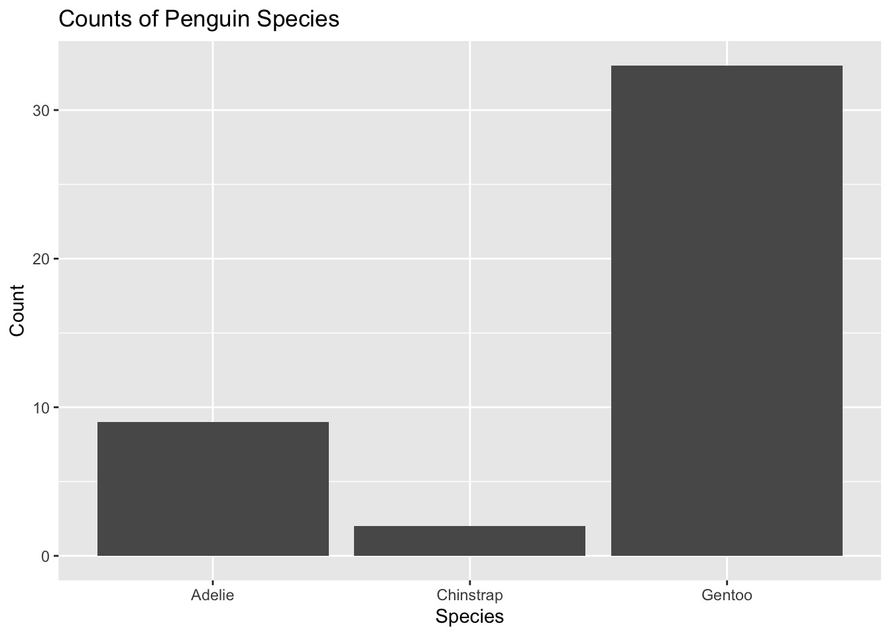
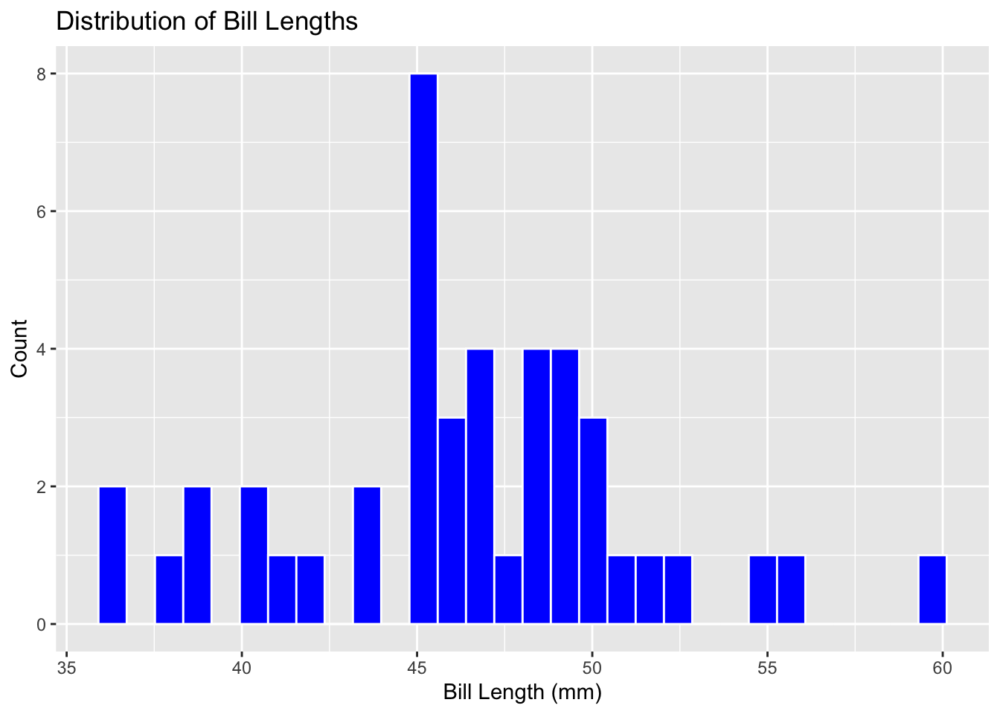
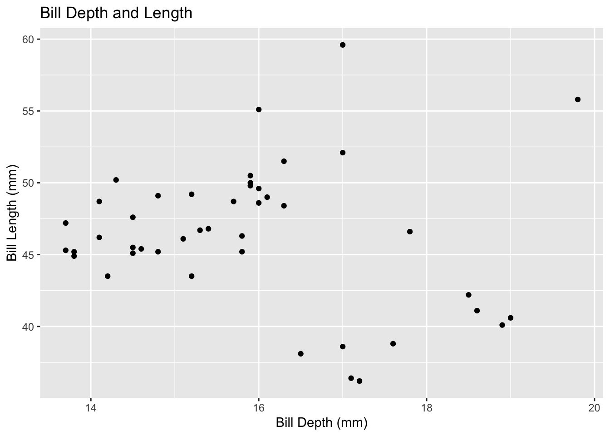
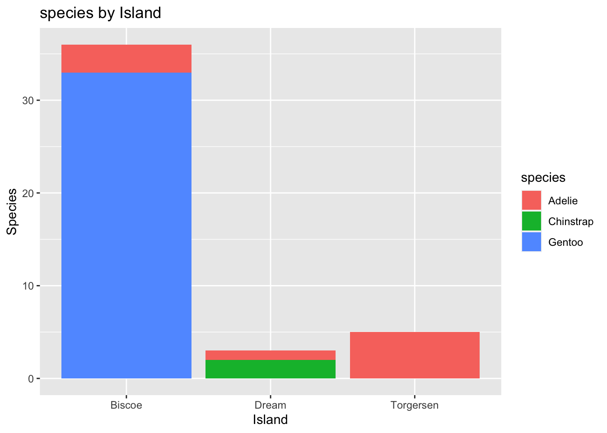
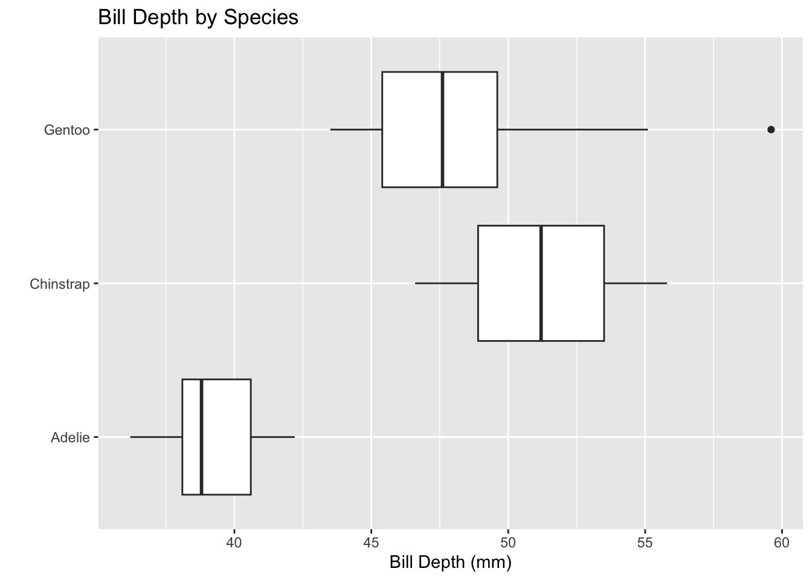
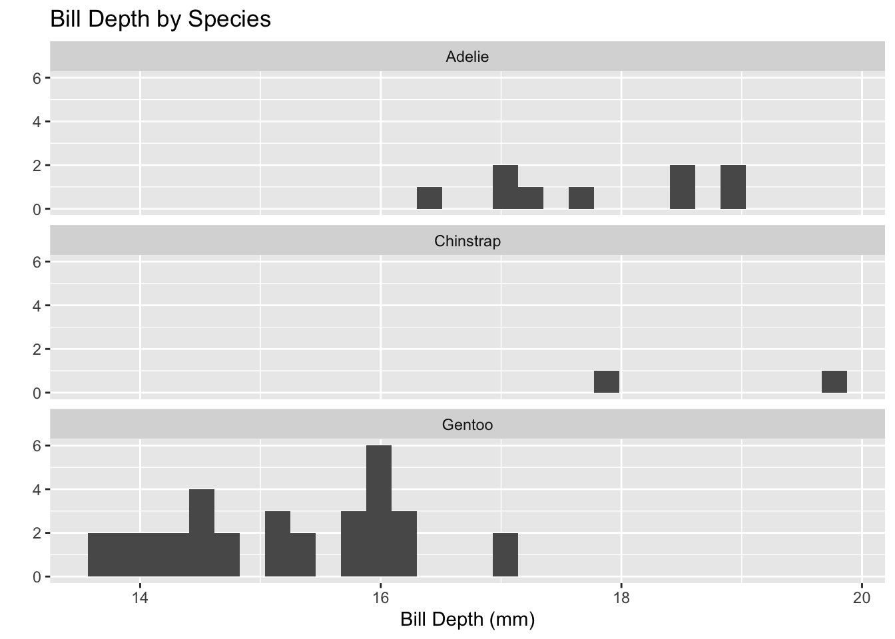
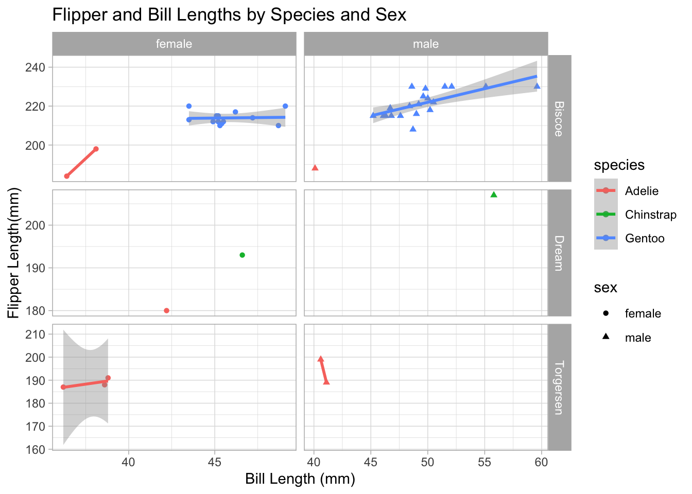

## Palmer Penguins

Some Informative blurb


::: {.cell}

```{.r .cell-code}
library(tidyverse) #load the tidyverse
```

::: {.cell-output .cell-output-stderr}
```
── Attaching packages ─────────────────────────────────────── tidyverse 1.3.2 ──
✔ ggplot2 3.4.0      ✔ purrr   1.0.0 
✔ tibble  3.1.8      ✔ dplyr   1.0.10
✔ tidyr   1.2.1      ✔ stringr 1.5.0 
✔ readr   2.1.3      ✔ forcats 0.5.2 
── Conflicts ────────────────────────────────────────── tidyverse_conflicts() ──
✖ dplyr::filter() masks stats::filter()
✖ dplyr::lag()    masks stats::lag()
```
:::

```{.r .cell-code}
#Read the penguines_sampl data off GITHub

penguins<- read_csv("https://raw.githubusercontent.com/mcduryea/Intro-to-Bioinformatics/main/data/penguins_samp1.csv")
```

::: {.cell-output .cell-output-stderr}
```
Rows: 44 Columns: 8
── Column specification ────────────────────────────────────────────────────────
Delimiter: ","
chr (3): species, island, sex
dbl (5): bill_length_mm, bill_depth_mm, flipper_length_mm, body_mass_g, year

ℹ Use `spec()` to retrieve the full column specification for this data.
ℹ Specify the column types or set `show_col_types = FALSE` to quiet this message.
```
:::

```{.r .cell-code}
#See the first six rows of data added to notebook

penguins %>% head()
```

::: {.cell-output .cell-output-stdout}
```
# A tibble: 6 × 8
  species island bill_length_mm bill_depth_mm flipper_leng…¹ body_…² sex    year
  <chr>   <chr>           <dbl>         <dbl>          <dbl>   <dbl> <chr> <dbl>
1 Gentoo  Biscoe           59.6          17              230    6050 male   2007
2 Gentoo  Biscoe           48.6          16              230    5800 male   2008
3 Gentoo  Biscoe           52.1          17              230    5550 male   2009
4 Gentoo  Biscoe           51.5          16.3            230    5500 male   2009
5 Gentoo  Biscoe           55.1          16              230    5850 male   2009
6 Gentoo  Biscoe           49.8          15.9            229    5950 male   2009
# … with abbreviated variable names ¹​flipper_length_mm, ²​body_mass_g
```
:::
:::


A data set containing general characteristics from a sample of the Gentoo penguin population on Biscoe Island.

## Data Manipulation

This section covers techniques for filtering rows, subsetting columns, grouping data, and computing summary statistics in R. Filtering rows allows you to select only those rows that meet certain criteria, while subsetting columns allows you to select only a subset of the available columns. R allows for these functions, as well as dividing the data set into groups based on common characteristics that can create new ways of interpreting information. Using Computing to create summary statistics involves calculating statistical measures such as mean, median, and standard deviation for each group. Understanding how to use R to accomplish this analysis is crucial for grouping and summarizing large quantities of data, which can be combined to answer complex questions about the whole set.

**Questions to consider about Penguins**

-   How does the body mass of different penguin species compare?

-   What is the distribution of beak length and depth among penguin species?

-   How does flipper size vary among different penguin species?

-   Is there a correlation between flipper size and body mass in penguins?

-   How does flipper size vary within a single penguin species over time?

-   How does flipper size differ between male and female penguins of the same species?

-   How does flipper size relate to the preferred habitat of a penguin species (is it larger in species that inhabit colder environments)?


    ::: {.cell}
    
    ```{.r .cell-code}
    library(kableExtra)
    ```
    
    ::: {.cell-output .cell-output-stderr}
    ```
    
    Attaching package: 'kableExtra'
    ```
    :::
    
    ::: {.cell-output .cell-output-stderr}
    ```
    The following object is masked from 'package:dplyr':
    
        group_rows
    ```
    :::
    :::

::: {.cell}

```{.r .cell-code}
penguins %>% 
  count(species,island) %>% 
  pivot_wider(names_from = species, values_from = n ,values_fill = 0) %>%
  kable() %>%
  kable_styling(bootstrap_options = c("hover", "striped"))
```

::: {.cell-output-display}

`````{=html}
<table class="table table-hover table-striped" style="margin-left: auto; margin-right: auto;">
 <thead>
  <tr>
   <th style="text-align:left;"> island </th>
   <th style="text-align:right;"> Adelie </th>
   <th style="text-align:right;"> Chinstrap </th>
   <th style="text-align:right;"> Gentoo </th>
  </tr>
 </thead>
<tbody>
  <tr>
   <td style="text-align:left;"> Biscoe </td>
   <td style="text-align:right;"> 3 </td>
   <td style="text-align:right;"> 0 </td>
   <td style="text-align:right;"> 33 </td>
  </tr>
  <tr>
   <td style="text-align:left;"> Dream </td>
   <td style="text-align:right;"> 1 </td>
   <td style="text-align:right;"> 2 </td>
   <td style="text-align:right;"> 0 </td>
  </tr>
  <tr>
   <td style="text-align:left;"> Torgersen </td>
   <td style="text-align:right;"> 5 </td>
   <td style="text-align:right;"> 0 </td>
   <td style="text-align:right;"> 0 </td>
  </tr>
</tbody>
</table>

`````

:::
:::

::: {.cell}

```{.r .cell-code}
penguins %>%
  summarize(
    "Minimum Bill Length (mm)" = min(bill_length_mm, na.rm = TRUE),
    "First Quartile Bill Length" = quantile(bill_length_mm, 0.25, na.rm = TRUE),
    "Median Bill Length" = median(bill_length_mm, na.rm = TRUE),
    "Average Bill Length (mm)" = mean(bill_length_mm, na.rm = TRUE),
    "Third Quartile Bill Length" = quantile(bill_length_mm, 0.75, na.rm = TRUE),
    "Standard Deviation of Bill Length" = sd(bill_length_mm, na.rm = TRUE)
    ) %>%
  pivot_longer(cols = everything()) %>%
  kable() %>%
  kable_styling(bootstrap_options = c("hover", "striped"))
```

::: {.cell-output-display}

`````{=html}
<table class="table table-hover table-striped" style="margin-left: auto; margin-right: auto;">
 <thead>
  <tr>
   <th style="text-align:left;"> name </th>
   <th style="text-align:right;"> value </th>
  </tr>
 </thead>
<tbody>
  <tr>
   <td style="text-align:left;"> Minimum Bill Length (mm) </td>
   <td style="text-align:right;"> 36.200000 </td>
  </tr>
  <tr>
   <td style="text-align:left;"> First Quartile Bill Length </td>
   <td style="text-align:right;"> 44.550000 </td>
  </tr>
  <tr>
   <td style="text-align:left;"> Median Bill Length </td>
   <td style="text-align:right;"> 46.450000 </td>
  </tr>
  <tr>
   <td style="text-align:left;"> Average Bill Length (mm) </td>
   <td style="text-align:right;"> 46.370455 </td>
  </tr>
  <tr>
   <td style="text-align:left;"> Third Quartile Bill Length </td>
   <td style="text-align:right;"> 49.125000 </td>
  </tr>
  <tr>
   <td style="text-align:left;"> Standard Deviation of Bill Length </td>
   <td style="text-align:right;"> 4.930379 </td>
  </tr>
</tbody>
</table>

`````

:::
:::

::: {.cell}

```{.r .cell-code}
chinstraps <- penguins %>%
  select(species, island, sex, year) %>%
  filter(species == "Chinstrap") %>%
  select(-species) # minus operator removes from selected list
  
chinstraps %>%
  head()
```

::: {.cell-output .cell-output-stdout}
```
# A tibble: 2 × 3
  island sex     year
  <chr>  <chr>  <dbl>
1 Dream  male    2009
2 Dream  female  2007
```
:::
:::

::: {.cell}

```{.r .cell-code}
penguins %>% #summarizing and groups tutorial
  group_by(species) %>%
  summarise(
    mean_bill_depth_mm = mean(bill_depth_mm, na.rm = TRUE),
    sd_bill_depth_mm = sd(bill_depth_mm, na.rm = TRUE))
```

::: {.cell-output .cell-output-stdout}
```
# A tibble: 3 × 3
  species   mean_bill_depth_mm sd_bill_depth_mm
  <chr>                  <dbl>            <dbl>
1 Adelie                  17.8            0.935
2 Chinstrap               18.8            1.41 
3 Gentoo                  15.2            0.951
```
:::
:::


### Data Visualization with ggplot

**Single-categorical variables**


::: {.cell}

```{.r .cell-code}
penguins %>%
ggplot() + 
  geom_bar(mapping = aes(x = species)) +
  labs(title = "Counts of Penguin Species",
       x = "Species", y = "Count")
```

::: {.cell-output-display}
{width=672}
:::
:::


**Single-Numerical Variable using histograms**


::: {.cell}

```{.r .cell-code}
penguins %>%
  ggplot() +
  geom_histogram(mapping = aes(x = bill_length_mm),
                 color = "white",
                 fill = "blue") +
  labs(title ="Distribution of Bill Lengths",
       x = "Bill Length (mm)", y = "Count")
```

::: {.cell-output .cell-output-stderr}
```
`stat_bin()` using `bins = 30`. Pick better value with `binwidth`.
```
:::

::: {.cell-output-display}
{width=672}
:::
:::


**Two-Variable Numerical Analysis**


::: {.cell}

```{.r .cell-code}
penguins %>%
  ggplot() +
  geom_point(mapping = aes(x = bill_depth_mm, y = bill_length_mm)) +
  labs(title = "Bill Depth and Length",
       x = "Bill Depth (mm)",
       y = "Bill Length (mm)")
```

::: {.cell-output-display}
{width=672}
:::
:::


-   Bill size seems to average around the 45-50mm length and 14-16mm depth.

-   Some outlying data in this set were around 40mm length and 17-18mm length

**Two-Variable Categorical Analysis**


::: {.cell}

```{.r .cell-code}
penguins %>%
  ggplot() +
  geom_bar(mapping = aes(x = island, fill = species)) +
  labs(title = "species by Island",
       x = "Island",
       y = "Species")
```

::: {.cell-output-display}
{width=672}
:::
:::


**conclusions:**

**Numerical & Categorical Comparison**: Boxplots


::: {.cell}

```{.r .cell-code}
penguins %>%
  ggplot() + 
  geom_boxplot(mapping = aes(x = bill_length_mm, y = species)) +
  labs(title = "Bill Depth by Species",
       x = "Bill Depth (mm)",
       y = "")
```

::: {.cell-output-display}
{width=672}
:::
:::


**Numerical & Categorical Comparison**: Faceted Plots


::: {.cell}

```{.r .cell-code}
penguins %>%
  ggplot() +
  geom_histogram(mapping = aes(x = bill_depth_mm)) +
  facet_wrap(~species, ncol = 1) + 
  
  # 'facet' is group of variables or expressions within the aes. 'wrap' allows for alterations of the col (ncol) and line (nrow) 
  
  labs(title = "Bill Depth by Species",
       x = "Bill Depth (mm)",
       y = "" )
```

::: {.cell-output .cell-output-stderr}
```
`stat_bin()` using `bins = 30`. Pick better value with `binwidth`.
```
:::

::: {.cell-output-display}
{width=672}
:::
:::


**Conclusions:**

## Advanced Plotting

**Two Continuous-Variable Comparison**

-   works with [both]{.underline} numerical and categorical variables

-   "continuous" may be one, or both of the variables


::: {.cell}

```{.r .cell-code}
penguins %>%
  filter(!is.na(sex)) %>%
  ggplot() +
  geom_point(mapping = aes(x = bill_length_mm, 
                           y = flipper_length_mm,
                           color = species,
                           shape = sex)) +
  
  # geom_point = SCATTERPLOT; useful for numerical, categorical, or combined comparisons. 
  
  geom_smooth(mapping = aes(x = bill_length_mm,
                            y = flipper_length_mm,
                            color = species),
              method = "lm") +
  # 'smooth' reduces the visual complexity of the geom (graph), can be altered in many different ways.
  
  facet_grid(island ~ sex, scales = "free") +
  labs(title = "Flipper and Bill Lengths by Species and Sex",
       x = "Bill Length (mm)",
       y = "Flipper Length(mm)") +
  theme_light()
```

::: {.cell-output .cell-output-stderr}
```
`geom_smooth()` using formula = 'y ~ x'
```
:::

::: {.cell-output .cell-output-stderr}
```
Warning in qt((1 - level)/2, df): NaNs produced

Warning in qt((1 - level)/2, df): NaNs produced
```
:::

::: {.cell-output .cell-output-stderr}
```
Warning in max(ids, na.rm = TRUE): no non-missing arguments to max; returning
-Inf

Warning in max(ids, na.rm = TRUE): no non-missing arguments to max; returning
-Inf
```
:::

::: {.cell-output-display}
{width=672}
:::
:::
